# 六、攻击接入点和基础设施

在[第 5 章](5.html "Chapter 5. WPA/WPA2 Cracking")*WPA/WPA2 破解*中，我们学习了如何在 WPA 个人模式下破解 WPA 预共享密钥。还有另一种恢复 PSK 的方法；攻击 AP 以利用**Wi-Fi 保护设置**（**WPS**中的漏洞进行攻击。在这一章中，我们将介绍此次攻击、针对 WPA Enterprise 的攻击以及针对接入点和网络基础设施的其他攻击，并解释 Kali Linux 中实施此类攻击的技术和工具。

我们将要讨论的主题是：

*   针对受 Wi-Fi 保护的设置的攻击
*   攻击 WPA 企业
*   拒绝服务攻击
*   流氓接入点
*   攻击 AP 身份验证凭据

# 针对 Wi-Fi 保护设置的攻击

WPS 是 Wi-Fi 联盟在 2006 年推出的一种访问点的安全机制，允许客户端更轻松地连接到无线网络，提供 8 位 PIN 而不是预共享密钥。如果 PIN 码正确，AP 向客户端提供 WPA PSK，以便向网络进行身份验证。

WPS 规范还支持一种**按钮连接**（**PBC**）方法，即在 AP 和客户端设备上同时按下一个按钮来启动连接。

2011 年，Stefan Viehböck 和 Craig Heffner 两位研究人员独立发现了 WPS 中的一个漏洞，该漏洞可使攻击者通过暴力攻击在数小时内恢复 PIN 并访问网络。Heffner 还开发并发布了一个实现这种攻击的工具，**Reaver**。

该缺陷存在于 AP 检查 PIN 的方式中。事实上，八位 PIN 并没有全部发送到 AP，只发送和检查前半部分，如果正确，则发送和验证后半部分。如果前半部分不正确，则 AP 向客户端发送否定响应。因此，AP 独立检查销的两半。

此外，PIN 的最后一位数字是其他七位数字的校验和，因此可以从中导出。

通过这种方式，攻击者可以尝试猜测 PIN 的前四位最多尝试*10^4=10000*值，然后猜测第二位最多有*10^3=1000*可能性，与*10^7=10000000*相比，总共有 11000 个可能值与整个销的可能组合。这在蛮力攻击中起到了很大的作用，大大减少了执行该攻击所需的时间。

可以在接入点的管理面板中禁用 WPS。在这种情况下，我们启用它，保留 AP 的预配置 PIN，以演示攻击如何工作，如以下屏幕截图所示：

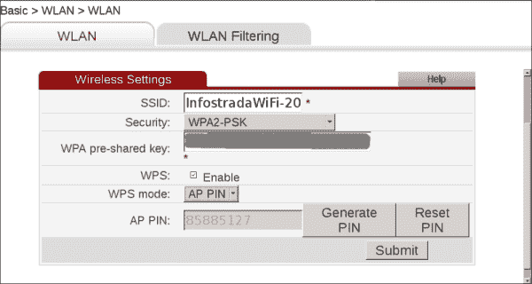

最近的 AP 型号在经过一定次数的猜测后实现了锁定机制。

多米尼克·邦加德（Dominique Bongard）最近（2014 年）引入了另一种针对 WPS 的攻击类型**Pixie Dust**攻击。恢复 PIN 是一种*离线*蛮力攻击，而之前由 Reaver 看到并实施的是一种在线攻击，持续与 AP 交互。

Pixie Dust 攻击极大地提高了 WPS PIN 恢复过程的速度，在最坏的情况下将所需时间减少到几秒钟或几分钟。

攻击的技术细节可在[找到 http://archive.hack.lu/2014/Hacklu2014_offline_bruteforce_attack_on_wps.pdf](http://archive.hack.lu/2014/Hacklu2014_offline_bruteforce_attack_on_wps.pdf) 。

一个名为**Pixiewps**的工具，用 C 语言编写，已经被开发为证明 Pixie 尘埃攻击的概念代码。此工具已与社区分叉版本的 Reaver（Reaver-wps-fork-t6x）集成，以支持此新攻击。

并非所有 AP 都易受攻击；脆弱 AP 模型的数据库位于[https://docs.google.com/spreadsheets/d/1tSlbqVQ59kGn8hgmwcPTHUECQ3o9YhXR91A_p7Nnj5Y/edit#gid=2048815923](https://docs.google.com/spreadsheets/d/1tSlbqVQ59kGn8hgmwcPTHUECQ3o9YhXR91A_p7Nnj5Y/edit#gid=2048815923) 。

在下一小节中，我们将看到如何使用 Reaver 恢复在线和离线暴力攻击类型的 WPS PIN。

## 收割者

Reaver 是一个命令行工具，可以强制执行 WPS PIN。在启动该计划之前，我们必须确定我们的目标，这些目标是启用 WPS 且未针对暴力攻击锁定的接入点。就是在这里有一个叫做**Wash**的工具来帮助我们，一个与收割者捆绑在一起的 WPS 扫描仪。

执行在线暴力攻击的步骤包括：

1.  首先，我们需要将无线接口置于监控模式，使用通常的命令：

    ```
    airmon-ng start wlan0

    ```

2.  To scan for WPS enabled APs, we execute the following command:

    ```
    wash -i mon0 -C

    ```

    

    Wash 显示有关检测到的 AP 的信息，例如 BSSID、信道、使用的 WPS 版本、WPS 是否锁定以及 ESSID。

3.  We choose the target AP and run Reaver to recover the WPS PIN:

    ```
    reaver -i mon0 -b 08:7A:4C:83:0C:E0

    ```

    这里，`-b`选项指定 AP 的 MAC 地址。

    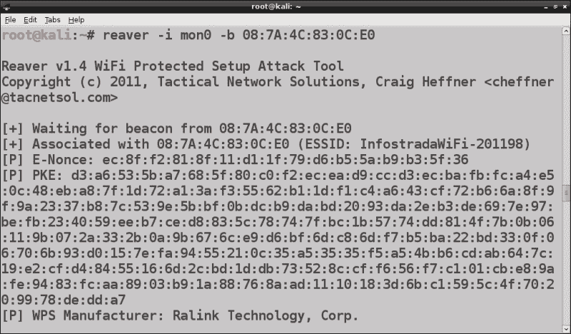

收割者尝试每一个可能的 PIN 组合并等待响应，因此通常需要几个小时来完成攻击，即使可能的 PIN 组合不太多。

要执行离线 Pixie Dust 攻击，我们必须使用 reaver-wps-fork-t6x 版本，它对应于 1.5.2 版本的 reaver。此版本需要 Pixiewps，并且建议升级至机组 ng 的最新版本（在撰写本文时），1.2 RC2。更新的 Reaver、pixiewps 和更新的 Aircrack ng 可在 Kali Linux 存储库中获得。

我们遵循以下步骤：

1.  We upgrade the software with the command:

    ```
    apt-get install aircrack-ng reaver

    ```

    请注意，pixiewps 也是作为依赖项安装的。

    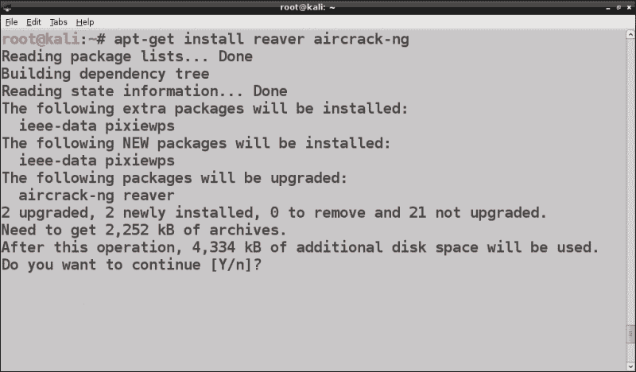

2.  We then put the wireless interface in monitor mode with `airmon-ng start wlan0`:

    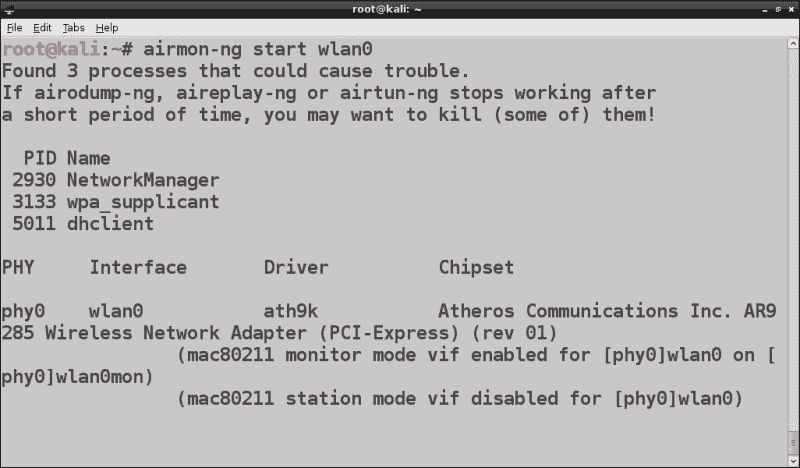

    我们可以看到，在新版本的 Aircrack ng 中，虚拟监视器接口被命名为`wlanXmon`而不是`monX`。

3.  To execute the attack, we run the following command:

    ```
    reaver -i wlan0mon -b 08:7A:4C:83:0C:E0 -vvv -K 1

    ```

    这里的`-i`选项指定了我们的监视器接口，`-b`AP MAC 地址，`-vvv`是最详细的输出模式，`-K 1`指定了 Pixie Dust 攻击。

    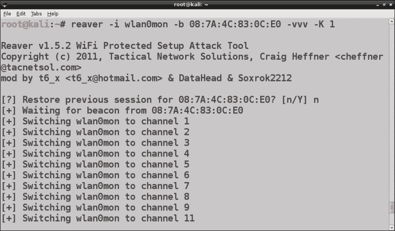

在下面的屏幕截图中，我们注意到 pixiewps 被调用并立即发现 PIN：


Pixie Dust 攻击显示了如何轻松快速地恢复 WPS PIN，因此，强烈建议禁用 WPS。

# 攻击 WPA 企业

正如的名字所说，WPA Enterprise 是企业网络中使用的身份验证模式。

在 WPA 企业中，AP 不会像 WPA 个人模式那样对客户端进行身份验证，而是将其委托给**身份验证服务器**（**as**），该服务器通过 RADIUS 协议与 AP 进行通信。

AP 和 AS 之间交换的身份验证数据包使用**可扩展身份验证协议**（**EAP**），特别是 LAN 上的**EAP**（**EAPOL**），一种在 802.1x 标准中定义的用于有线 LAN 身份验证的协议。AP（认证器）充当中继，在客户端（请求者）和 as 这两方之间转发认证数据包。

EAP 是一个认证框架，而不是单一的协议，有多种类型，其中最重要的是：

*   **轻型 EAP****LEAP**
*   EAP-MD5
*   EAP-TLS
*   EAP-FAST
*   EAP-TTLS
*   峰值

最后三种是企业网络使用的最常见的 EAP 类型。认证过程通过 EAP 握手进行，如下图中 EAP-TLS 所示：

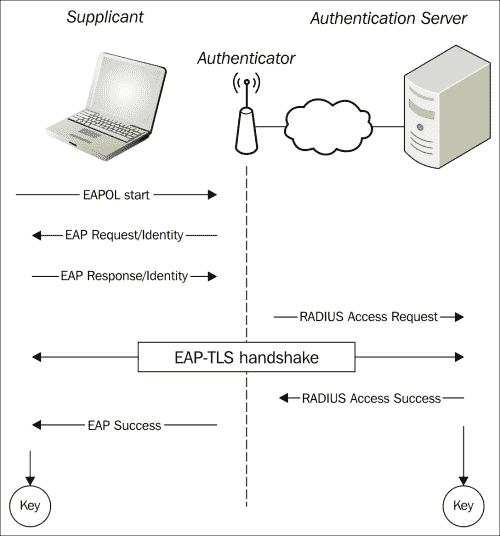

LEAP 和 EAP-MD5 不推荐使用，因为它们容易受到暴力和字典攻击，并且不验证身份验证服务器的证书。

LEAP 基于 MS-CHAPv2，这是一种质询响应协议，以明文形式传输身份验证数据，允许攻击者检索数据并发起暴力攻击以获取凭据。

EAP-MD5 还容易受到脱机字典和暴力攻击。

EAP-TLS 是原始的 WPA 企业标准身份验证协议，由于它依赖于**传输层安全**（**TLS**），因此是安全的。除了服务器端证书外，TLS 还需要客户端证书验证，因此组织需要部署**公钥基础设施**（**PKI**）来管理用户的证书。

这阻止了 EAP-TLS 在 WPA 企业实施中的广泛应用，为采用 EAP-FAST、EAP-TTL，尤其是 PEAP 留下了空间，它们不要求验证客户端的证书，但仍然是安全的，因为它们基于 TLS。

实际上，这些协议利用了封装内部身份验证协议的 TLS 隧道。例如，在 Microsoft Windows 实现中，PEAP 使用 MS-CHAPv2，如 LEAP，但封装在 TLS 隧道中。

下表总结了 EAP 身份验证类型及其主要功能：


在以下部分中，我们将看到针对 WPA 企业的攻击的实际示例。

## 建立 WPA 企业网络

为了了解攻击在实践中是如何工作的，我们必须将接入点配置为使用 WPA Enterprise 并设置 RADIUS 服务器。

由于许多消费者 AP 不支持 WPA Enterprise，并且设置 RADIUS 服务器是一项繁琐的操作，因此一个实用的解决方案是安装**hostapd wpe**（**hostapd Wireless Pwnage Edition**），这是**hostapd**工具的补丁版本，这让我们可以用无线接口创建一个虚拟 AP。

由 Joshua Wright（Cowpatty 和其他无线安全工具的作者）和 Brad Antoniewicz 开发的 Hostapd wpe 附带了捆绑的 FreeRADIUS wpe 服务器，这是 FreeRADIUS 服务器的一个补丁，可大大简化其配置。

Hostapd wpe 最近已经取代了 FreeRADIUS wpe 项目本身。它不是预先安装在 Kali Linux 上的，所以我们需要下载并安装它。

要设置虚拟的 WPA 企业启用 AP，我们将执行以下步骤：

1.  We first install the necessary libraries:

    ```
    apt-get update; apt-get install libssl-dev libnl-dev

    ```

    hostapd 的最新版本是 2.4，但我们必须下载并安装 2.2 版本，因为`hostapd-wpe`修补程序仅支持此版本（在撰写本书时）。我们使用以下命令下载 hostapd：

    ```
    wget http://w1.fi/releases/hostapd-2.2.tar.gz

    ```

2.  接下来，我们从其 Git 存储库下载`hostapd-wpe`补丁：

    ```
    git clone https://github.com/OpenSecurityResearch/hostapd-wpe

    ```

3.  我们提取 hostapd tar 归档并移动到提取的目录：

    ```
    tar -xzf hostapd-2.2.tar.gz; cd hostapd-2.2

    ```

4.  现在，我们必须应用`hostapd-wpe`补丁：

    ```
    patch -p1 < ../hostapd-wpe/hostapd-wpe.patch

    ```

5.  我们进入`hostapd`目录并编译：

    ```
    cd hostapd; make

    ```

6.  编译完成后，我们进入`certificate`目录，运行引导脚本生成自签名证书：

    ```
    cd ../../hostapd-wpe/certs; ./bootstrap

    ```

7.  Before executing `hostapd-wpe`, we have to edit its configuration file `hostapd-wpe.conf` located in the `hostapd-2.2/hostapd` directory. We must set `interface=wlan0` in the `# Interface` section, comment out the `driver=wired` line in the `#Driver` section and uncomment the `802.11 Options`, specifying the SSID we want the AP to use.

    

8.  Once we have saved the configuration file, we can run the program by using the following command:

    ```
    ./hostapd-wpe hostapd-wpe.conf

    ```

    

现在我们已经建立了我们的 WPA 企业网络，我们准备攻击 EAP。

## 针对 EAP 的攻击

为了对 EAP 进行攻击，我们执行以下步骤：

1.  首先，我们需要捕获 EAP 握手，这可以通过`airodump-ng`完成，就像我们在上一章中看到的捕获 WPA 四向握手的方式一样：

    ```
    airodump-ng --channel <nr> --bssid <AP_MAC_ADDR> --write eap_crack mon0

    ```

2.  To attack a specific EAP implementation, we have to determine the EAP type in use. Airodump-ng does not tell us the EAP type, so we must analyze the EAP handshake packet capture with a packet analysis tool like Wireshark.

    要运行它，我们导航到应用程序菜单**Kali Linux****嗅探/欺骗****网络嗅探器****Wireshark**。

3.  We open our capture file and should see a window like in the following screenshot:

    

4.  We filter the packets with the expression `eap`, to display only those that interest us:

    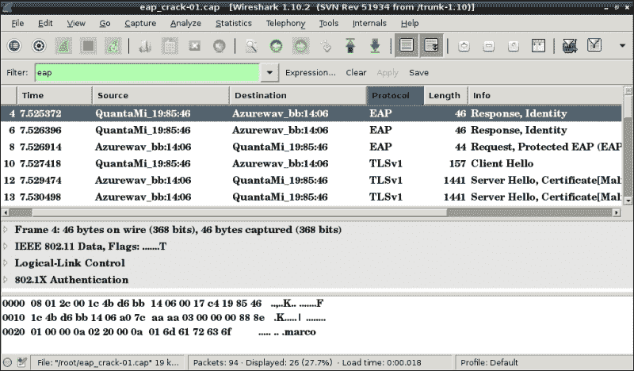

5.  Scrolling down the packet listing panel, we will notice the EAP handshake packets in the **Info** column, as shown in the following screenshot:

    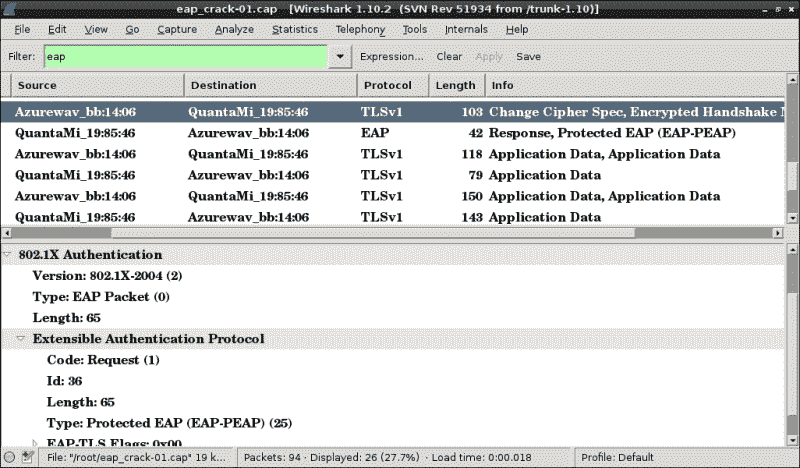

6.  Having discovered the EAP type, now we can proceed with the attack. If the authentication server uses LEAP or EAP-MD5 then we can use two tools that implement these attacks respectively: `asleap` and `eapmd5pass`, both developed by Joshua Wright.

    要使用 asleap，我们必须使用`genkeys`工具从字典文件生成哈希表：

    ```
    genkeys -r wordlist.txt -f wordlist.hash -n wordlist.idx

    ```

    然后，将哈希表连同捕获文件一起传递到`asleap`：

    ```
    asleap -r eap_crack-01.cap -f wordlist.hash -n wordlist.idx

    ```

    `Eapmd5pass`工作方式类似，以捕获文件和字典文件作为输入参数。

只有当攻击者拥有客户端的私钥并因此向身份验证服务器模拟该私钥时，EAP-TLS 才有可能受到攻击。

如果客户端不验证身份验证服务器的证书，PEAP 和 EAP-TTLS 可能会受到攻击。攻击者可以设置一个伪造的 AP 并模拟合法的 AP，从而破坏 TLS 加密隧道并让他攻击内部身份验证协议。

在下一小节中，我们将以 PEAP 为例，因为它是部署最多的 EAP 类型。

### 攻击 PEAP

在本例中，我们使用一个默认情况下支持 MS-CHAPv2 的 PEAP 的 Windows 客户机。

1.  To connect to our previously created virtual AP, we must manually add a wireless connection in **Control Panel** | **Network and Internet** | **Network and Sharing Center** | **Manage Wireless networks**.

    我们选择**手动创建网络配置文件**，然后输入我们 AP 的 SSID（`hostapd-wpe`作为网络名称，选择**WPA Enterprise**作为安全类型：

    

2.  In the subsequent window, we click on the **Change connection** settings, then on the **Security** tab and on **Settings…**:

    

3.  We uncheck the **Validate server certificate** option to disable the server certificate validation by the client:

    

4.  我们将 EAP-MSCHAPv2 作为身份验证方法，单击**配置…**按钮，然后取消选中**Windows 域登录身份验证**选项。
5.  Next, we start `hostapd-wpe` on the Kali Linux machine with the following command:

    ```
    hostapd-wpe hostapd-wpe.conf

    ```

    正如我们所看到的，这个命令启动一个 AP，其中`hostapd-wpe`作为 SSID。

6.  We connect the Windows client to the `hostapd-wpe` network and we are prompted to input a username and a password. In this case, we can give any credentials we want, just to demonstrate the attack. The password here is `my_eap_password`:

    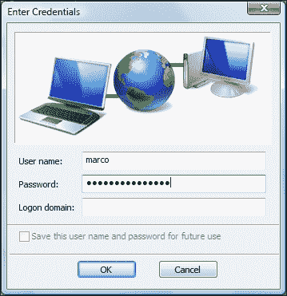

7.  In the `hostapd-wpe` terminal window logs, we can observe this authentication attempt, with the challenge and the response of the MSCHAPv2 protocol:

    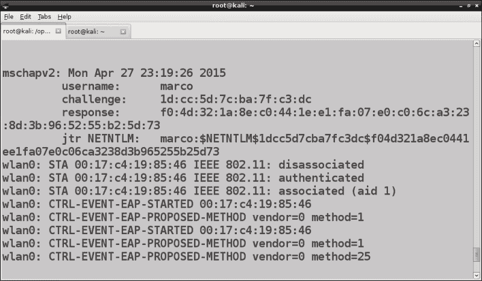

8.  This is all we need to launch an offline dictionary attack with `asleap`, passing the challenge and the response to the program with the `-C` and `-R` options, respectively:

    ```
    asleap -C 1d:cc:5d:7c:ba:7f:c3:dc -R f0:4d:32:1a:8e:c0:44:1e:e1:fa:07:e0:c0:6c:a3:23:8d:3b:96:52:55 :b2:5d:73 -W wordlist.txt

    ```

    

# 拒绝服务攻击

无线网络可能遭受以客户端和 AP 为目标的**拒绝服务**（**拒绝服务**攻击。

这种攻击可以通过连续发送广播反验证数据包来执行，以强制断开连接并防止客户端重新连接。

完成此任务的工具是`aireplay-ng`，命令如下：

```
aireplay-ng --deauth 0 -a 08:7A:4C:83:0C:E0 mon0

```


在该命令中，`0`选项表示持续发送反认证数据包，只指定 AP 的 MAC 地址，使用`-a`选项。我们也可以针对单个无线客户端，正如我们将在[第 7 章](7.html "Chapter 7. Wireless Client Attacks")中看到的，*无线客户端攻击*。

在下一小节中，我们将介绍另一种针对无线网络执行 DoS 的工具 MDK3。

## MDK3 的 DoS 攻击

MDK3 支持以下方式对无线网络进行 DoS 攻击：

*   信标（SSID）泛洪模式
*   认证拒绝服务
*   取消身份验证/解除关联（Amok）模式

在信标泛洪模式下，MDK3 发送大量信标帧，广告虚假 AP。此方法主要不是针对 DoS 攻击而设计的，但有时可能会导致网络扫描仪和无线适配器的驱动程序崩溃，从而阻止客户端连接到网络。此外，它可以将合法 AP 隐藏在众多假冒 AP 中，最终使用非常相似的 SSID，这使得客户端很难识别他们想要连接的合法网络。

要使用 MDK3，我们首先需要使用`airmon-ng start wlan0`命令将无线接口置于监控模式。

要运行信标泛洪攻击，请执行以下命令：

```
mdk3 mon0 b -f SSIDs

```

此处，`b`选项用于信标泛洪模式，`-f`指定一个包含用于 AP 的 SSID 名称列表的文件。如果未指定`-f`选项，则使用随机 SSID。如果我们想使用特定频道，我们需要使用`-c`选项：


身份验证洪泛模式意味着向 AP 发送许多身份验证请求，而 AP 可能无法处理这些请求，因此会冻结。这并不总是起作用，并且可能需要运行多个 MDK3 实例才能使此攻击成功。

在这种情况下，命令的语法很简单，如下所示：

```
mdk3 mon0 a -a 08:7A:4C:83:0C:E0

```

此处`a`表示认证泛洪模式，`-a`指定目标 AP 的 MAC 地址：


我们注意到目标 AP 似乎不易受到这种攻击方法的攻击。

DoS 攻击最有效的方法是反身份验证/解除关联（Amok）模式，该模式发送反身份验证帧以断开客户端与 AP 的连接。为了使用`mdk3`执行此攻击，我们首先将目标 AP 的 MAC 地址保存在黑名单文件中。然后，我们运行以下命令：

```
mdk3 mon0 d -b blacklist_file

```

此处，`d`显然是用于反验证/解除关联模式，`-b`选项指定要使用的黑名单文件，此处仅包含一个目标 AP：

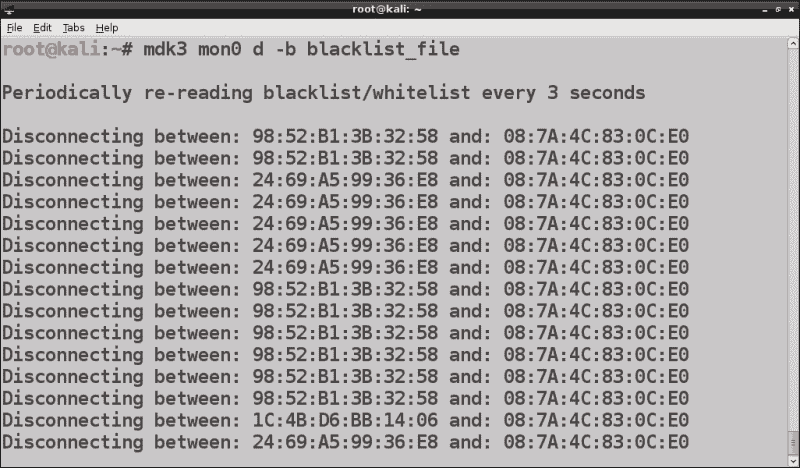

# 流氓接入点

到目前为止，我们已经涵盖了针对无线网络的未经验证的攻击、破解 WEP 或 WPA 密钥、攻击 WPA Enterprise、恢复 WPS PIN 以及访问此类网络。

在本节中，我们将介绍一种假设攻击者（内部或外部）控制已连接到有线 LAN 的计算机的攻击：rogue 访问点。

实际上，恶意 AP 是未经授权安装在 LAN 上的接入点，攻击者可以将其用作网络后门。

恶意 AP 可以通过物理方式安装，也可以通过软件（软 AP）安装。物理 AP 的安装涉及破坏网络的物理安全策略，并且更容易识别。我们将看到如何安装一个恶意软 AP 并将其连接到有线 LAN。

我们可以用`hostapd-wpe`完成这项任务，但这里我们使用了来自 Aircrack ng 套件的工具`airbase-ng`。

我们使用 airmon ng 将无线接口置于监控模式，并运行以下命令：

```
airbase-ng --essid Rogue-AP -c 1 mon0

```


我们注意到创建了一个 tap 接口`at0`。为了能够通信，我们必须在流氓 AP 和有线网络之间建立一座桥梁，从而在`at0`和以太网（`eth0`接口之间建立桥梁。

为此，我们安装了`bridge-utils`实用程序：

```
apt-get install bridge-utils

```

我们创建名为`bridge-if`的桥接接口：

```
brctl addbr bridge-if

```

然后我们将`at0`和`eth0`接口连接到`bridge-if`：

```
brctl addif bridge-if eth0; brctl addif bridge-if at0

```

我们使用以下命令打开接口：

```
ifconfig eth0 0.0.0.0 up; ifconfig at0 0.0.0.0 up

```

我们还需要启用内核级 IP 转发，因为恶意 AP 充当无线和有线网络之间的路由器：

```
sysctl -w net.ipv4.ip_forward=1

```

否则，我们执行以下命令，其效果相同：

```
echo 1 > /proc/sys/net/ipv4/ip_forward

```

当客户端连接到恶意 AP 时，`airbase-ng`在其日志中显示：


运行`airodump-ng`，我们可以看到我们的流氓 AP 的详细信息：

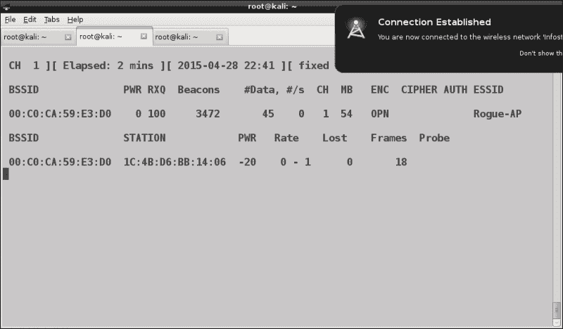

身份验证的类型是开放的，因此没有身份验证和加密，因为恶意 AP 通常是默认设置的。这可以使 AP 易于检测，因为开放的无线网络会立即引起渗透测试人员或网络管理员的注意。

流氓 AP 也可以设置为使用 WEP 或 WPA/WPA2。例如，要使用 WPA2-CCMP 运行 AP，我们将执行以下命令：

```
airbase-ng --essid Rogue-AP -c 1 -Z 4 mon0

```

这里，`-Z`选项用于 WPA2（`-z`用于 WPA），值`4`用于 CCMP。

在下面的截图中，我们可以看到`airodump-ng`的输出：

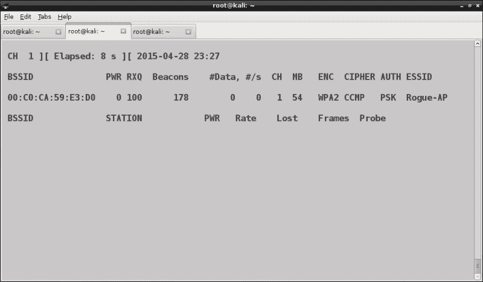

我们也可以通过使用`-X`选项而不是`–essid`选项运行`airbase-ng`来启动隐藏的流氓 AP：

```
airbase-ng -X -c 1 mon0

```

恶意 AP 对网络安全构成严重威胁，因为它们允许未经授权访问网络，绕过防火墙和 IDS 等安全系统。实际上，连接到恶意 AP 的攻击者可以对本地网络、连接的服务器和客户端发起攻击。攻击者还可以创建一个恶意 AP 来模拟合法 AP，并对无线客户端进行中间人攻击，我们将在下一章中看到。

# 攻击 AP 认证凭证

家庭路由器和 AP 提供一个 web 管理面板，用于配置通常无法从 Internet 访问但只能从本地网络访问的设备。

一个看起来像原子的安全方面，但通常认为不够重要，就是默认身份验证凭据。

不更改默认用户名和密码以访问 AP 管理界面是一种常见的做法，许多型号都预先配置了诸如 admin/admin 等微不足道的凭据。在 Web 上，具有相对默认凭据的 AP 和路由器型号列表可用。即使修改了默认凭据，也经常选择弱密码。

这是一个严重的安全问题，因为如果攻击者控制 AP，他/她可以通过在网络上执行中间人攻击、嗅探流量、更改 DNS 设置以及发起 pharming 和 phishing 攻击来危害整个网络。

可以用来破解 HTTP 身份验证凭据的工具是**hydra**，一种支持各种协议的在线密码破解工具。该程序还有一个 GUI，hydra gtk。两个都安装在 Kali Linux 上。

Hydra 将用户名或用户名列表和密码列表作为输入，并针对指定目标尝试所有可能的组合。

欲了解更多关于 Hydra 的信息以及如何使用它破解密码，请参阅手册页面和项目网站[https://www.thc.org/thc-hydra/](https://www.thc.org/thc-hydra/) 。

近年来，已开发出允许甚至从 Internet 访问路由器/AP 管理面板的攻击。这方面的一个例子是**DNS 重新绑定**攻击，攻击者滥用 DNS 为受害者的浏览器提供针对内部网络的恶意客户端脚本。因此，浏览器充当攻击者的内部代理来攻击并控制路由器/AP。近几年来，这种攻击已变得十分普遍。

实施 DNS 重新绑定攻击的工具称为**重新绑定**，由 Craig Heffner 编写，包含在 Kali Linux 中。更多的信息可在节目网页[上找到 https://code.google.com/p/rebind/](https://code.google.com/p/rebind/) 。要了解攻击的细节，请阅读 Heffner 的白皮书*针对 SOHO 路由器的远程攻击*[https://media.blackhat.com/bh-us-10/whitepapers/Heffner/BlackHat-USA-2010-Heffner-How-to-Hack-Millions-of-Routers-wp.pdf](https://media.blackhat.com/bh-us-10/whitepapers/Heffner/BlackHat-USA-2010-Heffner-How-to-Hack-Millions-of-Routers-wp.pdf) 。

# 总结

在本章中，我们介绍了针对接入点和网络的攻击，特别是针对 WPS 和 WPA Enterprise 的攻击，如何设置恶意 AP，DoS 攻击和 AP 身份验证攻击。

在[第 7 章](7.html "Chapter 7. Wireless Client Attacks")、*无线客户端攻击*中，我们将看到针对无线客户端的攻击，如蜜罐和邪恶孪生 AP、Caffe Latte 和 Hirte 攻击、中间人攻击、客户端反验证等。