# 使用漏洞扫描程序

安全漏洞的发现和分析在渗透测试中起着重要作用。在渗透测试人员或道德黑客能够成功发起攻击之前，他们必须能够识别攻击表面上的安全弱点。攻击面是攻击者可以尝试进入或从系统中过滤数据的区域。快速识别漏洞并获得严重性评级的一种战略方法是使用已知且信誉良好的漏洞扫描器。

业内有许多流行且知名的漏洞扫描工具，如 Acunetix、OpenVAS、Qualys、Nexpose、Nikto、Retina 网络安全扫描工具和 Nessus 等。了解所有这些工具是一个好主意，但您不会希望运行所有工具，因为其中一些是商业和基于订阅的服务。

选择漏洞扫描程序作为首选非常重要，因为很多时候，产品供应商可能无法提供足够快的更新来检测系统中的威胁和弱点，这对于渗透测试人员来说可能至关重要。想象一下，运行扫描以确定系统是否容易受到特定攻击，并且您使用的工具不包含用于检测此类漏洞的签名更新；结果可能不会有成果。

在本章中，我们将探讨如何使用 Nessus 作为首选漏洞扫描工具。

在本章中，我们将探讨以下脆弱性评估工具和主题：

*   Nessus 及其政策
*   使用 Nessus 进行扫描
*   导出 Nessus 结果
*   分析 Nessus 结果
*   使用 web 应用程序扫描程序

# 技术要求

本章的技术要求如下：

*   卡利 Linux:[https://www.kali.org/](https://www.kali.org/)
*   内苏斯（精华）：[https://www.tenable.com/products/nessus/nessus-essentials](https://www.tenable.com/products/nessus/nessus-essentials)
*   WordPress 服务器：[https://www.turnkeylinux.org/wordpress](https://www.turnkeylinux.org/wordpress)

# Nessus 及其政策

Nessus 是业界最受欢迎和最负盛名的漏洞扫描器之一，被网络安全领域的许多专业人士使用。它已成为网络安全专业人员进行漏洞评估的事实上的行业标准。使用 Nessus 的一些好处包括：

*   发现 45000 多个**常见漏洞和暴露**（**CVEs**）
*   包含超过 100000 个插件（用于发现漏洞）
*   针对新披露的漏洞频繁更新新插件
*   能够识别过去三年中超过 100 个零日漏洞

让我们在 Kali Linux 机器上登录 Nessus；首先，您需要在终端窗口中使用以下命令启用 Nessus 服务：

```
service nessusd start
```

成功启用服务后，在 Kali Linux 中打开 web 浏览器，在地址栏中输入`https://localhost:8834`，然后点击*输入*。您应该看到以下登录门户：


使用安装过程中创建的用户帐户登录。登录后，主仪表板即可用。在这里，您可以配置和访问策略和插件规则，创建新的扫描，并查看结果。Nessus 用户界面是一个非常简单易用的界面，在很短的时间内您将非常熟悉它。

# Nessus 政策

在 Nessus 应用程序中，有许多用于各种目的的现有策略，并且经常向数据库中添加新策略。Nessus 策略是控制目标系统上扫描的技术方面的参数。为了进一步阐述，扫描的技术方面可以包括要扫描的主机设备的数量、端口号和服务、协议类型（TCP、UDP 和 ICMP）、端口扫描器的类型等。

Nessus 策略还允许在基于 Windows 的操作系统、数据库应用程序（如 Oracle 平台）和其他应用层协议（如 FTP、POP 和 HTTP）上使用凭据（用户名和密码）进行本地扫描。

有一些预安装的策略可帮助安全从业人员在系统上执行法规遵从性审核。例如，使用**内部 PCI 网络扫描**检查处理支付卡交易的网络是否易受攻击。此策略将根据**支付卡行业数据安全标准**（**PCI DSS**检查任何漏洞。

Nessus 策略允许通过将哈希校验和与目标系统上的良好和恶意文件进行比较，扫描 Windows 操作系统上的恶意软件感染。在确定网络上感染某种类型恶意软件的主机数量时，此策略非常方便。

要开始了解 Nessus 上的策略，请确保您当前已登录 Nessus。在左侧窗格中，单击**策略**。以下屏幕截图显示 Nessus home edition 中当前可用的策略。但是，如果您想解锁其他插件和策略，则需要购买专业版：

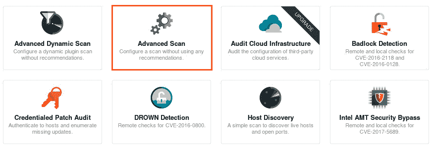

如前所述，策略包含用于扫描目标以搜索特定漏洞并确保系统符合法规遵从性标准的预定义配置。但是，作为安全专业人员，您需要自定义自己的扫描策略，以便对各种类型的系统执行漏洞评估。

# 内苏扫描

使用 Nessus 执行漏洞扫描非常简单。在本节中，我将指导您完成创建自定义扫描的过程。

要创建新扫描，请使用以下步骤：

1.  在右上角，单击新扫描按钮，如以下屏幕截图所示：

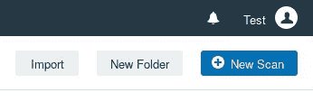

2.  您可以选择使用可用的预定义策略之一。如果要为目标创建自定义扫描，请选择高级扫描策略，如以下屏幕截图所示：


3.  “策略/扫描向导”将打开，为您提供许多自定义新扫描的选项。在“常规”选项卡上，确保插入名称和说明，因为它们将有助于识别此新扫描/策略的用途；确保包括您的目标：


4.  您可以选择计划扫描/策略的运行频率：一次、每天、每周、每月或每年。此功能允许在目标系统上自动运行定期漏洞扫描。如果您决定创建扫描计划，可以使用选项设置日期和时间、时区以及重复频率：

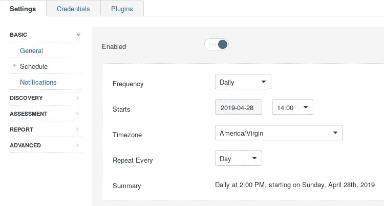

5.  如果要接收扫描状态的电子邮件通知，只需单击“通知”选项卡并输入收件人的电子邮件地址。但是，请确保已配置 SMTP 服务器设置，该设置将处理电子邮件通知的传递。
6.  要访问 SMTP 服务器设置，请转到`https://localhost:8834/#/settings/smtp-server`。

“发现”选项卡包含以下选项：

“评估”选项卡包含以下选项：

以下屏幕截图显示了上一节中概述的选项：


7.  完成自定义策略后，单击保存。新策略/扫描将在“我的扫描”文件夹（左面板）中提供。要启动新创建的策略/扫描，请单击扫描并选择启动。

既然您已经了解如何使用涅索斯进行扫描，让我们深入了解 NeSUS 在下一节中产生的结果。

# 导出 Nessus 结果

每当扫描完成时，我们只需点击它，就可以访问一个非常漂亮的带有统计信息的仪表板。以各种格式导出结果，例如 PDF、HTML、CSV 等，非常简单。导出结果将允许您脱机保存报告。作为渗透测试人员，这将有助于在以后重新访问漏洞评估细节，或向相关人员（客户或团队成员）提供报告。

要导出 Nessus 扫描的结果，请执行以下步骤：

1.  打开扫描并单击导出：

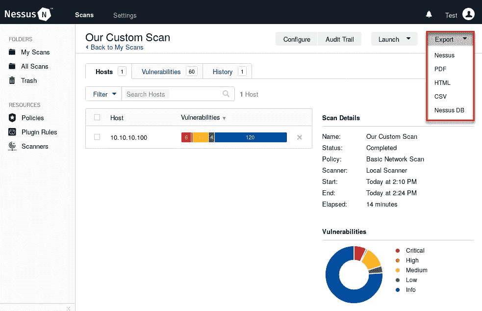

2.  您可以选择输出格式。然后，导出向导将提供另一个选项，以生成最终输出作为执行摘要，或根据您的个人喜好自定义报告：

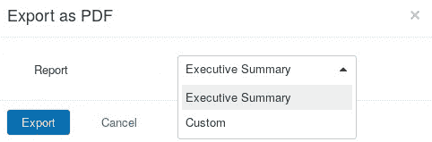

3.  如果选择创建自定义报告，则可以使用以下选项：

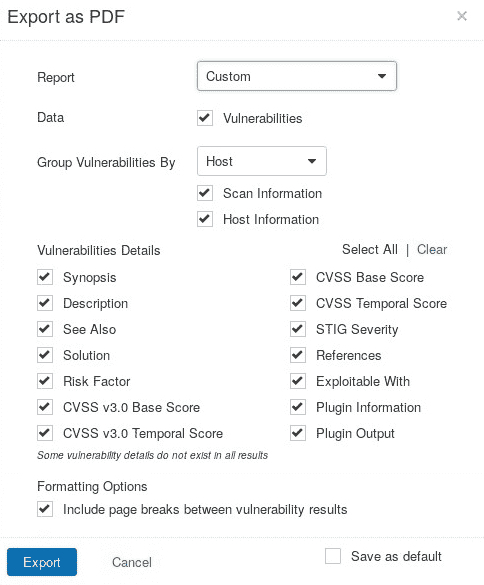

执行报告更适合高层管理人员，他们不关心脆弱性评估的所有技术细节，而是报告的主要概述。根据需要和读者的兴趣，自定义报告可用于包括或删除特定的详细信息。

以下是为我们实验室内 Metasploitable VM 上的漏洞扫描生成的执行报告示例：


如您所见，将为目标上发现的每个漏洞分配严重性评级和分数。**通用漏洞评分系统**（**CVSS**）是一个定量漏洞评分系统，可帮助安全专业人员确定威胁、漏洞甚至安全漏洞的严重性。

有关 CVSS 的更多信息，请访问第一个网站[https://www.first.org/cvss/](https://www.first.org/cvss/) 。

在本节中，您了解了导出 Nessus 结果的各种格式、脱机导出报告的好处以及报告类型。在下一节中，我们将深入分析 Nessus 提供的输出/结果。

# 分析 Nessus 结果

使用 Nessus 创建和执行漏洞扫描非常简单；然而，在分析阶段最需要网络安全专业人员的心态。Nessus 使结果分析变得容易。扫描完成后，您可以通过选择“漏洞”选项卡查看找到的漏洞列表，如以下屏幕截图所示：


现在，我们可以看到目标上发现的漏洞列表。Nessus 向我们提供了严重性等级、漏洞名称和发现的数量：


要获取有关漏洞的更多详细信息，请单击特定漏洞，如前面屏幕截图中突出显示的漏洞。Nessus 将为您提供所选漏洞的详细描述、风险信息、插件详细信息、补救措施和外部引用，如以下屏幕截图所示：


利用这些信息，渗透测试人员可以快速识别目标上的弱点，并在选择有效载荷攻击目标时缩小范围。

现在，您对 Nessus 及其功能有了深入的了解。在下一节中，我们将使用各种 web 应用程序扫描仪来帮助我们检测目标服务器上的 web 漏洞。

# 使用 web 应用程序扫描程序

Web 应用程序扫描程序主要关注于检测和识别 Web 服务器、网站和 Web 应用程序上的漏洞。在您的网络安全职业生涯中，无论是作为渗透测试人员还是安全从业人员，您都可能被指派在目标网站或 web 服务器上执行某种安全审计。

但是，作为渗透测试人员，我们需要能够发现目标网站和 web 服务器上的安全错误配置和弱点。组织可能会与您签订合同，让您在其网站上执行渗透测试，而不是在其网络上执行渗透测试，甚至两者都可以。记住，在诸如网站之类的对象上进行渗透测试的目的是在实际黑客能够破坏系统并过滤数据之前，识别漏洞并尽快进行补救。

市场上有很多 web 应用程序扫描器，从商业到免费开源；以下是其中一些：

*   Acunetix 漏洞扫描程序（商用）
*   w3af（免费）
*   Nikto（免费）
*   打嗝套房（商业和免费）
*   IBM AppScan（商用）

在本章的其余部分中，我们将介绍使用 Nikto、WPScan 和 Burp Suite 来检测和识别目标 web 服务器上的安全漏洞的各种练习。

让我们深入学习下一节关于 Nikto 的知识。

# 尼克托人

Nikto 是一款流行的开源 web 漏洞扫描器，预装在 Kali Linux 中。此命令行工具能够识别目标网站上的安全漏洞，并为发现的每个问题提供详细的参考。Nikto 不是一个隐身工具，在执行扫描时可能会有点噪音。

它的一些特点如下：

*   在 web 服务器上检查任何过时的组件
*   能够通过目标上的标题和文件识别已安装的应用程序
*   SSL 支持
*   执行子域猜测
*   Apache 用户名枚举

为了开始使用 Nikto，我们将在 Metasploitable VM 上执行 web 漏洞扫描。如果您还记得，在上一章中，我们对 Metasploitable 执行了端口扫描，发现端口`80`已打开。默认情况下，web 服务器打开端口`80`以允许客户端和 web 服务器之间的入站和出站通信。

使用`nikto -h <target>`语法打开新的终端窗口，其中`-h`指定主机（主机名或 IP 地址）。我们使用`nikto -h 10.10.10.100`命令：

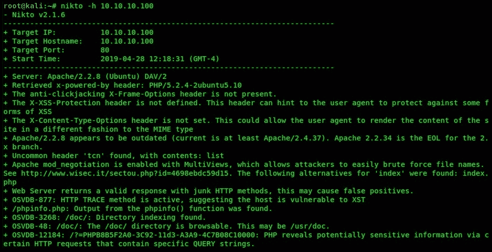

如果您提供主机名，Nikto 将能够通过**域名系统**（**DNS**进行 IP 查找。在初始阶段，Nikto 尝试执行操作系统和服务版本指纹识别；我们的目标是使用 Ubuntu 作为操作系统，使用 Apache2.2.8 作为 web 服务器应用程序。

**Nikto** can be found under the Applications | 02 – Vulnerability Analysis tab in Kali Linux.

输出上的每个点都表示 Nikto 检测到的问题，无论配置是否丢失，是否找到了对敏感目录或文件的访问权限，甚至应用程序版本是否过期。对于发现的每个安全问题，一个**开源漏洞数据库**（**OSVDB**参考 ID 与该问题关联。OSVBD 是一个独立的开源数据库，其中包含有关 web 应用程序安全漏洞的信息。一旦 Nikto 能够识别目标上的安全漏洞，它将提供一个相关的 OSVDB 参考 ID。一旦获得 OSVDB ID，您可以转到[http://cve.mitre.org/data/refs/refmap/source-OSVDB.html](http://cve.mitre.org/data/refs/refmap/source-OSVDB.html) 使用 CVE 条目引用 OSVDB ID。

有关 Nikto 的更多信息，请访问[https://cirt.net/Nikto2](https://cirt.net/Nikto2) 和[https://github.com/sullo/nikto](https://github.com/sullo/nikto) 。

现在你有了使用 Nikto 的基本技能，让我们看看下一节中使用 WpSCAN 的情况。

# WPScan

为一家公司创建一个网站需要大量的编程和工作。有许多**内容管理系统**（**CMSes**）允许您轻松创建、管理和发布网站。想象一下，必须为一个或多个网站的多个页面静态编写 web 语言代码；这将是一项艰巨的任务，需要良好的网络语言知识。CMS 允许 web 管理员轻松管理和无缝更新网站内容，同时能够集成其他第三方 web 插件，为用户提供更多功能。

有许多 CMSE 可用；以下是其中一些：

*   WordPress
*   逐浪
*   猪跑
*   内容管理系统

在互联网上，目前使用的最流行的 CMSE 之一是 WordPress。无论你是博客写手、自由职业者、初创企业还是大型组织，许多人都将 WordPress 作为 CMS 的首选。WordPress 是一个基于 MySQL 和 PHP 的开源 CMS。由于 WordPress 在互联网上非常流行，我们将使用 Kali Linux 中的**WPScan**工具来扫描 WordPress web 服务器上的 web 漏洞。

首先，您需要在虚拟实验室环境中安装 WordPress 服务器。要执行此操作，请执行以下步骤：

1.  转到[https://www.turnkeylinux.org/wordpress](https://www.turnkeylinux.org/wordpress) 下载 ISO 镜像或 VM 文件（使用虚拟机文件更容易设置 VM）。
2.  在虚拟机监控程序中安装后，请确保为与 Kali Linux 机器相同的网络启用了网络配置。
3.  打开 WordPress 虚拟机的电源。它将自动从虚拟机监控程序内的**动态主机配置协议**（**DHCP**服务）接收 IP 地址。
4.  使用您的 Kali Linux 机器，执行网络和端口扫描以识别 WordPress 服务器 IP 地址。
5.  在 Kali Linux web 浏览器中输入 IP 地址，您将看到 WordPress 默认网页。

6.  使用`http://<ip address>/wp-login.php`URL 将显示管理员登录页面，如以下屏幕截图所示：

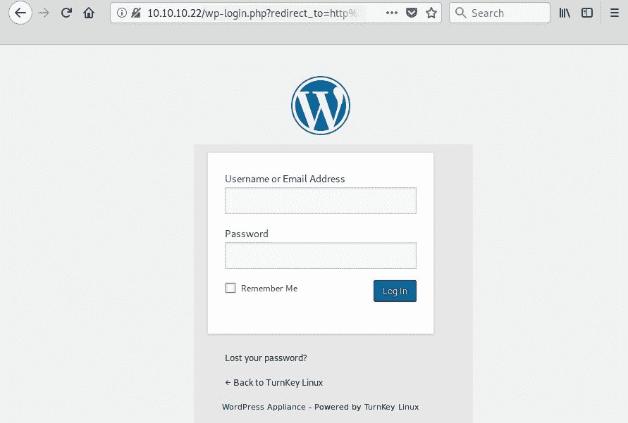

这是 WordPress 服务器的默认登录页面。

或者，可以在 Kali Linux 菜单中的应用程序| 03–Web 应用程序分析| CMS 和框架识别选项卡下找到 WPScan 工具。

在您的 Kali Linux 机器上，我们将使用`wpscan --url <target IP or hostname>`命令在 WordPress web 服务器上执行漏洞扫描：

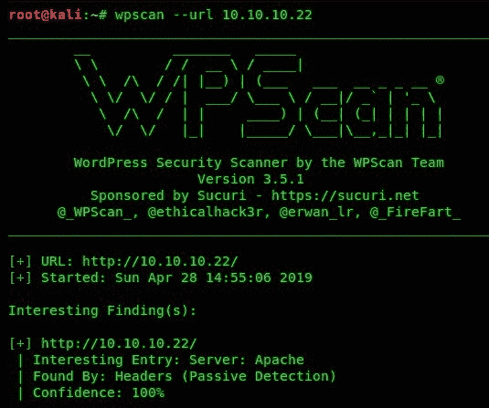

WPScan 将提供服务器平台；在我们的例子中，它是 Apache。

接下来，它将尝试发现并列出发现的所有已知漏洞，并为每个漏洞提供修复和参考，如以下屏幕截图所示：

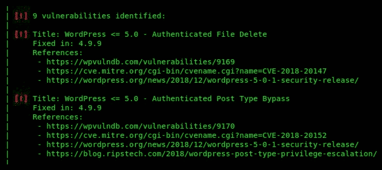

WPScan 不仅是 WordPress 的漏洞扫描器，而且还能够执行用户帐户枚举。让我们尝试提取 WordPress 服务器上的用户帐户；使用`wpscan --url 10.10.10.100 -e u vp`命令执行用户枚举：


正如您在我们的结果中看到的，`admin`用户被发现。接下来，我们可以尝试使用蛮力技术对`admin`帐户执行密码破解。

要创建用于密码破解的自定义字表，您可以在 Kali Linux 上使用**crunch**工具。此外，您还可以从 internet 下载单词列表。一个好的来源是[https://github.com/danielmiessler/SecLists](https://github.com/danielmiessler/SecLists) 。

为了使用 WPScan 和脱机字列表（我们的名为`custom_list.txt`）执行密码破解，我们使用了`wpscan --url 10.10.10.100 -e u --passwords custom_list.txt`命令。

在以下代码片段中，我们能够破解用户帐户的密码：


由于渗透测试人员已获得用户名和密码，因此该帐户已被泄露。我们现在可以登录 WordPress 服务器的控制面板来执行各种恶意操作。

密码破解可能是一个非常耗时的过程，可能需要几分钟或几小时才能完成。

完成本节之后，您已经掌握了使用 WPScan 在 WordPress 服务器上执行漏洞评估的技能。在下一节中，我们将了解另一个 web 漏洞评估工具 Burp Suite。

# Burp 套件教程

打嗝套房（[https://portswigger.net/burp](https://portswigger.net/burp) 是一款**图形用户界面**（**GUI**）web 应用程序漏洞扫描器，能够识别 100 多个通用漏洞，例如，OWASP 十大关键 web 应用程序安全风险列表中发现的所有漏洞。

OWASP 前 10 名列表可在[找到 https://www.owasp.org/index.php/Category:OWASP_Top_Ten_2017_Project](https://www.owasp.org/index.php/Category:OWASP_Top_Ten_2017_Project) 。

Burp 套件应用程序允许渗透测试人员通过其 HTTP 代理组件拦截 web 服务器（web 应用程序）和浏览器之间的所有 HTTP 和 HTTPS 请求和响应。通过拦截 web 流量，Burp Suite 可以测试各种类型的漏洞和攻击，如模糊、暴力密码攻击、解码、通过爬网获取隐藏 URL 等等。

在开始使用 Burp 套件之前，请确保您的 OWASP**已损坏的 Web 应用程序**（**BWA**）虚拟机（受害机）处于联机状态并已收到 IP 地址。

一旦 OWASP BWA VM 联机，您将看到以下屏幕；但是，您的 IP 地址详细信息可能与显示的不同：

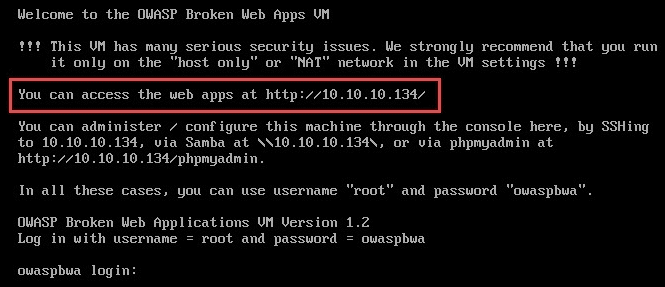

在您的 Kali Linux 计算机上，通过 ping OWASP BWA 虚拟机确保存在端到端连接。验证连接后，就可以打开 Burp Suite 应用程序了。

要完成此任务，请使用以下说明：

1.  转到应用程序| 03–Web 应用程序分析| Web 应用程序代理| Burp Suite。
2.  现在应用程序已打开，向导将询问您是要创建临时项目、在磁盘上创建新项目还是打开现有项目。
3.  选择临时项目并单击下一步：

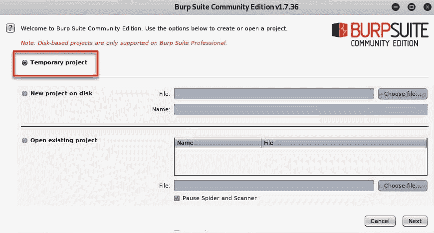

4.  下一个窗口将询问 Burp Suite 是否应使用默认设置或从文件加载配置。选择“使用打嗝默认值”选项，然后单击“开始打嗝”以启动用户仪表板：

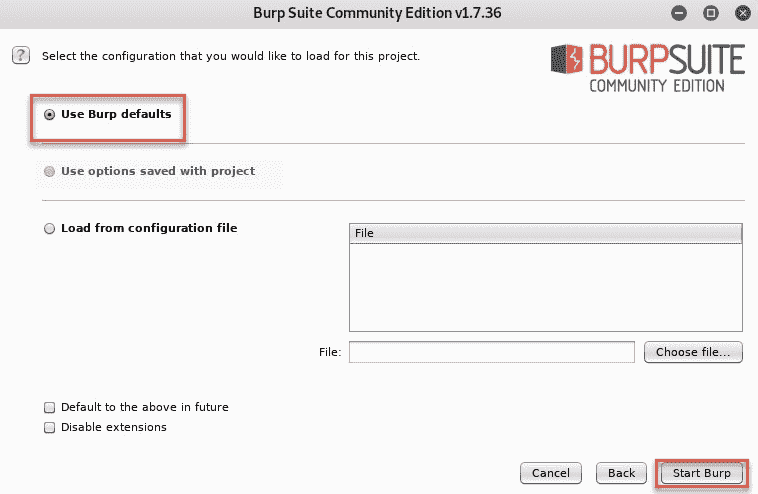

在您的 web 浏览器和目标 web 服务器之间发送的流量不受 Burp Suite 的监视或拦截。Burp 套件包含一个 HTTP 代理，该代理允许应用程序拦截 web 浏览器和目标 web 服务器之间的 HTTP 流量。web 浏览器不直接与 web 服务器交互；流量从 web 浏览器发送到 Burp Suite HTTP 代理，然后 HTTP 代理将流量转发到目标 web 服务器，反之亦然。下图显示了 web 浏览器和 web 服务器之间的流量：


Burp 套件用作拦截代理应用程序。默认情况下，Burp 套件无法拦截我们的 Kali Linux 机器和 OWASP BWA 虚拟机之间的任何通信。要将我们的 web 浏览器配置为使用 Burp Suite，请使用以下说明：

1.  打开 Firefox 并单击菜单图标|首选项（选项）。
2.  在默认选项卡上，向下滚动直到看到网络代理设置（网络设置），然后单击设置。
3.  选择手动代理配置并使用下一屏幕截图中显示的配置：

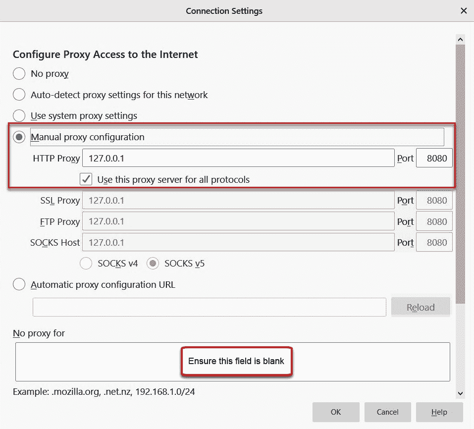

确保“无代理”字段为空。

4.  单击 OK 在 Firefox 中保存您的设置。

现在，我们已经将 web 浏览器配置为与 Burp Suite HTTP 代理服务一起使用，让我们回到 Burp Suite 应用程序，以允许拦截流量。为此，请执行以下步骤：

1.  单击代理| Intercept，然后单击 Intercept is on 图标以切换启用/禁用：


确保您的配置设置正确，否则该练习将无法正常工作。

如果 Intercept 图标显示 on，则 Burp Suite 能够拦截 web 浏览器和 web 服务器之间的流量。此外，确保转发请求；否则，它们将留在拦截器中，不会被转发，最终请求将超时。

2.  接下来，在 Kali Linux 机器上 Firefox 的地址栏中输入 OWASP BWA 虚拟机的 IP 地址。默认的 web 页面应该完全加载。在 Burp Suite 上，单击目标站点地图以查看 HTTP 请求和响应：


3.  在 web 浏览器上，输入 OWASP BWA 虚拟机的 URL（或 IP 地址）。HTTP 请求和响应将出现在 Burp Suite 的目标站点地图选项卡上。

既然我们已经概述了如何使用 Burp 套件拦截 web 流量，那么让我们更进一步，在 Metasploitable 机器上执行攻击性攻击。在下一节中，我们将使用 Burp 套件执行暴力攻击。

# 使用入侵者进行暴力攻击

Burp 套件中的入侵者组件/模块允许渗透测试人员使用蛮力方法执行在线密码攻击。让我们尝试获取登录`http://<target ip addr>/mutillidae`URL 的密码：

1.  使用 Firefox web 浏览器单击 Mutillidae II。在 Burp Suite 上，您应该会看到`mutillidae`文件夹出现在站点地图选项卡的左窗格下。
2.  接下来，右键点击`mutillidae`文件夹，选择 Add to scope，如下图所示：


3.  将出现以下代理历史记录窗口；只需单击“是”：


4.  要验证我们的范围是否已成功添加，请转到目标|范围选项卡：

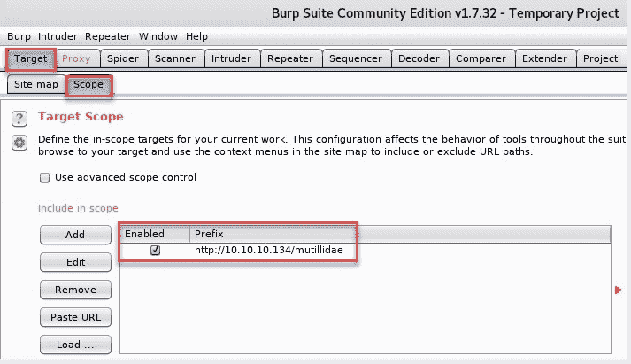

5.  现在您的范围已添加，请返回 web 浏览器。在 Mutillidae 网页的顶部，您将看到一个允许用户尝试登录的链接。用户名使用`admin`，密码使用`password`。登录尝试应失败；但是，我们需要 Burp 套件来捕获网页上登录字段的具体细节。

让我们回到打嗝室继续练习。

6.  在 Burp Suite 上，单击 Proxy | HTTP history 选项卡并选择 HTTP**POST**消息，该消息有来自我们浏览器的登录尝试（您的`#`消息可能与下面代码段中显示的不同）。选择后，右键单击并选择发送到入侵者：

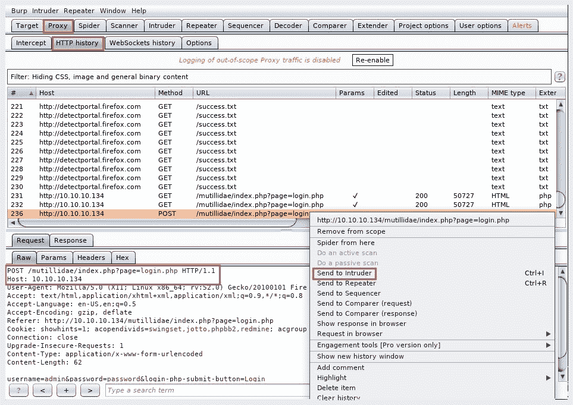

7.  接下来，单击入侵者|目标选项卡查看已设置的目标 IP 地址：

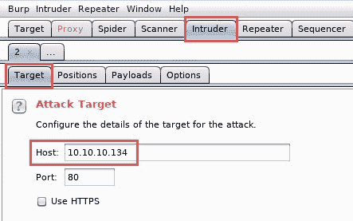

在入侵者选项卡中，有几个子选项卡，包括以下内容：

8.  选择“位置”选项卡并单击“清除”按钮以清除所有选择。默认情况下，Burp 套件已选择 HTTP 请求消息的某些区域以插入其有效负载。然而，在我们的练习中，有效负载将被插入密码字段中。
9.  突出显示单词`password`并单击添加。这将允许 Burp Suite 在所选字段上插入其有效负载：


红色文本是从浏览器发送到 web 服务器的数据。如您所见，`password`一词是我们在尝试登录时使用的值。

10.  单击“有效载荷”选项卡。在文本字段中输入`admin`，点击〖增加〗按钮；这将是我们的定制负载：


确保在“有效载荷”和“选项”选项卡的其余部分中，所有其他内容都保留为默认值。

11.  准备好发射有效载荷后，单击开始攻击：

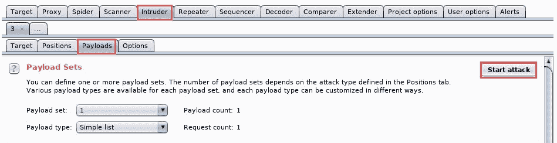

攻击完成后，入侵者将打开一个新窗口提供摘要。在 Results 选项卡上，注意我们有一条带有 302 状态码的 HTTP 请求消息；这意味着发生了 HTTP 重定向。换句话说，入侵者能够成功地登录到 Mutillidae。详细信息见以下带有`username`和`password`的截图：


选择带有**302**状态代码的 HTTP 请求消息，您可以在请求选项卡上看到从 web 浏览器发送的`username`和`password`。

12.  要查看 web 服务器的响应，请单击响应|渲染选项卡。在这里，您将能够看到 web 应用程序如何响应负载：

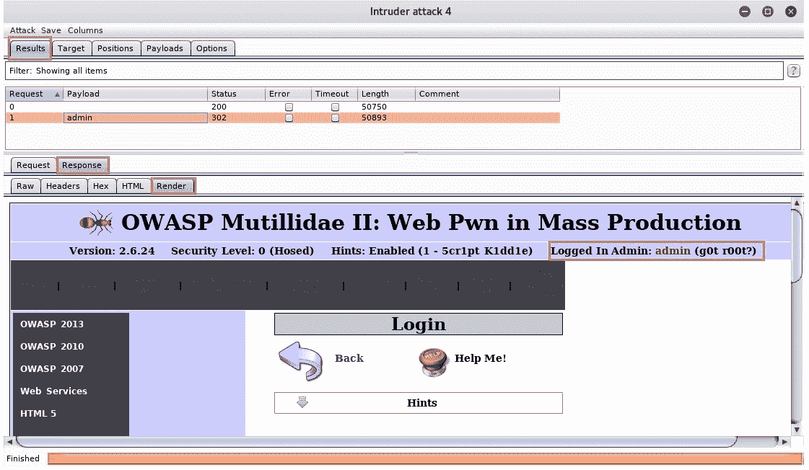

仔细观察，您将看到`admin`用户帐户已成功登录。请注意，前面屏幕截图中显示的用户帐户是故意易受攻击的 Metasploitable 虚拟机的默认管理帐户。此外，在未获得合法许可的情况下，不要尝试对设备或网络进行任何形式的攻击。此练习是在实验室环境中进行的。

Sunny Wear 的*打嗝套装食谱*包含了许多用于进行网络评估的食谱。此标题可在[中找到 https://www.packtpub.com/networking-and-servers/burp-suite-cookbook](https://www.packtpub.com/networking-and-servers/burp-suite-cookbook) 。

正如您所看到的，Burp Suite 是一个非常强大的 web 渗透测试和漏洞评估应用程序。无论何时，当您在 web 服务器和网站上执行安全审核时，此工具都应该是您的“转到”工具列表的一部分。

# 总结

在本章中，我们讨论了发现系统甚至 web 服务器上的安全弱点的必要性。我们研究了如何使用 Nessus 执行漏洞扫描、自定义策略和报告。此外，我们还了解了 Nikto，一个开源的 web 漏洞扫描器，以及使用 WPScan 检测 WordPress 中的安全错误配置和缺陷。最后，我们在本章结束时介绍了使用 Burp 套件应用程序的基本原理，并尝试通过暴力手段进入网站。

完成本章后，您现在可以使用 Nessus 在目标网络和系统上成功执行漏洞评估，并使用 Burp Suite、Nikto 和 WPScan 执行网站渗透测试。

我真的希望本章内容丰富，有助于您在网络安全领域的发展。在下一章中，我们将探讨无线渗透测试的基本概念。

# 问题

以下是基于本章所述主题的一些问题：

1.  在 Kali Linux 中安装 Nessus 后，使用什么命令来启用 Nessus 服务？
2.  许多金融机构为客户提供卡支付功能。为确保机构符合行业标准，应使用什么框架？
3.  可以从 Nessus 导出哪些类型的报告？
4.  您能说出在 Kali Linux 中预装的两个或三个 web 漏洞扫描程序吗？
5.  什么工具可以用来扫描 WordPress 网站的安全漏洞？

# 进一步阅读

*   有关 Nessus 的更多信息，请访问[https://www.tenable.com/products/nessus/nessus-p](https://www.tenable.com/products/nessus/nessus-professional) 。[专业。](https://www.tenable.com/products/nessus/nessus-professional)
*   有关 PCI DSS 的更多信息，请访问安全标准委员会网站[https://www.pcisecuritystandards.org/](https://www.pcisecuritystandards.org/) 。