# 九、网络渗透测试——连接前攻击

许多组织都有无线网络。想象一下，获得对公司无线网络的访问权，然后使用无线作为媒介或通道，闯入有线网络并危害其他系统和设备。必须了解无线渗透测试，以便能够识别允许此类安全漏洞。这些技能将帮助您作为渗透测试人员，因为您需要在目标网络上执行无线安全测试。

在本章中，我们将深入探讨无线黑客工具，如 aircrack ng。此外，我们还将介绍了解各种无线攻击如何工作的要点。这些攻击包括取消与无线接入点相关联的用户的身份验证、创建假接入点以及执行密码破解。

在本章中，我们将介绍以下主题：

*   开始使用 airodump ng 进行数据包嗅探
*   使用 airodump ng 进行目标数据包嗅探
*   在无线网络上取消对客户端的身份验证
*   创造一个盗贼 AP/邪恶孪生兄弟
*   执行密码喷洒攻击
*   设置水坑攻击
*   针对凭证窃取的弱加密攻击

# 技术要求

本章的技术要求如下：

*   **卡利 Linux**：[https://www.kali.org/](https://www.kali.org/)
*   **空中世界**：[https://github.com/v1s1t0r1sh3r3/airgeddon](https://github.com/v1s1t0r1sh3r3/airgeddon)
*   **WordPress 服务器**：[https://www.turnkeylinux.org/wordpress](https://www.turnkeylinux.org/wordpress)
*   **蜂箱**：[https://sourceforge.net/projects/bwapp/files/bee-box/](https://sourceforge.net/projects/bwapp/files/bee-box/)

# 开始使用 airodump ng 进行数据包嗅探

为了开始数据包嗅探，我们将使用`airodump-ng`工具。`airodump-ng`具有许多功能，包括执行 IEEE 802.11 帧的原始捕获。此外，使用此工具，我们将能够查看无线 AP、关联和未关联的客户端设备（站）、加密类型、SSID、AP 制造商等。

在[第 8 章](08.html)*了解网络渗透测试*中，我们概述了将无线网络适配器连接到您的 Kali Linux 机器并启用监控模式所涉及的过程。对于本练习，您需要再次重复此过程。

要启用监视器模式，请执行以下步骤：

1.  将无线适配器连接到 Kali Linux。使用`ifconfig`命令验证适配器的状态。
2.  使用`airmon-ng check kill`命令终止可能妨碍启用监控模式的任何进程。
3.  使用`airmon-ng start wlan0`命令在无线适配器上启用监视器模式。

现在您的无线适配器处于监控模式，让我们使用`airodump-ng`工具查看附近所有 AP 和电台的列表。要执行此操作，请使用以下命令：

```
airodump-ng wlan0mon
```

您的终端窗口现在将开始显示附近的所有 AP，显示以下信息：

*   `BSSID`：AP 或无线路由器的 MAC 地址。
*   `PWR`：这是额定功率。额定功率越低，AP 离无线适配器越远。
*   `Beacons`：信标是 AP 发送的广告。信标通常包含有关 AP 的信息，例如网络名称和操作。
*   `#Data`：这是每个网络捕获的数据包数量。
*   `#/s`：此字段表示 10 秒期间每秒的数据包数。
*   `CH`：AP 的操作通道。
*   `MB`：此字段概述 AP 支持的最大速度。
*   `ENC`：确定无线网络上使用的加密密码。
*   `AUTH`：确定无线网络上的认证协议类型。
*   `ESSID`：**扩展服务集标识符**（**ESSID**）与网络 SSID 名称相同。
*   `STATION`：显示关联和未关联设备的 MAC 地址。

执行该命令后，无线适配器将对附近的所有无线网络和设备执行实时扫描和监视。您应该会收到类似以下内容的屏幕截图：


根据您的地理位置，列出的设备和网络始终会有所不同。

实时查看网络流量可能非常困难，尤其是在我们可以看到所有附近设备的情况下。`airodump-ng`工具允许我们使用`--bssid`参数过滤特定 AP 的输出。此外，使用`-c`参数允许我们指定 AP 正在操作的通道。使用以下语法：

```
airodump-ng --bissid <bssid value> -c <channel number> wlan0mon
```

您将获得与以下类似的输出，其中将显示有关目标无线网络的特定详细信息：

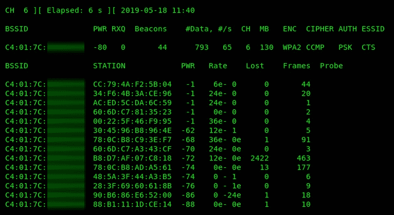

现在您已经能够执行数据包嗅探，让我们在下一节中尝试将攻击指向特定目标。

# 使用 airodump ng 进行目标数据包嗅探

在本节中，我们将了解 airodump ng 中的其他功能。最重要的是，我们将使用 airodump ng 瞄准特定的网络；这将使我们能够将攻击重点放在**特定****目标**上，而不会对附近的其他无线网络造成任何伤害。

即使您正在筛选视图，流量（数据包）也不会脱机保存以进行后期分析。使用`-w`参数将允许您指定保存内容的文件位置。因此，以下命令将帮助您完成此任务：

```
airodump-ng --bissid <bssid value> -c <channel number> wlan0mon -w /root/capture
```

使用终端上的`ls -l`命令，您将看到数据已脱机写入`root`目录：


airodump ng 通常将捕获的数据写入五种文件类型；这些是`.cap`、`.csv`、`.kistmet.csv`、`.kismet.netxml`和`.log.csv`格式。

您让`airodump-ng`工具运行的时间越长，脱机文件中写入的数据包就越多，最终将捕获客户端和目标 AP 之间的 WPA/WPA2 握手。在使用 Airodump ng 进行数据包嗅探时，您将看到一条**WPA 握手**消息出现在右上角；这表明 airodump ng 已捕获 WPA/WPA2 握手。捕获 WPA/WPA2 握手将帮助我们破解目标无线网络的密码。

在下一节中，我们将尝试从无线网络取消对用户的身份验证。

# 在无线网络上取消对客户端的身份验证

每当客户端设备（如笔记本电脑或智能手机）试图创建与受密码保护的无线网络的关联时，用户将需要提供正确的密码短语。如果用户提供了正确的密码短语，设备将在网络上进行身份验证，并能够访问任何可用资源。

在反身份验证攻击中，攻击者或渗透测试人员试图将每个相关设备从无线 AP 上敲出（踢出）。在攻击者计算机未以任何方式连接（关联）到目标无线 AP 或网络的情况下执行此攻击。

为了让攻击者机器向无线 AP 发送一个反身份验证帧，会在帧体中插入一个原因码。这些代码用于通知接入点或无线路由器网络上的更改。原因代码将指示以下情况之一：

*   **代码 2**：以前的身份验证不再有效
*   **代码 3**：反验证离开

这将产生从目标 AP 取消验证每个客户端的效果。以下是网络攻击的示例：

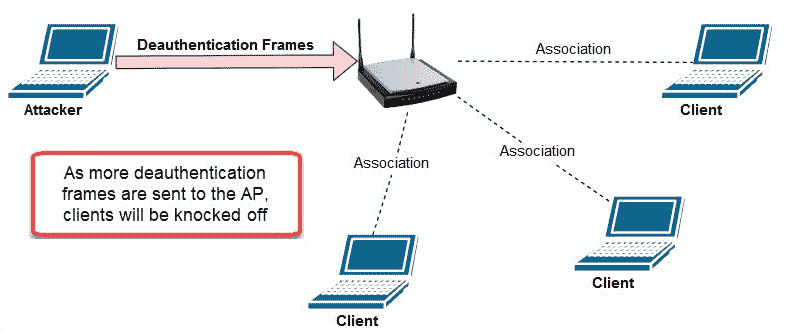

要启动反身份验证攻击，请执行以下步骤：

1.  在无线适配器上启用监视器模式。
2.  使用`airodump-ng wlan0mon`命令发现目标的 BSSID 地址。BSSID 将用于专门针对特定 AP 发起攻击。
3.  一旦发现目标 AP，注意其 BSSID 和工作信道，然后使用*Ctrl*+*C*终止对附近 AP 的扫描。
4.  只需使用以下语法即可将无线监控范围缩小到特定的目标 AP:`airodump-ng --bssid <bssid value> -c <channel #> wlan0mon`。此当前终端窗口将用于监视我们的攻击进度。
5.  打开一个新的终端窗口。此窗口将用于使用`aireplay-ng`工具发起攻击。`aireplay-ng -0 0 -a <BSSID> wlan0mon`命令将向目标 AP 发送连续的反验证帧流。

您的结果应类似于以下屏幕截图：


在屏幕截图中，我们可以看到`aireplay-ng`正在向我们的目标接入点发送连续的反验证帧流。

在攻击过程中，切换回您监视目标网络的第一个终端窗口。很快，您将看到客户端（站点）正在断开连接，最终将捕获 WPA/WPA2 握手。您将注意到，在带有 airodump ng 的终端上，WPA 握手值将显示在窗口的右上角。这表示已捕获 WPA/WPA2 握手。在下一章中，我们将在无线网络上执行密码破解。

您可以使用**Hashcat**（[等工具 https://hashcat.net/hashcat/](https://hashcat.net/hashcat/) 和**开膛手约翰**（[https://www.openwall.com/john/](https://www.openwall.com/john/) 进行密码破解。

此外，如果要从 AP 取消对特定客户端（站）的身份验证，则以下命令将允许此操作：

```
aireplay-ng -0 0 -a <target's bssid> -c <client's mac addr> wlan0mon
```

以下是我们使用的每个参数的说明：

*   `-0`：这表示这是一次反身份验证攻击。
*   `0`：指定要注入的帧数。使用`0`会造成持续攻击；如果指定`2`，则只会注入两个反验证帧。
*   `-c`：可以指定客户端的 MAC 地址。

在下一节中，我们将使用 Kali Linux 和各种无线工具创建一个蜜罐。

# 创造一个盗贼 AP/邪恶孪生兄弟

作为未来的渗透测试人员或道德黑客，您可能需要为您的公司或客户组织进行广泛的无线安全测试。创建具有有趣 SSID（无线网络名称）的恶意 AP，如`VIP_WiFi`或`Company-name_VIP`，将吸引员工建立连接。

创建恶意 AP 的目的是捕获用户凭据和敏感信息，并检测组织中任何易受攻击的无线客户端。以下是部署你的欺骗 AP 时要考虑的一些技巧：

*   选择合适的地点，确保最大限度地覆盖潜在受害者。
*   从真实 AP 取消对客户端的身份验证，使其与恶意 AP 建立关联。
*   创建捕获门户以捕获用户凭据。

首先，我们将使用**Airgeddon**。该工具包含许多功能，从收集目标无线网络及其客户端的信息到发起各种类型的攻击，以及引诱用户与我们的恶意 AP 关联，这些功能都将对我们有所帮助。

要开始创建假接入点，请执行以下步骤：

1.  从其 GitHub 存储库下载 Airgeddon，并在您的用户帐户上授予`airgeddon.sh`脚本可执行权限。使用以下命令：

```
git clone https://github.com/v1s1t0r1sh3r3/airgeddon.git 
cd airgeddon chmod +x airgeddon.sh
```

2.  在终端窗口中，使用`./airgeddon.sh`命令启动 Airgeddon 接口。脚本启动后，Airgeddon 将开始检查您的 Kali Linux 机器上的基本硬件和软件要求。

3.  点击*回车*几次，直到到达界面选择提示；请确保选择无线适配器，如以下屏幕截图所示：

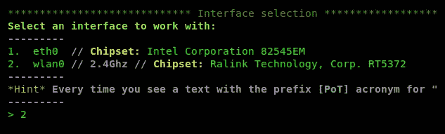

选择带有 wlan0 界面的选项`2`，点击*进入*。

如果 Airgeddon 显示您缺少任何工具，请确保在继续之前安装这些工具。

4.  现在，您将看到 Airgeddon 的主仪表板。在这里，您可以选择在无线适配器上的监视器模式或管理模式之间切换。您将能够发起各种类型的攻击，例如**拒绝服务**（**拒绝服务**）攻击、尝试破解无线密码、捕获和解密无线握手、执行邪恶的孪生攻击或创建恶意 AP：

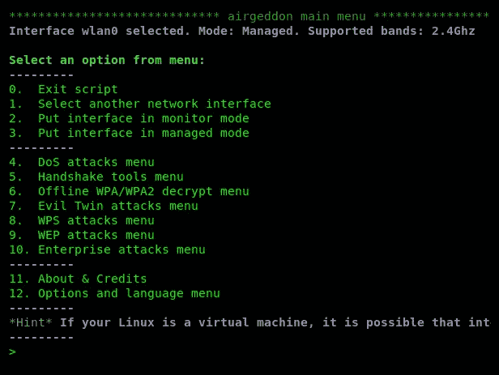

对于我们的攻击，我们将创建一个蜜罐，诱使受害者连接到我们的假 AP 以拦截、重定向和捕获敏感信息。

5.  接下来，将无线适配器设置为监视模式。您可以在 Airgeddon 菜单中使用**将界面置于监控模式**选项进行此操作。完成后，您将看到无线适配器的状态现在更改为**监视器**模式，如以下屏幕截图所示：


6.  选择邪恶双生攻击菜单选项，点击*进入*。您将看到以下选项：

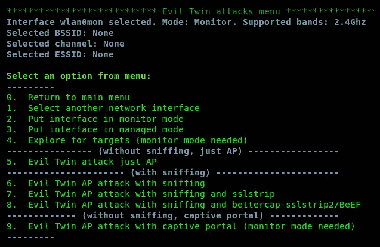

Airgeddon 不仅允许我们轻松设置恶意 AP 或邪恶孪生兄弟，还为我们提供了其他功能，如嗅探受害者的流量、对任何 SSL/TLS 连接执行 SSL 剥离、执行浏览器攻击，甚至创建用于收集用户凭据的捕获门户。

7.  让我们首先寻找一个目标。选择选项`4`并点击*进入*。弹出终端窗口将打开，显示附近的所有 AP。准备好选择目标后，请选择扫描窗口：


8.  选择您的目标 AP 并点击*进入*继续。此时，我们已将无线适配器设置为监视模式，并选择了目标：


9.  让我们用嗅探进行邪恶的双重攻击。选择选项`6`并点击*进入*。以下菜单将可用：

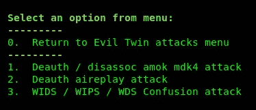

10.  选择`2`选项，对目标无线网络进行反认证攻击；这将迫使真实网络的客户端断开连接（取消验证），他们将尝试连接到我们的恶意 AP/邪恶孪生兄弟。Airgeddon 将要求您选择连接到 internet/物理网络的物理接口。目的是为受害者提供正常网络连接的假象。当他们连接并访问本地资源时，受害者会认为这是合法的网络：

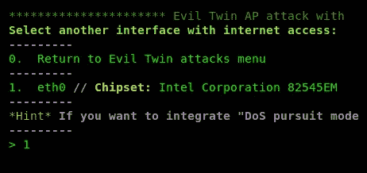

11.  选择合适的界面，点击*进入*继续；再次点击*进入*确认所选界面。

选择欺骗您的 MAC 地址以更改您的身份的选项。

12.  准备好后，发动攻击。Airgeddon 将打开几个较小的终端窗口，显示其正在执行的每个攻击的状态，如以下屏幕截图所示：


连接客户端后，相应的终端窗口将为您提供更新。只需几步，你就拥有了自己的盗贼 AP/邪恶孪生兄弟。

在下一节中，我们将讨论并演示在目标系统上喷洒密码。

# 执行密码喷洒攻击

密码喷洒（有时称为反向暴力）是一种技术，通过使用有效的用户名和包含各种密码可能性的单词列表进行多次登录尝试。执行密码喷洒攻击的目的是获取一组有效的用户凭据。

要执行密码喷洒攻击，我们将使用现有 WordPress 服务器作为目标**Burp Suite**获取网页上的用户名和密码输入字段，并`hydra`执行密码喷洒攻击以查找有效的用户凭据。

要开始，请使用以下说明：

1.  将 web 浏览器配置为使用 Burp Suite 代理设置。完成后，打开 Burp Suite 并打开其拦截模式。
2.  接下来，在 web 浏览器上，转到 WordPress 登录门户。URL 应该是`http://<server address>/wp-login.php`。请注意，如果您未获得有关当局的合法许可，则不应尝试对任何设备或网络进行任何攻击。本节中执行的任务在实验室环境中执行，仅用于教育目的。
3.  在用户名和密码字段中输入以下用户凭据，然后点击*输入*发送登录请求：
    *   `uname`
    *   `pass`
4.  回到打嗝套房。在代理截获选项卡上，点击前进按钮几次，直到在**原始**子选项卡中看到 HTTP`POST`消息，如下图所示：


5.  在`POST`消息中，注意第一行的目录（`/wp-login.php`和用户名/密码字段。
6.  请确保在网页上记录登录错误消息，因为在后面的步骤中需要该消息：


在我们的练习中，创建了两个自定义单词列表：第一个单词列表包含可能的用户名列表，第二个包含可能的密码列表。在 Kali Linux 上使用`hydra`工具，您将能够对目标 WordPress 服务器执行**密码喷洒**攻击。

7.  使用`hydra`可以得到以下语法：

```
hydra -L <username list> -p <password list> <IP Address> <form parameters><failed login message>
```

8.  替换语法中的每个值，我们得到以下命令：

```
hydra -L usernames.txt -P custom_list.txt 10.10.10.22 http-form-post "/wp-login. php: log=^USER^&pwd=^PASS^&wp-submit=Log+In&redirect_to=http%3A%2F%2F10.10.10.22%2Fwp-admin% 2F&testcookie=l: Invalid username" -V
```

9.  将`uname`替换为`^USER^`，将`pass`替换为`^PASS^`，我们可以告诉`hydra`这是用户名和密码字段。此外，`–V`被指定在终端窗口上生成详细输出。
10.  执行命令后，以下是预期输出的示例。以`[80] [http-post-form]`开头的行为目标提供可能有效的用户名和密码，如以下屏幕截图所示：


确保检查每个用户名和密码，以验证其在目标系统上的真实性。快速向目标系统发射用户名和密码可能会导致锁定并阻止我们端的攻击。要在两次尝试之间创建 10 秒的等待时间，请使用`-w 10`参数。这是可选的；但是，它可以减少被目标锁定或阻止的机会。

在下一节中，我们将介绍水坑攻击的要点。

# 设置水坑攻击

在 IT 安全领域，了解各种类型的攻击和威胁非常重要。其中一些攻击有一些非常不寻常的名称，在本节中，我们将介绍**水坑攻击**的基本原理。

假设您是一家公司的 IT 安全管理员或工程师。您已经实现了业界最好的安全设备，能够主动检测和防止任何类型的威胁，无论是内部威胁还是外部威胁。您还实施了行业最佳实践，遵守了标准，并确保您的用户（组织的员工）经常接受用户安全实践方面的培训。您已经在组织内部建立了一个安全堡垒，并确保网络周边也能防范新的和正在出现的威胁。

攻击者会注意到他们无法渗透您的网络，甚至网络钓鱼电子邮件等社会工程技术也无法成功攻击您的组织。这将给组织（目标）带来巨大的挑战，因为它受到了很好的保护。执行此操作的一种方法是执行水坑攻击。

想象一下，在他们的午餐休息时间，一些员工去附近的咖啡馆喝冷热饮料。黑客可能正在监视一个组织的员工的活动，他们说他们经常在休息时间甚至下班后访问包含公共 Wi-Fi 的地方。假设有一群员工经常光顾当地的咖啡馆。攻击者可以破坏咖啡店的 Wi-Fi 网络，并植入有效负载，下载到连接到网络的任何设备并在后台运行。

通过破坏咖啡店的 Wi-Fi 网络，此次攻击正在毒化水坑，每个人，包括目标组织的员工，在享用饮料时都在使用水坑。让我们想象一下，爱丽丝的智能手机在咖啡店被损坏了；她将其带回组织并连接到内部（Wi-Fi）网络。此时，攻击是从内部生成的，可能会破坏网络的其余部分，甚至试图在目标组织中创建后门。

有许多其他方法可以创建水坑攻击；这只是一个例子。另一个例子是破坏许多用户经常访问的合法网站，并在潜在受害者的系统上植入恶意软件。当系统感染恶意软件时，有效负载可能会以其他网站或网络为目标。

在下一节中，我们将讨论并演示如何从使用弱加密系统的系统中窃取凭据。

# 利用弱加密窃取凭据

加密在我们的日常生活中起着关键作用；无论我们是在旅途中查看电子邮件，浏览喜爱的网站，还是仅仅向朋友发送消息，数据加密都为我们提供了一个可接受的隐私级别，以防窥探。通常，IT 专业人员在维护加密技术以保护系统上的数据安全方面并不总是跟踪他们的法规遵从性级别。这会导致恶意用户或黑客破坏易受攻击的系统，以检索由于加密操作不当而导致的机密数据。

在本练习中，我们将尝试在目标上发现加密中最常见的漏洞之一。一旦发现，我们将利用弱加密漏洞进行攻击。

要开始，请执行以下步骤：

1.  下载并设置**蜂箱**虚拟机。蜜蜂箱文件可在[找到 https://sourceforge.net/projects/bwapp/files/bee-box/](https://sourceforge.net/projects/bwapp/files/bee-box/) 。
2.  安装后，打开 Kali Linux（攻击者机器）上的 web 浏览器，输入 bee box 的 IP 地址，然后点击*输入*。
3.  将出现以下屏幕。点击**bWAPP**链接，如下图所示：


4.  您将遇到一个登录门户。插入要登录的用户名`bee`和密码`bug`：

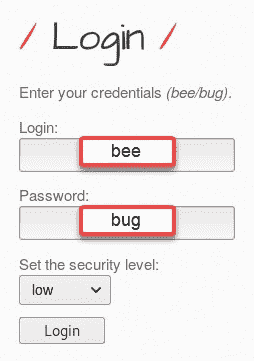

5.  在屏幕左上角，使用下拉菜单并选择 Heartbleed 漏洞。然后，单击 Hack 在目标虚拟机上加载漏洞：


6.  接下来，您将看到以下屏幕：


7.  在您的 Kali Linux 机器上，在地址栏中输入带有端口号`8443`的新 URL，然后点击*输入*。新的 URL 应该是`https://10.10.10.131:8443`。确保使用*步骤 4*中提供的凭据再次登录 bWAPP 应用程序。
8.  使用 Nmap，我们可以执行漏洞扫描，以确定目标上是否存在 heartbleed 漏洞。要执行此任务，请使用以下命令：

```
nmap -p 8443 -script ssl-heartbleed <target IP address>
```

如果目标上存在漏洞，Nmap 将向我们显示以下屏幕：

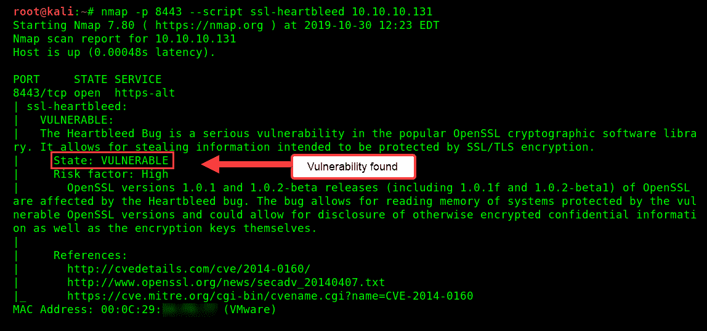

9.  现在我们已经确定目标上存在 heartbleed 漏洞，现在是时候使用 Metasploit 执行一些攻击了。在 Metasploit 中，让我们使用`search`命令帮助我们找到合适的模块：

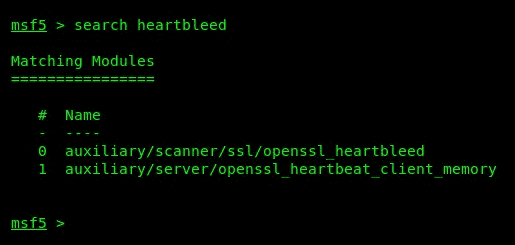

10.  搜索返回了两个可用的模块。我们将使用`auxiliary/scanner/ssl/openssl_heartbleed`模块。此外，我们将按照 bWAPP 接口提示中的说明，将`RHOSTS`设置为目标的 IP 地址，`RPORTS`设置为`8443`。以下代码段显示了这些配置：

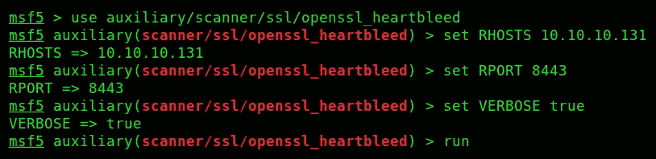

启动模块后，您将在以下屏幕中看到数据正在泄漏：


仔细检查输出，您可以看到漏洞已经返回了`Printable info leaked`部分，后面是明文形式的 HTTP 会话信息；目标计算机的响应是数据泄漏。如果未发现泄漏，目标计算机将不会向 Metasploit 接口返回任何数据。默认情况下，数据转储已提取并存储在 Kali Linux 机器上的`/root/.msf4/loot/…`位置。

11.  使用`show info`命令，您将看到`openssl_heartbleed`模块下要执行的可用操作，如以下屏幕截图所示：

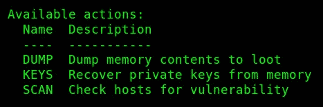

可以使用以下命令更改这些操作：

*   `set action DUMP`
*   `set action KEYS`
*   `set action SCAN`

使用`set action DUMP`命令后的`.bin`文件内容如下：

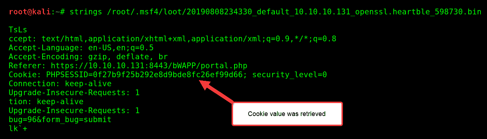

此外，当前访问易受攻击应用程序的用户越多，收集更多机密信息（如登录凭据）的可能性就越高。然而，在我们的练习中，我能够捕获 cookie 数据。

# 总结

在本章中，您学习了如何执行无线数据包嗅探，熟悉了数据包嗅探的基本知识，并使用`aircrack-ng`进行了有针对性的数据包嗅探。此外，您还学习了在*对无线网络*上的客户端进行反身份验证期间，对目标无线接入点执行反身份验证攻击所需的基本技能。

在*创建流氓 AP/流氓孪生*部分，您学习了如何使用 Airgeddon 将多个攻击链接在一起，并创建一个流氓孪生/流氓接入点。此外，关于密码喷洒的章节提供了访问远程系统的必要技能，同时获得了利用弱加密系统的技能。

在下一章[第 10 章](10.html)*网络渗透测试-获取访问*中，我们将更详细地介绍网络渗透。

# 问题

1.  什么工具可以为无线网络适配器启用监视模式？
2.  SSID 的另一个名称是什么？
3.  在反身份验证攻击期间，使用哪些代码断开客户端连接？
4.  使用什么工具执行反身份验证？

# 进一步阅读

以下是一些额外的阅读资源：

*   **反验证攻击**：[https://www.aircrack-ng.org/doku.php?id=deauthentication](https://www.aircrack-ng.org/doku.php?id=deauthentication)
*   **常见的 WLAN 保护机制及其缺陷**：[https://hub.packtpub.com/common-wlan-protection-mechanisms-and-their-flaws/](https://hub.packtpub.com/common-wlan-protection-mechanisms-and-their-flaws/)
*   **高级无线监听**：[https://hub.packtpub.com/advanced-wireless-sniffing/](https://hub.packtpub.com/advanced-wireless-sniffing/)