# 十、网络渗透测试——获取访问权限

进入系统和网络是渗透测试过程中最关键的阶段之一。此阶段测试渗透测试人员的技能集以及目标系统和网络的安全控制。渗透测试人员必须始终考虑所有可能的方式，通过利用各种安全漏洞来侵入目标。

如果无法访问公司网络，您将无法执行任何类型的网络渗透和数据过滤。渗透测试的目的是模拟具有恶意意图的真实黑客将执行的真实世界攻击。这意味着未经授权进入公司网络并破坏系统。

作为即将到来的网络安全专业人员/渗透测试人员，您将学习如何破坏无线网络、利用 Linux 和 Windows 操作系统、利用远程访问服务以及检索用户帐户凭据以访问系统和网络。此外，您还将了解保护无线网络免受网络威胁的各种对策。

在本章中，我们将介绍以下主题：

*   获取访问权限
*   **有线等效隐私****WEP**破解
*   **Wi-Fi 保护接入**（**WPA**破解
*   保护您的无线网络
*   配置无线安全设置
*   利用脆弱的外围系统
*   渗透测试 Citrix 和基于**远程桌面协议**（**RDP**的远程访问系统
*   PWN 盒和其他工具
*   绕过**网络访问控制****NAC**

# 技术要求

要遵循本章中的说明，请确保您满足以下硬件和软件要求：

*   卡利 Linux
*   视窗 7
*   无线路由器

# 获取访问权限

渗透测试和道德黑客是一个令人兴奋的话题。每个人都会对入侵另一个系统感到兴奋，不管它是计算机还是无线网络。前几章的重点是在发动攻击之前收集足够的目标情报。黑客攻击和渗透测试的利用阶段有时可能具有挑战性。

收集尽可能多的目标细节是非常重要的。这些背景工作有助于我们确定针对目标系统或网络的大致利用率和有效载荷。有时，当您启动针对特定操作系统的攻击时，它可能无法工作，这可能会令人沮丧。您可以采取的一种策略是，针对网络上悬而未决的问题，即尝试利用和访问那些似乎更容易受到 TCP/IP 协议攻击的系统和设备。

一个例子是**vsftpd**服务，我们在前面的章节中探讨了该服务，并使用它通过 shell 接口进入目标。另一个例子是在 Windows 操作系统上发现的**永恒蓝**漏洞。在扫描阶段，请确保对目标网络上的所有设备执行广泛的漏洞评估。

首先利用那些似乎最容易受到攻击的目标，然后转移到那些不那么容易受到攻击、因此更难被攻击的目标。把这一点放到上下文中，想象一下参加笔试的情景。问题文件中有许多具有挑战性的问题，需要在给定的时间段内回答。在这种情况下，最好先回答简单的问题，然后再回答更难的问题。这将给你更多的时间来回答你更有可能得到正确答案的问题，并最大限度地提高你在考试中的分数。

渗透测试人员可以应用多种方法和技术来访问系统，例如：

*   在线和离线密码破解
*   在无线网络上破解**预共享密钥**（**PSK**）
*   社会工程
*   执行**中间人**（**MITM**攻击
*   对应用层协议执行暴力攻击

在获取访问阶段，渗透测试人员通常会执行各种类型的攻击，以帮助他们进入网络。通常，您首先执行联机或脱机密码破解。一旦您获得了有效的用户名和密码，下一步就是访问受害者的系统并升级您的用户权限。获得更高级别的用户权限将允许在受损机器上执行任何应用程序和任务。隐藏恶意代码等文件的目的是确保创建隐藏的后门，并植入逻辑炸弹（一种包含由用户操作触发的一组指令的病毒）。最后，当断开与受损机器的连接时，最好掩盖自己的行踪。追踪是渗透测试的最后一个阶段，重点是删除所有日志文件和表明系统或网络上存在攻击者的证据。

以下是访问系统的典型流程图：

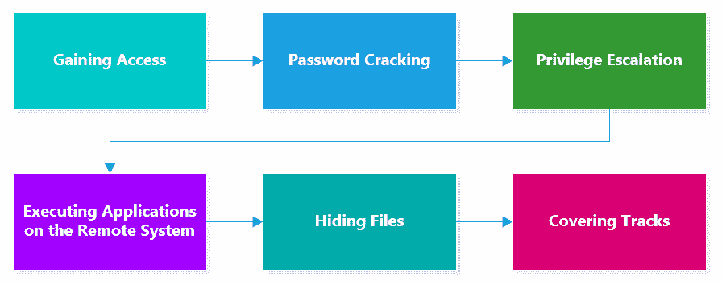

在接下来的部分中，我们将了解可以使用的各种方法，以便进入目标系统。

# WEP 开裂

通过使用无线网络，具有 IEEE 802.11 兼容设备（如笔记本电脑）的用户能够连接到无线接入点。这将允许他们访问本地网络上的资源，就像他们使用导线进行物理连接一样。无线网络为用户提供了很多便利，无论是在家中还是在公司环境中。

默认情况下，无线网络是开放的，因此任何拥有笔记本电脑或智能手机的人都可以建立连接。这引起了对用户隐私和安全的关注。WEP 加密标准用于早期的无线网络，目前仍由家庭用户和 IT 管理员实施。

WEP 加密标准使用**Rivest 密码 4**（**RC4**）加密密码，使用**40 位密钥**进行数据加密。在开发时，这被认为是非常安全的，但到 2002 年，在标准中发现了多个安全弱点。攻击者可以在几个小时内获得加密密钥。使用 40 位密钥，攻击者可以非常快速地捕获和解密通信量，从而破坏 WEP 加密标准的机密性。在现代密码标准中，使用更大的加密密钥来防止对数据加密的此类攻击。

作为攻击性安全领域的网络安全专业人员，了解使用 Kali Linux 执行 WEP 破解时应采用的技术非常重要。

执行以下步骤以完成此操作：

1.  使用以下命令在无线适配器上启用监视模式：

```
airmon-ng check kill airmon-ng start wlan0
```

2.  在附近的接入点上执行无线嗅探，直到发现目标：

```
airodump-ng wlan0mon
```

找到目标后，记下其 BSSID、通道和 ESSID 值。

3.  获取详细信息后，在键盘上使用*Ctrl*+*C*停止`airodump-ng`，然后进入下一步。
4.  尝试捕获目标无线网络的数据包：

```
airodump-ng --bssid <target BSSID value> -c <channel #> wlan0mon -w <output file>
```

让我们看看其中一些命令的作用：

5.  对目标执行反身份验证攻击。

在目标接入点上执行反身份验证攻击将强制任何连接的客户端解除关联。一旦客户端断开连接，它们将自动尝试重新连接到接入点。这样做时，您正试图在客户端尝试重新验证时捕获 WEP 密钥：

```
aireplay-ng -0 0 -a <target's bssid> wlan0mon
```

捕获 WEP 密钥后（您将在运行`airodump-ng`的窗口上看到通知），您可以停止反身份验证攻击。

6.  接下来，让我们尝试破解 WEP 并检索密钥。

在目标无线网络上捕获足够的数据后，停止`airodump-ng`。在终端上使用`ls -l`命令，您将看到一个`.cap`文件。在新的终端窗口中，执行以下命令：

```
aircrack-ng -b <bssid of the access point> output_file.cap
```

此外，您可以使用以下简单命令来完成相同的任务：

```
aircrack-ng output_file.cap
```

以下屏幕截图是预期输出的示例：

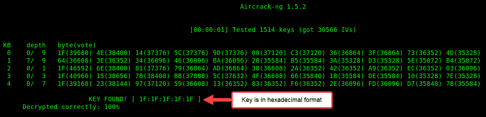

但是，您的 WEP 密钥将根据无线接入点管理员设置的值而有所不同。输出密钥以十六进制格式给出，因此您现在可以使用此十六进制密钥访问目标访问点。

完成本节后，您现在可以在无线网络上执行 WEP 破解。在下一节中，我们将深入探讨如何执行 WPA 破解技术。

# 湿法磷酸开裂

鉴于 WEP 中存在的安全漏洞，WPA 于 2002 年创建，作为 IEEE 802.11 网络的改进无线安全标准。WPA 使用**临时密钥完整性协议**（**TKIP**），该协议将 RC4 加密密码套件应用于无线接入点和客户端设备之间的数据隐私。

此外，后来开发了**Wi-Fi 保护接入 2**（**WPA2**，以解决其前身的安全缺陷。WPA2 使用**高级加密标准**（**AES**进行数据加密，而不是 RC4 密码。此外，WPA2 还通过密码分组链接消息**认证码协议**（**CCMP**实现了**计数器模式，取代了 TKIP。**

现在，让我们进入有趣的部分，破解 WPA 以进入目标无线网络：

1.  在无线适配器上启用监视模式：

```
airmon-ng check kill airmon-ng start wlan0
```

2.  在附近的接入点上执行无线嗅探，直到发现目标：

```
airodump-ng wlan0mon
```

找到目标后，请注意其 BSSID、通道和 ESSID 值。获取详细信息后停止`airodump-ng`，然后进入下一步。

3.  尝试捕获目标无线网络的数据包：

```
airodump-ng --bssid <target BSSID value> -c <channel #> wlan0mon -w <output file>
```

4.  对目标执行反身份验证攻击。

在目标接入点上执行反身份验证攻击将强制任何连接的客户端解除关联。一旦客户端断开连接，它们将自动尝试重新连接到接入点。这样做时，您正试图在客户端尝试重新验证时捕获 WEP 密钥：

```
aireplay-ng -0 0 -a <target's bssid> wlan0mon
```

捕获 WPA 握手后，如以下屏幕截图所示，可以停止反身份验证攻击：

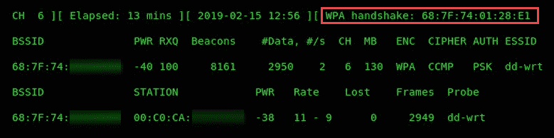

使用*Ctrl*+*C*停止反验证攻击，进入下一步。

5.  为了破解 WPA，我们将使用单词列表。使用**crunch**，您可以生成自己的自定义密码单词列表。此外，以下是已预装在 Kali Linux 上的各种单词列表的位置：

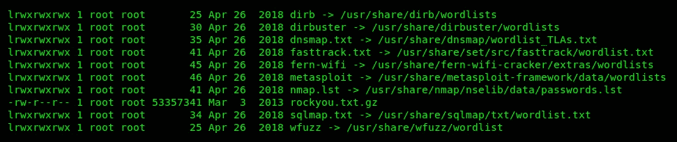

找到合适的单词列表后，我们可以使用带有`-w`参数的`aircrack-ng`工具指定我们选择的单词列表。

6.  要开始破解 WPA 密码，请使用以下命令：

```
aircrack-ng output_file.cap -w <wordlist>
```

`aircrack-ng`将尝试使用特定单词列表执行字典攻击，并在找到**键**时停止，如下图所示：


有时，单词列表可能不包含密码，结果可能不会有结果。使用**crunch**工具创建自定义单词列表，或尝试使用[上`SecLists`GitHub 存储库中的单词列表 https://github.com/danielmiessler/SecLists](https://github.com/danielmiessler/SecLists) 。

既然你已经完成了关于破解无线安全的这一部分，让我们来看看下面的部分，其中包括如何保护你的无线网络免受网络攻击。

# 保护您的网络免受上述攻击

正如您在上一节中所看到的，渗透测试人员或恶意黑客可以尝试攻击您的无线网络并获取密钥（密码）。无论您是参加计算机安全课程的学生，还是 IT 专业人士，或者仅仅是一个爱好者，本节中所涉及的主题都是一些方法和技术，您可以使用这些方法和技术来保护您的网络免受此类攻击。

在以下章节中，我们将介绍以下主题：

*   SSID 管理
*   MAC 过滤
*   天线的功率电平
*   强密码
*   保护企业无线网络的安全

让我们潜水吧！

# SSID 管理

当您购买新的接入点或无线路由器时，默认的**服务集标识符**（**SSID**通常是制造商的标识符。例如，新 Linksys 接入点的默认 SSID（无线网络名称）将包含名称`Linksys`作为其 SSID。许多制造商这样做是为了帮助用户在设置新接入点时快速识别其无线网络。但是，许多个人和组织使用默认的 SSID。

保持默认 SSID 不变可能是一个安全问题。假设您为您的家庭或组织获取了一个新的 Linksys 访问点，并且在设置过程中，您决定保留设备 SSID 的默认配置。单词`Linksys`将是网络名称的一部分。作为一名渗透测试人员，他正在对附近的接入点进行无线扫描，看到制造商的名字有助于分析设备并研究针对`Linksys`AP 的特定漏洞。

想象一下，在扫描无线接入点时看到单词`Netgear`。您只需在谷歌上搜索该特定品牌的已知安全漏洞和错误配置列表，如以下屏幕截图所示：


简而言之，您不应该使用任何可能吸引黑客或泄露接入点和组织身份的名称。我经常看到公司用他们组织的名称创建 SSID，有时将 SSID 的用途作为名称的一部分。

例如，使用名称`CompanyName_Admin`。任何正在执行任何类型的无线安全审计的渗透测试人员最初都会以此类网络为目标。

隐藏 SSID 是一种很好的做法，但如前几节所述，仍然可以使用`airodump-ng`等无线嗅探技术发现 SSID。此外，在基于 Windows 的系统上，您可以使用**NetStubler**（[www.netstubler.com](https://www.google.com/url?sa=t&rct=j&q=&esrc=s&source=web&cd=1&cad=rja&uact=8&ved=2ahUKEwidnMDXmfjiAhVFTd8KHTPZAS8QFjAAegQIABAB&url=http%3A%2F%2Fwww.netstumbler.com%2Fdownloads%2F&usg=AOvVaw1txhDBmLy67I3rlfCDYpX8)）和**inSSIDer**（[https://www.metageek.com/products/inssider/](https://www.metageek.com/products/inssider/) 。

在下一节中，我们将讨论无线网络上 MAC 过滤的目的。

# MAC 过滤

每个受管接入点及其无线路由器为连接的设备提供基本类型的访问控制。在接入点上启用 MAC 过滤允许您指定可以和不能连接到接入点的允许和限制设备的列表。然而，有一些技术，所有这些都在前一章中介绍过，允许渗透测试人员捕获授权设备（其 MAC 地址）的列表，并执行欺骗以获得未经授权的访问。但是，仍然应该应用此功能，因为在您的网络上拥有某种安全性比完全没有安全性要好。

在下一节中，我们将介绍天线功率级的概念。

# 天线的功率电平

某些接入点在其操作系统或固件中具有允许您手动调整天线功率水平的功能。通过降低天线上的功率电平，无线信号的广播范围将减小。将功率级别设置为 100%将确保信号具有最大覆盖范围。如果您担心其他人能够在无线网络上查看和截获您的数据，则此功能非常方便。

现在我们已经了解了功率级在天线上的作用，我们将介绍创建强密码的要点。

# 强密码

破解用户密码通常取决于密码本身的复杂性。许多用户倾向于在设备上设置简单易记的密码短语，尤其是在无线网络上。然而，复杂的密码会给渗透测试人员或黑客带来困难。复杂密码具有以下特征：

*   它们包含大写字符
*   它们包含小写字符
*   它们包含数字
*   它们包含特定的符号
*   它们的长度超过 12 个字符
*   它们不包含名称
*   它们不包含出生日期
*   它们不包含车辆的车牌号

下面是由密码管理器**LastPass**（[www.LastPass.com](http://www.lastpass.com)生成的复杂密码示例：


这样做的目的是确保没有人能够轻易猜到或泄露您的密码。如果恶意用户能够泄露他人的用户凭据，则攻击者可以对受害者的网络和/或个人生活造成严重破坏。

在下一节中，我们将描述可在企业网络上实施的技术，以改善其安全态势。

# 保护企业无线网络的安全

企业无线网络应使用以下 as 技术来降低无线网络攻击的风险：

*   在组织拥有和管理的每个无线网络上实施**无线入侵防御系统**（**WIPS**）。
*   确保所有有线和无线设备都安装了最新固件和修补程序。
*   确保设备和配置符合**国家标准与技术研究所**（**NIST**）。请看 NIST 框架[中的*建立无线健壮安全网络*部分 https://csrc.nist.gov/publications/detail/sp/800-97/final](https://csrc.nist.gov/publications/detail/sp/800-97/final) 了解更多信息。
*   尽可能实施多因素身份验证以访问公司网络。
*   实现**可扩展认证协议****EAP****传输层安全****TLS**基于证书的方法，确保无线通信的机密性和真实性。
*   将 WPA2 Enterprise 与 AES 加密一起使用。
*   实现一个独立的客户无线网络。

实施这些技术和控制有助于降低企业网络上的安全风险。在下一节中，我们将介绍配置和保护无线网络所需遵循的步骤。

# 配置无线安全设置以保护网络安全

在本节中，我们将讨论如何在接入点和无线路由器上配置无线安全功能，以便保护网络安全。

在本练习中，我使用的是 Linksys EA6350 无线路由器。请注意，所有无线路由器和接入点在其管理界面内具有相同的功能；但是，每个制造商和设备的**图形用户界面**（**GUI**）可能会有所不同。

让我们开始吧！

1.  您需要登录到您的接入点或无线路由器。
2.  登录后，单击用户界面中的**无线**选项卡。在这里，您可以更改网络名称（SSID）、设置复杂密码、设置安全模式并广播 SSID，如以下屏幕截图所示：


使用以下指导原则将有助于改善无线网络的安全状况：

每个现代接入点和无线路由器都允许各种安全模式，例如：

您可以选择禁用 SSID 广播以隐藏网络。

3.  接下来，您应该看到另一个子选项卡，它允许您配置**MAC 过滤**。

4.  启用 MAC 过滤功能。启用后，您可以选择将 MAC 地址添加到允许或拒绝列表中，如以下屏幕截图所示：

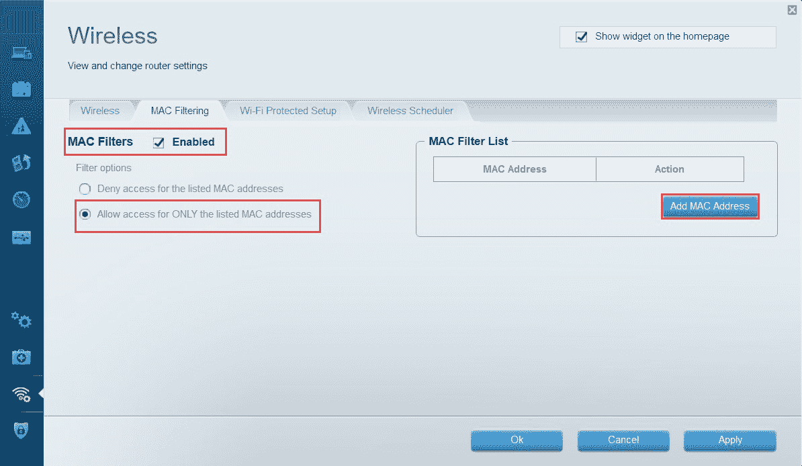

5.  最后，禁用**Wi-Fi 保护设置**功能，如下图所示：


WPS 存在已知的安全漏洞，不应在安全环境中使用。

完成此练习后，您现在可以配置和设置无线网络。在下一节中，我们将介绍利用外围系统的要点。

# 利用 Metasploit 开发易受攻击的外围系统

利用网络上的目标系统有时是一项具有挑战性的任务。漏洞攻击只是设计用来利用安全漏洞（弱点）的代码片段。在[第 5 章](05.html)、*被动信息采集*、[第 6 章](06.html)、*主动信息采集*、[第 7 章](07.html)、*使用漏洞扫描工具*中，我们深入研究了如何使用各种工具（如 Nmap 和 Nessus）在目标系统中建立安全缺陷。在本节中，我们将利用迄今为止开发的信息和技能集，并使用 Metasploit 框架执行利用。

在本练习中，我们将使用 Kali Linux 机器作为攻击者，将 Metasploitable 机器作为目标。让我们开始：

1.  让我们使用 Nmap 对目标执行**服务版本扫描**。这将帮助我们确定正在运行的端口、协议和服务版本。执行**`nmap -sV <target IP addr>`**命令：


正如我们所看到的，target 上有许多服务。

2.  通过启用**PostgreSQL**数据库服务启动**Metasploit**框架。然后，初始化 Metasploit 框架并在终端窗口中执行以下命令：

```
service postgresql start msfconsole
```

Metasploit 框架应该需要一两分钟来初始化。准备好后，您将看到一个有趣的欢迎横幅和**命令行界面**（**CLI**）。

根据我们的 Nmap 结果，`21`端口已打开，正在运行**文件传输协议**（**FTP**。通过执行服务版本扫描，我们可以确定它是否正在运行**vsftpd 2.3.4**守护程序。在 Metasploit 界面上，您可以使用`search`命令搜索模块（扫描器、漏洞利用等），后跟关键字或字符串。

3.  在 Metasploit 控制台上，通过运行以下命令，搜索可能帮助我们破坏目标计算机上 FTP 服务器的任何有用模块：

```
search vsftpd
```

4.  Metasploit 将为我们提供满足搜索条件的结果列表。您应该看到控制台返回一个名为`vsftpd_234_backdoor`的基于 Unix 的攻击。要在我们的目标上使用此漏洞，请使用以下命令序列：

```
msf5 > use exploit/unix/ftp/vsftpd_234_backdoor 
msf5 exploit(unix/ftp/vsftpd_234_backdoor) > set RHOSTS 10.10.10.100 
msf5 exploit(unix/ftp/vsftpd_234_backdoor) > exploit
```

在我的实验室环境中，目标使用的是`10.10.10.100`IP 地址。请确保在 Metasploit 上设置`RHOSTS`（远程主机）值之前验证目标设备的 IP 地址。此外，还有许多模块需要您设置远程目标。您可以使用`setg`命令全局设置目标。

5.  执行`exploit`命令。Metasploit 将尝试将攻击代码推送到目标。一旦成功，将创建一个 shell。shell 允许我们在目标上远程执行来自攻击者机器的命令，如以下屏幕截图所示：


6.  此时，在控制台上执行的任何命令都将在目标上执行。执行`uname -a`命令验证并打印系统信息：

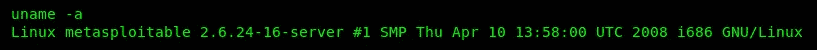

通常，在面向公众和内部系统上执行简单的端口扫描时，`23`端口通常为远程管理打开。但是，端口`23`是用于 Telnet 协议的默认端口。Telnet 是一种不安全的协议，它允许用户通过网络远程访问机器以及用户之间的所有通信量。任何启用 Telnet 的设备都是未加密的，容易受到 MITM 攻击，攻击者可以很容易地捕获用户凭据。

7.  让我们使用`search`命令查找一个有用的模块，以检查启用 Telnet 的设备上的有效用户凭据。要开始，请使用以下命令：

```
search telnet
```

8.  与往常一样，符合搜索条件的结果列表将显示在控制台上。在本练习中，我们将使用特定的扫描仪检查已验证的用户帐户：

```
msf5 > use auxiliary/scanner/telnet/telnet_login
```

9.  接下来，设置远程主机：

```
msf5 auxiliary(scanner/telnet/telnetlogin) > set RHOSTS 10.10.10.100
```

10.  如果有包含不同用户名的单词列表，请使用以下命令（指定文件路径）：

```
msf5 auxiliary(scanner/telnet/telnetlogin) > set USER_FILE <username word list>
```

（可选）如果您有密码列表，请使用以下命令：

```
msf5 auxiliary(scanner/telnet/telnetlogin) > set PASS_FILE <wordlist>
```

11.  但是，如果您没有任何单词列表，那也没关系。您可以使用以下命令指定单个用户名和密码：

```
msf5 auxiliary(scanner/telnet/telnetlogin) > set USERNAME uname msf5 auxiliary(scanner/telnet/telnetlogin) > set PASSWORD word
```

12.  完成后，使用`run`命令执行`auxiliary`模块：

```
 msf5 auxiliary(scanner/telnet/telnetlogin) > run 
```

请务必等待几秒钟，以便扫描仪启动。有时，您不会立即在屏幕上看到结果。

我们使用`run`命令执行`auxiliary`模块，`exploit`命令执行 Metasploit 中的漏洞利用。

以下屏幕截图表明找到了有效的用户名和密码：


正如我们已经提到的，您可以使用**crunch**生成您喜欢的自定义单词列表。此外，一组单词列表位于 Kali Linux 的`/usr/share`目录中：


请记住，当执行密码攻击或试图发现有效的用户凭据时，该任务可能非常耗时，并且可能并不总是对您有利。然而，这说明了渗透测试侦察（信息收集）阶段的重要性。我们能够收集到的有关目标的详细信息越多，我们就越能够将攻击范围缩小到针对特定系统或网络基础设施的特定攻击。

接下来，我们将尝试利用此漏洞并获得对目标系统（即 Microsoft Windows）的访问权限。

# 永恒蓝色开发

让我们尝试利用 Windows 系统获取一个 shell。对于本练习，可以将 Windows 7、8、8.1 或 10 操作系统用作目标/受害者计算机。以下是 my lab 拓扑图，显示了攻击者和受害者计算机的 IP 分配：

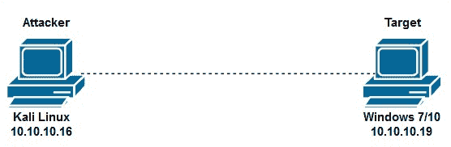

如果您的 IP 方案不同，请确保在继续之前记录每台计算机的 IP 地址，因为您需要它们。让我们开始：

1.  首先，让我们尝试在目标 Windows 系统上运行漏洞扫描。以下代码段是使用`nmap --script vuln 10.10.10.19`命令的结果：


突出显示的区域表示我们的目标容易受到 Microsoft 安全公告 ID`ms17-010`（称为**永恒蓝**的远程代码执行攻击。对该漏洞的进一步研究表明，目标容易受到 WannaCry、Petya 和其他恶意软件的攻击。

攻击者可利用该 EternalBlue 漏洞在 Microsoft SMBv1 服务器上执行远程代码。

2.  在**Metasploit Framework**（**MSF**控制台中，使用`search ms17-010`命令过滤永久蓝色漏洞利用的结果，如下图所示：

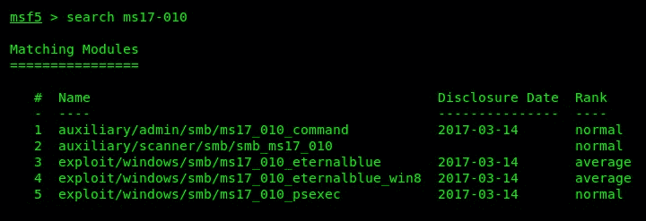

3.  MSF 控制台返回了一些结果。我们将使用`ms-17-010_eternalblue`漏洞和**MeterMeter 反向 TCP 有效负载**尝试从受害者机器到攻击者机器的反向连接（反向外壳）。要完成此任务，请使用以下命令，如以下屏幕截图所示：


4.  执行该漏洞攻击后，您现在将拥有一个`meterpreter`外壳。`meterpreter`shell 将允许您在攻击者机器和受害者操作系统之间无缝通信。

根据 SANS（[www.SANS.org](https://www.google.com/url?sa=t&rct=j&q=&esrc=s&source=web&cd=2&cad=rja&uact=8&ved=2ahUKEwjjwcul2N3iAhUpTt8KHZ-9CJUQFjABegQICxAE&url=https%3A%2F%2Fwww.sans.org%2Fsecurity-resources%2Fsec560%2Fmisc_tools_sheet_v1.pdf&usg=AOvVaw0RrqNTtD6wrNTYHi-YFz2N)），MeterMeter 是 Metasploit 框架内的一种有效负载，通过作为加载在目标机器上任何进程中的 DLL 运行，提供对被攻击目标系统的控制。

使用`hashdump`命令，您将能够检索受害者机器上所有本地存储的用户帐户的密码哈希：


帐户的用户名始终以纯文本显示，如前面的屏幕截图所示。

MeterMeter 中的`hashdump`命令用于检索 Windows 系统中的用户帐户。用户帐户由三个组件组成：**安全 ID**（**SID**）、用户名和密码。密码将转换为 NTLM 哈希并存储在较新版本的 Windows 中。在旧版本的 Windows（如 Windows XP）中，使用**LAN Manager**（**LM**存储密码。因此，Windows 操作系统从未实际存储用户帐户的密码；它存储哈希值。

以下是我们可以在`meterpreter`shell 中使用的一些有用命令：

5.  要在受害者的机器上获取外壳，请键入`shell`并按*进入*：

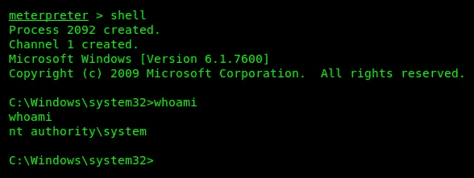

现在，您的 Kali Linux 机器上有了一个 Windows 命令提示符界面。现在，您可以远程执行 Windows 命令。

现在我们简要介绍了利用漏洞的情况，让我们使用远程访问系统获得访问权限。

# 渗透测试 Citrix 和基于 RDP 的远程访问系统

在本节中，我们将了解在大多数 IT 环境中对两种流行的远程访问系统执行渗透测试：Citrix 和 Microsoft 的**远程桌面协议**（**RDP**。

让我们深入研究 Citrix 和 RDP 渗透测试并获取访问权限。

# Citrix 渗透测试

我们大多数人可能都听说过微软的 RDP，它允许用户在**图形用户界面**（**GUI**中通过网络远程访问另一台 Windows 计算机。Citrix 与 RDP 类似，但在提供交互式用户界面的同时，性能要好得多。

许多组织使用 Citrix 服务和产品来高效地分配对组织内应用程序的访问。使用 Citrix 的一个例子是在组织的私有数据中心内运行应用程序。使用 Citrix，IT 管理员可以向这些应用程序的用户提供访问权限。每个用户都需要一个现代化的 web 浏览器来访问虚拟桌面界面或集中访问数据中心中的应用程序。这种方法无需在每位员工的计算机上安装软件应用程序。让我们开始：

1.  我们可以使用 Nmap NSE 脚本`citrix-enum-apps`来发现和提取应用程序。以下是在 Nmap 中使用脚本的示例：

```
nmap -sU --script citrix-enum-apps <citrix server IP address>
```

2.  此外，您可以指定`-p 1604`，因为 Citrix WinFrame 同时使用 TCP 和 UDP 端口`1604`。
3.  找到 Citrix 计算机后，您可以尝试通过使用以下 URL 登录来连接到已发布的应用程序：

```
http://<server IP>/lan/auth/login.aspx
```

4.  登录后，单击应用程序将`launch.ica`文件下载到桌面。下载文件后，使用记事本或其他文本编辑器打开文件。

5.  寻找一个名为`InitialProgram`的参数，该参数指向`LIFE UAT`应用程序。将参数更改为`InitialProgram=explorer.exe`并保存文件。
6.  双击新保存的文件以打开 Citrix 服务器的资源管理器。这将使我们能够读取`lan/auth/login.aspx`文件和其他敏感文件。
7.  一旦您拥有 Citrix 终端，环境可能会受到限制（黑屏）。打开**任务管理器**点击**文件****新建任务**。新任务窗口将打开。键入`explorer.exe`并单击**确定**。
8.  在 Windows 资源管理器中，导航到包含所有`.aspx`文件的目录，以确认您在 Citrix 服务器上。

这种技术允许用户突破**Citrix**虚拟化环境。在下一节中，我们将在 Microsoft RDP 上执行渗透测试，并尝试获得访问权限。

现在您已经完成了本节，让我们尝试利用企业环境中最流行的远程访问服务之一，即 Microsoft 的 RDP。

# 闯入 RDP

Microsoft 的 RDP 为用户提供了一个 GUI，用于通过网络建立与基于 Windows 的系统的连接。通常，系统管理员在组织中的客户机和服务器机器上启用 RDP 服务，以便于访问。在设备上启用 RDP 后，系统管理员无需亲自前往系统的地理位置检查其配置或调整操作系统。他们只需使用 RDP 登录即可。此协议使 IT 专业人员的工作更轻松、更高效。

该协议是为远程访问而设计的。但是，作为渗透测试人员，我们可以通过尝试发现目标系统的有效用户凭据来利用启用了 RDP 的系统。让我们开始：

1.  首先，我们可以使用 Nmap 扫描网络，同时搜索启用 RDP 的任何设备。RDP 在 Windows 上使用端口`3389`，因此我们可以使用以下 Nmap 命令扫描目标：

```
nmap -p 3389 -sV <target IP address>
```

以下屏幕截图表示端口`3389`打开且正在运行`Microsoft Terminal Services`的系统：

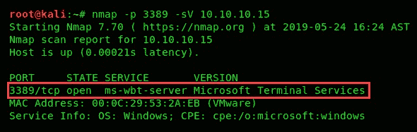

2.  现在我们已经找到了一个合适的目标，我们可以对活动目标执行字典攻击。使用**Ncrack**（离线密码破解工具），我们可以使用可能的用户名（`usernames.txt`）和密码（`custom_list.txt`）列表，如下截图所示：

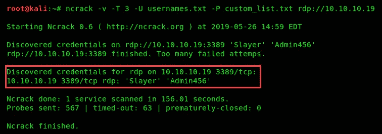

以下是对前面代码段中使用的每个开关的描述：

正如您所看到的，**Ncrack**能够为目标（`10.10.10.19`）找到有效的用户名和密码组合。因此，在获得了用户的凭据之后，现在就可以简单地利用它们为我们带来好处。

3.  此时，获得有效的用户帐户后，下一步是使用目标系统上运行的 RDP 和其他网络服务（Telnet、SSH、VNC 等）实际登录到目标系统。

我们可以使用的另一个**在线密码破解**工具是**Hydra**。要使用 Hydra 执行我们刚刚使用 Ncrack 执行的相同任务，您可以执行以下命令：

```
hydra -V -f -L usernames.txt -P custom_list.txt rdp://10.10.10.19
```

请注意，Hydra 中的 RDP 模块可能无法在现代版本的 Windows 上工作。有关 Hydra 的更多信息，请访问其官方 GitHub 存储库[https://github.com/vanhauser-thc/thc-hydra](https://github.com/vanhauser-thc/thc-hydra) 。

在**Metasploit**中收到`meterpreter`shell 后，以下是一些有用的命令，可帮助您捕获击键和受害者屏幕：

*   `screenshare`：此命令用于实时监视远程受害者的桌面。
*   `screenshot`：拍摄受害者的桌面照片。
*   `keyscan_start`：使用 MeterMeter 启动按键记录。
*   `keyscan_stop`：停止按键记录。
*   `keyscan_dump`：生成捕获的击键转储。

以下屏幕截图显示了在 MeterMeter 中执行`screenshare`命令后受害者桌面的实时屏幕视图：

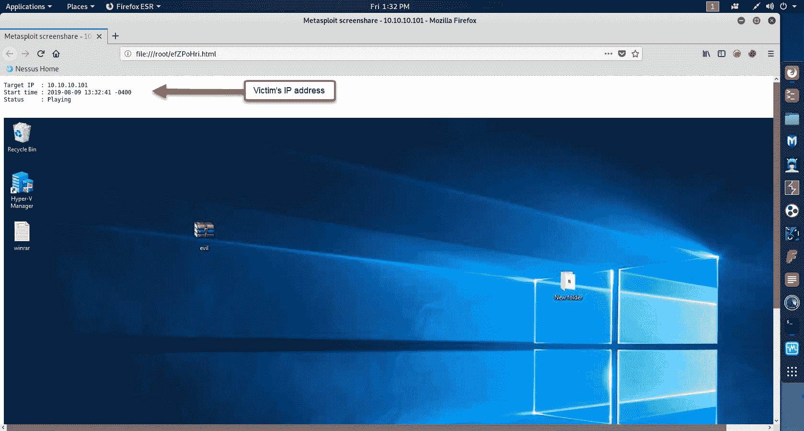

正如你所看到的，一个真正的黑客一旦进入一个网络或系统就会做什么，这是非常可怕的。

您现在可以检测并利用 Windows 操作系统中的 EternalBlue 漏洞进行攻击。接下来，我们将了解如何利用用户凭据为我们带来好处。

# 利用用户凭据

现在我们已经获得了目标 Microsoft Windows 系统的用户凭据，让我们尝试远程连接。在本练习中，我们将使用**rdesktop**客户端，该客户端已经预装在 Kali Linux 中。让我们开始：

**rdesktop** is an open source protocol that's used for remote administration, similarly to Microsoft's RDP.

1.  要使用 rdesktop，请打开新的终端窗口并使用以下语法：

```
rdesktop -u <username> -p <password> <target's IP address>
```

以下代码段是使用 rdesktop 工具的一个示例，其中包含所有必要的详细信息：

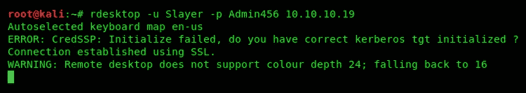

2.  执行该命令后，rdesktop 将尝试建立到目标设备的远程连接。一旦成功，rdesktop 将提供一个带有目标用户界面的新窗口，如以下屏幕截图所示：

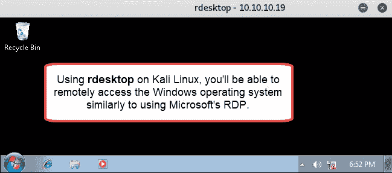

此时，我们已成功进入目标操作系统并对其进行控制。

如果您的攻击者系统没有 rdesktop 工具，可以在其官方 GitHub 存储库中找到该工具：[https://github.com/rdesktop/rdesktop](https://github.com/rdesktop/rdesktop) 。有关 rdesktop 的更多信息，请访问其官方网站[www.rdesktop.org](http://www.rdesktop.org)。

正如您所看到的，我们可以简单地使用 Kali Linux 中的本机工具以及受害者的凭据，在渗透测试期间访问资源、系统和网络。在下一节中，我们将深入讨论网络植入。

# 将 PWN 盒和其他工具直接插入网络

通常，渗透测试人员倾向于在一个组织的网络中植入一个小的、特殊的盒子。这些被称为网络植入物，有时被称为 PWN 盒。网络植入允许攻击者通过连接到植入工具建立从 internet 到公司网络的连接，如以下屏幕截图所示：

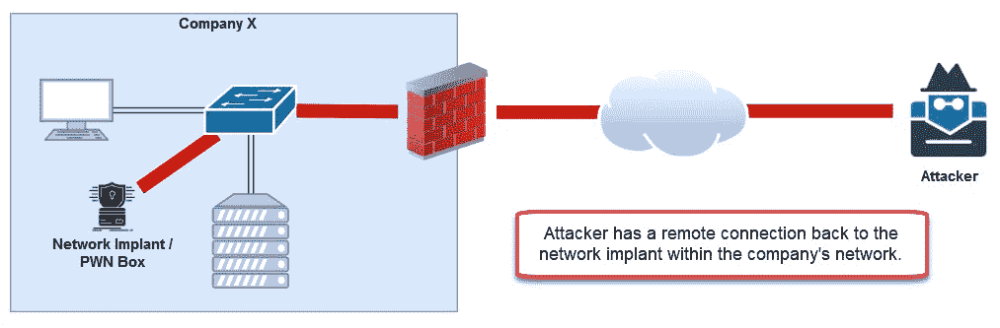

下面是一张可以插入以拦截网络流量的网络植入的照片。该设备能够捕获实时数据包并将其存储在 USB 闪存驱动器上。它具有远程访问功能，允许渗透测试人员或系统管理员远程访问设备，从而允许用户在网络上远程执行各种任务。这个小设备被称为**包松鼠**，由 Hak5 创建：

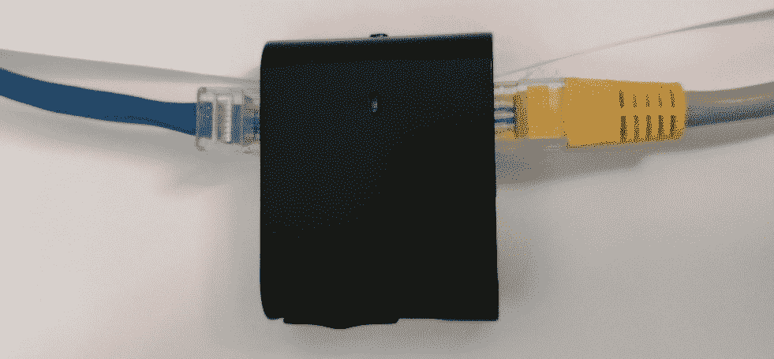

此外，还有另一个设备看起来像 USB 以太网适配器。这种所谓的以太网适配器也是另一种网络植入物，它允许渗透测试人员远程访问网络并执行各种任务，如扫描、攻击和旋转。这个小装置被称为**蓝龟**，这是 Hak5 生产的另一件神奇的装备：


在过去的几年里，**树莓 Pi**（[www.raspberrypi.org](http://www.raspberrypi.org)被引入计算世界。今天，许多机构、组织和家庭将 Raspberry Pi 用于许多项目，从学习到编程，再到家庭安全监控系统。使用这台小小的信用卡大小的计算机，可能性是无穷的：


但是，Raspberry Pi 目前有许多可用的操作系统，其中之一是 Kali Linux ARM 映像（[https://www.offensive-security.com/kali-linux-arm-images/](https://www.offensive-security.com/kali-linux-arm-images/) ）。想象一下将 Kali Linux 加载到这个便携式设备、将其植入组织的网络并设置远程访问的可能性。如果这种情况是由真正的攻击者实施的，其结果将是严重的，但是渗透测试人员将能够通过向客户展示他们在内部网络中发起的攻击中的脆弱性，从而大大帮助他们的客户。

有如此多的设备和小工具可以促进渗透测试，其可能性是无限的。在下一节中，我们将介绍 NAC 的基本原理。

# 绕过 NAC

NAC 是一个旨在控制访问并确保合规性的系统。它使用一组过程和技术，重点是控制谁和什么能够访问网络及其资源。NAC 通过授权具有一定合规性的设备在公司网络上运行来实现这一点。

设备连接后，NAC 服务器能够在允许访问网络资源、安全策略和控制之前，分析并检查连接的设备是否符合标准，配置为确保存在某种形式的限制，防止不合规设备获得网络访问。

IEEE 802.1x 是 LAN（有线）和 WLAN（无线）网络的 NAC 标准。在 802.1x 网络中，有三个主要组件：

*   **认证服务器**：认证服务器是在网络上处理**认证、授权、计费**（**AAA**业务的设备。这是创建和存储用户帐户的地方，也是应用特权和策略的地方。认证服务器运行**远程认证拨入用户服务**（**RADIUS**）或**终端访问控制器访问控制系统加**（**TACACS+**作为其协议。
*   **验证器**：这通常是您试图访问的网络设备，无论是出于管理目的还是为了简单地访问网络。此类设备可以是无线路由器/接入点或网络交换机。
*   **请求方**：请求方是希望访问网络的客户端设备，如智能手机或笔记本电脑。请求者连接到网络（有线或无线），并通过验证器提供的身份验证登录窗口进行提示。当用户提交其用户凭据时，身份验证程序将查询身份验证服务器以验证用户，并确定在用户登录到网络时应用哪些策略和权限。

绕过 NAC 系统可能有点困难。在本章和上一章的过程中，我们了解了如何收集用户凭据并伪造攻击者机器（Kali Linux）的身份。使用目标网络上有效用户的 MAC 地址和用户凭据将为您提供对安全网络的某种访问。

但是，NAC 服务器能够分析所有连接设备上的操作系统和反恶意软件保护。如果您的系统不满足法规遵从性要求，这可能会触发红旗或基于策略不允许访问。

# 总结

在本章中，我们能够涵盖许多实际内容，例如打破 WEP 和 WPA 无线加密标准以恢复密钥（密码短语）。在利用了无线安全性之后，讨论并演示了最佳实践，以便我们能够保护无线网络免受潜在黑客的攻击。

此外，还介绍了在 Microsoft 的 RDP 和 Citrix 服务上进行渗透测试的实用方法。最后，我们介绍了各种网络植入的用途，以及它们如何维护对公司网络的远程访问。

现在，您已经具备了访问无线网络、在目标系统上执行攻击以及访问 Linux 和 Windows 操作系统的技能。

在[第 11 章](11.html)、*网络渗透测试-连接后攻击*中，我们将探讨连接后阶段的各种工具。

# 问题

1.  WPA2 使用什么算法进行数据加密？
2.  什么 Nmap 脚本用于发现运行 Citrix 应用程序的服务器？
3.  Microsoft 的 RDP 使用的默认端口是什么？
4.  Kali Linux 中有哪些密码破解工具？
5.  什么设备通常用于存储所有用户帐户和策略？
6.  哪个命令可用于在 Metasploit 中查找模块？
7.  NAC 的标准是什么？

# 进一步阅读

以下是一些额外的推荐阅读资源：

*   **释放的变质体**：[https://www.offensive-security.com/metasploit-unleashed/](https://www.offensive-security.com/metasploit-unleashed/)
*   **附加安全工具**：[https://sectools.org/](https://sectools.org/)