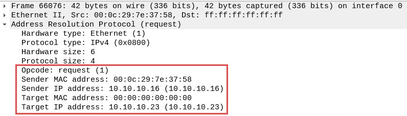
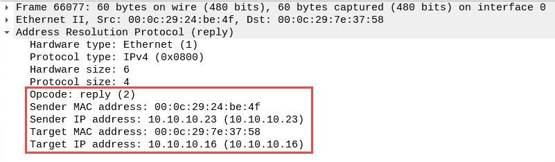
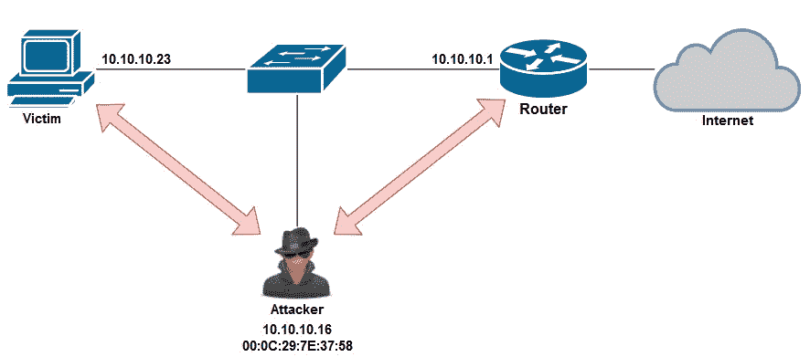
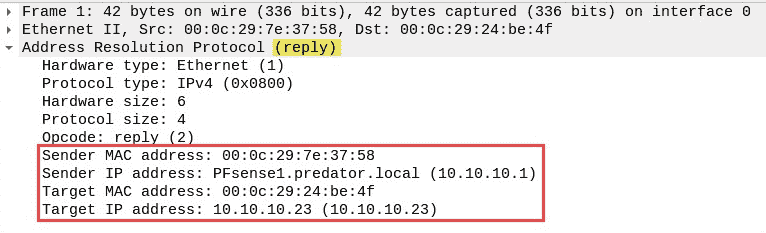
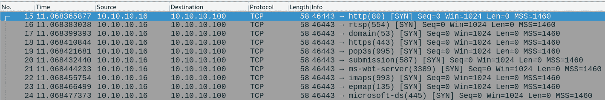
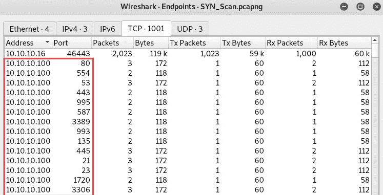
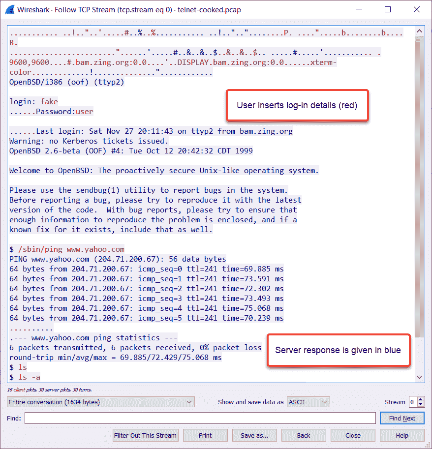
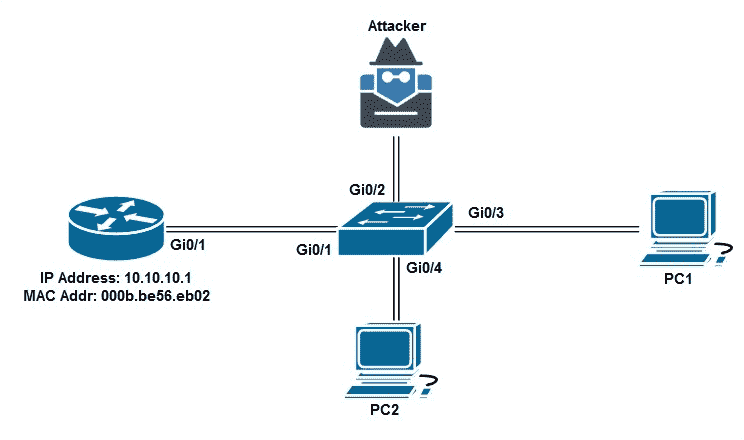

# 网络渗透测试.检测和安全

作为渗透测试人员理解网络安全的概念本身就是一项资产。在本章中，我们将重点讨论网络安全操作方面的问题。了解如何检测威胁和可疑网络流量模式非常重要，因为这将帮助 it 安全团队检测和阻止网络上的攻击。您将了解各种**蓝队战术**，这些战术用于检测和防止组织网络基础设施中的网络攻击。在向客户提交渗透测试报告后，客户可能会要求提供额外的服务，使其能够检测和防止组织中的网络威胁。本章将帮助您开始使用可疑流量监控和预防技术。

在本章中，我们将介绍以下主题：

*   使用 Wireshark 理解 ARP
*   检测 ARP 中毒攻击
*   侦查可疑活动
*   **中间人**（**MITM**修复技术
*   嗅探修复技术

# 技术要求

本章的技术要求如下：

*   卡利 Linux:[https://www.kali.org/](https://www.kali.org/)
*   Wireshark Telnet 文件：[https://wiki.wireshark.org/SampleCaptures#Telnet](https://wiki.wireshark.org/SampleCaptures#Telnet)

# 使用 Wireshark 理解 ARP

**地址解析协议**（**ARP**）旨在将 IP 地址解析为 MAC 地址。在 IT 专业人士中，ARP 的重要性有时被低估。**局域网**（**LAN**上）或同一子网内设备之间的所有通信均使用**媒体访问控制**（**MAC**地址。这意味着设备不使用 IP 地址，除非通信超出其本地子网，例如到另一个网络（或子网）。

让我们用一个简单的例子来模拟一台 PC，它希望将要打印的文档发送到网络打印机。如果这两个设备位于同一子网中，则 PC 将其消息（文档）封装在一个帧内，并将其发送到网络交换机。网络交换机将读取帧的目标 MAC 地址，并将其转发到网络打印机进行处理。

让我们来看看下面的截图。这是一个被 Wireshark 捕获的帧。看看第 2 层协议，即 ARP，我们可以确定一些事情：



此帧是一条**地址解析协议（请求）**消息。此帧的发送方 MAC 地址为`00:0c:29:7e:37:58`，IP 地址为`10.10.10.16`。`10.10.10.16`机器正在本地网络上发送广播。这可以通过观察帧中的目的地 MAC 地址为`ff:ff:ff:ff:ff:ff`来确定；但是，**目标 MAC 地址**为空，**目标 IP 地址**为`10.10.10.23`。简单地说，`10.10.10.16`机器正在询问本地网络上的每个人`10.10.10.23`是谁以及设备的 MAC 地址是什么。

下面的屏幕截图显示了来自`10.10.10.16`的**地址解析协议（应答）**（应答）帧。请花一些时间观察框架内的所有字段：



IP 地址为`10.10.10.23`的设备回复发送方（`10.10.10.16`，表示其 MAC 地址为`00:0c:29:24:be:4f`。对于`10.10.10.16`和`10.10.10.23`之间未来的所有通信，这两个设备的 ARP 缓存中都有彼此的 MAC 地址。这些 MAC 地址将用于在网络上转发帧。

在本节中，您学习了如何使用 Wireshark 查看和解释在网络上传输的 ARP 消息。在下一节中，我们将介绍如何检测网络上的 ARP 中毒攻击。

# 检测 ARP 中毒攻击

作为一名网络安全专业人员，您可能会被要求帮助某个组织识别对其网络基础设施的任何 ARP 中毒攻击。

ARP 中毒是指攻击者向受害者的机器发送虚假 ARP 消息，以产生修改受害者 ARP 缓存中条目的效果。这将导致受害者的机器向网络上的恶意设备而不是合法目的地发送帧（流量）。

为了解释 ARP 中毒的检测过程，我们将使用以下拓扑：



使用 Wireshark，我们可以查找网络上端点设备之间的特定通信模式。使用 Wireshark 上的`arp`过滤器，我们只能查看**ARP**消息，如下图所示：


在**信息**列中，一些数据包有不寻常的描述。通过在**数据包详细信息**窗格中扩展**帧 1**的信息，我们将能够看到发送方（攻击者）正在向`10.10.10.23`（PC）发送免费的 ARP 消息（ARP 回复）：



**帧 1**告知`10.10.10.23`网关`10.10.10.1`的 MAC 地址为`00:0c:29:7e:37:58`。这将导致受害者将其 ARP 缓存更新为将`10.10.10.1`映射到`00:0c:29:7e:37:58`。但是，此 MAC 地址属于 Kali Linux（攻击者）计算机。

以下屏幕截图显示了攻击者发送到网关（`10.10.10.1`的帧内容，说明 PC（`10.10.10.23`的 MAC 地址现在是`00:0c:29:7e:37:58`：


此外，Wireshark 一直在检测 ARP 帧内 MAC 地址的重复，并发出黄色警告。请记住，Wireshark 是一个网络协议分析器，而不是一个威胁监控应用程序，因此需要人为干预才能对网络流量进行进一步分析。Cisco Stealthwatch、AlienVault SIEM 和 OpenSOC 等安全设备和工具可以帮助网络安全专业人员快速识别威胁。

在本节中，您学习了如何使用 Wireshark 检测 ARP 中毒攻击。在下一节中，我们将了解如何检测网络上的可疑活动。

# 侦查可疑活动

在许多大型组织中，IT 部门通常实施**网络运营中心**（**NOC**，以监控和解决所有与网络相关的问题。随着安全威胁的增加，组织有时可以建立一个专注于网络安全的专门团队；该团队称为**安全运营中心**（**SOC**。

SOC 的职责范围从威胁监控和修复到安全设备配置、法规遵从性、取证，甚至逆向恶意软件工程。

SOC 应调查的一些可疑活动包括：

*   下班后交通异常高峰
*   异常出入境交通流量
*   异常 DNS 请求

下面的屏幕截图显示了我实验室中的 Wireshark 捕获。通过仔细观察数据包流，我们可以看到正在进行端口扫描：



正在进行端口扫描的机器具有 IP 地址`10.10.10.16`，而目标具有 IP 地址`10.10.10.100`。**信息**列提供每个数据包的简要摘要。在这里，我们可以看到一个**SYN**探测器正在发送到每个网络端口。我们可以清楚地看到，一个**SYN**（**隐形**扫描正在网络上执行。

要查看 Wireshark 中的所有 TCP 连接，请执行以下步骤：

1.  单击统计|端点。
2.  接下来，将出现**端点**窗口，显示与目标`10.10.10.100`的所有连接以及攻击者探测到的端口：



在网络安全领域，您将开始发展识别网络流量中异常流量模式的技能。然而，诸如 Wireshark 之类的工具可以极大地帮助您过滤和查看流经网络的特定类型的数据包。

在本节中，您了解了使用 Wireshark 检测网络上可疑活动的基本原理。在下一节中，我们将介绍防止和减轻 MITM 攻击的各种方法。

# MITM 修复技术

在本节中，我们将重点介绍 IT 专业人员可以用来阻止和防止针对 LAN 的 MITM 攻击的一些技术。我们将讨论以下主题，以了解它们在 LAN 中阻止和防止 MITM 攻击的作用：

*   加密
*   **动态 ARP 检测****DAI**

# 加密

在 MITM 攻击过程中，攻击者能够截获受害者与预期目的地之间的所有通信。加密数据不会被攻击者读取；但是，尽管进行了加密，攻击者仍可以查看以下详细信息：

*   源 IP 地址
*   目标 IP 地址
*   源端口
*   目的港
*   第三层协议

在攻击者的机器上，他们将只能查看以纯文本形式发送的流量。以下屏幕截图显示了网络上客户端和 Linux 服务器之间的 Wireshark 捕获：



服务器正在使用 Telnet 作为其远程访问方法。用户的输入用红色表示，而服务器的响应用蓝色表示。在这里，我们可以看到 Wireshark 重新组装了整个对话的所有 Telnet 数据包，并以漂亮的对话框格式呈现。换句话说，我们可以看到在两台设备之间的 Telnet 会话期间发生的一切。在此捕获中，记录了用户名和密码。

防止 MITM 攻击对公司网络至关重要，因为敏感信息每秒都以多种格式发送到整个组织。

在下一节中，我们将了解如何使用 DAI 配置 Cisco IOS 交换机。

# 动态 ARP 检测

DAI 是交换机上的一种安全功能，可防止无效 ARP 数据包进入网络。此技术用于防止局域网上的 MITM 攻击和 ARP 中毒攻击。

在下图中，我们可以看到攻击者试图在 PC 和路由器之间的网络上执行 MITM 攻击：



为防止此类攻击，您可以在 Cisco IOS 交换机上使用以下配置：

1.  在 VLAN 上启用**DHCP 窥探**并在所有中继端口上配置受信任端口以及连接到网络上 DHCP 服务器的接口。正在 Cisco IOS 交换机上进行以下配置以启用 DHCP 侦听：

```
Switch(config)#ip dhcp snooping Switch(config)#ip dhcp snooping database DHCPsnoop Switch(config)#ip dhcp snooping vlan 2 Switch(config)#interface gigabitEthernet 0/1 Switch(config-if)#ip dhcp snooping trust
```

**DHCP 窥探**用于防止恶意用户将**恶意 DHCP 服务器**连接到公司网络。**信任**端口用于允许`DHCP Offer`和`DHCP ACK`数据包进入网络，而其他端口（不受信任的端口）只允许`DHCP Discover`和`DHCP Request`数据包进入网络。

中继端口是那些能够同时承载多个 VLAN 流量的端口。中继端口是一个交换机和另一个交换机之间的端口，或者一个交换机和路由器之间的端口。

2.  在 VLAN 上启用 ARP 检查，并配置所有中继端口，使其成为受信任的端口：

```
Switch(config)#ip arp inspection vlan 2 Switch(config)#interface gigabitEthernet 0/1 Switch(config-if)#ip arp inspection trust Switch(config-if)#exit
```

3.  在交换机上创建第二层**访问控制列表**（**ACL**），将 IP 地址绑定到 MAC 地址：

```
Switch(config)#arp access-list ARP-Inspect Switch(config-arp-nacl)#permit ip host 10.10.10.1 mac 000b.be56.eb02 Switch(config-arp-nacl)#exit
```

4.  将第 2 层 ACL 映射到 VLAN。以下命令将启用交换机上的 ARP 检查：

```
Switch(config)#ip arp inspection filter ARP-Inspect vlan 2 
```

既然我们能够在 Cisco IOS 交换机上实现 DAI，那么我们来看看一些额外的修复技术。

# 嗅探修复技术

检测和缓解网络嗅探器可能有点困难。网络嗅探器在网络上几乎无法检测到，因为它被动地侦听传入的网络流量。使用 HTTPS、**安全文件传输协议**（**SFTP**）和**安全外壳**（**SSH**等安全协议将防止嗅探器看到设备之间发送的原始消息。

此外，您可以使用 Nmap 在公司网络上发现嗅探器。为此，请使用以下命令：

```
nmap -sV --script=sniffer-detect <target>
```

确保扫描整个子网和组织拥有的任何其他网络。此外，IT 专业人员偶尔会在公司网络上执行物理网络扫描，以发现是否有任何未经授权的设备连接到公司 LAN。

# 总结

在本章中，我们介绍了 ARP 的要点，以及攻击者如何利用 ARP 中的漏洞对网络执行 ARP 中毒和 MITM 攻击。此外，我们还研究了如何使用 Wireshark 来帮助我们分析网络流量，以便快速检测 MITM 和 ARP 攻击。

现在，您已经具备了了解如何使用 Wireshark 检测 ARP 和 MITM 攻击以及如何在网络交换机上实施安全控制的知识和技能。我希望这一章能对你的学习和事业有所帮助。

在[第 13 章](13.html)*客户端攻击-社会工程*中，您将学习各种社会工程技术。

# 问题

以下是基于本章所述主题的一些问题：

1.  如何防止攻击者读取您的数据？
2.  攻击者可以使用什么技术拦截受害者的网络流量？
3.  Cisco IOS 交换机支持什么安全控制来防止 MITM 攻击？
4.  为什么 IT 专业人士不应该使用 Telnet？
5.  如何在网络上检测嗅探器？

# 进一步阅读

*   **Wireshark 文档**：[https://www.wireshark.org/docs/](https://www.wireshark.org/docs/)