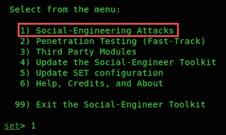
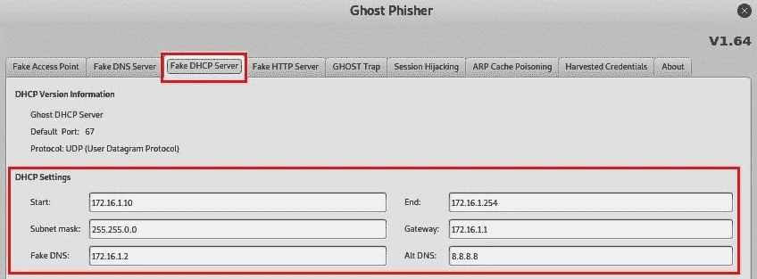
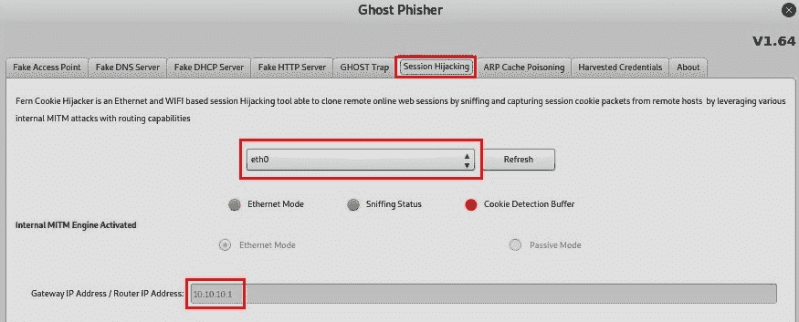
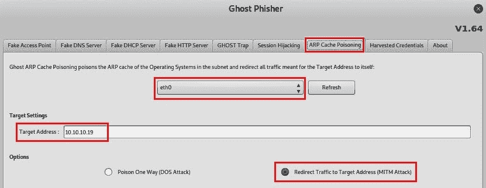

# 客户端攻击-社会工程

许多组织倾向于认为，在其网络外围拥有一个单一的保护系统就足以保护其资产。拥有单一网络防火墙只是一种单层防御；攻击可以通过多种方式绕过公司网络内的安全系统和控制。一种常用的技术是操纵某人做某事或向攻击者透露机密信息。这被称为**社会工程**。

作为渗透测试人员，了解本主题的基本概念、技术和实践方面非常重要，因为它将帮助您获得用户凭据、公司网络中的系统和网络访问，以及有关员工和目标网络的其他敏感细节。在本章中，您将比较和对比不同形式的社会工程攻击，同时使用各种工具和技术创建钓鱼网站以收集受害者凭据。

在本章中，我们将介绍以下主题：

*   社会工程基础
*   社会工程的类型
*   防御社会工程
*   社会工程侦察员（打瞌睡）
*   计划每种类型的社会工程攻击
*   社会工程工具

# 技术要求

本章的技术要求如下：

*   卡利 Linux

# 社会工程基础

社会工程是攻击者或渗透测试人员用来说服某人泄露敏感（机密）信息的一种技术。社会工程可以针对公司帮助台、管理团队、IT 员工、执行团队等执行。任何能够接触到有价值的公司信息的员工都绝对是首要目标；挑战在于操纵受害者相信你所说的一切，并获得他们的信任。一旦受害者获得信任，下一步就是利用它。

以下是社会工程对组织产生重大影响的各种方式：

*   由于泄露机密信息而造成收入损失，这将导致客户对公司失去信任。
*   由于公司数据被盗并可能在线泄漏，导致隐私丢失。
*   违反公司政策可能导致诉讼和仲裁。

以下是社会工程的支柱：

*   人类信任是所有社会工程攻击的重要组成部分。
*   攻击者（社会工程师）通常会请求某种帮助或帮助，而受害者往往出于善意，有时出于道德义务而顺从。
*   员工缺乏安全意识培训，使公司更容易成为目标。

实施安全政策无疑是确保所有公司资产和员工安全的良好实践。然而，安全策略在防止社会工程攻击方面并不总是有效的。让我们想象一下，一名渗透测试人员打电话到一个组织的帮助台，假装是一名高级经理，要求更改其公司用户帐户的密码。服务台工作人员可能不会要求来电者提供有关其身份的进一步验证，而可能只是执行任务并通过电话向用户帐户提供新密码。攻击者现在可以使用这些用户凭据访问电子邮件帐户和公司网络的其余部分。

由于没有安全软件或硬件能够完全抵御此类攻击，因此通常没有任何方法可以确保完全安全不受社会工程攻击。

在下一节中，我们将讨论不同类型的社会工程攻击。

# 社会工程的类型

社会工程有多种形式；以下是不同类型的社会工程：

*   **基于人的社会工程**：这种类型的社会工程通过互动——换句话说，通过与个人交谈——从另一个人那里收集机密信息。
*   **基于计算机的社会工程**：这类社会工程是利用计算机等数字技术进行的。
*   **基于移动的社会工程**：在基于移动的社会工程中，攻击者使用移动应用程序对受害者进行攻击。
*   **基于电话的社会工程**：这项技术包括向受害者打电话，模仿受害者可能信任的人。
*   **通过社交媒体进行社会工程**：这需要使用社交媒体平台诱使人们放弃敏感细节。

让我们更详细地了解每个工程过程。

# 基于人的社会工程

在基于人类的社会工程中，攻击者假装是有权威的人。攻击者有时通过提供虚假身份并要求提供机密信息而伪装成合法的最终用户。此外，攻击者可以假装是组织中的重要用户，如主管或高级职员，并请求更改受害者用户帐户的密码。伪装成技术支持是一种简单的模仿形式，通常能让用户很快信任你。想象一下，当你假装是 IT 技术人员并要求用户提供其用户帐户详细信息时，给员工打电话。通常，终端用户并不总是意识到网络安全中的人为威胁，他们会很快信任假装是技术支持的人。

在以下部分中，我们将深入探讨各种类型的基于人的社会工程技术，包括：

*   窃听
*   肩上冲浪
*   垃圾搜寻

让我们从窃听开始。

# 窃听

窃听包括在未经授权的情况下倾听人们之间的对话和阅读他们的信息。这种形式的攻击包括拦截用户之间的任何传输，例如音频、视频，甚至书面通信。

接下来，我们将讨论肩部冲浪的概念。

# 肩上冲浪

我们中的很多人都对肩上冲浪感到内疚。当同事在网站上输入数据或执行任务时，你是否曾路过他们，希望你能看到他们在做什么？

肩上冲浪是指在某人使用电脑时翻过他的肩膀。此技术用于收集敏感信息，如 PIN、用户 ID 和密码。此外，可以使用数码相机等设备从更远的距离进行肩部冲浪。

在下一节中，我们将介绍垃圾桶潜水。

# 垃圾搜寻

垃圾桶潜水是一种基于人类的社会工程，攻击者通过他人的垃圾桶寻找敏感/机密数据。受害者不安全地处理机密物品，如公司文件、过期信用卡、水电费账单和财务记录，被认为对攻击者有价值。

接下来，我们将介绍基于计算机的社会工程攻击。

# 基于计算机的社会工程

我们大多数人在过去都遇到过一种基于计算机的社会工程。在基于计算机的社会工程中，攻击者使用计算机设备帮助他们诱骗受害者泄露敏感/机密信息。

这类攻击有两种主要形式：

*   网络钓鱼
*   鱼叉式网路钓鱼

以下是基于计算机的社会工程的一些其他形式：

*   弹出窗口询问用户信息
*   垃圾邮件
*   连锁信
*   骗信

在本章中，我们将只讨论网络钓鱼和鱼叉式网络钓鱼；然而，你可以在业余时间研究其他人。

让我们先来看看网络钓鱼。

# 网络钓鱼

攻击者通常发送包含虚假信息的非法电子邮件，同时将其伪装成来自可信人或来源的合法电子邮件。这种技术用于欺骗用户提供个人信息或其他敏感细节。

想象一下收到一封电子邮件：发件人的姓名是您的银行名称，电子邮件正文中有指示，通知您单击提供的链接以重置您的网上银行凭据。电子邮件通常以富文本格式呈现给我们，它提供了非常干净和易于阅读的文本。此格式隐藏实际邮件的 HTML 代码，并显示纯文本。因此，攻击者可以很容易地屏蔽 URL 以将用户发送到恶意网站。网络钓鱼电子邮件的收件人可能无法识别误导或篡改的详细信息，请单击链接。

接下来，我们将讨论矛式网络钓鱼。

# 鱼叉式网路钓鱼

在常规的网络钓鱼攻击中，攻击者通过 internet 向随机电子邮件地址发送数百条通用电子邮件。通过 spear 网络钓鱼，攻击者向公司中的特定人群发送精心编制的消息。与普通网络钓鱼攻击相比，矛式网络钓鱼攻击具有更高的响应率。

在下一节中，我们将介绍基于移动的社会工程攻击。

# 基于移动的社会工程

基于移动的社会工程可以包括为智能手机和平板电脑创建恶意应用程序，该应用程序具有非常吸引人的功能，可以诱使用户在其设备上下载和安装该应用程序。为了掩盖恶意应用的真实性质，攻击者使用与官方应用商店中流行应用相似的名称。在受害者的设备上安装恶意应用后，该应用可以检索受害者的用户凭据并将其发送回攻击者。

另一种基于移动的社会工程称为**smishing**。这种类型的攻击包括攻击者使用恶意 URL 向随机人群发送非法短信，要求潜在受害者提供敏感信息进行响应。

攻击者有时会向随机的人发送短信，声称是他们银行的代表。该消息包含一个与合法银行的官方域名非常相似的 URL。毫无戒心的人可能会点击恶意链接，导致他们进入一个虚假的登录门户，该门户将捕获受害者的用户名和密码，甚至将恶意负载下载到受害者的移动设备上。

在下一节中，我们将介绍通过社交网络进行的社会工程。

# 通过社交网络进行社会工程

攻击者通常试图创建虚假的个人资料并与他人建立通信。他们假装是另一个人，同时试图诱骗受害者透露自己的敏感细节。此外，在许多情况下，一个人的帐户被泄露，攻击者使用泄露的帐户与受害者的朋友/连接列表中的人进行通信。

攻击通常使用受损的社交网络用户帐户创建一个非常庞大的朋友/连接网络，以收集信息和敏感细节。

以下是用于吸引目标组织员工的一些方法：

*   创建假用户组
*   通过使用目标组织员工的姓名使用虚假身份
*   让用户加入假用户组，然后要求他们提供诸如出生日期和配偶姓名等凭据

Facebook 和 LinkedIn 等社交网站是许多人都可以访问的巨大信息库。由于存在信息被利用的风险，因此用户必须始终了解他们正在泄露的信息。通过使用社交网站上发现的信息，例如组织员工发布的帖子，攻击者可以对目标组织实施有针对性的社会工程攻击。

在下一节中，我们将介绍基于手机的社会工程攻击。

# 基于电话的社会工程（vishing）

**Vishing**是一个用来描述通过电话发生的社会工程攻击的术语。在许多情况下，人们接到攻击者的电话，声称他们是从有线电视公司或当地银行打来的，并要求受害者透露敏感信息，如出生日期、驾驶证号码、银行详细信息，甚至用户帐户凭据。

通常，攻击者在冒充合法或授权组织的人员询问敏感细节时呼叫目标。如果第一种方法不起作用，攻击者可能会再次打电话，伪装成更重要的人或技术支持代理，试图欺骗用户提供敏感信息。

此外，当攻击者在 vishing 攻击期间为自己提供虚假身份时，他们通常会提供对合法组织的引用，以便与潜在受害者建立一定程度的信任。当目标不被攻击时，有时会使用诸如“*如果您不能向我们提供您的用户名和密码*，您的帐户将被禁用”之类的威胁。目标公司有时会相信这一点，并提供所要求的信息。

完成本节之后，您现在了解了各种类型的社会工程攻击的特征。在下一节中，我们将介绍防御社会工程的要点。

# 防御社会工程

以下是一些可用于抵御常见社会工程攻击的一般战术：

*   保护你的周边安全
*   保护服务台和普通员工
*   检测网络钓鱼电子邮件
*   附加对策

在接下来的几节中，我们将更详细地介绍这些主题。

# 保护你的周边安全

攻击者使用模拟和尾随（跟随某人进入安全区域）等方法进入组织的大院。为防止此类攻击，各组织应为所有员工安装身份证、基于令牌或生物识别系统进行身份验证，并对员工和保安进行持续的安全意识培训。

# 保护服务台和普通员工

攻击者实施窃听、肩上冲浪和模拟，以从组织的帮助台及其全体员工处获取敏感信息。有时，攻击可能是微妙和有说服力的；其他时候，他们可能会有点吓人和咄咄逼人，以便向员工施加压力，希望他们会泄露机密信息。为了保护员工免受此类攻击，各组织应确保经常对员工进行培训，以提高对此类危险的认识，并让他们知道永远不要泄露任何敏感信息。

# 附加对策

以下是可以减少对组织的社会工程攻击威胁的其他措施：

*   实施密码策略，确保用户定期更改密码，同时避免重复使用以前的密码。这将确保如果员工的密码通过社会工程攻击泄漏，攻击者手中的密码可能会因密码策略而过时。
*   确保所有客人和访客在园区内都有保安护送。
*   实施适当的物理安全访问控制系统。这包括监控摄像机、门锁、适当的围栏、生物特征安全措施，以及更多防止未经授权人员进入限制区域的措施。
*   实施信息分类。信息分类只允许那些具有所需安全许可的人查看某些数据并访问某些系统。
*   对新员工进行背景调查，并实施适当的解雇流程。
*   从信誉良好的供应商处实施端点安全保护。端点保护可用于监控和防止针对员工电脑和笔记本电脑的网络攻击，如社会工程攻击、网络钓鱼电子邮件和恶意下载。
*   尽可能实施双因素身份验证。

在下一节中，我们将了解如何检测钓鱼电子邮件。

# 检测网络钓鱼电子邮件

电子邮件提供商总是在实施新的措施来打击垃圾邮件，防止钓鱼邮件进入用户邮箱。然而，有时，一些网络钓鱼邮件会进入你的邮箱。以下是识别网络钓鱼欺诈的一些方法：

*   如果电子邮件来自银行、组织甚至社交网站，并且带有通用问候语。
*   网络钓鱼电子邮件可能包含恶意附件。
*   网络钓鱼邮件有时包含语法错误和拼写错误的单词。
*   发件人的电子邮件地址看起来不合法。
*   它包含指向伪造网站或恶意域的链接。

以下是我几年前收到的一封电子邮件。发件人的姓名和电子邮件是合法的，因为它是我认识的人。然而，这封邮件似乎与我之前收到的所有其他电子邮件都不同：

最后一行包含一个超链接，上面写着**请看这里**。不了解互联网安全的人可能会点击链接并被指向恶意网站，有效负载可能会被下载并执行，从而导致计算机受损。

让我们仔细看看电子邮件的来源细节：

消息源向我们显示消息的所有 HTML 代码。通过仔细观察，我们将看到攻击者使用较短的 URL 创建了一个超链接，以屏蔽真实的 URL。

在本节中，我们讨论了如何识别网络钓鱼电子邮件，以及攻击者如何在网络钓鱼时使用 URL 混淆来阻止目标看到真实的 web URL。在下一节中，我们将介绍打瞌睡的要点。

# 社会工程侦察员（打瞌睡）

打瞌睡是指攻击者使用在线和公开资源（如搜索引擎和社交网站）收集特定个人或组织的私人详细信息。然后，攻击者可以对目标使用此类信息。

在打瞌睡攻击期间，攻击者可以通过搜索目标发布的信息来收集某人的个人信息。通常，在社交网站上，人们会发布很多关于自己、家庭和工作的个人信息。当被问及他们是否担心有人窃取他们的信息时，最常见的回答是“*我没有什么可隐瞒的*”或“*发布照片或评论*我不会失去任何东西。”

很多人没有意识到的是，一个恶意的人可以截取他们帖子的截图，然后出于恶意目的对其进行修改。

在下一节中，我们将学习如何规划社会工程攻击。

# 计划每种类型的社会工程攻击

社会工程攻击的主要目标是从受害者那里获取机密信息，或操纵他们采取行动，帮助他们危害目标系统或组织。然而，要开始任何类型的攻击，必须做大量的研究来找出目标是如何运作的；攻击者需要找到以下问题的答案：

*   目标组织是否将其 IT 服务外包？
*   目标公司是否有服务台？

除了进行这项研究，在进行社会工程时，你必须能够快速制定策略，并了解受害者对你的反应。

作为一名社会工程师，培养以下技能是很好的：

*   在谈话中要有创意
*   具备良好的沟通能力，包括面对面沟通和电话沟通
*   良好的人际交往能力
*   有健谈友好的天性

这些技能将帮助你成为一个**人**，也就是说，一个友好且与他人交往的人。这一特点是有益的，因为它可以帮助你在现场交流中更好地衡量受害者的情绪和反应，无论是通过电话还是在面对面的交谈中。这是一种心理技能，让你了解某人并操纵他们的行为，让他们以某种方式做出反应或透露机密信息。

接下来，我们将演示如何使用各种社会工程工具。

# 社会工程工具

在本节中，我们将介绍用于执行社会工程攻击的两个工具：

*   **社会工程师工具包**（**套**）
*   幽灵钓鱼者

让我们更详细地了解这两个方面。

# 社会工程师工具包

SET 是一个开源框架，旨在执行各种类型的社会工程攻击，并具有创建自定义攻击的功能。让我们使用 SET 创建一个伪造的 Facebook 页面来捕获用户凭据。

要开始，请在 Kali Linux 上单击应用程序|社会工程工具|社会工程师工具包：

1.  当 SET 打开时，您将看到一些选项。选择`1`选项访问集合内的社会工程攻击：

2.  现在将提供不同类型攻击的列表。由于我们试图欺骗用户提供其登录凭据，请选择 2）网站攻击向量：

3.  由于我们的主要重点是捕获用户凭据，请选择 3）凭据收割机攻击方法：

4.  SET 为社交网站提供预安装的模板，并允许您创建网站的克隆。在本练习中，选择 2）站点克隆器：

克隆网站时，SET 会在用户名和密码字段中注入特殊代码，从而允许它实时捕获和显示任何登录尝试。

5.  向攻击者计算机提供 IP 地址。如果您在公共网络上，请设置公共 IP 地址。请记住，此地址将提供给受害者。接下来，指定要按集合克隆的网站 URL：

6.  克隆过程成功完成后，使用攻击者的 IP 地址创建 URL 并将其发送给受害者。URL 应采用以下格式：[https://10.10.10.16/](https://10.10.10.16/) 。您可以使用其他技术屏蔽实际 IP 地址并使其看起来合法：

受害者输入其用户凭据后，SET 将在 SET 界面上填充用户名和密码，如前一屏幕截图所示。

在下一节中，我们将演示如何使用 Ghost Phisher。

# 幽灵钓鱼者

另一个神奇的社会工程工具是**幽灵钓鱼者**。它通过其**图形用户界面**（**GUI**提供了许多易于使用的实用程序，用于快速创建社会工程攻击。

要开始使用 Ghost Phisher，请执行以下步骤：

1.  在 Kali Linux 上，点击**应用程序****社会工程工具****幽灵钓鱼者**。
2.  工具打开后，您将看到主选项卡的选项，即**假接入点**：

无线网络适配器连接到 Kali Linux 机器后，转到菜单中的无线接口，并根据您的首选项自定义假接入点设置。

Ghost Phisher 允许您创建假 DNS 服务器和假 HTTP 服务器。

3.  要创建恶意 DHCP 服务器，只需选择**假 DHCP 服务器**选项卡并添加必要的信息，如以下屏幕截图所示：

4.  **会话劫持**选项卡允许您执行 MITM 攻击并捕获实时会话：

在对 Ghost Phisher 启动会话劫持攻击之前，请确保设置了网络的默认网关。

5.  与 ARP 欺骗类似，有一个内置的 ARP 欺骗工具可以快速启用 MITM 攻击：

Ghost Phisher 通过简单易用的界面为渗透测试人员提供了许多功能；甚至还有一个名为**的附加选项卡，显示在发起任何攻击期间捕获的所有用户名和密码。**

# 总结

在本章的过程中，我们讨论了各种形式的社会工程技术以及保护个人和组织免受其侵害的方法。我们查看了钓鱼电子邮件的识别特征，以及与 Kali Linux 一起预装的两个社会工程工具。完成本章后，您将能够描述各种形式的社会工程攻击，实施对策以降低成为此类攻击受害者的风险，并通过模拟社交网站执行基于计算机的攻击以捕获受害者的用户凭据。

我希望这一章能对你的学习和事业有所帮助。

在[第 14 章](14.html)*执行网站渗透测试*中，您将了解 web 应用程序渗透测试的基础知识。

# 问题

以下是基于本章所述主题的一些问题：

1.  当一个未经授权的人正在听双方的对话时，它叫什么？
2.  一位用户收到了一封似乎来自其本地银行的电子邮件。打开电子邮件时，用户会发现一个 URL，上面说他们应该单击该链接重置密码。这是什么类型的攻击？
3.  一个用户在手机上收到了一条带有 URL 的短信，据称来自合法银行。当用户单击链接时，会出现一个网站，要求用户登录。当用户使用其凭据登录时，他们将被重定向到其官方银行的网站。这是什么类型的攻击？
4.  Kali Linux 中提供了哪些社会工程工具？

# 进一步阅读

*   其他社会工程技术可在[中找到 https://www.imperva.com/learn/application-security/social-engineering-attack/](https://www.imperva.com/learn/application-security/social-engineering-attack/)