# 三、利用基础

利用是指破坏计算机系统的艺术。计算机攻击的基础包括对漏洞和有效负载的深入理解。漏洞是一段编写良好的代码，在目标系统上编译和执行，可能会危害该系统。漏洞攻击的目标通常是已知漏洞、服务中的漏洞或写得不好的代码。在本章中，我们将讨论如何找到易受攻击的系统并加以利用的基础知识。

# 基本开采条件

利用的基本术语解释如下：

*   **漏洞：**漏洞是软件或硬件中的一个安全漏洞，允许攻击者危害系统。漏洞可以简单到弱密码，也可以复杂到拒绝服务攻击。
*   **漏洞：**漏洞是指一个众所周知的安全漏洞或漏洞，黑客利用该漏洞进入系统。漏洞攻击是攻击者利用特定漏洞的实际代码。
*   **有效载荷：**一旦在易受攻击的系统上执行漏洞攻击，并且系统已被破坏，有效载荷使我们能够控制系统。负载通常连接到漏洞并交付。
*   **外壳代码：**这是一组指令，通常在攻击发生时用作有效负载。
*   **Listener:** A listener works as component waiting for an incoming connection.

    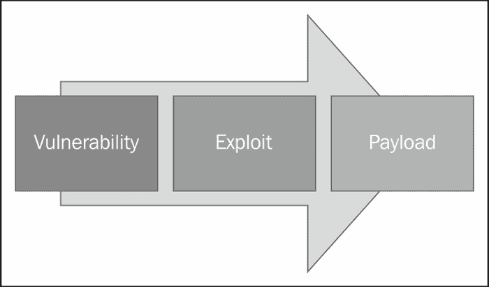

## 剥削是如何运作的？

我们考虑一个计算机实验室的场景，我们有两个学生在他们的计算机上工作。过了一段时间，一个学生出去喝咖啡休息，他负责地锁上了电脑。特定锁定计算机的密码为`Apple`，这是一个非常简单的字典单词，是一个系统漏洞。另一个学生开始尝试对离开实验室的学生的系统进行密码猜测攻击。这是一个典型的漏洞利用示例。帮助恶意用户在成功登录到计算机后控制系统的控件称为有效负载。

现在我们来讨论更大的问题，即剥削实际上是如何运作的。攻击者基本上会向易受攻击的系统发送带有附加负载的攻击。攻击首先运行，如果成功，将运行有效负载的实际代码。有效负载运行后，攻击者获得对易受攻击系统的完全特权访问，然后他可以下载数据、上载恶意软件、病毒、后门或任何他想要的东西。

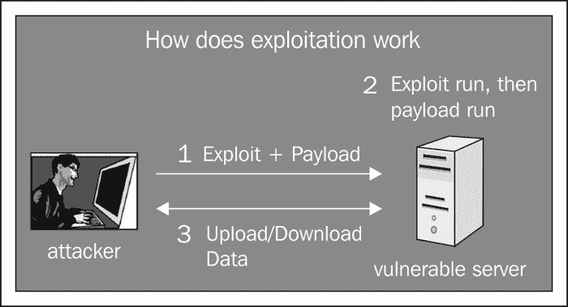

## 破坏系统的典型过程

要破坏任何系统，第一步是扫描 IP 地址以找到开放的端口及其操作系统和服务。然后，我们继续识别一个易受攻击的服务，并在 Metasploit 中找到该特定服务的漏洞。如果 Metasploit 中没有该漏洞，我们将浏览互联网数据库，如[www.securityfocus.com](http://www.securityfocus.com)、[www.exploitdb.com](http://www.exploitdb.com)、[www.1337 day.com](http://www.1337day.com)等。成功发现漏洞后，我们启动漏洞并破坏系统。

端口扫描常用的工具有**Nmap**（**网络映射器**）、Autoscan、Unicorn Scan 等。例如，这里我们使用 Nmap 进行扫描，以显示打开的端口及其服务。

首先在回溯虚拟机中打开终端。输入`nmap –v –n 192.168.0.103`并按*进入*进行扫描。我们使用`–v`参数获取详细输出，`–n`参数禁用反向 DNS 解析。

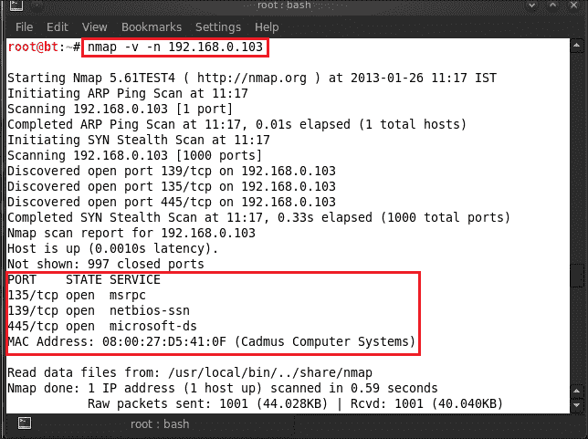

在这里，我们可以看到 Nmap 的结果，显示了三个打开的端口，它们的服务在这些端口上运行。如果我们需要更详细的信息，如服务版本或操作系统类型，我们必须使用 Nmap 执行密集扫描。对于密集扫描，我们使用命令`nmap –T4 –A –v 192.168.0.103`。这向我们显示了服务版本和操作系统类型的完整结果。

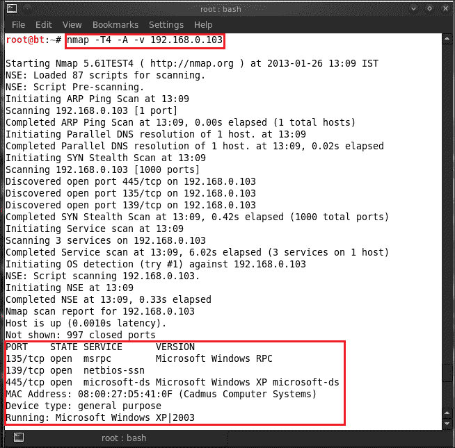

下一步是根据服务或其版本查找漏洞。在这里，我们可以看到在端口号`135`上运行的第一个服务是`msrpc`，它被称为 MicrosoftWindows RPC。现在，我们将学习如何在 Metasploit 中找到此特定服务的漏洞。让我们打开终端，输入`msfconsole`启动 Metasploit。在输入`search dcom`时，它会在其数据库中搜索所有与 Windows RPC 相关的漏洞。

在下面的屏幕截图中，我们可以看到该漏洞及其描述以及该漏洞的发布日期。我们收到了一份根据等级排列的漏洞列表。从与此漏洞相关的三个漏洞中，我们选择第一个，因为它是级别最高的最有效的漏洞。现在我们已经学习了通过`search <service name>`命令在 Metasploit 中搜索漏洞的技术。

### 从在线数据库中查找漏洞

如果 Metasploit 中没有漏洞，那么我们必须搜索 Internet 漏洞数据库以查找特定漏洞。现在我们将学习如何在这些在线服务上搜索漏洞，如[www.1337day.com](http://www.1337day.com)。我们打开网站，点击**搜索**标签。例如，我们将搜索 Windows RPC 服务上的漏洞。

现在我们必须下载并保存一个特定的漏洞。为此，只需单击所需的漏洞。

点击漏洞后，显示该漏洞的描述。点击**打开资料**查看或保存漏洞。

此漏洞的使用作为以下屏幕截图中标记的漏洞代码文档的一部分提供：

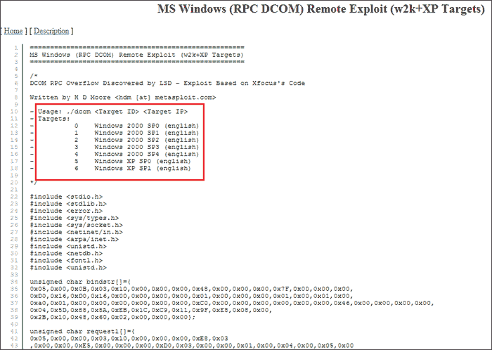

现在，我们将利用我们下载的特定漏洞利用我们的目标机器。我们已经扫描了 IP 地址，找到了三个打开的端口。下一步是利用其中一个端口。例如，我们将针对在该目标机器上运行的端口号`135`服务，即`msrpc`。让我们从编译下载的攻击代码开始。要编译代码，启动终端并键入`gcc <exploit name with path> -o<exploitname>`。例如，我们在这里输入`gcc –dcom –o dcom`。

编译漏洞后，我们有一个该漏洞的二进制文件，我们通过在终端中键入`./<filename>`来运行该文件来利用目标。

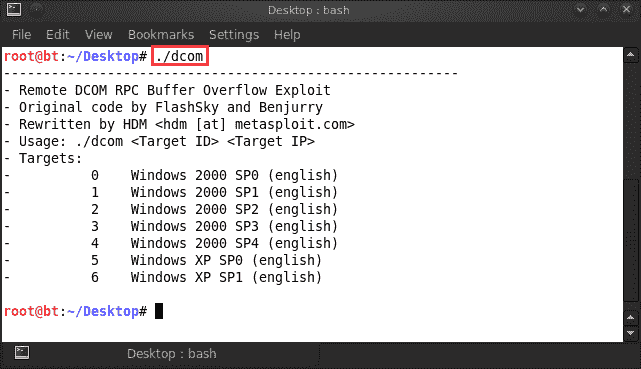

从前面的屏幕截图中，我们可以看到利用目标的需求。它需要目标 IP 地址和 ID（Windows 版本）。让我们看看我们的目标 IP 地址。

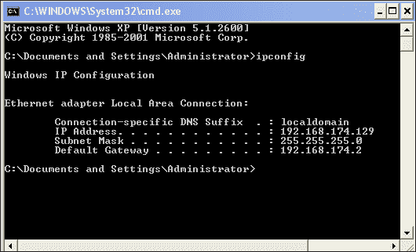

我们有目标 IP 地址，所以让我们开始攻击。输入`./dcom 6 192.168.174.129`。

目标已被利用，我们已经有了命令 shell。现在我们检查受害者机器的 IP 地址。输入`ipconfig`。

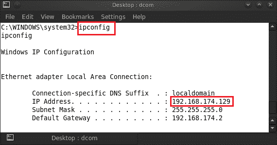

目标已经被攻破，我们已经进入了。

现在我们将了解如何使用 Metasploit 的内部漏洞。我们已经扫描了一个 IP 地址，发现了三个打开的端口。这次我们的目标端口号为 445，它运行 Microsoft ds 服务。

让我们从选择一个漏洞开始。启动 msfconsole，输入`use exploit/windows/smb/ms08_067_netapi`，然后按*进入*。

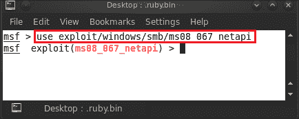

下一步将检查漏洞利用的选项以及成功利用漏洞所需的条件。我们输入`show options`，它将向我们显示要求。我们需要设置**RHOST**（**远程主机**），这是目标 IP 地址，并让其他选项保留其默认值。

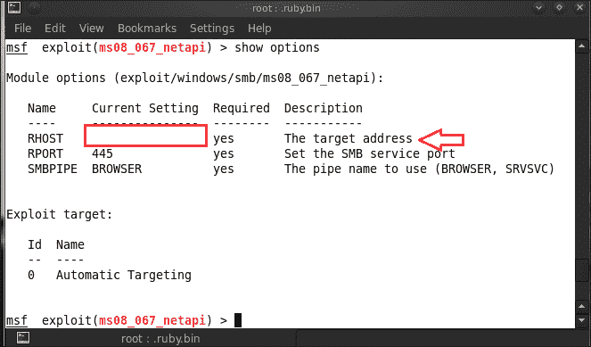

我们通过输入`set RHOST 192.168.0.103`来设置或目标地址。

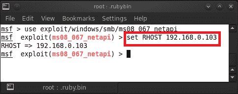

设置选项后，我们都准备好利用我们的目标。输入`exploit`将为我们提供流量计外壳。

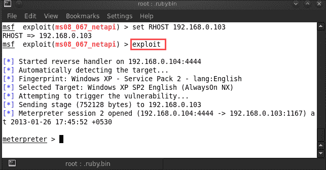

# 总结

在本章中，我们介绍了漏洞的基本知识、有效负载以及一些利用漏洞的技巧。我们还介绍了如何搜索易受攻击的服务和进一步查询 Metasploit 数据库以获取漏洞的技术。这些漏洞随后被用来危害易受攻击的系统。我们还演示了在互联网数据库中搜索漏洞的艺术，其中包含软件和服务的零日漏洞。在下一章中，我们将介绍流量计的基本知识和深入的利用策略。

# 参考文献

以下是一些有用的参考资料，进一步阐明了本章所涵盖的一些主题：

*   [http://www.securitytube.net/video/1175](http://www.securitytube.net/video/1175)
*   [http://resources.infosecinstitute.com/system-exploitation-metasploit/](http://resources.infosecinstitute.com/system-exploitation-metasploit/)