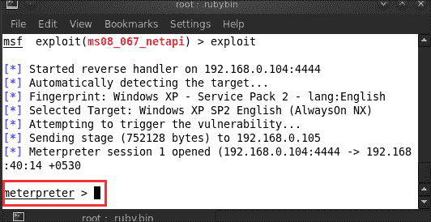
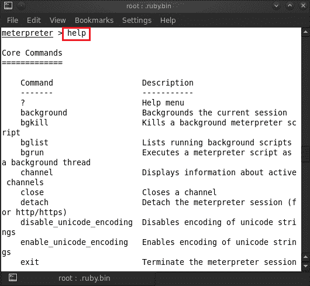
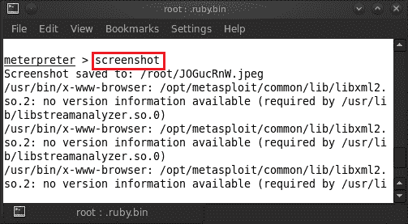
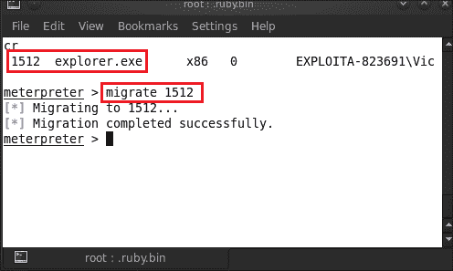
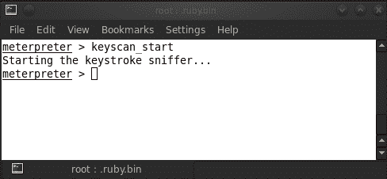
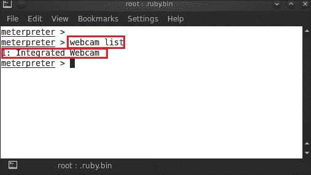
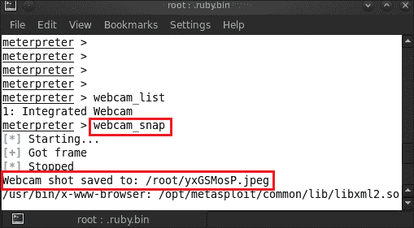
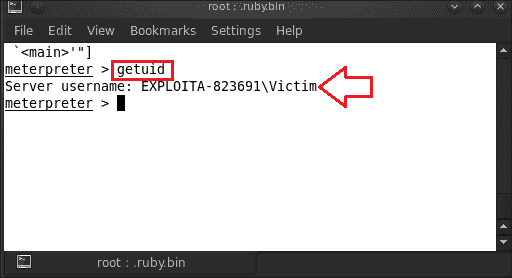
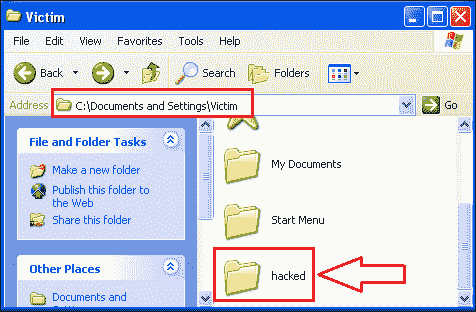
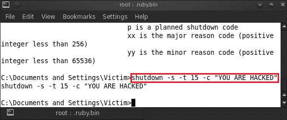

# 四、计量器基础

MeterMeter 是 Metasploit 框架中的先锋之一。它被用作易受攻击系统攻击后的有效负载。它使用内存中的 DLL 注入阶段，并在运行时通过网络进行扩展。在内存 DLL 中，注入是一种通过强制加载**DLL**（**动态链接库**）文件在当前运行进程的地址空间内注入代码的技术。一旦触发了漏洞攻击并将 MeterMeter 用作有效负载，我们将为受损系统获得一个 MeterMeter 外壳。其攻击向量的唯一性在于其隐身特征。它不会在硬盘上创建任何文件，只是将自身连接到内存中的活动进程。客户机-服务器的内部通信使用类型长度值格式进行，并且是加密的。在数据通信协议内，可选信息可以编码为协议内的类型长度值或 TLV 元素。这里，Type 表示作为消息一部分的字段类型，Length 表示值字段的大小，value 表示可变大小的字节序列，其中包含消息这一部分的数据。这个单一的有效负载通过其多种功能非常有效，这有助于获取受害者机器的密码哈希、运行键盘记录器和权限提升。隐身功能使许多防病毒和基于主机的入侵检测系统无法检测到它。MeterMeter 还能够在通过 DLL 注入连接到的不同进程之间切换，并通过坚持在受损主机上运行应用程序而不是在系统上创建文件来保持。

在上一章中，我们破坏了一个系统，以获得 MeterMeter 的反向连接。现在，我们将讨论我们可以在受到攻击的系统上使用的功能，例如 MeterMeter 的工作和 MeterMeter 的运行。

# 仪表的工作情况

一旦系统被破坏，我们（攻击者）会向受影响的系统发送第一阶段有效负载。此有效负载连接回仪表。然后发送第二个 DLL 注入有效负载，后跟 MeterMeter 服务器 DLL。这将建立一个套接字，并且可以通过 MeterMeter 会话进行客户机-服务器通信。这个会话最好的部分是加密的。这提供了机密性，因此任何网络管理员都不能嗅探会话。

# 仪表在工作

在[第 3 章](03.html "Chapter 3. Exploitation Basics")、*利用基础*中，我们能够利用受害者机器并从中获得一个计量器会话。现在，我们将使用此 MeterMeter 会话来利用 Metasploit 框架的各种功能。

现在，我们将展示 MeterMeter 拥有的所有攻击武器。为此，请输入`help`。

在前面的屏幕截图中，我们看到了可以在受损系统上使用的所有 MeterMeter 命令。

根据使用情况，我们有几个分类命令；他们的名单如下：

<colgroup><col style="text-align: left"> <col style="text-align: left"> <col style="text-align: left"></colgroup> 
| 

命令类型

 | 

命令名

 | 

描述

 |
| --- | --- | --- |
| 进程列表 | `getuid` | 它获取系统 ID 和计算机的名称。 |
|   | `kill` | 它终止一个进程。 |
|   | `ps` | 它列出了正在运行的进程。 |
|   | `getpid` | 它获取当前进程标识符。 |
| 密钥日志使用 | `keyscan_start` | 它启动密钥记录会话。 |
|   | `keyscan_stop` | 它会停止 keylogging 会话。 |
|   | `keyscan_dump` | 它转储从受害者机器捕获的击键。 |
| 一场 | `enumdesktops` | 它列出了所有可访问的桌面和工作站。 |
|   | `getdesktop` | 它获取当前的 MeterMeter 桌面。 |
|   | `setdesktop` | 它会更改流量计的当前桌面。 |
| 嗅探功能 | `use sniffer` | 它加载嗅探器函数。 |
|   | `sniffer_start` | 它启动接口的嗅探器。 |
|   | `sniffer_dump` | 它在本地转储受害机器的网络捕获。 |
|   | `sniffer_stop` | 它会停止接口的嗅探器。 |
| 网络摄像头命令 | `webcam_list` | 它列出了系统的所有网络摄像头。 |
|   | `webcam_snap` | 它捕获受害者机器的快照 |
|   | `record_mic` | 它通过机器上的默认麦克风录制环境声音 |

现在，我们将开始渗透测试程序，并通过开始收集有关我们的受害者机器的信息来执行第一步。键入`sysinfo`检查系统信息。

我们可以在前面的屏幕截图中看到系统信息，受害者使用的计算机名称和操作系统。现在我们将捕获受害者机器的屏幕截图。为此，请键入`screenshot`。

我们可以看到受害者机器的屏幕截图如下：

让我们检查受害者机器上运行的所有进程的列表。对于这个类型，只需输入`ps`，它将显示正在运行的进程。

在前面的屏幕截图中，我们可以看到流程列表以及详细信息。第一列显示 PID，表示进程 ID，第二列显示进程名称。下一列显示了系统的体系结构、用户以及流程运行的路径。

在流程列表中，我们必须找到`explorer.exe`的流程 ID，然后使用该流程 ID 进行迁移。对于使用任何流程 ID 进行迁移，我们必须键入`migrate <PID>`。在这里，我们使用`explorer.exe`进行迁移，所以我们输入`migrate 1512`。

在使用流程进行迁移之后，我们将识别当前流程。为此，请键入`getpid`。

我们可以看到迁移到受害机器的当前进程 ID。

接下来，我们继续使用受害者机器上的键盘记录服务，了解一些真正的黑客行为。我们输入`keyscan_start`，键盘记录器将启动并等待几分钟，以捕获受害者机器的击键。

受害者开始在记事本上输入一些东西。让我们检查一下是否抓到了。

现在，让我们停止 keylogger 服务，并从受害者机器中转储所有击键日志。为此，键入`keyscan_dump`，然后键入`keyscan_stop`停止键盘记录器服务。您可以在下面的屏幕截图中看到，我们有准确的捕获。好极了！

让我们在 MeterMeter 会话中尝试一些更有趣的活动。让我们检查受害者的机器是否有网络摄像头。为此，我们输入`webcam_list`，它会显示来自受害者机器的网络摄像头列表。在下面的屏幕截图中，我们可以看到网络摄像头可用。

因此，我们知道受害者有一个集成的网络摄像头。那么，让我们从受害者的网络摄像头抓拍一张受害者的快照。只需输入`webcam_snap`。

在前面的屏幕截图中，我们可以看到网络摄像头截图已保存到根目录，图像名为`yxGSMosP.jpeg`。因此，让我们在根目录中验证捕获的映像。

之后，我们将检查系统 ID 和受害机器的名称。输入`getuid`。

在玩了受害者机器之后，现在是时候做一些严肃的事情了。我们将访问受害者的命令外壳来控制他/她的系统。为此，只需输入`shell`，它就会为您打开一个新的命令提示符。

现在让我们在受害者机器上创建一个目录。输入`mkdir <directory name>`。我们正在`C:\Documents and Settings\Victim`中创建一个名为`hacked`的目录。

让我们验证目录是否已在`C:\Documents and Settings\Victim`下创建。

现在我们将通过在受害者的屏幕上显示一条消息来关闭他的计算机。为此，输入`shutdown –s –t 15 -c "YOU ARE HACKED"`。在下面的命令中，我们使用的语法是：`–s`表示关机，`–t 15`表示超时，`–c`表示消息或注释。

让我们看看受害者机器上发生了什么。

# 总结

因此，在本章中，我们介绍了用户如何通过 MeterMeter 破坏系统，以及他/她在利用 MeterMeter 功能后可以提取哪些信息。一旦我们破坏了受害者的系统，我们就能够获得系统信息，包括操作系统名、体系结构和计算机名。在那之后，我们能够捕捉到受害者机器桌面的屏幕截图。通过 MeterMeter，我们可以直接访问受害机器的外壳，因此可以检查正在运行的进程。我们能够安装一个键盘记录器并捕获受害者机器的活动按键。使用流量计，我们甚至可以使用受害者的相机在不被注意的情况下拍摄他的快照。

这整章都有一种真正的黑客行为的感觉，以及使用受害者机器执行自己命令的不同方式。因此，受害者机器只是一个傀儡，在攻击者的命令下跳舞。因为我们可以访问受害者的外壳，我们可以格式化他的硬盘，创建新文件，甚至复制他的机密数据。下一章将介绍信息收集和扫描阶段。

# 参考文献

以下是一些有用的参考资料，进一步阐明了本章所涵盖的一些主题：

*   [http://www.offensive-security.com/metasploit-unleashed/About_Meterpreter](http://www.offensive-security.com/metasploit-unleashed/%E2%80%A8About_Meterpreter)
*   [http://cyruslab.wordpress.com/2012/03/07/metasploit-about-meterpreter/](http://cyruslab.wordpress.com/2012/03/07/metasploit-about-meterpreter/)
*   [https://github.com/rapid7/metasploit-framework/wiki/How-payloads-work](https://github.com/rapid7/metasploit-framework/wiki/%E2%80%A8How-payloads-work)
*   [http://www.isoc.my/profiles/blogs/working-with-meterpreter-on-metasploit](http://www.isoc.my/profiles/blogs/working-with-meterpreter-on-metasploit)