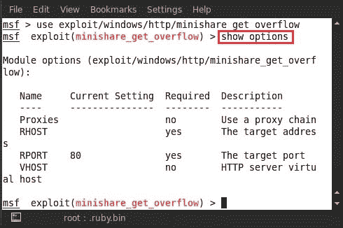
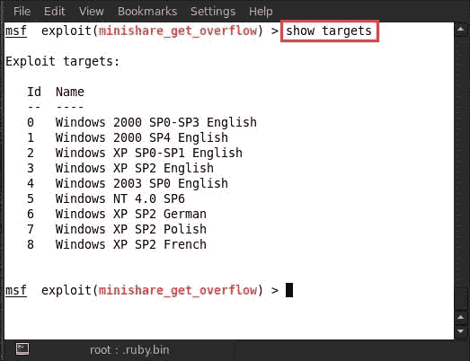
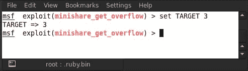
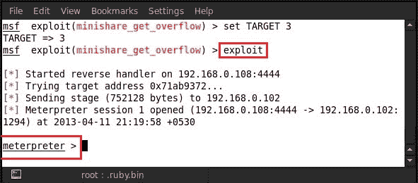
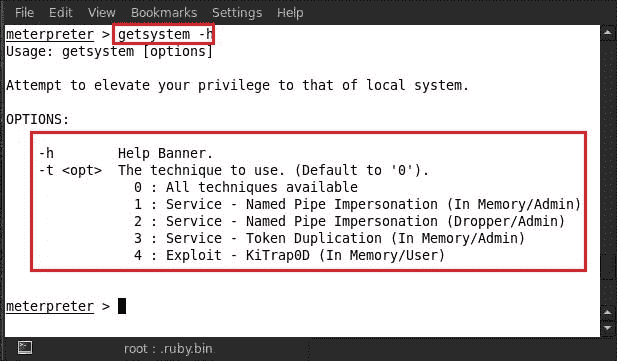
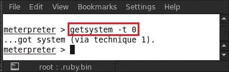
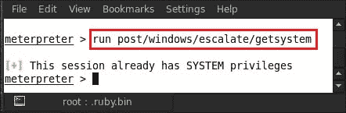
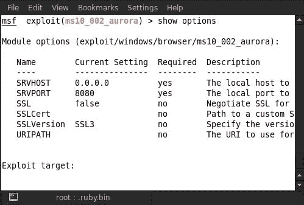
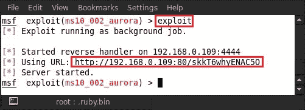

# 第 8 章利用后-权限提升

在上一章中，我们介绍了后期开发技术。后开发分为五个不同阶段。本章将深入了解后剥削的第一阶段，即特权升级。我们将介绍如何在获得系统访问权限后升级特权的新技术和技巧。

# 了解权限提升

权限提升简单地说就是对通常受保护的资源获得提升的权限，而这些资源的访问被拒绝给正常或未经授权的用户。通过提升权限，恶意用户可能会执行未经授权的操作，并对计算机或整个网络造成危害。权限提升后可以执行的简单示例包括：安装恶意软件以进行不道德的使用、删除用户文件、拒绝向特定用户提供资源以及查看私人信息。它通常可能通过使用基于漏洞的漏洞来破坏系统而发生。这种安全错误配置或弱点可能会导致绕过安全边界或身份验证，从而实现权限提升。

特权升级大致分为两种主要形式：

*   **垂直权限提升**：在这种权限提升中，较低权限的用户或应用程序可以访问仅为授权或管理用户保留的功能。此功能也称为权限提升。
*   **横向权限提升**：这种提升通常发生在用户权限的横向范围内。一个普通用户访问为另一个普通用户保留的资源。这又是另一个人资源的升级，因为从技术上讲，只有他才应该对自己的资源拥有特权。

由于多种原因，可能会出现升级场景–网络入侵、漏洞暴露、非托管帐户、保密性等。遵循的方法通常是登录并尝试获取有关计算机的一些基本信息，类似于信息收集场景。然后，攻击者可能会试图获取私人信息，或者一些可能链接到某些重要文档的用户凭据。

如果我们谈论 Metasploit，那么运行客户端漏洞利用将为我们提供只有有限用户权限的会话。这可能会严重限制攻击者将受害者机器破坏到他想要的程度；例如，他可能无法转储密码哈希、更改系统设置或安装后门特洛伊木马。通过 Metasploit 中非常强大的脚本，例如 getsystem，我们可以获得根系统上的系统级权限。

## 利用受害者的系统

现在我们将开始特权升级的教程阶段。在这里，我们将通过在一个名为 Mini share 的小程序中运行缓冲区溢出攻击来攻击受害者的系统。迷你共享是免费的文件共享软件。它是针对 Microsoft Windows 的免费 web 服务器软件。如果你有网络主机，这是一个快速而简单的共享文件的方法。现在打开`msfconsole`并输入`use exploit/windows/http/minishare_get_overflow`。

之后，输入`show options`以详细查看我们必须在漏洞利用中设置的所有选项。

现在设置所需的所有选项；正如我们在前面的屏幕截图中所看到的，`RHOST`是必需的。选项`RHOST`是指远程主机地址，即目标 IP 地址。输入`set RHOST <Victim IP>`；例如，这里我们使用的是`set RHOST 192.168.0.102`。

需要的第二个选项是`RPORT`。`RPORT`选项是指远程端口地址，即目标端口号。输入`set RPORT <Victim port>`；例如，这里我们使用的是`set RPORT 80`。

现在选择目标系统类型。输入`show targets`将显示所有易受攻击的目标操作系统。

现在根据受害者的系统选择目标。这里我们选择目标 3。所以我们输入`set TARGET 3`。

现在是利用目标的时候了。所以我们输入`exploit`。

我们可以看到，在利用受害者的机器后，我们有一个`Meterpreter`会话。让我们偷看一下受害者的系统。要获取用户 ID，请键入`getuid`。我们从下面的屏幕截图中看到，用户 ID 为`NT AUTHORITY\SYSTEM`。

之后，我们运行`getsystem -h`提升受害者系统中的权限。

我们可以在前面的屏幕截图中看到，运行`getsystem –h`为我们提供了一系列权限提升选项。第一个选项是`0 : All techniques available`，它使用所有技术作为提升权限的默认方法。

特权升级选项中使用的术语如下：

*   **命名管道**：它是一种机制，允许应用程序在本地或远程进行进程间通信。创建管道的应用程序称为管道服务器，连接到管道的应用程序称为管道客户端。
*   **模拟**：线程在安全上下文中执行的能力不同于拥有该线程的进程。模拟使服务器线程能够代表客户端执行操作，但必须在客户端安全上下文的限制范围内。当客户端拥有的权限多于服务器时，就会出现问题。为操作系统的每个用户提供一个唯一的令牌 ID。此 ID 用于检查系统的各个用户的权限级别。
*   **令牌复制**：通过低权限用户复制高权限用户的令牌 ID 工作。然后，较低权限用户的行为方式与较高权限用户类似，并获得与较高权限用户相同的所有权利和权限。
*   **KiTrap0D**：它于 2010 年初发布，几乎影响了微软在此之前开发的所有操作系统。当在 32 位平台上启用对 16 位应用程序的访问时，它不会正确验证某些 BIOS 调用，这允许本地用户获得权限，以处理涉及#GP trap handler（nt！KiTrap0D）的错误处理异常，也称为 Windows 内核异常处理程序漏洞，通过在线程环境块（TEB）中构建 VDM_TIB 数据结构。

让我们通过输入`getsystem -t 0`来使用第一个选项和所有可用的技术。

运行`...got system (via technique 1).`命令后可以看到消息。现在我们通过输入`ps`命令来检查进程列表。

## 通过后期利用提升权限

现在我们将展示另一种特权提升技术——使用后利用模块。此模块使用内置的`getsystem`命令将当前会话从管理员用户帐户升级到系统帐户。当我们得到一个`Meterpreter`会话时，输入`run post/windows/escalate/getsystem`。此模块将自动升级管理员权限。

现在，我们将使用另一个利用后脚本来提升本地权限。此模块利用现有管理权限获取系统会话。如果在第一个实例中失败，模块将检查现有服务，并查找易受攻击的不安全文件权限。之后，它尝试重新启动被替换的易受攻击服务以运行负载。因此，在成功利用漏洞时将创建一个新会话。

输入`run post/windows/escalate/service_permissions`；它将开启另一个`Meterpreter`会话。

只需尝试另一种危害目标系统的攻击，然后升级管理员权限。输入`use exploit/windows/browser/ms10_002_aurora`。

现在输入`show options`以详细查看我们必须在漏洞利用中设置的所有选项。

在此之后，设置所有必需的选项，如前面的屏幕截图所示。`SRVHOST`选项是指要监听的本地主机地址。输入`set SRVHOST <Victim IP>`；例如，这里我们使用的是`set SRVHOST 192.168.0.109`。

最后，我们通过键入`exploit`来开发目标。

我们可以看到 Metasploit 创建的 URL。现在我们只需要把这个 URL 给受害者，引诱他点击它。在 Internet Explorer 中打开此 URL 后，受害者将获得一个`Meterpreter`会话，然后您可以继续进行权限提升攻击。

# 总结

在本章中，我们学习了一旦我们破坏了一个系统，如何提升我们的特权。我们使用各种脚本和后期开发模块来完成这项任务。我们的最终目标是达到系统管理员的权限级别，以便我们能够根据需要使用受害者的机器。我们成功地完成了这项任务，并获得了受害者机器的管理员权限。仅仅妥协于制度并不能达到最终目的；我们需要能够泄露受害者的私人信息或对他的计算机进行残酷的更改。通过 Metasploit 提升权限的能力可以释放这种能力，帮助我们实现目标。在下一章中，我们将进入下一个剥削后阶段——清除我们的踪迹，以免一旦我们破坏了系统就被抓获。

# 参考文献

以下是一些有用的参考资料，进一步阐明了本章所涵盖的一些主题：

*   [http://en.wikipedia.org/wiki/Privilege_escalation](http://en.wikipedia.org/wiki/Privilege_escalation)
*   [http://www.offensive-security.com/metasploit-unleashed/Privilege_Escalation](http://www.offensive-security.com/metasploit-unleashed/Privilege_Escalation)
*   [http://vishnuvalentino.com/tips-and-trick/privilege-escalation-in-metasploit-meterpreter-backtrack-5/](http://vishnuvalentino.com/%E2%80%A8tips-and-trick/privilege-escalation-in-metasploit-meterpreter-backtrack-5/)
*   [http://www.redspin.com/blog/2010/02/18/getsystem-privilege-escalation-via-metasploit/](http://www.redspin.com/blog/2010/02/18/getsystem-privilege-escalation-via-metasploit/)
*   [http://www.securitytube.net/video/1188](http://www.securitytube.net/video/1188)