# 十二、使用社会工程工具包和 Armitage

**社会工程工具包**（**集合**是一款先进的工具包，可以在渗透测试人员的武库中找到。这是一个先进的工具包，包含了许多有用的社会工程攻击，都在一个界面中。它基本上是一个名为“权力下放”的项目，与回溯捆绑在一起。本工具包由*大卫·肯尼迪*编写，是社会工程艺术大师之一。SET 最棒的地方在于它可以自动生成隐藏网页和电子邮件的漏洞攻击。

图片取自[http://www.toolswatch.org/wp-content/uploads/2012/08/set-box.png](http://www.toolswatch.org/wp-content/uploads/2012/08/set-box.png)

# 了解社会工程工具包

在使用社会工程工具包之前，我们必须对 SET 的配置文件进行一些更改。因此，首先让我们使用`root/pentest/exploits/set/config`浏览`SET`目录，在那里我们将找到`set_config`文件。

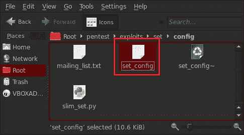

让我们在文本编辑器中打开`set_config`文件，首先设置`Metasploit`目录的路径；否则，集合将无法启动，并将显示错误消息：**未找到 Metasploit**。按以下方式设置目录：`METASPLOIT_PATH=/opt/metasploit/msf3`。

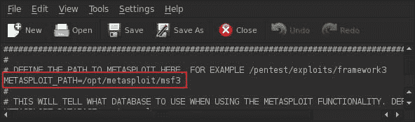

在这个配置文件中我们需要更改的另一件事是将上的**SENDMAIL**选项设置为**，并且将**电子邮件提供者**的名称设置为我们正在使用的名称；例如，这里我们使用的是**GMAIL**。**

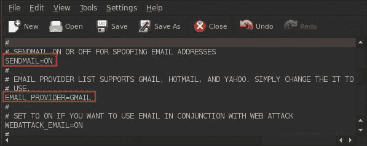

现在我们要做的下一件事是通过键入`apt-get install sendmail`来安装一个小的 Sendmail 应用程序。

现在一切都设置好了，我们可以通过输入`cd /pentest/exploits/set`然后输入`./set`进入以下目录来启动设置程序。

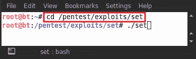

这显示了终端中的设置菜单，如下图所示：

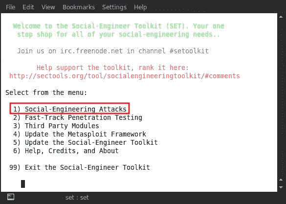

在前面的屏幕截图中，我们可以看到菜单中列出了数字。它的使用非常简单，我们只需选择数字和选项即可执行任何攻击。所以我们在这里为**社会工程攻击**选择数字**1**，然后按*键进入*。

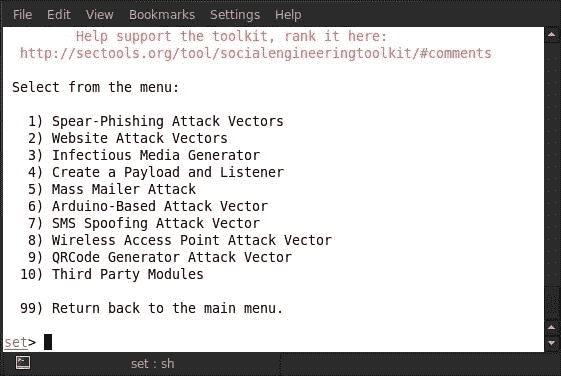

现在我们可以看到，在选择**社会工程攻击**选项后，有另一个菜单打开。在这里，我们可以在菜单中看到，可以执行 10 种类型的攻击。我们无法全部显示，因此首先我们将演示**群发邮件攻击**选项，即菜单中的编号**5**。所以选择**5**再按*回车*会询问如下：**启动 Sendmail？**

键入`yes`启动**Sendmail**攻击。之后，我们将看到两种攻击方式：第一种是**电子邮件攻击单邮箱**，第二种是**电子邮件攻击群发邮件**。这里我们选择选项**1**对单个电子邮件地址进行电子邮件攻击。输入`1`；选择此选项后，系统将询问您必须攻击的电子邮件地址。

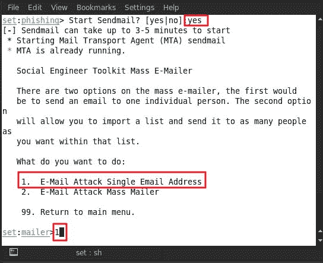

例如，这里我们使用 xxxxxxx@gmail.com 作为受害者的电子邮件地址。

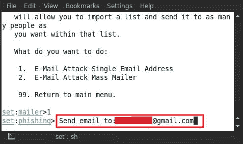

## 攻击选项

我们给出目标地址后，将显示两个攻击选项。第一个选项是**使用 gmail 帐户进行电子邮件攻击**，第二个选项是**使用自己的服务器或开放中继**。对于此攻击，第二个选项是最佳选项。如果你有一个开放中继或你自己的服务器，你可以从任何域地址发送邮件；但在这种情况下，我们没有自己的服务器或开放中继，因此我们将使用 Gmail 帐户并选择选项编号**1**。

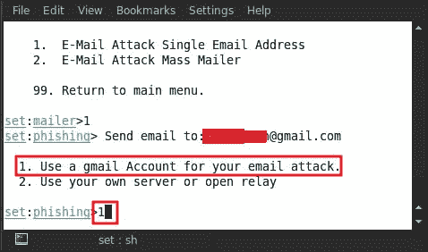

当我们选择选项编号**1**后，系统会询问我们攻击的 Gmail 地址；例如，这里我们使用 yyyyy@gmail.com 作为攻击者的地址。

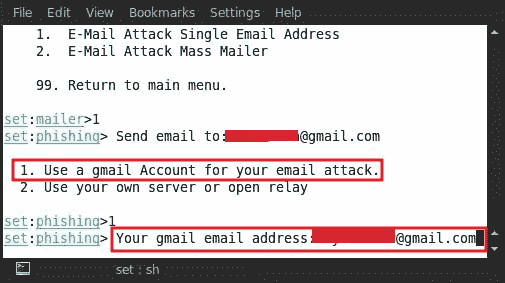

在我们提供了电子邮件地址后，它现在会要求我们提供**电子邮件密码**。

设置电子邮件密码；然后我们将被要求用**是**或**否**标记消息优先级是否高。键入`yes`为消息赋予高优先级。

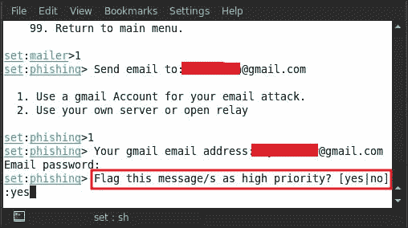

接下来我们将询问关于**电子邮件主题**；例如，这里我们将消息主题设置为`hello`。

下一步我们将询问我们想要发送消息的格式；例如，HTML 格式或纯文本格式。这里我们输入`p`作为纯文本格式。

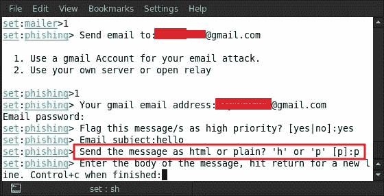

现在输入必须发送给受害者的消息的正文。在这里，我们正在写`you are hacked`。

写入消息后，按*Ctrl*+*C*结束消息正文，消息发送到目标电子邮件地址。然后按*进入*继续。

让我们检查一下我们的邮箱，看看我们的欺骗电子邮件是否已经进入了受害者的收件箱。当我们查看**收件箱**文件夹时，我们没有找到该电子邮件，因为 gmail 会将这些类型的邮件过滤到其**垃圾邮件**文件夹中。当我们检查我们的**垃圾邮件**文件夹时，我们会看到我们的欺骗邮件。

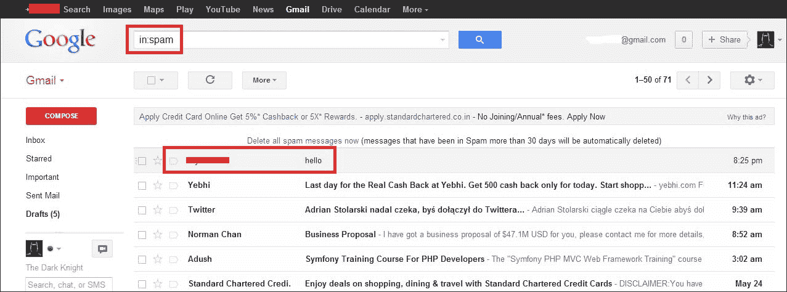

# 阿米蒂奇

我们继续讨论另一个伟大的工具，称为阿米蒂奇（[http://www.fastandeasyhacking.com/](http://www.fastandeasyhacking.com/) 。它是一个基于 Metasploit 的图形工具，由 Raphael Mudge 利用。它用于可视化目标，自动推荐已知漏洞的利用，同时使用框架的高级功能。

现在让我们从阿米蒂奇黑客攻击开始；首先，我们将学习如何启动 Armitage。打开终端并输入`armitage`。

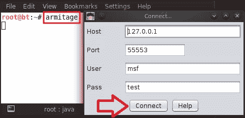

秒后，出现连接盒提示；保留默认设置，点击**连接**。

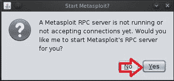

连接后，它会再次提示输入一个选项框，并要求我们启动 Metasploit；点击**是**。

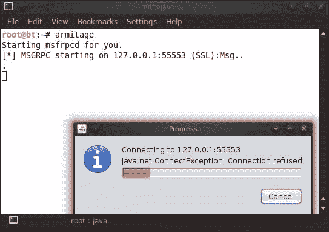

现在 Armitage 已经开始连接我们的本地主机地址，正如我们在前面的屏幕截图中所看到的。成功连接后，我们可以看到我们的**Armitage**控制台已经准备就绪。

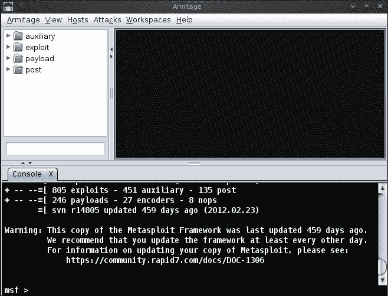

我们将从扫描过程开始。为此，请转到**主机****MSF 扫描**。

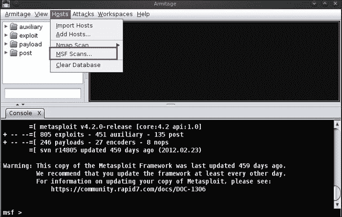

选择**MSF 扫描**后，我们会询问扫描的 IP 地址范围。因此，你可以给它一个范围或给它一个特定的 IP 地址进行扫描；例如，这里我们给出了目标的 IP 地址，即`192.168.0.110`。

在给出目标 IP 后，我们可以在前面的屏幕截图中看到我们的目标已被检测到，并且是一个 Windows 系统。现在，我们将执行**Nmap 扫描**以检查其打开的端口和在其上运行的服务。转到**主机****Nmap 扫描****密集扫描**。

当我们选择了扫描类型后，我们将被询问 IP 地址。给出目标 IP 地址，点击**确定**。这里我们使用`192.168.0.110`作为目标。

成功完成**Nmap 扫描**后，出现**扫描完成**消息框；点击**确定**。

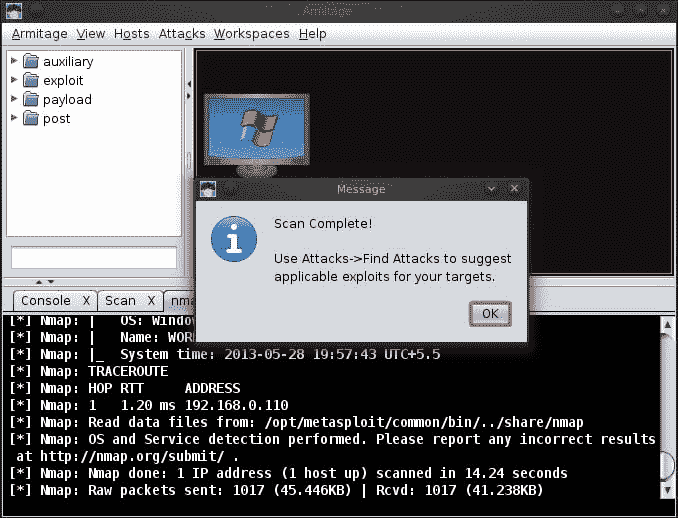

我们可以在终端面板部分看到**Nmap 扫描**结果。**Nmap 扫描**的结果显示，列出了四个开放端口及其服务和版本。

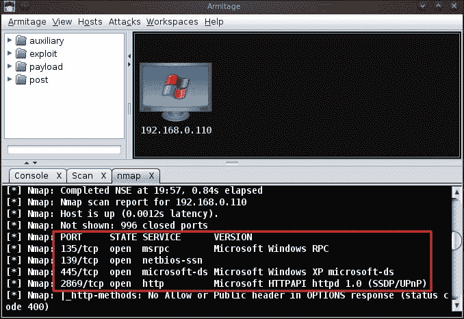

## 与冰雹玛丽共事

现在我们转到阿米蒂奇的攻击部分。转到**攻击****冰雹玛丽**。Hail Mary 是 Armitage 中一个非常简洁的功能，通过它，我们可以搜索自动匹配的漏洞攻击，并在目标上启动漏洞攻击。

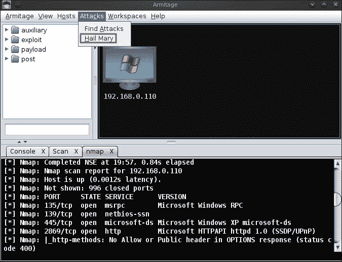

现在冰雹玛丽将开始为目标机器启动所有匹配的漏洞攻击，如下面的屏幕截图所示：

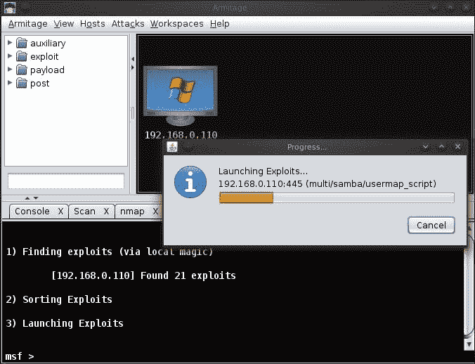

几分钟后，我们看到目标机器图标变为红色，如以下屏幕截图所示。这是一个标志，象征着我们通过其中一次攻击成功地破坏了系统。我们还可以看到，在航站楼二区有**MeterMeter**会话。

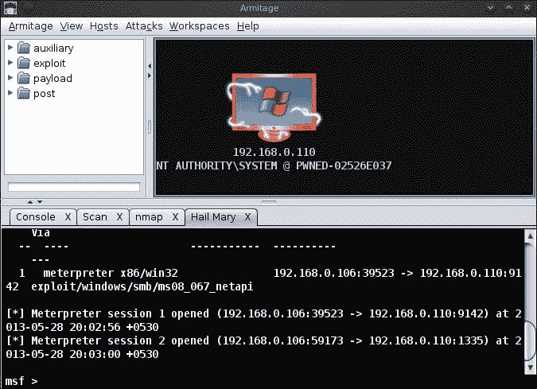

现在右键单击受损系统；我们将在那里看到一些有趣的选择。我们可以看到**攻击**选项、两个**MeterMeter**会话和**登录**选项。现在我们将尝试使用其中的一些选项。

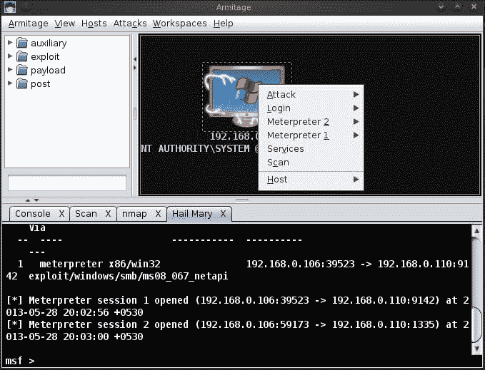

进入的**计量表 1**选项；在这里我们将看到更多的选项，例如**交互**、**访问**、**探索**和**旋转**。在 Metasploit 中，通过键入大量命令，所有选项都已被使用，但在 Armitage 中，我们只需单击一个特定选项即可使用它。

接下来，我们将使用一些流量计选项。我们将使用**交互**选项与受害者的系统交互。进入**互动****桌面（VNC）**。

在之后，我们会看到一个消息框，显示**VNC 绑定 tcp stager**连接已经建立，使用 VNC 查看器需要连接到`127.0.0.1:5901`的消息；点击**确定**。

再次出现第二个消息框提示，显示有关 VNC 绑定 stager 和使用进程 ID 1360 运行的`notepad.exe`进程的详细信息。点击**确定**。

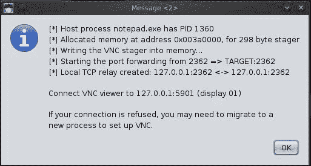

最后一个和最后一个消息框将显示我们的 VNC 有效负载正在受害者的系统上成功运行，要使用 VNC 查看器，我们需要连接到`127.0.0.1:5901`。

让我们打开终端并输入`vncviewer`连接到 VNC 查看器。将出现一个**vncviewer**框；我们需要给出要连接的 IP 和端口号，如下面的屏幕截图所示。在我们的例子中，我们给出了`127.0.0.1:5901`。

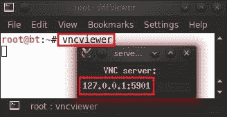

而在这里我们走；我们可以看到受害者的桌面并轻松访问它。

现在我们将尝试MeterMeter的另一个选项，即**探索**选项。进入**浏览****浏览文件**。

使用**Explore**选项，我们可以浏览受害者的驱动器并查看受害者的`C:`驱动器及其文件。还有两个选项：一个用于上载文件，另一个用于在目标系统中创建目录。我们可以看到以下屏幕截图中的两个选项都用红色框标记。

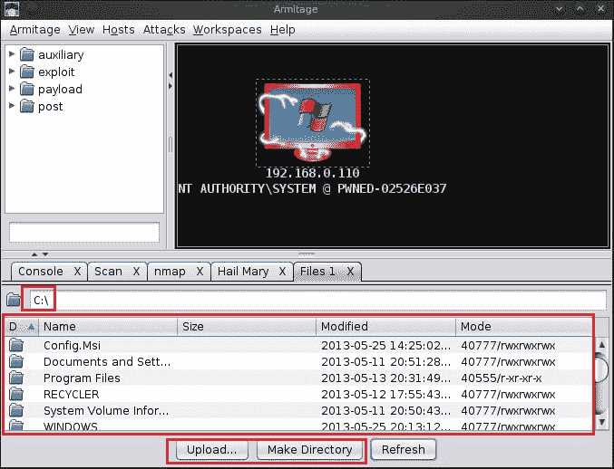

## 仪表接入选项

现在我们将使用另一个MeterMeter选项**访问**选项。在这个选项下，有更多的选项可用；所以在这里我们将使用**转储哈希**选项。进入**访问****转储哈希****lsass 方法**。

几秒钟后，一个消息框将提示哈希已成功转储，要查看它们，我们可以使用**视图****凭证**。

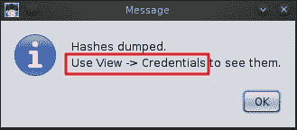

让我们通过进入**查看****凭证**来查看转储的哈希。

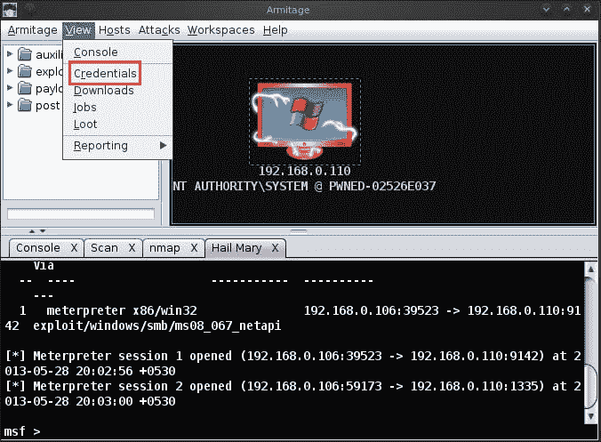

我们可以在下面的屏幕截图中看到所有用户名及其哈希密码：

如果我们想破解所有这些转储的哈希，我们可以点击**破解密码**。将出现一个窗口，然后单击**启动**。

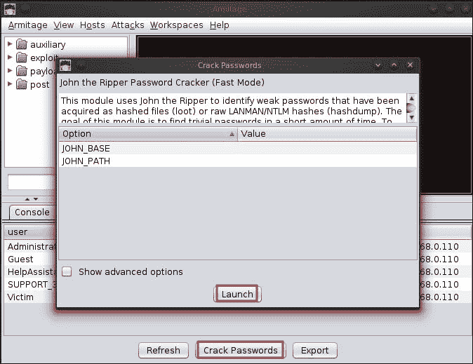

我们可以看到破解哈希的结果；注意，**管理员**密码哈希已成功破解，密码为**12345**。

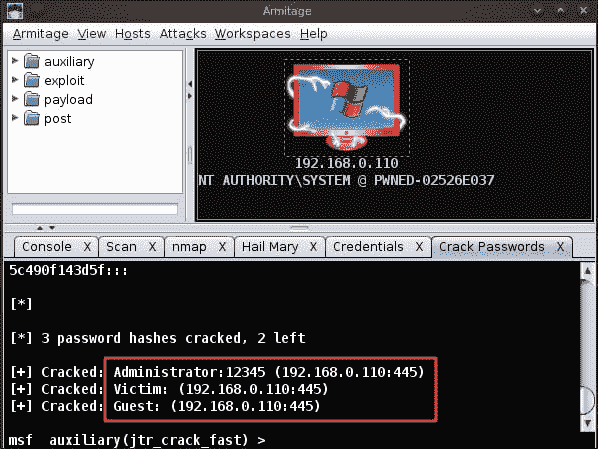

正如我们使用了不同类型的MeterMeter选项一样，还有一些其他选项可用，例如用于检查受害者系统上运行的服务的**服务**。

# 总结

在本章中，我们学习了如何使用 Metasploit 框架的附加工具，并进一步掌握了利用技巧。社会工程攻击仍然是攻击受害者最有力的方式之一，也是使用最广泛的方式之一。这就是为什么我们要介绍社会工程工具包来演示如何攻击受害者。我们还通过 Armitage 掌握了图形化利用的艺术，使利用变得极其容易。使用此工具，漏洞分析和利用非常简单。有了这一章，我们就到了书的结尾。我们涵盖了广泛的信息收集技术、利用基础知识、利用后技巧、利用艺术以及其他附加工具，如 SET 和 Armitage。

# 参考文献

以下是一些有用的参考资料，进一步阐明了本章所涵盖的一些主题：

*   [http://www.social-engineer.org/framework/Computer_Based_Social_Engineering_Tools:_Social_Engineer_Toolkit_（套）](http://www.social-engineer.org/framework/Computer_Based_Social_Engineering_Tools:_Social_Engineer_Toolkit_(SET))
*   [http://sectools.org/tool/socialengineeringtoolkit/](http://sectools.org/tool/socialengineeringtoolkit/)
*   [www.exploit-db.com/wp-content/themes/exploit/docs/17701.pdf‎](http://www.exploit-db.com/wp-content/themes/exploit/docs/17701.pdf%E2%80%8E)
*   [http://wiki.backbox.org/index.php/Armitage](http://wiki.backbox.org/index.php/Armitage)
*   [http://haxortr4ck3r.blogspot.in/2012/11/armitage-tutorial.html](http://haxortr4ck3r.blogspot.in/2012/11/armitage-tutorial.html)
*   [http://blog.right-technology.net/2012/11/21/armitage-gui-for-metasploit-tutorial/](http://blog.right-technology.net/2012/11/21/armitage-gui-for-metasploit-tutorial/)