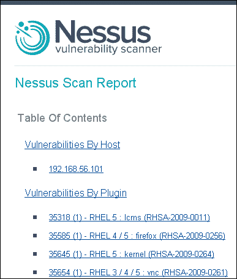
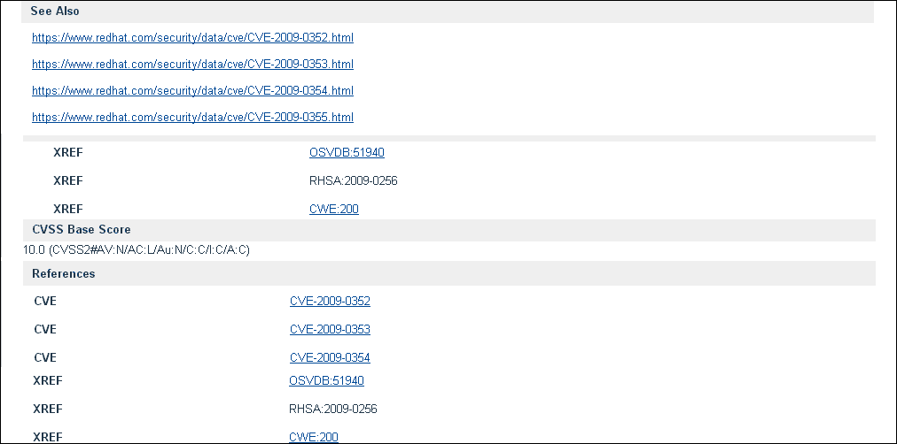
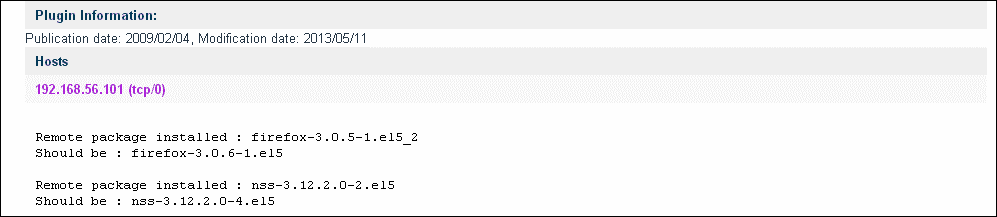
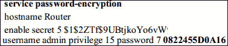

# 三、扫描分析

漏洞扫描分析是扫描的下一步。要使漏洞扫描评估成功且有效，对漏洞进行准确分析是绝对必要的。由于大多数扫描仪根据其存储库中可用的漏洞插件生成扫描输出，强烈建议进行人工分析以避免误报和漏报。通常，假阳性或假阴性表示扫描输出中漏洞报告不准确或根本未报告的情况。定义如下：

*   **假阳性**：更常见的是指系统中报告为活动的漏洞实际上并不存在；这意味着它可能是错误漏洞报告的结果
*   **假阴性**：在漏洞扫描中的输出实质上意味着在扫描输出中不报告基础设施中实际存在的漏洞

在本章中，我们将学习如何通过涵盖以下主题来有效分析 Nessus 扫描结果的输出：

*   结果分析
*   假阳性分析
*   脆弱性分析
*   漏洞利用

# 结果分析

在本书的前一章中，我们学习了如何执行和保存扫描结果。本节介绍如何阅读和解释 Nessus 扫描报告。为了便于说明，使用了一个示例报告来突出显示 Linux 系统中的漏洞。我们参考的报告以 HTML 格式保存，包括在保存报告时选择的详细信息，如**主机摘要**、**主机漏洞**、以及**插件漏洞**。

## 报告解读

Nessus 提供了不同的选项，如 HTML、PDF 和**逗号分隔值**（**CSV**）来保存报告。保存报告以按漏洞或主机获取摘要和详细信息时，应选择这两个选项。

下面的屏幕截图显示了一个典型的**Nessus 扫描报告**的 HTML 格式：



### 主持人总结（执行）

**主机摘要（执行）**部分将包括针对每个关键类别的漏洞计数，以及每个漏洞的摘要详细信息；这包括：

*   **严重性**（严重性评级连同和 CVSS 分数）：这定义了观察到的漏洞的严重程度
*   **插件 Id**：这是插件唯一的标识符，用于检查发现的漏洞
*   **名称**：显示漏洞的名称

以下屏幕截图显示了显示主机摘要的示例报告：


### 主机漏洞

报告的**主机漏洞**部分总结了每台主机的漏洞调查结果。**摘要**提供了扫描运行时间的详细信息、被扫描主机的基本详细信息，以及按临界等级分组的漏洞数量计数。

以下屏幕截图是显示主机摘要的示例报告：


前面的屏幕截图显示了主机的**漏洞**选项，包括以下部分：

*   **扫描信息**：本节以日/时/年格式显示扫描的**开始时间**和**结束时间**。
*   **主机信息**：此部分显示**DNS 名称**、**IP**、**MAC 地址**和**OS**。
*   **结果总结**：本部分给出了根据 Nessus 分配的临界等级分组在一起的漏洞计数。这些类别为**关键**、**高**、**中**、**低**和**信息**。它还显示了 Nessus 报告的漏洞总数。

### 提示

**通用漏洞评分系统（CVSS）**

Nessus 在评分系统的基础上，使用**通用漏洞评分系统**（**CVSS**对漏洞进行评分。这是一个基于漏洞特征和影响的开源漏洞评级系统。它包括一些参数，如脆弱性的内在特征、随时间变化的脆弱性特征以及特定于环境的脆弱性特征。有关详细信息，请参见[http://www.first.org/cvss/cvss-guide](http://www.first.org/cvss/cvss-guide) 。

下表列出了基于 Nessus 使用的漏洞评级的 CVSS 分数。如本章前面所述，Nessus 报告的评级可以进一步分析如下：

<colgroup><col style="text-align: left"> <col style="text-align: left"></colgroup> 
| 

CVSS 评分

 | 

临界性

 |
| --- | --- |
| 0 | 信息 |
| <4 | 低的 |
| <7 | 中等的 |
| <10 | 高的 |
| 10 | 批评的 |

### 注

CVSS 分数参考互联网上的不同内容，包括在[上提供的 Nessus 用户指南 http://www.tenable.com](http://www.tenable.com) 。

### 插件漏洞

插件的**漏洞**部分包含该漏洞的所有相关详细信息。下面的部分显示了一个屏幕截图，其中包含用于描述漏洞的详细信息，以及每个字段的简要说明。

以下截图仅供说明之用；其他参考链接和**常见漏洞和暴露**（**CVE**）已被删除：


以下屏幕截图显示报告中的**参考**和**CVSS 基准分数**：



以下截图显示**插件信息**部分：



在前面的截图中捕获的漏洞详细信息如下：

<colgroup><col style="text-align: left"> <col style="text-align: left"></colgroup> 
| 

脆弱性参数

 | 

细节

 |
| --- | --- |
| 提要 | 本节显示了该漏洞的关键特征。例如，这里的概要部分描述了缺失的安全补丁。 |
| 描述 | 本节给出了有关该漏洞的详细信息，并包括由于已识别漏洞而存在的关键安全问题。例如，屏幕截图中提到了一个关键的安全问题，因为缺少一个补丁以及 CVE 编号。本节还介绍了高级建议。 |
| 另见 | 本节包含参考链接（如有），有助于更好地了解发现漏洞的组件/基础设施供应商发布的问题。 |
| 解决方案 | 本节给出了脆弱性缓解的建议。 |
| 风险因素 | 本节显示已识别漏洞的风险等级。例如，**临界**、**高**、**中**。 |
| CVSS 基本分数 | 本节显示计算风险评级所依据的 CVSS 分数。 |
| 工具书类 | 本节显示所观察问题的 CVE 和 CWE 信息。外部参照是与该漏洞相关的其他信息源的交叉引用。 |
| 插件信息 | 本节显示了启用查找此漏洞的插件的详细信息。 |
| 主办 | 本节显示了发现该漏洞的主机的 IP 地址，以及发现该漏洞的基础设施的当前和建议的详细信息。 |

### 提示

**常见漏洞和****暴露**（**CVE**是一个已知安全漏洞和暴露的数据库。每个漏洞都分配了一个唯一的 CVE 编号，该编号在 Nessus 报告中交叉引用，以提供有关该漏洞的更多详细信息。有关更多信息，请参阅[http://cve.mitre.org](http://cve.mitre.org) 。

**常见弱点枚举**（**CWE**）是常见弱点类型的字典，提供了各种常见弱点的详细信息。Nessus 还引用了，以更好地了解漏洞。有关更多信息，请参阅[http://cwe.mite.org](http://cwe.mite.org) 。

## 假阳性分析

假阳性是指任何扫描工具突出显示的问题或漏洞，但目标系统上实际上不存在这些问题或漏洞。不同工具的假阳性率不同；下面列出了可用于假阳性分析的几个常见指针。

### 了解组织的环境

以下是有助于假阳性分析的组织的基本理解：

*   基本的组织基础设施详细信息，如网络环境、基础设施、操作系统、应用程序和使用的技术，将有助于对照实际实施的技术和版本交叉检查漏洞评估（VA）结果，以消除误报
*   在周期性周期中的 VA 扫描使用内部基础设施的情况下，这将变得更为有利，因为这些详细信息随时可用
*   如果作为外部顾问进行有时限的扫描，则很难获得所有此类详细信息。在这种情况下，作为参与前先决条件的一部分，可以寻求与相关基础设施利益相关者的联系，以了解技术细节

### 针对关键漏洞

如果存在大量漏洞，在报告之前，至少应对最关键的漏洞进行交叉验证，以防误报。

### 概念证明

如果可以访问进行 VA 扫描的服务器/设备，则可以通过登录服务器或尝试对漏洞进行概念验证来交叉检查漏洞。例如，如果漏洞表明服务器中正在运行明文**文件传输协议**（**FTP**）或 Telnet 服务，我们可以登录服务器交叉检查这些服务是否实际运行，或者提供证明尝试从测试机连接 FTP 或 Telnet 协议。

### 端口扫描工具

开源扫描工具，如**Nmap**也可用于再次枚举基础设施的开放漏洞，以交叉检查 VA 报告的发现。

### 工作量估算

由于工作量估算是一项耗时的活动，因此应考虑额外的工作量和资源，包括消除假阳性。此外，根据参与的规模和性质，应采取实际行动，确定这项活动的范围。

## 脆弱性分析

在一般术语中，脆弱性分析被认为与脆弱性评估类似。然而，我觉得这两者之间有一点不同。脆弱性分析是脆弱性评估周期的一部分，您可以在其中识别脆弱性，量化风险，并确定风险的优先级。漏洞分析调查漏洞评估工具检测到的漏洞。

需要注意的是，脆弱性分析是一个可选步骤，取决于脆弱性评估工具的能力、扫描环境、深入分析等。脆弱性调查应考虑所有这些因素。如今，大多数漏洞评估工具都会自动获取没有误报或误报最少的报告。尼索斯就是其中之一。

当**安全运营中心**（**SOC**）或内部安全部门进行漏洞评估时，如果您不想花太多精力进行手动分析，您更愿意将所有扫描结果交给不同的团队进行漏洞关闭。在这种情况下，您不太关心漏洞的严重性，等等。如果我们讨论一个不同的场景，即您作为第三方审计师与一家公司合作，并且您正在进行漏洞评估，那么在这种情况下，您向该公司报告的每个漏洞都将被非常认真地对待，并且必须对漏洞的存在、严重性、适用性等有适当的理由。

在本节中，我们将探讨前面提到的第二种场景，即第三方顾问为客户进行审计或技术漏洞评估，其中漏洞报告需要在适用性、风险严重性、环境依赖性和无误报方面做到完美。

从 Nessus 等漏洞扫描程序获得扫描结果报告后，您可以对每个漏洞进行详细审查，以至少检查以下方面：

*   假阳性
*   风险严重性
*   适用性分析
*   修复建议

### 假阳性

本章第二节详细介绍了假阳性分析。

### 风险严重性

风险严重性是与每个漏洞相关的风险的严重性，取决于环境和业务性质。风险严重程度可以是定量的或定性的。一般来说，最好使用风险严重性作为定性指标，并得到业界的认可。风险可分为**严重**、**高**、**中**、**低**和**信息**。少数组织仅将其归类为**高**、**中**和**低**。

大多数通过不同安全认证（如 ISO 27001）的大型企业组织都定义了其风险管理流程。这些风险管理过程定义了它们的风险严重性以及它们的定义、风险矩阵、风险接受标准等。在执行漏洞评估时，如果遵循风险矩阵，则可能需要对风险严重性评级进行重新分类。

例如，在没有 SSL 的情况下运行的组织的公共网站上存在漏洞。漏洞扫描程序可能会将此漏洞声明为具有**高**风险等级，如果您进行漏洞分析，它可能会声明不同的风险等级。

让我们假设一个场景，你正在为一个小型非政府组织做脆弱性评估；他们的网站上没有敏感信息，SSL 漏洞被发现。网站上的所有信息都是公开的。在这种情况下，您可能会说漏洞风险评级为**低**或**信息**，而扫描工具可能会将其报告为**高**。

在另一个场景中，您正在为一家中型公司进行漏洞评估，该公司在其网站和公共报告上进行调查，发现了 SSL 的相同漏洞。此处记录的大部分信息都是机密信息，不应泄露。在这种情况下，您可以说漏洞风险评级为**中等**或**高**，并将被扫描工具评级为**高**。

另一种情况是，您正在为一家大型银行进行漏洞评估，该银行在其网站上有网上银行登录。银行客户登录使用网上银行服务并进行金融交易；再次发现相同的 SSL 漏洞。在这种情况下，如果未实施 SSL，则这是一个严重的风险评级漏洞，工具会将其报告为**高**。

如果我们想根据风险评级来处理风险，那么重新审视漏洞扫描工具给出的风险评级是非常重要的。

### 适用性分析

漏洞评估工具发现的每个漏洞可能不适用于组织。漏洞适用性用于检查自动漏洞评估工具报告的漏洞是否适用于组织。

例如，应用程序中存在诸如弱密码之类的漏洞。漏洞扫描程序可能会将此漏洞宣布为具有**高**风险等级，如果您进行漏洞适用性分析，则可能会将其宣布为不适用。

让我们假设一个场景，你正在做一个小组织的脆弱性评估。漏洞扫描程序报告应用程序的弱密码漏洞。该工具发现该应用程序的一些密码只有七个字符长，报告为一个**高**风险严重性漏洞。在进行适用性分析时，我们发现该组织已批准了一项安全密码策略，该策略认为即使密码长度为 7 个字符，密码也很强；因此，此漏洞不适用于组织。

重新审视风险并看看它们是否真的适用于组织是很重要的。

### 修复建议

Nessus 在工具生成的报告中为每个漏洞提供修复建议。其中一些问题可以通过多种方式解决，例如，通过补偿控制。可以通过多种方式修补或修复漏洞。

让我们通过一个示例漏洞来说明这一点。发现服务器上存在诸如明文协议 FTP 之类的漏洞。通常推荐的修复程序用作文件传输的安全协议，如**安全文件传输协议**（**SFTP**）。另一个解决方案可能是分析打开 FTP 的需求。可能有一种情况，FTP 在测试期间保持打开状态；现在，即使在生产中，FTP 也是开放的，不再使用。在这种情况下，应该关闭该服务器上的 FTP 端口。在这个场景中，我们看到对于同一个漏洞有两个修复程序：一个是使用 SFTP 而不是 FTP，另一个是关闭 FTP 端口。同样，建议明智地应用修复。

## 漏洞利用

在[第 1 章](1.html "Chapter 1. Fundamentals")、*基础*中，我们介绍了漏洞评估和渗透测试练习之间的差异。基本上，这两者之间的差异与利用漏洞有关。在漏洞评估中，您只需发现漏洞；但在渗透测试中，还需要利用漏洞扫描期间发现的漏洞。

渗透测试不一定是侵入性的；它也可以局限于概念的证明。如今，大多数组织都希望在概念验证完成之前限制 pentest（渗透测试）的范围，因为如果进行侵入性测试，您的系统/服务可能会崩溃。

市场上有多种渗透测试工具，这些工具配备有脚本、程序、有效负载和注入，用于执行渗透测试。

以下是几个示例，展示了如何利用漏洞。样本机器上的 Nessus 扫描仪报告了以下漏洞。

### 利用示例 1

第一个示例中的漏洞标题是在应用程序主页上发现的一个**跨站点脚本**（**XSS**）。

让我们假设一个场景，在一个目标主机上运行的扫描应用程序中，一个扫描漏洞导致了 XSS 漏洞。以下 Nessus 报告中给出了 XSS 的详细信息，反映了页面漏洞存在于哪个应用程序上：

<colgroup><col style="text-align: left"> <col style="text-align: left"></colgroup> 
| 

内索斯报告主管

 | 

Nessus 报告示例文本

 |
| --- | --- |
| 提要 | 远程 web 服务器承载一个易于受到跨站点脚本攻击的 PHP 脚本。 |
| 描述 | phpMyAdmin 版本在用于生成动态 HTML 之前，无法验证用户输入到`error.php`脚本的`error`参数中的 BBcode 标记。攻击者可以通过向用户浏览器中注入任意 HTML 或脚本代码来利用此问题，以便在受影响站点的安全上下文中执行。例如，这可以用来显示包含任意文本和指向外部站点的链接的页面。 |
| 解决方案 | 升级至 phpMyAdmin 3.4.0-beta1 或更高版本。 |
| 另见 | [http://www.phpmyadmin.net/home_page/security/PMASA-2010-9.php](http://www.phpmyadmin.net/home_page/security/PMASA-2010-9.php) |
| 插件信息 | 出版日期：2011 年 1 月 6 日，修改日期：2011 年 10 月 24 日 |
| 风险信息 | 中等的 4.3（CVSS2#AV:N/AC:M/Au:N/C:N/I:P/A:N）3.6（CVSS2#AV:N/AC:M/Au:N/C:N/I:P/A:N） |
| 脆弱性信息 | 跨站点脚本允许攻击者运行可能导致窃取 web 浏览器会话信息或创建 web 链接以破坏 web 应用程序的脚本。 |
| 参考资料 | 投标书 45633CVE CVE-2010-4480 外部参照 OSVDB:69684 外部参照 EDB-ID:15699 |
| 插件输出 | Nessus 能够使用以下 URL 利用此问题：`http://192.168.56.3/phpMyAdmin/error.php?type=phpmyadmin_pmasa_2010_9.nasl&error=%5ba%40http%3a%2f%2fwww.phpmyadmin.net%2fhome_page%2fsecurity%2fPMASA-2010-9.php%40_self]Click%20here%5b%2fa]` |

一旦漏洞扫描程序报告跨站点脚本，并且如果您参与对该机器进行渗透测试，则需要进一步渗透该漏洞。这可以通过运行恶意脚本、进行概念验证和利用漏洞来实现。

跨站点脚本（也称为 XSS）可以位于接收 URL 中某些输入的输入参数中，也可以位于 web 应用程序的一个输入框中。要利用它，您需要篡改参数中的最终用户输入，该参数进一步显示相同的输入。您可能希望使用诸如 Burp 套装、Bayden Tamper IE 或任何其他 HTTP 流量拦截器之类的工具。通过使用拦截器，您可以处理从客户机到服务器的 HTTP 请求。

要测试 XSS 是否存在，可以使用以下示例有效负载作为最终用户输入参数的输入：

```
<script>alert("XSS Exist")</Script>
"><script>alert("XSS Exist")</Script>
```

前面的有效载荷需要根据您正在利用的代码进行调整。

为了进一步深入，您可以使用以下示例有效载荷：

```
<script>alert(document.cookie)</script>
onmouseenter="alert(document.cookie);
onreadystatechange="alert(document.cookie);
```

这将在屏幕上弹出实时 cookie 详细信息，如以下屏幕截图所示：


对于持久性 XSS，最终用户输入存储在数据库中，并在浏览应用程序页面时为数据库中的所有用户再次显示。您应该尝试以下负载，该负载会在网页上创建超链接，从而将用户重定向到攻击者的网站：

```
http://TargetIP:8080/ShowingImage.asp?id=
<a href = "http://www.attackerURL.com">click</a>
```


通过深入理解脚本和编码，可以进一步利用 XSS。

### 利用示例 2

第二个示例的漏洞标题是利用路由器上发现的弱密码或容易猜测的密码进行攻击。

Nessus 有能力根据行业最佳实践审查 Cisco 设备配置。当管理员没有仔细配置 Cisco 设备时，可以观察到的一个常见漏洞是使用默认密码或弱密码。

**思科互联操作系统**（**思科 IOS**是思科路由器、交换机等网络设备的操作系统。为了便于说明，我们将以路由器为例。Cisco 路由器配置文件具有路由器在网络中执行路由功能的所有相关配置。

Cisco IOS 提供了设置不同类型密码的选项：类型 0 通常表示不加密的密码，类型 7 表示使用服务密码加密命令加密的密码，该命令使用专有算法，类型 5 表示使用已启用的机密命令保护密码，它在配置中使用 MD5 哈希。当我们在 Cisco 路由器配置中看到类型 5 或类型 7 密码时，它们将显示为加密密码。



Cisco type 7 密码被认为是不安全的，因为它是使用弱算法加密的，并且可能被破解。

通过提供具有适当权限的凭据扫描 Cisco 路由器配置时，Nessus 将突出显示弱密码的使用。

一旦 Nessus 报告强调使用弱 7 型密码，它就可以被利用，并且可以使用互联网上提供的众多免费软件工具之一进一步破解。出于演示目的，使用以下 URL：

[http://www.ibeast.com/content/tools/CiscoPassword/index.asp](http://www.ibeast.com/content/tools/CiscoPassword/index.asp)

如果 Nessus 在扫描 Cisco 路由器后突出显示弱密码或 7 类密码的使用；我们使用了示例**（**`0822455D0A16`**中使用的第 7 类密码。**

 **如果我们使用这个密码并使用前面的链接破解它，几秒钟内我们就会知道默认密码，即**cisco**已被使用。

在下面的屏幕截图中，我们在常用的密码破解工具中输入 7 类密码：


以下屏幕截图显示给出输出的工具（破解密码）：


### 利用示例 3

第三个示例的漏洞标题是可能的 SQL 注入。

SQL 注入是 Nessus 可以发现的应用程序漏洞。SQL 注入允许攻击者注入或运行恶意 SQL 命令，攻击者通过该命令直接与应用程序后面运行的数据库通信并执行 SQL 查询。这可能会像在数据库服务器上运行`fdisk`命令一样具有破坏性，该命令将完全格式化服务器，并且在服务器上创建本地管理员将在所有方面危害服务器。这还允许攻击者运行扩展存储过程，这是非常强大的命令。通过运行恶意 SQL 查询，攻击者可以修改构成 SQL 查询的输入字符串，从而使输出显示数据库中所需的模式和数据。

当漏洞扫描程序报告 SQL 注入漏洞，并且您正在进行渗透测试时，您需要进一步利用它。

以下是开发过程：

在需要输入用户名和密码的应用程序登录页面上，使用下表中提到的输入注入检查该特定页面是否确实存在 SQL 注入：

<colgroup><col style="text-align: left"> <col style="text-align: left"></colgroup> 
| 

序列号

 | 

注入管柱

 |
| --- | --- |
| 1. | 用户名：`admin`（任何用户名）密码：`' OR 1=1--` |
| 2. | 用户名：`admin'; --`密码：`' OR 1=1--` |
| 3. | 用户名：`administrator'; --`密码：`' OR 1=1--` |

所有利用漏洞的行为本质上都是独一无二的，因此，我建议根据您的目标机器构建注入、脚本和有效负载。

# 总结

扫描分析包括对扫描输出的分析，以确保对漏洞进行验证和准确的报告。这包括消除假阳性和假阴性。

假阳性更常见；这一术语意味着系统中报告为活动的漏洞实际上并不存在，这意味着它可能是错误漏洞报告的结果。

通过了解组织的环境、概念证明和使用端口扫描工具进行验证，可以消除误报。由于这是一项耗时的活动，因此可以使用目标关键漏洞进行大范围的攻击。该活动的工作量估算也应提前考虑。

结果分析包括查看 Nessus 扫描输出，包括所有必要的详细信息，如概要、描述、风险因素（包括 CVE 分数），CVE 分数是一个公开已知安全漏洞和暴露的数据库。每个漏洞都分配了一个唯一的 CVE 编号，该编号在 Nessus 报告中交叉引用，以提供有关该漏洞的更多详细信息。

除了消除假阳性之外，分析还将涉及基于系统对组织业务需求的重要性的严重性分析，其中高度关键服务器上的低或中等漏洞需要相应地优先处理。还应交叉检查报告的特定漏洞对组织的适用性。

根据报告中给出的建议，并考虑到可用于缓解脆弱性的其他替代控制措施，应制定关闭措施。

漏洞利用（或渗透测试）是识别漏洞后的下一步。Nessus 提供了一个选项来检查已识别漏洞的攻击是否在攻击框架中可用，如**Metasploit**或**Canvas**。它还涉及到进一步的学习和研究，以便在存在少量漏洞（如跨站点脚本和 SQL 注入）的情况下选择适当的负载。**