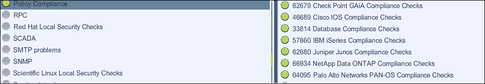
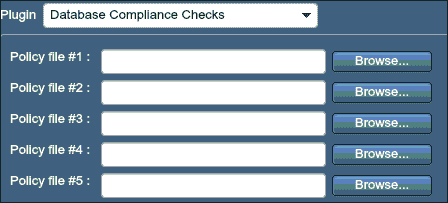
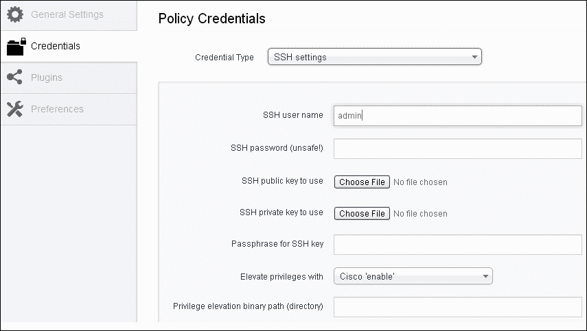

# 五、合规性检查

Nessus 是众所周知的漏洞扫描器，但它也提供了进行合规性检查的选项。使用此选项，可以交叉检查基础结构（如服务器、网络设备、数据库和桌面）的安全配置设置是否符合组织遵循的已定义策略或最佳做法。

合规性检查审计是组织当前安全需求所要求的一项重要且必要的功能。所有具有安全意识的组织都为其 IT 和网络基础架构定义并实施安全配置设置，以防止因任何错误配置而受到安全威胁的危害。此外，当一家公司必须遵守不同的合规性法规（如信息安全管理系统的 ISO 27001、健康行业的 HIPAA 和金融领域的 SOX）时，安全强化和检查实施的此类合规性要求也会产生。

要根据这些定义的控制或安全配置检查服务器、网络设备的合规性，需要定期执行合规性检查活动。手动执行此类合规性检查，尤其是在基础设施规模较大的情况下，甚至在每个设备要检查的后采样和控制数量较多的情况下，都将是一项繁琐而耗时的工作。这也可能导致操作团队和合规团队之间在准备、验证和纠正工件时来回交换错误和时间的可能性。

Nessus 提供的合规性检查选项将有助于以自动化方式进行此类检查。Nessus 还提供了修改法规遵从性文件的选项，使其符合组织的设备强化策略。

### 提示

**漏洞扫描**通常会识别系统中存在的众所周知的漏洞（插件可用），并识别缺失的补丁。

**审核**将检查基础设施是否符合本地策略中定义的安全配置。

在漏洞扫描期间减少漏洞并不意味着系统已安全配置。例如，如果组织的密码策略要求至少 10 个字符，因为它处理敏感信息，则服务器可能已更新修补程序，或者在执行 VA 扫描的输出中具有相对较少的漏洞。这是因为服务器不会确保配置 10 个字符的密码策略。Nessus professional feed 提供此功能。

Nessus 合规性检查适用于服务器操作系统（Windows 和 Unix）、数据库、台式机和网络设备等主要平台，以及 PCI DSS 等审计标准。

本章将涵盖以下主要领域：

*   审计政策
*   如何配置 Nessus 合规性检查策略
*   Nessus 的合规报告
*   针对不同类型基础架构的符合性检查选项

# 审计政策

为了执行这些合规性审核，扩展名为`.audit`的文件中提供了策略，这些文件可用于不同的基础设施元素，如数据库、Windows 和 Cisco。这些审计文件还包含众所周知的标准（如 SOX 和 PCI-DSS）所涵盖的公共检查点。这些文件还包含 NIST 和 CERT 等知名安全治理和咨询机构的建议。

这些审计文件可以根据本地策略或强化文档进行调整。Tenable 提供了从其支持站点下载这些审核文件的选项，并提供了理解这些文件语法的文档，以便根据您的要求进行自定义来创建这些文件。Tenable 还提供了将扩展名为`.inf`的 Windows 策略文件转换为扩展名为`.audit`的 Windows 策略文件的工具。

要启用合规性检查选项，最终用户首先需要单击**+添加策略**。符合性检查选项在**策略****插件****首选项**下可用。

在可用的各种 Nessus 插件中，符合性检查的插件系列是**策略符合性**。此插件检查涵盖不同的 infra 组件，如服务器和网络。

以下屏幕截图显示了**策略遵从性**插件系列：

要使用自定义审核文件，请使用**策略**下的**首选项**选项。在**首选项**选项卡下，有一个下拉菜单可选择不同的符合性检查，如**Cisco IOS 符合性检查**和**数据库符合性检查**。在这里，用户还可以选择并上传多个审计文件，用于执行合规性检查。

以下屏幕截图显示所选的**数据库符合性检查**选项：

## 凭证

Nessus 要进行合规性检查，需要提供凭证才能登录系统进行本地检查。所使用的凭据应该是特权帐户的凭据，即对于具有读取本地计算机策略的管理权限的 Unix 帐户，是超级用户权限。在数据库符合性检查的情况下，需要数据库凭据。如果是 Cisco IOS 合规性检查，则需要启用密码来执行配置审核。可以在**策略****凭证**下添加凭证，就像在 VA 扫描期间一样。

以下屏幕截图是如何在 Cisco 配置审核时提供凭据的示例：

# 合规性报告

为了获得特定于目标公司合规性状态的报告，Nessus 在保存报告时提供了**合规性检查**和**合规性检查（执行）**等选项。使用这些选项中的任何一个，可以根据`.audit`文件中的控件获取系统的符合性状态。这在报告中通过提及合规性是否失败、通过或跳过以及执行摘要来体现。非决定性测试报告在错误和警告下。

以下屏幕截图显示了使用**符合性检查**和**符合性检查摘要**选项生成的报告：

# 审计基础设施

合规性插件在**政策合规性**插件系列下提供。本节列出了该系列下可用的插件，展示了可以进行合规性审计的基础设施类型。对于每种类型的基础设施元素，如服务器、网络和数据库，需要选择适当的策略文件、凭据和插件，如本章前面几节所述。

## Windows 合规性检查

使用这个插件，可以检查在 Windows 框架的**策略**选项下设置的符合性参数。在 Windows audit 下执行的一些检查示例包括：

*   注册表设置
*   文件权限
*   密码策略
*   锁定策略
*   审计政策
*   用户权限策略
*   服务审计

## Windows 文件内容

**Windows 文件内容**选项允许 Nessus 检查 Windows 文件类型（Excel、Adobe 或文本文件），其中可能包含敏感数据，如**个人身份信息**（**PII**和信用卡详细信息。

## Unix 合规性检查

Nessus 可以对不同风格的 Unix 进行合规性检查，如 Solaris、Red Hat、AIX、HP-UX、SUSE、Gentoo 和 freebsd。关键检查包括以下内容：

*   密码管理
*   文件权限
*   密码文件管理
*   权限管理
*   根访问管理
*   运行进程

## 思科 IOS 合规性检查

使用这个插件，可以检查运行 Cisco IOS 设备配置文件的 Cisco 机器。可以对保存的、正在运行的或启动的配置进行符合性检查。例子包括：

*   应用于接口的访问列表
*   SNMP 社区字符串受 ACL 保护
*   单方服务被禁用
*   SNMP 默认社区字符串已更改

## 数据库符合性检查

Nessus 还可以根据安全策略检查不同数据库的符合性。支持的数据库包括 MS SQL、Oracle、MySQL PostgreSQL、IBM DB2 和 Informix/DRDA。为确保报告的完整性，用于登录数据库的帐户应具有 SYSDBA 或 SA 权限。数据库符合性检查插件通常使用`SELECT`查询从数据库获取安全配置。以下是几个例子：

*   正在检查没有过期详细信息的登录
*   检查是否启用了未经授权的存储过程

## PCI DSS 合规性

**支付卡行业数据安全标准**（**PCI-DSS**）是支付卡使用的知名标准。Nessus 提供 PCI DSS 合规性插件，以根据本标准的要求检查配置。

## VMware vCenter/vSphere 合规性检查

VMware vCenter/vSphere 合规性检查插件使用 VMware SOAP API 审核 ESX VMware、ESXi 和 vCenter/vSphere 虚拟化软件。可以在策略的**高级**部分的**VMware vCenter SOAP API 设置**中添加用于执行审核的凭据信息。例子包括：

*   缺失补丁
*   缺少安全更新

Nessus 合规检查选项中包含的其他一些平台包括以下内容（请在 Tenable 的官方网站[上交叉检查更新的文档）https://support.tenable.com/](https://support.tenable.com/) ）本章的一些章节已从 Nessus 网站[上提供的学习材料中引用 http://www.tenable.com](http://www.tenable.com) ：

*   IBM iSeries 遵从性检查
*   JuniperJunos 合规性检查
*   NetApp Data ONTAP 合规性检查
*   帕洛阿尔托网络泛操作系统合规性检查
*   Check Point GAiA compliance checks

    ### 提示

    法规遵从性插件仅适用于专业 feed 客户。

# 总结

除了漏洞扫描之外，Nessus 还提供了使用该工具进行自动合规性检查的选项。使用此选项，可以交叉检查基础结构（如服务器、网络设备和数据库）的安全配置设置是否符合组织遵循的已定义策略或最佳做法。合规性要求也源于组织遵守的不同合规性标准。专业订阅源订户可以使用此功能。

**策略符合性**插件系列可用于符合性检查扫描。插件系列包括但不限于服务器、网络设备和标准，如 PCI DSS。Nessus**结果**选项卡还提供了**合规**选项，同时保存输出以专门生成合规报告。可以使用`.audit`文件修改这些符合性检查。需要在工具中更新正在执行法规遵从性审核的基础架构的相应凭据。