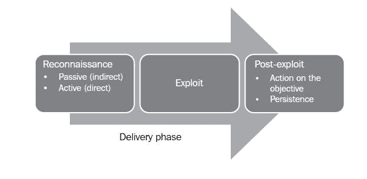

# 零、序言

本书致力于使用 Kali Linux 对网络进行渗透测试。渗透测试模拟恶意外部人员或内部人员对网络或系统的攻击。与漏洞评估不同，渗透测试旨在包括攻击阶段。因此，它证明该漏洞是存在的，并且如果不采取行动，它会伴随着被破坏的真正风险。

### 注

在本书中，我们将交替提及“渗透测试人员”、“攻击者”和“黑客”，因为他们使用相同的技术和工具来评估网络和数据系统的安全性。它们之间唯一的区别是它们的最终目标——安全的数据网络，或者数据泄露。

大多数测试人员和攻击者遵循一种非正式的、开源的或专有定义的测试方法，以指导测试过程。遵循一种方法有某些优点：

*   方法确定了测试过程中可以自动化的部分（例如，测试人员可能总是使用 ping 扫描来确定潜在目标；因此，可以编写脚本），从而允许测试人员专注于发现和利用漏洞的创新技术
*   结果是可重复的，允许它们随着时间的推移进行比较，或者交叉验证一个测试人员的结果与另一个测试人员的结果，或者确定目标的安全性随着时间的推移有何改善（或者没有改善！）
*   定义的方法在时间和人员需求方面是可预测的，允许控制和最小化成本
*   客户预先批准的方法可在网络或数据受到任何损坏时保护测试人员免于承担责任

正式方法包括以下众所周知的例子：

*   **Kevin Orrey 的渗透测试框架**：该方法引导测试人员完成渗透测试的顺序步骤，提供工具和相关命令的超链接。更多信息请访问[www.vulnerabilityassessment.co.uk](http://www.vulnerabilityassessment.co.uk)。
*   **信息系统安全评估框架（ISSAF）**：本综合指南旨在成为测试网络的单一来源。更多信息请访问[www.oissg.org](http://www.oissg.org)。
*   **NIST SP 800-115，《信息安全测试与评估技术指南》**：写于 2008 年，四步法有些过时。然而，它确实提供了渗透测试基本步骤的良好概述。您可以在[获取更多信息 http://csrc.nist.gov/publications/nistpubs/800-115/SP800-115.pdf](http://csrc.nist.gov/publications/nistpubs/800-115/SP800-115.pdf) 。
*   **开源安全测试方法手册（OSSTMM）**：这是较旧的方法之一，最新版本试图量化已识别的风险。更多详情请访问[www.osstmm.org](http://www.osstmm.org)。
*   **开放式 Web 应用安全项目（OWASP）**：重点关注基于 Web 的应用中最常见的 10 个漏洞。更多信息请访问[www.owasp.org](http://www.owasp.org)。
*   **渗透测试执行标准（PTES）**：积极维护，该方法完整准确地反映了恶意人员的活动。更多信息请访问[www.pentest-standard.org](http://www.pentest-standard.org)。
*   **攻击性（Web）测试框架（OWTF）**：2012 年推出，这是将 OWASP 方法与更完整、更严格的 PTES 方法相结合的一个非常有希望的方向。更多详情请参见[https://github.com/7a/owtf](https://github.com/7a/owtf) 。

不幸的是，使用结构化方法会在测试过程中引入弱点：

*   方法很少考虑为什么 T1 是进行渗透测试，或者哪些数据对企业至关重要，需要被保护。如果没有这一至关重要的第一步，渗透测试就会失去重点。
*   许多渗透测试人员不愿意遵循定义的方法，担心这会妨碍他们利用网络的创造力。
*   渗透测试无法反映恶意攻击者的实际活动。通常，客户机希望查看您是否可以获得对特定系统的管理访问（“您可以为该框设置根目录吗？”）。但是，攻击者可能专注于以不需要 root 访问或导致拒绝服务的方式复制关键数据。

为了解决正式测试方法固有的局限性，必须将它们集成到一个框架中，该框架从攻击者“杀死链”的角度查看网络

# 渗透测试的“压井链”方法

2009 年，洛克希德·马丁 CERT 公司的迈克·克洛佩特（Mike Cloppert）引入了现在被称为“攻击者杀伤链”的概念。这包括对手在攻击网络时采取的步骤。它并不总是以线性流进行，因为某些步骤可能并行发生。随着时间的推移，可能会在同一目标上发起多个攻击，并且可能同时发生重叠阶段。

在本书中，我们修改了 Cloppert 的杀伤链，以更准确地反映攻击者在利用网络和数据服务时如何应用这些步骤。下图显示了攻击者的典型杀伤链：



攻击者的典型杀伤链可描述如下：

*   **侦察阶段**——大多数军事组织采用的格言“侦察时间绝不浪费时间”承认，最好在与敌人交战前尽可能多地了解敌人。出于同样的原因，攻击者将在攻击前对目标进行广泛的侦察。事实上，据估计，渗透测试或攻击的“工作量”中至少有 70%用于进行侦察！通常，他们将采用两种侦察方式：

    *   **被动侦察**——这不会以敌对方式直接与目标互动。例如，攻击者将查看公开可用的网站，评估在线媒体（尤其是社交媒体网站），并尝试确定目标的“攻击面”。

        一项特殊任务是生成过去和当前员工姓名的列表。这些名字将构成暴力或猜测密码的基础。它们还将用于社会工程攻击。

        这种类型的侦察即使不是不可能，也很难与普通用户的行为区分开来。

    *   **主动侦察**——目标可以检测到这一点，但很难区分大多数在线组织的面孔和常规背景。

        主动侦察期间发生的活动包括对目标场所的物理访问、端口扫描和远程漏洞扫描。

*   **交付阶段**-交付是选择和利用用于在攻击期间完成攻击的武器。选择的确切武器将取决于攻击者的意图以及交付路线（例如，通过网络、无线或基于 web 的服务）。交付阶段的影响将在本书的下半部分进行检查。
*   **攻击或妥协阶段**-这是成功应用特定攻击的时间点，允许攻击者达到其目标。该危害可能发生在单个阶段（例如，使用缓冲区溢出攻击了已知的操作系统漏洞），也可能是多阶段危害（例如，一名攻击者通过物理方式访问办公场所，窃取公司电话簿。该名称用于创建针对门户登录的暴力攻击列表。此外，还向所有员工发送电子邮件，以单击嵌入链接下载危害其计算机的特制 PDF 文件。）。当恶意攻击者以特定企业为目标时，通常会进行多阶段攻击。
*   **Post exploit: action on the objective** – This is frequently, and incorrectly, referred to as the "exfiltration phase" because there is a focus on perceiving attacks solely as a route to steal sensitive data (such as login information, personal information, and financial information); it is common for an attacker to have a different objective. For example, a business may wish to cause a denial of service in their competitor's network to drive customers to their own website. Therefore, this phase must focus on the many possible actions of an attacker.

    当攻击者试图将其访问权限提高到尽可能高的级别（垂直升级）并危害尽可能多的帐户（水平升级）时，就会发生最常见的攻击活动之一。

*   **攻击后：持久性**-如果破坏网络或系统有价值，那么如果存在持久性访问，该价值可能会增加。这使得攻击者能够与受损系统保持通信。从防守者的角度来看，这是杀伤链中通常最容易发现的部分。

杀伤链是攻击者试图破坏网络或特定数据系统时行为的元模型。作为元模型，它可以包含任何专有或商业渗透测试方法。然而，与这些方法不同的是，它确保了战略层面的重点关注攻击者如何接近网络。对攻击者活动的关注将指导本书的布局和内容。

# 这本书涵盖的内容

这本书分为两部分。在[第 1 部分](sec1.html "Part 1. The Attacker's Kill Chain")*攻击者的杀伤链*中，我们将遵循杀伤链的步骤，详细分析每个阶段。在[第 2 部分](sec2.html "Part 2. The Delivery Phase")*交付阶段*中，我们将重点介绍交付阶段和一些可用的方法，以了解攻击是如何发生的，以及如何利用这些知识保护网络。

[第一章](01.html "Chapter 1. Starting with Kali Linux")*从 Kali Linux*开始，向读者介绍 Kali Linux 的基本原理，以及支持渗透测试的最佳配置。

[第 2 章](02.html "Chapter 2. Identifying the Target – Passive Reconnaissance")*识别目标-被动侦察*提供了如何使用公开来源收集目标信息的背景知识，以及可以简化侦察和信息管理的工具。

[第 3 章](03.html "Chapter 3. Active Reconnaissance and Vulnerability Scanning")、*主动侦察和漏洞扫描*、*向读者介绍了可用于获取目标信息的秘密方法，特别是识别可被利用漏洞的信息。*

 *[第 4 章](04.html "Chapter 4. Exploit")*漏洞*演示了可用于发现和执行允许系统受到攻击者危害的漏洞的方法。

[第 5 章](05.html "Chapter 5. Post Exploit – Action on the Objective")、*攻击后-针对目标*、*采取的行动描述了攻击者如何提升其权限以实现其危害系统的目标，包括窃取数据、更改数据、发起额外攻击或创建拒绝服务。*

 *[第 6 章](06.html "Chapter 6. Post Exploit – Persistence")、*攻击后-持久性*、*提供了如何配置受损系统的背景信息，以便攻击者可以随意返回并继续攻击后活动。*

 *[第 7 章](07.html "Chapter 7. Physical Attacks and Social Engineering")*物理攻击和社会工程*演示了为什么能够物理访问系统或与管理系统的人交互是最成功的利用途径。

[第 8 章](08.html "Chapter 8. Exploiting Wireless Communications")*利用无线通信*演示了如何利用公共无线连接访问数据网络和隔离系统。

[第 9 章](09.html "Chapter 9. Reconnaissance and Exploitation of Web-based Applications")*对基于 Web 的应用的侦察和利用*简要概述了最复杂的安全交付阶段之一：公开于公共互联网的基于 Web 的应用。

[第 10 章](10.html "Chapter 10. Exploiting Remote Access Communications")*利用远程访问通信*提供了一条越来越重要的进入系统的路径，因为越来越多的组织采用分布式和在家办公模式，这些模式依赖于自身易受攻击的远程访问通信。

[第 11 章](11.html "Chapter 11. Client-side Exploitation")*客户端攻击*的重点是针对终端用户系统上的应用的攻击，这些应用的保护程度通常与组织的主网络不同。

[附录](12.html "Appendix A. Installing Kali Linux")*安装 Kali Linux*概述了如何安装 Kali Linux，以及如何使用全磁盘加密来避免截获机密测试数据。***  **# 这本书你需要什么

为了练习本书中介绍的内容，您需要虚拟化工具，如 VMware 或 VirtualBox。

您需要下载并配置 Kali Linux 操作系统及其工具套件。为了确保它是最新的，并且您拥有所有的工具，您需要访问 Internet 连接。

遗憾的是，并不是 Kali Linux 系统上的所有工具都会得到解决，因为它们太多了。本书的重点不是让读者了解所有的工具和选项，而是提供一种测试方法，让他们有机会学习和使用新的工具，因为他们的经验和知识会随着时间的推移而变化。

尽管本书中的大多数示例都集中在 MicrosoftWindows 上，但该方法和大多数工具都可以移植到其他操作系统，如 Linux 和其他风格的 Unix。

最后，本书应用 Kali 来完成攻击者对目标系统的杀伤链。您将需要一个目标操作系统。本书中的许多示例都使用 Microsoft Windows XP。尽管它在 2014 年 4 月被弃用，但它为许多工具提供了标准行为的“基线”。如果您知道如何将该方法应用于一个操作系统，则可以将其应用于较新的操作系统，如 Windows 7 和 Windows 8。

# 这本书是给谁的

这本书是为那些想更多地了解数据安全的人准备的。特别是，它针对的是那些想了解*为什么在使用某个特定工具时使用该工具的人，而不是那些向系统投掷尽可能多的工具以查看是否会发生漏洞利用的人。我的目标是让读者利用他们自己的方法和途径来进行有效的渗透测试，这将使他们能够在进步的过程中进行实验和学习。我相信，这种方法是了解恶意人员如何攻击数据系统的唯一有效方法，因此也是了解如何在漏洞被利用之前调解漏洞的唯一方法。*

如果您是一名安全专业人员、渗透测试人员，或者只是对复杂数据环境的安全感兴趣，那么本书适合您。

# 公约

在这本书中，你会发现许多不同类型的文本可以区分不同类型的信息。下面是这些风格的一些例子，并解释了它们的含义。

文本中的代码字、数据库表名、文件夹名、文件名、文件扩展名、路径名、虚拟 URL、用户输入和 Twitter 句柄如下所示：“在这种特殊情况下，已为 VM 分配了一个 IP 地址`192.168.204.132`

代码块设置如下：

```
# MSF port scanner
onhost_add {
  println("[*] MSF Port Scanner New Host OpenPorts on$1");
  $console = console();
  cmd($console, "use auxiliary/scanner/portscan/tcp");
  cmd($console, "set THREADS 12");
  cmd($console, "set PORTS 139, 143");
  # enter other ports as required
  cmd($console, "set RHOSTS $1");
  cmd($console, "run -j");
  cmd($console, "use auxiliary/scanner/discovery/udp_sweep");
  cmd($console, "set THREADS 12");
  cmd($console, "set BATCHSIZE 256");
  cmd($console, "set RHOSTS $1");
  cmd($console, "run -j");
  db_sync(); 
}
```

任何命令行输入或输出的编写方式如下：

```
root@kali~# update-rc.d networking defaults

```

**新术语**和**重要词语**以粗体显示。例如，您在屏幕上、菜单或对话框中看到的文字会出现在如下文本中：“如果双击**truecrypt1**图标，您将进入**文件浏览器**视图。”

### 注

警告或重要注释显示在这样的框中。

### 提示

提示和技巧如下所示。

# 读者反馈

我们欢迎读者的反馈。让我们知道你对这本书的看法你喜欢或可能不喜欢什么。读者反馈对于我们利用您真正从中获益最多的标题非常重要。

要向我们发送一般反馈，只需向`<[feedback@packtpub.com](mailto:feedback@packtpub.com)>`发送电子邮件，并通过邮件主题提及书名即可。

如果您对某个主题有专业知识，并且您有兴趣撰写或贡献一本书，请参阅我们的作者指南，网址为[www.packtpub.com/authors](http://www.packtpub.com/authors)。

# 客户支持

既然您是一本 Packt 图书的骄傲拥有者，我们有很多东西可以帮助您从购买中获得最大收益。

## 勘误表

虽然我们已尽一切努力确保内容的准确性，但错误确实会发生。如果您在我们的一本书中发现错误，可能是文本或代码中的错误，如果您能向我们报告，我们将不胜感激。通过这样做，您可以使其他读者免于沮丧，并帮助我们改进本书的后续版本。如果您发现任何错误，请访问[进行报告 http://www.packtpub.com/submit-errata](http://www.packtpub.com/submit-errata) ，选择您的书籍，点击**勘误表提交表**链接，输入您勘误表的详细信息。一旦您的勘误表得到验证，您的提交将被接受，勘误表将上传到我们的网站上，或添加到该标题勘误表部分的任何现有勘误表列表中。通过从[中选择您的标题，可以查看任何现有勘误表 http://www.packtpub.com/support](http://www.packtpub.com/support) 。

## 盗版

在互联网上盗版版权材料是所有媒体的一个持续问题。在 Packt，我们非常重视版权和许可证的保护。如果您在互联网上发现我们作品的任何形式的非法复制品，请立即向我们提供地址或网站名称，以便我们采取补救措施。

请致电`<[copyright@packtpub.com](mailto:copyright@packtpub.com)>`与我们联系，并提供可疑盗版材料的链接。

我们感谢您在保护我们的作者方面的帮助，以及我们为您带来有价值内容的能力。

## 问题

如果您对本书的任何方面有疑问，请致电`<[questions@packtpub.com](mailto:questions@packtpub.com)>`与我们联系，我们将尽力解决。

# 免责声明

本书内容仅供教育之用。它旨在帮助用户针对信息安全威胁测试自己的系统，并保护其 It 基础设施免受类似攻击。Packt Publishing 和本书作者对因不当使用本书所含学习材料而导致的行为不承担任何责任。**