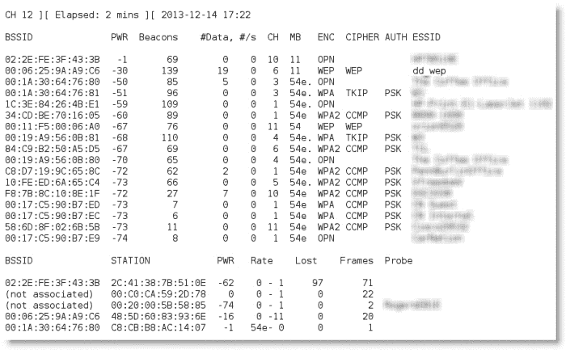
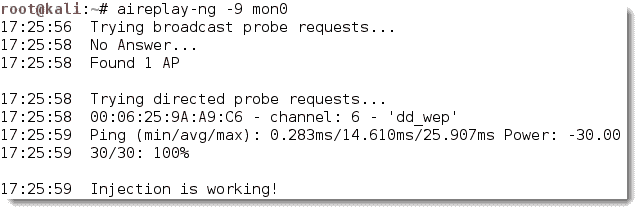
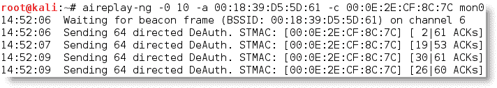
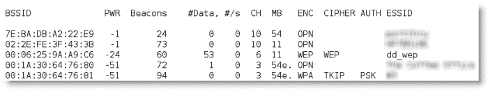
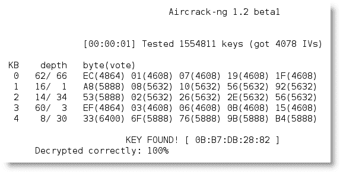
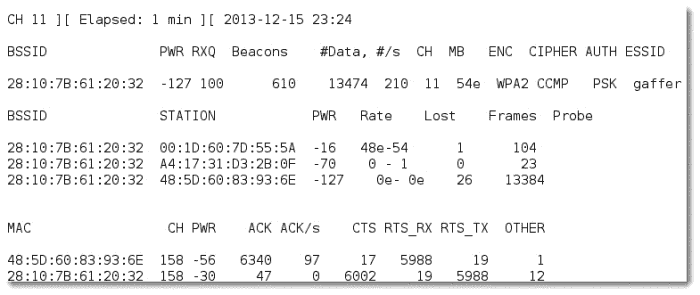
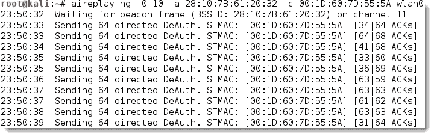
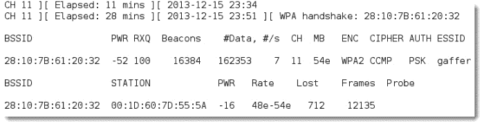
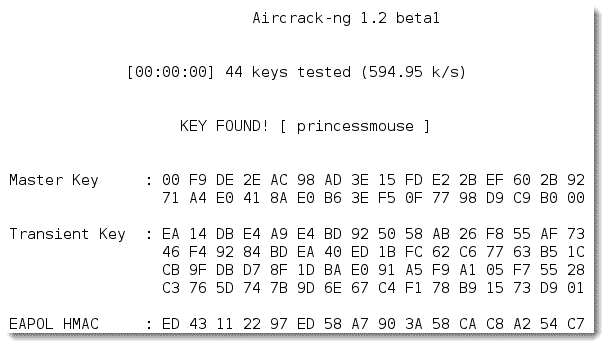
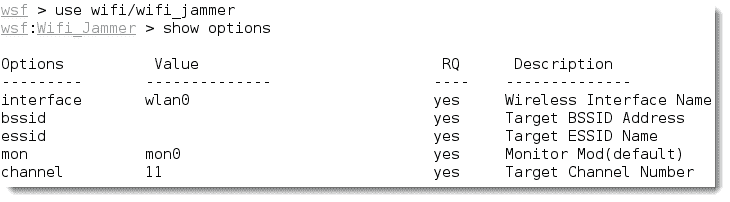

# 第八章，利用无线通信

随着移动设备的主导地位和提供即时网络连接的需求，无线网络已成为互联网无处不在的接入点。不幸的是，无线接入的便利性伴随着导致访问和数据被盗以及网络资源拒绝服务的有效攻击的增加。Kali 提供了几种工具来配置和发起这些无线攻击，从而使组织能够提高安全性。

在本章中，我们将研究几个内务管理任务和无线攻击，包括：

*   为无线攻击配置 Kali
*   无线侦察
*   绕过 MAC 地址认证
*   折衷 WEP 加密
*   攻击 WPA 和 WPA2
*   无线攻击和社会工程克隆接入点
*   拦截通信中间人无线攻击
*   中间人无线攻击
*   针对无线通信的**拒绝服务**（**DoS**攻击

# 配置 Kali 进行无线攻击

Kali Linux 发布时附带多种工具，方便无线网络测试；但是，这些攻击需要广泛的配置才能完全有效。此外，测试人员在实施攻击或审计无线网络之前，应具备强大的无线网络背景。

无线安全测试中最重要的工具是无线适配器，它连接到无线接入点。必须支持所使用的工具，尤其是`aircrack-ng`工具套件；特别是，卡的芯片组和驱动程序必须具备将无线数据包注入通信流的能力。这是要求将特定数据包类型注入目标和受害者之间的通信流的攻击的要求。注入的数据包可能导致拒绝服务，从而允许攻击者捕获破解加密密钥或支持其他无线攻击所需的握手数据。

`aircrack-ng`站点（[www.airrack-ng.org](http://www.aircrack-ng.org)包含已知兼容无线适配器的列表。

可与 Kali 一起使用的最可靠的适配器是 ALFA 网卡，尤其是支持无线 802.11b、g 和 n 协议的**AWUS036NH**适配器。Alfa 卡可在线随时获取，并将支持使用 Kali 交付的所有测试和攻击。

# 无线侦察

进行无线攻击的第一步是进行侦察，这可以识别准确的目标接入点，并突出显示可能影响测试的其他无线网络。

如果您使用 USB 连接的无线卡连接到 Kali 虚拟机，请单击 USB 连接图标，确保 USB 连接已从主机操作系统断开，并已连接到虚拟机，该图标由以下屏幕截图中的箭头指示：


接下来，通过从命令行运行`iwconfig`来确定哪些无线接口可用，如下面的屏幕截图所示：


对于某些攻击，您可能希望增加适配器的功率输出。如果您与合法的无线接入点处于同一位置，并且您希望目标连接到您控制下的虚假接入点，而不是合法接入点，这一点尤其有用。这些虚假或**流氓**访问点允许攻击者拦截数据，并根据需要查看或更改数据以支持攻击。攻击者经常复制或克隆合法的无线站点，然后与合法站点相比增加其传输功率，以此吸引受害者。要增加功率，请使用以下命令：

```
kali@linux:~# iwconfig wlan0 txpower 30

```

许多攻击将使用`aircrack-ng`及其相关工具进行。首先，我们需要能够拦截或监控无线传输；因此，我们需要使用`airmon-ng`命令将具有无线功能的 Kali 通信接口设置为*监控模式*：

```
kali@linux:~# airmon-ng start wlan0

```

上一个命令的执行如以下屏幕截图所示：


请注意，返回的说明表明存在*可能导致*故障的某些进程。处理这些过程的最有效方法是使用全面的 kill 命令，如下所示：

```
root@kali:~# airmon-ng check kill

```

要查看本地无线环境，请使用以下命令：

```
root@kali:~# airodump-ng mon0

```

前面的命令列出了在该特定时间点可在无线适配器范围内找到的所有已识别网络。它提供由 MAC 地址标识的网络上无线节点的 BSSID、相对输出功率指示、发送的数据包信息、包括所用信道的带宽信息、数据、所用加密信息以及提供无线网络名称的 ESSID。此信息显示在以下屏幕截图中；非必要的 ESID 已模糊：



`airodump`命令在可用的无线信道中循环并识别以下内容：

*   **基本业务集标识符**（**BSSID**），是标识无线接入点或路由器的唯一 MAC 地址。
*   每个网络的`PWR`或功率。虽然`airodump-ng`错误地将功率显示为负值，但这是一个报告伪品。要获得正确的正值，请访问终端并运行`airdriver-ng unload 36`，然后运行`airdriver-ng load 35`。
*   `CH`显示用于广播的频道。
*   `ENC`显示正在使用的加密，如果未使用加密，则为`OPN`或打开；如果正在使用加密，则为`WEP`或`WPA`/`WPA2`。`CIPHER`和`AUTH`提供额外的加密信息。
*   **扩展服务集标识符**（**ESSID**是由共享相同 SSID 或名称的接入点组成的无线网络的通用名称。

在终端窗口的下半部分，您将看到尝试连接或已连接到无线网络的站点。

在我们能够与这些（潜在的）目标网络进行交互之前，我们必须确认我们的无线适配器能够进行数据包注入。要执行此操作，请从终端外壳程序提示符运行以下命令：

```
root@kali:~# aireplay-ng -9 mon0

```

下面的屏幕截图显示了上一个命令的执行情况。此处`-9`表示注射试验。



## 基斯米特

无线侦察的最重要工具之一是 Kismet，一种 802.11 无线探测器、嗅探器和入侵检测系统。

Kismet 可用于收集以下信息：

*   无线网络的名称，ESSID
*   无线网络的信道
*   接入点的 MAC 地址，BSSID
*   无线客户端的 MAC 地址

它还可用于嗅探来自 802.11a、802.11b、802.11g 和 802.11n 无线通信的数据。Kismet 还支持允许它嗅探其他无线协议的插件。

要启动 Kismet，在终端窗口的命令提示符下输入`kismet`。

当 Kismet 启动时，您将面临一系列问题，这些问题将允许您在启动过程中对其进行配置。以**是**回应**是否可以看到颜色**，接受**Kismet 正在以 root**身份运行，选择**是**启动 Kismet 服务器。在 Kismet 启动选项中，取消选中**显示控制台**，因为它会遮挡屏幕。允许 Kismet 启动。

系统将提示您添加捕获界面；通常会选择`wlan0`。

Kismet 随后将开始嗅探数据包，并收集位于邻近物理区域的所有无线系统的信息。


通过双击选择网络，您将进入网络视图，该视图提供有关无线网络的其他信息。

您还可以向下搜索以确定连接到各种无线网络的特定客户端。

使用 Kismet 作为初始侦察工具来发起某些特定攻击（如嗅探传输的数据）或识别网络。因为它被动地收集连接数据，所以它是识别隐藏网络的极好工具，特别是当 SSID 未被公开传输时。

# 绕过隐藏的服务集标识符

ESSID 是唯一标识无线局域网的字符序列。隐藏 ESSID 是试图通过模糊性实现*安全性的糟糕方法；不幸的是，ESSID 可通过以下方式获得：*

*   嗅探无线环境并等待客户端与网络关联，然后捕获该关联
*   主动取消对客户端的身份验证以强制客户端关联，然后捕获该关联

`aircrack`工具特别适合于捕获解开隐藏的 ESSID 所需的数据，如以下步骤所示：

1.  在命令提示下，输入以下命令确认攻击系统已启用无线：

    ```
    root@kali:~# airmon-ng

    ```

2.  接下来，使用以下`ifconfig`命令查看可用接口并确定您的无线系统使用的确切名称：

    ```
    root@kali:~# ifconfig

    ```

3.  通过输入以下内容启用您的无线接口（您可能需要将`wlan0`替换为上一步中标识的可用无线接口）：

    ```
    root@kali:~# airmon-ng start wlan0

    ```

4.  If you reconfirm with `ifconfig`, you will see that there is now a monitoring or `mon0` address in use. Now, use `airodump` to confirm the available wireless networks, as given in the following command:

    ```
    root@kali:~# airodump-ng mon0

    ```

    

如您所见，第一个网络的 ESSID 仅标识为`<length: 9>`。未使用其他名称或名称。隐藏的 ESSID 的长度被确定为由九个字符组成；但是，该值可能不正确，因为 ESSID 是隐藏的。实际的 ESSID 长度可能短于或长于 9 个字符。

重要的是，可能存在连接到此特定网络的客户端。如果客户端存在，我们将取消对客户端的身份验证，迫使它们在重新连接到接入点时发送 ESSID。

重新运行`airodump`，过滤掉除目标接入点以外的所有内容。在这种特殊情况下，我们将重点使用以下命令从通道 6 上的隐藏网络收集数据：

```
root@kali:~# airodump-ng -c 6 mon0

```

执行该命令将删除多个无线源的输出，并允许攻击者将注意力集中在目标 ESSID 上，如以下屏幕截图所示：


我们在执行`airodump`命令时获得的数据表明，有一个站点（`00:0E:2E:CF:8C:7C`）连接到 BSSID（`00:18:39:D5:5D:61`），而 BSSID 又与隐藏的 ESSID 相关联。

为了在传输时捕获 ESSID，我们必须创建一个条件，我们知道它将在客户端和接入点之间连接的初始阶段被发送。

因此，我们将对客户端和接入点发起反身份验证攻击，方法是发送数据包流，中断它们之间的连接并强制它们重新身份验证。

要发起攻击，请打开一个新的命令 shell，输入如下屏幕截图所示的命令（`0`表示我们正在发起反验证攻击，`10`表示我们将发送 10 个反验证数据包，`-a`为目标接入点，`c`为客户端 MAC 地址）：



发送完所有的反身份验证数据包后，返回到监视通道 6 上的网络连接的原始窗口，如下面的屏幕截图所示。现在，您将在 clear 中看到 ESSID。


知道 ESSID 有助于攻击者确认他们关注的是正确的网络（因为大多数 ESSID 都基于公司身份），并有助于登录过程。

# 绕过 MAC 地址认证

**媒体访问控制**（**MAC**地址唯一标识网络中的每个节点。它采用六对十六进制数字（0 到 9 和字母 A 到 F）的形式，由冒号或破折号分隔，通常如下所示：`00:50:56:C0:00:01`。

MAC 地址通常与网络适配器或具有联网能力的设备相关联；由于这个原因，它经常被称为物理地址。

MAC 地址中的前三对数字称为**组织唯一标识符**，用于识别制造或销售设备的公司。最后三对数字是特定于设备的，可以认为是一个*序列号*。

因为 MAC 地址是唯一的，所以可以使用它将用户与特定网络，特别是无线网络相关联。这有两个重要的含义：它可以用来识别试图访问网络的黑客或合法的网络测试人员，也可以用作身份验证个人并允许他们访问网络的手段。

在渗透测试期间，测试人员可能更愿意对网络匿名。支持此匿名配置文件的一种方法是更改攻击系统的 MAC 地址。

这可以使用`ifconfig`命令手动完成。要确定现有 MAC 地址，请从命令行运行以下命令：

```
root@kali:~# ifconfig wlan0 down
root@kali:~# ifconfig wlan0 | grep HW

```

要手动更改 IP 地址，请使用以下命令：

```
root@kali:~# ifconfig wlan0 hw ether 38:33:15:xx:xx:xx
root@kali:~# ifconfig wlan0 up

```

用不同的十六进制对替换“xx”表达式。此命令将允许我们将攻击系统的 MAC 地址更改为受害者网络接受的 MAC 地址。攻击者必须确保网络上没有使用 MAC 地址，否则如果网络受到监视，重复的 MAC 地址可能会触发警报。

### 注

在更改 MAC 地址之前，必须关闭无线接口。

Kali 还允许使用自动化工具`macchanger`。要将攻击者的 MAC 地址更改为同一供应商生产的产品的 MAC 地址，请在终端窗口中使用以下`macchanger`命令：

```
root@kali:~# macchanger wlan0 -e

```

要将现有 MAC 地址更改为完全随机的 MAC 地址，请使用以下命令：

```
root@kali:~# macchanger wlan0 -r

```


一些攻击者在测试期间使用自动脚本频繁更改其 MAC 地址，以匿名化其活动。

许多组织，特别是大型学术团体，如学院和大学，使用 MAC 地址过滤来控制谁可以访问其无线网络资源。MAC 地址过滤使用网卡上唯一的 MAC 地址来控制对网络资源的访问；在典型配置中，组织维护允许访问网络的 MAC 地址的**白名单**。如果传入 MAC 地址不在已批准的访问列表中，则会限制其连接到网络。

不幸的是，MAC 地址信息以明文形式传输。攻击者可以使用`airodump`收集接受的 MAC 地址列表，然后手动将其 MAC 地址更改为目标网络接受的地址之一。因此，这种类型的过滤几乎不能为无线网络提供真正的保护。

下一级无线网络保护是使用加密提供的。

# 危及 WEP 加密

**无线等效隐私**（**WEP**）起源于于 1999 年，作为一种为 802.11 无线网络提供一定程度保密性的手段，与有线网络上可用的保密性相当。在其加密实施过程中，迅速发现了多个缺陷，到 2004 年，它被**WiFi 保护接入**（**WPA**协议）取代。

### 注

WEP 至今仍在使用，尤其是在不能满足新无线路由器资源需求的旧网络中。在最近对一个主要城市中心的无线调查中，近 25%的加密无线网络继续使用 WEP。其中许多网络与金融公司有关。

WEP 的一个主要缺陷首先是在重用**初始化载体**（**IV**）中发现的。WEP 依赖于 RC4 加密算法，这是一种流密码，相同的加密密钥不能重复。IVs 通过在加密数据中引入*随机性*元素来防止密钥重用。不幸的是，24 位 IV 太短，无法防止重复；此外，在仅传输 5000 个数据包之后，相同的 IV 重复的概率为 50%。

攻击者可以窃听或拦截 WEP 加密的流量。根据可供检查的截获数据包的数量，密钥恢复可以快速进行。实际上，大多数 WEP 密钥可以在三分钟内恢复，或者*破解*。

要使 WEP 破解工作正常进行，您还需要了解有关目标的以下信息：

*   无线网络或 ESSID 的名称
*   接入点的 MAC 地址，BSSID
*   使用的无线信道
*   无线客户端的 MAC 地址

对 WEP 最常见的攻击可通过执行以下步骤完成：

1.  首先使用以下命令识别可用的无线网络接口：

    ```
    root@kali:~# airmon-ng

    ```

2.  Stop the interface to change the MAC address to the address that is being used by an existing client already associated with the target network. You can also use `macchanger` for this step. When the MAC address has been changed, restart `airmon-ng`. Use the following commands to perform these steps:

    ```
    root@kali:~# airmon-ng stop
    root@kali:~# ifconfig wlan0 down
    root@kali:~# ifconfig wlan0 hw ether (mac address)
    root@kali:~# airmon-ng start wlan0

    ```

    使用已知且可接受的 MAC 地址可以简化攻击。然而，情况并非总是如此。此攻击假设您不知道 MAC 地址。相反，我们将与网络建立虚假的联系。

3.  Use the following `airodump` command to locate the target wireless network:

    ```
    root@kali:~# airodump-ng wlan0

    ```

    当`airodump`找到目标后，按*Ctrl*+*C*停止搜索。复制 BSSID 中的 MAC 地址，并记录通道。当`airodump`找到目标后，按*Ctrl*+*C*停止搜索。复制 BSSID 中的 MAC 地址，并记录通道；在下面的屏幕截图所示的示例中，目标网络`dd_wep`在第六频道上以 11MB 的速度运行。

    

4.  启动`airodump-ng`嗅探无线流量并使用以下命令收集 IVs，其中`--bssid`允许我们选择目标的 BSSID，`-c`表示信道，`-w`允许我们写入输出文件的名称（`wep_out`）：

    ```
    root@kali:~# airodump-ng --bssid 00:06:25:9A:A9:C6 -c 6 -w
      wep_out wlan0 

    ```

5.  Now we have to increase the number of transmitted IV packets. Open a second terminal window (do not close the first) and enter the following command to fake an authentication to the targeted wireless access point:

    ```
    root@kali:~# aireplay-ng -1 0 -a 00:06:25:9A:A9:C6 -h 
      00:11:22:33:44:55 -e dd_wep wlan0 

    ```

    此处，`-1`表示假身份验证，`0`表示以秒为单位的重新关联时间（设置`0`可能会提醒防御者，因此攻击者可能会将其设置为 30 或更高）。

6.  With the fake authentication in place, we will generate traffic that appears to come from a trusted MAC address and route it to the target wireless access point.

    ```
    root@kali:~# aireplay-ng -3  -b 00:06:25:9A:A9:C6 -h 
      00:11:22:33:44:55 wlan0 

    ```

    这种攻击称为 ARP 注入或 ARP 重放攻击。通常，目标接入点将重播 ARP 分组，并每次生成一个新的 IV；因此，这是培养必要静脉的快速方法。

    上一个命令的执行如以下屏幕截图所示：

    

7.  Let's generate some additional packets while the ARP injection continues. Open another terminal window, and start an interactive packet replay attack by entering the following command:

    ```
    root@kali:~# aireplay-ng -2 -p 0841 -c FF:FF:FF:FF:FF:FF 
      - b (mac address) -h (mac address) wlan0 

    ```

    这里，`-2`表示我们正在使用交互重放攻击，`-p 0841`设置数据包的帧控制字段，使其看起来像是从无线客户端发送的，`-c FF:FF:FF:FF:FF:FF`设置目的地（在这种情况下，`FF`符号将数据包发送到网络上的所有主机），`-b`是 BSSID 的 MAC 地址，`-h`是正在传输的数据包的 MAC 地址，应与测试仪的 MAC 地址匹配。

    上一个命令的执行如以下屏幕截图所示：

    

8.  另一种使网络显得繁忙的技术是在攻击系统上打开多个命令外壳，并输入以下命令，用目标的 IP 地址替换（`IP address`）：

    ```
    root@kali:~# ping -T -L 6500 (IP address)

    ```

9.  在收集并保存足够的数据包后，可以使用以下`aircrack-ng`命令破解 WEP 密钥，`-a 1`强制攻击模式为静态 WEP，`-b`为 BSSID，`dd_wep.cap`为包含捕获的 IVs 的捕获文件。

    ```
    root@kali:~# aircrack-ng -a 1 -b 00:06:25:9A:A9:C6 -n 64 
      dd_wep.cap 

    ```

正如您在下面的屏幕截图中所看到的，攻击成功，密钥已被识别。（尽管它显示为十六进制数字，但您只需输入它即可登录到 WEP 网络。）



尽管本演示的重点是 64 位密钥，但一旦您从接入点获取 IVs，较长的密钥并不需要更多的时间来破解。

`aircrack-ng`工具套件是“黄金标准”，提供最可靠、最有效的访问方式。然而，Kali 还附带了一些其他工具，可以帮助您破坏加密的无线网络。

其中之一是 Fern WiFi Cracker，它是一个包含了`aircrack-ng`的 Python GUI。它可以自动扫描无线网络并识别 WEP、WPA 和 WPA2 网络。一旦识别出网络，攻击者可以利用以下几个功能：

*   WEP 破解使用多种攻击，包括碎片、切碎、咖啡拿铁、Hirte、ARP 请求重播或 WPS 攻击
*   使用字典或基于 WPS 的攻击进行 WPA 和 WPA2 破解
*   成功破解后在数据库中自动保存密钥
*   内部中间人引擎支持会话劫持
*   针对 HTTP、HTTPS、Telnet 和 FTP 的暴力攻击

Fern 的界面非常干净，安装程序指导用户选择界面并扫描接入点。它将报告 WEP 和 WPA/WPA2 的接入点；从这一点开始，只需单击相应的按钮即可发起攻击。Fern 的初始启动屏幕如以下屏幕截图所示：


尽管 Fern 是一个优秀的工具，但如果无法识别密钥或访问网络，大多数测试人员并不完全依赖 Fern，此故障的原因可能隐藏在 GUI 后面，使得故障排除变得困难。

类似的应用程序是 Wifite wireless auditor，它提供了一个支持测试的基于文本的界面。经证明，它在现场测试期间非常有效，并利用了以下功能：

*   Wifite 通过在攻击前将攻击者的 MAC 地址更改为随机 MAC 地址，然后在所有攻击完成后将其更改回，从而支持匿名性
*   它根据信号强度（以 dB 为单位）对目标进行分类，首先破解最近的接入点
*   它会自动取消对隐藏网络的客户端的身份验证，以显示 SSID
*   它支持多种攻击类型

在下面的屏幕截图所示的示例中，选择了单个目标`dd_wep`进行攻击。不需要与应用程序进行其他交互；它完成了完整的妥协，并将破解的密钥保存到数据库中。


尽管不推荐使用的 WEP 的漏洞是众所周知的，并且已经被 Kali 上可用的一些基本工具所证明，但更强大的 WPA 加密协议抵御攻击的能力如何？

# 攻击 WPA 和 WPA2

**WiFi 保护接入****WPA**和**WiFi 保护接入 2****WPA2**是旨在解决 WEP 安全缺陷的无线安全协议。由于 WPA 协议为每个数据包动态生成一个新密钥，因此它们防止了导致 WEP 失败的统计分析。然而，它们容易受到某些攻击技术的攻击。

WPA 和 WPA2 经常使用**预共享密钥****PSK**进行部署，以确保接入点和无线客户端之间的通信安全。PSK 应该是长度至少为 13 个字符的随机密码短语；如果没有，则可以通过将 PSK 与已知字典进行比较，使用蛮力攻击来确定 PSK。这是最常见的攻击。（请注意，如果在企业模式下配置，即使用 RADIUS 身份验证服务器提供身份验证，那么从我们的角度来看，WPA 是“牢不可破的”）

## 暴力袭击

与 WEP 不同，可以通过对大量数据包的统计分析来破解，WPA 解密要求攻击者创建特定的数据包类型，以揭示细节，例如接入点和客户端之间的握手。

要攻击 WPA 传输，应执行以下步骤：

1.  启动无线适配器并使用`ifconfig`命令确保已创建监视器接口。
2.  使用`airodump-ng –wlan0`识别目标网络。
3.  Start capturing traffic between the target access point and the client using the following command:

    ```
    root@kali:~# airodump-ng --bssid 28:10:7B:61:20:32 -c 11 
      --showack -w dd_wpa2 wlan0 

    ```

    设置`-c`以监控特定通道，`--showack`标志确保客户端计算机确认您从无线接入点对其进行反验证的请求，以及`-w`将输出写入文件以便稍后进行字典攻击。此攻击的典型输出如以下屏幕截图所示：

    

4.  Leave this terminal window open, and open a second terminal window to launch a deauthentication attack; this will force a user to reauthenticate to the target access point and re-exchange the WPA key. The deauthentication attack command is shown as follows:

    ```
    root@kali:~# aireplay-ng -0 10 –a 28:10:7B:61:20:32 
      -c 00:1D:60:7D:55:5A wlan0 

    ```

    上一个命令的执行如以下屏幕截图所示：

    

    成功的反身份验证攻击将显示`ACKs`，这表示连接到目标接入点的客户端已确认刚刚发送的反身份验证命令。

5.  Review the original command shell that was kept open to monitor the wireless transmission, and ensure that you capture the 4-way handshake. A successful WPA handshake will be identified in the top-right hand corner of the console . In the following example, the data indicates the WPA handshake value is `28:10:7B:61:20:32`:

    

6.  Use `aircrack` to crack the WPA key using a defined wordlist. The filename defined by the attacker for collecting handshake data will be located in the root directory, and the `-01.cap` extension will be appended to it.

    在 Kali 中，单词列表位于`/usr/share/wordlists`目录中。虽然有几个可用的单词列表，但建议您下载更有效地破解常用密码的列表。

在前面的示例中，密钥已预先放置在密码列表中。根据系统配置，对长而复杂的密码进行字典攻击可能需要几个小时。下面的命令使用`words`作为源字列表。

```
root@kali:~# aircrack-ng wpa-01.cap /usr/share/wordlists

```

以下屏幕截图显示了成功破解 WPA 密钥的结果；测试 44 个密钥后，发现网络管理员的密钥为`princessmouse`。



如果您手头没有自定义密码列表或希望快速生成列表，可以使用 Kali 中的 crunch 应用程序。以下命令指示 crunch 使用给定的字符集创建最小长度为 5 个字符、最大长度为 25 个字符的单词列表：

```
root@kali:~# crunch 0 25
  abcdefghijklmnopqrstuvwxyzABCDEFGHIJKLMNOPQRSTUVWX
  YZ0123456789 | aircrack-ng --bssid (MAC address) 
  -w capture-01.cap 

```

您还可以使用基于 GPU 的密码破解工具（适用于 AMD/ATI 图形卡的 oclHashcat 和适用于 NVIDIA 图形卡的 cudaHashcat）提高暴力攻击的有效性。

要实施此攻击，请首先使用以下命令将 WPA 握手捕获文件`psk-01.cap`转换为 hashcat 文件：

```
root@kali:~# aircrack-ng psk-01.cap -J <output file>

```

转换完成后，使用以下命令针对新捕获文件运行 hashcat（选择与 CPU 架构和图形卡匹配的 hashcat 版本）：

```
root@kali:~# cudaHashcat-plus32.bin -m 2500 <filename>.hccap<wordlist>

```

## 使用 Reaver 攻击无线路由器

WPA 和 WPA2 也容易受到针对接入点受 Wi-Fi 保护的设置、WPS 和 pin 码的攻击。

大多数接入点支持**受 Wi-Fi 保护的设置**（**WPS**）协议，该协议于 2006 年成为标准，允许用户轻松设置和配置接入点，并向现有网络添加新设备，而无需重新输入大型复杂的密码。

不幸的是，pin 是一个 8 位数字（100000000 个可能的猜测），但最后一个数字是一个校验和值。由于 WPS 认证协议将 pin 一分为二并分别验证每一半，这意味着 pin 的前一半有 10 个<sup>4</sup>（10000）值，10 个<sup>3</sup>（1000）第二部分的可能值攻击者最多只需猜 11000 次就可以破坏访问点！

Reaver 是一个旨在最大化猜测过程的工具（尽管 Wifite 也进行 WPS 猜测）。

要启动“掠夺者”攻击，请使用名为`wash`的配套工具来识别以下命令中给出的任何易受攻击的网络：

```
root@kali:~# wash -i wlan0 --ignore-fcs

```

如果存在任何易受攻击的网络，请使用以下命令对其发起攻击：

```
root@kali:~# reaver -i wlan0 -b (BBSID) -vv

```

在卡利测试这一攻击表明，攻击速度缓慢，容易失败；但是，它可以用作背景攻击，也可以补充其他攻击路线，以危害 WPA 网络。

# 克隆接入点

针对无线网络的更有趣的攻击之一是克隆接入点，然后监控用户尝试连接时传输的信息。攻击者不仅可以访问身份验证凭据，还可以利用中间人攻击拦截或重定向网络流量。

Kali 中包含的几个工具声称支持克隆或生成流氓接入点；然而，目前这些工具存在缺陷。例如，社会工程工具包和 Websploit 没有与预先安装在 Kali 中的 DHCP 服务器集成。

大多数攻击者寻找外部工具，包括 Gerix 或 easy creds 等脚本；然而，`aircrack-ng`套件还包括一个工具。`airbase-ng`，用于克隆接入点。

若要创建假无线接入点，攻击者将：

1.  在监控模式下启动`wlan0`，使用以下命令创建`mon0`监控界面：

    ```
    root@kali:~# airmon-ng start wlan0

    ```

2.  使用以下命令在`mon0`上设置接入点（AP）。社会工程可以对 AP 的成功产生重大影响，因此使用一个能够吸引目标客户的名字。在本例中，我们将使用开放式 Wi-Fi 网络的通用名称。将在 WiFi 信道六上建立：

    ```
    root@kali:~# airbase-ng --essid Customer_Network 
      -c 6 mon0 

    ```

3.  使用以下命令安装桥接器实用程序：

    ```
    apt-get install bridge-utils

    ```

4.  In another terminal window, create a bridge (`rogue`) and link `at0` (the `at0` interface is created by the previous command) to `eth0` using the bridge utilities (note that bridge utilities must first be installed using `apt-get install bridge-utils`).

    ```
    root@kali:~# brctl addbr rogue
    root@kali:~# brctl addif rogue at0
    root@kali:~# brctl addif rogue eth0

    ```

    由于这两个接口集成到虚拟网桥中，因此可以使用以下命令释放它们的 IP 地址：

    ```
    root@kali:~# ifconfig at0 down
    root@kali:~# ifconfig at 0.0.0.0 up
    root@kali:~# ifconfig eth0 down
    root@kali:~# ifconfig eth0 0.0.0.0 up

    ```

5.  使用以下命令启用跨网桥的 IP 转发：

    ```
    root@kali:~# echo 1 > /proc/sys/net/ipv4/ip_forward

    ```

6.  使用以下命令将网桥配置为其连接到`eth0`的 LAN 的 IP 地址：

    ```
    root@kali:~# ifconfig rogue 10.1.x.y netmask 255.255.255.0 broadcast 10.1.x.255 up
    root@kali:~# route add default gw 10.1.x.1

    ```

7.  使用以下命令启动 AP 嗅探身份验证握手：

    ```
    airbase-ng -c 6 -e --ESSID /file_path/file.cap wlan0

    ```

# 拒绝服务攻击

我们将评估的针对无线网络的最后一次攻击是拒绝服务攻击，攻击者剥夺合法用户对无线网络的访问权，或导致网络崩溃，从而使网络不可用。无线网络极易受到 DoS 攻击，在分布式无线网络上很难定位攻击者。拒绝服务攻击的例子包括：

*   将精心编制的网络命令（如重新配置命令）注入无线网络会导致路由器、交换机和其他网络设备出现故障。
*   一些设备和应用程序可以识别正在发生的攻击，并通过禁用网络自动响应。恶意攻击者可以发起明显的攻击，然后让目标自己创建 DoS！
*   用大量数据包轰炸无线网络会使其无法使用；例如，向 web 服务器发出数千个页面请求的 HTTP 洪水攻击可能会耗尽其处理能力。同样，用认证和关联数据包淹没网络会阻止用户连接到接入点。
*   攻击者可以制作特定的反身份验证和解除关联命令，这些命令在无线网络中用于关闭授权连接、淹没网络并阻止合法用户保持与无线接入点的连接。

为了演示最后一点，我们将通过使用反身份验证数据包淹没网络来创建拒绝服务攻击。由于无线 802.11 协议的构建是为了在接收到定义的数据包时支持反验证（以便用户可以在不再需要连接时中断连接），因此这可能是一种破坏性的攻击，因为它符合标准，并且无法阻止它的发生。

将合法用户从网络中“拦截”出去的最简单方法是以他们为目标，提供一系列反身份验证数据包。这可以在`aircrack-ng`工具套件的帮助下使用以下命令完成：

```
root@kali:~# aireplay-ng -0 0 -a (bssid) -c wlan0

```

此命令将攻击类型标识为`-0`，表示该类型用于反身份验证攻击。第二个`0`（零）启动一个连续的反验证数据包流，使网络对其用户不可用。

Websploit 框架是一个开源工具，用于扫描和分析远程系统。它包含多个工具，包括特定于无线攻击的工具。要启动它，打开一个命令 shell，只需键入`websploit`。

Websploit 界面类似于`recon-ng`和 Metasploit 框架，为用户提供了一个模块化的界面。

一旦启动，使用`show modules`命令查看现有版本中存在的攻击模块。使用`use wifi/wifi_jammer`命令选择 WiFi 干扰器（一个反验证数据包流）。如下图所示，攻击者只需使用`set`命令设置各种选项，然后选择`run`即可发起攻击。



# 总结

在本章中，我们研究了成功攻击无线网络所需的几个管理任务，包括选择无线适配器、配置无线调制解调器以及使用 aircrack ng Kismet 等工具进行侦察。我们专注于使用`aircrack-ng`工具套件来识别隐藏的网络，绕过 MAC 身份验证，并破坏 WEP 和 WPA/WPA2 加密。我们还了解了如何克隆或复制无线接入点，以及如何对无线网络执行拒绝服务攻击。

下一章将重点介绍攻击者如何瞄准网站及其服务。我们将检查用于侦察的工具，特别是客户端代理和漏洞扫描程序。我们将看到攻击者如何利用自动化工具（如漏洞攻击框架和在线密码破解）利用这些漏洞。更重要的是，我们将研究一些通常需要手动干预的离散攻击，例如注入攻击和跨站点脚本。最后，我们将介绍在线服务的特点，以及它们为什么和如何容易受到 DoS 攻击。