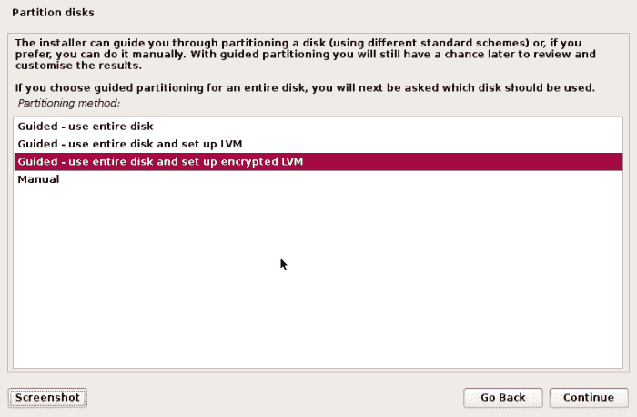
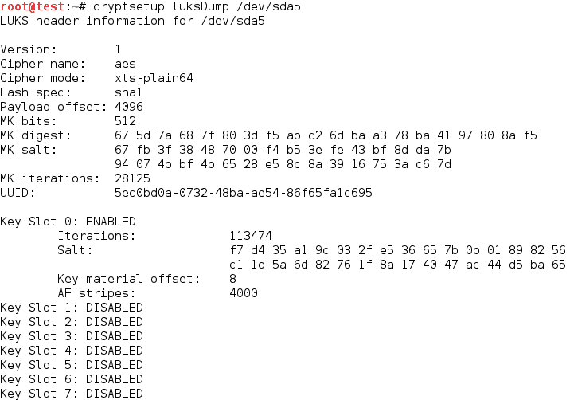
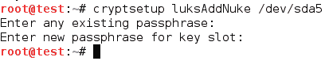
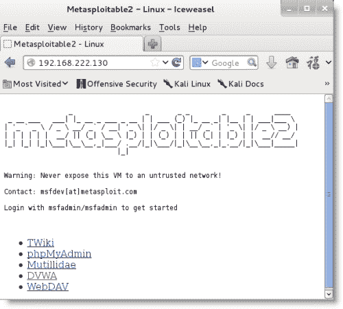
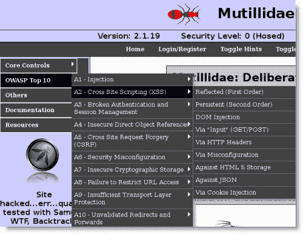
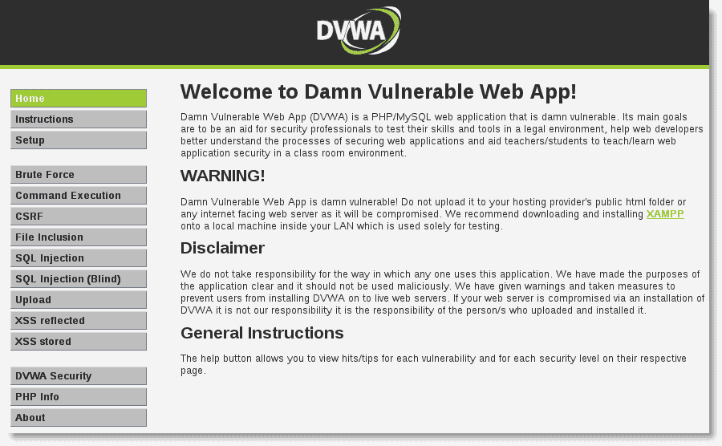

# 附录 A.安装 Kali Linux

Kali Linux 是一个基于 Linux 的操作系统，它作为一个平台，支持数百种用于审计网络安全的不同应用程序。它的复杂性与测试期间安装和使用它的方法的多样性相匹配。本章将介绍安装 Kali 时需要考虑的一些因素，并将重点介绍如何尽快建立和运行一个安全的虚拟机。它还将研究如何建立和维护一个廉价的网站来测试本书中所涵盖的材料。

# 下载 Kali Linux

下载和安装 Kali Linux 有多个选项。本出版物出版时，最新版本为 1.06 版；然而，1.07 版即将发布。当前版本可在官方网站（[www.kali.org/downloads/](http://www.kali.org/downloads/)上获得，有 32 位和 64 位版本。

**攻击性安全**已使预配置版本的**高级 RISC 机器**（**ARM**）、处理器（如 Galaxy Note 10.1、Raspberry Pi 和三星 Chromebooks）可供下载；支持 ARMEL 和 ARMHL 平台。此外，预制的 VMware 映像也可在线访问[http://www.offensive-security.com/kali-llnux-vmware-arm-image-download/](http://www.offensive-security.com/kali-llnux-vmware-arm-image-download/) 。

下载适当的映像后，确保 SHA1 校验和文件由 Kali 生成（将使用官方 Kali 加密密钥对其进行签名，该密钥可在线用于验证下载的真实性），并检查 SHA1 校验和以验证映像的完整性。Linux 和 OSX 操作系统内置了验证工具；但是，您必须使用第三方工具，如**hashtab**（[）http://www.implbits.com/HashTab/HashTabWindows.aspx](http://www.implbits.com/HashTab/HashTabWindows.aspx) 适用于 Windows 操作系统。

如果您希望构建 Kali 的自定义版本，特别是具有备用桌面或工具集的版本，您可以使用[提供的实时构建脚本 http://docs.kali.org/live-build/generate-updated-kali-iso](http://docs.kali.org/live-build/generate-updated-kali-iso) 。

# Kali Linux 的基本安装

一旦获得了合适的 Kali Linux 发行版，就必须安装以供使用。以下安装选项可用：

*   安装到 i386、AMD64 或 ARM 系统硬盘驱动器。设备启动时，Kali Linux 将是唯一的主机操作系统。
*   双引导系统。通常，使用 MS Windows 操作系统时会选择此选项。在引导过程中，用户可以选择将系统引导为 Kali Linux 或 Windows 操作系统。这比将 Kali 直接安装到硬盘驱动器提供了更大的灵活性；然而，这确实使在两个系统之间来回切换变得困难。
*   直接安装到 DVD 驱动器或 USB 设备。如果主机系统可以配置为从 USB 设备引导，则这尤其有用；但是，如果 USB 设备需要*持久化*（保留测试过程中对基于操作系统、应用程序和数据所做的所有更改），则需要进行额外的配置更改。
*   使用 VMware 或 VirtualBox 等产品作为虚拟机安装。我们发现这是支持渗透测试的最灵活的选择。
*   Kali 支持两种类型的网络安装**迷你 ISO**安装和**网络 PXE**安装。mini ISO 在系统上安装截断的 Kali 发行版，然后依靠快速网络连接来安装有效最终产品所需的其余应用程序。网络 PXE 安装在引导过程中支持终端（无 CD-ROM 和 USB 端口），获取 IP 地址信息并安装 Kali。
*   Kali 现在可以从云端使用——Amazon EC2 市场（[上提供了 64 位最小的 Kali 图像 https://aws.amazon.com/marketplace/pp/B00HW50E0M](https://aws.amazon.com/marketplace/pp/B00HW50E0M) ）。Kali 图像是免费的，用户只需对常规 AWS 使用收费。

    ### 提示

    根据亚马逊的规定，此版本的卡利默认情况下不使用根帐户。从亚马逊获得 SSH 密钥后，您必须以用户身份连接到卡利实例，然后将苏多连接到根您可能需要下载其他工具来支持测试。最后，您必须通知亚马逊，它被用于合法的安全测试，而不是作为攻击工具。

## 将 Kali Linux 安装到虚拟机

在本书中，Kali 被配置为**虚拟机**（**虚拟机**。VM 用于渗透测试时具有以下优点：

*   可以开发和维护一个通用的测试虚拟机，确保测试人员熟悉该工具集及其对典型目标系统的影响。
*   虚拟机促进了主机和客户操作系统之间的快速切换，允许测试人员在 Windows 和 Linux 平台之间移动，以便找到测试工具的最佳组合。
*   虚拟机是移动的，它们可以移动到不同的系统和操作平台。
*   虚拟机可以保留在库中，以方便回归测试。在使用工具集验证网络或系统的安全性之后，测试人员经常被问到他们的方法和工具是否会在测试时检测到特定的漏洞。测试人员可以使用归档的 VM 返回并重新测试漏洞，以确定是否会检测到该漏洞，或者网络是否有遭受攻击的风险。

尽管预制虚拟机可供下载，但大多数测试人员使用经过验证的 ISO 映像创建自己的虚拟机（将 Kali 安装到虚拟机的过程几乎与将其安装到硬盘或媒体（如 USB 密钥）的过程相同）。Kali 同时支持 VMware 和 Oracle VirtualBox 虚拟机。

一般来说，这个过程很简单，由应用程序向导引导，引导您完成整个过程。例如，使用 VMware 时，流程如下：

1.  选择**新建虚拟机**图标创建新虚拟机。
2.  选择使用 ISO 映像创建 VM。
3.  选择来宾操作系统。
4.  设置 ISO 映像的名称和位置。
5.  设置磁盘空间；使用的最小值应为 12 GB，但至少留出 20-25 GB。应为 VM 提供至少 1 GB 的内存；但是，如果您正在测试一个大型网络，并且将使用多线程工具，您可能希望将其增加到至少 3 GB。
6.  查看硬件配置。

    ### 提示

    确保虚拟机配置为仅对主机操作系统可见，尤其是在尚未更新的情况下。如果您将虚拟机配置为用作目标，请注意，如果它在互联网上可见，您的测试平台可能会受到外部攻击者的攻击。

7.  启动虚拟机。启动菜单将提供多个选项；选择**图形安装**。
8.  按照提示选择正常语言、时区、主机名和设置根密码。
9.  设置磁盘分区时，如果未使用双引导选项，则可以将完整分区设置为虚拟磁盘。建议您此时选择此选项进行完整磁盘加密。
10.  VM 应用程序将完成分区，将更改写入磁盘，然后安装系统文件。提示输入一些其他配置信息后，VM 将重新启动。
11.  此时，系统处于活动状态。按照[第 1 章](01.html "Chapter 1. Starting with Kali Linux")*中所述，从 Kali Linux*开始配置以支持渗透测试。

    ### 提示

    卡利的预配置发行版通常依赖默认用户名和密码，并且可能具有预生成的 SSH 主机密钥。这些应该尽快改变。

## 全盘加密和主密钥核化

渗透测试人员通常拥有敏感信息——成功的测试可以揭示客户网络中的缺陷，甚至用于进行渗透测试的工具在某些司法管辖区也可能被归类为非法。因此，测试人员经常使用全磁盘加密来保护他们的系统。

在安装到硬盘或虚拟机的分区阶段，Kali 可以设置为使用**逻辑卷管理**（**LVM**）和**Linux 统一密钥设置**（**LUKS**的组合使用全磁盘加密，这是 Linux 硬盘加密的标准应用程序。这显示在以下屏幕截图中：



访问加密驱动器需要密码，建议密码长度为 20 个或更多字符。不幸的是，考虑到最近出现的国家赞助的监视，有人担心测试人员可能被迫将其密码提供给政府机构，从而消除了加密的好处。

解决方案是提供一个密码短语，它将核弹或销毁主密钥。这将确保机密性，使硬盘无法解密。此功能最近添加到 Kali Linux 1.06 版中。

Kali Linux 采用了 LUKS，LUKS 是一种独立于平台的加密规范，允许用户加密硬盘上的分区。LUKS 允许多个用户密钥解密主密钥，允许多个用户加密和解密数据，并允许使用备份密钥。

创建 LUKS 加密容器时，将生成一个随机主密钥。此主密钥使用密码短语加密。这种方法的优点是，密码短语不会直接链接到数据。如果加密两个相同的卷并使用相同的密码短语，则主密钥对其卷保持唯一性，并且无法交换。

这意味着，如果主密钥丢失或销毁，则无法恢复加密数据。此属性允许我们在输入特定密码短语时，通过故意擦除主密钥，来核恢复加密卷或硬盘驱动器。紧急自毁功能已添加到 Kali Linux 1.06 版，可使用 cryptsetup 实用程序实现。

要使用核武器功能：

1.  使用**全磁盘加密**选项安装 Kali。在安装 Kali 之前，所有分区都将被擦除；这将导致安装缓慢。
2.  Verify the LUKS header information for the encrypted hard drive using the following command:

    ```
    root@kali:~# cryptsetup luksDump /dev/sda5

    ```

    与磁盘加密密码关联的**密钥槽 0**已启用。剩余的键槽未使用。以下屏幕截图给出了上一个命令的执行情况：

    

3.  Add the `Nuke` key using the following command:

    ```
    root@kali:~# cryptsetup luksAddNuke /dev/sda5

    ```

    系统将提示您输入现有密码以验证身份，然后将要求您输入用于核武器选项的新密码。请注意，它不会提示用户重复密码短语两次，以防止在输入过程中输入错误。上一个命令的执行如以下屏幕截图所示：

    

4.  To confirm that the nuke key has been enabled, review the list of available key slots, using the command shown in the following screenshot:

    

    `Key slot 1`现在已启用；它包含核钥匙。

5.  使用以下命令备份按键：

    ```
    root@kali:~# cryptsetupluksHeaderBackup --header-backup-file 
      <filename> /dev/sda5 

    ```

6.  Once the master key file has been backed up, encrypt it and transfer it off the system for secure storage. Several applications are available for encryption (for example, 7 Zip, bcrypt, ccrypt, and GnuPG), or you can use an internal command such as `openssl`. A sample command is as follows:

    ```
    root@kali:~# opensslenc -aes-256-cbc -salt -in <filename>
      -out <encrypted filename.enc> 

    ```

    保护备份文件后，系统将受到保护，防止强制提取密码。如果输入了核弹密码，主密钥的本地副本将被销毁，从而无法访问加密文件。

    如果在发出 nuke 密码后转储 LUKS 头，您将看到一个输出，如以下屏幕截图所示：

    

如果您想恢复一个被迫使用核武器的驱动器，该怎么办？只要您可以从远程存储位置检索到加密头，这是一件简单的事情；您将能够解密硬盘并恢复数据。对加密的头进行解密后（根据用于保护文件的方法，使用适当的解密命令），输入以下命令：

```
root@kali:~# cryptsetupluksHeaderRestore --header-backup-file 
  <filename> /dev/sda5 

```

这将生成以下警告：

```
Device /dev/sda5 already contains LUKS header, Replacing header will 
  destroy existing keyslots. Are you sure? 

```

出现提示时，键入`YES`。这将替换标头并允许您解密硬盘驱动器。

# 设置测试环境

在测试生产环境之前，测试人员必须充分了解如何使用测试工具，它们对目标系统的影响，以及如何解释与针对目标执行的活动相关的数据。

在生产系统上运行测试受控环境时，由于以下原因，测试受控环境通常会产生与相同测试不同的结果：

*   目标环境中的操作系统与测试环境中的操作系统不同，包括不同版本的操作系统。（XP 与 Windows 8.1 明显不同，但 Windows 8.1 Pro 与企业版或 32 位与 64 位操作系统之间也存在差异。）支持本地语言的操作系统修改也会对漏洞的存在产生重大影响。
*   目标环境应用了不同的 service Pack、修补程序或升级。
*   目标环境安装了不同的第三方应用程序；这些漏洞可能与网络流量冲突，引入新的漏洞，或影响测试人员利用现有漏洞的能力。
*   在主机环境中配置为虚拟机的目标的反应可能与直接安装在裸机上的目标系统不同。
*   目标受到各种网络和系统设备及应用程序的保护。

为了获得最佳结果，测试人员（和攻击者）通常使用两阶段测试过程。测试人员首先使用定义良好的虚拟机（如 Windows XP）执行攻击，以确定最有效的攻击工具和方法；一旦这个简单的测试用例得到验证，测试人员将使用一个更复杂的虚拟或物理网络重新验证攻击，该网络将尽可能接近目标网络。

## 易受攻击的操作系统和应用程序

测试人员通常维护当前和历史操作系统的库。

当测试微软操作系统时，WinXP 被用作*参考标准*来测试漏洞。尽管 Windows XP 将在 2014 年被弃用，并且不再受 Microsoft 支持，但它仍将保留在服务器和工作站的许多网络上，并嵌入打印机和销售点终端等设备中。

测试易受攻击的 Windows 操作系统时，请订阅 MSDN（[http://msdn.microsoft.com/en-ca/subscriptions/aa336858](http://msdn.microsoft.com/en-ca/subscriptions/aa336858) ）对于获得在实验室测试的当前 Microsoft 产品的访问权是非常宝贵的。

### 提示

不要使用从公共文件共享服务（如 Torrent 站点）下载的操作系统。DigitalDefense 最近评估了 40 次从 Torrent 站点下载的 Microsoft 操作系统，每次下载都受到后门的感染，从而允许攻击者远程访问。

要测试具有特定漏洞的较旧的第三方 Windows 应用程序，测试人员可以访问保留应用程序旧副本的在线存储库；其中许多包括可利用的漏洞。此类存储库的示例可在以下链接中看到：

*   [http://www.oldapps.com](http://www.oldapps.com)
*   [www.oldversion.com](http://www.oldversion.com)

由于其开源性质，可以下载和测试多个版本的类 Unix 操作系统（Linux、BSD 和 Solaris）。

以下项目将允许您使用已知漏洞测试 Unix 操作系统安装，您可以访问：

*   该死的易受攻击的 Linux（[http://sourceforge.net/projects/virtualhacking/files/os/dvl/](http://sourceforge.net/projects/virtualhacking/files/os/dvl/) ）
*   灯光保安（[http://sourceforge.net/projects/lampsecurity/](http://sourceforge.net/projects/lampsecurity/) ）
*   Metasploitable2（[http://sourceforge.net/projects/virtualhacking/files/os/metasploitable/](http://sourceforge.net/projects/virtualhacking/files/os/metasploitable/) ）

通常可以在应用程序的网站上下载具有已知漏洞的旧 Unix 应用程序。

用于测试的复杂环境（操作系统和易受攻击的应用程序）可从位于[的 VulnHub 存储库下载 http://vulnhub.com](http://vulnhub.com) 。这些图像通常伴随着演示利用图像的各种方法的演练。一些图像包括以下内容：

*   **bWAPP**：这个提供了几种方法来破坏示例网站
*   **VulnVPN**：此允许测试人员利用 VPN 服务访问服务器和内部服务，并获得根访问权限
*   **VulnVoIP**：此允许测试人员进行侦察，并允许利用 VoIP 网络进行攻击

最后，测试人员希望利用一些可用于测试的脆弱的基于 web 的应用程序。

最常见的测试目标之一是名为 Metasploitable 的 Linux 映像。基本操作系统存在多个漏洞；此外，它在启动时加载易受攻击的 web 应用程序。要访问应用程序，请将 Metasploitable 作为 VM 打开，然后使用 Kali Linux 启动一个单独的 VM。在 Kali 虚拟机中，打开浏览器并输入 Metasploitable 虚拟机的 IP 地址。您将看到菜单选项，如以下屏幕截图所示：



基于 web 的应用程序可用于支持企业测试以及针对 web 应用程序的特定攻击。五份申请如下:

*   **TWiki**：这是一个在测试过程中支持企业协作的 wiki 应用程序；它使用结构化内容创建简单的工作流系统
*   **phpmyadmin**：允许通过 Web 远程管理 MySQL 数据库
*   **webdav**：**基于 Web 的分布式创作和版本控制**设置了 HTTP 协议的扩展，允许用户协同编辑和管理远程 Web 服务器上的文件
*   **Mutillidae**: A vulnerable web-hacking application composed of PHP scripts that are vulnerable to the top 10 vulnerabilities of OWASP

    正如您在下面的屏幕摘录中所看到的，下拉菜单中提供了前 10 个漏洞。例如，选择选项**A2-跨站点脚本**（**XSS**）可以访问与特定漏洞类型匹配的子菜单（**反射**、**持久**、**DOM 注入**等）。

    

    ### 提示

    `Mutillidae`配置文件中指定的数据库不正确，对于需要访问数据库的操作，您可能会收到多个错误。要修复这些问题，请登录 Metasploitable2 并编辑`/var/www/mutillidae/config.inc`文件；将`dbname`字段从`metasploit`更改为`owasp10`。

*   Finally, the Metasploitable framework launches the **Damn Vulnerable Web Application** (**DVWA**) that provides a different set of challenges to practice attacks against specific vulnerabilities.

    

其他易受攻击的基于 web 的应用程序已被很好地描述，包括：

*   **黑客 XOR**：这是一款网络应用黑客游戏，它迫使玩家通过一个故事来解决与各种漏洞相关的挑战（[）http://hackxor.sourceforge.net/cgi-bin/index.pl](http://hackxor.sourceforge.net/cgi-bin/index.pl) ）。
*   **Foundstone**：该发布了一系列易受攻击的 web 应用程序，包括银行、书店、赌场、航运和旅游网站（[www.mcafee.com/us/downloads/free-tools/index.aspx](http://www.mcafee.com/us/downloads/free-tools/index.aspx)）。
*   **LAMPSecurity**：此提供了一系列易受攻击的虚拟机，旨在教授 Linux、Apache、PHP 和数据库安全性（[http://sourceforge.net/projects/lampsecurity/files/](http://sourceforge.net/projects/lampsecurity/files/) ）。
*   **OWASP 断开的 Web 应用程序项目**：此是易受攻击的 Web 应用程序的集合（[http://code.google.com/p/owaspbwa/](http://code.google.com/p/owaspbwa/) ）。
*   **WebGoat**：这个是一个不安全的 J2EE web 应用程序，它试图提供一个真实的测试环境。由 OWASP（[维护 https://www.owasp.org/index.php/Category:OWASP_WebGoat_Project](https://www.owasp.org/index.php/Category:OWASP_WebGoat_Project) ）。
*   **网络安全 Dojo**：本次培训应用由 Maven Security（[发布 https://www.mavensecurity.com/web_security_dojo/](https://www.mavensecurity.com/web_security_dojo/) ），包含多个目标图像，包括该死的易受攻击的 Web 应用程序、Google 的 Gruyere、Hackme 的 Casino、OWASP 的不安全 Web 应用程序和 w3af 的测试网站 WebGoat，以及一些特定于漏洞的目标。它还包含一个支持利用的工具集。