# 第 5 章测试服务的后台访问

现在让我们谈谈测试各种专门服务。这些任务可以作为附加任务运行，也可以是渗透测试期间运行的唯一任务。在我们作为渗透测试人员的职业生涯中，我们可能会遇到一家公司或一个可测试的环境，该环境只要求在特定服务器上执行测试，并且该服务器可能运行数据库、VOIP 或 SCADA 控制系统等服务。在本章中，我们将研究在对这些服务进行渗透测试时要使用的开发策略。在本章中，我们将介绍以下几点：

*   了解 SCADA 开发
*   ICS 的基本原理及其批判性
*   执行数据库渗透测试
*   测试 VOIP 服务
*   测试用于开发和开发后的 IDEV

基于服务的渗透测试需要敏锐的技能和对我们能够成功利用的服务的良好理解。因此，在本章中，我们将研究执行有效的基于服务的测试的理论和实践挑战。

# SCADA 的基本原理

大坝、电网站、炼油厂、大型服务器控制服务等的控制活动需要**监控和数据采集**（**SCADA**）。

SCADA 系统是为高度特定的任务而构建的，如控制调度的水位、控制输气管道、控制电网以控制特定城市的电力等。

## 集成电路及其组件的基本原理

SCADA 系统是**工业控制系统**（**ICS**型）系统，用于关键环境或在出现任何问题时危及生命的地方。ICS 是大型工业中使用的系统，负责控制各种过程，如按一定比例混合两种化学品、在特定环境中加入二氧化碳、在锅炉中加入适量水等。

此类 SCADA 系统的组件如下所示：

<colgroup><col style="text-align: left"> <col style="text-align: left"></colgroup> 
| 

组成部分

 | 

使用

 |
| --- | --- |
| **远程终端单元**（**RTU**） | 这是将性质上模拟的测量值转换为数字信息的设备。 |
| **可编程逻辑控制器**（**PLC**） | 此集成了与 I/O 服务器和实时操作系统，其工作原理与 RTU 完全相同。它还使用 FTP、SSH 等协议。 |
| **人机界面**（**人机界面** | 这是正在观察或正在控制的环境的图形表示。 |
| **智能电子设备**（**IED** | 这是基本上是一个微芯片，或者更具体地说是一个控制器，可以发送命令来执行特定的动作，例如在特定数量的某种物质与另一种物质混合后关闭阀门，等等。 |

## ICS-SCADA 的严重性

ICS 系统非常关键，如果将其控制权交给错误的人，可能会发生灾难性的情况。想象一下这样一种情况：输气管线的 ICS 控制被恶意黑帽攻击，生命损失并不是我们所能预料的全部。你可能看过电影*Die Hard 4.0*，在这部电影中，向加油站输送天然气的人看起来很酷，交通混乱看起来可能是一种乐趣，但实际上，当出现这种情况时，会造成严重的财产损失，并可能造成生命损失。

正如我们过去所看到的，随着**Stuxnet bot**的出现，有关 ICS 和 SCADA 系统安全性的对话被严重破坏。让我们进一步讨论如何进入 SCADA 系统，或者基本上测试它们，这样我们就可以确保它们有更好的未来。

# SCADA 被撕裂

在本节中，我们将讨论如何破坏 SCADA 系统的安全性。我们有很多可以测试 SCADA 系统的框架，但讨论它们将使我们超出本书的范围。因此，为了简单起见，我们将仅针对使用 Metasploit 进行的 SCADA 开发进行讨论。

## SCADA 测试的基本原理

让我们了解利用 SCADA 系统的基础知识。SCADA 系统可能会因 Metasploit 中最近添加到框架中的各种漏洞而受损。此外，所处的一些 SCADA 服务器可能有默认用户名和密码，这在现在很少见，但仍有可能存在。

让我们尝试寻找一些 SCADA 服务器。我们可以使用优秀的资源来实现这一点，即，[http://www.shodanhq.com](http://www.shodanhq.com) 。让我们看看我们可以从网站上获得哪些不同的 SCADA 服务器。

首先，我们需要为网站创建一个帐户。注册后，我们可以参考[中列出的优秀资源 http://blog.xanda.org/2010/11/10/find-vulnerable-scada-systems-with-shodan/](http://blog.xanda.org/2010/11/10/find-vulnerable-scada-systems-with-shodan/) 。本资源提供了一个优秀的 dorks 列表，可用于在 Internet 上查找各种类型的 SCADA 设备。

有了各种 SCADA 设备的傻瓜列表，我们现在可以继续，并尝试在互联网上查找设备。然而，我们也将很快看到如何在 Metasploit 中自动完成查找特定 SCADA 设备的过程。

让我们试着找到使用罗克韦尔自动化技术配置的 SCADA 系统。在搜索栏中，我们只需输入`Rockwell`即可看到如下截图所示的结果：

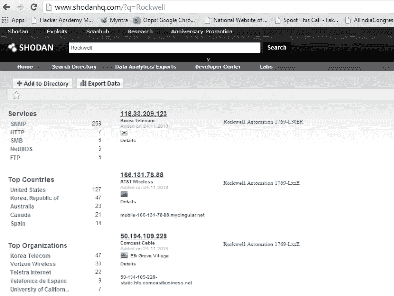

正如我们可以清楚地看到的那样，我们在互联网上发现了大量由罗克韦尔自动化公司在 SCADA 服务器上运行的系统。

此外，该网站还存在一个 Metasploit 模块，要求我们输入 API 密钥进行搜索。但是，在网站上注册后，您将获得 API 密钥。请参阅`auxiliary/gather/shodan_search`使用内置模块。不幸的是，该模块并非始终工作正常。

## 基于 SCADA 的漏洞利用

最近，我们看到 SCADA 系统的开发速度比过去高得多。SCADA 系统可能存在各种漏洞，如基于堆栈的溢出、整数溢出、跨站点脚本和 SQL 注入。

此外，正如我们之前所讨论的，这些漏洞的影响可能会对生命和财产造成危险。SCADA 设备可能遭到黑客攻击的原因主要在于 SCADA 开发人员粗心的编程技能。

让我们看一个 SCADA 服务的示例，并尝试使用 Metasploit 对其进行开发。在下面的示例中，我们将利用 Measuresoft 的**SCADApro**系统，该系统基于带 Metasploit 的 Windows XP 系统。

在这里，当与`xf`命令一起使用时，该漏洞可通过目录遍历攻击进行攻击，已知该命令是用于执行该功能的命令。攻击者可利用此漏洞执行系统命令并访问未经授权的系统，如以下屏幕截图所示：

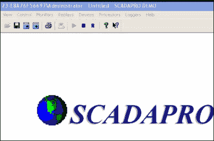

让我们尝试利用 Measuresoft 的 SCADA pro 系统，该系统带有内置的 Metasploit 模块，该模块为`scadapro_cmdexe`，列在`exploit/windows`下的`scada`目录中。

继续利用此漏洞，让我们在 Metasploit 的控制台中运行以下命令：

```
msf>use exploit/windows/scada/scadapro_cmdexe
msf exploit(scadapro_cmdexe)  > set RHOST 192.168.75.130
RHOST => 192.168.75.130
msf exploit(scadapro_cmdexe)  > exploit

```

运行上述漏洞攻击后，您应该能够看到生成的 MeterMeter 会话。我们在 Metasploit 中有很多漏洞专门针对 SCADA 系统中的漏洞。要了解有关这些漏洞的更多信息，您可以参考网络上关于 SCADA 黑客攻击和安全的最大资源[http://www.scadahacker.com](http://www.scadahacker.com) 。您应该能够在[的*msf scada*部分中看到许多漏洞利用 http://scadahacker.com/resources/msf-scada.html](http://scadahacker.com/resources/msf-scada.html) 。

网站[http://www.scadahacker.com](http://www.scadahacker.com) 保存了过去几年在各种 SCADA 系统中发现的漏洞列表。该列表的美妙之处在于，它提供了有关 SCADA 产品、产品供应商、系统组件、Metasploit 参考模块、披露详情以及此次攻击之前启动的第一个 Metasploit 模块的精确信息。

所有针对这些系统中漏洞的最新攻击都会定期添加到 Metasploit 中，这使得 Metasploit 适用于各种类型的渗透测试服务。让我们看看[上提供的各种漏洞列表 http://www.scadahacker.com](http://www.scadahacker.com) 如下图截图所示：

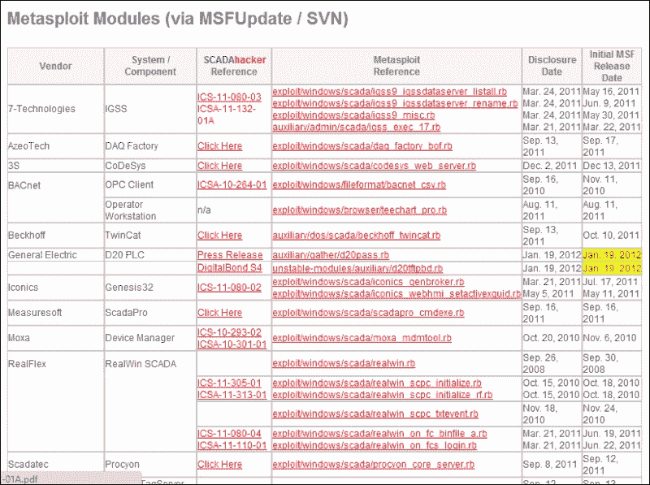

# 固定 SCADA

确保 SCADA 网络的安全是任何渗透测试人员在工作中的首要目标。让我们看下一节，了解如何安全地实现 SCADA 服务并对其施加限制。

## 实现安全 SCADA

确保 SCADA 在实际实施时确实是一项艰巨的工作；但是，在保护 SCADA 系统时，我们可以寻找以下一些关键点：

*   密切关注与 SCADA 网络的每一个连接，找出是否有未经授权的尝试
*   确保在不需要时断开所有网络连接
*   执行系统供应商提供的所有安全功能
*   为内部和外部系统实施 IDPS 技术，并实施 24 小时事件监控
*   记录所有网络基础设施，并为管理员和编辑提供个人角色
*   建立 IRT 小组或红色小组，定期识别攻击向量

## 限制网络

如果发生与未授权访问、不必要的开放服务等相关的攻击，网络可以受到限制。通过删除或卸载服务来实施补救措施是抵御各种 SCADA 攻击的最佳防御措施。

### 注

SCADA 系统通常在 Windows XP 系统上实现，这使得它们容易受到更高速率的攻击。如果您正在实施 SCADA 系统，请确保您的窗口框已打好补丁，足以防止各种攻击。

# 数据库开发

在报道了 SCADA 开发的启动之后，让我们进一步测试数据库服务。在本节中，我们的主要目标是测试数据库并检查后端是否存在各种漏洞。您可能知道，数据库几乎包含了建立业务所需的所有内容。因此，如果数据库中存在漏洞，则可能导致公司重要数据泄露。与金融交易、医疗记录、犯罪记录、产品、销售、营销等相关的数据可能对这些数据库的购买者非常有用。

为了确保数据库完全安全，我们需要开发针对各种类型攻击测试这些服务的方法。现在让我们开始测试数据库，看看在数据库上进行渗透测试的各个阶段。

## SQL server

微软早在 1989 年就推出了数据库服务器。今天，大多数网站都运行最新版本的 MS SQL server 作为其网站的后端。但是，如果网站太大或一天内处理的事务太多，则必须确保数据库没有任何漏洞和问题。

在关于测试数据库的这一节中，我们将重点介绍以有效方式测试数据库的策略，以便不留下任何漏洞。默认情况下，MS SQL 在 TCP 端口号 1433 上运行，UDP 在 1434 上运行，因此让我们首先测试在 Windows 8 系统上运行的 MS SQL server 2008。

## 使用 Nmap 封装 SQL server

在启动 Metasploit 的核心模块之前，让我们看看使用最流行的网络扫描工具，即 Nmap，可以获得关于 SQL server 的哪些信息。然而，我们将使用 Metasploit 本身的`db_nmap`插件。

因此，让我们快速生成一个 Metasploit 控制台，并通过在端口 1433 上执行服务检测扫描，开始跟踪目标系统上运行的 SQL server，如下所示：

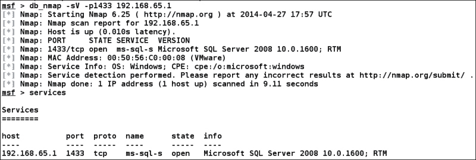

在前面的屏幕截图中，我们测试了作为 SQL server 的 TCP 实例运行的端口号 1433。然而，我们可以清楚地看到，港口是开放的。

让我们通过在 UDP 端口 1434 上执行服务检测扫描来检查 SQL server 的 UDP 实例是否在目标上运行，如下所示：

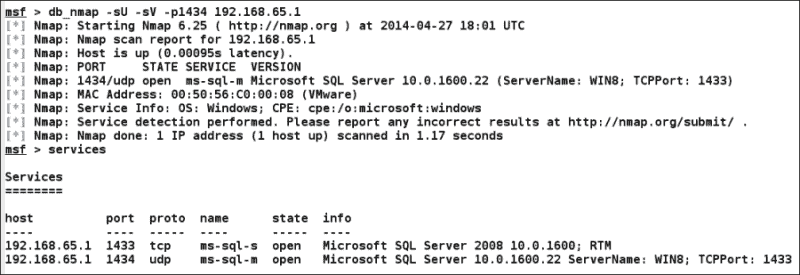

我们可以清楚地看到，当我们尝试在 UDP 端口 1434 上扫描时，Nmap 向我们提供了有关目标 SQL server 的一些附加信息。SQL server 版本和服务器名称`WIN8`等信息是我们从此次扫描中获得的附加信息。

现在，让我们使用内置 Nmap 脚本查找有关目标数据库的一些附加信息：

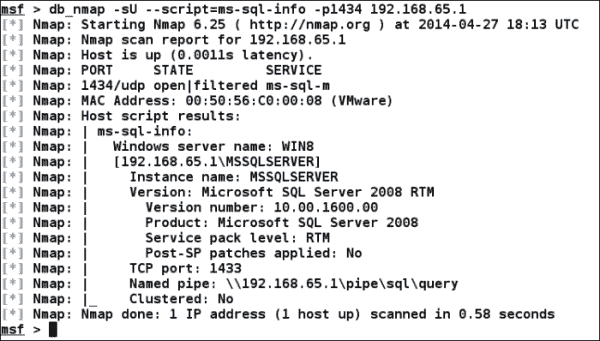

在脚本开关中提供`ms-sql-info`脚本名称将指示 Nmap 更精确地扫描 MS SQL server，并仅基于 MS SQL server 执行大量测试。我们可以看到现在我们有了更多的信息，比如命名管道、集群信息、实例、版本、产品信息，以及各种其他信息。

## 使用 Metasploit 模块进行扫描

现在让我们跳到测试 MS SQL server 的 Metasploit 特定模块上，看看使用它们可以获得什么样的信息。我们将使用的第一个辅助模块是`mssql_ping`。本模块将收集一般细节，就像我们之前使用 Nmap 所做的那样，但也会收集一些更具体的细节。

那么，让我们加载模块并按如下方式开始扫描过程：

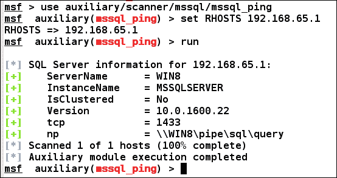

从前面的结果可以看出，我们得到了几乎相同的信息，但是这里 Metasploit 辅助工具还定义了服务器用于建立 TCP 连接的命名管道。显然，结果要好得多，更有条理，更明显。

## 暴力强制密码

数据库渗透测试的下一步是更精确地检查身份验证或身份验证测试。Metasploit 有一个名为`mssql_login`的内置模块，我们可以使用它作为身份验证测试仪，强制输入 MS SQL server 数据库的用户名和密码。

让我们加载模块并分析结果：

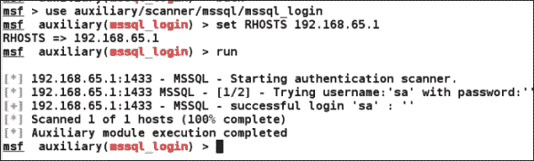

我们一运行此模块，它就在第一步测试默认凭据，即用户名`sa`和密码为空，并发现登录成功。因此，我们可以得出结论，默认凭据仍在使用。

让我们尝试对设置了这些凭据的数据库进行强制。但是，在这种情况下，我们将设置强制数据库所需的用户名和密码文件。让我们通过发出`show options`命令快速检查`mssql_login`模块提供了哪些选项：

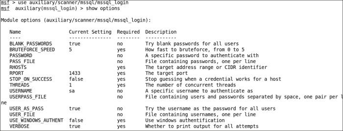

我们可以在`mssql_login`模块中使用前面列出的所有选项。让我们设置成功运行此模块所需的参数：`USER_FILE`列表、`PASS_FILE`列表和`RHOSTS`。让我们按如下方式设置这些选项：

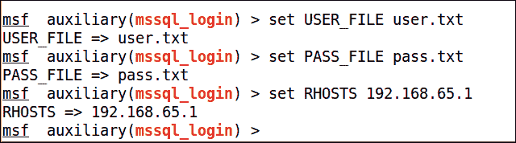

让我们在目标数据库服务器上运行这个模块，看看是否可以找到一些有趣的东西：

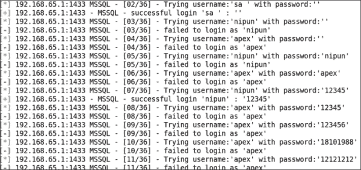

从结果中可以看出，我们有两个条目对应于用户在数据库中成功登录。

因此，我们找到了一个默认凭证，即密码为空的用户`sa`，我们找到了另一个密码为`12345`的用户`nipun`。

## 查找/捕获服务器密码

我们知道我们有两个用户`sa`和`nipun`。让我们提供其中一个并尝试查找其他用户凭据。我们可以通过`mssql_hashdump`模块实现这一点。让我们检查其工作情况，并调查其成功完成时提供的所有信息：

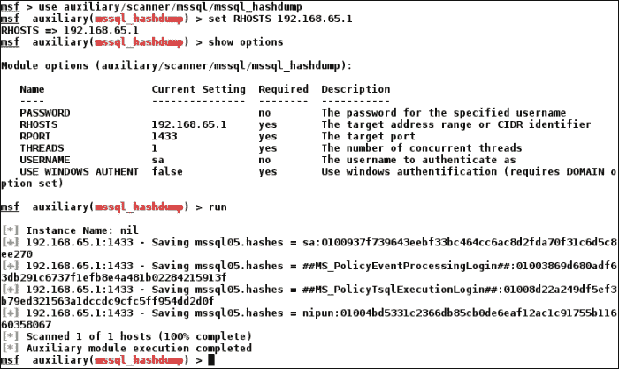

我们可以清楚地看到，它已经获得了对数据库服务器上其他帐户的密码哈希的访问，我们可以使用第三方工具破解它们，也可以提升或获得对其他数据库和表的访问。

## 浏览 SQL server

我们在上一节中找到了用户及其对应的密码。现在，让我们登录到服务器并收集有关数据库的重要信息，例如存储过程、数据库的数量和名称、可以登录到数据库的 Windows 组、数据库的文件以及参数。

我们将用于此目的的模块是`mssql_enum`。因此，让我们看看如何在目标数据库上运行此模块：

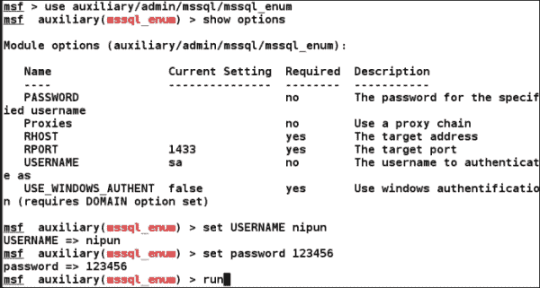

在运行`mssql_enum`模块后，我们将能够收集大量关于数据库服务器的信息。让我们看看它提供了什么样的信息：

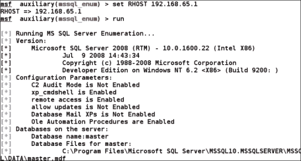

正如我们所看到的，该模块向我们展示了几乎所有关于数据库服务器的信息，例如存储过程、存在的数据库的名称和数量、禁用的帐户等等。

在*重新加载 xp_cmdshell 功能*一节中，我们还将了解如何绕过一些已禁用的存储过程。此外，像`xp_cmdshell`这样的过程可能会导致整个服务器受损。我们可以从前面的屏幕截图中看到，`xp_cmdshell`已在服务器上启用。不过，让我们看看`mssql_enum`模块为我们提供了哪些其他信息：

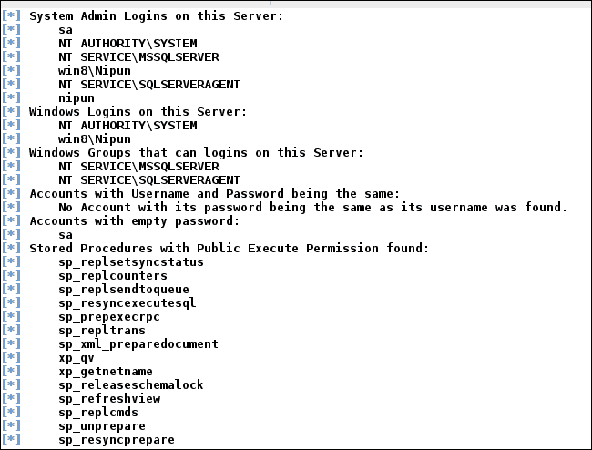

它向我们展示了许多信息，正如我们从前面的截图中所看到的。这包括存储过程列表、密码为空的帐户、数据库的窗口登录和管理员登录。

## 后开发/执行系统命令

在收集了有关目标的足够信息之后，让我们对目标数据库执行一些后期开发。为了实现后期开发功能，我们有两个不同的模块，在执行开发时非常方便。第一个是`mssql_sql`，它允许我们对数据库运行 SQL 查询，第二个是`msssql_exec`，它允许我们绕过禁用的`xp_ cmdshell`过程运行系统级命令。

### 重新加载 xp_cmdshell 功能

`mssql_exec`模块将通过重新加载禁用的`xp_cmdshell`功能来尝试运行系统级命令。但是，此模块将要求我们将`CMD`选项设置为要执行的系统命令。让我们看看它是如何工作的：

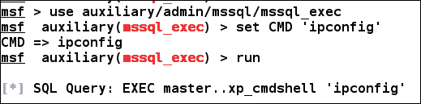

当我们运行完`mssql_exec`模块后，结果将闪烁到屏幕上，如下图所示：

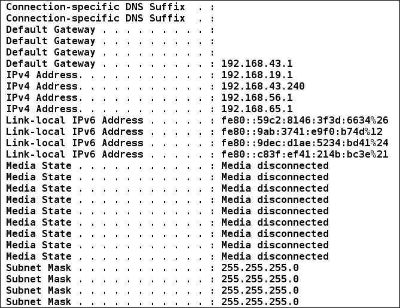

生成的窗口清楚地显示了针对目标数据库服务器成功执行的系统命令。

### 运行基于 SQL 的查询

我们还可以使用`mssql_sql`模块对目标数据库服务器运行基于 SQL 的查询。将`Query`选项设置为任何相关数据库查询将执行该查询，如以下屏幕截图所示：

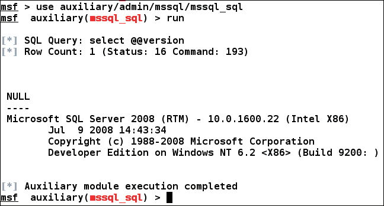

我们将`COMMAND`参数设置为`select @@version`。数据库服务器成功地执行了查询，我们以数据库版本的形式获得了结果。

因此，按照前面的步骤，我们可以使用 Metasploit 测试各种数据库的漏洞。

### 注

请参考[上关于测试 MySQL 的优秀资源 http://pentestlab.wordpress.com/2012/07/27/attacking-mysql-with-metasploit/](http://pentestlab.wordpress.com/2012/07/27/attacking-mysql-with-metasploit/) 。

# VOIP 的开发

现在让我们重点测试支持 VOIP 的服务，看看如何检查可能影响 VOIP 服务的各种缺陷。

## VOIP 基础知识

**互联网语音协议**（**VOIP**）是与传统电话服务相比成本更低的技术。VOIP 在电信方面提供了比传统电话更大的灵活性，并提供了各种功能，如多个分机、来电显示服务、日志记录、每次通话记录等。近日，多家公司在启用 IP 电话的基础上推出了**专用交换机**（**PBX**）。

传统的和现有的电话系统仍然容易通过物理访问被拦截，例如，如果攻击者改变电话线的连接并连接其发射机。他将能够拨打和接听电话到他的设备，并可以享受互联网和传真服务。

然而，在 VOIP 服务的情况下，我们可以在不接触电线的情况下破坏安全性。然而，如果您不了解 VOIP 服务的基本工作原理，那么攻击 VOIP 服务是一项乏味的任务。本节介绍了如何在不拦截线路的情况下破坏网络中的 VOIP。

### PBX 简介

PBX 是中小型范围公司的电话服务的经济高效的解决方案。这是因为它提供了更大的灵活性和公司客舱与楼层之间的相互交流。大型公司也可能更喜欢 PBX，因为在大型组织中，将每条电话线连接到外线变得非常麻烦。

PBX 包括：

*   终止于 PBX 的电话中继线
*   一种计算机，用于管理 PBX 内和内外的所有呼叫切换
*   PBX 内的通信线路网络
*   操作员的控制台或总机

### VOIP 业务类型

我们可以将 VOIP 技术分为三种不同的类型。让我们看看它们是什么。

### 自托管网络

在这种类型的网络中，PBX 安装在客户端本身的站点，并进一步连接到**互联网服务提供商**（**ISP**）。这类网络一般通过多个虚拟局域网向 PBX 设备发送 VOIP 业务流，然后 PBX 设备将其发送到**公共交换电话网**（**PSTN**）进行电路交换，以及互联网连接的 ISP。下图很好地演示了该网络：

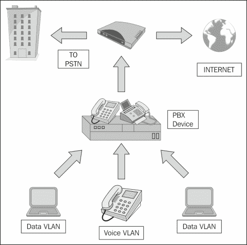

### 托管服务

在托管服务类型的 VOIP 技术中，在客户端没有 PBX。然而，客户端的所有设备都通过互联网连接到服务提供商的 PBX，即通过使用 IP/VPN 技术的**会话启动协议**（**SIP**）线路。

让我们通过下图来了解这项技术的工作原理：

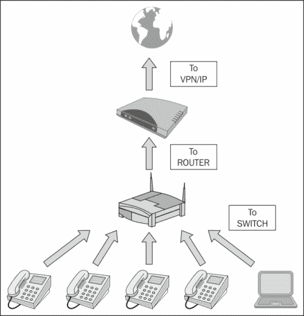

### SIP 服务提供商

互联网上有许多 SIP 服务提供商为软电话提供连接，可直接使用软电话享受 VOIP 服务。此外，我们可以使用任何客户端软电话访问 VOIP 服务，如 Xlite，如以下屏幕截图所示：


### 注

有关 VOIP 的更多信息，请参阅[上的大量资源 http://www.backtrack-linux.org/wiki/index.php/Pentesting_VOIP](http://www.backtrack-linux.org/wiki/index.php/Pentesting_VOIP) 。

## 足迹式 VOIP 服务

我们可以使用 Metasploit 内置的 SIP 扫描模块在网络上封装 VOIP 设备。一种常见的 SIP 扫描仪是内置在 Metasploit 中的**SIP 端点扫描仪**。我们可以使用此扫描仪通过从各种 SIP 服务发出`options`请求来识别网络上启用 SIP 的设备。

让我们使用`/auxiliary/scanner/sip`下的`options`辅助模块进行 VOIP 扫描，并分析结果。这里的目标是运行星号 PBX VOIP 客户端的 Windows XP 系统。让我们看看如何使用此模块收集信息：


我们首先加载用于通过网络扫描 SIP 服务的辅助模块，如以下屏幕截图所示：

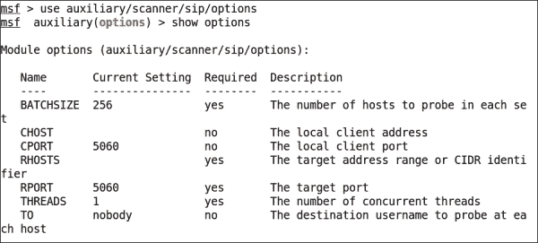

我们可以看到，我们有很多选项可以与`auxiliary/scanner/sip/options`辅助模块一起使用。我们只需要配置的`RHOSTS`选项。但是，对于大型网络，我们可以使用**无类域间路由**（**CIDR**）标识符定义 IP 范围。一旦运行，模块将开始扫描可能正在使用 SIP 服务的 IP。让我们按如下方式运行此模块：

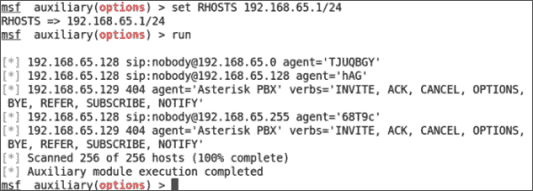

我们可以清楚地看到，在运行时，该模块返回了许多与使用 SIP 服务的 IP 相关的信息，例如代理，它表示正在运行的 PBX 的名称和版本，以及动词，它们定义 PBX 支持的请求类型。因此，我们可以使用此模块收集有关网络上 SIP 服务的大量知识。

## 扫描 VOIP 服务

在找到关于目标支持的各种选项请求的信息后，现在让我们使用另一个 Metasploit 模块，即`auxiliary/scanner/sip/enumerator`扫描并枚举 VOIP 服务的用户。此模块将扫描目标范围内的 VOIP 服务，并尝试枚举其用户。让我们看看如何实现这一点：

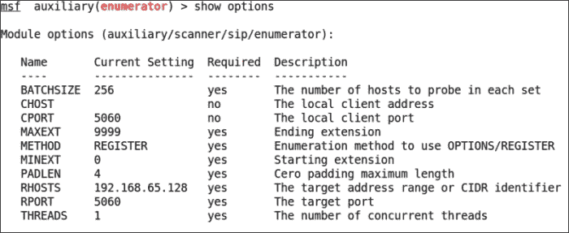

我们有前面列出的用于此模块的选项。为了成功运行此模块，我们将设置以下一些选项：

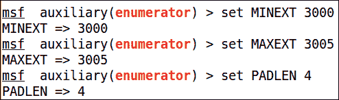

我们可以看到，我们已经设置了`MAXEXT`、`MINEXT`、`PADLEN`和`RHOSTS`选项。

在前面截图中使用的枚举器模块中，我们将`MINEXT`和`MAXEXT`分别定义为`3000`和`3005`。但是，`MINEXT`是开始搜索的分机号码，`MAXEXT`是完成搜索的最后一个分机号码。但是，这些选项可以设置为非常大的范围，例如`MINEXT`到`0`和`MAXEXT`到`9999`，以了解在分机号码`0`到`9999`上使用 VOIP 服务的各种用户。

让我们通过定义 CIDR 值在目标范围内运行此模块，如下所示：

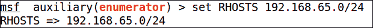

这里重要的一点是，我们需要在这里定义网络的范围。现在，让我们运行这个模块，看看它显示了什么输出：

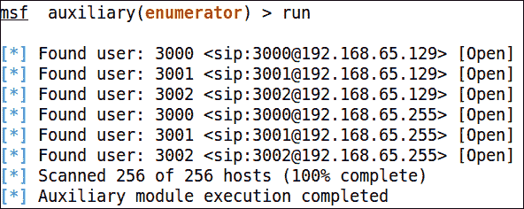

此搜索返回了太多使用 SIP 服务的用户。此外，我们在这里可以清楚地看到`MAXEXT`和`MINEXT`的效果，因为它只扫描了从`3000`扩展到`3005`的用户。然而，扩展可以被认为是特定网络中许多用户的公共地址。

## 欺骗 VOIP 呼叫

在获得了关于使用 SIP 服务的各种用户的足够知识之后，让我们尝试使用 Metasploit 对用户进行假调用。考虑到一个用户在 Windows XP 平台上运行 SipXphone 2.0.6.27，让我们使用`auxiliary/voip/sip_invite_spoof`模块向他们发送一个假邀请请求。我们可以使用以下模块实现这一点：

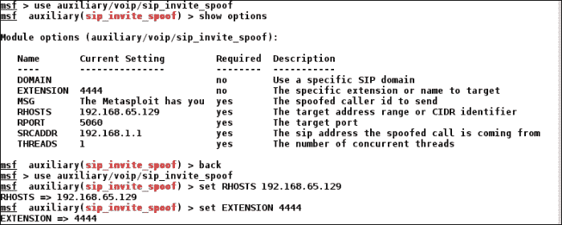

我们需要设置的只是选项。我们将使用目标的 IP 地址和目标的`EXTENSION`设置`RHOSTS`选项。让我们保持`SRCADDR`到`192.168.1.1`。这意味着我们向受害者假装我们发送的请求来自`192.168.1.1`。

因此，现在让我们运行模块：

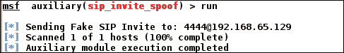

让我们看看受害者方面发生了什么：

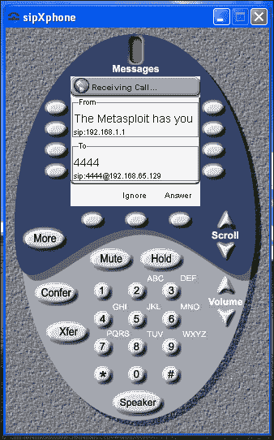

我们可以清楚地看到软电话正在鸣响，并将呼叫者显示为**192.168.1.1**，同时显示来自 Metasploit 的预定义消息。

## 利用 VOIP

为了获得对系统的完全访问，我们还可以尝试开发软电话软件。从前面的场景中，我们得到了目标的 IP 地址。让我们用 Metasploit 扫描并利用它。但是，Backtrack/Kali 操作系统中有专门的 VOIP 扫描工具，专门用于测试 VOIP 服务。以下是我们可以用来利用 VOIP 服务的工具列表：

*   Smap
*   Sipscan
*   西普萨克
*   沃邦
*   Svmap

回到开发部分，我们在 Metasploit 中有一些可以在软手机上使用的开发。让我们看一个例子。

我们将在这里开发的应用程序是 SipXphone 版本 2.0.6.27。此应用程序的界面可能类似于以下屏幕截图：

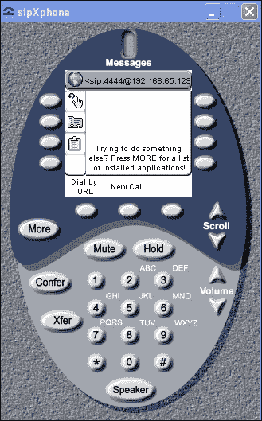

### 关于漏洞

漏洞存在于应用程序对`Cseq`值的处理中。发送超长字符串会导致应用程序崩溃，在大多数情况下，攻击者会运行恶意代码并访问系统。

### 开发应用

现在让我们使用 Metasploit 开发 SipXphone 2.0.6.27 版应用程序。我们将在这里使用的漏洞是`exploit/windows/sip/sipxphone_cseq`。让我们将此模块加载到 Metasploit 中，并设置所需的选项：


我们需要设置`RHOST`、`LHOST`和`payload`的值。现在一切就绪，让我们按如下方式利用目标应用程序：

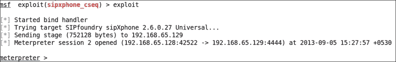

繁荣成功我们很快就拿到了仪表。因此，在基于 Metasploit 的软件缺陷的情况下，利用 VOIP 是很容易的。但是，在测试 VOIP 设备和其他与服务相关的 bug 时，我们可以使用第三方工具进行有效的测试。

### 提示

可以在[找到测试 VOIP 的大量资源 http://www.backtrack-linux.org/wiki/index.php/Pentesting_VOIP](http://www.backtrack-linux.org/wiki/index.php/Pentesting_VOIP) 。

# 苹果创意产品的后期开发

苹果以其 iDevices 中部署的安全服务而闻名，iDevices 包括 iPhone、iPad 等。从渗透测试仪的角度测试设备既麻烦又复杂。然而，如果一个 iDevice 被判入狱，那么这个任务将变得更容易执行。

我们在这里的讨论将集中于在牢狱之灾的环境中测试 iDevice。我们假设通过命运或利用 iDevice 中的 SSH 漏洞，我们可以通过 SSH 访问目标。

### 提示

您可以在[了解如何利用 SSH 服务 http://www.youtube.com/watch?v=1JmUIyfWEzc](http://www.youtube.com/watch?v=1JmUIyfWEzc)

## 利用 Metasploit 开发 iOS

在我们已经了解了如何利用前面资源中的 SSH 漏洞后，让我们继续并尝试登录到设备的 SSH。

然而，在我们这样做之前，让我们尝试创建恶意负载，它将实际利用 iOS。让我们启动`msfvenom`，一个生成编码有效载荷的工具。

通常，我们使用`msfvenom`生成恶意有效负载，并将有效负载编码为外观正常的可执行文件。

在这种情况下，我们将使用`msfvenom`创建一个恶意负载，即`osx/armle/shell/bind_tcp`。

我们将使用`macho`的输出格式，它表示 iOS 操作系统的可执行文件或 DLL 文件或共享库文件。让我们尝试生成此文件：

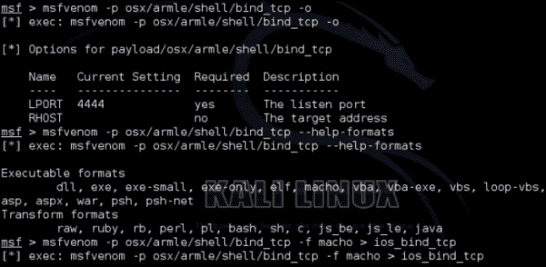

`-p`开关指示要使用的有效负载。此外，`–help-formats`将向我们展示可以使用哪些格式创建恶意负载。`-o`开关将显示待填充有效负载所需的选项。

在前面屏幕截图的最后一部分中，我们使用了`–f`开关来指定正在生成的文件的格式。此外，我们将恶意负载输出到名为`ios_bind_tcp`的文件中。

下一步是将此文件上载到 iDevice 并使其运行。此外，我们需要确保文件上传后，它具有适当的执行权限。但是，让我们看看如何将文件上载到设备上：

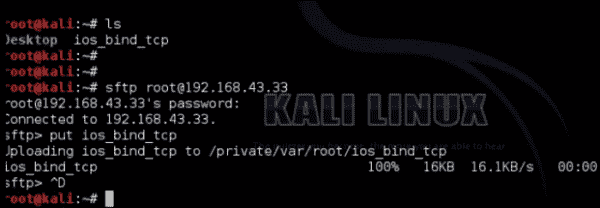

因此，我们使用 SFTP 协议登录到设备，并轻松地将恶意文件上传到 iDevice 上。

下一步是检查权限，并将上下文中的所有内容设置为有效负载文件，以使其正常工作。让我们按如下方式分配所需的文件权限：

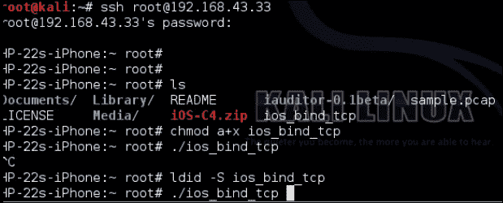

如我们所见，我们通过指定`a+x`为所有权限指定了可执行文件，并使用`ldid`实用程序对上传的文件进行签名。

`ldid`实用程序基本上是一种工具，它可以刺激在 iDevice 上签名的过程，允许我们安装在设备未损坏的情况下无法安装的应用程序。

在最后一个命令中，我们执行了该文件。现在，让我们为我们使用的有效负载快速设置一个处理程序，以便它能够接受设备进行的所有传入连接：

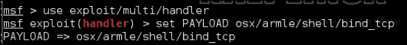

我们需要设置具有匹配负载的处理程序。让我们看看如何做到这一点：

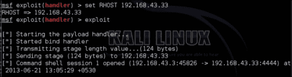

我们需要将`RHOST`设置为该漏洞能够正常工作，一旦我们点击`exploit`命令，我们就会在目标设备上获得一个外壳，如以下屏幕截图所示：

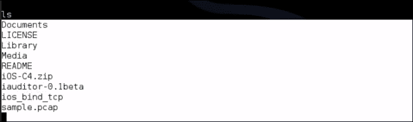

现在，我们拥有了该设备的权限，我们可以执行我们想要的任何进一步的后期开发。此类技术的示例可使攻击者浏览 WhatsApp 历史记录、已删除联系人、最近通话、已删除图片、Skype 历史记录等。

### 注

请参阅我在[上的文章 https://eforensicsmag.com/mobile-combat/](https://eforensicsmag.com/mobile-combat/) 了解有关如何查找最近通话、已删除图片、WhatsApp 历史记录等信息的更多信息。

# 总结

在本章中，我们看到了几个利用和渗透测试场景，我们可以使用各种服务执行这些场景，例如数据库、VOIP、SCADA，甚至 iDevices。在本章中，我们学习了 SCADA 及其基本原理。我们了解了如何获得有关数据库的各种信息，以及如何获得对数据库的完全控制。我们还了解了如何通过扫描网络中的 VOIP 客户端和欺骗 VOIP 呼叫来测试 VOIP 服务。

在下一章中，我们将看到如何使用 Metasploit 和渗透测试中使用的各种其他常用扫描工具执行完整的渗透测试。我们将介绍如何在对给定主题进行渗透测试时系统地进行测试。我们还将了解如何创建报告，以及这些报告中应包含或排除哪些内容。