# 第 6 章虚拟试验场和试验台

在过去的几章中，我们已经介绍了很多内容。现在是测试我们在本书中介绍的所有方法以及各种其他测试工具的时候了，看看我们如何能够轻松地在目标网络、网站或其他服务上执行渗透测试和漏洞评估。

在本章中，我们将介绍各种测试方法，这些方法将涵盖以下主题：

*   使用 Metasploit 以及行业的各种其他渗透测试工具
*   将各种工具和格式的报告导入 Metasploit 框架
*   使用 Metasploit 进行渗透测试时使用其他工具
*   生成渗透测试报告

本章的主要重点是介绍与 Metasploit 一起使用的其他行业领先工具的渗透测试。但是，在执行基于 Web 的测试和其他测试技术时，测试的阶段可能会有所不同，但原则保持不变。

# 进行白盒渗透试验

**白盒测试**是攻击者完全了解要测试的系统的测试过程。这些信息包括**操作系统**（**操作系统**）的详细信息、部署的 web 应用程序、运行的服务器的类型和版本，以及完成渗透测试所需的所有其他技术细节。

白盒测试可能包括访问客户办公室、与最终用户交谈、查看源代码等。

黑盒和白盒测试技术之间的细微差别在于，测试人员不必担心白盒测试的**误报**，因为他们已经知道正在运行的特定应用程序的细节。然而，误报是关于目标漏洞的错误假设，而这些假设在现实中可能并不存在。因此，使用白盒测试技术进行渗透测试比黑盒测试技术获得更大的成功。

### 提示

热衷于使其技术安全并希望在完全安全的环境中工作的组织首选白盒测试。提高安全级别的黑客攻击是测试的首要议程。

以下是我们在使用白盒测试技术进行渗透测试时需要涵盖的阶段：

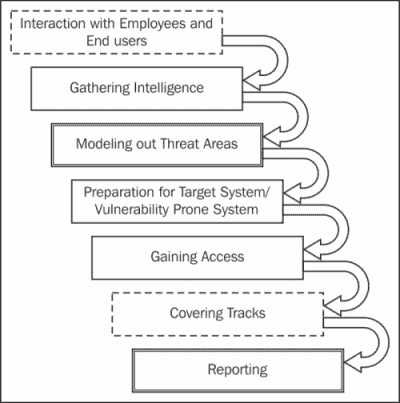

上图清楚地说明了在白盒 genesis 中执行渗透测试时需要涵盖的各个阶段。如图中所示，用虚线标记的相位定义了可能需要或不需要的相位。带有双行的说明了关键阶段，最后一行（带有一条连续线）说明了进行试验时应遵循的标准阶段。现在让我们从渗透测试开始，分析白盒测试的各个方面。

## 与员工和最终用户的互动

与员工和最终用户的互动是我们到达客户现场后的第一阶段。此阶段包括**无技术黑客**，也可称为**社会工程**。其思想是从最终用户的角度获得有关目标系统的知识。这个阶段还回答了这样一个问题：最终用户是否愿意或不愿意内部泄漏信息，组织是否安全。下面的例子应该让事情更清楚一些：

去年，我们的团队正在进行白盒测试，我们被叫到客户的现场进行进一步的内部测试。我们一到那里，就开始与最终用户交谈，询问他们在使用新安装的系统时是否遇到任何问题。出乎意料的是，该公司没有客户允许我们接触他们的系统，但他们很快解释说，他们在登录时遇到了问题，因为它不接受每次会话超过 10 次的多个连接。

我们对该公司的安全政策感到惊讶，该政策不允许我们访问他们的任何客户系统，但后来，我的一个队友在账户部门看到一个 55-60 岁左右的老家伙，他正在与他的互联网进行斗争。我们问他是否需要帮助，他很快同意了。我们告诉他，他可以通过连接**局域网****局域网**电缆来使用我们的笔记本电脑，并可以完成他的未决交易。他把局域网电缆插入我们的笔记本电脑，开始了他的工作。我的同事站在他身后，打开他的笔式照相机，迅速记录下他所有的打字活动，比如他用来登录系统的凭证。

我们发现另一位女士在她的系统中挣扎，她告诉我们她在登录时遇到了问题。我们告诉这位女士，我们将解决这个问题，因为她的帐户需要从后端续订。我们还告诉她，她需要给我们她的用户名和密码以及登录机制的 IP 地址。她同意了，并告诉了我们证件。我们的例子到此结束；如果这些员工遇到一些问题，不管这些环境有多安全，他们都可能意外地泄露他们的凭据。我们后来向该公司报告了这一问题，作为报告的一部分。

可从最终用户处获取的其他类型信息包括：

*   他们正在研究的技术
*   服务器的平台和操作系统详细信息
*   隐藏的登录 IP 地址或管理区域地址
*   系统配置和操作系统详细信息
*   web 服务器背后的技术等等

这些信息是必需的，并且将有助于在事先了解可测试系统中使用的技术的情况下确定测试的关键领域。

但是，在进行白盒渗透测试时，该阶段可能包括，也可能不包括。这类似于一家公司要求您在测试人员的现场进行测试，或者如果该公司距离您很远，甚至可能在另一个国家。在这些情况下，我们将取消此阶段，并询问公司管理员或其他官员他们正在研究的各种技术。

## 搜集情报

在与最终用户交谈之后，我们需要深入了解网络配置并了解目标网络。然而，从最终用户处收集的信息很可能不完整，并且很可能是错误的。渗透测试人员有责任对每个细节进行两次确认，因为误报和伪造信息可能会导致渗透测试期间出现问题。

情报收集包括获取有关目标网络、使用的技术、运行服务的版本等足够深入的细节。

可以使用从最终用户、管理员和网络工程师处收集的信息来收集情报。在远程测试的情况下，或者如果获得的信息部分不完整，我们可以使用各种漏洞扫描程序（如 Nessus、GFI Lan Guard、OpenVas 等）查找任何缺失的信息，如操作系统、服务、TCP 和 UDP 端口等。

### 解释 OpenVAS 漏洞扫描器的基本原理

我们将在这里介绍 OpenVAS，因为它是开源的，在发现网络漏洞时非常有效。

在这里，我们将使用内置于 Kali Linux 发行版中的 OpenVAS，这可以在**工具**下的**漏洞评估**部分找到。

### 设置 OpenVAS

启动 OpenVAS 时执行的第一步是对其进行配置。然而，与回溯操作系统不同，这个过程在 Kali Linux 中是自动化的。在下面的屏幕截图中，让我们看看如何设置 OpenVAS：

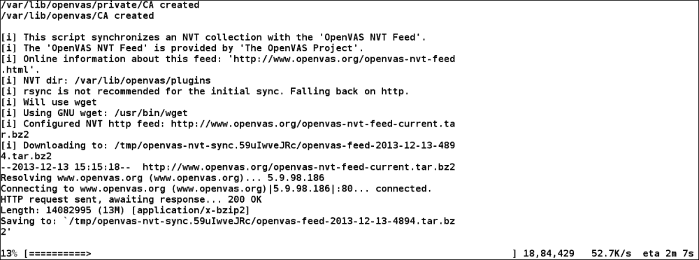

1.  As soon as you open the setup of OpenVAS, it starts downloading the latest **Network vulnerability tests** (**NVT**s) configurations and updates the database, as shown in the following screenshot:

    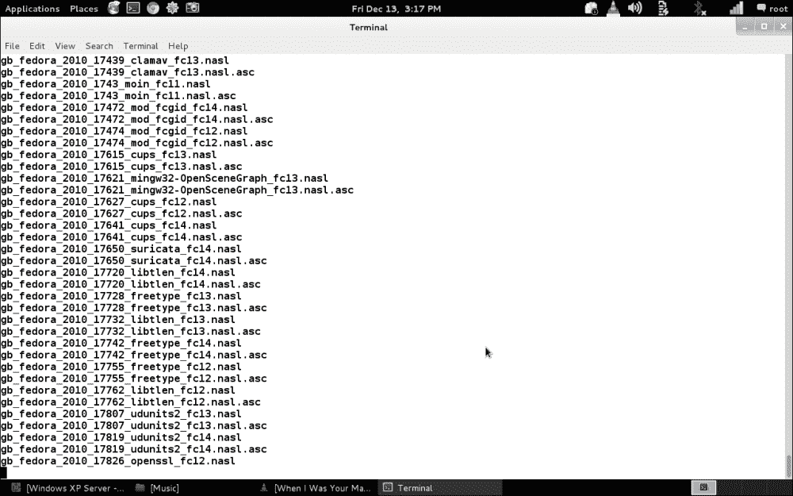

2.  After the download is complete, it begins loading plugins into the OpenVAS database, which may look similar to the following screenshot:

    

3.  After all the plugins have been loaded into the database, the OpenVAS installation moves on to the creation of the SSL certificate and a user to access the interface for testing, as shown in the following screenshot:

    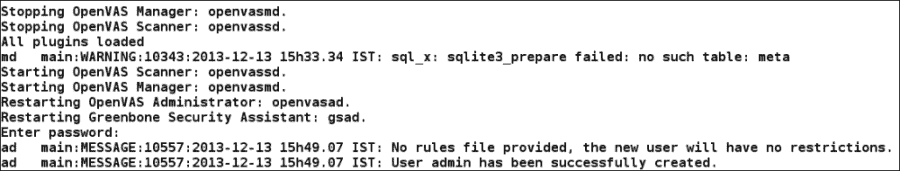

4.  在前面的步骤中，OpenVas 安装程序要求为默认用户管理员设置密码。我们可以在这里提供任何相关密码，但请确保它是强密码。

### OpenVAS 的绿色接口

在设置 OpenVAS 后，下一步是访问用户界面与 OpenVAS 交互。**绿骨安全助理**及其桌面客户端帮助我们实现目标。但是，我们不需要设置它，因为它是由 OpenVAS 设置脚本自动配置的。我们只需浏览到`https://localhost:9392`即可访问 web 界面，使用**用户名**作为`admin`登录，并使用我们在上一步设置的**密码**登录即可。这显示在以下屏幕截图中：


一旦我们登录到该界面，我们就可以找到大量可使用的选项。这是因为 Greenbone 为用户提供了一个相当互动的 web 界面，看起来类似于以下屏幕截图：

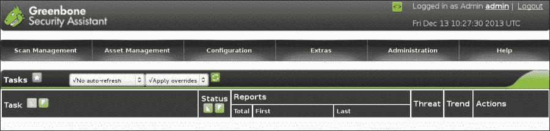

我们在**绿骨安全助手**中提供了多种选项，如下所示：

*   **扫描管理**：此选项卡提供管理各种任务的功能，例如正在运行的扫描、已完成任务的列表、编辑任务的选项、注释等
*   **资产管理**：此页签提供主机的详细信息
*   **配置**：此选项卡提供**目标**、要使用的凭证、**扫描配置**、**代理**、**自动扶梯**、**时间表**、**端口列表**、**报告格式**和**从机的信息**
*   **附加**：此页签提供**垃圾桶**和**设置**
*   **管理**：此页签提供添加用户等管理服务信息
*   **帮助**：此页签提供我们可以使用**绿骨安全助手**高效执行的所有任务的信息

讨论完界面之后，让我们从扫描阶段开始。这里的目标是一个 Windows XP 框。让我们扫描一下可能影响系统的各种漏洞。

从测试阶段开始，我们首先从**配置**选项卡创建一个目标：

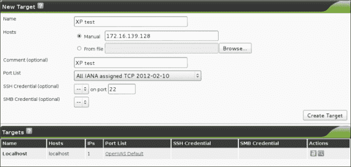

我们需要定义测试的名称、目标范围、可选注释（如果有）、作用域中的端口数，以及可选 SSH 凭据（如果目标是 Linux box）。但是，Windows XP 机箱不允许 SSH 功能。

接下来，我们需要填写详细信息并创建一个目标。但是，当我们点击**创建目标**按钮时，目标将在**目标**列表中可见。

设置目标后，我们需要创建一个新任务，该任务将扫描我们刚刚创建的目标。这可以通过浏览**扫描管理**选项卡并选择**任务**选项来完成。让我们看看单击此选项后屏幕上的输出：

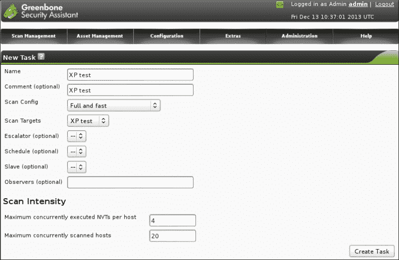

正如我们在前面的屏幕截图中所看到的，我们需要提供**名称**、**注释（可选）**、**扫描配置**（表示扫描的深度）、**扫描目标**（通过选择我们创建的目标完成）、和**扫描强度**测试的结果。设置完所有这些选项后，点击**创建任务**，我们将看到以下输出：

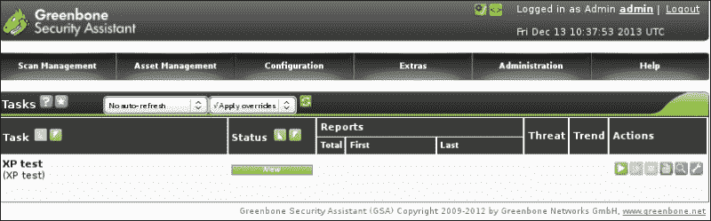

任务创建过程完成后，我们需要从**动作**字段中选择播放按钮来启动任务。这将启动在目标中查找漏洞的测试，并向我们提供与以下屏幕截图类似的信息：

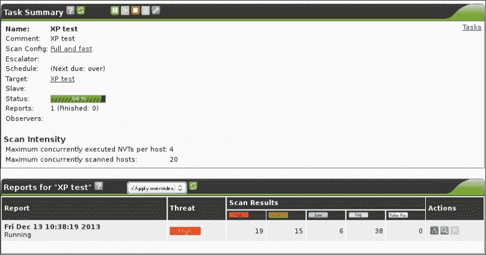

发现的漏洞将分为三类：**高**、**中**和**低**。这些类别表示在目标主机中发现的漏洞的严重性。

完成此任务后，我们可以将报表导出为各种格式，如 PDF、HTML、XML 等。

此报告将包含有关目标系统上发现的每个漏洞的深入信息。此外，将根据报告中的严重性对这些漏洞进行评级，首先显示影响系数最高的漏洞，然后在报告后半部分显示影响程度较低的漏洞。

此外，**Greenbone Security Assistant**以与大多数开发工具（如 Metasploit、Nessus、Nmap 等）兼容的格式输出。

回到主题，我们可以选择合适的格式从**下载**字段下载报告，如下图所示：

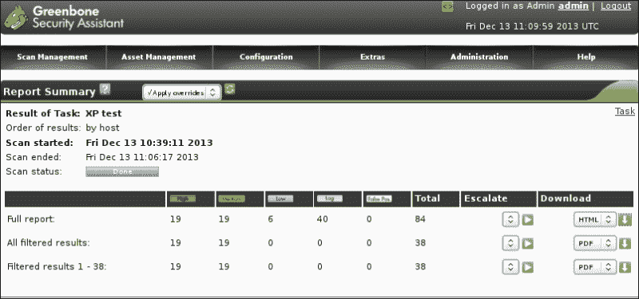

然而，这里需要注意的一点是，如果我们想将此报告导入 Metasploit 框架，我们需要使用 XML 格式导出它。让我们通过选择**XML**作为报告格式，尝试将此报告导入 Metasploit。这将下载 XML 报告。接下来，我们需要快速启动 Metasploit 并使用`db_import`命令和报告文件名开始导入过程，如以下屏幕截图所示：

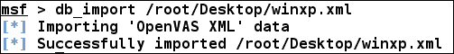

正如我们所看到的，我们已经很容易地将报告导入 Metasploit 数据库。现在让我们看看数据库中有什么：

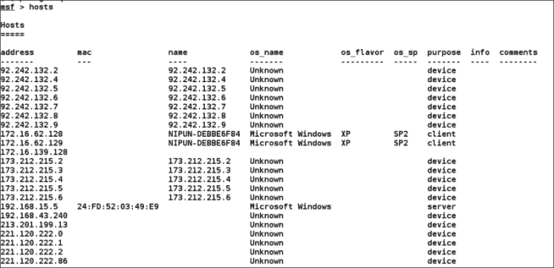

一旦我们在 Metasploit 控制台中提供了`hosts`命令，我们就会看到报告文件中列出的每个主机。但是你好！你可能想知道为什么我们在这里有这么多主机，而我们只扫描`173.16.62.128`。这可能是因为我们将以前使用 Metasploit 进行的扫描的所有结果存储在数据库中，或者它们仍然来自为以前的扫描导入的报告。

我们可以通过在 Metasploit 中创建一个新的`workspace`来解决这个问题。但是，让我们先看看如何在 Metasploit 中使用`workspace`命令：

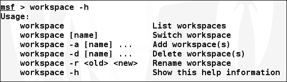

Metasploit 中的`workspace`命令提供了许多不言自明的选项。让我们再走一步，添加一个新的 ORT T1，并将当前的 Ty2 T2 转换成最新的一个：

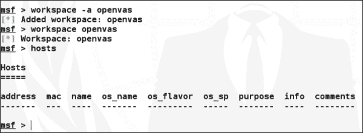

添加新的`workspace`后，让我们重新导入该文件，然后使用`vulns`命令和`–p`开关（表示感兴趣的端口）查看数据库中存储了哪些漏洞，如下图所示：

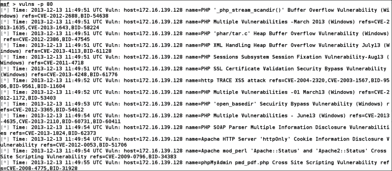

正如我们所看到的，端口 80 上有很多漏洞，这是目标系统的 HTTP 端口。让我们看看 Windows XP 的常见可利用端口 445 上是否有什么漏洞：

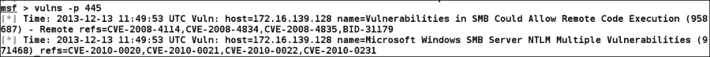

哇！我们在端口 445 上运行 microsoft ds 服务。因此，你可能知道下一步该做什么了吧？使用这种扫描器进行漏洞发现的基本思想是，在系统数量远大于一台或两台单机的网络中，获取有关各种服务的知识。我建议您仅在大型网络、服务器等上使用此类扫描仪。对于扫描单个客户机，这些扫描仪在设置和故障排除方面可能非常耗时。

## 威胁区域建模

在进行渗透测试时，对威胁区域进行建模是一个主要问题。这一阶段的重点是网络的关键领域，这些领域至关重要，需要防止违规。网络或系统中的漏洞取决于威胁区域。我们可能会在一个系统或网络中发现许多漏洞，但那些可能对关键领域造成任何类型影响的漏洞是首要关注的问题。此阶段的重点是过滤可能对资产造成最大影响的漏洞。对威胁区域进行建模将有助于我们针对正确的漏洞集。但是，只有当公司要求或渗透测试人员的合同仅限于外部时，才可以跳过此阶段。

对目标的影响分析也很重要，并且用最高的影响因素标记这些漏洞也是必要的。当网络规模较大且仅需测试关键区域时，对威胁进行建模也很重要。

## 针对可疑易受攻击的系统

在威胁建模之后，下一步是收集目标系统中发现的漏洞的详细信息。发现的漏洞很有可能不易被 Metasploit 利用。其中一些漏洞将要求我们通过模糊易受漏洞攻击的应用程序来开发自己的漏洞攻击，或者学习如何在漏洞受到公开攻击的情况下利用这些漏洞。让我们看看我们之前进行的测试报告，并回顾这一阶段的内容：

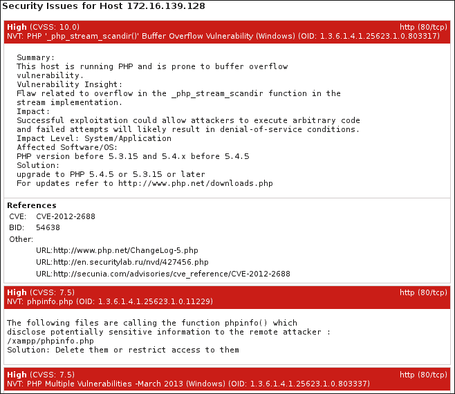

如您所见，我们这里有**PHP 流扫描目录缓冲区溢出**漏洞。但是，我们在 Metasploit 中没有针对这一点的漏洞。在这种情况下，我们需要通过研究参考资料或搜索此漏洞的公开可用漏洞来开发自己的漏洞。

此阶段是下一阶段的设置，即访问目标系统。因此，必须知道哪些漏洞可以使用公共漏洞进行攻击，哪些漏洞可能需要编写自己的攻击代码。

## 进入

进入是最激动人心的阶段。然而，在这里，成功的结果将取决于之前的阶段，例如，我们是否能够清楚地识别关键领域和其中的漏洞。

让我们谈谈我们之前测试过的系统。在这里，我们有这么多的漏洞，但仍然很难找到基于端口 80 的漏洞的漏洞利用，并且需要大量时间来为它们创建漏洞利用。因此，在本例中，我们将尝试利用当前的漏洞获取访问权限。

如前所述，我们发现端口 445 易受攻击。因此，我们需要的是在 Metasploit 中启动良好的旧`ms08_067_netapi`漏洞，并尝试访问目标。但是，如果我们能够通过此漏洞获得访问权限，我们仍将尝试其他漏洞。

此阶段的主要议程是利用系统中可能存在的最大漏洞并获得可能的最高权限。因此，让我们按如下方式快速开发目标系统：

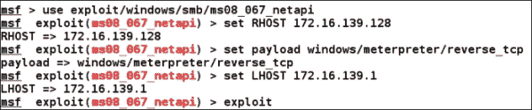

在设置了所有必需的选项后，我们将继续利用目标并获得对其的 MeterMeter 访问，如以下屏幕截图所示：

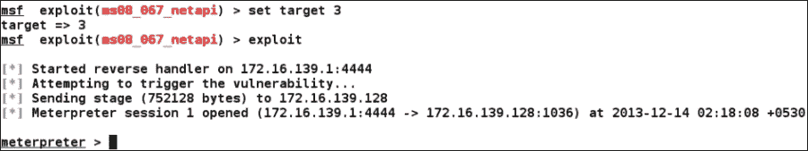

一旦我们获得了对目标系统的访问权，我们要做的第一件事就是向我们的用户授予尽可能高的权限。为此，我们将跳转到`explorer.exe`进程，找到它的进程 ID 并使用 Metasploit 中的`migrate`命令切换到它。然后，我们将使用`getsystem`命令提升特权。让我们看看如何实现这一点：

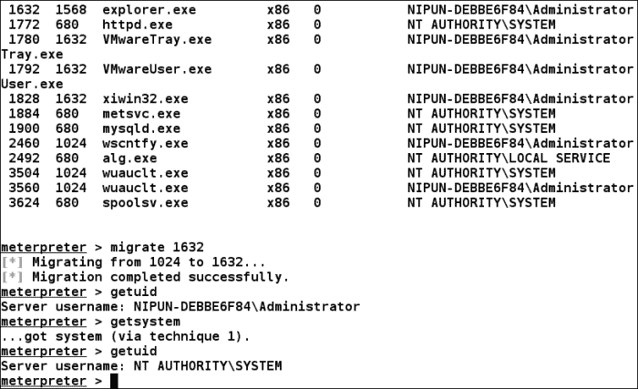

我们将首先使用`ps`命令列出在目标系统上运行的进程。接下来，我们需要**流程识别`explorer.exe`流程的**（**PID**）从被利用流程迁移到`explorer.exe`。一旦我们得到 PID，我们将使用`migrate`命令进行迁移，然后是进程的 PID。但是，迁移完成后，需要使用`getsystem`命令获取系统级权限。

## 覆盖轨道

覆盖轨道可能不是进行白盒试验的必要阶段。但是，我们仍然应该知道如何针对可能出现的不同场景执行此操作。

假设我们必须在目标服务器上编辑一个文件，然后在编辑该文件（可能是一个关键文件，如配置文件或凭据文件）后，我们希望将该文件的上次修改时间设置回实际修改时间（在进行编辑之前）。我们可以使用 Metasploit 中的`timestomp`命令来实现这一点。

整个想法是避开管理员的视线，不让他清楚服务器或个人电脑上的哪些文件被访问和修改。进入系统后，在编辑文件之前，我们需要检查其创建日期、上次修改日期和上次访问时间。让我们看看如何通过`timestomp`实现这一点。但是，在执行此操作之前，让我们先看看在此场景中需要编辑哪些文件：

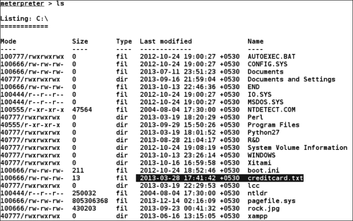

在前面的场景中，我们有一个名为`creditcard.txt`的文件，它的最后修改日期是`2013-03-28`，修改时间是`17:41:42`。一旦打开该文件，其访问时间将更改，如以下屏幕截图所示：

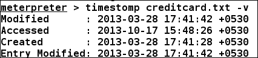

现在，让我们将时间修改为比实际访问时间早的时间，以及其他时间，例如**修改的**时间、**创建的**时间、**条目修改的**时间：

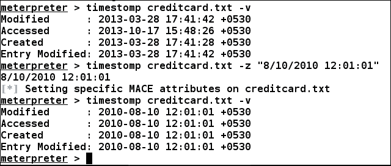

只要我们运行`timestomp`命令，它就将文件的计时修改为我们给定的自定义时间，因此我们能够避开管理员的视线。下一步是从目标系统中删除事件日志。让我们看看这些存储在系统中的位置：

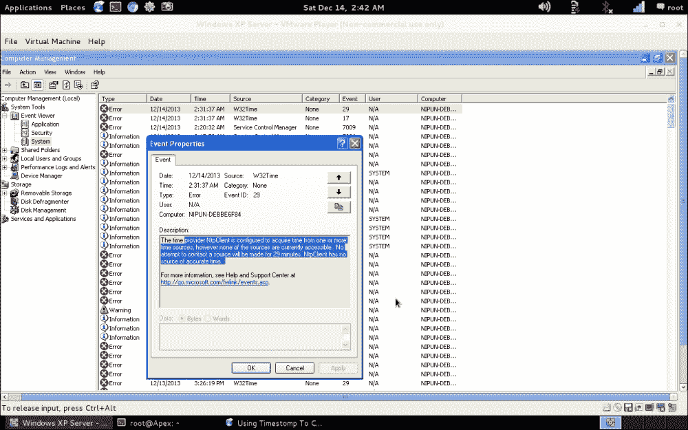

我们可以看到，在**计算机管理**窗口下的**事件查看器**中有大量日志。

名为`event_manager`的后期开发模块将帮助我们使用`–c`开关删除所有这些日志，然后不执行任何操作，这将告诉模块清除所有类型的日志，如以下屏幕截图所示：

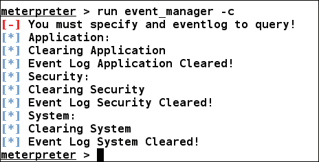

运行`event_manager`命令后，如果有以下日志，请查看**事件管理器**中的日志：

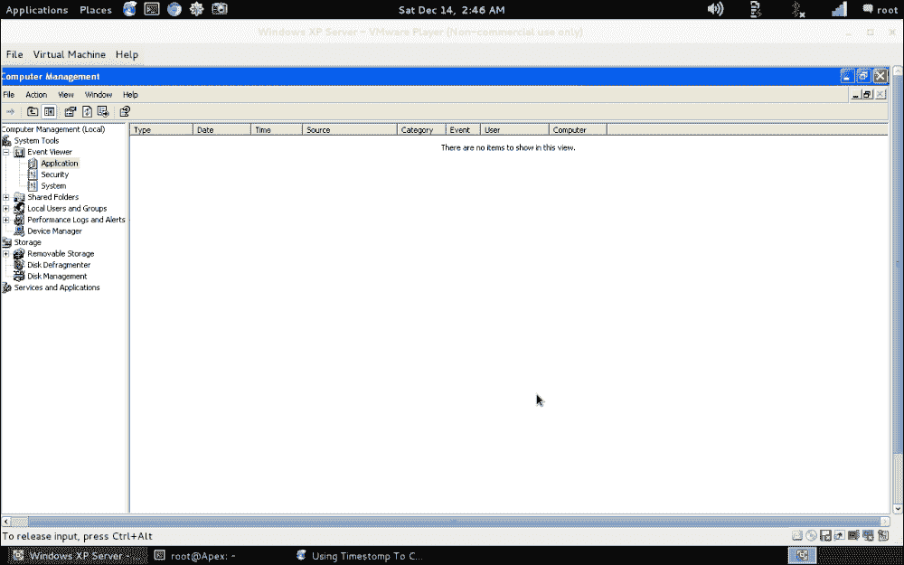

繁荣所有日志都已清除，因此我们已成功从系统中删除所有日志。这些是一些方法，可以帮助你逃避对目标系统的追击。但是，对于基于 Linux 的操作系统，日志位于`/var`下的`logs`目录中。

### 注

有关 Linux 日志的更多信息，请参阅[http://www.cyberciti.biz/faq/linux-log-files-location-and-how-do-i-view-logs-files/](http://www.cyberciti.biz/faq/linux-log-files-location-and-how-do-i-view-logs-files/) 。

## 介绍 MagicTree

**MagicTree**是一个常用的报告工具，可用于管理渗透测试结果。它的流行是因为它可以直接用于在后台发送系统级命令。这里我们需要做的第一件事是将 Metasploit 结果从数据库导出到 XML 文件中，这样就可以轻松地将其移植到 MagicTree 中。MagicTree 支持从常用工具（如 Nmap、Metasploit、OpenVAS、Burp Suite 等）生成的各种报告。

现在，我们将 Metasploit 数据库中的结果导出到一个 XML 文件中，并使用以下命令将该文件加载到 MagicTree 中：

```
msf>db_export -f xml /root/Desktop/winxptest.xml

```

成功生成报告后，我们需要打开 MagicTree 并导入报告。MagicTree 的界面看起来类似于以下屏幕截图：

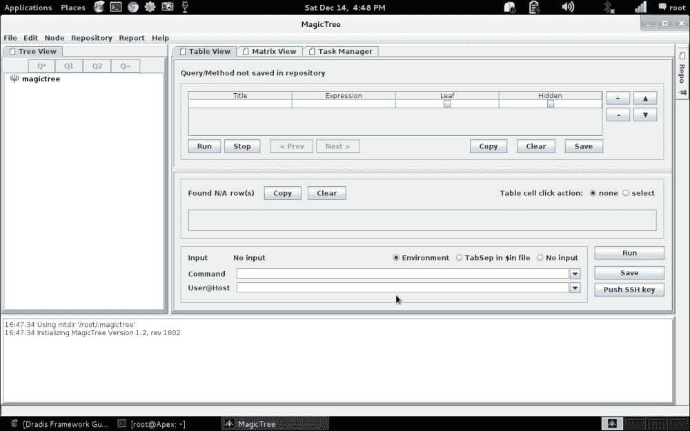

我们可以在**文件**菜单下选择**打开**加载报表。加载报告后，我们将清楚地看到它已被安排在层次树结构中，定义了测试的清晰分解，如以下屏幕截图所示：

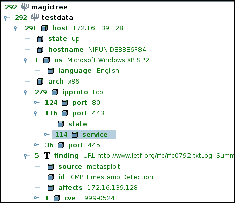

创建报表只需浏览**报表**页签，选择**生成报表**。然而，在大型渗透测试的实例中，我们可以使用搜索表达式过滤掉我们需要的信息。让我们看一个示例，该示例显示如何生成语法以从报表中查找自定义信息：

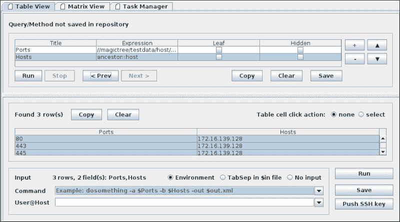

要做的第一件事是通过在**标题**字段中输入所需的列名来设计列。下一步是定义表达式，该表达式将计算出这些列的条目。

### 注

这里需要注意的一点是，MagicTree 中的表达式可能看起来像一种可怕的语法。然而，这一点也不可怕，而且很容易掌握。这种语法的想法是为了更好地控制结果和进行更好的过滤。为了过滤掉端口，我们可以使用`//magictree/testdata/host/ipproto/*`表达式，告诉软件浏览到树的根，这在这里由层次结构后面的前导`//`表示。要查找所有结果，我们可以使用`*`。

### 提示

要了解有关 MagicTree 语法的更多信息，请参阅[http://www.gremwell.com/magictreedoc/2ac07abf.html](http://www.gremwell.com/magictreedoc/2ac07abf.html) 。

## 其他报告服务

除了 MagicTree 之外，还有其他用于报告的工具：**Dradis 框架**（[http://dradisframework.org](http://dradisframework.org) 和**OWASP 报表生成器**[https://www.owasp.org/index.php/ORG_（OWASP 报告生成器](https://www.owasp.org/index.php/ORG_(OWASP_Report_Generator)。建议您也使用这两种工具。

# 生成人工报表

现在让我们讨论如何创建渗透测试报告，看看要包括什么、应该包括在哪里、应该添加什么和删除什么、报告的格式、图表的使用等等。渗透测试的报告由许多人阅读，例如经理、管理员和高层管理人员。因此，有必要将事情组织得足够好，以便报告需要传达给人们的信息是正确的，并且被目标受众理解。

## 报告的格式

良好的贯入度测试报告可按以下格式分解：

*   页面设计
*   文件控制
    *   封面
    *   文档属性
*   报告内容一览表
    *   目录
    *   插图清单
*   执行摘要
    *   渗透测试的范围
    *   严重性信息
    *   目标
    *   作出的假设
    *   漏洞分布图摘要
    *   建议摘要
*   方法/网络管理员级报告
    *   测试细节
    *   漏洞列表
    *   可能
    *   建议
*   工具书类
*   术语汇编

下面是一些步骤的简要说明。本节后面将更详细地讨论一些重要步骤：

*   **页面设计**：通常情况下，页面设计是指选择报表中使用的字体、页眉和页脚、颜色等
*   **文控**：这里介绍报表的一般属性
*   **封面**：此由报告名称、版本、时间日期、目标组织、序列号等组成
*   **文档属性**：此包含报告的标题、测试人员姓名以及审查此报告的人员姓名
*   **报表内容列表**：此包含报表内容，并有明确的页码关联
*   **目录**：通常情况下，包含从报告开始到结束的所有组织内容的列表
*   **插图清单**：本节将列出报告中使用的所有图表，并附上相应的页码

### 执行摘要

执行摘要包括本报告的全部摘要，采用普通文本和非技术性文本，重点是向公司高级员工提供知识。它通常包含以下信息：

*   **渗透测试的范围**：本节包括进行的测试类型和测试的系统。通常，本节列出了所有测试的 IP 范围。此外，本节还包含有关测试的严重性信息。
*   **目标**：本节将定义测试将如何帮助目标组织、测试的好处等。
*   **做出的假设**：如果在测试期间做出了任何假设，则将在此处列出。例如，假设在测试网站时在管理面板中发现 XSS 漏洞，但要执行该漏洞，我们需要以管理员权限登录。如果是这样的话，我们要做的假设是，我们需要用管理员权限登录来执行这个攻击向量。
*   **漏洞概述**：此以表格形式提供信息，并根据高、中、低风险描述发现的漏洞数量。根据对资产造成最大影响的漏洞到影响较小的漏洞进行排序。但是，此阶段包含针对多个系统的多个问题场景的漏洞分布图。下表中可以看到一个例子：

    <colgroup><col style="text-align: left"><col style="text-align: left"></colgroup>
    | 

    影响

     | 

    漏洞数量

     |
    | --- | --- |
    | 高的 | 19 |
    | 中等的 | 15 |
    | 低的 | 10 |

*   **建议摘要**：本节中的建议仅针对影响因子最高的漏洞，并相应列出。

### 方法/网络管理员级报告

本报告的部分包括渗透测试期间执行的步骤、漏洞的详细信息和建议。通常，以下信息是网络管理员感兴趣的部分：

*   **测试详情**：本报告的部分以图形、图表和表格的形式包含与测试总结相关的信息，包括漏洞、风险因素以及受这些漏洞影响的系统。
*   **漏洞列表**：报告的部分包括漏洞的详细信息、漏洞的位置以及漏洞的主要原因。
*   **可能性**：此部分解释了这些漏洞被攻击者攻击的可能性。这是通过分析触发特定漏洞的易访问性，并找出针对可攻击漏洞的最简单和最困难的测试来实现的。
*   **建议**：本节将列出修补漏洞的建议。如果渗透测试不推荐修补，则仅视为完成一半。

### 附加部分

*   **参考文献**：所有在编制报告时引用的参考文献都将列在这里。参考文献（如书籍、网站、文章等）应明确定义作者姓名、出版物名称、出版年份/发表文章日期等。
*   **术语表**：本报告中使用的所有技术术语将在此列出，并说明其含义。

# 进行黑箱渗透测试

黑盒渗透测试是在我们不了解目标的操作系统细节、web 服务器技术、后端数据库等情况下进行的。因此，在这些情况下，我们需要自己完成所有事情。黑盒测试通常包含太多的误报，因此渗透测试人员有责任找出并验证它们。

让我们看看使用 Metasploit 对网站进行黑盒测试时需要的各种步骤和工具。

## 脚印

如前所述，足迹指使用主动或被动技术收集有关目标的信息。让我们看看如何使用行业中的各种常用工具来实现目标。

### 使用 Dmitry 进行脚印

**Dmitry**是一个内置于 Backtrack 和 Kali Linux 等安全发行版中的命令行工具。此工具是查找有关目标网站或 web 服务器信息的重要资源。通过分析该工具在以下场景中的工作方式，让我们看看如何使用该工具执行一些进一步的操作。

#### 详情和信息是谁

**WHOIS**可以使用该工具执行，该工具可以避免使用各种网站检索 WHOIS 数据。但是，WHOIS 查询会发现诸如所有者名称、**域名系统**（**DNS**）服务器条目、重要联系方式和目标地址等信息。

让我们看看如何执行 WHOIS 查询；用于此操作的命令如下所示：

```
root@Apex:~#dmitry –i –w www.nipunjaswal.info

```

运行上述命令时，我们将看到以下信息集：

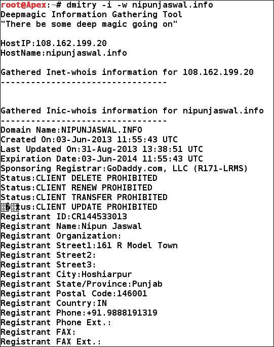

从前面的输出中我们可以清楚地看到，我们获得了关于目标的所有 WHOIS 信息。这对于查找重要的联系号码、电子邮件、地址等详细信息非常方便。这种类型的足迹通常被认为是被动足迹，因为我们没有连接到目标。

#### 寻找子域

如果能够正确地发现特定网站的子域，那么子域非常方便，因为大多数组织都关注其主网站的安全机制，而不是子域。这确实吸引了黑客和黑帽们攻下一个子域名，并从那里提升到主站点。因此，有必要在目标上执行反向 IP 查找并查找所有其他域。

我们可以使用 Dmitry 本身执行扫描，以使用`–s`开关查找有关子域的信息。让我们看看我们如何才能真正做到这一点：

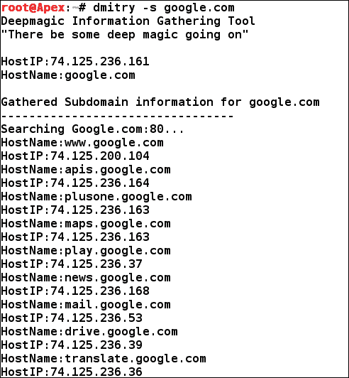

#### 电子邮件收集

了解组织使用的各种电子邮件地址的信息，有助于我们更好地了解客户使用的各种地址；然而，进行客户端开发是非常有用的。找到的电子邮件地址可用于执行电子邮件轰炸、电子邮件欺骗等。

要查找组织当前使用的电子邮件地址，我们需要使用 Metasploit 中内置的名为`search_email_collector`的强大模块。

让我们看看如何使用`search_email_collector`执行电子邮件收集：


我们所需要做的就是设置`DOMAIN`属性，它将收集各种电子邮件地址的信息，如下面的屏幕截图所示：

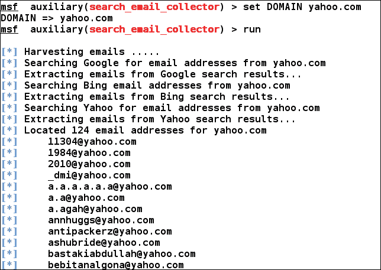

这使得我们只需在 Metasploit 中运行`search_email_collector`模块，就可以获得有关各种电子邮件的信息。

#### 带 Metasploit 的 DNS 枚举

在对网站进行预测试时，枚举有关域名服务器的信息也很方便。这可以通过`enum_dns`Metasploit 模块完成。让我们看看如何使用 Metasploit 执行 DNS 枚举：

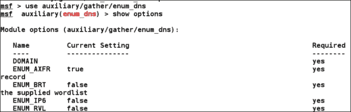

设置`DOMAIN`参数后，我们都可以运行模块。让我们快速运行模块并分析结果：


## 使用 Metasploit 进行黑盒测试

我们现在已经完成了目标系统上的基本足迹。现在让我们考虑一个虚拟场景，并从黑盒测试方法开始。在这种情况下，客户要求我们对他们的网站进行黑盒测试，他或她希望检查网站是否存在漏洞，即使客户非常确定开发团队的编程技能，并且他或她对当前实施的安全措施非常满意。

在使用之前的机制收集有关目标的基本信息后，我们发现该网站正在将我们重定向到另一个 IP 地址，该地址可能是内部虚拟 IP 地址，也可能是完全不同的服务器。因此，大多数扫描工具无法正常工作，因为它们没有扫描重定向的 IP 地址。相反，他们正在扫描负责重定向的 IP 地址。让我们以图解的方式来看这个场景：

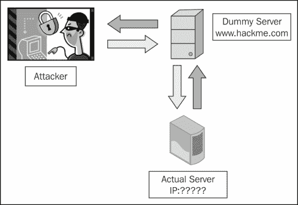

让我们先扫描虚拟服务器，看看可以从中获得哪些详细信息：

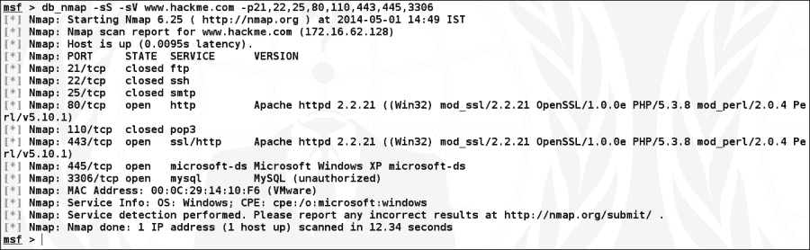

分析结果后，我们发现目标虚拟服务器运行在易受 Metasploit 中的`ms08_067_netapi`攻击的 Windows XP 操作系统上，目标服务器运行在`172.16.62.128`。让我们使用 Metasploit 攻击此漏洞：

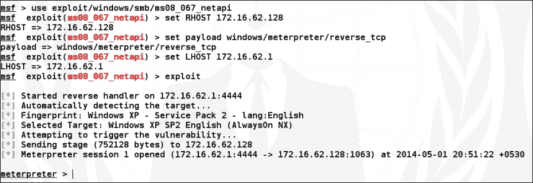

我们成功地利用了目标。通过分析被攻击系统的`C`驱动器，我们发现服务器运行在 XAMPP 上，即 HTTP/HTTPS 服务器软件。接下来，我们浏览 XAMPP 的`htdocs`文件夹，找到将所有请求重定向到何处的脚本。以下命令将帮助我们找到并查看脚本：

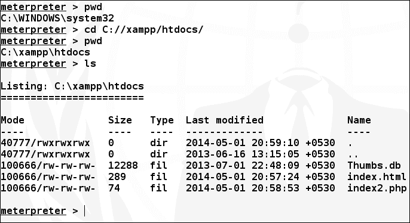

我们可以清楚地看到这里有两个 PHP 页面脚本，`index.html`和`index2.php`。通过分析这两个脚本，我们发现`index.html`脚本只不过是`index2.php`脚本的框架持有者。`index2.php`脚本是一个重定向脚本。但是，我们通过如下分析脚本发现了这一点：

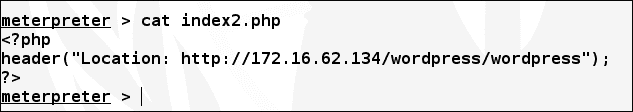

通过分析前面的脚本，我们发现虚拟服务器正在将浏览器重定向到另一台服务器，该服务器位于`http://172.16.62.134`。但是，当我们尝试扫描此地址时，扫描过程失败。此结果表示实际服务器仅对通过此服务器发出的请求可用。因此，除了虚拟服务器之外，没有人可以直接连接到实际服务器。在这种情况下，我们需要通过虚拟服务器转向实际服务器。我们可以通过在虚拟服务器的 MeterMeter 外壳上设置一个代理并通过它传递所有请求来实现这一点。

### 旋转到目标

因此，我们首先使用`route`命令通过 MeterMeter 会话创建到实际服务器的路由，如下所示：


如我们所见，我们通过在命令末尾提供会话 ID`1`，使用 MeterMeter 会话将路由添加到实际服务器。但是，为了找到会话 ID，我们可以运行`sessions`命令查看各种可用会话。

接下来，Metasploit 提供了一个很好的辅助模块，`auxiliary/server/socks4a`，它可以帮助我们通过虚拟服务器将数据从系统传递到实际服务器，从而实现我们的目标。让我们看看如何设置此模块：

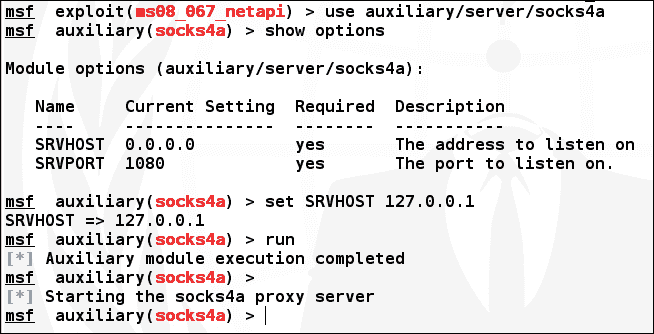

从前面的屏幕截图可以看出，我们需要在系统上设置一个本地端口，该端口将通过虚拟服务器上的 MeterMeter 外壳将各种工具的所有数据代理到实际的目标主机。

让我们在系统的`etc`文件夹下的`proxychains.conf`文件中快速配置辅助模块的设置，这样我们就可以轻松地传递各种工具的数据，而无需配置每个工具的代理设置。在从命令行启动工具时，将`proxychains`作为后缀嵌入将自动配置工具以使用 proxychains 并通过它传递所有请求。让我们按如下方式配置该文件：


### 使用 proxychains 和 db\u nmap 扫描隐藏目标

现在让我们打开 Metasploit，并根据各种测试测试实际服务器，这些测试我们以前由于虚拟服务器的存在而无法执行：

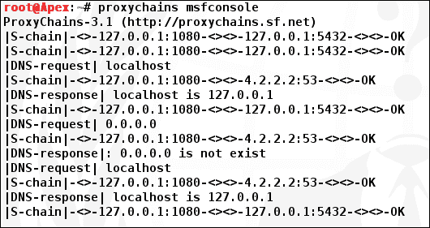

我们可以看到，我们在启动 Metasploit 时使用了`proxychains`后缀。这将自动配置 Metasploit 以使用 proxychains，我们在前面使用 Metasploit 中的`auxiliary/server/socks4a`模块设置了 proxychains。因此，Metasploit 发出的任何请求都将通过虚拟服务器上的 MeterMeter 外壳。

现在我们通过`172.16.62.128`使用 Nmap 扫描`172.16.62.134`处的实际目标：

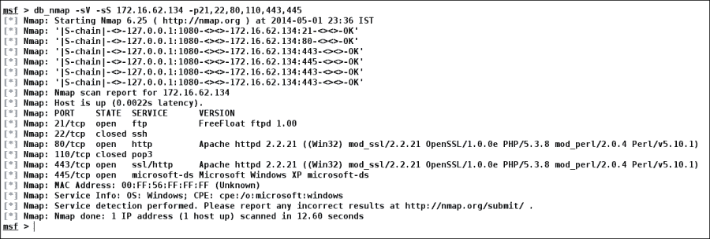

正如我们所看到的，我们已经进行了一次**SYN**扫描，在常见的开放端口上进行了服务检测。我们可以看到 proxychains 在这里运行，数据正在通过虚拟服务器上的 MeterMeter。我们发现服务器正在运行**FreeFloat ftpd 1.0**服务器进行 FTP 操作。

### 使用 Nessus 进行漏洞扫描

现在让我们从 Metasploit 运行 Nessus，以查找开放端口上可能存在的各种漏洞：

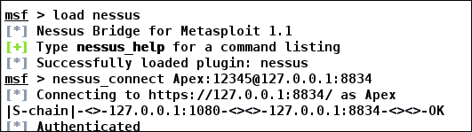

可以使用`load nessus`命令将 Nessus 加载到 Metasploit 中。接下来，我们需要提供 Nessus 登录 Metasploit 的凭据，以便它可以从特定用户访问扫描类型、报告和策略等功能。

要开始扫描，我们需要一个策略列表。让我们使用`nessus_policy_list`命令列出用户帐户中已经存在的所有策略。接下来，我们需要对存储在 Metasploit 数据库中的信息执行 Nessus 扫描。但是，通过之前使用 Nmap 扫描目标，我们已经在数据库中获得了此信息，如以下屏幕截图所示：

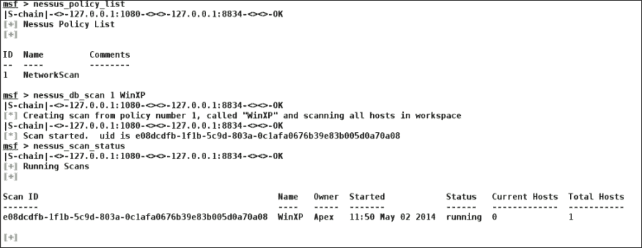

正如我们所看到的，我们已经成功地对存储在数据库中的 Nmap 结果发起了攻击，方法是启动`nessus_db_scan`命令，后跟策略编号和测试名称。

我们可以通过发出`nessus_scan_status`命令来检查 Nessus 扫描的状态。扫描完成后，我们可以通过发出`nessus_report_list`命令找到它的报告。此命令将帮助我们找到刚刚执行的测试的报告 ID，如以下屏幕截图所示：

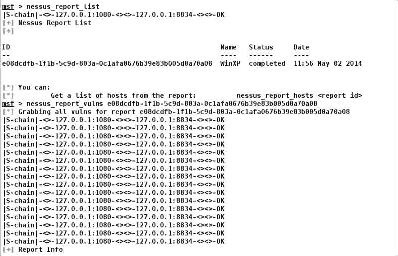

现在我们有了报告 ID，让我们使用`nessus_report_vulns`命令和报告 ID 查找目标上的所有漏洞：

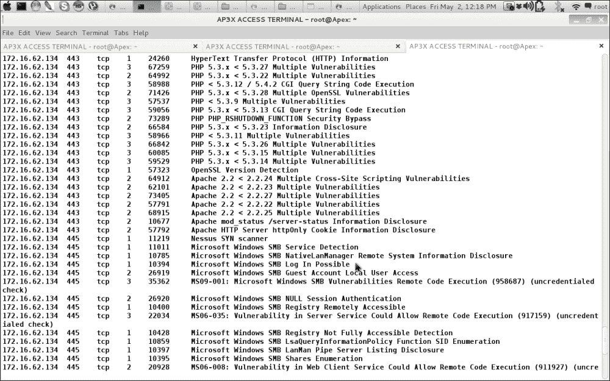

通过发出`nessus_report_vulns`命令，我们可以清楚地看到目标上发现的所有漏洞。让我们采取进一步的步骤，并将该报告导入到 MyasPoLIT 数据库中，使用 ORYT1 命令：


现在，让我们通过发出`Vulns`命令来检查 Metasploit 数据库中的各种漏洞：

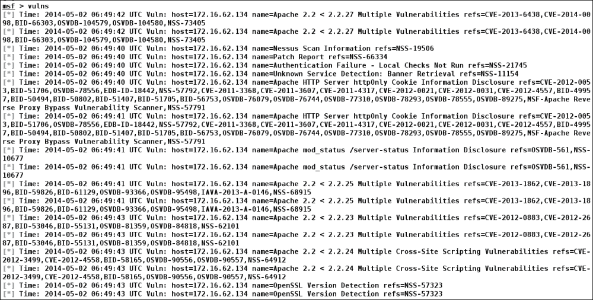

### 挖掘隐藏目标

正如我们所看到的，我们可以轻松地将所有漏洞导入 Metasploit。让我们针对**自由浮动 FTP 服务器 1.0**中的 FTP 漏洞，使用 Metasploit 进行攻击：

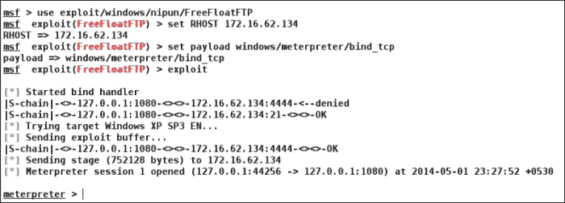

### 提升特权

猛敲我们有访问实际服务器的权限。让我们快速地将访问迁移到一个可靠的流程中，并提升目标的权限：

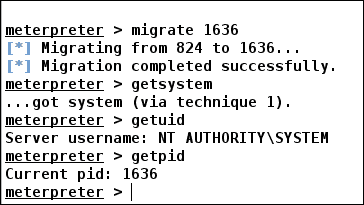

我们很容易访问目标并提升了权限。我们的黑盒测试到此结束。但是，让我们看看该场景的图解视图：

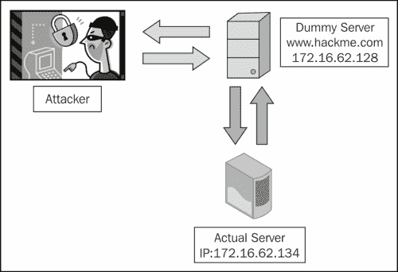

我们可以看到，现在虚拟服务器代表他或她将我们的请求传递给目标，而不仅仅是将我们重定向到该服务器。但是，您应该尝试利用所有可能的漏洞，而不是单个漏洞，因为议程是找出目标中可能存在的最大漏洞。要创建类似于前一个场景的场景，您需要以下内容：

*   两台 Windows XP 虚拟机
*   两台机器上都有一台 XAMPP 服务器
*   第一台机器上有两个网页：
    *   与第二个文件具有帧的文件
    *   第二个，带有 PHP 头，指向第二个虚拟机上的实际网站
*   对第二台机器上的`httpd.conf`文件进行修改，以仅允许从第一台机器进行连接
*   第二个虚拟机上的自由浮动 ftp 服务器

# 总结

在本章中，我们涵盖了大量的主题，我们已经了解了如何有效地执行黑盒测试和白盒测试。我们还了解了如何格式化报告，还了解了如何旋转网络、设置代理链、通过 MeterMeter 外壳重定向数据、从 Metasploit 执行 Nessus 和 Nmap 扫描以及将结果导入 Metasploit 数据库。

在下一章中，我们将了解如何执行基于客户端的攻击并对目标客户端执行高级攻击。