# 第 10 章：阿米蒂奇的视觉化

在上一章中，我们已经介绍了如何加速渗透测试。让我们继续使用另一个伟大的工具，它也可以用来加速渗透测试。**Armitage**是一个 GUI 工具，充当 Metasploit 的攻击管理器。Armitage 将 Metasploit 操作可视化，并根据它所做的测试，Armitage 还建议使用漏洞攻击。Armitage 最有能力提供对 Metasploit 和团队管理的共享访问。

在本章中，我们将介绍阿米蒂奇及其特点。我们还将研究如何使用这个支持 GUI 的 Metasploit 工具进行渗透测试。在本章的后半部分，我们将介绍 Armitage 的 Cortana 脚本。

在本章中，我们将介绍以下要点：

*   用 Armitage 进行渗透测试
*   在 Armitage 中使用远程和客户端漏洞进行攻击
*   扫描网络和主机管理
*   使用阿米蒂奇进行后期开发
*   Cortana 脚本的基础知识
*   在 Armitage 中使用 Cortana 脚本进行攻击

那么，让我们从 Armitage 开始我们的渗透测试之旅。

# 阿米蒂奇的基本原理

Armitage 是一个攻击管理器工具，它以图形化的方式自动化 Metasploit。作为一个 Java 构建的应用程序，Armitage 由 Raphael Mudge 创建。它是一个跨平台的工具，可以在 Linux 和 Windows 系统上运行。

## 开始

在本章中，我们将在 Kali Linux 中使用 Armitage。要启动 Armitage，请执行以下步骤：

1.  Open a terminal and type in the `armitage` command as shown in the following screenshot:

    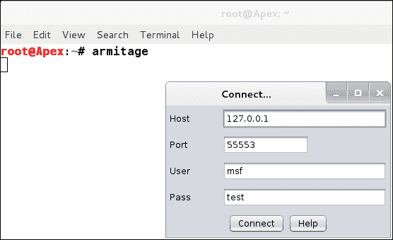

2.  点击弹出框中的**连接**建立连接。
3.  In order to start Armitage, Metasploit's **Remote Procedure Call** (**RPC**) server should be running. As soon as we click on **Connect** in the previous pop up, a new pop up will occur and ask if we want to start Metasploit's RPC server. Click on **Yes** as shown in the following screenshot:

    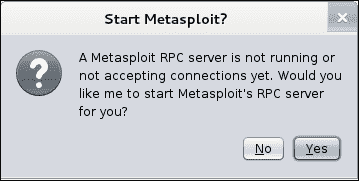

4.  It takes a little time to get Metasploit RPC server up and running. During this process, we will see messages such as, **Connection refused**, time and again. This is because Armitage keeps checking if the connection is established or not. This is shown in the following screenshot:

    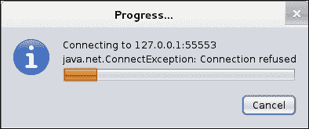

启动 Armitage 时需要记住的一些要点如下：

*   确保您是 root 用户
*   对于 KALI Linux 用户，请考虑键入以下命令：启动 PostgreSQL 数据库服务和 Meta ASP 服务：

### 注

有关 Armitage 启动错误的更多信息，请访问[http://www.fastandeasyhacking.com/start](http://www.fastandeasyhacking.com/start) 。

## 浏览用户界面

如果连接建立正确，我们将看到 Armitage 接口面板。它将类似于以下屏幕截图：

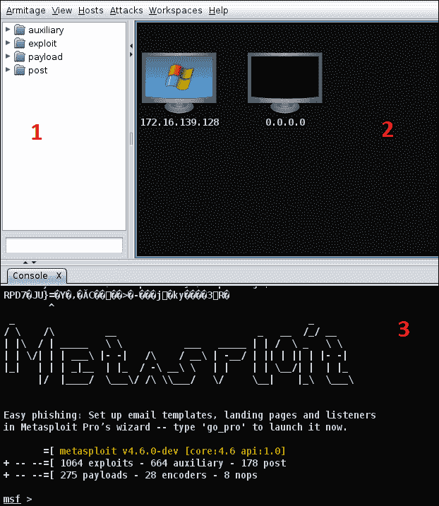

Armitage 的界面非常简单，它主要包含三个不同的窗格，如前面的屏幕截图所示。让我们看看这三个窗格应该做什么：

*   第一个窗格包含对 Metasploit 提供的所有各种模块的引用：**辅助**、**利用**、**有效载荷**和**post**。我们可以浏览层次结构本身中的每一个模块，并可以双击以立即启动我们选择的模块。此外，在第一个窗格的正下方，有一个小输入框，我们可以使用它立即搜索模块，而无需探索层次结构。
*   第二个窗格显示网络上存在的所有主机。此窗格通常以图形格式显示主机，例如，它将运行 Windows 操作系统的系统显示为带有 Windows 徽标的监视器。类似地，Linux 操作系统的 Linux 徽标，以及 MAC 上运行的其他系统的其他徽标，等等。它还将显示带有打印机符号的打印机，这是 Armitage 的一个重要功能，因为它可以帮助我们识别网络上的设备。
*   第三个窗格将显示执行的所有操作、利用后流程、扫描流程、Metasploit 控制台以及利用后模块的结果。

## 管理工作空间

正如我们在前面的章节中已经看到的，工作区用于管理各种不同的攻击配置文件，而无需合并结果。假设我们在一个范围内工作，出于某种原因，我们需要停止测试并测试另一个范围。在本例中，我们将创建一个新的工作区，并使用该工作区测试新的范围，以保持结果的整洁和组织。但是，在这个工作区中完成工作后，我们可以切换到另一个工作区。切换工作区将自动加载加载的工作区中存在的所有数据。此功能将有助于单独保存所有扫描的数据，防止从各种扫描中合并数据。

要创建新的工作区，请导航到**工作区**选项卡，然后单击**管理**。这将向我们展示**工作区**选项卡，如以下屏幕截图所示：

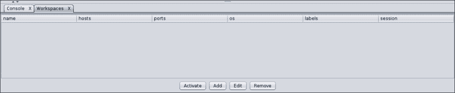

Armitage 的第三个窗格中将打开一个新选项卡，这将有助于显示有关工作空间的所有信息。我们将不会看到此处列出的任何内容，因为我们尚未创建任何工作区。

那么，让我们通过点击**添加**来创建一个工作区，如下图所示：

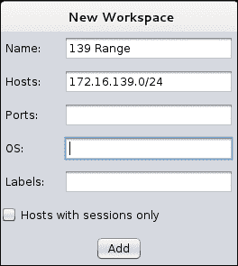

我们可以添加任何名称的工作区。假设我们瞄准两个范围，并为第一个范围创建一个工作区，该范围具有`x.x.139.x`地址。让我们把它命名为`139 Range`并在这里添加将要测试的主机的范围。让我们对第二个范围重复相同的操作，它有`x.x.62.x`地址并将其命名为`62 Range`。现在，让我们看看添加这两个范围后，**工作区**选项卡的外观：

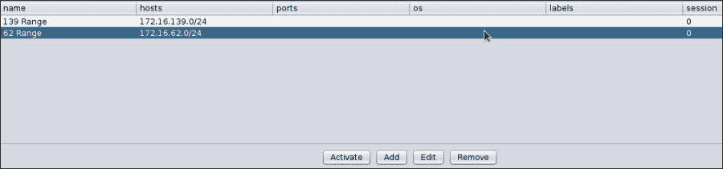

通过选择所需的工作区并点击**激活**按钮，我们可以随时在工作区之间切换。在接下来的几次练习中，我们将学习第二个范围`62 Range`。

# 扫描网络及主机管理

Armitage 有一个名为**主机**的单独选项卡，用于管理主机和扫描主机。我们可以通过点击**主机**选项卡中的**导入主机**将主机导入到阿米蒂奇，也可以通过点击**主机**选项卡中的**添加主机**选项手动添加主机。

Armitage 还提供了扫描主机的选项。这些扫描有两种类型：**Nmap 扫描**和**MSF 扫描**。MSF 扫描使用 Metasploit 中的各种端口和服务扫描模块，而 Nmap 扫描使用流行的端口扫描工具**网络映射器**（**Nmap**）。

让我们通过从**主机**选项卡的 Nmap 扫描中选择**密集扫描**选项来扫描网络。但是，单击**密集扫描**，Armitage 将显示一个弹出窗口，询问目标范围，如以下屏幕截图所示：

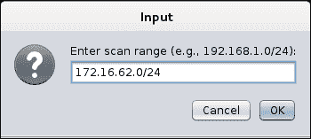

一旦进入目标范围，Nmap 将开始扫描网络以识别端口、服务和操作系统。我们可以在界面的第三个窗格中查看扫描详细信息，如下所示：

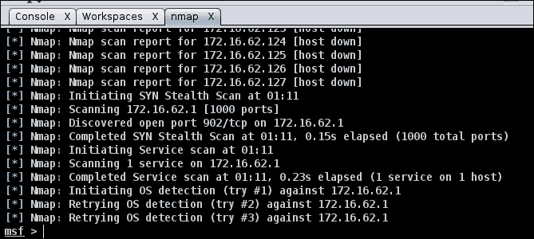

扫描完成后，目标网络上的每台主机将以代表主机操作系统的图标的形式出现在界面的第二个窗格，如下图所示：

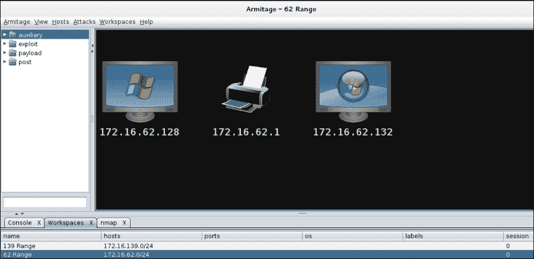

在前面的屏幕截图中，我们有一个 Windows XP 系统、一台打印机和一个在目标范围内运行的 Windows 7 系统。让我们看看目标上正在运行哪些服务。

## 建立漏洞模型

让我们通过右键单击所需主机并单击**服务**来查看目标范围内的主机上正在运行哪些服务。结果应类似于以下屏幕截图：

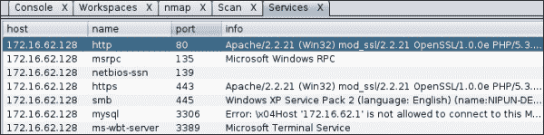

我们可以看到很多服务在第一台主机`172.16.62.128`上运行，比如微软 ds 即**smb**和**Apache/2.2.21**服务器，它们分别运行在端口**445**和**80**上。当主机运行在 Windows XP 设备上时，这些端口很容易捕获。让我们通过指示 Armitage 为这些服务查找匹配的漏洞利用，以其中一个服务为目标。

## 找到匹配项

我们可以通过选择主机，然后浏览**攻击**选项卡并点击**查找攻击**来找到目标的匹配漏洞。**查找攻击**选项将利用数据库与目标主机上运行的服务相匹配。但是，在 Armitage 完成所有服务与漏洞数据库的匹配后，它将生成一个弹出窗口，如以下屏幕截图所示：

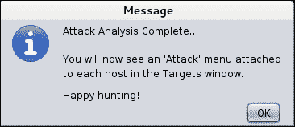

点击**确定**后，我们可以看到，只要右键点击主机，菜单中就会出现一个名为**攻击**的新选项。此子菜单将显示我们可以在目标主机上启动的所有匹配利用模块。

# 利用阿米蒂奇进行开发

当**攻击**菜单对主机可用后，我们都准备攻击目标。让我们瞄准通常被利用的端口 445，它通过从**攻击**菜单浏览`ms08_067_netapi`漏洞来运行`microsoft-ds`服务。点击**利用**选项将出现一个新的弹出窗口，显示所有设置。让我们按如下方式设置所有必需的选项：

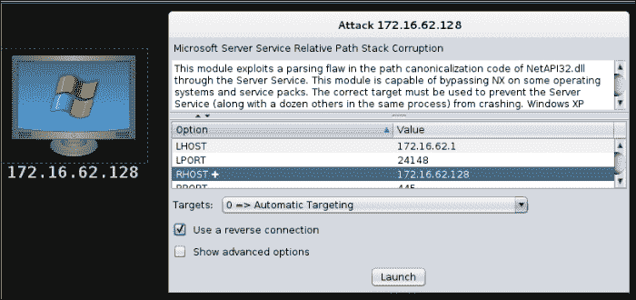

设置完所有选项后，点击**启动**对目标运行漏洞利用模块。启动**漏洞**模块后，我们将能够在界面的第三个窗格中看到正在对目标进行的漏洞利用，如下图所示：

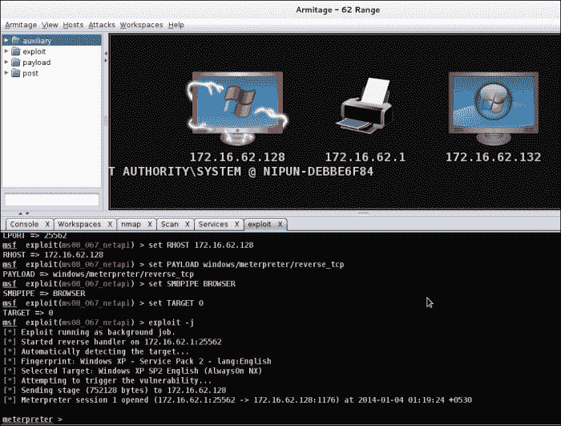

我们可以看到 MeterMeter 的启动，这表示成功利用了目标。此外，目标主机的图标变为红色，表示拥有该主机。

# 使用 Armitage 进行后期开发

Armitage 使后期开发与点击按钮一样简单。要执行开发后模块，请右键单击被开发主机并选择**MeterMeter 5**，如下所示：

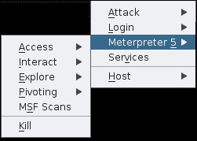

选择**MeterMeter**将以部分形式呈现所有开发后模块。假设我们想要提升权限或获得系统级访问权限，我们将导航到**访问**子菜单，并根据需要单击相应的按钮。

**交互**子菜单将提供获取命令提示、另一个流量计等选项。**探索**子菜单将提供**浏览文件**、**显示流程**、**记录击键**、**屏幕截图**、**网络摄像头截图**和**Post 模块**等选项，用于启动这些子菜单中不存在的其他开发后模块。这显示在以下屏幕截图中：

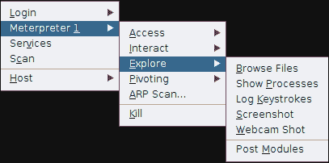

我们通过点击**浏览文件**来运行一个简单的后期开发模块，如下图所示：

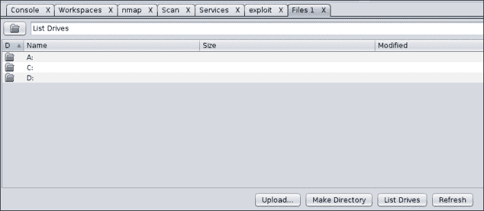

通过点击相应按钮，我们可以轻松上传、下载和查看目标系统上我们想要的任何文件。这就是阿米蒂奇的魅力所在，它远离命令，以图形格式呈现一切。

这就结束了我们对 Armitage 的远程攻击。让我们用 Armitage 扩展我们的方法，实现基于客户端的开发。

# 用阿米蒂奇攻击客户端

客户端攻击要求受害者采取行动，正如我们在过去几章中多次看到的那样。我们将攻击在 Windows 7 系统上运行的网络中的第二台主机。在这次攻击中，我们将创建一个简单的负载，将其发送给受害者，并通过为传入连接设置侦听器等待受害者打开我们的负载文件。在前面的章节中，我们已经使用 Metasploit、SET 等多次进行了此攻击，因此我们对该攻击更为熟悉。在下面的讨论中，我们将看到当我们使用 GUI 而不是命令行创建有效负载时，实际的区别是什么。

因此，让我们看看如何通过执行以下步骤来创建有效负载和侦听器：

1.  Search for a payload or browse the hierarchy to find the payload that we want to use. In the context of our current scenario, we will use the meterpreter **reverse_tcp** payload as follows:

    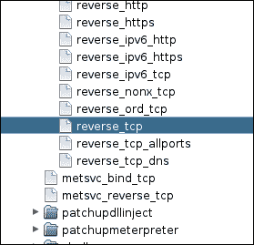

2.  In order to use the selected payload, double-click on the payload. However, double-clicking on the selected payload will display a pop up that shows all the settings that a particular payload requires, as shown in the following screenshot:

    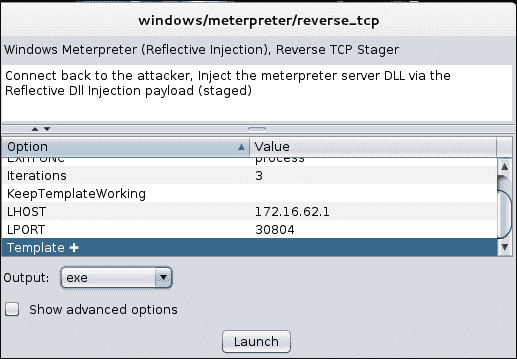

3.  Complete the options such as **LHOST** and **LPORT**, and then choose the **Output** format as required. We have a Windows host as a victim here, so we will select **exe** as the **Output** format; this denotes an executable file. After setting all the required options, click on **Launch** to create a payload. However, this will launch another pop up, as shown in the following screenshot:

    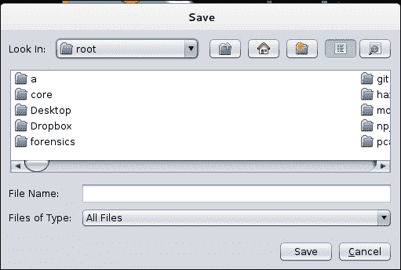

4.  在这一步中，阿米蒂奇将要求我们保存生成的有效载荷。我们将键入所需的文件名并保存该文件。接下来，我们需要设置一个侦听器，该侦听器将处理攻击后从目标主机进行的所有通信，并允许我们与主机进行交互。
5.  In order to create a payload, navigate to the **Armitage** tab and select **Listeners**. This will generate a pop up that asks for the **Port** number and **Type** of the listener, as shown in the following screenshot:

    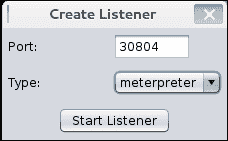

6.  输入端口号为`30804`，选择**类型**为**流量计**，然后点击**启动监听器**。
7.  Now, send the file to the victim. As soon as the victim executes the file, we will get access to the system. The file looks similar to the following screenshot:

    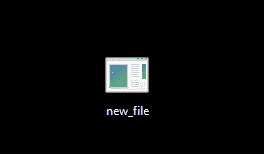

### 注

这里需要注意的一点是，在创建侦听器时，不会通知侦听器已启动。但是，它将自动处理所有传入请求，并在受害者端标记有效负载成功执行后立即更改系统图标。


我们现在可以在目标主机上执行所有利用后功能，只需遵循与上一节完全相同的步骤。我们通过选择**MeterMeter**子菜单并从**Explore**子菜单中选择**Browse files**来查看目标主机上有哪些文件可用，如下图所示：

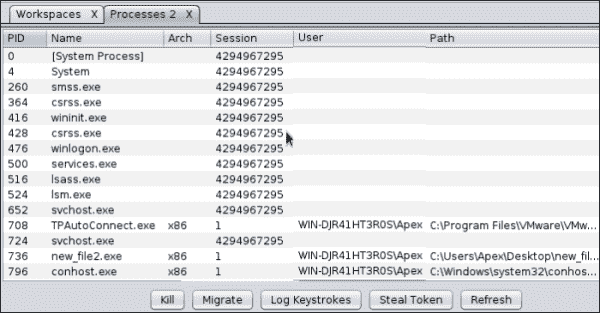

另外，我们通过选择**MeterMeter**子菜单并从**Explore**子菜单中选择**Show processes**来查看目标主机上正在运行哪些进程。以下屏幕截图显示了在目标主机上运行的进程：

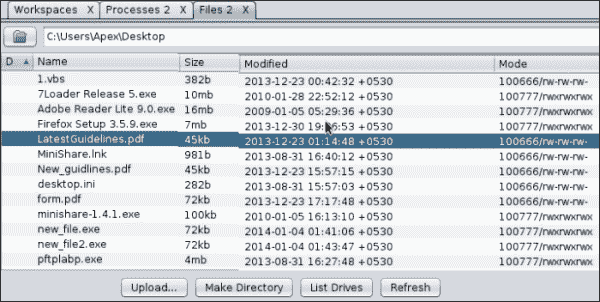

我们关于客户端开发的讨论到此结束。现在让我们动手，开始用 Cortana 脚本编写 Armitage。

# 手稿手稿手稿手稿手稿手稿手稿手稿手稿手稿手稿手稿手稿手稿手稿手稿手稿手稿手稿手稿手稿手稿手稿手稿手稿手稿手稿

Cortana 是用于在 Armitage 中创建攻击向量的脚本语言。渗透测试人员使用 Cortana 进行红队和虚拟克隆攻击向量，使它们像机器人一样行动。然而，红色团队是一个独立的团队，它向组织提出挑战，以提高其效率和安全性。

Cortana 通过使用脚本语言使用 Metasploit 的远程过程客户端。它在控制 Metasploit 操作和自动管理数据库方面提供了灵活性。

此外，Cortana 脚本在特定事件发生时自动执行渗透测试仪的响应。假设我们正在 100 个系统的网络上执行渗透测试，其中 29 个系统运行在 Windows XP 上，其他系统运行在 Linux 操作系统上，我们需要一种机制，一旦每个 Windows XP 系统出现在网络上且端口 445 打开时，就自动利用`ms08_067_netapi`漏洞进行攻击。

我们可以很容易地开发一个简单的脚本，它将自动化整个任务，并为我们节省大量时间。自动执行此任务的脚本将在每个系统出现在网络上时立即利用`ms08_067_netapi`漏洞进行攻击，并对其执行预先指定的后漏洞攻击功能。

## Cortana 的基本原理

用 Cortana 编写基本攻击脚本将有助于我们更广泛地理解 Cortana。因此，让我们来看一个示例脚本，该脚本自动利用 Windows 操作系统端口 445 上的漏洞：

```
on service_add_445 {
        println("Hacking a Host running $1 (" . host_os($1) . ")");
        if (host_os($1) eq "Microsoft Windows") {
                exploit("windows/smb/ms08_067_netapi", $1);
        }

}
```

如果上面的脚本找到端口 445 打开的主机，它将找到受害者的操作系统与 Microsoft Windows 的匹配。但是，当成功匹配时，Cortana 将自动利用端口 445 上的`ms08_067_netapi`漏洞攻击主机。

在前面的脚本中，`$1`指定主机的 IP 地址，`print_ln`打印字符串和变量，`host_os`是 Cortana 中返回主机操作系统的函数，`exploit`函数在`$1`参数指定的地址启动漏洞模块，`service_add_445`是在特定客户端上发现端口`445`打开时触发的事件。

让我们通过导航到**阿米蒂奇**选项卡并点击**脚本**来保存前面的脚本并将此脚本加载到阿米蒂奇中：

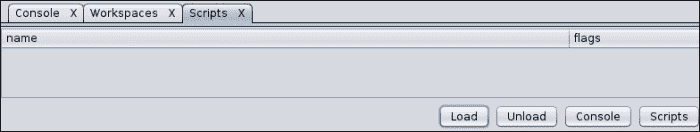

要针对目标运行脚本，请执行以下步骤：

1.  Click on **Load** to load a Cortana script into Armitage as follows:

    

2.  Select the script and click on **Open**. The action will load the script into Armitage forever as follows:

    

3.  接下来，转到 Cortana 控制台并键入`help`命令，列出 Cortana 在处理脚本时可以使用的各种选项。
4.  接下来，为了查看 Cortana 脚本运行时执行的各种操作，我们将使用后面跟着脚本名称的`logon`命令。`logon`命令将为脚本提供日志功能，并记录脚本执行的每个操作。
5.  Let's now perform an intense scan over the network and see what information we get as shown in the following screenshot:

    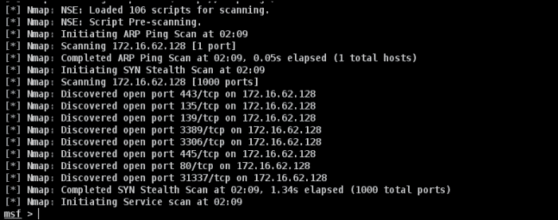

6.  As we can clearly see, we found a host with port `445` open. Let's move back onto our Cortana console and see whether or not some activity has occurred as shown in the following screenshot:

    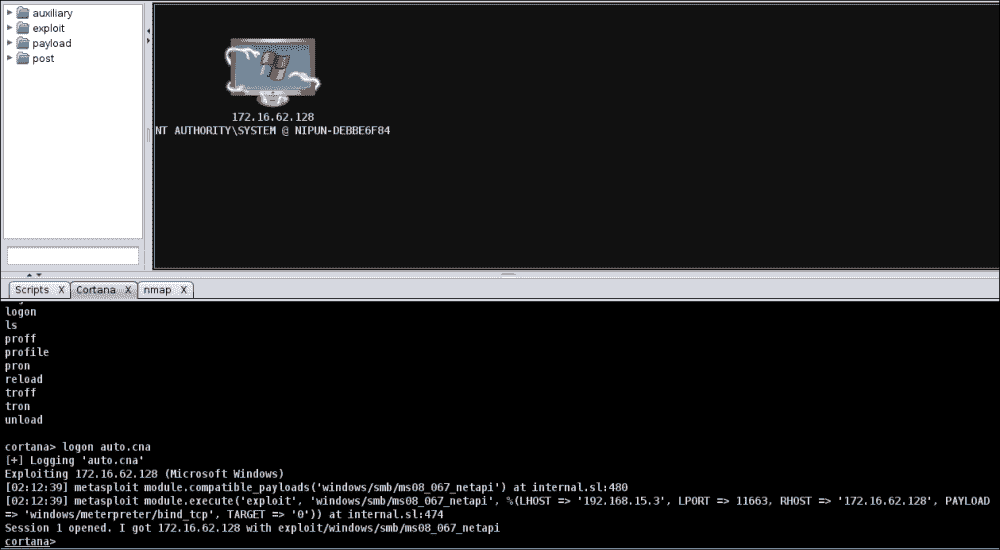

7.  猛敲 Cortana 已经通过在目标主机上自动启动漏洞攻击来接管主机。

我们可以清楚地看到，Cortana 通过自动执行操作，使渗透测试对我们来说非常容易。在接下来的几节中，我们将看到如何使用 Cortana 自动化后期开发和处理 Metasploit 的进一步操作。

## 控制变质岩

Cortana 可以很好地控制 Metasploit 功能。我们可以使用 Cortana 为 Metasploit 发送任何命令。让我们看一个示例脚本，以帮助我们了解有关从 Cortana 控制 Metasploit 函数的更多信息：

```
cmd_async("db_status");
cmd_async("hosts");
on console_db_status {
println(" $3 ");
}
on console_hosts {
println("Hosts in The Database");
println(" $3 ");
}
```

在前面的脚本中，`cmd_async`命令将该命令发送到 Metasploit，并确保执行该命令。此外，`console_*`函数用于打印该命令的输出。正如我们所看到的，我们在前面的脚本中使用了两个命令：`db_status`和`hosts`通过使用`cmd_async`命令。Metasploit 将执行这些命令；但是，为了打印输出，我们需要定义`console_*`函数。此外，`$3`是保存命令输出的变量。

让我们看看将此脚本加载到 Armitage 时会发生什么：

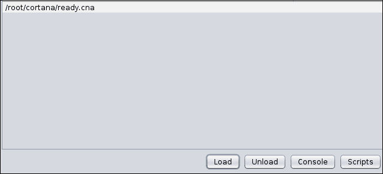

加载`ready.cna`脚本后，我们打开 Cortana 控制台查看输出：

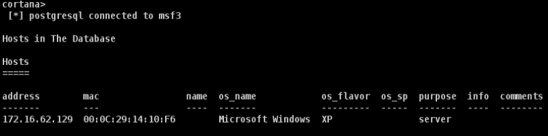

显然，命令的输出会显示在屏幕上，这就结束了我们当前的讨论。但是，有关 Cortana 脚本和通过 Armitage 控制 Metasploit 的更多信息，请参见[http://www.fastandeasyhacking.com/download/cortana/cortana_tutorial.pdf](http://www.fastandeasyhacking.com/download/cortana/cortana_tutorial.pdf) 。

## 使用 Cortana 进行后期开发

使用 Cortana 进行后期开发也很简单。Cortana 的内置功能可以使后期开发变得容易处理。让我们借助以下示例脚本来理解这一点：

```
on heartbeat_15s {
local('$sid');
foreach $sid (session_ids()) {
if (-iswinmeterpreter $sid && -isready $sid) {  
m_cmd($sid, "getuid");
on meterpreter_getuid {
println(" $3 ");
}
}
}
}
```

在前面的脚本中，我们使用了一个名为`heartbeat_15s`的函数。此函数每 15 秒重复执行一次。因此，它被称为**心跳**功能。`local`函数将表示`$sid`是当前函数的本地函数，当函数返回时，其值将消失。下一个语句是在每个打开的会话中切换的循环：`if`语句将检查会话类型是否为 Windows MeterMeter 类型，以及它是否准备好进行交互。`m_cmd`函数使用`$sid`等参数将命令发送到 MeterMeter 会话，该参数是会话 ID 和命令。接下来，我们用`meterpreter_*`定义一个函数，其中`*`表示发送到 MeterMeter 会话的命令。此函数将打印`sent`命令的输出，正如我们在上一个练习中对`console_hosts`所做的那样。

让我们将此脚本与第一个用于自动利用`ms08_067_netapi`漏洞的脚本一起运行：

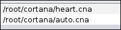

一旦我们加载脚本并在目标主机上执行 Nmap 扫描，如果 Nmap 发现目标主机上的端口`445`打开，我们的第一个脚本`auto.cna`将利用它。现在，一旦阿米蒂奇在目标上得到一个米计外壳，我们的第二个脚本`heart.cna`就会执行。此脚本将在每 15 秒后显示目标的 UID，如以下屏幕截图所示：

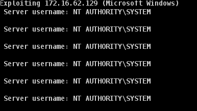

### 注

有关后期开发、脚本和功能的更多信息，请参阅[http://www.fastandeasyhacking.com/download/cortana/cortana_tutorial.pdf](http://www.fastandeasyhacking.com/download/cortana/cortana_tutorial.pdf) 。

## 在 Cortana 中创建自定义菜单

Cortana 还在构建自定义弹出菜单时提供了出色的输出，这些菜单在获得 MeterMeter 会话和其他会话后连接到主机。让我们使用 Cortana 构建一个自定义的键盘记录器，并了解它使用 Cortana 脚本的情况：

```
popup meterpreter_bottom {
menu "&My Key Logger" {
item "&Start Key Logger" {
m_cmd($1, "keyscan_start");
}
item "&Stop Key Logger" {
m_cmd($1, "keyscan_stop");
}
item "&Show Keylogs" {
m_cmd($1, "keyscan_dump");
}
on meterpreter_keyscan_start {
println(" $3 ");
}
on meterpreter_keyscan_stop {
println(" $3 ");
}
on meterpreter_keyscan_dump {
println(" $3 ");
}
}
}
```

前面的示例显示了在**米计**子菜单中创建的弹出窗口。但是，只有当我们能够利用目标主机并成功获得 MeterMeter 外壳时，此弹出窗口才可用。

`popup`关键字将表示弹出窗口的创建。`meterpreter_bottom`功能将表示每当用户右键单击被攻击主机并选择`Meterpreter`选项时，Armitage 将在底部显示此菜单。`item`关键字指定菜单中的各种项目。`m_cmd`命令实际上将使用各自的会话 ID 向 Metasploit 发送 MeterMeter 命令。

因此，在前面的脚本中，我们有三项：**启动键盘记录程序**、**停止键盘记录程序**和**显示键盘记录程序**。它们分别用于启动键记录、停止键记录和显示日志中存在的数据。我们还声明了三个函数，它们将处理发送到 MeterMeter 的命令的输出。现在，让我们将此脚本加载到 Cortana 中，利用主机，右键单击受损主机，它将显示以下菜单：

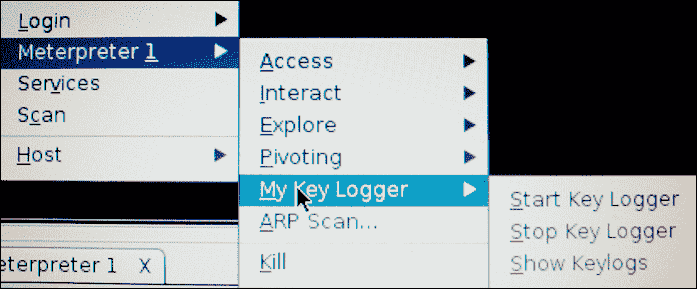

我们可以看到，每当我们右键点击被攻击的主机并浏览到**米表**菜单时，我们将看到一个名为**我的键盘记录器**的新菜单列在所有菜单的底部。此菜单将包含我们在脚本中声明的所有项。每当我们从此菜单中选择一个选项时，相应的命令就会运行并在 Cortana 控制台上显示其输出，如下所示：

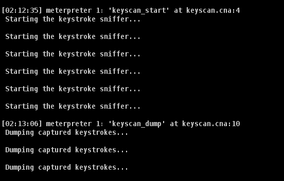

当我们选择第一个选项时，即**启动键盘记录器**，我们将能够在 Cortana 控制台中看到输出。现在让我们等待一小段时间，以检查在受攻击主机上工作的人员是否键入了任何内容。经过几秒钟的短暂延迟后，我们现在从菜单中单击第三个选项**Show Keylogs**，并按如下方式分析输出：

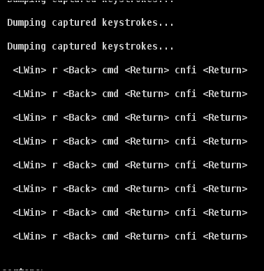

点击**Show Keylogs**选项后，我们将在 Cortana 控制台中看到在受损主机上工作的人员键入的字符。关于使用 Cortana 构建菜单的讨论到此结束。

## 使用接口

Cortana 在使用接口时也提供了灵活的方法。Cortana 提供了创建快捷方式、表格、切换选项卡等的选项和功能。假设，我们可能想添加一个自定义功能，例如每当我们从键盘上按*F1*时，Cortana 都应该显示目标主机的`UID`。让我们看一个脚本示例，它将使我们能够实现此功能：

```
bind F1 {
local('$sid');
$sid ="1";
spawn(&gu, \$sid);  
} 
sub gu{  
m_cmd($sid,"getuid");
on meterpreter_getuid {
show_message( " $3 ");
}
}
```

上面的脚本将添加一个快捷键*F1*，按下该快捷键时，将显示目标系统的`UID`。脚本中的`bind`关键字表示功能与*F1*键的绑定。接下来，我们定义`$sid`变量的范围并为其分配一个`1`值（这是我们将与之交互的会话 ID 的值）。

`spawn`关键字将创建 Cortana 的新实例，执行`gu`函数，并将`$sid`的值作为全局变量传递给该函数。`gu`功能将向仪表发送`getuid`命令。`meterpreter_getuid`命令将处理`getuid`命令的输出。

`show_message`命令将弹出一条消息，显示`getuid`命令的输出。现在，让我们将脚本加载到 Armitage 中，看看它是否正常工作：

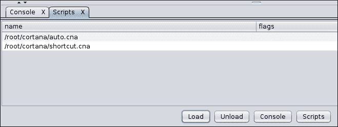

接下来，让我们对目标主机执行一次密集扫描，并使用`auto.cna`脚本对其进行攻击。现在让我们按键盘上的*F1*键，检查当前脚本是否执行良好：

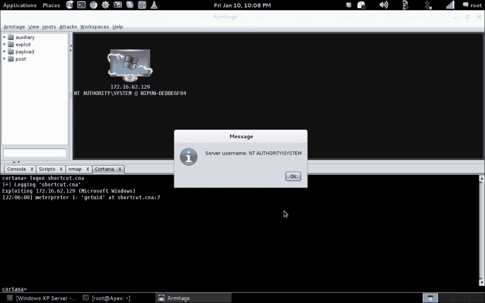

猛敲我们很容易得到目标系统的的`UID`，即**NT AUTHORITY\system**。关于使用 Armitage 编写 Cortana 脚本的讨论到此结束。

### 注

有关 Cortana 脚本及其各种功能的更多信息，请参阅[http://www.fastandeasyhacking.com/download/cortana/cortana_tutorial.pdf](http://www.fastandeasyhacking.com/download/cortana/cortana_tutorial.pdf) 。

# 总结

在本章中，我们详细介绍了 Armitage 及其各种功能。我们首先查看了界面并构建了工作区。我们还看到了如何利用 Armitage 的主机。我们研究了远程以及客户端开发和后期开发。此外，我们跳进了 Cortana，了解了它的基本原理，并用它来控制 Metasploit。我们还创建了利用后脚本、自定义菜单和界面。

# 进一步阅读

在本书中，我们以一种实用的方式介绍了 Metasploit 和各种其他相关主题。我们涵盖了漏洞利用开发、模块开发、移植漏洞利用、客户端攻击、SET、Armitage、加速渗透测试和测试服务。我们还研究了汇编语言、Ruby 编程和 Cortana 脚本。

阅读本书后，您可能会发现以下资源有助于提供有关这些主题的更多详细信息：

*   学习 Ruby 编程请参考[http://ruby-doc.com/docs/ProgrammingRuby/](http://ruby-doc.com/docs/ProgrammingRuby/)
*   有关装配编程，请参阅[https://courses.engr.illinois.edu/ece390/books/artofasm/artofasm.html](https://courses.engr.illinois.edu/ece390/books/artofasm/artofasm.html)
*   开发利用请参见[http://www.corelan.be](http://www.corelan.be)
*   有关 Metasploit 开发，请参考[http://dev.metasploit.com/redmine/projects/framework/wiki/DeveloperGuide](http://dev.metasploit.com/redmine/projects/framework/wiki/DeveloperGuide)
*   关于基于 SCADA 的开发，请参考[http://www.scadahacker.com](http://www.scadahacker.com)
*   有关 Metasploit 的深入攻击文档，请参阅[http://www.offensive-security.com/metasploit-unleashed/Main_Page](http://www.offensive-security.com/metasploit-unleashed/Main_Page)
*   有关 Cortana 脚本的更多信息，请参阅[http://www.fastandeasyhacking.com/download/cortana/cortana_tutorial.pdf](http://www.fastandeasyhacking.com/download/cortana/cortana_tutorial.pdf)
*   Cortana 脚本资源请参见[https://github.com/rsmudge/cortana-scripts](https://github.com/rsmudge/cortana-scripts)