# 使用 Metasploit 进行后期开发

本章将重点介绍核心的后期开发。在本章中，我们将重点介绍后利用的方法，并将介绍基本任务，如权限提升、以明文形式获取密码、查找有趣的信息等。

在本章中，我们将涵盖并理解以下关键方面：

*   执行必要的后期开发
*   使用高级后期开发模块
*   特权升级
*   获得对目标的持久访问

现在让我们跳到下一节，在这里我们将了解 Metasploit 的开发后功能的基础。

# 使用 Metasploit 扩展后期开发

在前面的章节中，我们已经介绍了一些开发后模块。但是，这里我们将重点介绍我们没有介绍的功能。在上一章中，我们重点关注系统的开发，但现在我们只关注已经开发的系统。因此，让我们在下一节中开始了解后期开发中使用的最基本命令。

# 基本的开发后命令

核心 MeterMeter 命令是使用 MeterMeter 有效负载的大多数已开发系统上可用的命令，并为后期开发提供必要的核心功能。让我们从一些最基本的命令开始，这些命令将帮助您进行后期开发。

# 帮助菜单

我们始终可以通过发出`help`或`?`来参考帮助菜单中目标上可用的所有各种命令的列表，如以下屏幕截图所示：

# 后台命令

在执行后利用时，我们可能会遇到需要执行其他任务的情况，例如测试不同的利用、运行权限提升利用等。然而，为了实现这一点，我们需要将当前的 MeterMeter 会话置于后台。我们可以通过发出如下屏幕截图所示的`background`命令来实现这一点：

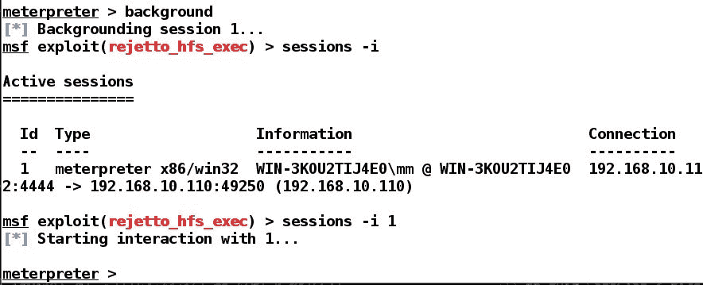

从前面的屏幕截图中可以看出，我们成功地将会话置于后台，并使用`sessions -i`命令和会话标识符重新与会话交互。

# 机器 ID 和 UUID 命令

我们总是可以通过发出如下的`machine_id`命令来获取所连接会话的机器 ID：

要查看 UUID，我们只需发出如下屏幕截图所示的`uuid`命令：

# 网络命令

我们可以使用`ipconfig`/`ifconfig`、`arp`和`netstat`命令快速访问网络信息。在前面的章节中，我们已经介绍了`arp`命令。让我们看看`ipconfig`命令生成的输出，如下所示：

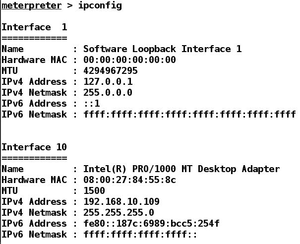

`ipconfig`命令允许我们查看本地 IP 地址和任何其他相关接口。此命令至关重要，因为它会显示连接到受损主机的任何其他内部网络。我把`netstat`命令留作练习，让你们大家在自己的时间内完成。

# 文件操作命令

我们可以通过发出`pwd`命令查看目标机器上当前的工作目录，如下所示：

此外，我们可以使用`cd`命令浏览目标文件系统，并使用`mkdir`命令创建目录，就像我们在系统上通常所做的那样。MeterMeter 外壳允许我们使用`upload`命令将文件上传到目标系统。让我们看看它是如何工作的：

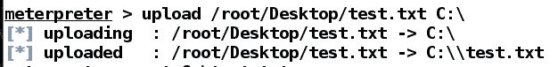

我们可以通过发出`edit`命令和文件名来编辑目标上的任何文件，如下图所示：

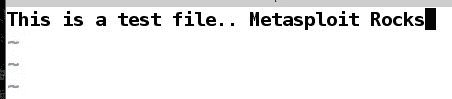

现在让我们通过发出如下的`cat`命令来查看文件的内容：

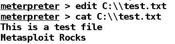

我将把`ls`、`rmdir`和`rm`命令留作练习，让您在自己的时间内完成。接下来，我们使用`download`命令从目标下载文件，如下所示：

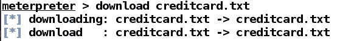

# 桌面命令

Metasploit 具有`desktop`命令，例如枚举桌面、从网络摄像机拍摄照片、从麦克风录制、从摄像机流媒体等等。我们可以看到以下可用功能：

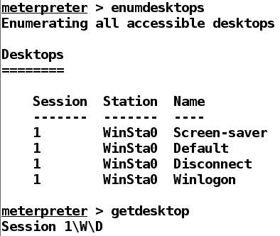

使用`enumdesktops`和`getdesktop`可以泄露与目标桌面相关的信息。`enumdesktop`命令列出了所有可用的桌面，而`getdesktop`则列出了与当前桌面相关的信息。

# 截图和相机枚举

在拍摄屏幕截图、网络摄像头快照、运行实时流或密钥记录之前，测试人员必须获得事先许可。但是，我们可以通过使用`snapshot`命令拍摄快照来查看目标桌面，如下所示：

查看保存的 JPEG 文件，我们有以下内容：

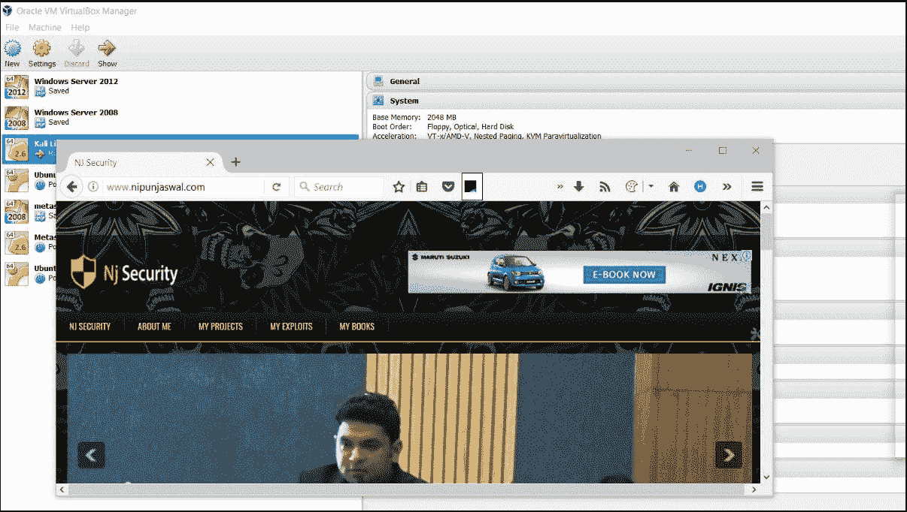

让我们看看是否可以列举摄像头，看看谁在系统上工作：

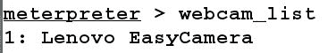

使用`webcam_list`命令，我们可以找到与目标相关联的摄像机数量。让我们使用`webcam_stream`命令流式传输摄影机，如下所示：

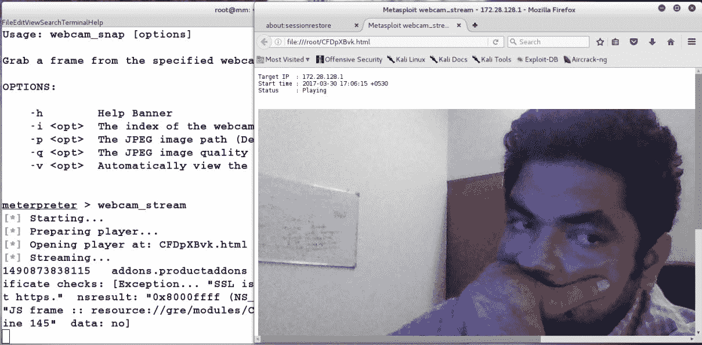

发出上述命令将在浏览器中打开 web 摄影机流，如屏幕截图所示。我们也可以通过发出`webcam_snap`命令来选择快照，而不是流式传输，如下所示：

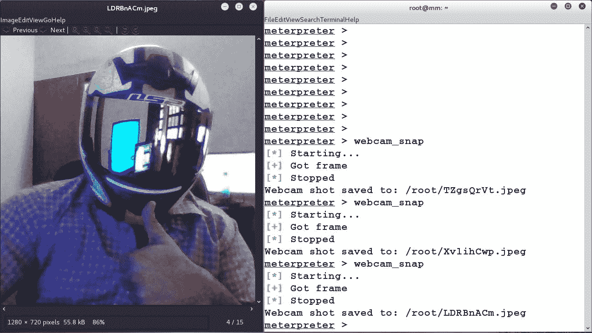

哈哈！好吧，我想说这是一种在网络入侵中隐藏你的脸的方法。然而，有时，如果在执法机构工作，你可能会被要求倾听环境以进行监视。为此，我们可以使用`record_mic`命令，如下所示：

我们可以通过`-d`开关传递秒数，用`record_mic`命令设置捕获的持续时间。可以从目标获得的另一个有趣的信息是他们的关键日志。我们可以通过使用`keyscan_start`命令启动键盘嗅探器模块来转储按键日志，如下所示：

几秒钟后，我们可以使用`keyscan_dump`命令转储密钥日志，如下所示：

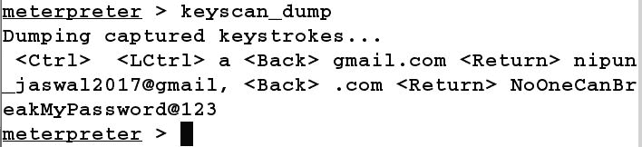

在本节中，我们看到了许多命令。现在让我们进入后期开发的高级部分。

# 使用 Metasploit 进行高级后期开发

在本节中，我们将使用从基本命令中收集的信息来实现目标系统中的进一步成功和访问级别。

# 迁移到更安全的流程

正如我们在上一节中看到的，我们的 MeterMeter 会话是从临时文件加载的。但是，如果目标系统的用户发现进程异常，他可以终止进程，这将把我们踢出系统。因此，迁移到更安全的流程是一种很好的做法，例如`explorer.exe`或`svchost.exe`，通过使用`migrate`命令避开受害者的眼睛。但是，我们总是可以使用`ps`命令来计算我们想要跳转到的进程的 PID，如下面的屏幕截图所示：

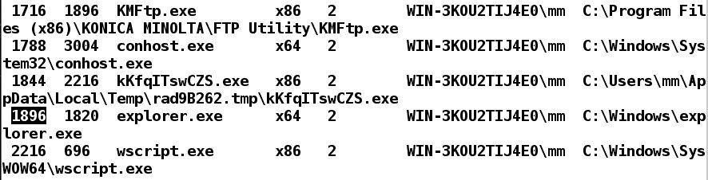

我们可以看到，`explorer.exe`的 PID 为`1896`。让我们使用`migrate`命令跳转到它，如下面的屏幕截图所示：

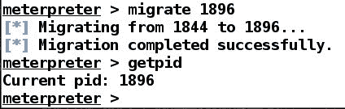

我们可以看到，我们成功地跳入了`explorer.exe`过程。

从一个进程迁移到另一个进程可能会降低权限。

# 获取系统权限

如果我们入侵的应用程序是以管理员权限运行的，那么通过发出`getsystem`命令很容易获得系统级权限，如下所示：

系统级权限提供最高级别的权限，能够在目标系统上执行几乎任何操作。

较新版本的 windows 上的`getsystem`模块不太可靠。建议尝试本地权限提升方法和模块来提升

# 使用 timestomp 更改访问、修改和创建时间

从私人组织到执法部门，Metasploit 无处不在。因此，在执行隐蔽操作时，强烈建议您更改访问、修改或创建文件的日期。在 Metasploit 中，我们可以使用`timestomp`命令执行时间更改操作。在上一节中，我们创建了一个名为`creditcard.txt`的文件。让我们使用`timestomp`命令更改其时间属性，如下所示：

我们可以看到访问时间是 2016-06-19 23:23:15。我们可以使用`-z`开关将其修改为`1999-11-26 15:15:25`，如上图所示。让我们看看文件是否被正确修改：

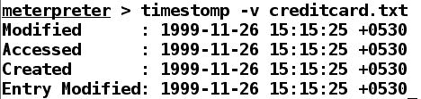

我们成功地更改了`creditcard.txt`文件的时间戳。我们还可以使用`-b`开关清空文件的所有时间细节，如下所示：

使用`timestomp`命令，我们可以单独更改修改的访问权限，以及创建时间。

# 使用 hashdump 获取密码哈希

一旦我们获得系统权限，我们可以通过发出`hashdump`命令，快速从受损系统中找出登录密码散列，如下所示：

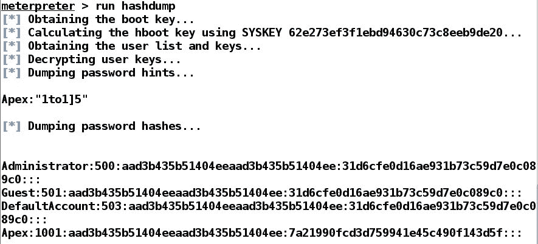

一旦我们发现了密码散列，我们就可以对目标系统发起传递散列攻击。

有关传递散列攻击的更多信息，请参阅[https://www.offensive-security.com/metasploit-unleashed/psexec-pass-hash/](https://www.offensive-security.com/metasploit-unleashed/psexec-pass-hash/) 。

您可以参考一段优秀的视频，在[中解释哈希攻击及其缓解 https://www.youtube.com/watch?v=ROvGEk4JG94](https://www.youtube.com/watch?v=ROvGEk4JG94) 。

# Metasploit 和权限提升

在本节中，我们将介绍如何使用 Metasploit 在目标系统上获得最高级别的权限。我们针对的大多数应用程序都是在用户级权限上运行的，用户级权限为我们提供了一般访问权限，但不能访问整个系统。但是，为了获得系统级访问权限，我们需要在获得系统访问权限后使用目标系统中的漏洞升级权限。在接下来的部分中，让我们看看如何实现对各种类型操作系统的系统级访问。

# 升级 Windows Server 2008 上的权限

在渗透测试过程中，我们经常会遇到访问受限的情况，在运行`hashdump`等命令时，可能会出现以下错误：

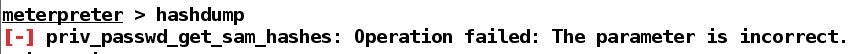

在这种情况下，如果我们尝试使用`getsystem`命令实现系统权限，我们会得到以下错误：

那么，在这种情况下我们该怎么办？解决方法是使用后期攻击升级权限，以实现最高级别的访问。以下演示是在 Windows Server 2008 SP1 操作系统上进行的，在该操作系统中，我们使用本地攻击绕过限制并获得对目标的完全访问权限：

在前面的屏幕截图中，我们使用`exploit/windows/local/ms10_015_kitrap0d`漏洞提升权限并获得最高级别的访问权限。让我们使用`getuid`命令检查访问级别，如下所示：

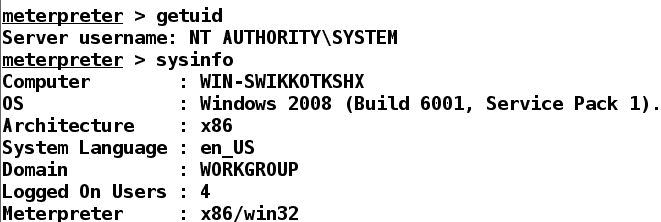

我们可以看到，我们拥有系统级访问权限，现在可以对目标执行任何操作。

有关 kitrap0d 漏洞的更多信息，请参阅[https://technet.microsoft.com/en-us/library/security/ms10-015.aspx](https://technet.microsoft.com/en-us/library/security/ms10-015.aspx) 。

# 使用 Metasploit 在 Linux 上升级权限

在上一节中，我们了解了如何使用 Metasploit 升级基于 Windows 的操作系统上的权限。现在让我们看一下手动运行特权升级漏洞攻击。此练习将帮助您为竞争性和实用的信息安全认证考试做好准备。

假设我们在访问受限的 Linux UBUNTU 14.04 LTS 服务器上获得了一个 shell，如以下屏幕截图所示：

让我们进入 shell，通过发出`shell`命令获得更可靠的命令执行访问，如下面的屏幕截图所示：

如您所见，我们已经在`shell`终端发出了`id`命令；我们有当前用户的用户 ID，即 1000，用户名是 rootme。通过`uname -a`命令收集更多关于内核的信息，我们可以看到操作系统的内核版本是 3.13.0-24，发布年份是 2014 年，机器运行的是 64 位操作系统。

找到这些细节后，在浏览互联网后，我们遇到了*Linux 内核 3.13.0<3.19（Ubuntu 12.04/14.04/14.10/15.04）-[的“overlayfs”特权升级漏洞（CVE:2015-1328）](https://www.exploit-db.com/exploits/37292)*https://www.exploit-db.com/exploits/37292 。接下来，我们下载基于 C 的漏洞并将其托管在本地机器上，以便将该漏洞转移到目标机器上。由于我们已经可以访问目标上的 shell，我们只需发出`wget`命令，然后是托管在我们机器上的原始 C 利用源文件的位置，如以下屏幕截图所示：

我们的下一个任务是编译这个漏洞并在目标上运行它。为了编译该漏洞，我们输入`GCC`，后跟源文件名，同时使用`-o`开关指定输出名称。我们还将提供`-lpthread`开关，因为我们在漏洞利用中使用 pthread 调用。发出 complete 命令，我们可以看到漏洞被编译到名为 bang 的文件中。让我们通过发出`chmod +x bang`命令为 bang 文件分配执行权限，并运行漏洞攻击，如以下屏幕截图所示：

是 啊我们可以看到，当发出`whoami`命令时，系统告诉我们我们是 root。换句话说，我们已经获得了对目标的最高可能访问权限，并且现在可能有更多的对服务器的访问权限。

有关 CVE 2015-1328 的更多信息，请参阅[http://seclists.org/oss-sec/2015/q2/717](http://seclists.org/oss-sec/2015/q2/717) 。

# 使用 Metasploit 获得持久访问

当您是执法机构的一员时，获得对目标系统的持久访问非常重要。然而，在传统的渗透测试中，持久性可能不是很实用，除非可测试环境很大，并且需要很多天才能完成测试。但这并不意味着不值得知道如何保持对目标的访问。在下一节中，我们将介绍持久性技术，可以使用这些技术来维护对目标系统的访问。此外，Metasploit 降低了 MeterMeter 中的持久性模块和`metsvc`模块的价值，这些模块用于维护对目标的访问。让我们介绍一下实现持久性的新技术。

# 在基于 Windows 的系统上获得持久访问

在本例中，我们已经获得了对运行 Windows Server 2012 R2 的系统的 MeterMeter 访问权。让我们使用`background`命令将 MeterMeter 移到后台，并使用最新的持久化模块`post/windows/manage/persistence_exe`。此模块的优点在于它不依赖于 Metasploit，这意味着您可以使用任何可执行文件在其上实现持久性。让我们将其置于`use`并快速运行`show options`检查所有需要设置的选项，如下屏幕所示：

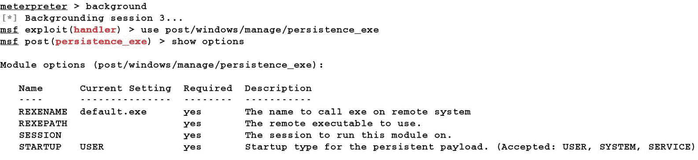

我们可以看到我们有四个选择。REXENAME 是将加载到受害系统的`.exe`文件的名称。REXEPATH 是系统上可执行文件的路径，将上载到目标，并将重命名为 REXENAME 上设置的值。会话选项将包含 MeterMeter 的会话标识符，通过该标识符将文件上载到目标。启动选项将包含来自用户、系统和服务的一个值。对于访问受限的用户，我们会将用户保留在启动选项中；持久性将仅在该特定用户登录时实现。通过将 STARTUP 的值设置为 SYSTEM，可以在任何用户登录上实现持久性。但是，要在系统级别实现持久性，需要管理员权限，服务安装也是如此。因此，我们将仅将其作为用户保留。

对于 REXEPATH，我们创建了一个带有`msfvenom`的后门，它是基于 Windows 的系统的计量器，与我们在前面章节中所做的完全相同。我们将`SESSION`选项设置为`3`，因为我们的 MeterMeter 会话 ID 为`3`，如下屏幕所示：

接下来，我们将`REXEPATH`设置为可执行文件的路径，并按如下方式运行模块：

运行该模块，我们可以看到实现了持久性。让我们通过设置处理程序来测试它，以容纳我们的`nj.exe`文件，该文件连接回端口`1337`，如下所示：

在前面的案例中，我们所做的是通过 meterpeter 向受害者提供 reboot 命令，这导致系统重新启动。接下来，我们快速设置一个处理程序，在端口`1337`上接收传入的 MeterMeter 会话，并且，一旦我们运行`exploit`命令，重新启动的系统就会连接到我们的 MeterMeter，这表示成功地在目标系统上持久化。

# 在 Linux 系统上获得持久访问

为了在 Linux 系统上实现持久性，我们可以在获得初始 MeterMeter 访问权限后使用`exploit/linux/local/cron_persistence`模块，如下图所示：

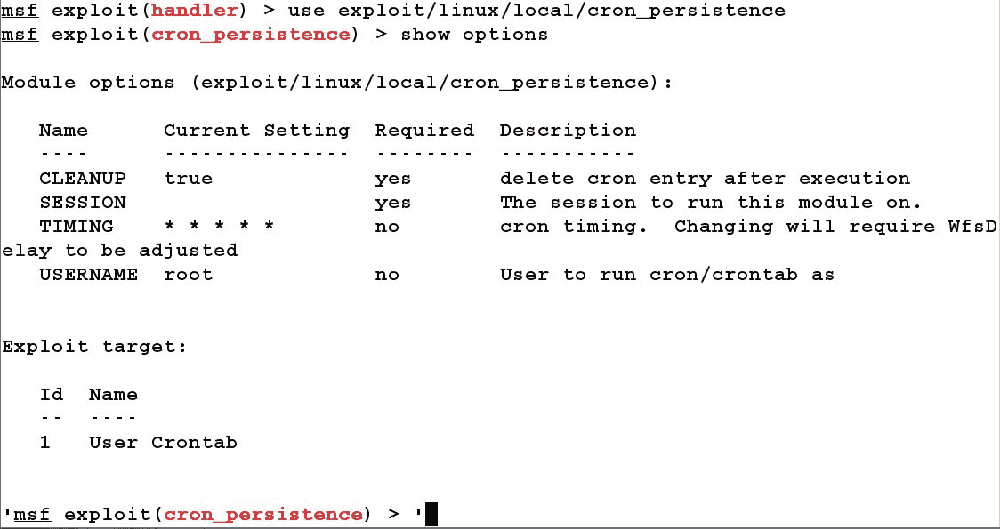

接下来，我们需要将`SESSION`选项设置为我们的 MeterMeter 会话标识符，并将`USERNAME`配置为目标机器的当前用户并运行模块，如下所示：

一旦实现了基于 Cron 的持久化，您就可以为传入的 meterpeter 会话设置一个处理程序，方法与我们在 Windows 系统中使用的方法类似。但是，基于 Linux 的操作系统的有效负载将为`linux/x86/meterpreter/reverse_tcp`。我让你们完成这个练习，因为没有任何训练比自定步调训练更好。

有关 Cron 持久性的更多信息，请参阅[https://www.rapid7.com/db/modules/exploit/linux/local/cron_persistence](https://www.rapid7.com/db/modules/exploit/linux/local/cron_persistence) 。

# 总结

在这一章中我们讲了很多东西。我们从学习基本的后期开发开始，接着学习高级后期开发。我们还讨论了迁移、获取系统特权、timestomp 和获取哈希。我们还了解了如何使用 Metasploit 提升特权，并维护 Linux 和 Windows 系统的访问权限。

在本章中，您需要完成各种练习。但是，如果您想尝试更多，请尝试执行以下任务：

*   尝试在多种系统上升级权限，包括 Windows Server 2003、Windows XP、Windows 7、Windows 8.1 和 Windows 10。请注意这些差异，并维护用于提升这些系统上权限的模块列表。
*   安装两到三年前的 Red Hat、CentOS 和 Ubuntu 操作系统，找出内核版本，并尝试升级这些机器上的权限。
*   找出在 OSX、BSD 和 Solaris 操作系统上获得持久性的方法。

在[第 5 章](5.html#2JTHG0-a731d733dba14ccabae643b74e2c8790)*使用 Metasploit*测试服务中，我们将介绍使用 Metasploit 的测试服务。我们的重点将放在可能作为整个项目的服务上，而不是作为 VAPT 项目的一部分。