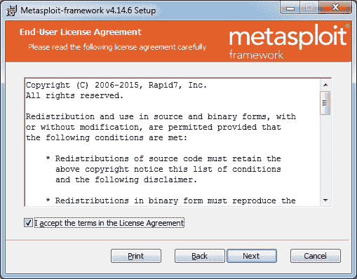
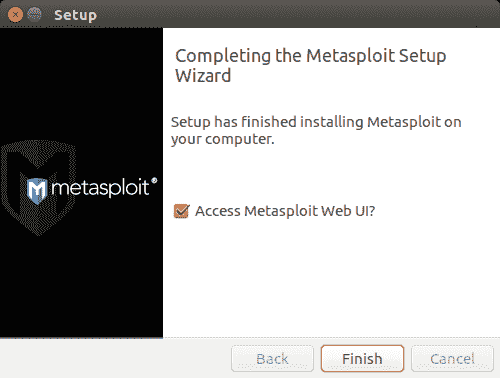
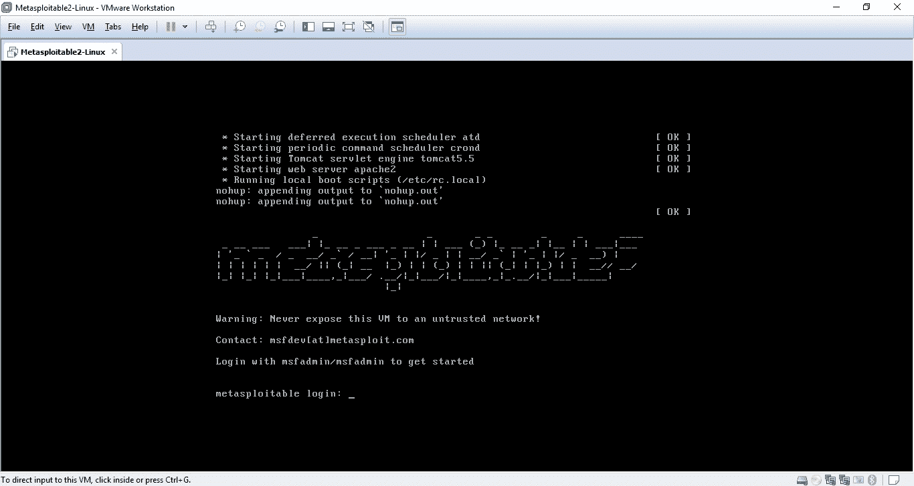

# 设置您的环境

在上一章中，您简要地熟悉了漏洞评估、渗透测试和 Metasploit 框架。现在，让我们通过学习如何在各种平台上安装和设置框架以及设置专用虚拟测试环境来实际开始 Metasploit。在本章中，您将了解以下主题：

*   使用 Kali Linux 虚拟机立即开始使用 Metasploit 和支持工具
*   在 Windows 和 Linux 平台上安装 Metasploit 框架
*   在虚拟环境中设置可利用的目标

# 使用 Kali Linux 虚拟机-最简单的方法

Metasploit 是 Rapid7 发布的独立应用程序。它可以单独下载并安装在各种操作系统平台上，如 Windows 和 Linux。然而，有时 Metasploit 还需要相当多的支持工具和实用程序。在任何给定平台上单独安装 Metasploit 框架和所有支持工具可能会有点累。为了简化 Metasploit 框架和所需工具的设置过程，建议您准备一台随时可用的 Kali Linux 虚拟机。

使用此虚拟机将带来以下好处：

*   即插即用 Kali Linux--无需安装
*   Metasploit 预装有 Kali 虚拟机
*   所有支持工具（在本书中讨论）也都是随 Kali 虚拟机预装的
*   单独设置 Metasploit 和其他支持工具可以节省时间和精力

要使用 Kali Linux 虚拟机，首先需要在系统上安装 VirtualBox、VMPlayer 或 VMware 工作站。

以下是开始使用 Kali Linux 虚拟机的步骤：

1.  从[下载 Kali Linux 虚拟机 https://www.offensive-security.com/kali-linux-vmware-virtualbox-image-download/](https://www.offensive-security.com/kali-linux-vmware-virtualbox-image-download/) 。
2.  根据基本操作系统的类型选择并下载 Kali Linux 64 位 VM 或 Kali Linux 32 位 VM PAE，如下所示：


3.  下载 VM 后，将其从 Zip 文件解压缩到您选择的任何位置。
4.  双击 VMware 虚拟机配置文件以打开虚拟机，然后播放虚拟机。以下凭据可用于登录虚拟机：

```
Username - root
 Password - toor
```

5.  要启动 Metasploit 框架，请打开终端并键入`msfconsole`，如下所示：


# 在 Windows 上安装 Metasploit

Metasploit 框架可以轻松安装在基于 Windows 的操作系统上。然而，Windows 通常不是部署 Metasploit 框架的首选平台，原因是许多支持工具和实用程序不适用于 Windows 平台。因此，强烈建议在 Linux 平台上安装 Metasploit 框架。

以下是在 Windows 上安装 Metasploit Framework 的步骤：

1.  从以下位置下载最新的 Metasploit Windows 安装程序：[https://github.com/rapid7/metasploit-framework/wiki/Downloads-by-Version](https://github.com/rapid7/metasploit-framework/wiki/Downloads-by-Version) 。
2.  双击并打开下载的安装程序。
3.  单击下一步，如以下屏幕截图所示：


4.  接受许可协议：



5.  选择要安装 Metasploit 框架的位置：


6.  单击“安装”继续：


Metasploit 安装程序将所需文件复制到目标文件夹：


7.  单击 Finish 完成 Metasploit Framework 安装：


安装完成后，让我们尝试通过命令行界面访问 Metasploit 框架：

1.  按*视窗键*+*R.*
2.  键入`cmd`并按*进入*。
3.  使用`cd`导航到安装 Metasploit 框架的文件夹/路径。

4.  键入`msfconsole`并点击*进入；*您应该能够看到以下内容：


# 在 Linux 上安装 Metasploit

在本书中，我们将在 Ubuntu（基于 Debian 的）系统上安装 Metasploit 框架。在开始安装之前，我们首先需要下载最新的安装程序。这可以使用`wget`命令完成，如下所示：

1.  打开终端窗口并键入：

```
wgethttp://downloads.metasploit.com/data/releases/metasploit-latest-linux-installer.run
```


2.  下载安装程序后，我们需要将安装程序的模式更改为可执行。这可以通过以下方式完成：
    *   对于 64 位系统：`chmod +x /path/to/metasploit-latest-linux-x64-installer.run`
    *   对于 32 位系统：``chmod +x /path/to/metasploit-latest-linux-installer.run``
3.  现在，我们可以使用以下命令启动安装程序：

    *   对于 64 位系统：`sudo /path/to/metasploit-latest-linux-x64-installer.run`
    *   对于 32 位系统：`sudo /path/to/metasploit-latest-linux-installer.run`
4.  我们可以看到以下安装程序：


5.  接受许可协议：


6.  选择安装目录（对于默认安装，建议将此*保持为*：


7.  选择“是”将 Metasploit Framework 作为服务安装：


8.  确保禁用可能已在系统上运行的任何防病毒或防火墙。防病毒和防火墙等安全产品可能会阻止许多 Metasploit 模块和漏洞攻击正常运行：


9.  输入 Metasploit 服务将在其上运行的端口号。（对于默认安装，建议将此*保持为*：


10.  输入 Metasploit Framework 将在其上运行的主机名。（对于默认安装，建议将此*保持为*：


11.  单击“前进”继续安装：


12.  现在，Metasploit Framework 安装已完成：



让我们尝试通过命令行界面访问它：

1.  打开终端窗口，键入命令`msfconsole`并点击*回车键。*您应该在屏幕上看到以下内容：


# 在虚拟环境中设置可利用的目标

Metasploit 是一个强大的渗透测试框架，如果不以受控方式使用，可能会对目标系统造成潜在损害。为了学习和实践 Metasploit，我们当然不能在没有任何授权许可的任何现场生产系统上使用它。然而，我们可以在我们自己的虚拟环境中练习我们新获得的 Metasploit 技能，该虚拟环境被故意设置为易受攻击。这可以通过一个名为*Metasploitable*的基于 Linux 的系统来实现，该系统具有从操作系统级别到应用程序级别的许多不同的琐碎漏洞。Metasploitable 是一个随时可用的虚拟机，可以从以下位置下载：[https://sourceforge.net/projects/metasploitable/files/Metasploitable2/](https://sourceforge.net/projects/metasploitable/files/Metasploitable2/)

下载后，为了运行虚拟机，您需要在系统上安装 VMPlayer 或 VMware Workstation。安装步骤和屏幕截图如下所示：

VMPlayer 可从[获取 https://www.vmware.com/go/downloadplayer](https://www.vmware.com/go/downloadplayer) 如果尚未安装

1.  为了运行 Metasploitable 虚拟机，首先让我们将其从 zip 文件解压缩到我们选择的任何位置：


2.  双击 Metasploitable VMware 虚拟机配置文件以打开虚拟机。这需要事先安装 VMPlayer 或 VMware 工作站：


3.  点击绿色`Play`图标启动虚拟机：



4.  虚拟机启动后，您可以使用以下凭据登录到虚拟机：

```
 User name - msfadmin
 Password - msfadmin
```

稍后我们可以使用这个虚拟机来练习我们在本书中学习的技能。

# 总结

在本章中，我们学习了如何通过在各种平台上安装 Metasploit 框架快速入门。完成安装部分后，我们将继续下一章，以获得 Metasploit 的结构概述和组件级详细信息。

# 练习

您可以尝试以下练习：

*   下载 Kali Linux 虚拟机并在 VMPlayer 或 VMware 工作站中播放
*   尝试在 Ubuntu 上安装 Metasploit 框架