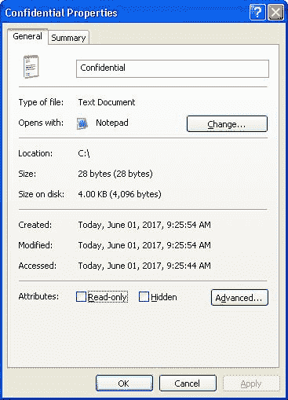
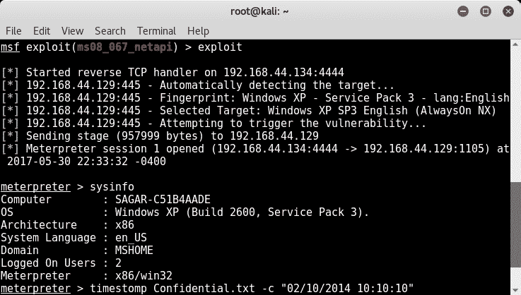

# 防病毒规避和反取证

在前两章中，您学习了如何利用 Metasploit 框架生成自定义有效负载并发起高级客户端攻击。但是，如果我们生成的有效负载被防病毒程序检测和阻止，它们将毫无用处。在本章中，我们将探讨各种技术，以使我们的有效负载尽可能不可检测。您还将熟悉各种技术，以涵盖我们的轨道后，成功的妥协。

在本章中，我们将介绍以下主题：

*   使用编码器避免 AV 检测
*   使用二进制加密和打包技术
*   检测和沙箱概念的有效载荷测试
*   使用 Metasploit 反取证技术，如 TimeStomp 和 clearev

# 使用编码器避免 AV 检测

在[第 6 章](06.html)*中，我们已经看到了如何使用`msfvenom`实用程序生成各种有效负载。但是，这些有效负载如果按原样使用，最有可能被防病毒程序检测到。为了避免对我们的有效载荷进行防病毒检测，我们需要使用`msfvenom`提供的编码器；公用事业*

首先，我们将在；`.exe`；使用`shikata_ga_nai`格式；编码器，如以下屏幕截图所示：

一旦有效负载生成，我们将其上传到站点[http://www.virustotal.com](http://www.virustotal.com) 进行分析。分析完成后，我们可以看到我们的文件`apache-update.exe`；（包含有效载荷）被 46%的用户检测到；使用了 60 个防病毒程序。这对于我们的有效载荷来说是一个相当高的检测率。由于其检测率，按原样将此有效负载发送给受害者的可能性较小。现在，我们必须努力使它在尽可能多的防病毒程序中无法被检测到。

网站[http://www.virustotal.com](http://www.virustotal.com) 运行来自不同供应商的多个防病毒程序，并使用所有可用的防病毒程序扫描上传的文件。

简单地用`shikata_ga_nai`编码我们的有效载荷；编码器曾经工作得不太好。`msfvenom`；实用程序还可以选择多次迭代编码过程。通过编码器的多次迭代传递有效负载可能会使其更隐蔽。现在，我们将尝试生成相同的有效负载；但是，这次我们将运行编码器 10 次，以使其隐形，如以下屏幕截图所示：

既然有效载荷已经生成，我们再次将其提交[进行分析 http://www.virustotal.com](http://www.virustotal.com) 。如下面的屏幕截图所示，分析结果显示，这一次我们的有效负载被 45 个反病毒程序检测到了；60 因此，它比我们以前的尝试稍微好一点，但仍然不够好：

现在，为了进一步尝试使我们的有效载荷不可检测，这次我们将尝试将编码器从`shikata_ga_nai`更改；（如前所述）连接到名为`opt_sub`的新编码器，如以下屏幕截图所示。我们将在有效负载上运行编码器五次迭代：

一旦产生有效载荷，我们将提交给[http://www.virustotal.com](http://www.virustotal.com) 用于分析。这一次，效果看起来好多了！60 个防病毒程序中只有 25 个能够检测到我们的有效负载，而之前 60 个程序中有 45 个能够检测到我们的有效负载，如下面的屏幕截图所示。这无疑是一项重大改进：

您可能已经了解到，没有任何一种秘方可以使我们的有效载荷完全无法检测。使有效载荷不可检测的过程涉及使用不同编码器的各种排列、组合和迭代的大量试错方法。您只需继续尝试，直到有效负载检测率下降到可接受的水平；

但是，还需要注意的是，有时在有效负载上运行编码器的多次迭代甚至可能会损坏原始有效负载代码。因此，建议在将有效负载发送到目标系统之前，通过在测试实例上执行有效负载来实际验证有效负载。

# 使用打包机和加密机

在上一节中，我们已经了解了如何使用各种编码器，以使我们的有效负载无法从防病毒程序中检测到。然而，即使在使用不同的编码器和迭代之后，我们的有效负载仍然被一些防病毒程序检测到。为了使我们的有效载荷完全隐形，我们可以利用；打电话；`encrypted self extracting archive`**；由名为`7-Zip`的压缩实用程序提供的**功能。

首先，我们将首先将一个恶意 PDF 文件（包含有效负载）上传到站点[http://www.virustotal.com](http://www.virustotal.com) ，如下图截图所示。分析表明我们的 PDF 文件被 32 个反病毒程序检测到；56 可用，如以下屏幕截图所示：

现在，使用 7-Zip 实用程序，如以下屏幕截图所示，我们将恶意 PDF 文件转换为自解压归档文件：

分析结果（如以下屏幕截图所示）显示，在 59 个可用的防病毒程序中，有 21 个检测到转换为自解压存档的 PDF 文件。这比我们之前的尝试（32/56）要好得多：

现在，为了使负载更加隐蔽，我们将把负载转换成密码保护的自解压存档。这可以在 7-Zip 实用程序的帮助下完成，如以下屏幕截图所示：

现在，我们将密码加密负载上传到站点[http://www.virustotal.com](http://www.virustotal.com) 并检查结果，如下图所示。有趣的是，这一次没有一个防病毒程序能够检测到我们的有效载荷。现在，我们的有效载荷将在整个运输过程中不被发现，直到它到达目标。但是，密码保护为执行有效负载的最终用户（受害者）增加了另一个障碍：

# 什么是沙箱？

每当我们执行应用程序时，无论是合法的还是恶意的，都会发生以下一些事件：

*   应用程序直接与主机操作系统交互
*   进行系统调用
*   建立网络连接
*   注册表项被修改
*   事件日志会被写出来
*   创建或删除临时文件
*   产生了新的进程
*   配置文件已更新

上述所有事件本质上都是持久性的，并且会改变目标系统的状态。现在，可能存在这样一种场景：我们必须以受控的方式测试恶意程序，以使测试系统的状态保持不变。这正是沙箱可以发挥重要作用的地方。

假设沙箱是一个孤立的容器或隔间。在沙箱中执行的任何操作都会留在沙箱中，不会影响外部世界。在沙箱中运行负载示例将帮助您分析其行为，而不会影响主机操作系统。

有两个开源和免费的沙盒框架，如下所示：

*   砂箱：[https://www.sandboxie.com](https://www.sandboxie.com)
*   布谷鸟沙箱：[https://cuckoosandbox.org/](https://cuckoosandbox.org/)

探索这些沙盒的能力超出了本书的范围；然而，值得尝试这些沙盒进行恶意负载分析。

# 反取证

在过去十年左右的时间里，数字法医技术有了实质性的改进和进步。法医工具和技术已得到充分开发和成熟，可在发生违约/欺诈或事件时搜索、分析和保存任何数字证据。

我们在这本书中看到了 Metasploit 如何被用来破坏远程系统。仪表使用内存中的`dll`工作；注入并确保除非明确要求，否则不会将任何内容写入磁盘。但是，在折衷过程中，我们通常需要执行某些操作来修改、添加或删除远程文件系统上的文件。这意味着，如果对受损的系统进行法医调查，我们的行动将被追溯。

对我们的目标系统进行成功的妥协是其中的一部分，而确保我们的妥协不被注意，甚至从法医学的角度也不被发现是另一个重要部分。幸运的是，Metasploit 框架提供了一些工具和实用程序，可以帮助我们扫清障碍，确保系统中至少留下或没有我们妥协的证据。

# 时隙

位于文件系统上的每个文件和文件夹，无论操作系统的类型如何，都有与其关联的元数据。元数据只不过是特定文件或文件夹的属性，其中包含的信息包括创建、访问和修改元数据的时间和日期、元数据在磁盘上的大小、元数据的所有权信息，以及一些其他属性，例如元数据标记为只读还是隐藏。如果发生任何欺诈或事件，此元数据可以显示许多有用的信息，这些信息可以追溯到攻击。

除了元数据问题外，还有一些称为`File Integrity Monitors`的安全程序；持续监视文件的任何更改。现在，当我们破坏一个系统并在其上安装 MeterMeter 外壳时，我们可能需要访问该系统上的现有文件、创建新文件或修改现有文件。当我们进行这样的更改时，它显然会以更改的时间戳的形式反映在元数据中。这肯定会在事件调查期间引起警报或泄露线索。为了避免在元数据中留下痕迹，我们希望覆盖我们在妥协期间访问或创建的每个文件和文件夹的元数据信息（特别是时间戳）。

MeterMeter 提供了一个非常有用的实用程序，名为`timestomp`；您可以使用其中一个选项覆盖任何文件或文件夹的时间戳值。

以下屏幕截图显示了的帮助菜单；`timestomp`；实用程序一旦我们在受损系统上安装了流量计外壳：

下面的屏幕截图显示了文件`Confidential.txt`的时间戳；在使用`timestomp`之前：

现在，我们将使用 SMB`MS08_67_netapi`漏洞破坏我们的目标系统，然后使用`timestomp`；用于修改文件`Confidential.txt`的时间戳的实用程序，如以下屏幕截图所示：

使用`timestomp`后；实用工具修改文件时间戳，我们可以看到文件`Confidential.txt`更改的时间戳值，如下图所示：

# 克利里夫

每当我们与 Windows 系统交互时，所有操作都会以事件日志的形式记录下来。事件日志分为三类，即应用程序日志、安全日志和系统日志。如果出现系统故障或安全隐患，调查人员/管理员最有可能首先看到事件日志。

让我们考虑一个场景，其中我们使用一些漏洞来破坏 Windows 主机。然后，我们使用 MeterMeter 将新文件上传到受损系统。我们还升级了权限并尝试添加新用户。现在，这些操作将被捕获到事件日志中。在我们为妥协付出了所有努力之后，我们当然不希望我们的行动被发现。此时，我们可以使用称为`clearev`的 MeterMeter 脚本；清除所有日志并清除我们的活动轨迹。

下面的屏幕截图显示了：；`Windows Event Viewer`存储和显示所有事件日志的应用程序：

现在，我们使用 SMB`MS08_67_netapi`漏洞破坏我们的目标 Windows 系统，并获得 MeterMeter 访问权限。我们输入`clearev`；命令（如下面的屏幕截图所示），它将清除受损系统上的所有偶数日志：

回到受损的 Windows 系统，我们检查了`Event Viewer`，发现所有日志都已清除，如以下屏幕截图所示：

# 总结

在本章中，您探讨了使有效负载不可检测的各种技术，并简要介绍了 Metasploit 框架与反取证相关的各种功能。进入下一章，我们将深入研究一个名为 Armitage 的网络攻击管理工具，它在后端使用 Metasploit，简化更复杂的渗透测试任务。

# 练习

您可以尝试以下练习：

*   使用`msfvenom`；实用程序生成有效负载，然后尝试使用各种编码器使其在站点[上最不可检测 https://www.virustotal.com](https://www.virustotal.com)
*   探索一个名为`Hyperion`的工具；使有效载荷无法检测
*   尝试使用任何沙盒应用程序来分析使用`msfvenom`生成的有效负载的行为；公用事业