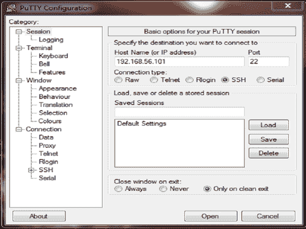
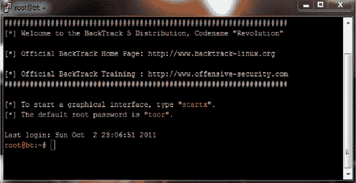

# 第 1 章安全专业人士的 Metasploit 快速提示

在本章中，我们将介绍：

*   在 Windows 上配置 Metasploit
*   在 Ubuntu 上配置 Metasploit
*   带回溯 5 的 Metasploit-终极组合
*   在单机上建立渗透测试实验室
*   在具有 SSH 连接的虚拟机上设置 Metasploit
*   从接口开始——Metasploit 的“Hello World”
*   在 Metasploit 中设置数据库
*   使用数据库存储渗透测试结果
*   分析数据库的存储结果

# 导言

Metasploit 是目前信息安全和渗透测试领域最热门的词。它彻底改变了我们对系统进行安全测试的方式。Metasploit 如此受欢迎的原因是它可以执行广泛的任务，以简化渗透测试工作，从而使系统更加安全。Metasploit 可用于所有流行的操作系统。框架的工作过程对所有人几乎都是一样的。在本书中，我们将主要研究 BackTrack 5 操作系统，因为它附带了预装的 Metasploit 框架和运行在该框架上的其他第三方工具。

让我们从快速介绍框架和与之相关的各种术语开始：

*   **Metasploit 框架：**这是一个免费的开源渗透测试框架，由 H.D.Moore 于 2003 年启动，后来被 Rapid7 收购。框架的当前稳定版本是使用 Ruby 语言编写的。它拥有世界上最大的测试漏洞数据库，每年收到超过一百万次下载。它也是迄今为止用 Ruby 构建的最复杂的项目之一。
*   **漏洞：**该漏洞允许攻击者/笔测试人员侵入/破坏系统安全。这一弱点可能存在于操作系统、应用软件甚至网络协议中。
*   **漏洞利用：**漏洞利用是一种允许攻击者/测试人员利用易受攻击系统并危害其安全性的代码。每个漏洞都有其相应的漏洞。Metasploit v4 有 700 多个漏洞。
*   **有效载荷：**完成工作的实际代码。它在开发后在系统上运行。它们主要用于在攻击者和受害者机器之间建立连接。Metasploit v4 有 250 多个有效负载。
*   **模块：**模块是完整系统的小型构建块。每个模块执行一项特定的任务，通过将多个模块组合成一个单独的单元来构建一个完整的系统。这种体系结构的最大优点是，开发人员可以很容易地将新的利用代码和工具集成到框架中。

Metasploit 框架具有模块化体系结构，漏洞利用、有效负载、编码器等被视为单独的模块。


让我们仔细检查架构图。

Metasploit 使用不同的库，这些库掌握着框架正常运行的关键。这些库是预定义任务、操作和功能的集合，可供框架的不同模块使用。框架最基本的部分是**Ruby 扩展（Rex）**库。Rex 提供的一些组件包括包装器套接字子系统、协议客户机和服务器的实现、日志子系统、利用工具类和许多其他有用的类。Rex 本身被设计为没有依赖项，除了默认 Ruby 安装所附带的依赖项。

然后我们有 MSF 核心库，它扩展了 Rex。Core 负责实现允许与漏洞模块、会话和插件交互的所有必需接口。该核心库由框架基础库扩展，框架基础库旨在为处理框架核心提供更简单的包装例程，并提供用于处理框架不同方面的实用程序类，例如将模块状态序列化为不同的输出格式。最后，基础库通过框架的**用户界面（UI）**进行扩展，该界面实现了对框架本身不同类型用户界面的支持，例如命令控制台和 web 界面。

框架提供了四种不同的用户界面，即 `msfconsole, msfcli, msfgui`和 `msfweb`。我们非常鼓励您查看所有这些不同的接口，但在本书中，我们将主要研究 `msfconsole`接口。其背后的原因是 `msfconsole`利用了所有功能，为框架提供了最佳支持。

现在让我们进入本章的食谱，实际分析各个方面。

# 在 Windows 上配置 Metasploit

在 Windows 上安装 Metasploit 框架非常简单，几乎不需要任何努力。框架安装程序可从 Metasploit 官方网站（[下载 http://www.metasploit.com/download](http://www.metasploit.com/download) ）。

## 准备好了吗

您会注意到有两种类型的安装程序可用于 Windows。建议下载 Metasploit 框架的完整安装程序，其中包含控制台和所有其他相关依赖项，以及数据库和运行时设置。如果您已经有一个配置好的数据库要用于框架，那么您可以使用框架的迷你安装程序，它只安装控制台和依赖项。

## 怎么做。。。

下载完安装程序后，只需运行它并静坐。它将自动安装所有相关组件并为您设置数据库。安装完成后，您可以通过安装程序创建的各种快捷方式访问框架。

## 它是如何工作的。。。

您会发现安装程序为您创建了许多快捷方式。在 Windows 环境中，大多数操作都是“点击即走”。您将找到的一些选项包括 Metasploit web、cmd 控制台、Metasploit update 等。

### 注

在 Windows 上安装 Metasploit 时，应禁用防病毒保护，因为它可能会将某些安装文件检测为潜在病毒或威胁，并会阻止安装过程。安装完成后，请确保在防病毒软件中已将框架安装目录列为白名单，因为它将检测到恶意攻击和有效负载。

## 还有更多。。。

现在，让我们讨论一些其他选项，或者一些与在 Windows 上显式安装 Metasploit 框架相关的一般信息。

### 安装过程中出现数据库错误

在 Windows 计算机上安装 Metasploit 框架时，许多用户都会遇到一个常见问题。运行安装程序时，您可能会遇到错误消息，如屏幕截图所示：


这是配置 PostgreSQL server 时出错的结果。可能的原因是：

*   PostgreSQL 未运行。使用 Netstat 确定端口是否打开，数据库是否正在运行。
*   某些安装程序需要默认安装路径。例如，如果默认路径为 `C`驱动器，则将其更改为 `D`驱动器将导致此错误。
*   语言编码。

如果您面临这个问题，那么您可以通过下载只包含控制台和依赖项的框架的更简单版本来克服它。然后，手动配置数据库并将其与 Metasploit 连接。

# 在 Ubuntu 上配置 Metasploit

Metasploit 框架完全支持基于 Ubuntu 的 Linux 操作系统。安装过程与 Windows 有点不同。

## 准备好了吗

从 Metasploit 官方网站（[下载设置 http://www.metasploit.com/download](http://www.metasploit.com/download/) ）。

同样，您可以选择最小设置或完全设置。根据您的需要选择您的下载。完整设置将包括所有依赖项、数据库设置、环境等，而最小设置仅包含没有数据库设置的依赖项。

## 怎么做。。。

安装完整设置的过程与最小设置有点不同。让我们逐一分析一下：

*   **完整安装程序：**您需要执行以下命令才能在 Ubuntu 机器上安装框架：

    ```
    $ chmod +x framework-4.*-linux-full.run
    $ sudo ./framework-4.*-linux-full.run

    ```

*   **最小安装程序：**您需要执行以下命令以使用最小选项安装框架：

    ```
    $ chmod +x framework-4.*-linux-mini.run
    $ sudo ./framework-4.*-linux-mini.run

    ```

## 它是如何工作的。。。

上面演示的安装过程是几乎所有软件的一个简单的基于 Ubuntu 的安装过程。安装完成后，您可以运行 `hash -r`重新加载路径。

### 注

几乎所有版本的 Linux 都可以遵循此安装过程。

## 还有更多。。。

现在，让我们讨论一些其他选项，或者一些与此任务相关的一般信息。

### 安装过程中的错误

由于某些原因，安装程序可能无法为您工作。Ubuntu 的某些版本附带了损坏的 Ruby 语言库，这可能是安装失败的原因之一。在这种情况下，我们可以通过执行以下命令分别安装依赖项：

要安装 Ruby 依赖项，请运行：

```
$ sudo apt-get install ruby libopenssl-ruby libyaml-ruby libdl-ruby libiconv-ruby libreadline-ruby irb ri rubygems

```

要安装 subversion 客户端，请运行：

```
$ sudo apt-get install subversion

```

要构建本机扩展，请运行：

```
$ sudo apt-get install build-essential ruby-dev libpcap-dev

```

安装以下依赖项后，从 Metasploit 官方下载页面下载 Metasploit Unix tarball，并执行以下命令：

```
$ tar xf framework-4.X.tar.gz
$ sudo mkdir -p /opt/metasploit4
$ sudo cp -a msf4/ /opt/metasploit3/msf4
$ sudo chown root:root -R /opt/metasploit4/msf4
$ sudo ln -sf /opt/metasploit3/msf3/msf* /usr/local/bin/

```

成功执行上述命令后，框架将启动并运行以接收您的指令。

# 带回溯 5 的 Metasploit 是终极组合

BackTrack 是安全专业人员最流行的操作系统，原因有二。首先，它预装了所有流行的渗透测试工具，因此降低了单独安装的成本。其次，它是一个基于 Linux 的操作系统，使其不易受到病毒攻击，并在渗透测试期间提供更高的稳定性。它可以节省您安装相关组件和工具的时间，谁知道您在安装过程中何时可能会遇到未知错误。

## 准备好了吗

您可以在硬盘上单独安装 BackTrack，也可以在虚拟机的主机上使用它。安装过程很简单，与安装任何基于 Linux 的操作系统相同。

## 怎么做。。。

1.  在引导回溯操作系统时，将要求您输入用户名和密码。根用户的默认用户名为 `root`，密码为 `toor`。
2.  成功登录后，您可以在命令行上工作，也可以输入 `startx`以进入 GUI 模式。
3.  You can either start the Metasploit framework from the **Applications** menu or from the command line. To launch Metasploit from the **Applications** menu go to **Applications | BackTrack | Exploitation Tools | Network Exploitation Tools | Metasploit Framework**, as shown in the following screenshot:

    

4.  Metasploit 遵循一个简单的目录结构层次结构，其中根文件夹为 `pentest`。目录进一步分支到 `/exploits/framework3`。要从命令行启动 Metasploit，请启动终端并输入以下命令以移动到 Metasploit 目录：

    ```
    root@bt:~# cd /pentest/exploits/framework3
    root@bt:/pentest/exploits/framework3 ~# ./msfconsole

    ```

## 它是如何工作的。。。

从命令行启动 Metasploit 将遵循到 `msfconsole`的完整路径。从**应用程序**菜单启动它将为我们提供对不同用户界面的直接访问。

# 在单机上建立渗透测试实验室

您可以使用多台机器设置渗透测试实验室，这也是理想的设置。但是，如果您遇到紧急情况，并且您立即需要设置一个测试场景，而您只有一台机器，该怎么办？使用虚拟机是显而易见的答案。您可以同时在多个操作系统上工作，并执行渗透测试任务。因此，让我们快速了解一下如何借助虚拟机在单个系统上建立渗透测试实验室。

## 准备好了吗

我们将使用一个虚拟箱来设置两个具有 BackTrack 5 和 Windows XP SP2 操作系统的虚拟机。我们的主机系统是 Windows 7 计算机。我们需要 virtual box 安装程序，以及要在虚拟机中设置的两个操作系统的映像文件或安装盘。因此，我们的完整设置将包括一个运行 Windows 7 的主机系统和两个分别运行 BackTrack 5 和 Windows XP SP2 的虚拟系统。

## 怎么做。。。

安装虚拟机的过程简单明了。遵循以下步骤：

1.  安装虚拟机盒后，创建一个新的虚拟机。选择合适的选项并点击**下一步**。您必须提供安装介质才能开始安装。介质可以是映像文件或安装盘。有关虚拟机的完整手册和安装过程，请访问以下链接：[http://www.virtualbox.org/manual/UserManual.html](http://www.virtualbox.org/manual/UserManual.html)
2.  为了获得更好的虚拟机性能，建议 32 位操作系统至少有 4 GB 的可用 RAM，64 位操作系统至少有 8 GB 的可用 RAM。在下一个食谱中，我将向您展示一种在运行多个虚拟机时降低内存使用率的酷方法。
3.  创建**虚拟机（VM）**后，您可以使用“克隆”选项。这将创建虚拟机的精确副本，以便在运行的虚拟机出现故障时，您可以切换到克隆的虚拟机，而无需担心重新安装。您还可以使用“快照”选项保存 VM 的当前状态。快照将保存虚拟机的当前工作设置，您可以在将来随时恢复到保存的快照。

## 它是如何工作的。。。

在启动虚拟机之前，我们必须进行一个重要的配置，以使两个虚拟机相互通信。选择其中一个虚拟机，点击**设置**。然后进入**网络设置**。在网络适配器中，将预安装 NAT 适配器，用于主机的 internet 使用。在**适配器 2**下选择**仅主机适配器：**


对于这两个虚拟机，请遵循此过程。设置**纯主机适配器**的原因是为了使两个虚拟机相互通信。现在，为了测试是否一切正常，在命令提示符中输入 `ipconfig`检查 windows 虚拟机的 IP 地址。现在从回溯机器 ping Windows 机器（使用从 `ipconfig`命令获得的本地 IP 地址），查看它是否正在接收数据包。按照相反的流程交叉检查两台机器。

## 还有更多。。。

现在，让我们讨论一些与此任务相关的其他选项，或者可能的一些一般信息。

### 禁用防火墙和防病毒保护

在某些情况下，我们可能会发现，当从回溯机器 ping Windows 机器时，没有收到数据包。这意味着 Windows 计算机不活动。这可能是由于默认的 Windows 防火墙设置造成的。因此，禁用防火墙保护并再次 ping 以查看是否接收到数据包。此外，请禁用虚拟机中可能安装的任何防火墙。

### 安装虚拟箱来宾添加

虚拟盒提供附加组件的附加安装，可以改善您的虚拟使用体验。它的一些主要好处是：

*   从主机操作系统到虚拟操作系统的无缝鼠标移动
*   自动键盘与虚拟操作系统的集成
*   更好的屏幕尺寸

要安装来宾添加，请打开虚拟机电源，转到**设备**选项卡并单击**安装来宾添加**。

# 在具有 SSH 连接的虚拟机上设置 Metasploit

在前面的方法中，我们重点关注在虚拟化的帮助下在一台机器上建立一个渗透测试实验室。但是，在使用多个虚拟机时，可能存在严重的内存使用问题。所以，在这里，我们将讨论一种在经济不景气的时候非常有用的保护技术。

## 准备好了吗

我们只需要一个 SSH 客户端。我们将使用 PuTTY，因为它是 Windows 上最流行、最免费的 SSH 客户端。我们将与回溯机器建立 SSH 连接，因为它比 Windows XP 机器占用更多内存。

## 怎么做。。。

1.  We will start by booting our BackTrack virtual machine. On reaching the login prompt, enter the credentials to start the command line. Now don't start the GUI. Execute any one of the following commands:

    ```
    root@bt:~# /etc/init.d/start ssh
    root@bt:~# start ssh

    ```

    这将在回溯机器上启动 SSH 进程。

2.  Now find the IP address of the machine by entering the following command:

    ```
    root@bt:~# ifconfig

    ```

    记下这个 IP 地址

3.  Now start PuTTY on the host operating system. Enter the IP address of the BackTrack virtual machine and enter port `22:`

    

4.  Now click on **Open** to launch the command line. If the connection is successful, you will see the PuTTY command line functioning on behalf of the BackTrack machine. It will ask you to log in. Enter the credentials and enter `ifconfig` to check if the IP is the same as that of the virtual BackTrack:

    

## 它是如何工作的。。。

在这个 SSH 会话中，我们现在可以使用 PuTTY 与回溯虚拟机交互。由于没有加载 GUI，它将内存消耗减少了近一半。此外，最小化回溯虚拟机还将进一步减少内存消耗，因为 Windows 操作系统为最小化的进程提供更少的内存共享，并更快地执行以最大化模式运行的任务。这将在一定程度上进一步减少内存消耗。

# 从接口开始，Metasploit 的“Hello World”

接口为用户提供了与软件或平台通信的前端。Metasploit 有四个接口，即 `msfgui, msfweb, msfcli`和 `msfconsole`。强烈建议您查看所有接口，但在本书中，我们将主要关注 `msfconsole`接口。它是其中功能最强大且完全集成的接口。

## 准备好了吗

启动已安装 Metasploit 的操作系统。如果您在虚拟机上使用它，请启动它。

## 怎么做。。。

发射 `msfconsole`是一项简单的任务。遵循以下步骤：

1.  对于 Windows 操作系统，您可以通过进入**启动| metasploit framework | msfconsole**启动 `msfconsole`。
2.  对于回溯，您可以浏览到**应用程序|开发工具|网络开发工具| Metasploit framework | msfconsole**。
3.  要直接从终端启动，请添加以下命令：

    ```
    root@bt:~# cd /pentest/exploits/framework3

    ```

4.  工作目录将更改为 `framework3`。输入以下命令将启动我们的 `msfconsole:`

    ```
    root@bt:/pentest/exploits/framework3# ./msfconsole

    ```

现在，我们的 `msfconsole`接口已启动并运行，准备接收命令。

## 它是如何工作的。。。

Metasploit 接口扩展了基本库，使它们能够调用框架的初始功能。可以执行简单的命令，例如设置漏洞利用和有效负载、运行更新和配置数据库。一旦进程深入，其他函数库也会相应地被调用。

## 还有更多。。。

让我们添加一些额外的东西，您可以在这个阶段通过 `msfconsole`接口执行。

### 一些用于尝试和启动的命令

以下是一些命令，您可以尝试更深入地了解这些命令：

*   `msf > ls:`该 `ls`命令将列出所有可用的目录和文件。您可以进一步导航到其他目录以进一步探索。
*   `msf > help:`此命令将列出我们可以使用的 Metasploit 框架的所有可用命令。这些命令分为核心命令和数据库后端命令。前者包含与框架直接相关的命令，而后者提供与数据库交互的命令。
*   `msf > msfupdate:`应经常使用此命令更新框架的最新漏洞、有效负载、库等。

# 在 Metasploit 中设置数据库

Metasploit 的一个重要特性是存在可用于存储渗透测试结果的数据库。任何渗透测试都包含大量信息，并且可以运行数天，因此存储中间结果和发现变得至关重要。因此，一个好的渗透测试工具应该有适当的数据库集成，以快速有效地存储结果。

## 准备好了吗

Metasploit 附带 PostgreSQL 作为默认数据库。对于回溯机器，我们还有一个选项 MySQL。您可以使用这两个数据库中的任何一个。让我们首先检查一下 PostgreSQL 数据库的默认设置。我们必须导航到位于 `opt/framework3/config`下的 `database.yml`。要执行此操作，请运行以下命令：

```
root@bt:~# cd /opt/framework3/config
root@bt:/opt/framework3/config# cat database.yml
production: adapter: postgresql database: msf3 username: msf3 password: 8b826ac0 host: 127.0.0.1 port: 7175 pool: 75 timeout: 5

```

请注意已创建的默认用户名、密码和默认数据库。记下这些值，因为需要进一步记录。您也可以根据自己的选择更改这些值。

## 怎么做。。。

现在我们的工作是连接数据库并开始使用它。让我们启动 `msfconsole`，看看如何设置数据库和存储结果。

让我们首先检查可用的数据库驱动程序。

```
msf > db_driver
[*]Active Driver: postgresql
[*]Available: postgresql, mysql

```

PostgreSQL 被设置为默认数据库。如果要更改数据库驱动程序，则可以执行以下命令：

```
Msf> db_driver mysql
[*]Active Driver: Mysql

```

这会将活动驱动程序更改为 MySQL。在本书中，我们将主要使用 PostgreSQL 进行演示。

### 注

在最新版本的 Metasploit 中，Rapid7 已经放弃了对 MySQL 数据库的支持，因此 `db_driver`命令可能无法工作。在这种情况下，框架支持的唯一默认驱动程序将是 PostgreSQL。

## 它是如何工作的。。。

要将驱动程序连接到 `msfconsle`，我们将使用 `db_connect`命令。此命令将使用以下语法执行：

```
db_connect username:password@hostIP:port number/database_name 

```

在这里，我们将使用相同的用户名、密码、数据库名称和端口号的默认值，这些值是我们刚刚从 `database.yml`文件中记下的：

```
msf > db_connect msf3:8b826ac0@127.0.0.1:7175/msf3

```

成功执行命令后，我们的数据库将完全配置。

## 还有更多。。。

让我们讨论一些与建立数据库有关的更重要的事实。

### 连接数据库时出错

尝试建立连接时可能会出错。如果出现任何错误，请记住两件事：

*   检查 `db_driver`和 `db_connect`命令，确保您使用的是正确的数据库组合。
*   使用 `start/etc/init.d`启动数据库服务，然后尝试连接。

如果错误仍然存在，我们可以使用以下命令重新安装数据库和相关库：

```
msf> gem install postgres
msf> apt-get install libpq-dev

```

### 删除数据库

您可以随时删除创建的数据库，然后重新启动以存储新结果。删除数据库可以执行以下命令：

```
msf> db_destroy msf3:8b826ac0@127.0.0.1:7175/msf3
Database "msf3" dropped.
msf>

```

# 使用数据库存储渗透测试结果

现在让我们学习如何使用配置的数据库存储渗透测试的结果。

## 准备好了吗

如果您已经成功执行了上一个配方，那么您就可以使用数据库来存储结果。在 `msfconsole`中输入 `help`命令，快速查看我们可用的重要数据库命令。

## 怎么做。。。

让我们从一个简单的例子开始。 `db_nmap`命令将端口扫描结果以及所有相关信息直接存储到数据库中。在目标计算机上启动简单的 Nmap 扫描，查看其工作原理：

```
msf > db_nmap 192.168.56.102
[*] Nmap: Starting Nmap 5.51SVN ( http://nmap.org ) at 2011-10-04 20:03 IST
[*] Nmap: Nmap scan report for 192.168.56.102
[*] Nmap: Host is up (0.0012s latency)
[*] Nmap: Not shown: 997 closed ports
[*] Nmap: PORT STATE SERVICE
[*] Nmap: 135/tcp open msrpc
[*] Nmap: 139/tcp open netbios-ssn
[*] Nmap: 445/tcp open microsoft-ds
[*] Nmap: MAC Address: 08:00:27:34:A8:87 (Cadmus Computer Systems)
[*] Nmap: Nmap done: 1 IP address (1 host up) scanned in 1.94 seconds

```

正如我们所见，Nmap 已经生成了扫描结果，它将自动填充我们正在使用的 `msf3`数据库。

我们还可以在 Nmap 扫描中使用 `-oX`参数以 XML 格式存储结果。这将非常有利于我们将扫描结果导入其他第三方软件，如我们将在下一章分析的 Dardis 框架。

```
msf > nmap 192.168.56.102 -A -oX report
[*] exec: nmap 192.168.56.102 -A -oX report
Starting Nmap 5.51SVN ( http://nmap.org ) at 2011-10-05 11:57 IST
Nmap scan report for 192.168.56.102
Host is up (0.0032s latency)
Not shown: 997 closed ports
PORT STATE SERVICE
135/tcp open msrpc
139/tcp open netbios-ssn
445/tcp open microsoft-ds
MAC Address: 08:00:27:34:A8:87 (Cadmus Computer Systems)
Nmap done: 1 IP address (1 host up) scanned in 0.76 seconds

```

此处 `report`是存储扫描结果的文件名。这将有助于我们在本书后面的食谱。

## 它是如何工作的。。。

`db_nmap`命令使用与扫描结果相关的各种表列创建 SQL 查询。扫描完成后，它开始将值存储到数据库中。以电子表格形式存储结果的灵活性使得在本地或与第三方工具共享结果变得更加容易。

# 分析数据库存储结果

将测试结果存储在数据库中后，下一步是对其进行分析。分析数据将使我们对目标系统有更深入的了解。根据使用情况，数据库的结果可以长时间保存，也可以短时间保存。

## 准备好了吗

启动 `msfconsole`并按照前面配方中提到的步骤建立数据库连接。我们可以使用它来存储新的结果，也可以分析以前存储的结果。可以导入在上一个配方中创建的 Nmap 扫描的 XML 文件，以分析上一个扫描结果。

## 怎么做。。。

让我们分析一些重要的命令，以便更清楚地了解存储的结果：

*   `msf > hosts:` This command will show all the hosts that are available in the database. Let us analyze the output of this command:

    

    前面的屏幕快照反映了 hosts 命令的输出。正如我们所看到的，这个命令的结果不是很清晰，因为表中有很多列。因此，我们可以继续添加过滤器，只查看我们感兴趣的列，如下命令所示：

    ```
    msf > hosts -c address,os_name
    Hosts 
    ===== 
    address os_name 
    ------- ------ 
    192.168.56.1 
    192.168.56.101 
    192.168.56.102 Microsoft Windows 
    192.168.56.103 Linux 

    ```

*   `msf > services:`这是另一个有趣的命令，可以为我们提供有关目标机器上运行的不同服务的有用信息：

    ```
    msf > services
    Services 
    ======== 
    host port proto name state info 
    ---- ---- ----- ---- ----- ---- 
    192.168.56.101 111 tcp rpcbind open 
    192.168.56.102 135 tcp msrpc open 
    192.168.56.102 139 tcp netbios-ssn open 
    192.168.56.102 445 tcp microsoft-ds open 
    192.168.56.102 135 tcp msrpc open Microsoft Windows 
    RPC

    ```

*   `msf > vulns:`此命令列出数据库中存在的主机中存在的所有漏洞。
*   `msf > db_autopwn:`这是一个强大的命令，用于自动化利用数据库中可用的目标机器的过程。此命令需要更多地了解利用过程，因此我们稍后将分析此命令。

## 它是如何工作的。。。

分析过程很简单，可以很容易地过滤以获得所需的结果。我们已经了解了如何读取数据库输出以及如何有效地管理它。最后两个命令 `vulns`和 `db_autopwn`是开发后的命令，我们将在后面的章节中讨论。