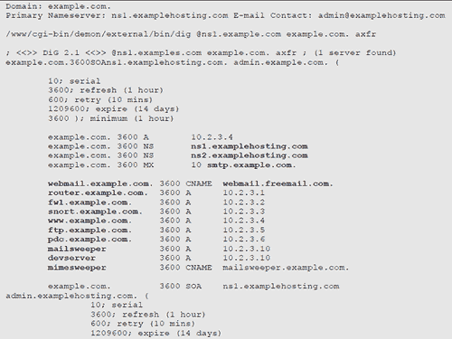
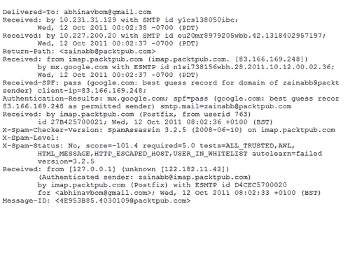
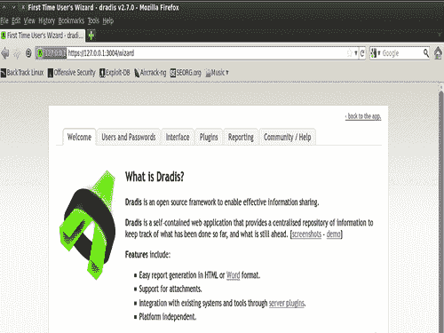
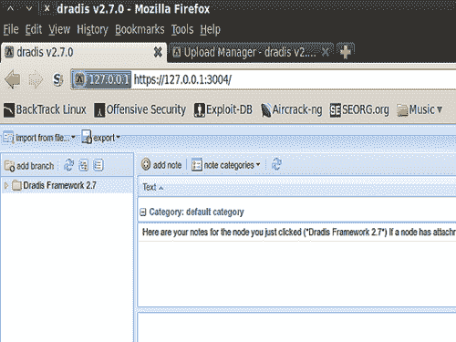
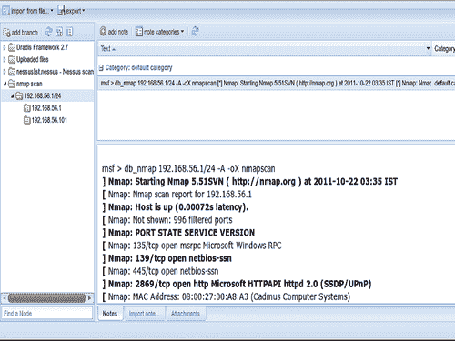

# 第二章信息收集与扫描

在本章中，我们将介绍：

*   被动信息收集 1.0-传统方式
*   被动信息收集 2.0-下一个级别
*   端口扫描-Nmap 方式
*   探索扫描辅助模块
*   带有辅助模块的目标服务扫描
*   使用 Nessus 进行漏洞扫描
*   NeXpose 扫描
*   与 Dradis 框架共享信息

# 导言

信息收集是渗透测试的第一个基本步骤。执行此步骤是为了尽可能多地了解有关目标机器的信息。我们掌握的信息越多，我们利用目标的机会就越大。在信息收集阶段，我们主要关注的是收集有关目标机器的事实，例如 IP 地址、可用服务、开放端口。这些信息在渗透测试过程中起着至关重要的作用。信息收集基本上有三种技术。

*   被动信息收集
*   积极收集信息
*   社会工程

让我们快速了解一下这些过程：

*   **被动信息采集：**该技术用于获取有关目标的信息，而无需任何物理连接或访问。这意味着我们使用其他来源来获取关于目标的信息，比如使用 `whois`查询、 `Nslookup`等等。假设我们的目标是一个在线 web 应用程序，那么一个简单的 `whois`查找可以为我们提供有关 web 应用程序的大量信息，如其 IP 地址、域和子域、服务器位置、托管服务器等。该信息在渗透测试期间非常有用，因为它可以拓宽我们利用目标的轨迹。
*   **主动信息采集：**在该技术中，与目标建立逻辑连接以获取信息。这项技术为我们提供了下一层次的信息，可以直接补充我们对目标安全性的理解。端口扫描；目标是最广泛使用的主动扫描技术，其中我们重点关注目标上运行的开放端口和可用服务。
*   **社会工程：**这种类型的信息收集类似于被动信息收集，但依赖于人为错误和以打印输出、电话对话或不正确的电子邮件 ID 等形式泄露的信息。使用这种方法的技术很多，信息收集的精神非常不同，因此，社会工程本身就是一个范畴。例如，黑客注册听起来与拼写错误相似的域名，并设置邮件服务器接收此类错误电子邮件。这类领域被称为“双重领域”，即邪恶孪生兄弟。

在本章中，我们将详细分析各种被动和主动信息收集技术。在开始的两个方案中，我们将分析最常用和最常被忽略的被动信息收集技术，然后在后面的方案中，我们将重点关注通过端口扫描获取信息。Metasploit 具有若干内置扫描功能，以及一些与之集成的第三方工具，以进一步增强端口扫描过程。我们将分析内置的扫描仪，以及在 Metasploit 框架上工作的一些流行的第三方扫描仪。让我们继续学习配方，开始获取目标信息的过程。

# 被动信息采集 1.0-传统方式

让我们来讨论一些最常用的信息收集技术。

## 准备好了吗

`whois, Dig`和 `Nslookup`是获取目标初始信息的三个最基本、最简单的步骤。由于两者都是获取信息的被动技术，因此不需要与目标连接。这些命令可以直接从 `BackTrack`终端执行。因此，启动终端窗口并继续。

## 怎么做。。。

我们将从一个简单的 `whois`查找开始我们的信息收集。 `whois`是 `BackTrack`中的内置命令，因此我们可以直接从终端调用它。

让我们快速在[www.packtpub.com](http://www.packtpub.com)上进行 `whois`查找，并分析输出。输出可能很大，所以这里我们只关注输出的相关点。

```
root@bt:~# whois www.packtpub.com
Domain Name: PACKTPUB.COM
Registrar: EASYDNS TECHNOLOGIES, INC.
Whois Server: whois.easydns.com
Referral URL: http://www.easydns.com
Name Server: NS1.EASYDNS.COM
Name Server: NS2.EASYDNS.COM
Name Server: NS3.EASYDNS.ORG
Name Server: NS6.EASYDNS.NET
Name Server: REMOTE1.EASYDNS.COM
Name Server: REMOTE2.EASYDNS.COM
Status: clientTransferProhibited
Status: clientUpdateProhibited
Updated Date: 09-feb-2011
Creation Date: 09-may-2003
Expiration Date: 09-may-2016

```

在这里，我们可以看到一个简单的 `whois`查找已经揭示了一些关于目标网站的信息。这些信息包括 DNS 服务器、创建日期、过期日期等。由于这些信息是从目标以外的来源收集的，因此被称为被动信息收集技术。

被动获取信息的另一种方法是查询 DNS 记录。最常见的技术是使用 `dig`命令，这是 Unix 机器中默认的。让我们分析一下[www.packtpub.com 上的 `dig`查询。](http://www.packtpub.com.)

```
 root@bt:~# dig www.packtpub.com
; <<>> DiG 9.7.0-P1 <<>> www.packtpub.com
;; global options: +cmd
;; Got answer:
;; ->>HEADER<<- opcode: QUERY, status: NOERROR, id: 1583
;; flags: qr rd ra; QUERY: 1, ANSWER: 2, AUTHORITY: 6, ADDITIONAL: 1
;; QUESTION SECTION:
;www.packtpub.com. IN A
;; ANSWER SECTION:
www.packtpub.com. 1200 IN CNAME packtpub.com.
packtpub.com. 1200 IN A 83.166.169.228
;; AUTHORITY SECTION:
packtpub.com. 1200 IN NS remote1.easydns.com.
packtpub.com. 1200 IN NS ns2.easydns.com.
packtpub.com. 1200 IN NS ns6.easydns.net.
packtpub.com. 1200 IN NS ns3.easydns.org.
packtpub.com. 1200 IN NS ns1.easydns.com.
packtpub.com. 1200 IN NS remote2.easydns.com.
;; ADDITIONAL SECTION:
ns3.easydns.org. 5951 IN A 64.68.192.10 
```

查询 DNS 记录显示了有关目标的更多信息。 `dig`可用于将主机名称解析为 IP 地址，反之，可将 IP 地址解析为名称。此外，`dig` 还可用于从名称服务器收集版本信息，这些信息可用于帮助利用主机。正如我们在输出中看到的，很难识别主 DNS，或者在某些情况下识别主邮件服务器或文件托管服务器，等等。这就是`Nslookup`进入画面的地方。 `Nslookup`几乎和 dig 一样灵活，但提供了一种更简单的默认方法来识别主要主机，如邮件和 DNS 服务器。

```
 root@bt:~# nslookup www.packtpub.com
Server: 220.226.6.104
Address: 220.226.6.104#53
Non-authoritative answer:
www.packtpub.com canonical name = packtpub.com.
Name: packtpub.com
Address: 83.166.169.228 
```

`Nslookup`透露了有关目标的更多信息，如其 IP 地址、服务器 IP 等。这些被动技术可以揭示一些有关目标的有趣信息，并可以简化我们的渗透测试。

## 它是如何工作的。。。

`dig`可用于查找**SPF**（发送方策略框架）记录。SPF 记录是定义域的邮件发送策略的记录，也就是说，哪些服务器负责代表域发送邮件。不正确的 SPF 记录将始终导致网络钓鱼/垃圾邮件。

SPF 记录以文本格式发布。SPF 记录负责确保特定域的注册用户或特定域的合作伙伴不会受到钓鱼邮件的攻击。从 `dig`查询中收集的信息可以帮助我们确定目标中的此类问题。

## 还有更多。。。

让我们讨论更多关于被动信息收集的内容。

### 使用第三方网站

我们使用了内置命令来查询目标并获取信息。使用网站执行类似操作也有一种同样好的技术，特别是专门用于此类查找的网站。这些网站还可以提供有关地理位置、联系电话、管理员电子邮件等信息。

以下是一些有用的链接：

[http://who.is](http://who.is)

[http://www.kloth.net](http://www.kloth.net)

# 被动信息采集 2.0-下一级

每个安全专业人员都知道上一个配方中讨论的信息收集技术。但是有一些技术由于受欢迎程度和知名度的降低而被分析人员忽视，但它们可以产生与以前的技术一样好的结果。我们将在这里讨论的技术将涉及对目标的更深入分析，尽管我们仍将使用被动技术。这些技术不需要使用 Metasploit，但由于信息收集是渗透测试的一个重要领域，我们将在这里讨论它。

## 准备好了吗

在本食谱中，我们将了解三种技巧：

*   **区域转移：**可通过终端进行。
*   **SMTP 头：**对于这种技术，我们需要目标向渗透测试仪发送一封电子邮件。
*   **Google dork:**这是一种通过搜索引擎获取信息的简单而实用的技术。

让我们从区域转移开始。

## 怎么做。。。

**区域转移**是 DNS 服务器在多台服务器之间交换一个域的权威记录的一种特殊方式。此方法负责在主服务器和辅助服务器之间传输域信息的批量列表。配置错误的 DNS 服务器可以响应客户端查询并提供有关查询域的信息。

考虑下面的示例，其中查询 ORT T0A.返回 IP 地址列表及其对应的主机名：



此查询识别了十个主机名，其中八个唯一主机属于 `example.com`。我们可以看到，主机名具有足够的描述性，可以清楚地了解正在运行的服务的类型。

分析 SMTP 标头可能是收集有关目标的信息的另一个潜在来源。它可以为我们提供有关邮件服务器、其 IP 地址、版本等的信息。这种方法的唯一缺点是，我们需要从目标位置发送一封电子邮件来分析它。下面的屏幕截图显示了从目标发送的邮件的标题部分。



仔细分析邮件头显示邮件服务器的 IP 地址为 83.166.169.248。邮件服务器使用 ESMTP 服务，用户使用 IMAP 服务。这些额外的信息对于进一步探索目标非常有用。

最后一种技术是使用谷歌傻瓜。这种方法只能在某些情况下使用，但值得一试，因为你永远不知道它会泄露什么秘密信息。很多时候，谷歌爬虫会到达目标服务器上存储的某些文件或文档，以供内部使用，但这是由于互联网访问；爬虫在搜索结果中为文档编制索引。在这种情况下，我们可以使用一些谷歌搜索技巧来查找此类文件。搜索结果中**站点**和**文件类型**的组合可以揭示一些令人兴奋的东西。

例如，在 Google 中执行以下搜索查询：

*   `www.target .com filetype:xls`
*   `www.target.com filetype:pdf`
*   `site:www.target.com filetype:db`

同样，我们可以尝试几种不同的组合，从谷歌搜索中挖掘出结果。

## 它是如何工作的。。。

`dig`查询基本上返回注册时 IP 或域所有者提供的数据。区域传输信息特别提供给 DNS 服务器，以便建立注册域的正确映射。 `dig`查询有助于获取此信息。SMTP 标头是电子邮件的原始数据体。由于它是电子邮件的主要数据表示形式，因此它包含了大量有关电子邮件发件人的信息。

Google dorks 只不过是 Google crawler 索引的各种文件的搜索结果。一旦文件在谷歌搜索中被索引，就可以使用一些特定的搜索类型来查看它。

## 还有更多。。。

### 与傻子一起玩

[www.jhony.ihackstuff.com](http://www.jhony.ihackstuff.com)是 Google dorks 最全面的指南，在这里你可以找到一个完整的 dorks 列表，它可以揭示很多关于你目标的隐藏信息。

# 端口扫描——Nmap 方式

端口扫描是一种主动信息收集技术，我们现在将开始直接处理目标。端口扫描是一个有趣的信息收集过程。它涉及到对目标机器的更深入搜索。 `Nmap`是安全专业人士最强大和首选的扫描仪。 `Nmap`的用法从新手到高级不等。我们将详细分析各种扫描技术。

## 准备好了吗

从 `Metasploit`开始 `nmap`很容易。启动 `msf`控制台并输入 `nmap`以显示 Nmap 提供的扫描选项列表。

```
msf > nmap

```

## 怎么做。。。

我们将分析四种不同类型的 `Nmap`扫描，这对渗透测试非常有用。 `Nmap`提供多种扫描目标机器的模式。这里，我们将重点介绍四种扫描类型，即**TCP 连接扫描、SYN 隐形扫描、UDP 扫描**和**ACK 扫描**。 `Nmap`的不同扫描选项也可以组合在一次扫描中，以便对目标执行更高级和更复杂的扫描。让我们继续前进，开始扫描过程。

**TCP connect[-sT]**扫描是 `Nmap`中最基本、最默认的扫描类型。它遵循三向握手过程来检测目标机器上的开放端口。让我们对目标进行扫描。

```
msf > nmap -sT -p1-10000 192.168.56.102 [*] exec: nmap -sT -p1-10000 192.168.56.102 Starting Nmap 5.51SVN ( http://nmap.org ) at 2011-10-19 00:03 IST Nmap scan report for 192.168.56.102 Host is up (0.0058s latency).
Not shown: 9997 closed ports
PORT STATE SERVICE 135/tcp open msrpc 139/tcp open netbios-ssn 445/tcp open microsoft-ds MAC Address: 08:00:27:34:A8:87 (Cadmus Computer Systems 
```

正如我们所看到的，我们已经传递了 `-sT`参数，它表示我们想要执行 TCP 连接扫描。 `-p`参数显示我们要扫描的端口号范围。TCP 连接扫描基于三向握手过程，因此此扫描返回的结果被认为是准确的。

**SYN 扫描[-sS]**被认为是一种隐形扫描技术，因为它从未在目标和扫描仪之间形成完整的连接。因此，它也被称为半开放扫描。让我们分析目标上的 SYN 扫描。

```
msf > nmap -sS 192.168.56.102 [*] exec: nmap -sS 192.168.56.102 Starting Nmap 5.51SVN ( http://nmap.org ) at 2011-10-19 00:17 IST Nmap scan report for 192.168.56.102 Host is up (0.0019s latency).
Not shown: 997 closed ports
PORT STATE SERVICE 135/tcp open msrpc 139/tcp open netbios-ssn 445/tcp open microsoft-ds MAC Address: 08:00:27:34:A8:87 (Cadmus Computer Systems 

```

`-sS`参数将指示 `Nmap`在目标机器上执行 SYN 扫描。在大多数情况下，TCP connect 和 SYN 扫描的输出类似，但唯一的区别在于，SYN 扫描很难被防火墙和入侵检测系统（IDS）检测到。然而，现代防火墙也足以捕获 SYN 扫描。

**UDP 扫描[-sU]**是识别目标上打开的 UDP 端口的扫描技术。0 字节 UDP 数据包被发送到目标计算机，ICMP 端口不可访问消息的收件人显示该端口已关闭，否则视为打开。可按以下方式使用：

```
msf > nmap -sU -p9001 192.168.56.102

```

以下命令将检查 192.168.56.102 上的 UDP 端口是否打开。类似地，我们可以通过修改 `-p`操作符，在整个端口范围内执行 UDP 扫描。

**ACK scan[-sA]**是一种特殊的扫描类型，用于告知防火墙过滤或未过滤哪些端口。它通过向远程端口发送 TCP ACK 帧进行操作。如果没有响应，则将其视为已过滤端口。如果目标返回 RST 数据包（连接重置），则该端口被视为未过滤端口。

```
msf > nmap -sA 192.168.56.102 [*] exec: nmap -sA 192.168.56.102 Starting Nmap 5.51SVN ( http://nmap.org ) at 2011-10-19 00:19 IST Nmap scan report for 192.168.56.102 Host is up (0.0011s latency).
Not shown: 999 filtered ports
PORT STATE SERVICE 9001/tcp unfiltered tor-orport
MAC Address: 08:00:27:34:A8:87 (Cadmus Computer Systems)

```

前面的输出显示了对目标执行的 ACK 扫描的结果。输出显示已过滤目标上的所有端口，但未过滤的端口号 9001 除外。这将有助于我们发现目标的弱点，因为攻击未过滤的端口将有更好的成功率。

## 它是如何工作的。。。

一般来说，渗透测试人员不会过分强调扫描过程，但良好的扫描可以提供许多有用的结果。由于此处收集的信息将构成渗透测试的基础，因此强烈建议正确了解扫描类型。现在让我们更深入地了解一下我们刚刚学到的每一种扫描技术。

TCP 连接扫描是最基本的扫描技术，其中与被测端口建立完全连接。它使用操作系统的网络功能建立连接。扫描仪向目标机器发送 SYN 数据包。如果端口打开，则会向扫描仪返回 ACK 消息。扫描器然后向目标发送 ACK 数据包，显示成功建立连接。这称为三方握手过程。连接一打开即终止。这种技术有其优点，但很容易通过防火墙和 IDS 进行跟踪。

SYN 扫描是另一种类型的 TCP 扫描，但它从未与目标形成完整的连接。它不使用操作系统的网络功能，而是生成原始 IP 数据包并监视响应。如果端口打开，则目标将响应 ACK 消息。然后扫描仪发送 RST（重置连接）消息并结束连接。因此也称为**半开放扫描**。这被认为是一种隐形扫描技术，因为它可以避免在某些配置错误的防火墙和 ID 中引起注意。

UDP 扫描是一种无连接扫描技术，因此无论目标是否接收到数据包，都不会将任何通知发送回扫描仪。如果端口关闭，则会向扫描仪发回 ICMP 端口不可访问消息。如果未收到任何消息，则端口报告为打开。此方法可能返回错误结果，因为防火墙会阻止数据包，因此不会生成响应消息，扫描仪会报告端口已打开。

确认扫描的唯一目的是识别已过滤和未过滤的端口。这是一种独特且方便的扫描技术，有助于发现目标系统中的弱点，因为未经过滤的端口很容易成为目标。但 ACK 扫描的一个主要缺点是，由于它从未与目标连接，因此无法识别打开的端口。ACK 扫描的输出仅列出端口是否已过滤或未过滤。将 ACK 扫描与其他扫描类型相结合可以实现非常隐蔽的扫描过程。

## 还有更多。。。

让我们介绍更多关于 nmap 扫描的内容，并了解如何将不同的扫描类型合并为一种。

### 操作系统及版本检测

除了端口扫描之外， `Nmap`还提供了一些高级选项。这些选项可以帮助我们获得有关目标的更多信息。最广泛使用的选项之一是**操作系统标识[-O]**。这可以帮助我们识别目标机器上运行的操作系统。显示操作系统检测扫描输出，如下所示：

```
msf > nmap -O 192.168.56.102 [*] exec: nmap -O 192.168.56.102 Starting Nmap 5.51SVN ( http://nmap.org ) at 2011-10-19 02:25 IST Nmap scan report for 192.168.56.102 Host is up (0.0014s latency). MAC Address: 08:00:27:34:A8:87 (Cadmus Computer Systems) Device type: general purpose
Running: Microsoft Windows XP|2003

```

如我们所见， `Nmap`已成功检测到目标机器的操作系统。这可以简化我们根据目标操作系统查找正确漏洞的任务。

另一个广泛使用的 `Nmap`选项是目标上不同开放端口的**版本检测[-sV]**。它可以与我们之前看到的任何扫描类型混合，以添加关于目标开放端口上运行的服务版本的额外信息。

```
msf > nmap -sT -sV 192.168.56.102 [*] exec: nmap -sV 192.168.56.102 Starting Nmap 5.51SVN ( http://nmap.org ) at 2011-10-19 02:27 IST Nmap scan report for 192.168.56.102 Host is up (0.0011s latency). Not shown: 997 closed ports PORT STATE SERVICE VERSION 135/tcp open msrpc Microsoft Windows RPC 139/tcp open netbios-ssn 445/tcp open microsoft-ds Microsoft Windows XP
MAC Address: 08:00:27:34:A8:87 (Cadmus Computer Systems) Service Info: OS: Windows

```

正如我们所看到的，在扫描输出中增加了一列 `Versions`，报告目标机器上运行的不同版本的服务。

### 增加匿名性

以匿名方式执行扫描非常重要。如果您在不使用安全措施的情况下执行扫描，防火墙和 IDS 日志可能会显示您的 IP 地址。 `Nmap`中提供了一个这样的特征，称为**诱饵[-D]。**

诱饵选项不会阻止您的 IP 地址被记录在防火墙和 ID 的日志文件中，但它确实会使扫描看起来很可怕。它在日志文件中添加了其他 Torrent，从而产生了一种印象，即有多个其他攻击者同时扫描机器。因此，如果您添加两个假 IP 地址，那么日志文件将显示请求数据包是从三个不同的 IP 地址发送的，一个是您的，另外两个是您添加的假地址。

```
msf > nmap -sS 192.168.56.102 -D 192.134.24.34,192.144.56.21 

```

下面的扫描示例显示了诱饵参数的使用。 `-D`操作员之后的 IP 地址是假 IP 地址，与原始 IP 地址一起出现在目标机器的网络日志文件中。这个过程可能会让网络管理员感到困惑，并在他们的头脑中产生怀疑，认为这三个 IP 地址都是假的或伪造的。但是添加太多的诱饵地址会影响扫描结果，因此只能使用有限数量的诱饵地址。

# 探索扫描辅助模块

辅助模块是 Metasploit 的内置模块，可以帮助我们执行各种任务。它们与漏洞攻击不同，因为它们在笔测试仪的机器上运行，而且它不提供任何外壳。Metasploit 框架中有 350 多个不同的辅助模块，每个模块都有特定的任务。这里我们将讨论扫描仪辅助模块。

## 准备好了吗

要使用任何辅助模块，我们必须遵循三个简单的步骤，以使我们的模块准备好发射。让我们经历三个步骤。

1.  **激活模块：**使用 `use`命令将特定模块设置为激活状态并准备接收命令。
2.  **设置规格：**使用 `set`命令设置模块需要执行的各种参数。
3.  **运行模块：**完成前两步后，使用 `run`命令最终执行模块并生成结果。

要查看 Metasploit 框架中可用的扫描模块，我们可以浏览到以下位置：

```
root@bt:~# cd /pentest/exploits/framework3/modules/auxiliary/scanner

```

要开始使用这些模块，我们必须启动 `msfconsole`课程。

## 怎么做。。。

现在让我们实际执行这些步骤来运行端口扫描辅助模块。

首先，让我们搜索框架中可用的端口扫描模块。

```
msf > search portscan Matching Modules ================ Name Disclosure Date Rank Description ---- --------------- ---- ----------- auxiliary/scanner/portscan/ack normal TCP ACK Firewall Scanner auxiliary/scanner/portscan/ftpbounce normal FTP Bounce Port Scanner auxiliary/scanner/portscan/syn normal TCP SYN Port Scanner auxiliary/scanner/portscan/tcp normal TCP Port Scanner auxiliary/scanner/portscan/xmas normal TCP "XMas" Port Scanner

```

我们可以看到可用扫描仪的列表。它包含我们在前面的食谱中讨论过的一些基本扫描类型。让我们从一个简单的 SYN 扫描开始。

## 它是如何工作的。。。

现在，我们将按照三步流程开始使用该模块。让我们从第一步开始。

1.  To activate the module, we will execute the following command:

    ```
    msf > use auxiliary/scanner/portscan/syn msf auxiliary(syn) > 
    ```

    我们会发现提示已更改为我们要使用的模块。这表示模块现在处于活动状态。

2.  Now let us see what parameters are required by the module. This will be done by using the `show options` command:

    ```
    msf auxiliary(syn) > show options Module options (auxiliary/scanner/portscan/syn): Name Current Setting Required Description ---- --------------- -------- ----------- BATCHSIZE 256 yes number of hosts to scan per set INTERFACE no The name of the interface PORTS 1-10000 yes Ports to scan RHOSTS yes target address range or CIDR SNAPLEN 65535 yes The number of bytes to capture THREADS 1 yes The number of concurrent threads TIMEOUT 500 yes The reply read timeout in milliseconds
    msf auxiliary(syn) > show options Module options (auxiliary/scanner/portscan/syn): Name Current Setting Required Description ---- --------------- -------- ----------- BATCHSIZE 256 yes number of hosts to scan per set INTERFACE no The name of the interface PORTS 1-10000 yes Ports to scan RHOSTS yes target address range or CIDR SNAPLEN 65535 yes The number of bytes to capture THREADS 1 yes The number of concurrent threads TIMEOUT 500 yes The reply read timeout in milliseconds 
    ```

    第一列列出了所有必需的参数。名为 `Required`的列告诉我们需要传递哪些参数。所有标记为 `yes`的参数都必须包含一个值。如我们所见，所有列都包含默认值。 `RHOSTS`包含我们要扫描的 IP 地址范围。因此，让我们用我们的目标 IP 地址设置 `RHOSTS`参数。

    ```
    msf auxiliary(syn) > set RHOSTS 192.168.56.1 RHOSTS => 192.168.56.1 
    ```

    现在，我们的模块已准备好对目标 IP 地址执行 SYN 扫描。使用 `set`命令，我们还可以更改其他值。例如，如果我们想要更改端口号的范围，那么以下命令可以解决我们的目的：

    ```
    msf auxiliary(syn) > set PORTS 1-500 
    ```

3.  最后，我们的最后一步是执行模块以执行其各自的操作：

    ```
    msf auxiliary(syn) > run 
    ```

成功执行 `run`命令后，模块将执行 SYN 扫描并产生结果。

## 还有更多。。。

让我们在下一节中了解线程的使用。

### 管理线程

设置和管理辅助模块中的线程数可以极大地提高辅助模块的性能。如果您必须扫描整个网络或一系列 IP 地址，那么增加线程数将使扫描过程更快。

```
msf auxiliary(syn) > set THREADS 10 
```

# 带辅助模块的目标服务扫描

现在，让我们尝试对在一系列 IP 地址或单个目标主机上运行的特定服务进行定向扫描。提供各种基于服务的扫描；VNC、FTP、SMB 等。当我们在目标上寻找特定类型的服务时，辅助模块在这种情况下非常方便。

## 准备好了吗

让我们了解一下我们可以使用哪些基于服务的扫描辅助模块。我们可以通过以下路径导航：

```
root@bt:~# cd /pentest/exploits/framework3/modules/auxiliary/scanner
root@bt:/pentest/exploits/framework3/modules/auxiliary/scanner# ls
backdoor emc ip mysql pop3 sap ssh vnc db2 finger lotus netbios portscan sip telephony voice dcerpc ftp misc nfs postgres smb telnet vxworks dect http motorola ntp rogue smtp tftp x11 discovery imap mssql oracle rservices snmp upnp 
```

正如我们所见，服务扫描模块有很多选项，在渗透测试期间非常方便。让我们尽快解决其中一些问题。

## 怎么做。。。

这些服务扫描模块的工作方式与使用任何其他模块类似。我们将遵循上一个配方中学习的相同三步流程。

让我们来研究 NetBIOS 模块。扫描 NetBIOS 有助于识别 Windows 操作系统。这次我们将扫描一系列网络，找出哪台机器正在运行 NetBIOS 服务。

```
msf > use auxiliary/scanner/netbios/nbname msf auxiliary(nbname) > show options Module options (auxiliary/scanner/netbios/nbname): Name Current Setting Required Description ---- --------------- -------- ----------- BATCHSIZE 256 yes The number of hosts to probe CHOST no The local client address RHOSTS yes The target address range RPORT 137 yes The target port THREADS 1 yes The number of concurrent threads msf auxiliary(nbname) > set RHOSTS 192.168.56.1/24 RHOSTS => 192.168.56.1/24 msf auxiliary(nbname) > set THREADS 10 THREADS => 10
msf > use auxiliary/scanner/netbios/nbname msf auxiliary(nbname) > show options Module options (auxiliary/scanner/netbios/nbname): Name Current Setting Required Description ---- --------------- -------- ----------- BATCHSIZE 256 yes The number of hosts to probe CHOST no The local client address RHOSTS yes The target address range RPORT 137 yes The target port THREADS 1 yes The number of concurrent threads msf auxiliary(nbname) > set RHOSTS 192.168.56.1/24 RHOSTS => 192.168.56.1/24 msf auxiliary(nbname) > set THREADS 10 THREADS => 10 
```

`RHOSTS`现在设置为扫描整个 IP 地址范围，线程数也设置为 10。现在让我们运行这个模块并分析结果。

```
msf auxiliary(nbname) > run
[*] Sending NetBIOS status requests to 192.168.56.0->192.168.56.255 (256 hosts)
[*] 192.168.56.1 [DARKLORD-PC] OS:Windows Names:(DARKLORD-PC, WORKGROUP, __MSBROWSE__) Addresses:(192.168.56.1) Mac:08:00:27:00:a8:a3
[*] 192.168.56.103 [SP3] OS:Windows Names:(SP3, WORKGROUP) Addresses:(10.0.2.15, 192.168.56.103) Mac:08:00:27:4b:65:35
[*] 192.168.56.102 [ABHINAV-5C02603] OS:Windows Names:(ABHINAV-5C02603, WORKGROUP) Addresses:(10.0.2.15, 192.168.56.102) Mac:08:00:27:34:a8:87
[*] Scanned 256 of 256 hosts (100% complete) 
```

网络中有三台机器在扫描的网络上运行，它们使用 NetBIOS。扫描还报告了各自的 MAC 地址。

让我们执行另一个服务扫描。这一次，我们将尝试定位哪些机器正在运行 MySQL 数据库服务器。此外，我们将尝试找出服务器的版本。

```
msf > use auxiliary/scanner/mysql/mysql_version
msf auxiliary(mysql_version) > show options Module options (auxiliary/scanner/mysql/mysql_version): Name Current Setting Required Description ---- --------------- -------- ----------- RHOSTS yes The target address range RPORT 3306 yes The target port THREADS 1 yes The number of concurrent threads msf auxiliary(mysql_version) > set RHOSTS 192.168.56.1/24 RHOSTS => 192.168.56.1/24
msf auxiliary(mysql_version) > set THREADS 10 THREADS => 10
msf auxiliary(mysql_version) > run [*] 192.168.56.102:3306 is running MySQL, but responds with an error: \x04Host '192.168.56.101' is not allowed to connect to this MySQL server 
```

扫描过程检测到 IP 地址 192.168.56.102 正在运行 MySQL 服务器，但不幸的是，它无法与服务器连接。这是另一个演示辅助模块是多么简单和方便，它们也可以为我们提供许多有用的信息。

建议您试用所有可用的辅助扫描仪模块，因为它们可以帮助您更好地了解目标。

## 它是如何工作的。。。

辅助模块是为执行特定任务而构建的专用模块。在某些情况下，只有执行特定类型的扫描才能发现服务。例如，MySQL 辅助扫描程序通过 ping 默认端口号（3306）来检测数据库的存在。它进一步检查是否在数据库上启用了默认登录。您可以在 `/modules/auxiliary/scanner`处分析脚本。您可以根据需要扩展代码，甚至可以重新使用脚本来构建自己的特定辅助扫描仪。

# 使用 Nessus 进行漏洞扫描

到目前为止，我们已经学习了端口扫描的基础知识，以及 Nmap 的实际实现。端口扫描已扩展到其他几种工具，进一步增强了扫描和信息收集过程。在接下来的几个方法中，我们将介绍一些工具，这些工具扫描目标以查找可用服务和开放端口，然后尝试确定该特定服务或端口可能存在的漏洞类型。让我们开始我们的脆弱性扫描之旅。

Nessus 是应用最广泛的漏洞扫描器之一。它扫描目标以查找一系列漏洞，并为其生成详细报告。Nessus 是渗透测试期间非常有用的工具。您可以使用 Nessus 的 GUI 版本，也可以从 Metasploit 控制台使用它。在本书中，我们将主要关注 Nessus 与 `msfconsole`的结合使用。

## 准备好了吗

要在 `msfconsole`中开始与 Nessus 合作，我们必须加载 Nessus，然后将其与服务器连接，以开始渗透测试。

首先，我们将使用 Metasploit 连接数据库，以便存储临时结果。在 Metasploit 中启动和连接数据库的过程已在上一章中说明。连接数据库之后，我们的下一个任务是加载 Nessus 插件。

## 怎么做。。。

1.  要连接数据库并在 Metasploit 中加载 Nessus，我们将执行以下命令：

    ```
    msf > db_connect msf3:8b826ac0@127.0.0.1:7175/msf3
    msf > load nessus
    [*] Nessus Bridge for Nessus 4.2.x
    [+] Type nessus_help for a command listing
    [*] Successfully loaded plugin: nessus 
    ```

2.  After successfully loading it, we will have to connect it with the server. The following command is used to connect it with the server manner:

    ```
    msf > nessus_connect root:toor@localhost ok
    [*] Connecting to https://127.0.0.1:8834/ as root
    [*] Authenticated 
    ```

    在前面的命令`ok`中，传递了一个额外的参数，以确保 Nessus 服务器在受信任的网络上运行。

我们可以使用 `nessus_user_list`命令查看 Nessus 中的可用用户列表。

也可以使用命令 `nessus_user_add`添加新用户。通过使用命令 `nessus_policy_list`，我们可以查看服务器上可用策略的列表。

## 它是如何工作的。。。

Nessus 与服务器连接后，即可用于扫描目标机器。扫描过程简单快速。让我们对目标进行快速扫描，以了解 Nessus 扫描的操作方式。要开始扫描，我们必须传递以下命令：

```
msf > nessus_scan_new 1 testscan 192.168.56.102
[*] Creating scan from policy number 1, called "testscan" and scanning 192.168.56.102
[*] Scan started. uid is 9d337e9b-82c7-89a1-a194-4ef154b82f624de2444e6ad18a1f 
```

扫描过程完成后，我们的下一个目标将是导入 Nessus 生成的列表。让我们查看可用列表：

```
msf > nessus_report_list
[+] Nessus Report List
ID Name Status
---- ------
9d337e9b-82c7-
89a1-a19-4ef154b82 testscan completed
f624de2444e6ad18a1f 
```

ID 列表示扫描结果生成的报告。让我们现在导入此报告。

```
msf > nessus_report_get 9d337e9b-82c7-89a1-a1944ef154b82f624de2444e6ad18a1f
[*] importing 9d337e9b-82c7-89a1-a1944ef154b82f624de2444e6ad18a1f 
```

导入报告后，现在可以使用控制台命令对其进行操作，并可以对其进行分析以找出目标中的弱点。要查看目标中的漏洞，请执行以下命令：

```
msf> hosts -c address, vuls, os_name 
```

## 还有更多。。。

让我们浏览一下在 GUI 模式下使用 Nessus 的快速指南。

### 在网络浏览器中与 Nessus 合作

Nessus 还可以通过其 GUI 模式使用，该模式与控制台模式一样强大且易于使用。如果您是第一次使用 Nessus，那么首先您必须注册自己并从 Nessus 网站获得注册码。可通过以下链接进行注册：

[http://www.nessus.org/register/](http://www.nessus.org/register/)

注册完成后，我们必须启动 Nessus 并添加注册代码。进入**应用程序****回溯【漏洞评估】【网络评估】【漏洞扫描器】【nessus start】**。

启动 Nessus 时，可能会提示您以下错误消息：

```
Starting Nessus : . Missing plugins. Attempting a plugin update... Your installation is missing plugins. Please register and try again. To register, please visit http://www.nessus.org/register/ 
```

错误是因为 Nessus 尚未注册。为了注册，我们必须使用 Nessus 通过电子邮件收到的注册码。以下命令将帮助我们完成注册过程：

```
/opt/nessus/bin/nessus-fetch -register YOUR REGISTRATIN CODE
root@bt:~# /opt/nessus/bin/nessus-fetch --register E8A5-5367-982E-05CB-972A
Your activation code has been registered properly - thank you. Now fetching the newest plugin set from plugins.nessus.org... Your Nessus installation is now up-to-date. If auto_update is set to 'yes' in nessusd.conf, Nessus will update the plugins by itself. 
```

现在启动浏览器并键入以下地址：

`https://localhost:8834`

如果您是第一次在浏览器中启动 Nessus，则需要一些时间才能加载。所以要有耐心。

# 使用 NeXpose 进行扫描

在上一个配方中，我们讨论了 Nessus 作为潜在的漏洞扫描器。在此配方中，我们将介绍另一个重要的漏洞。

NeXpose 是 Rapid7 的一个流行工具，它执行漏洞扫描和将结果导入 Metasploit 数据库的任务。NeXpose 的用法与 Nessus 类似，我们在前面的食谱中学习了 Nessus，但让我们快速了解如何开始使用 NeXpose。我将把深入探索的任务留给你。

## 准备好了吗

要从 `msf`控制台启动 NeXpose，首先需要将数据库连接到 Metasploit，然后加载插件将其连接到 NeXpose 服务器，以启动目标扫描过程。让我们在命令行中执行这些步骤。

```
msf > db_connect msf3:8b826ac0@127.0.0.1:7175/msf3
msf > load nexpose
msf > nexpose_connect darklord:toor@localhost ok
[*] Connecting to NeXpose instance at 127.0.0.1:3780 with username darklord... 
```

## 怎么做。。。

现在我们已经与服务器连接，可以扫描目标并生成报告。NeXpose 支持两个扫描命令。一个是 `nexpose_scan`，另一个是 `nexpose_discover`。前者将扫描一系列 IP 地址并导入结果，而后者将仅扫描以发现在其上运行的主机和服务。让我们使用 NeXpose 对目标进行快速扫描。

```
msf > nexpose_discover 192.168.56.102
[*] Scanning 1 addresses with template aggressive-discovery in sets of 32
[*] Completed the scan of 1 addresses 
```

## 它是如何工作的。。。

扫描完成后，我们可以使用 `msf`控制台的默认数据库命令查看其结果。

让我们看看 NeXpose 产生了哪些扫描结果：

```
msf > hosts -c address,os_name,os_flavor
Hosts
=====
address os_name os_flavor
------- ------- ---------
192.168.56.102 Microsoft Windows XP
msf > 
```

## 还有更多。。。

收集信息后，最后一步是导入结果。让我们看看它是如何执行的。

### 导入扫描结果

如果您在 `msfconsole`中使用过 Nessus 和 NeXpose，则可以跳过此信息。

使用 Nessus 或 NeXpose 的 GUI 版本时，必须手动将扫描结果导入数据库。我之所以强调导入和存储结果，是因为在下一章中，我们将看到如何使用 `autopwn`命令在数据库中的主机上自动运行漏洞利用。因此，为了导入扫描结果，我们将使用如下的 `db_import`命令： `db_import filename`

```
msf > db_import nexposelist.xml
[*] Importing 'Nexpose XML (v2)' data
[*] Importing host 192.168.56.102
[*] Successfully imported /root/nexposelist.xml 
```

# 与 Dradis 框架共享信息

在之前的食谱中，我们学习了几种获取目标信息的技巧。在执行渗透测试时，我们可能需要与位于其他物理位置的其他 pen 测试人员共享信息。在这种情况下，使用 Dradis 框架可以更容易地共享渗透测试信息。它是一个开放源码框架，用于在安全评估期间共享信息。它有几个特点，这使它成为一个优秀的信息共享工具。其中一些是：

*   通过 SSL 进行通信
*   文件和说明的附件
*   从 Nessus、NeXpose 等导入扫描结果
*   可以扩展以与外部系统（如漏洞数据库）连接

虽然该工具无助于我们获取有关目标的任何信息，但它对于所有安全专业人员共享 pen 测试结果和发现非常重要。

## 准备好了吗

要以回溯方式启动 Dradis 框架，我们必须在终端执行以下命令：

```
root@bt:~# cd /pentest/misc/dradis
root@bt:/pentest/misc/dradis# ./start.sh 
```

命令成功执行后，我们可以通过传递以下地址从浏览器启动框架：

`https://127.0.0.1:3004`

系统将提示我们设置框架的密码和帐户。



## 怎么做。。。

让我们从 Dradis 开始我们的实验。该框架使我们能够为域和子域地址建立树状结构。这为我们提供了目标结构的清晰视图，并帮助我们以逻辑方式存储信息。它还提供了以系统方式生成完整信息报告的功能。



该框架为我们提供了五个重要的选择。它们是**添加分支、从文件导入、导出、添加注释**、**注释类别**。

使用凭据登录后，您将看到一个类似于前面屏幕截图中所示的屏幕。您可以在框架的左角找到这五个选项。让我们看看这些选项对我们有什么帮助。

## 它是如何工作的。。。

让我们从创建新报告开始。这个过程很简单，从添加主机和子主机开始。

**添加分支**选项允许我们添加新的 IP 或域名。添加顶级域后，我们可以进一步添加其子域，以包括子域。现在，下一个任务是添加关于它们的信息。

**添加注释**选项使我们能够添加从各种扫描结果中收集的信息。例如，我们可以添加来自 Nmap、Nessus 等的扫描结果。

**票据类别**选项帮助我们选择用于获取信息的媒介。各种选项包括 Brup 扫描、Nessus 扫描、NeXpose、Nmap 等。您可以选择用于生成扫描结果的适当选项。

以下屏幕截图显示了在 IP 地址 192.168.56.1/24 范围内执行的 Nmap 扫描的相关信息。左侧的树结构包含有关可用目标的信息，右侧的列提供有关该目标的报告。



使用 Dradis 框架可以做的下一件事是导入现有报告或导出已创建的报告。

**从文件导入**选项为我们提供了从不同扫描仪导入先前扫描结果的灵活性。这进一步增强了这个框架的能力，因为不同的测试人员可以将结果导入到框架中，并将它们组合成一个报告。

**导出**选项为专业渗透测试人员提供了一个选项，可以将各种域和子域的完整报告生成到单个文件中。报告可以以 XML 或 HTML 格式导出。它也可以以项目或自定义模板的形式导出。