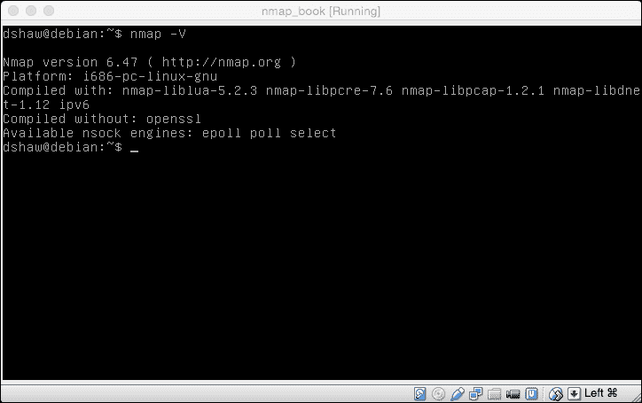

# 第一章 Nmap 简介

在我们开始学习掌握 Nmap 的复杂技术之前，最好先了解 Nmap 本身是如何作为一个项目开始和发展的。这个工具已经存在了将近二十年，是许多技术行业中广受欢迎和经常使用的组件。

在本章中，我们将介绍：

*   Nmap 项目是如何开始的
*   工具本身的演变
*   Nmap 套件的新附加组件
*   如何在 Windows、OS X 和 Linux 上安装 Nmap

# Nmap 卑微的开端

Nmap 从卑微的起点开始。与今天发布的商业安全工具不同，第一个 Nmap 只有大约 2000 行代码，并于 1997 年在 1985 年开始的黑客“zine”Phrack 第 51 期中发布。Nmap 的时间表是一个迷人的时间表，它的增长是惊人的。Nmap 开发的总体时间表如下：

*   在发布时，Nmap 没有很多特性；事实上，这是赤裸裸的。此版本的 Nmap 没有附带版本号，因为开发人员不打算发布任何未来版本。Nmap 仅设计用于扫描目标计算机上打开的端口，并且仅在从 Linux 主机运行并使用 gcc 编译时才起作用。
*   然而，在最初发布 Nmap 的四天后，发布了一个稍微改进的版本（也通过 Phrack）——版本 1.25。很明显，即使是在现在著名的工具的初期，对高性能端口扫描仪的需求也非常高。尽管以前有检测开放端口的方法，但 Nmap 使通过 Internet 或本地网络评估第三方主机变得简单。黑客社区对此很感兴趣。
*   到 1998 年 3 月，在最初的 Nmap 发布六个月后，扫描仪已经成为地下黑客社区和蓬勃发展的信息安全行业的事实上的端口扫描仪。Renaud Deraison 请求允许在他正在创建的新漏洞评估引擎中使用扫描代码，并且（在获得许可后）Nmap 扫描技术与 Nessus 的第一个版本集成。
*   到 2003 年 9 月发布 Nmap 3.45 时，该项目发生了许多重大变化。主要开发人员 Fyodor 现在正致力于全职维护 Nmap。该工具具有许多新功能，如服务检测、操作系统检测、定时配置和优化标志（本书后面将介绍所有这些功能），并且真正达到了成熟状态。
*   2006 年 12 月，Nmap 项目最重要的方面之一被集成到所有 Nmap 构建中：**Nmap 脚本引擎**（**NSE**）。NSE 允许 Nmap 的用户编写自己的模块（用一种称为**Lua**的编程语言）到触发器，触发某些正在打开的端口，或某些服务，甚至发现正在侦听的特定版本的服务。此版本允许将 Nmap 从一个简单的网络工具提升为一个完全健壮且可定制的漏洞评估引擎，适用于各种任务。

# Nmap 的多种用途

尽管端口扫描显然对安全专业人员非常重要，但如果不了解哪些网络端口是开放的，就不可能评估系统的安全性 Nmap 对其他类型的信息技术专业人员也非常有价值。

系统管理员使用 Nmap 来确定哪些系统处于联机状态，这样他们就可以了解网络上是否存在问题或不一致。类似地，使用操作系统检测和服务检测，这些管理员能够轻松地验证所有系统是否运行相同（希望是当前）版本的操作系统和支持网络的软件。

由于它能够改变时间，以及在不同的数据包上设置特定的标志（例如，**Xmas 树**扫描），开发人员可以在测试嵌入式网络堆栈时求助于 Nmap，以验证攻击性网络通信不会产生可能导致系统崩溃的意外结果。

最后，也许是最重要的，网络和计算机工程专业的学生是 Nmap 的主要用户。因为它是一个免费的开源软件，所以获得该软件并立即运行它是没有障碍的。即使是业余用户扫描他们自己的小型家庭网络，也可以了解大量关于他们的计算机和网络如何工作的信息，并通过查看在线服务进行配置。尽管有 Windows 和 OS X 端口，但 Nmap 也是在 Linux 命令行上运行简单（但高级）工具的绝佳入门。

# 安装 Nmap

在大多数现代操作系统（Windows、OS X 和大多数 Linux 发行版）上，安装 Nmap 是一项非常简单的任务。官方 Nmap 网站（[http://insecure.org/](http://insecure.org/) ）为 Windows 和 Mac OS X 分发可下载的安装程序，这些安装程序非常容易运行。

对于 Windows，安装过程的完整演练可在[上获得 http://nmap.org/book/inst-windows.html](http://nmap.org/book/inst-windows.html) 。

对于 Mac OS X，[提供了安装过程的完整演练 http://nmap.org/book/inst-macosx.html](http://nmap.org/book/inst-macosx.html) 。

要安装 Nmap for Linux，有几个选项。最新的版本**最前沿的**版本始终可以从源代码处安装（请参见以下段落）。有一些 RPM 可以从[下载 http://insecure.org/](http://insecure.org/) 网站，但大多数 Linux 发行版的标准软件包存储库中已经有 Nmap。

从 Debian/Ubuntu 上的存储库进行安装非常简单。首先，运行`sudo apt-get update`以验证所有“apt 源”列表都是最新的。然后，只需`sudo apt-get install Nmap`下载并安装一个 Nmap 的工作版本！

### 提示

**下载示例代码**

您可以从您的账户[下载示例代码文件 http://www.packtpub.com](http://www.packtpub.com) 对于您购买的所有 Packt 出版书籍。如果您在其他地方购买了本书，您可以访问[http://www.packtpub.com/support](http://www.packtpub.com/support) 并注册，将文件直接通过电子邮件发送给您。

# 从源头构建 Nmap

要从源代码安装 Nmap，必须采取三个步骤：

1.  下载源代码。
2.  编译代码。
3.  安装已编译的工具。

使用`wget`等工具下载代码非常简单；我们所需要做的就是键入`wget http://nmap.org/dist/nmap-6.47.tar.bz2`（或者任何当前版本的 Nmap）。

下载工具后，必须将其从 tarball 或 compressed 状态删除。这是通过使用`tar`命令键入`tar xvf nmap-6.47.tar.bz2`来完成的。

在这个阶段，我们现在有了一个新的目录，其中填充了 Nmap 源代码。如果我们通过键入`cd nmap-6.47`来更改目录，那么我们就可以编译此代码。对于那些熟悉在 Linux 上安装工具的用户，下一步将很熟悉。我们需要`./configure`制作和`sudo make install`以便在我们的系统上安装 Nmap。

“Nmap 龙”是一件著名的 ASCII 艺术作品，在 Nmap 源代码编译的`./configure`步骤中展示。

成功安装 Nmap 后，您可以通过键入`nmap -V`来验证它是否工作，并查看编译它时使用的选项。我们将在后面的章节中介绍可以传递给 Nmap 的不同标志。

# 总结

阅读本章后，您应该对 Nmap 为信息安全世界带来的美妙背景有了坚实的理解。从一个小项目开始，Nmap 项目现在是几个行业的支柱之一。

如果您已经按照安装说明进行了操作，那么现在应该有一份功能齐全的 Nmap 副本，可以在本章的其余部分使用。如果没有，现在将是一个很好的时间继续安装该工具，以便您准备好开始扫描、审核和评估！

在下一章中，我们将学习 TCP/IP 网络的基础知识，以便更好地了解 Nmap 如何评估开放端口，并找出正在运行的服务和操作系统。