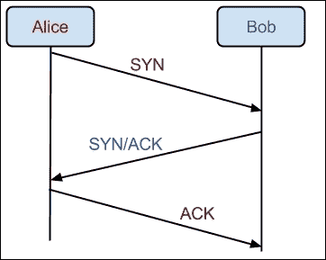

# 第二章网络基础

在将 Nmap 用作工具之前，我们首先需要了解它的基本工作原理。为了扫描网络（包括互联网），我们必须首先理解所有网络所基于的概念。尽管本书不会详细描述网络概念，但通过学习使用 Nmap，您不会成为*数据包忍者*，我们确实需要确保我们能够解释标准和高级 Nmap 扫描的扫描结果。如果没有基本的网络，我们将无法扫描所有！

本章将介绍以下主题：

*   网络如何工作
*   TCP 与 UDP 的区别
*   港口简介
*   端口扫描的工作原理
*   服务版本检测和横幅抓取是如何工作的

# 互联网的结构

在我们探讨网络软件的复杂性之前，了解互联网本身是如何设计的是很重要的。在许多方面，互联网的功能与你家里或办公室的大型网络相同。当然，不同之处在于，互联网不是工作站，而是面向互联网的服务。例如，大多数家庭都有许多计算机位于同一个**局域网**（**局域网**），但在互联网上只有一个 IP 地址。如果有人从他们的互联网连接设备扫描这个网络，他们只会看到面向互联网的服务，而不是每个家庭成员的个人电脑。这一点需要注意，因为在 Internet 上，只有转发到机器的端口才能在给定的 IP 地址上访问。这条规则有一些例外，我们将在后面讨论。

但是，当扫描局域网上的计算机时，通常可以看到所有打开的端口。这是因为当数据包在本地网络（而不是 Internet）上传输时，您可以直接访问目标计算机，而不必通过路由器或交换机，因为路由器或交换机会阻塞 Internet 上的所有端口。这就是例如，当在 LAN 方托管服务器时，没有人必须转发第三方设备中的任何端口的原因。

在本书其余部分进行扫描时，请记住，有几个不同的元素可以帮助或阻止扫描检测到正在侦听的每个服务。我们将在后面的章节中讨论一些陷阱，并尽可能提供有用的解决方法。

# OSI 模型

为了理解数据包是如何从一台机器传输到另一台机器的信息，最好了解**开放系统互连**（**OSI**模型的基本概念。这是一种概念性的方式来思考网络如何在不同层上工作。很容易理解的是，从物理上讲，网络只是硬件的一部分，上面有电信号；实际上，要将开发人员和网络操作人员（以及计算机）使用的逻辑网络概念化要困难得多。

最简单的解释是，不同的协议和信息位在模型的不同层上工作，并且相互作用。下图简要说明了哪个层执行哪个角色，以便我们在本章后面了解服务横幅和端口是如何工作的。

为了有效地使用 Nmap，并解释准确的扫描结果，没有必要了解 OSI 模型或低级网络的所有复杂性。但是，有必要认识到，并非所有网络信息都是平等创建的。某些信息在某些时间容易访问，而在其他时间访问某些数据则更为困难。如果您有兴趣从深入的角度了解更多有关网络的信息，那么值得查看 Wireshark 等工具，它们可以捕获数据包或在传输过程中查看数据包。

# 端口扫描

Nmap 是一个端口扫描器，但我们还没有讨论端口实际上是什么。顾名思义，端口是访问计算机上网络服务的一种方式。每台计算机有 65535 个端口，可以随时打开或关闭。默认情况下，HTTP（为网页提供服务）或 FTP（允许文件传输）等某些服务具有与其关联的端口。HTTP 在端口 80 上运行，FTP 在端口 21 上运行，依此类推。有大量常用端口的列表，我们可以稍后参考。幸运的是，Nmap 的分发包中包含了这些列表。

将港口概念化的一种方法是考虑一座公寓楼。在这个类比中，一栋公寓楼将是一个 IP 地址，大楼内的每个公寓楼将是一个不同的端口。在这种情况下，该建筑必须拥有 65535 套公寓，这是一个相当大的财产！

当你访问一个 IP 地址时，就像给公寓楼送比萨饼一样；你知道它在世界上的什么地方，但你不知道你到底需要在哪里。港口就在这里！一个端口类似于一个单元号；使用端口号，我们将知道我们要去 5505 互联网街，443 公寓，以提供 HTTPS 流量！

端口通常通过在 IP 地址后加冒号来标识。如果您看到一个类似 127.0.0.1:22 的地址，那么您可以安全地假设您正被指向 IP 地址 127.0.0.1 和端口 22。

# TCP 和 UDP

网络服务可以使用的两个主要协议是了解网络的一个重要方面：TCP 和 UDP。服务可以使用这两种协议中的任何一种在这些端口上侦听，而且很多时候都是这样。TCP（通常显示为 TCP/IP）用于需要特别订购的连接，例如加载网页。然而，UDP 是一种无连接协议；无连接意味着 UDP 连接就像消防水管一样工作，将数据从一个 IP 地址（源地址）移动到另一个 IP 地址（目标地址）。由于互联网的工作方式，尽管它是一个大型分组交换网络，但这些分组并不总是按顺序到达。对于像加载网页这样的东西，这将是一个巨大的问题。然而，对于其他用途来说，让数据以接收到的任何顺序到达都是非常有意义的。

例如，**IP 语音**（**VoIP**）呼叫通常使用 UDP 协议。对于数据来说，更重要的是要到达数据源，即使数据包丢失或出现故障。这样，虽然连接中可能会有一个小的声音打嗝，但在等待数据加载时它不会延迟。我们将在本书中研究的大多数服务都是基于 TCP 的，但也可以使用 Nmap 扫描 UDP 服务（使用`-sU`标志）。不过，UDP 在成功传输数据包时不会收到回复；因此，确定服务是否正在侦听给定的 UDP 端口，或者根本不应答，可能非常耗时。

# 服务横幅

现在，我们已经了解了网络、端口、TCP 和 UDP 的工作原理，我们可以开始学习 Nmap 的复杂性了。Nmap 是一个强大的工具，它利用了计算机和网络通信的各种不同元素，帮助我们了解各种不同计算机正在运行的服务。

Nmap 及其原始设计最常见的用途是一个简单的端口扫描仪。端口扫描程序只是一个软件，它尝试连接到每个特定的目标端口，并查看该端口是否打开，从而确定是否可以建立 TCP 三方握手。

TCP 三方握手是在应用程序开始相互通信之前建立基于网络的连接的一种简单方法。结构非常简单，如果这些标志现在对您来说意义不大，也不用担心。正如您所料，三方握手包括两个扬声器之间的三个步骤（让我们称之为 Alice 和 Bob）。握手的工作原理如下：

*   爱丽丝正在请求与鲍勃建立联系。Alice 在指定端口向 Bob 发送一个**SYN**。
*   如果 Bob 想要建立此连接，Bob 向 Alice 发送**SYN/ACK**的响应。
*   Alice 接收到**SYN/ACK**，并通过向 Bob 发送**ACK**来验证连接是否已建立。

通过参考下图，您可以直观地了解其工作原理：

一旦您了解了某个端口上的连接是如何建立的，就相对容易理解最基本的 Nmap 端口扫描（SYN 扫描）的工作原理。Nmap 向作用域中的每个端口（通常是主机上最常见的 1000 个端口或完整的 65535 个端口）发送一个**SYN**请求，并等待**SYN/ACK**响应。如果收到**SYN/ACK**响应，则有一个服务正在该开放端口上侦听。祝贺我们现在已经介绍了基本端口扫描的工作原理。有许多不同类型的扫描，不仅仅是 SYN 扫描，请求/响应模型的基本思想现在应该相当清楚了。

不过，当我们扫描端口时，我们通常感兴趣的不仅仅是端口是否在线。尽管大多数 web 服务器都在端口 80（HTTP 分配的端口）上侦听，但也有人可以轻松地将 web 服务器放在端口 12345 或 1337 上。除了了解端口是否打开外，了解服务实际正在侦听的内容也很重要。

幸运的是，Nmap 内置了一个服务版本检测模块。此功能通过创建到实际服务的连接来工作，侦听并查找服务标题。几乎每个基于网络的服务都可以通过其初始服务标题进行识别；即使不是，协议检测也允许 Nmap 识别协议，如果不是正在运行的确切服务器版本的话。在下一章中，我们将学习如何进行基本扫描，包括服务版本检测。

# 总结

读完本章后，你应该对计算机网络的工作原理有一个基本的了解。具体来说，了解 TCP 和 UDP 的区别以及端口扫描本身的功能非常重要。既然你知道互联网是一个非常大的计算机网络，你也可以在局域网上扫描机器，你应该有一个坚实的基础来继续学习 NMAP 的工作原理，以及在很多情况下你可以使用的先进特性。

在下一章中，我们将学习如何进行基本的 Nmap 扫描，以便在最常见的情况下获得结果。下一章将让您站起来，浏览不同类型的端口和服务！