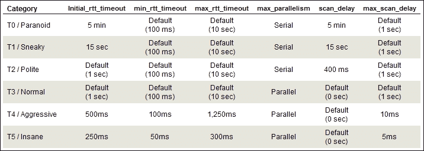
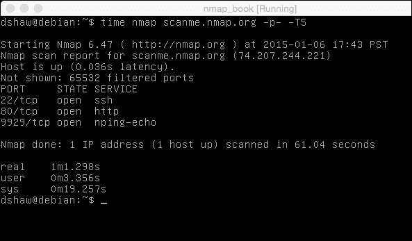
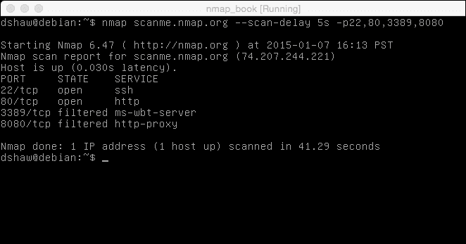

# 五、性能优化

我们现在完全能够扫描许多不同类型的主机，并克服了系统管理员和网络工程师用来保护或屏蔽其机器的大量方法。杰出的此时，我们将开始研究 Nmap 可以解决的一些更广泛的问题：特别是，如果我们试图扫描可能造成性能中断的大片 IP 地址，我们可能会遇到困难。

不幸的是，使用我们在上一章中了解到的高级 Nmap 选项，可能会使扫描花费比我们可能需要的时间更长的时间。性能优化技术是一些使用最少但最有用的 Nmap 标志，因此值得好好学习它们并在需要时使用它们。

在本章中，我们将介绍：

*   基本 Nmap 定时优化
*   自定义主机组大小
*   如何增加或减少 Nmap 的并行性
*   如何处理卡住的主机
*   如何延迟（或增加）单个数据包的速率

# Nmap 定时优化

使扫描运行更快的最简单的方法是使用内置`timing`标志。使用`-T`和从 1（最慢）到 5（最快）的数字调用这些标志。默认扫描速度为 Po.T2，右侧。

使用更快的扫描有一些风险，因为它会在扫描中产生某些不可靠的方面。特别是，如果已知您的网络接口可靠，则应谨慎使用这些选项！

默认的计时标志改变了六个不同的元素，我们将在本章后面详细介绍其中的许多元素。具体地说，定时标志改变了`initial_rtt_timeout`、`min_rtt_timeout`、`max_rtt_timeout`、`max_parallelism`、`scan_delay`和`max_scan_delay`的各个值。不要担心，如果这些标志听起来很奇怪，我们将详细介绍您需要了解的不同标志，以便您能够调试各种各样的网络和性能问题。

前面的截图，从[下载 http://www.professormesser.com/](http://www.professormesser.com/) 显示了`-T`标志如何以各种不同的方式进行优化。最重要的区别是`-T3`和`-T2`之间的并行到串行转换（意味着不再同时扫描主机），以及整个系统的显著超时差异。

系统管理员还通过增加响应时间降低了目标的易受攻击性，因为大部分时间主机信息也可以从 TTL 值读取。

运行“疯狂”扫描显然可以使大型网络块运行得更快，但有趣的是，在频谱的另一端，“鬼鬼祟祟”和“偏执”扫描（`-T1`和`-T0`）可以非常有效地“隐藏”端口扫描。

如果我们在入侵检测系统和入侵预防系统运行的情况下进行渗透测试，那么运行这些慢速扫描会非常有益。

正如您在前面的屏幕截图中所看到的，对`scanme.nmap.org`（包括所有端口）的`-T5`扫描只花了一分钟（和一秒钟），从`time`命令和 Nmap 自己的计时计算器的输出中可以看到这一点。另一方面，运行`-T1`扫描（也称为“鬼鬼祟祟”）需要更长的时间。

为了显示长期慢速扫描的真正效果，我们对同一台主机进行了`-T1`扫描，您可以在这里看到，16 小时后，扫描仍然只有 2.75%完成，这是一次非常缓慢的扫描！很容易看出，我们不希望这些扫描选项通过一大块 IP 地址，但这对于客户参与（例如运行 IDS 或 IPS 的客户）来说是非常隐蔽的，这可能是非常宝贵的。

# 定制主机组大小

为了有效地扫描主机，Nmap 使用它同时扫描的主机组。假设您的 Internet 连接（和计算机处理能力）足够，通常最好增加主机组大小以快速完成大型扫描。例如，如果正在扫描主机组大小为 250 的 1000 台主机，则只需四次“扫描”即可并行完成完整扫描。

然而，人们应该仔细权衡他们希望通过改变主机组大小来实现什么。一次扫描多个主机的好处是显而易见的，但缺点可能不是，如果您正在扫描一个大的组，您必须等待整个主机组完成扫描，然后才能看到任何结果并移动到另一个组。如果您试图快速查看结果，则较小的主机组更适合您的特定扫描。

默认情况下，Nmap 尝试对主机组大小采取动态折中的方法：它动态更改主机组以适应详细扫描（以便我们可以看到发生了什么）和效率（以便快速完成完整扫描）。Nmap 会自动将主机组的起始值低至 4 或 5，并将其增加到 1024。

但是，如果您正在寻找经过微调的控件，那么您应该记住两个主机组标志：`--min-hostgroup`和`--max-hostgroup`。例如，如果您计划扫描一个完整的 C 类网络，那么将组大小指定为 256 将在一个大型并行过程中完成此运行，从而大大提高扫描引擎的效率。

值得注意的是主机组规范不适用于主机发现扫描，包括 ping 扫描 Nmap 将自动使用非常大（通常为 4096）的主机组，以使这些主机组高效运行。

# 增加和减少平行度

尽管我们刚刚了解到的主机组大小定制可以帮助增加或减少完整扫描中的并行性，但它不处理一次发送的探测数量。然而，实际的并行性标志可以帮助我们处理这个问题！

与的许多功能一样，Nmap 将尝试自动创建最高效的扫描组，这对于几乎所有实例都很有用。根据我的经验，在没有认真的网络教育的情况下改变同时发送的探测器数量可能会导致灾难，但情况并非总是如此。

通过增加`--min-parallelism`的值（比如 10 或 12），您可以强制 Nmap 扫描至少那么快。如果需要，Nmap 仍将使扫描运行得更快，从而降低一些风险。

另一方面，可以将`--max-parallelism`的值设置为低至 1。这是非常有用的；从某种意义上讲，您可以强制 Nmap 一次只发送一个探测器，但也可以强制工具运行得非常慢（如您所想象的）。我们可以使用这样的技巧愚弄安全系统，或者确保扫描的可靠性永远不会受到网络相关问题的影响。

如果您看到的主机似乎没有完成，或者您非常关心当前组中扫描的主机数量，那么调整并行性可能非常有用。

# 处理卡住的主机

不幸的是，当处理大量 IP 地址时，如果您正在扫描大型企业，这是一种非常常见的情况，无论是出于内部安全目的还是作为客户参与，处理卡住的主机并不少见。

当主机卡住时，意味着有什么东西正在阻止扫描以正常速率完成。这可能是由一些良性的原因造成的，例如连接两端的网络故障，或者是更有意的原因，例如安全软件故意使目标主机响应非常缓慢或不一致，从而有效地破坏了扫描。

出于演示的目的，我将对网络上不存在的主机启动 ping 不可知（`-Pn`扫描。您无法从中获得结果，但扫描仍然需要很长时间。

您可以在前面的屏幕截图中看到，扫描这个不存在的主机花费了 1051 秒或 17 分钟。Nmap 尽其所能改变 RTT 变量，试图补偿任何网络问题，但最终花了很长时间才意识到什么都没有。想想如果你扫描一个 B 级网络会发生什么！我们需要等待几天、几周或几年才能完成扫描。没有人想观看无响应的 Nmap 屏幕！

在对不存在的主机进行的第二次扫描中，我们保留了相同的标志，但将`--host-timeout`更改为 1 分钟。如您所见，60 秒后，Nmap 放弃了主机，完成了扫描，完成时间为完成扫描所需时间的十七分之一！

`--host-timeout`标志非常有用，尤其是在大型扫描中，但请确保不要将时间设置得太低，否则 Nmap 将放弃其仍在积极扫描的主机！在许多评估中，我的团队将`--host-timeout`设置为 10 分钟，这通常足够让每个主机完成许多端口扫描而不会出现任何错误。结合并行性和主机组自定义，设置主机超时标志可以在较大的目标主机上节省大量时间。

# 延迟和增加探测速率

最后一个需要理解的重要定时改进标志是直接延迟和增加速率。这可能是性能优化中最精细的一种，通常只有在您试图解决某个特定问题或试图创建某种情况时才应使用。

这些标志中的第一个`--scan-delay`指定了 Nmap 在探测之间应该等待的时间量，而不是执行任何操作。这在减慢扫描速度（有时在扫描延迟较低的情况下加快扫描速度）方面非常有用。同样，减慢扫描速度的最常见用法是为了避免检测到目标管理员或安全系统，或者是为了避免网络节流问题。由于许多系统使用发出请求的速率来确定机器是否受到攻击，因此这可能是一种非常隐蔽的技术，测试人员无需付出很大的努力。值得注意的是，`--max-scan-delay`可以与其他定时标志一起使用，以取代它们，并确保扫描延迟永远不会慢于一定的时间。

您可以在前面的屏幕截图中看到，将`--scan-delay`增加到 5 秒会使四端口扫描（加上 ping 扫描）花费 41 秒。效率不高，但隐藏发生的事情却非常完美！

最后，还可以使用`--min-rate`和`--max-rate`的组合来设置 Nmap 速率的直接控制，后者控制每秒通过网络发送的数据包。值得注意的是，Nmap 对这些设置的内部控制非常好，但有时需要更精细的控制。通过设置`--min-rate 1`和`--max-rate 100`等标志，我们可以允许 Nmap 的内置计时引擎控制效率，但每秒发送的数据包不得超过 100 个或少于 1 个。与许多标志一样，决不能将最小值设置得太高或最大值设置得太低！

# 总结

本章向我们介绍了一些非常有价值的计时标志 Nmap 的功能非常广泛，可以包括许多选项，这些选项可以帮助我们确保完全控制计时，从而最大限度地提高效率并克服潜在的陷阱。

在本章中，我们介绍了基本的 Nmap 定时优化、自定义主机组大小、如何增加或减少 Nmap 的并行性、如何处理卡住的主机以及如何延迟（或增加）单个数据包的速率。

在下一章中，我们将讨论 Nmap 最有趣、最强大的特性之一：**Nmap 脚本引擎**（**NSE**）。我们将讨论 NSE 是什么，它可以做什么，以及如何使用它调用有趣的脚本。