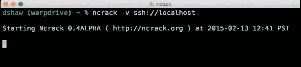
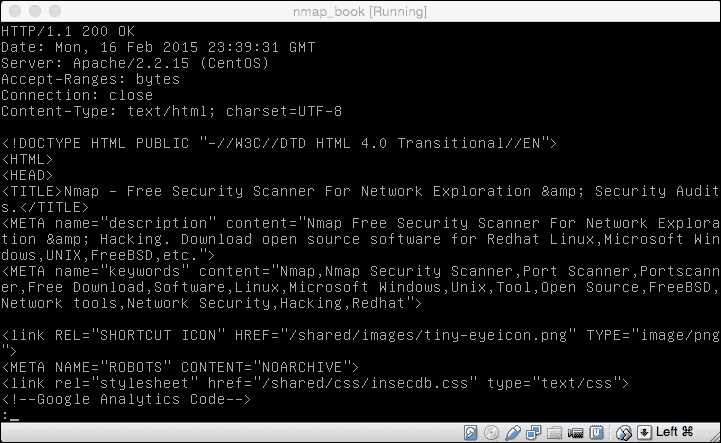
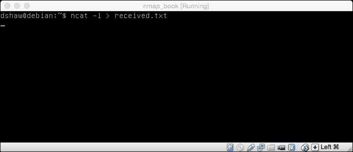

# 八、附加 Nmap 工具

我们现在已经成功地编写了第一个 Nmap 脚本，并针对大量不同的目标类型（和防御）启动了各种扫描。然而，扫描主机只是 Nmap 套件全部功能的一小部分。

除了创建一个功能强大的扫描工具和 NSE 之外，Nmap 开发人员还将包括 Ncrack、Nping、Ncat 和 Ndiff 在内的多个附加工具包含在 Nmap 的默认安装包中。这些工具可以帮助分析现有扫描、转到其他主机、传输文件或比较扫描结果。

在本章中，我们将介绍以下主题：

*   使用 Ncrack 攻击服务
*   利用 Nping 进行宿主检测
*   使用 Ncat 的文件传输和后门
*   将 Nmap 结果与 Ndiff 进行比较

# 使用 Ncrack 攻击服务

Nmap 套件中最具攻击性的工具之一是 Ncrack——一种用于攻击性暴力强迫（或“破解”）网络服务的工具。尽管它的功能并不独特（因为有许多软件工具可以对网络帐户进行暴力攻击），但它能够轻松（本机）与 Nmap（以及 Nmap 结果）集成，非常适合在扫描后使用。

在使用 Ncrack 之前，我们需要确保它已安装。尽管大多数 Nmap 工具都是随 Nmap 套件软件包一起安装的，但由于 Ncrack 在技术上（在编写本文时）是一个 alpha 版本，因此许多安装中都不包括它。

### 注

文档和最新的下载链接可在[获得 http://nmap.org/ncrack/](http://nmap.org/ncrack/) 。

与许多 Nmap 工具一样，安装非常简单；执行以下步骤：

1.  `wget http://nmap.org/ncrack/dist/ncrack-0.4ALPHA.tar.gz`
2.  `tar -xzf ncrack-0.4ALPHA.tar.gz`
3.  `cd ncrack-0.4ALPHA`
4.  `./configure`
5.  `make`；`sudo make install`

您将能够看到前面步骤的输出，如以下屏幕截图所示：

配置时，您可能会注意到 scorpion ASCII 艺术（如前面的屏幕截图所示）。这门艺术向 Nmap 龙致敬，你可能还记得几章前我们第一次安装 Nmap 的时候！

一旦安装了 Ncrack，我们就可以通过几种有用且有趣的方式调用它来进行投标。

运行 Ncrack 最直接的方法是非常简单的；如前面的屏幕截图所示，可以简单地运行`ncrack`，然后运行目标服务的协议 URI 和主机名（或 IP 地址）。通过这种方式，我们可以通过运行`ncrack ssh://TARGET`来攻击服务（如 SSH）。

Ncrack 与已知用户名一起使用时最有效。例如，如果我们知道一个给定的系统有一个允许密码验证的根登录名，我们将运行`ncrack --user root ssh://TARGET`对该用户名进行暴力攻击。

虽然这个功能非常有用，但它绝不是唯一的；许多工具，如**九头蛇**和**美杜莎**可以进行蛮力攻击。当基于 Nmap 扫描结果运行 Ncrack 时，Ncrack 的真正好处就会显现出来。

假设我们正在 C 类（/24）网络上对一系列主机进行渗透测试或安全评估。例如，如果 200 台主机联机，并且每个主机都有 5 到 10 个服务侦听，那么您将看到许多不同的暴力尝试通过命令行实现。然而，Ncrack 可以为您做到这一点。

正如 Nmap 可以导出不同的日志类型一样，Ncrack 可以将它们作为输入读取，并自动攻击相关服务。例如，如果 Nmap 扫描中有一个`-oX`标志（XML 输出），Ncrack 可以使用`-iX`输入与目标文件相同的列表：

我们可以很容易地看到，通过扫描`nmap.scanme.org`并导出 XML 文件，我们可以很容易地将其导入 Ncrack。虽然这只是一台主机，但您可以想象，如果我们将其用于大型网络，将节省多少时间！还值得注意的是，默认情况下，不支持登录或 Ncrack 不知道如何使用的服务将从扫描中排除。在这种情况下，`nping-echo`由于没有登录提示而被排除。

除了指定目标文件外，有效运行 Ncrack 还需要几个标志。Ncrack 最重要的两个标志是`-U`和`-P`标志，它们分别指向包含用户名和密码的文本文件。

Ncrack 还有大量其他标志、配置设置和用途，所有这些都可以在非常有用的主页上找到。

在使用 Ncrack 之前，请注意：虽然使用 Nmap 进行端口扫描可能会激怒许多系统管理员（事实上，在某些地区是非法的），但尝试使用 Ncrack 破坏服务是非法的，只能在系统所有者明确许可的情况下进行。如果您试图对自己的资产执行安全评估，或者您有一份签名的同意书（例如渗透测试），您可以，但不要试图破坏 Internet 上的任意主机！

# Nping 主机检测

与 Ncrack 非常相似，Nping 最近才被添加到 Nmap 套件中。它的第一次迭代是在 2009 年 8 月创建的（与 Ncrack 一起），并于 2010 年 3 月首次包含在实际的 Nmap 套件中。

尽管您可能不希望从其名称中看到它，但 Nping 所做的远不止 ICMP 回显请求（我们通常称之为 ping）——主要是，它还可以对给定端口执行 ARP 探测和 TCP 或 UDP 请求，以便根据响应确定这些主机是否在线。例如，如果我们想调试某些网络连接，我们可以很容易地使用 Nping 来确定线路上发生了什么。以下屏幕截图显示了一个基本的 Nping 命令：

在前面的屏幕截图中，我们对每个端口进行了两次检查（`-c 2`，其中“c”代表“计数”），并扫描了`dshaw.net`-80 上的端口。在本例中，80 是一个开放端口（它正在运行我的 web 服务器），我们可以清楚地看到预期的响应。正如我们在前面几章中所记得的，我们现在可以确切地看到，当 TCP 握手尝试通过网络连接信息（发送和接收的数据包）时发生了什么。如果我们正在调试一个网络连接，我们还会指定`-v`来查看更多的数据包信息。

Nping 最独特的功能之一是其内置的回声模式。echo 模式允许 Nping 同时作为服务器和客户端工作，并来回发送数据包。通过显示整个网络连接（客户端在原始状态下发送的数据包以及服务器接收到的数据包），可以非常容易地检测网络地址转换、干扰入侵预防系统、数据包整形等。

### 注

有关 Nping echo 命令的完整列表以及各种预期用途，请查看 Nmap 文档门户（NSEDoc），该门户在[有一个全面的教程 http://nmap.org/book/nping-man-echo-mode.html](http://www.nmap.org/book/nping-man-echo-mode.html) 。

# 文件传输和 Ncat 后门

对于那些不太熟悉的人来说，1995 年推出了一款出色的网络管理工具；它被称为 Netcat。它有多种用途，从文件传输到网络监控，再到聊天服务器，甚至可以通过将输入镜像到用户选择的指定网络地址来创建后门。Netcat 在许多方面都是一个非常轻量级的端口扫描程序，通过使用快速 shell 脚本，可以非常轻松地检查特定端口是否在给定主机上响应。

Netcat 至今仍在大量使用中，但 Nmap 开发团队发现，他们可以对该软件在稳定性和可用性方面做出一些相当严重的改进。因此，2009 年，Ncat 作为 Nmap 套件的一部分发布。

与 Netcat 不同，Ncat 具有 SSL 支持（本机支持）、出色的连接重定向可靠性以及其他一些内置功能，使其成为安全管理员工具箱中的一个优秀工具。

Ncat 有两种模式：“侦听”模式（在提供的端口上侦听传入连接）和“连接”模式（通过该模式发送命令并接收反馈）。在连接模式下，我们可以使用 Ncat 连接到各种服务，包括基于 HTTP 的 web 服务器。

通过`ncat nmap.org 80`调用 Ncat 后发送`GET / HTTP/1.0`请求，得到如下输出：

尽管它的呈现效果明显不如 Chrome 或 Firefox 等 web 浏览器，但您可以非常清晰地看到 web 服务器的 HTTP/HTML 响应。Ncat 的这一相同功能还可用于连接到许多不同类型的服务，包括 SMTP、FTP、POP3 等。当尝试将不同的输入发送到不同的协议时，Ncat 是非常宝贵的！

Ncat 在进行渗透测试或安全评估时也非常有用，因为它既可以用作数据外泄的方法，也可以作为进入受损系统的持久后门的方法。

通过 Ncat 发送文件的功能使用该工具的“侦听”和“连接”功能。以下屏幕截图显示了一个非常基本的 Ncat 命令：

首先，我们使用`-l`或`listen`标志设置 Ncat 侦听器。因为需要一个文件，所以我们可以通过管道将输出传输到`received.txt`。我们总是希望确保输出的文件类型符合我们的预期，这样我们就不必在以后处理更改文件类型的问题。在设置侦听器时，我们还可以设置一个特定的端口（这在渗透测试中很有用）；但在本例中，默认端口 31337 保持不变。

我们可以在前面的屏幕截图中看到，在其他地方（不在侦听器中），我们有一个名为`send.txt`的文件，其中包含`this is the file that we are going to send!`内容。发送文件很容易！我们所需要做的就是调用 Ncat，将其指向本地主机（同样，我们使用的是默认端口 31337，因此不需要端口规范），然后通过管道从`send.txt`输入。以下屏幕截图演示如何打开收到的文本文件：

正如我们在前面的屏幕截图中所看到的，一旦收到文件，Ncat 将自动关闭。一旦我们真的收到了文件，它就像“cat”一样简单——编辑我们收到的文件，看看它实际上与我们发送的内容相同。

最后，Ncat 还可以用作后门，以创建对受损系统的持久访问。以下屏幕截图显示了此基本功能：

如前面的屏幕截图所示，通过 Ncat 建立外壳连接非常简单。我们使用`ncat -l -e /bin/bash`监听默认值，并在客户端连接时执行`/bin/bash`（我们的 shell）。值得注意的是，在这种形式下，后门不是持久性的，这意味着在客户端断开连接后，它不会继续侦听。以下屏幕截图演示了通过 Ncat 在远程系统上运行 Linux 命令的能力：

为了连接到 shell，如前面的屏幕截图所示，我们可以简单地调用`ncat localhost`（因为端口仍然是默认的），并让 bash shell 生成我们的提示符。在本例中，我们运行`whoami`并接收回`dshaw`，然后执行`ls`命令并接收远程目录的目录列表。虽然其他后门访问方法可能更可靠或更复杂，但很难想出一种更简单的方法！

# 将 Nmap 结果与 Ndiff 进行比较

Nmap 套件附带的最后一个工具是 Ndiff。对于那些不熟悉传统*NIX 工具“diff”的人来说，它旨在直观地显示两个独立文本文件之间的差异。换句话说，如果您（例如）希望看到应用修补程序时哪些代码行发生了更改，则可以“区分”新修补程序和旧代码，并直观地看到差异。以下屏幕截图显示了一个基本的 Nmap 命令：

在前面的屏幕截图中，我们对我的 web 服务器`dshaw.net`启动了端口 80 和 81 的扫描。我们将第一次扫描命名为`scan1.xml`，并对我们称之为`scan2.xml`的同一主机运行另一次扫描。唯一不同的是，我使用了 Ncat（我们在本章前面了解到了这一点）将端口 81 打开到 Internet。

为了比较结果，我们只需调用`ndiff scan1.xml scan2.xml`——非常简单。以下屏幕截图演示了此命令：

正如您在前面的屏幕截图中清楚地看到的，Ndiff 输出使用与传统“diff”工具相同的格式显示`+`和`–`以指示哪些行是新的还是旧的。由于 Ndiff 解析的是实际的 XML 文件，而不仅仅是文本输出，因此它可以成功地确定何时完整地添加了新主机，而不仅仅是在输出中的不同位置。在这种情况下，很明显端口 81（只有一个默认的“服务”标签，而不是实际的版本扫描）在第二次扫描中打开了，但在第一次扫描中没有打开。此工具对于希望随时间查看其网络状态的系统管理员非常有用。

# 总结

本章概述了 Nmap 套件附带的其他工具，以及我们可以使用它们完成的各种任务。尽管 Nmap 本身很好，但为了充分发挥 Nmap 的作用，我们还需要使用一些打包的工具。

在下一章中，我们将学习如何将 Nmap 与 Nmap 套件之外的其他工具一起使用，以便进行全功能安全评估或渗透测试。