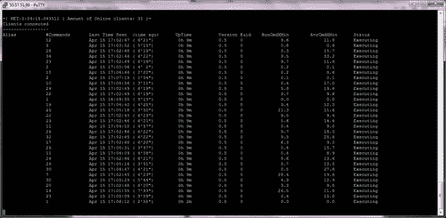
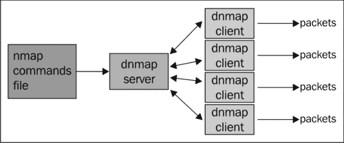

# 第七章扫描大型网络

### 注

本章向您展示了如何做一些在许多情况下可能是非法的、不道德的、违反服务条款的或不是好主意的事情。这里提供的信息可用于保护您免受威胁，并使您自己的系统更安全。在遵循这些说明之前，请确保您站在法律和道德的正确一边。。。善用你的力量！

在本章中，我们将介绍：

*   扫描 IP 地址范围
*   从文本文件中读取目标
*   扫描随机目标
*   跳过测试以加速长扫描
*   选择正确的计时模板
*   调整定时参数
*   调整性能参数
*   收集 web 服务器的签名
*   使用 Dnmap 在多个客户端之间分发扫描

# 导言

关于 Nmap，我最喜欢的是它的稳定性，以及它在扫描大型网络时的可定制性。Nmap 可以一次扫描数百万个 IP，效率令人难以置信。我们只需要小心地理解和调整可能影响性能的变量，并事先真正考虑我们的扫描目标。

本章涵盖了在扫描大型网络时需要考虑的最重要的方面。我们首先介绍一些基本任务，如读取目标列表、选择正确的计时模板、生成随机目标以及跳过阶段以节省时间。本章介绍的高级任务包括 Nmap 中可用的计时和性能参数的概述，以及如何正确使用它们。我还将向您展示如何从 Internet 收集 HTTP 头进行分析，例如流行的服务“ShodanHQ”，但只使用 Nmap。

最后，我介绍了一个名为 Dnmap 的非官方工具，它帮助我们在多个客户端之间分发 Nmap 扫描，从而节省时间并利用额外的带宽和 CPU 资源。

# 扫描 IP 地址范围

通常，渗透测试人员和系统管理员需要扫描的不是一台机器，而是一系列主机。Nmap 支持不同格式的 IP 地址范围，我们必须知道如何处理它们。

此配方说明了使用 Nmap 扫描时如何使用 IP 地址范围。

## 怎么做。。。

打开终端并输入以下命令：

```
# nmap -A -O 192.168.1.0-255

```

或者，您可以使用以下任一符号：

```
# nmap -A -O 192.168.1/24
# nmap -A -O 192.168.1.1 192.168.1.2 ... 192.168.1.254 192.168.1.255

```

## 它是如何工作的。。。

Nmap 支持多种目标格式。最常见的类型是指定目标的 IP 或主机，但它也支持从文件、范围读取目标，甚至可以生成随机目标列表。

Nmap 会将任何无效选项的参数作为目标读取。这意味着我们可以告诉 Nmap 在一个命令中扫描多个范围，如以下命令所示：

```
# nmap -p25,80 -O -T4 192.168.1.1/24 scanme.nmap.org/24

```

有三种方法可以在 Nmap 中处理 IP 范围：

*   多主机规范
*   八位组范围寻址
*   CIDR 符号

要扫描 IP 地址`192.168.1.1`、`192.168.1.2`和`192.168.1.3`，可以使用以下命令：

```
# nmap -p25,80 -O -T4 192.168.1.1 192.168.1.2 192.168.1.3

```

我们还可以使用“-”字符指定八位字节范围。例如，要扫描主机`192.168.1.1`、`192.168.1.2`和`192.168.1.3`，我们可以使用表达式`192.168.1.1-3`，如下命令所示：

```
# nmap -p25,80 -O -T4 192.168.1.1-3

```

指定目标时也可以使用 CIDR 符号。CIDR 表示法由 IP 地址和后缀组成。最常用的网络后缀是/8、/16、/24 和/32。要使用 CIDR 符号扫描`192.168.1.0-255`中的 256 台主机，可以使用以下命令：

```
# nmap -p25,80 -O -T4 192.168.1.1/24

```

## 还有更多。。。

此外，您可以通过指定参数`--exclude`选项将主机从范围中排除，如图所示：

```
$ nmap -A -O 192.168.1.1-255 --exclude 192.168.1.1
$ nmap -A -O 192.168.1.1-255 --exclude 192.168.1.1,192.168.1.2

```

或者您可以将您的排除列表写入文件，并使用`--exclude-file`读取：

```
$ cat dontscan.txt
192.168.1.1
192.168.1.254
$ nmap -A -O --exclude-file dontscan.txt 192.168.1.1-255

```

### CIDR 符号

**无类域间路由（CIDR）**符号（发音为“cider”）是一种用于指定 IP 地址及其路由后缀的紧凑方法。与类寻址相比，这种表示法由于其粒度而广受欢迎，因为它允许可变长度的子网掩码。

CIDR 表示法由 IP 地址和网络后缀指定。网络或 IP 后缀表示网络位数。IPv4 地址为 32 位，因此网络可以介于 0 和 32 之间。最常见的后缀是/8、/16、/24 和/32。

要使其可视化，请查看以下 CIDR 到网络掩码转换表：

<colgroup><col style="text-align: left"> <col style="text-align: left"></colgroup> 
| 

苹果酒

 | 

子网掩码

 |
| --- | --- |
| /8 | 255.0.0.0 |
| /16 | 255.255.0.0 |
| /24 | 255.255.255.0 |
| /32 | 255.255.255.255 |

例如，192.168.1.0/24 表示从 192.168.1.0 到 192.168.1.255 的 256 个 IP 地址。和 50.116.1.121/8 表示 50.0-255.0-255.0-255 之间的所有 IP 地址。网络后缀/32 也有效，表示单个 IP。

### 特权与非特权

以特权用户身份运行`nmap <TARGET>`将启动**SYN 隐形扫描**。对于无法创建原始数据包的非特权帐户，使用**TCP 连接扫描**。

这两者之间的区别在于 TCP 连接扫描使用高级系统调用`connect`来获取端口状态的信息。这意味着每个 TCP 连接都已完全完成，因此速度较慢，更有可能被检测到并记录在系统日志中。SYN 隐形扫描使用原始数据包发送精心编制的 TCP 数据包，以检测更可靠的端口状态。

### 港口国

Nmap 使用以下状态对端口进行分类：

*   **打开**：此状态表示应用程序正在侦听此端口上的连接。
*   **关闭**：此状态表示已接收探头，但此端口上没有应用程序监听。
*   **过滤**：此状态表示未收到探头，无法建立状态。这也表明探针被某种过滤掉了。
*   **未过滤**：此状态表示已接收探头，但无法建立状态。
*   **打开/过滤**：此状态表示如果端口已过滤或打开，Nmap 无法建立状态。
*   **关闭/过滤**：此状态表示如果端口已过滤或关闭，Nmap 无法建立状态。

### 端口扫描技术

Nmap 支持大量端口扫描技术。使用`nmap -h`获取完整列表。

## 另见

*   *从文本文件*配方中读取目标
*   *扫描随机目标*配方
*   *跳过测试以加速长扫描*配方
*   *选择正确的计时模板*配方
*   *在[第一章](01.html "Chapter 1. Nmap Fundamentals")*Nmap 基础*中列出了远程主机*的开放端口配方
*   [第 1 章](01.html "Chapter 1. Nmap Fundamentals")*Nmap 基础*中的*使用特定端口范围*进行扫描
*   *使用 Dnmap*配方在多个客户端之间分发扫描

# 从文本文件中读取目标

有时，我们需要使用多台主机并执行多个扫描，但每次扫描都必须在命令行中键入目标列表并不太实际。幸运的是，Nmap 支持从外部文件加载目标。

此配方显示如何使用 Nmap 扫描从外部文件加载的目标。

## 怎么做。。。

将目标列表输入到文本文件中，每个目标用新行、选项卡或空格分隔：

```
$cat targets.txt
192.168.1.23
192.168.1.12

```

要从文件`targets.txt`加载目标，可以使用以下命令：

```
$ nmap -iL targets.txt

```

除`--exclude`或`--exclude-file`设置的排除规则外，此功能可与任何扫描选项或方法组合。当使用`-iL`时，选项标志`--exclude`和`--exclude-file`将被忽略。

## 它是如何工作的。。。

参数`-iL <filename>`告诉 Nmap 从文件`filename`加载目标。

Nmap 在输入文件中支持多种格式。输入文件中包含的目标列表可以用空格、制表符或换行符分隔。任何排除都应反映在输入目标文件中。

## 还有更多。。。

也可以在同一文件中使用不同的目标格式。在以下文件中，我们指定 IP 地址和 IP 范围：

```
$ cat targets.txt
192.168.1.1
192.168.1.20-30

```

目标文件可能包含使用字符“#”的注释：

```
$ cat targets.txt
# FTP servers
192.168.10.3
192.168.10.7
192.168.10.11

```

### CIDR 符号

**无类域间路由****（CIDR）**符号（发音为“cider”）是指定 IP 地址及其路由后缀的紧凑方法。与类寻址相比，这种表示法由于其粒度而广受欢迎，因为它允许可变长度的子网掩码。

CIDR 表示法由 IP 地址和网络后缀指定。网络或 IP 后缀表示网络位数。IPv4 地址为 32 位，因此网络可以介于 0 和 32 之间。最常见的后缀是/8、/16、/24 和/32。

要使其可视化，请查看以下 CIDR 到网络掩码转换表：

<colgroup><col style="text-align: left"> <col style="text-align: left"></colgroup> 
| 

苹果酒

 | 

子网掩码

 |
| --- | --- |
| /8 | 255.0.0.0 |
| /16 | 255.255.0.0 |
| /24 | 255.255.255.0 |
| /32 | 255.255.255.255 |

例如，192.168.1.0/24 表示从 192.168.1.0 到 192.168.1.255 的 256 个 IP 地址。和 50.116.1.121/8 表示 50.0-255.0-255.0-255 之间的所有 IP 地址。网络后缀/32 也有效，表示单个 IP。

### 从扫描中排除主机列表

Nmap 还支持参数`--exclude-file <filename>`排除`<filename>`中列出的目标：

```
# nmap -sV -O --exclude-file dontscan.txt 192.168.1.1/24

```

## 另见

*   *扫描随机目标*配方
*   [第 2 章](02.html "Chapter 2. Network Exploration")*网络探索*中的*排除扫描主机*配方
*   [第一章](01.html "Chapter 1. Nmap Fundamentals")*Nmap 基础*中的*运行 NSE 脚本*配方
*   [第三章](03.html "Chapter 3. Gathering Additional Host Information")中*发现指向相同 IP 地址的主机名*配方*收集额外主机信息*
*   [第 2 章](02.html "Chapter 2. Network Exploration")*网络探索*中的*扫描 IPv6 地址*配方
*   *收集 web 服务器签名*配方
*   *使用 Dnmap*配方在多个客户端之间分发扫描

# 扫描随机目标

Nmap 支持一个非常有趣的功能，允许我们对 Internet 上的随机目标运行扫描。这在进行需要随机主机样本的研究时非常有用。

此配方显示如何生成随机主机作为 Nmap 扫描的目标。

## 怎么做。。。

要生成 100 台主机的随机目标列表，请使用以下 Nmap 命令：

```
$ nmap -iR 100

```

Nmap 将生成 100 个外部 IP 地址的列表，并使用指定的选项扫描它们。让我们将此选项与 ping 扫描相结合：

```
$ nmap -sP -iR 3
Nmap scan report for host86-190-227-45.wlms-broadband.com (86.190.227.45)
Host is up (0.000072s latency).
Nmap scan report for 126.182.245.207
Host is up (0.00023s latency).
Nmap scan report for 158.sub-75-225-31.myvzw.com (75.225.31.158)
Host is up (0.00017s latency).
Nmap done: 3 IP addresses (3 hosts up) scanned in 0.78 seconds

```

## 它是如何工作的。。。

参数`-iR 100`告诉 Nmap 生成 100 个外部 IP 地址，并将它们用作指定扫描中的目标。此目标分配可与任何扫描标志组合使用。

虽然这是进行互联网研究的有用功能，但我建议您小心使用此标志。Nmap 无法控制其生成的外部 IP 地址；这意味着在生成的列表中可能有一台受到严密监控的关键机器。要避免陷入麻烦，请明智地使用此功能。

## 还有更多。。。

要告诉 Nmap 生成无限数量的 IP 并因此无限期运行，请使用以下命令将参数`-iR`设置为`0`：

```
$ nmap -iR 0

```

例如，要联机查找随机 NFS 共享，可以使用以下命令：

```
$ nmap -p2049 --open -iR 0

```

### 端口扫描的法律问题

未经许可的端口扫描不太受欢迎，在某些国家甚至是非法的。我建议您研究当地法律，了解您可以做什么，以及您的国家是否反对端口扫描。您还需要咨询您的 ISP，因为他们可能对此有自己的规则。

Nmap 的官方文档对端口扫描涉及的法律问题有着惊人的描述，可在[上查阅 http://nmap.org/book/legal-issues.html](http://nmap.org/book/legal-issues.html) 。我建议大家都读一读。

### 目标库

参数`--script-args=newtargets`强制 Nmap 将这些新找到的主机用作目标：

```
# nmap --script broadcast-ping --script-args newtargets
Pre-scan script results: 
| broadcast-ping: 
|   IP: 192.168.1.105  MAC: 08:00:27:16:4f:71 
|_  IP: 192.168.1.106  MAC: 40:25:c2:3f:c7:24 
Nmap scan report for 192.168.1.105 
Host is up (0.00022s latency). 
Not shown: 997 closed ports 
PORT    STATE SERVICE 
22/tcp  open  ssh 
80/tcp  open  http 
111/tcp open  rpcbind 
MAC Address: 08:00:27:16:4F:71 (Cadmus Computer Systems) 

Nmap scan report for 192.168.1.106 
Host is up (0.49s latency). 
Not shown: 999 closed ports 
PORT   STATE SERVICE 
80/tcp open  http 
MAC Address: 40:25:C2:3F:C7:24 (Intel Corporate) 

Nmap done: 2 IP addresses (2 hosts up) scanned in 7.25 seconds 

```

请注意，我们没有指定目标，但是`newtargets`参数将 IPs`192.168.1.106`和`192.168.1.105`添加到了扫描队列中。

参数`max-newtargets`设置允许添加到扫描队列的最大主机数：

```
# nmap --script broadcast-ping --script-args max-newtargets=3

```

## 另见

*   *扫描 IP 地址范围*配方
*   [第 3 章](03.html "Chapter 3. Gathering Additional Host Information")中的*地理定位 IP 地址*配方*收集额外主机信息*
*   *从 WHOIS 获取信息记录[第三章](03.html "Chapter 3. Gathering Additional Host Information")中的*配方*收集额外主机信息*
*   *从文本文件*配方中读取目标
*   *跳过测试以加速长扫描*配方
*   *报告漏洞检查[第 8 章](08.html "Chapter 8. Generating Scan Reports")中的*配方，生成*扫描报告*
*   *收集 web 服务器签名*配方
*   *使用 Dnmap*配方在多个客户端之间分发扫描

# 跳过测试以加速长扫描

Nmap 扫描分为不同的阶段。当我们使用大量主机时，我们可以通过跳过返回我们不需要的信息的测试来节省时间。通过仔细选择扫描标志，我们可以显著提高扫描的性能。

本食谱解释了扫描时在帘幕后面发生的过程，以及如何跳过某些阶段以加快长扫描。

## 怎么做。。。

要在定时模板设置为积极且无反向 DNS 解析或 ping 的情况下执行完整端口扫描，请使用以下命令：

```
# nmap -T4 -n -Pn -p- 74.207.244.221

```

我们刚才使用的命令提供了以下输出：

```
Nmap scan report for 74.207.244.221
Host is up (0.11s latency).
Not shown: 65532 closed ports
PORT     STATE SERVICE
22/tcp   open  ssh
80/tcp   open  http
9929/tcp open  nping-echo

Nmap done: 1 IP address (1 host up) scanned in 60.84 seconds

```

使用以下命令，将获得的运行时间与具有默认参数的完整端口扫描进行比较：

```
# nmap -p- scanme.nmap.org

```

我们刚才使用的命令提供了以下输出：

```
Nmap scan report for scanme.nmap.org (74.207.244.221)
Host is up (0.11s latency).
Not shown: 65532 closed ports
PORT     STATE SERVICE
22/tcp   open  ssh
80/tcp   open  http
9929/tcp open  nping-echo

Nmap done: 1 IP address (1 host up) scanned in 77.45 seconds

```

当您与大量主机一起工作时，这种时间差确实会增加。我建议您考虑您的目标并确定您需要的信息，以便考虑跳过一些扫描阶段的可能性。

## 它是如何工作的。。。

Nmap 扫描分为几个阶段。其中一些需要设置一些参数才能运行，但其他参数（如反向 DNS 解析）在默认情况下执行。让我们回顾一下可以跳过的阶段及其相应的 Nmap 标志：

*   **目标枚举**：此阶段 Nmap 解析目标列表。不能完全跳过此阶段，但您可以仅使用 IP 地址作为目标来保存 DNS 前向查找。
*   **Host discovery**: This is the phase, where Nmap establishes if the targets are online and in the network. By default, Nmap performs an ICMP echo request ping for external hosts, but it supports several methods and different combinations. To skip the host discovery phase (no ping) use the flag `-Pn`. Let's see the packet trace of scans with and without `-Pn`, using the following command:

    ```
    $ nmap -Pn -p80 -n --packet-trace scanme.nmap.org

    ```

    我们刚才使用的命令提供了以下输出：

    ```
    SENT (0.0864s) TCP 106.187.53.215:62670 > 74.207.244.221:80 S ttl=46 id=4184 iplen=44  seq=3846739633 win=1024 <mss 1460>
    RCVD (0.1957s) TCP 74.207.244.221:80 > 106.187.53.215:62670 SA ttl=56 id=0 iplen=44  seq=2588014713 win=14600 <mss 1460>
    Nmap scan report for scanme.nmap.org (74.207.244.221)
    Host is up (0.11s latency).
    PORT   STATE SERVICE
    80/tcp open  http

    Nmap done: 1 IP address (1 host up) scanned in 0.22 seconds

    ```

    为了在不跳过主机发现的情况下进行扫描，我们有以下命令：

    ```
    $ nmap -p80 -n –packet-trace scanme.nmap.org

    ```

    此命令的输出为：

    ```
    SENT (0.1099s) ICMP 106.187.53.215 > 74.207.244.221 Echo request (type=8/code=0) ttl=59 id=12270 iplen=28
    SENT (0.1101s) TCP 106.187.53.215:43199 > 74.207.244.221:443 S ttl=59 id=38710 iplen=44  seq=1913383349 win=1024 <mss 1460>
    SENT (0.1101s) TCP 106.187.53.215:43199 > 74.207.244.221:80 A ttl=44 id=10665 iplen=40  seq=0 win=1024
    SENT (0.1102s) ICMP 106.187.53.215 > 74.207.244.221 Timestamp request (type=13/code=0) ttl=51 id=42939 iplen=40
    RCVD (0.2120s) ICMP 74.207.244.221 > 106.187.53.215 Echo reply (type=0/code=0) ttl=56 id=2147 iplen=28
    SENT (0.2731s) TCP 106.187.53.215:43199 > 74.207.244.221:80 S ttl=51 id=34952 iplen=44  seq=2609466214 win=1024 <mss 1460>
    RCVD (0.3822s) TCP 74.207.244.221:80 > 106.187.53.215:43199 SA ttl=56 id=0 iplen=44  seq=4191686720 win=14600 <mss 1460>
    Nmap scan report for scanme.nmap.org (74.207.244.221)
    Host is up (0.10s latency).
    PORT   STATE SERVICE
    80/tcp open  http
    Nmap done: 1 IP address (1 host up) scanned in 0.41 seconds

    ```

*   **Reverse DNS resolution**: Nmap performs reverse DNS lookups, as often hostnames may reveal additional information, such as the hostname `mail.company.com`. This step can be skipped by adding the argument `-n` to your scan arguments. Let's see the traffic generated by the two scans with and without reverse DNS resolution, using the following command:

    ```
    $ nmap -n -Pn -p80 --packet-trace scanme.nmap.org

    ```

    我们刚才使用的命令提供了以下输出：

    ```
    SENT (0.1832s) TCP 106.187.53.215:45748 > 74.207.244.221:80 S ttl=37 id=33309 iplen=44  seq=2623325197 win=1024 <mss 1460>
    RCVD (0.2877s) TCP 74.207.244.221:80 > 106.187.53.215:45748 SA ttl=56 id=0 iplen=44  seq=3220507551 win=14600 <mss 1460>
    Nmap scan report for scanme.nmap.org (74.207.244.221)
    Host is up (0.10s latency).
    PORT   STATE SERVICE
    80/tcp open  http

    Nmap done: 1 IP address (1 host up) scanned in 0.32 seconds

    ```

    对于不跳过反向 DNS 解析的扫描，我们有以下命令：

    ```
    $ nmap -Pn -p80 --packet-trace scanme.nmap.org

    ```

    此命令为我们提供以下输出：

    ```
    NSOCK (0.0600s) UDP connection requested to 106.187.36.20:53 (IOD #1) EID 8
    NSOCK (0.0600s) Read request from IOD #1 [106.187.36.20:53] (timeout: -1ms) EID                                                  18
    NSOCK (0.0600s) UDP connection requested to 106.187.35.20:53 (IOD #2) EID 24
    NSOCK (0.0600s) Read request from IOD #2 [106.187.35.20:53] (timeout: -1ms) EID                                                  34
    NSOCK (0.0600s) UDP connection requested to 106.187.34.20:53 (IOD #3) EID 40
    NSOCK (0.0600s) Read request from IOD #3 [106.187.34.20:53] (timeout: -1ms) EID                                                  50
    NSOCK (0.0600s) Write request for 45 bytes to IOD #1 EID 59 [106.187.36.20:53]:                                                  =............221.244.207.74.in-addr.arpa.....
    NSOCK (0.0600s) Callback: CONNECT SUCCESS for EID 8 [106.187.36.20:53]
    NSOCK (0.0600s) Callback: WRITE SUCCESS for EID 59 [106.187.36.20:53]
    NSOCK (0.0600s) Callback: CONNECT SUCCESS for EID 24 [106.187.35.20:53]
    NSOCK (0.0600s) Callback: CONNECT SUCCESS for EID 40 [106.187.34.20:53]
    NSOCK (0.0620s) Callback: READ SUCCESS for EID 18 [106.187.36.20:53] (174 bytes)
    NSOCK (0.0620s) Read request from IOD #1 [106.187.36.20:53] (timeout: -1ms) EID                                                  66
    NSOCK (0.0620s) nsi_delete() (IOD #1)
    NSOCK (0.0620s) msevent_cancel() on event #66 (type READ)
    NSOCK (0.0620s) nsi_delete() (IOD #2)
    NSOCK (0.0620s) msevent_cancel() on event #34 (type READ)
    NSOCK (0.0620s) nsi_delete() (IOD #3)
    NSOCK (0.0620s) msevent_cancel() on event #50 (type READ)
    SENT (0.0910s) TCP 106.187.53.215:46089 > 74.207.244.221:80 S ttl=42 id=23960 ip                                                 len=44  seq=1992555555 win=1024 <mss 1460>
    RCVD (0.1932s) TCP 74.207.244.221:80 > 106.187.53.215:46089 SA ttl=56 id=0 iplen                                                 =44  seq=4229796359 win=14600 <mss 1460>
    Nmap scan report for scanme.nmap.org (74.207.244.221)
    Host is up (0.10s latency).
    PORT   STATE SERVICE
    80/tcp open  http

    Nmap done: 1 IP address (1 host up) scanned in 0.22 seconds

    ```

*   **Port scanning**: In this phase, Nmap determines the state of the ports. By default it uses SYN scanning, but several port scanning techniques are supported. This phase can be skipped with the argument `-sn`:

    ```
    $ nmap -sn -R --packet-trace 74.207.244.221
    SENT (0.0363s) ICMP 106.187.53.215 > 74.207.244.221 Echo request (type=8/code=0) ttl=56 id=36390 iplen=28
    SENT (0.0364s) TCP 106.187.53.215:53376 > 74.207.244.221:443 S ttl=39 id=22228 iplen=44  seq=155734416 win=1024 <mss 1460>
    SENT (0.0365s) TCP 106.187.53.215:53376 > 74.207.244.221:80 A ttl=46 id=36835 iplen=40  seq=0 win=1024
    SENT (0.0366s) ICMP 106.187.53.215 > 74.207.244.221 Timestamp request (type=13/code=0) ttl=50 id=2630 iplen=40
    RCVD (0.1377s) TCP 74.207.244.221:443 > 106.187.53.215:53376 RA ttl=56 id=0 iplen=40  seq=0 win=0
    NSOCK (0.1660s) UDP connection requested to 106.187.36.20:53 (IOD #1) EID 8
    NSOCK (0.1660s) Read request from IOD #1 [106.187.36.20:53] (timeout: -1ms) EID 18
    NSOCK (0.1660s) UDP connection requested to 106.187.35.20:53 (IOD #2) EID 24
    NSOCK (0.1660s) Read request from IOD #2 [106.187.35.20:53] (timeout: -1ms) EID 34
    NSOCK (0.1660s) UDP connection requested to 106.187.34.20:53 (IOD #3) EID 40
    NSOCK (0.1660s) Read request from IOD #3 [106.187.34.20:53] (timeout: -1ms) EID 50
    NSOCK (0.1660s) Write request for 45 bytes to IOD #1 EID 59 [106.187.36.20:53]: [............221.244.207.74.in-addr.arpa.....
    NSOCK (0.1660s) Callback: CONNECT SUCCESS for EID 8 [106.187.36.20:53]
    NSOCK (0.1660s) Callback: WRITE SUCCESS for EID 59 [106.187.36.20:53]
    NSOCK (0.1660s) Callback: CONNECT SUCCESS for EID 24 [106.187.35.20:53]
    NSOCK (0.1660s) Callback: CONNECT SUCCESS for EID 40 [106.187.34.20:53]
    NSOCK (0.1660s) Callback: READ SUCCESS for EID 18 [106.187.36.20:53] (174 bytes)
    NSOCK (0.1660s) Read request from IOD #1 [106.187.36.20:53] (timeout: -1ms) EID 66
    NSOCK (0.1660s) nsi_delete() (IOD #1)
    NSOCK (0.1660s) msevent_cancel() on event #66 (type READ)
    NSOCK (0.1660s) nsi_delete() (IOD #2)
    NSOCK (0.1660s) msevent_cancel() on event #34 (type READ)
    NSOCK (0.1660s) nsi_delete() (IOD #3)
    NSOCK (0.1660s) msevent_cancel() on event #50 (type READ)
    Nmap scan report for scanme.nmap.org (74.207.244.221)
    Host is up (0.10s latency).
    Nmap done: 1 IP address (1 host up) scanned in 0.17 seconds

    ```

    在前面的示例中，我们可以看到执行了 ICMP 回显请求和反向 DNS 查找，但没有进行端口扫描。

## 还有更多。。。

如果您计划执行反向 DNS 查找，我建议您也运行两次测试扫描来测量不同 DNS 服务器的速度。我发现 ISP 往往拥有最慢的 DNS 服务器，但您可以通过指定参数`--dns-servers`来设置 DNS 服务器。要使用谷歌的 DNS 服务器，请使用参数`--dns-servers 8.8.8.8,8.8.4.4`：

```
# nmap -R --dns-servers 8.8.8.8,8.8.4.4 -O scanme.nmap.org

```

您可以通过比较扫描时间来测试 DNS 服务器的速度。以下命令告诉 Nmap 不要 ping 或扫描端口，只执行反向 DNS 查找：

```
$ nmap -R -Pn -sn 74.207.244.221
Nmap scan report for scanme.nmap.org (74.207.244.221)
Host is up.
Nmap done: 1 IP address (1 host up) scanned in 1.01 seconds

```

### Nmap 的扫描阶段

Nmap 扫描分为以下几个阶段：

*   **脚本预扫描**：此阶段仅在您使用选项`-sC`或`--script`时执行，并尝试通过 NSE 脚本集合检索其他主机信息。
*   **目标枚举**：在此阶段，Nmap 解析目标并将其解析为 IP 地址。
*   **主机发现**：这是 Nmap 通过执行指定的主机发现技术来确定目标是否在线以及是否在网络中的阶段。选项`-Pn`可用于跳过此阶段。
*   **反向 DNS 解析**：在此阶段，Nmap 执行反向 DNS 查找，以获取每个目标的主机名。参数`-R`可用于强制 DNS 解析，参数`-n`可用于跳过解析。
*   **端口扫描**：在此阶段，Nmap 确定端口的状态。使用参数`-sn`可以跳过。
*   **版本检测**：此阶段负责对打开的端口检测高级版本。仅在设置参数`-sV`时执行。
*   **操作系统检测**：在此阶段，Nmap 尝试确定目标的操作系统。仅当选项`-O`存在时才执行。
*   **跟踪路由**：在该阶段，Nmap 对目标执行跟踪路由。此阶段仅在设置选项`--traceroute`时运行。
*   **脚本扫描**：此阶段根据 NSE 脚本的执行规则运行 NSE 脚本。
*   **输出**：在该阶段，Nmap 对收集到的所有信息进行格式化，并以指定的格式返回给用户。
*   **脚本扫描后**：本阶段对扫描后执行规则的 NSE 脚本进行评估，并给予运行机会。如果默认类别中没有扫描后 NSE 脚本，则将跳过此阶段，除非指定了参数`--script`。

### 调试 Nmap 扫描

如果在 Nmap 扫描期间发生意外情况，请启用调试以获取其他信息。Nmap 使用`-d`标志作为调试级别，您可以设置`0`到`9`之间的任意整数：

```
$ nmap -p80 --script http-google-email -d4 <target>

```

### 攻击性检测

Nmap 有一个特殊的标志来激活攻击性检测`-A`。主动模式启用操作系统检测（`-O`）、版本检测（`-sV`）、脚本扫描（`-sC`）和跟踪路由（`--traceroute`）。不用说，这种模式发送更多的探测，更容易被检测到，但提供了很多有价值的主机信息。对于攻击模式，我们可以使用以下命令之一：

```
# nmap -A <target>

```

或

```
# nmap -sC -sV -O <target>

```

## 另见

*   *扫描 IP 地址范围*配方
*   *从文本文件*配方中读取目标
*   从文本文件配方的*读取目标中的*从扫描*部分排除主机列表*
*   *选择正确的计时模板*配方
*   *调整定时参数*配方
*   *调整性能参数*配方
*   *使用 Dnmap*配方在多个客户端之间分发扫描

# 选择正确的计时模板

Nmap 包括六个模板，用于设置不同的定时和性能参数以优化扫描。尽管 Nmap 会自动调整其中一些值，但建议您设置正确的计时模板，以提示 Nmap 提供有关网络连接速度和目标响应时间的信息。

下面的食谱将教您有关 Nmap 的计时模板以及如何选择正确的模板。

## 怎么做。。。

打开终端并键入以下命令以使用“积极”计时模板：

```
# nmap -T4 -d 192.168.4.20
--------------- Timing report ---------------
 hostgroups: min 1, max 100000
 rtt-timeouts: init 500, min 100, max 1250
 max-scan-delay: TCP 10, UDP 1000, SCTP 10
 parallelism: min 0, max 0
 max-retries: 6, host-timeout: 0
 min-rate: 0, max-rate: 0
---------------------------------------------
...

```

您可以使用介于`0`和`5`之间的整数，例如`-T[0-5]`。

## 它是如何工作的。。。

选项`-T`用于在 Nmap 中设置定时模板。Nmap 提供了六个计时模板，帮助用户调整一些计时和性能参数。

可用的计时模板及其初始配置值如下：

*   **偏执狂**（`-0`）：此模板对于避免检测系统非常有用，但速度非常慢，因为一次只扫描一个端口，探测之间的超时时间为 5 分钟。

    ```
    --------------- Timing report ---------------
     hostgroups: min 1, max 100000
     rtt-timeouts: init 300000, min 100, max 300000
     max-scan-delay: TCP 1000, UDP 1000, SCTP 1000
     parallelism: min 0, max 1
     max-retries: 10, host-timeout: 0
     min-rate: 0, max-rate: 0
    ---------------------------------------------

    ```

*   **鬼鬼祟祟**（`-1`）：此模板对于避免检测系统非常有用，但仍然非常缓慢。

    ```
    --------------- Timing report ---------------
     hostgroups: min 1, max 100000
     rtt-timeouts: init 15000, min 100, max 15000
     max-scan-delay: TCP 1000, UDP 1000, SCTP 1000
     parallelism: min 0, max 1
     max-retries: 10, host-timeout: 0
     min-rate: 0, max-rate: 0
    ---------------------------------------------

    ```

*   **礼貌**（`-2`）：当扫描不应干扰目标系统时，使用此模板。

    ```
    --------------- Timing report ---------------
     hostgroups: min 1, max 100000
     rtt-timeouts: init 1000, min 100, max 10000
     max-scan-delay: TCP 1000, UDP 1000, SCTP 1000
     parallelism: min 0, max 1
     max-retries: 10, host-timeout: 0
     min-rate: 0, max-rate: 0
    ---------------------------------------------

    ```

*   **正常**（`-3`）：这是 Nmap 的默认计时模板，在未设置参数`-T`时使用。

    ```
    --------------- Timing report ---------------
     hostgroups: min 1, max 100000
     rtt-timeouts: init 1000, min 100, max 10000
     max-scan-delay: TCP 1000, UDP 1000, SCTP 1000
     parallelism: min 0, max 0
     max-retries: 10, host-timeout: 0
     min-rate: 0, max-rate: 0
    ---------------------------------------------

    ```

*   **激进**（`-4`）：这是宽带和以太网连接的推荐定时模板。

    ```
    --------------- Timing report ---------------
     hostgroups: min 1, max 100000
     rtt-timeouts: init 500, min 100, max 1250
     max-scan-delay: TCP 10, UDP 1000, SCTP 10
     parallelism: min 0, max 0
     max-retries: 6, host-timeout: 0
     min-rate: 0, max-rate: 0
    ---------------------------------------------

    ```

*   **疯狂**`-5`：这个计时模板牺牲了速度的准确性。

    ```
    --------------- Timing report ---------------
     hostgroups: min 1, max 100000
     rtt-timeouts: init 250, min 50, max 300
     max-scan-delay: TCP 5, UDP 1000, SCTP 5
     parallelism: min 0, max 0
     max-retries: 2, host-timeout: 900000
     min-rate: 0, max-rate: 0
    ---------------------------------------------

    ```

## 还有更多。。。

Nmap 中的交互模式允许用户按键动态更改运行时变量。虽然在开发邮件列表中多次提到在交互模式下包含时间和性能选项的讨论，但在编写本书时，还没有任何官方补丁可用。然而，2012 年 6 月提交的一个实验补丁允许您动态更改`--max-rate`和`--min-rate`的值。如果您想试用，它位于[http://seclists.org/nmap-dev/2012/q2/883](http://seclists.org/nmap-dev/2012/q2/883) 。

## 另见

*   *跳过测试以加速长扫描*配方
*   *调整定时参数*配方
*   *收集 web 服务器签名*配方
*   *使用 Dnmap*配方在多个客户端之间分发扫描

# 调整定时参数

Nmap 不仅可以在扫描时根据不同的网络和目标条件进行自我调整，而且还支持多个定时参数，可以对这些参数进行调整以提高性能。

以下配方描述了 Nmap 支持的定时参数。

## 怎么做。。。

输入以下命令以调整相应的值：

```
# nmap -T4 --scan-delay 1s --initial-rtt-timeout 150ms --host-timeout 15m -d scanme.nmap.org

```

## 它是如何工作的。。。

Nmap 支持不同的定时参数，可以对这些参数进行调优以提高性能。请务必注意，错误设置这些值很可能会损害性能，而不是提高性能。

Nmap 使用 RTT 值来知道何时放弃或重新传输探测响应。Nmap 试图通过分析以前的响应来确定正确的值，但您可以使用参数`--initial-rtt-timeout`设置初始 RTT 超时，如下命令所示：

```
# nmap -A -p- --initial-rtt-timeout 150ms <target>

```

另外，您还可以通过分别设置`--min-rtt-timeout`和`--max-rtt-timeout`来设置最小和最大 RTT 超时值，如下命令所示：

```
# nmap -A -p- --min-rtt-timeout 200ms --max-rtt-timeout 600ms <target>

```

我们可以在 Nmap 中控制的另一个非常重要的设置是探测之间的等待时间。使用参数`--scan-delay`和`--max-scan-delay`分别设置探头之间的等待时间和允许等待的最大时间，如下命令所示：

```
# nmap -A --max-scan-delay 10s scanme.nmap.org
# nmap -A --scan-delay 1s scanme.nmap.org

```

请注意，前面显示的参数在避免检测机制时非常有用。注意不要将`--max-scan-delay`设置得太低，因为它很可能会错过打开的端口。

## 还有更多。。。

如果希望 Nmap 在一定时间后退出扫描，可以设置参数`--host-timeout`，如下命令所示：

```
# nmap -sV -A -p- --host-timeout 5m <target>

```

我们刚才使用的命令提供以下输出：

```
Nmap scan report for scanme.nmap.org (74.207.244.221)
Host is up (0.00075s latency).
Skipping host scanme.nmap.org (74.207.244.221) due to host timeout
OS and Service detection performed. Please report any incorrect results at http://nmap.org/submit/ .
Nmap done: 1 IP address (1 host up) scanned in 14.56 seconds

```

要使用 Nping 估计目标和您之间的往返时间，可以使用以下命令：

```
# nping -c30 <target>

```

这将使 Nping 发送 30 个 ICMP 回显请求数据包，完成后，它将显示获得的平均、最小和最大 RTT 值。

```
# nping -c30 scanme.nmap.org
...
SENT (29.3569s) ICMP 50.116.1.121 > 74.207.244.221 Echo request (type=8/code=0) ttl=64 id=27550 iplen=28
RCVD (29.3576s) ICMP 74.207.244.221 > 50.116.1.121 Echo reply (type=0/code=0) ttl=63 id=7572 iplen=28

Max rtt: 10.170ms | Min rtt: 0.316ms | Avg rtt: 0.851ms
Raw packets sent: 30 (840B) | Rcvd: 30 (840B) | Lost: 0 (0.00%)
Tx time: 29.09096s | Tx bytes/s: 28.87 | Tx pkts/s: 1.03
Rx time: 30.09258s | Rx bytes/s: 27.91 | Rx pkts/s: 1.00
Nping done: 1 IP address pinged in 30.47 seconds

```

检查往返时间，并使用最大值设置正确的`--initial-rtt-timeout`和`--max-rtt-timeout`值。官方文件建议对`--initial-rtt-timeout`使用两倍的最大 RTT 值，对`–max-rtt-timeout`使用四倍的最大整周时间值。

### Nmap 的扫描阶段

Nmap 扫描分为以下几个阶段：

*   **脚本预扫描**：此阶段仅在您使用选项`-sC`或`--script`时执行，并尝试通过 NSE 脚本集合检索其他主机信息。
*   **目标枚举**：在此阶段，Nmap 解析目标并将其解析为 IP 地址。
*   **主机发现**：这是 Nmap 通过执行指定的主机发现技术来确定目标是否在线以及是否在网络中的阶段。选项`-Pn`可用于跳过此阶段。
*   **反向 DNS 解析**：在此阶段，Nmap 执行反向 DNS 查找以获取每个目标的主机名。参数`-R`可用于强制 DNS 解析，参数`-n`可用于跳过解析。
*   **端口扫描**：在此阶段，Nmap 确定端口的状态。可以使用参数`-sn`跳过。
*   **版本检测**：此阶段负责对打开的端口检测高级版本。仅在设置参数`-sV`时执行。
*   **操作系统检测**：在此阶段，Nmap 尝试确定目标的操作系统。仅当选项`-O`存在时才执行。
*   **跟踪路由**：在此阶段，Nmap 对目标执行跟踪路由。此阶段仅在设置选项`--traceroute`时运行。
*   **脚本扫描**：此阶段根据 NSE 脚本的执行规则运行 NSE 脚本。
*   **输出**：在该阶段，Nmap 对收集到的所有信息进行格式化，并以指定的格式返回给用户。
*   **脚本扫描后**：在该阶段，对具有扫描后执行规则的 NSE 脚本进行评估并给予运行机会。如果默认类别中没有扫描后 NSE 脚本，除非指定参数`--script`，否则将跳过此阶段。

### 调试 Nmap 扫描

如果在 Nmap 扫描期间发生意外情况，请启用调试以获取其他信息。Nmap 使用`-d`标志作为调试级别，可以设置`0`到`9`之间的任意整数，如下命令所示：

```
$ nmap -p80 --script http-enum -d4 <target>

```

## 另见

*   *扫描随机目标*配方
*   *跳过测试以加速长扫描*配方
*   *选择正确的计时模板*配方
*   *调整性能参数*配方
*   *收集 web 服务器签名*配方
*   *使用 Dnmap*配方在多个客户端之间分发扫描

# 调整性能参数

Nmap 不仅在扫描时根据不同的网络和目标条件进行自我调整，而且还支持影响 Nmap 行为的多个参数，例如并发扫描的主机数、重试次数和允许的探测次数。学习如何正确调整这些参数将为您节省大量的扫描时间。

以下配方说明了可以调整以提高性能的 Nmap 参数。

## 怎么做。。。

输入以下命令，根据需要调整值：

```
# nmap --min-hostgroup 100 --max-hostgroup 500 --max-retries 2 -iR 0

```

## 它是如何工作的。。。

前面显示的命令告诉 Nmap 通过分组不少于 100 台（`--min-hostgroup 100`）和不多于 500 台主机（`--max-hostgroup 500`）进行扫描和报告。它还告诉 Nmap 在放弃任何端口（`--max-retries 2`之前只重试两次。

```
# nmap --min-hostgroup 100 --max-hostgroup 500 --max-retries 2 -iR 0

```

需要注意的是，错误设置这些值很可能会损害性能或准确性，而不是改善性能或准确性。

由于响应不明确或缺乏响应，Nmap 在端口扫描阶段发送了许多探测；数据包丢失、服务被过滤或服务未打开。默认情况下，Nmap 根据网络条件调整重试次数，但您可以通过指定参数`--max-retries`手动设置此值。通过增加重试次数，我们可以提高 Nmap 的准确性，但请记住，我们也牺牲了速度：

```
# nmap -p80 --max-retries 1 192.168.1.1/16

```

参数`--min-hostgroup`和`--max-hostgroup`控制我们同时探测的主机数量。请记住，报告也是基于此值生成的，因此请根据希望查看扫描结果的频率进行调整。更大的团队是首选，可提高绩效：

```
# nmap -A -p- --min-hostgroup 100 --max-hostgroup 500 <Range>

```

还有一个非常重要的参数可用于限制 Nmap 每秒发送的数据包数。需要谨慎使用参数`--min-rate`和`--max-rate`，以避免产生不良影响。如果参数不存在，Nmap 会自动设置这些速率：

```
# nmap -A -p- --min-rate 50 --max-rate 100 <target>

```

最后，参数`--min-parallelism`和`--max-parallelism`可用于控制主机组的探测数量。通过设置这些参数，Nmap 将不再动态调整值：

```
# nmap -A --max-parallelism 1 <target>
# nmap -A --min-parallelism 10 --max-parallelism 250 <target>

```

## 还有更多。。。

如果希望 Nmap 在一定时间后退出扫描，可以设置参数`--host-timeout`，如下命令所示：

```
# nmap -sV -A -p- --host-timeout 5m <target>
Nmap scan report for scanme.nmap.org (74.207.244.221)
Host is up (0.00075s latency).
Skipping host scanme.nmap.org (74.207.244.221) due to host timeout
OS and Service detection performed. Please report any incorrect results at http://nmap.org/submit/ .
Nmap done: 1 IP address (1 host up) scanned in 14.56 seconds

```

Nmap 中的交互模式允许用户按键动态更改运行时变量，但在编写本书时，没有任何官方补丁可用。然而，2012 年 6 月提交的一个实验补丁允许您动态更改`--max-rate`和`--min-rate`的值。您可以在[找到此修补程序 http://seclists.org/nmap-dev/2012/q2/883](http://seclists.org/nmap-dev/2012/q2/883) 。

### Nmap 的扫描阶段

Nmap 扫描分为以下几个阶段：

*   **脚本预扫描**：此阶段仅在您使用选项`-sC`或`--script`时执行，并尝试通过 NSE 脚本集合检索其他主机信息。
*   **目标枚举**：在此阶段，Nmap 解析目标并将其解析为 IP 地址。
*   **主机发现**：这是 Nmap 通过执行指定的主机发现技术来确定目标是否在线和在网络中的阶段。选项`-Pn`可用于跳过此阶段。
*   **反向 DNS 解析**：在此阶段，Nmap 执行反向 DNS 查找以获取每个目标的主机名。参数`-R`可用于强制 DNS 解析，参数`-n`可用于跳过解析。
*   **端口扫描**：在此阶段，Nmap 确定端口的状态。可以使用参数`-sn`跳过。
*   **版本检测**：此阶段负责对打开的端口检测高级版本。仅在设置参数`-sV`时执行。
*   **操作系统检测**：在此阶段，Nmap 尝试确定目标的操作系统。仅当选项`-O`存在时才执行。
*   **跟踪路由**：在此阶段，Nmap 对目标执行跟踪路由。此阶段仅在设置选项`--traceroute`时运行。
*   **脚本扫描**：此阶段根据 NSE 脚本的执行规则运行 NSE 脚本。
*   **输出**：在该阶段，Nmap 对收集到的所有信息进行格式化，并以指定的格式返回给用户。
*   **脚本扫描后**：在该阶段，对具有扫描后执行规则的 NSE 脚本进行评估并给予运行机会。如果默认类别中没有扫描后 NSE 脚本，除非指定参数`--script`，否则将跳过此阶段。

### 调试 Nmap 扫描

如果在 Nmap 扫描期间发生意外情况，请启用调试以获取其他信息。Nmap 使用`-d`标志作为调试级别，您可以设置`0`到`9`之间的任意整数：

```
$ nmap -p80 --script http-enum -d4 <target>

```

## 另见

*   *扫描随机目标*配方
*   *跳过测试以加速长扫描*配方
*   *选择正确的计时模板*配方
*   *调整定时参数*配方
*   *收集 web 服务器签名*配方
*   *使用 Dnmap*配方在多个客户端之间分发扫描

# 收集 web 服务器的签名

Nmap 是一个事实上的信息收集工具，使用 Nmap 脚本引擎可以完成的任务非常多。大众服务“ShodanHQ”（[http://shodanhq.com](http://shodanhq.com) 提供 HTTP 横幅数据库，用于分析漏洞的影响。它的用户可以按国家找出在线设备的数量，这些设备由他们的服务横幅标识。ShodanHQ 使用自己的内置工具收集数据，但 Nmap 也非常适合此任务。

在下面的食谱中，我们将看到如何无限期地扫描 web 服务器，并使用 Nmap 收集它们的 HTTP 头。

## 怎么做。。。

打开终端并输入以下命令：

```
$ nmap -p80 -Pn -n -T4 --open --script http-headers,http-title --script-args http.useragent="A friend web crawler (http://someurl.com)",http-headers.useget -oX random-webservers.xml -iR 0

```

此命令将启动一个无限期运行的 Nmap 实例，在端口 80 中查找 web 服务器，然后将输出保存到`output.xml`。每个端口 80 打开的主机将返回类似以下内容：

```
Nmap scan report for XXXX
Host is up (0.23s latency).
PORT   STATE SERVICE
80/tcp open  http
|_http-title: Protected Object
| http-headers:
|   WWW-Authenticate: Basic realm="TD-8840T"
|   Content-Type: text/html
|   Transfer-Encoding: chunked
|   Server: RomPager/4.07 UPnP/1.0
|   Connection: close
|   EXT:
|
|_  (Request type: GET)

```

## 它是如何工作的。。。

以下命令将告诉 Nmap 仅检查端口 80（`-p80`），不检查 ping（`-Pn`），不检查反向 DNS 解析（`-n`），并使用主动定时模板（`-T4`。如果端口 80 打开，Nmap 将运行 NSE 脚本`http-title`和`http-headers`（`--script http-headers,http-title`。

```
nmap -p80 -Pn -n -T4 --open --script http-headers,http-title --script-args http.useragent="A friend web crawler (http://someurl.com)",http-headers.useget -oX random-webservers.xml -iR 0

```

传递的脚本参数用于在请求（`--script-args http.useragent="A friendly web crawler [http://someurl.com]"`中设置 HTTP 用户代理，并使用`GET`请求检索 HTTP 头（`--script-args http-headers.useget`。

最后，参数`-iR 0`告诉 Nmap 无限期地生成外部 IP 地址，并将结果保存在 XML 格式的文件中（`-oX random-webservers.xml`。

## 还有更多。。。

NMAP 的 HTTP 库具有缓存支持，但是如果您计划扫描大量主机，则有一些事情需要考虑。缓存存储在一个临时文件中，该文件随每个新请求而增长。如果该文件开始变得太大，缓存查找将花费大量时间。

您可以通过设置库参数`http-max-cache-size=0`来禁用 HTTP 库的缓存系统，如下命令所示：

```
$ nmap -p80 --script http-headers --script-args http-max-cache-size=0 -iR 0

```

### HTTP 用户代理

有些包过滤产品使用 Nmap 的默认 HTTP 用户代理阻止请求。您可以通过设置参数`http.useragent`来使用不同的 HTTP 用户代理：

```
$ nmap -p80 --script http-enum --script-args http.useragent="Mozilla 42" <target>

```

## 另见

*   *扫描 IP 地址范围*配方
*   *从文本文件*配方中读取目标
*   *扫描随机目标*配方
*   *跳过测试以加速长扫描*配方
*   *选择正确的计时模板*配方
*   *调整定时参数*配方
*   *调整性能参数*配方
*   *使用 Dnmap*配方在多个客户端之间分发扫描

# 使用 Dnmap 在多个客户端之间分发扫描

Dnmap 是在不同客户端之间分发 Nmap 扫描的优秀项目。可用的额外资源（如带宽）允许我们在安全评估期间，当时间是一个限制因素时，更快地扫描一个或多个目标。

以下配方将向您展示如何使用 Dnmap 执行分布式端口扫描。

## 准备好了吗

从官方 SourceForge 存储库[下载最新版本的 Dnmaphttp://sourceforge.net/projects/dnmap/files/](http://sourceforge.net/projects/dnmap/files/) 。

Dnmap 依赖于 python 的库“twisted”。如果您在基于 Debian 的系统上，可以使用以下命令安装：

```
#apt-get install libssl-dev python-twisted

```

还值得一提的是，Nmap 在 Dnmap 中不是独立的；我们必须在每个客户端上分别安装它。有关安装 Nmap 的说明，请参考[第一章](01.html "Chapter 1. Nmap Fundamentals")*Nmap 基础*中的*源代码*配方编译 Nmap。

## 怎么做。。。

1.  创建一个包含 Nmap 命令的文件。每个命令必须用新行分隔：

    ```
    #cat cmds.txt
    nmap -sU -p1-10000 -sV scanme.nmap.org
    nmap -sU -p10000-20000 -sV scanme.nmap.org
    nmap -sU -p20000-30000 -sV scanme.nmap.org
    nmap -sU -p40000-50000 -sV scanme.nmap.org
    nmap -sU -p50001-60000 -sV scanme.nmap.org

    ```

2.  Start the `dnmap_server.py`:

    ```
    #python dnmap_server.py -f cmds.txt

    ```

    以下屏幕截图显示了 Dnmap 服务器：

    

    Dnmap 服务器

3.  On your clients, run the following command:

    ```
    #python dnmap_client.py -a client1 -s 192.168.1.1

    ```

    以下屏幕截图显示了 Dnmap 服务器：

    

    Dnmap 客户端

## 它是如何工作的。。。

Dnmap 是由 Sebastian García“el draco”从 Mateslab（[中）发布的一组 python 脚本 http://mateslab.com.ar](http://mateslab.com.ar) ），使用服务器-客户端连接模型分发 Nmap 扫描。



mateslab.com.ar 中 Dnmap 的服务器-客户端模型

命令存储在服务器读取的文件中。脚本`dnmap_server.py`处理所有传入的连接，并将命令分配给客户端。每个客户端一次只执行一个 Nmap 命令。

## 还有更多。。。

此外，您还可以使用参数`-d [1-5]`来提高服务器上的调试级别，如下命令所示：

```
#python dnmap_server.py -f cmds.txt -d 5

```

服务器通过在文件末尾重新插入命令来处理断开连接。Dnmap 创建一个名为`.dnmap-trace file`的文件来跟踪当前的进度状态。

如果服务器本身失去连接，客户端将自动尝试无限期重新连接，直到服务器恢复联机。

### Dnmap 统计

Dnmap 服务器返回以下统计信息：

*   执行的命令数
*   上次在线
*   正常运行时间
*   版本
*   每分钟命令数及其平均值
*   用户权限
*   现状

## 另见

*   *扫描 IP 地址范围*配方
*   *从文本文件*配方中读取目标
*   *扫描随机目标*配方
*   *跳过测试以加速长扫描*配方
*   *选择正确的计时模板*配方
*   *调整定时参数*配方
*   *调整性能参数*配方
*   *收集 web 服务器签名*配方