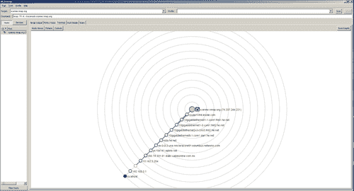
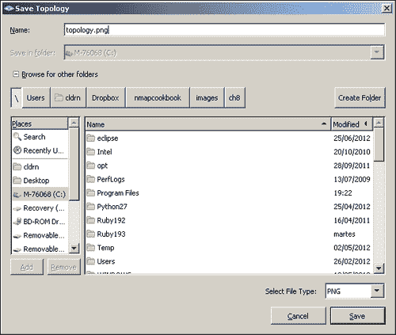

# 第 8 章生成扫描报告

### 注

本章向您展示了如何做一些在许多情况下可能是非法的、不道德的、违反服务条款的或不是好主意的事情。这里提供的信息可用于保护您免受威胁，并使您自己的系统更安全。在遵循这些说明之前，请确保您站在法律和道德的正确一边。。。善用你的力量！

在本章中，我们将介绍：

*   以正常格式保存扫描结果
*   以 XML 格式保存扫描结果
*   将扫描结果保存到 SQLite 数据库
*   以可分级格式保存扫描结果
*   用 Zenmap 生成网络拓扑图
*   生成 HTML 扫描报告
*   报告扫描期间执行的漏洞检查

# 导言

扫描报告对渗透测试人员和系统管理员都很有用。渗透测试人员需要报告他们的发现，并包括目标弱点的证据。另一方面，系统管理员保存网络资源清册并监视其网络的完整性。

安全专业人员和网络管理员犯的一个常见错误是没有使用 Nmap 中的报告功能来加速这些报告的生成。Nmap 可以以多种格式写入扫描结果，这取决于用户是否生成 HTML 报告，是否从脚本语言读取，甚至是否将其导入第三方安全工具以继续测试目标的其他方面。在本章中，我们将介绍与存储扫描报告相关的不同任务。我们首先介绍 Nmap 支持的不同文件格式。此外，我们还将为您提供一些技巧，例如使用 Zenmap 生成网络拓扑图、报告漏洞检查，以及使用 PBNJ 将结果存储在 MySQL、SQLite 或 CSV 数据库中。

在学习了本章所涵盖的任务后，您应该完全熟练地选择适当的文件格式来存储扫描结果，具体取决于您计划对报告执行的操作。

# 以正常格式保存扫描结果

Nmap 支持保存扫描结果的不同格式。根据需要，您可以在普通输出、XML 输出和可分级输出之间进行选择。正常模式保存屏幕上显示的输出，减去运行时调试信息。该模式以结构良好且易于理解的方式呈现调查结果。

此配方说明如何在正常模式下将 Nmap 扫描结果保存到文件中。

## 怎么做。。。

要将扫描结果以正常输出格式保存到文件中，请添加选项`-oN <filename>`。此选项仅影响输出，可与任何端口或主机扫描技术结合使用：

```
# nmap -F -oN scanme.txt scanme.nmap.org

```

扫描完成后，现在应将输出保存在文件`scanme.txt`中：

```
$cat scanme.txt
# Nmap 6.02 scan initiated Thu Jun 28 23:16:32 2012 as: nmap -F -oN scanme.txt scanme.nmap.org
Nmap scan report for scanme.nmap.org (74.207.244.221)
Host is up (0.47s latency).
Not shown: 95 closed ports
PORT    STATE    SERVICE
22/tcp  open     ssh
80/tcp  open     http
135/tcp filtered msrpc
139/tcp filtered netbios-ssn
445/tcp filtered microsoft-ds

# Nmap done at Thu Jun 28 23:16:37 2012 -- 1 IP address (1 host up) scanned in 5.01 seconds

```

## 它是如何工作的。。。

Nmap 支持多种输出格式，如普通、XML、可分级，甚至脚本 kiddie（这只是为了好玩才添加的）。普通模式易于阅读，如果您不打算处理或解析结果，建议使用普通模式。

生成的文件将包含与屏幕上打印的信息相同的信息，而没有运行时警告。

## 还有更多。。。

正常输出选项`-oN`可与任何其他可用输出选项组合。例如，我们可能希望生成 XML 格式的结果，以便在第三方工具中导入，并在正常模式下与同事共享：

```
# nmap -A -oN normal-output.txt -oX xml-output.xml scanme.nmap.org

```

详细标志`-v`和调试标志`-d`也会改变包含的信息量。您可以使用整数或重复`v`或`d`字符数来设置详细程度或调试级别：

```
# nmap -F -sV -v2 -oN nmapscan.txt scanme.nmap.org
# nmap -F -sV -vv -oN nmapscan.txt scanme.nmap.org
# nmap -F -sV -d2 -oN nmapscan-debug.txt scanme.nmap.org
# nmap -F -sV -dd -oN nampscan-debug.txt scanme.nmap.org

```

### 保存所有格式的 Nmap 输出

Nmap 支持别名选项`-oA <basename>`，该选项以所有可用格式（普通、XML 和可分级）保存扫描结果。将生成扩展名为`.nmap`、`.xml`和`.grep`的不同文件：

```
$ nmap -oA scanme scanme.nmap.org

```

运行上一个命令相当于运行以下命令：

```
$ nmap -oX scanme.xml -oN scanme.nmap -oG scanme.grep scanme.nmap.org

```

### 在输出日志中包含调试信息

以正常模式（`-oN`和可登录模式（`-oG`保存输出时，Nmap 不包括调试信息，例如警告和错误。要使 Nmap 包含此信息，请使用指令`--log-errors`，如下命令所示：

```
$ nmap -A -T4 -oN output.txt --log-errors scanme.nmap.org

```

### 包括端口或主机状态的原因

要使 Nmap 包含端口标记为打开或关闭以及主机标记为活动的原因，请使用选项`--reason`，如以下命令所示：

```
# nmap -F --reason scanme.nmap.org

```

选项`--reason`将使 Nmap 包含确定端口和主机状态的数据包类型。例如：

```
nmap -F --reason scanme.nmap.org
Nmap scan report for scanme.nmap.org (74.207.244.221)
Host is up, received echo-reply (0.12s latency).
Not shown: 96 closed ports
Reason: 96 resets
PORT    STATE    SERVICE REASON
22/tcp  open     ssh     syn-ack
25/tcp  filtered smtp    no-response
80/tcp  open     http    syn-ack
646/tcp filtered ldp     no-response

Nmap done: 1 IP address (1 host up) scanned in 3.60 seconds

```

### 追加 Nmap 输出日志

默认情况下，当使用任何输出选项（`-oN`、`-oX`、`-oG`、`-oS`时，Nmap 将覆盖日志文件。要告诉 Nmap 追加结果而不是覆盖结果，请使用指令`--append-output`，如下命令所示：

```
# nmap --append-output -oN existing.log scanme.nmap.org

```

注意，对于 XML 文件，Nmap 不会重建树结构。如果您计划解析或处理结果，我建议您不要使用此选项，除非您愿意手动修复该文件。

### 详细模式下的操作系统检测

在详细模式下使用操作系统检测，通过使用以下命令查看其他主机信息，例如用于空闲扫描的 IP-ID 序列号：

```
# nmap -O -v <target>

```

## 另见

*   *以 XML 格式*保存扫描结果
*   *将扫描结果保存到 SQLite 数据库*配方
*   *将扫描结果保存为可搜索格式*配方
*   *将扫描结果与[第一章](01.html "Chapter 1. Nmap Fundamentals")*Nmap 基础*中的 Ndiff*配方进行比较
*   [第一章](01.html "Chapter 1. Nmap Fundamentals")*Nmap 基础*中的*使用 Nmap 和 Ndiff*配方远程监控服务器

# 以 XML 格式保存扫描结果

**可扩展标记语言（XML）**是 Nmap 支持的一种广为人知的树结构文件格式。扫描结果可以导出或写入 XML 文件，并用于分析或其他附加任务。这是最受欢迎的文件格式之一，因为所有编程语言都有非常可靠的库来解析 XML。

下面的方法教您如何以 XML 格式保存扫描结果。

## 怎么做。。。

要将扫描结果以 XML 格式保存到文件中，请添加选项`-oX <filename>`，如以下命令所示：

```
# nmap -A -O -oX scanme.xml scanme.nmap.org

```

扫描完成后，将写入包含结果的新文件：

```
$cat scanme.xml
<?xml version="1.0"?>
<?xml-stylesheet href="file:///usr/local/bin/../share/nmap/nmap.xsl" type="text/xsl"?>
<!-- Nmap 6.02 scan initiated Thu Jun  28 19:34:43 2012 as: nmap -p22,80,443 -oX scanme.xml scanme.nmap.org -->
<nmaprun scanner="nmap" args="nmap -p22,80,443 -oX scanme.xml scanme.nmap.org" start="1341362083" startstr="Thu Jun  28 19:34:43 2012" version="6.02" xmloutputversion="1.04">
<scaninfo type="syn" protocol="tcp" numservices="3" services="22,80,443"/>
<verbose level="0"/>
<debugging level="0"/>
<host starttime="1341362083" endtime="1341362083"><status state="up" reason="echo-reply"/>
<address addr="74.207.244.221" addrtype="ipv4"/>
<hostnames>
<hostname name="scanme.nmap.org" type="user"/>
<hostname name="scanme.nmap.org" type="PTR"/>
</hostnames>
<ports><port protocol="tcp" portid="22"><state state="open" reason="syn-ack" reason_ttl="63"/><service name="ssh" method="table" conf="3"/></port>
<port protocol="tcp" portid="80"><state state="open" reason="syn-ack" reason_ttl="63"/><service name="http" method="table" conf="3"/></port>
<port protocol="tcp" portid="443"><state state="closed" reason="reset" reason_ttl="63"/><service name="https" method="table" conf="3"/></port>
</ports>
<times srtt="672" rttvar="2219" to="100000"/>
</host>
<runstats><finished time="1341362083" timestr="Thu Jun  28 19:34:43 2012" elapsed="0.29" summary="Nmap done at Tue Jul  3 19:34:43 2012; 1 IP address (1 host up) scanned in 0.29 seconds" exit="success"/><hosts up="1" down="0" total="1"/>
</runstats>
</nmaprun>
```

## 它是如何工作的。。。

XML 格式被广泛采用，所有编程语言都有健壮的解析库。因此，许多 Nmap 用户在保存扫描结果进行后处理时更喜欢 XML 格式。以这种格式保存扫描结果时，Nmap 还包括其他调试信息。

生成的 XML 文件将包含以下信息：

*   东道国和港口国
*   服务
*   时间标记
*   执行命令
*   Nmap 脚本引擎输出
*   运行统计信息和调试信息

## 还有更多。。。

如果您希望打印 XML 结果而不是将其写入文件，请将选项`-oX`设置为“`-`，如下命令所示：

```
$ nmap -oX - scanme.nmap.org

```

Nmap 生成的 XML 文件引用 XSL 样式表。XSL 用于在 web 浏览器中查看 XML 文件。默认情况下，它指向您的本地副本`nmap.xsl`，但您可以使用参数`--stylesheet`设置替代样式表，如下命令所示：

```
$ nmap -A -oX results.xml --stylesheet http://0xdeadbeefcafe.com/style.xsl scanme.nmap.org

```

但是，由于**同源策略**（**SOP**限制，现代 web 浏览器不允许您使用远程 XSL 样式表。我建议您将样式表与要查看的 XML 文件放在同一文件夹中，以避免这些问题。

如果您不打算在 web 浏览器中查看 XML 文件，请使用选项`--no-stylesheet`删除对 XSL 样式表的引用，以节省一些磁盘空间，如下命令所示：

```
$ nmap -oX results.xml --no-stylesheet scanme.nmap.org

```

### 保存所有格式的 Nmap 输出

Nmap 支持别名选项`-oA <basename>`，该选项以所有可用格式（普通、XML 和可分级）保存扫描结果。将使用扩展名`.nmap`、`.xml`和`.grep`生成不同的文件：

```
$ nmap -oA scanme scanme.nmap.org

```

运行上一个命令相当于运行以下命令：

```
$ nmap -oX scanme.xml -oN scanme.nmap -oG scanme.grep scanme.nmap.org

```

### 追加 Nmap 输出日志

默认情况下，当使用任何输出选项（`-oN`、`-oX`、`-oG`、`-oS`时，Nmap 将覆盖日志文件。要告诉 Nmap 追加结果而不是覆盖结果，请使用指令`--append-output`：

```
# nmap --append-output -oN existing.log scanme.nmap.org

```

注意，对于 XML 文件，Nmap 不会重建树结构。如果您计划解析或处理结果，我建议您不要使用此选项，除非您愿意手动修复该文件。

### NSE 结构化脚本输出

NMAP6 的一个新特性是 NSE 的 XML 结构化输出。此功能允许 NSE 脚本返回要反映在 XML 树中的值表：

```
<script id="test" output="
id: nse
uris: 
  index.php
  test.php">
  <elem key="id">nse</elem>
  <table key="uris">
    <elem>index.php</elem>
    <elem>test.php</elem>
  </table>
</script>
```

在编写本书时，所有 NSE 脚本尚未更新以支持此功能。如果您正在编写自己的脚本，我强烈建议您返回一个名称-值对表，其中包含有意义的键名，以利用此功能。

## 另见

*   *以正常格式*保存扫描结果
*   *将扫描结果保存到 SQLite 数据库*配方
*   *将扫描结果保存为可搜索格式*配方
*   *将扫描结果与[第一章](01.html "Chapter 1. Nmap Fundamentals")*Nmap 基础*中的 Ndiff*配方进行比较
*   [第一章](01.html "Chapter 1. Nmap Fundamentals")*Nmap 基础*中的*使用 Nmap 和 Ndiff*配方远程监控服务器

# 将扫描结果保存到 SQLite 数据库

开发人员将信息存储在 SQL 数据库中，因为使用灵活的 SQL 查询提取信息非常简单。但是，这是一个尚未正式包含在 Nmap 中的功能。PBNJ 是一组用于网络监视的工具，它使用 Nmap 来检测主机、端口和服务。

下面的方法将向您展示如何在 SQLite 和 MySQL 数据库中存储扫描结果。

## 准备好了吗

PBNJ 是由 Joshua D.Abraham 编写的一套用于监控网络完整性的工具。如果您正在运行基于 Debian 的系统，则可以使用以下命令进行安装：

```
#apt-get install pbnj

```

要了解 PBNJ 的要求以及如何在支持 Perl 的其他系统上安装 PBNJ，请转至[http://pbnj.sourceforge.net/docs.html](http://pbnj.sourceforge.net/docs.html) 。

## 怎么做。。。

运行`scanpbnj`并使用`-a`选项输入 Nmap 参数：

```
#scanpbnj -a "-p-" scanme.nmap.org

```

`Scanpbnj`将结果存储在`config.yaml`文件中配置的数据库中或设置参数。默认情况下，`scanpbnj`将文件`data.dbl`写入当前工作目录。

## 它是如何工作的。。。

PBNJ 工具套件旨在帮助系统管理员监控其网络完整性。它执行 Nmap 扫描并将返回的信息存储在配置的数据库中。

PBNJ 使用的 SQLite 数据库模式为：

```
CREATE TABLE machines (
                   mid INTEGER PRIMARY KEY AUTOINCREMENT,
                   ip TEXT,
                   host TEXT,
                   localh INTEGER,
                   os TEXT,
                   machine_created TEXT,
                   created_on TEXT);
        CREATE TABLE services (
                   mid INTEGER,
                   service TEXT,
                   state TEXT,
                   port INTEGER,
                   protocol TEXT,
                   version TEXT,
                   banner TEXT,
                   machine_updated TEXT,
                   updated_on TEXT);
```

脚本`scanpbnj`负责扫描结果，并将结果存储在用户配置的数据库中。默认情况下，它使用 SQLite，您无需更改配置文件即可使其工作。数据库写在文件`data.dbl`中，配置文件可以在文件`$HOME/.pbnj-2.0/config.yaml`中找到。要使用 MySQL 数据库，只需更改配置文件中的驱动程序和数据库信息。

在上一个示例中，我们使用参数`-a`将参数传递给 Nmap。不幸的是，PBNJ 不支持 Nmap 的所有最新功能，因此我建议您通过阅读其主页了解`scanpbnj`的所有执行选项。在编写本书时，OS detection 没有正确读取 Nmap 的 CPE 输出。

## 还有更多。。。

PBNJ 还有一个名为`outputpbnj`的脚本，用于提取和显示存储在数据库中的信息。要列出可用的查询，请运行以下命令：

```
#outputpbnj --list

```

例如，要运行查询以列出记录的机器，请使用以下命令：

```
#outputpbnj -q machines

```

我们得到以下输出：

```
Wed Jul  4 00:37:49 2012	74.207.244.221	scanme.nmap.org	0	unknown os

```

要检索服务资源清册，请使用以下命令：

```
#outputpbnj -q services

```

我们得到以下输出：

```
Wed Jul  4 20:38:27 2012	ssh	5.3p1 Debian 3ubuntu7	OpenSSH	up
Wed Jul  4 20:38:27 2012	http	2.2.14	Apache httpd	up
Wed Jul  4 20:38:27 2012	nping-echo	unknown version	Nping echo	up

```

### 以 CSV 格式转储数据库

`Outputpbnj`还支持几种不同的输出格式。要以**逗号分隔值****（CSV）**格式输出查询结果，请使用以下命令：

```
#outputpbnj -t cvs -q <query name>

```

输出将从数据库中提取并以 CSV 格式格式化：

```
# outputpbnj -t csv -q machines
Wed Jul  4 20:38:27 2012,74.207.244.221,scanme.nmap.org,0,unknown os
Wed Jul  4 20:38:27 2012,192.168.0.1,,0,unknown os

```

### 固定输出 PBNJ

在写这本书的时候，有一个 bug 没有让`outputpbnj`运行。在对这个问题进行了一些研究之后，看起来补丁可能不会很快出现，所以我决定在这里加入相关的补丁。

要确定您的`outputpbnj`是否损坏，请尝试使用以下命令显示版本号：

```
# outputpbnj -v

```

如果您的版本已损坏，您将看到以下错误消息：

```
Error in option spec: "test|=s"
Error in option spec: "debug|=s"

```

在尝试修复之前，让我们使用以下命令创建脚本的备份副本：

```
# cp /usr/local/bin/outputpbnj outputpbnj-original

```

现在，使用您喜爱的编辑器打开脚本，并找到以下行：

```
'test|=s', 'debug|=s'

```

替换为：

```
'test=s', 'debug=s'

```

您现在应该能够运行`outputpbnj`：

```
#outputpbnj -v
outputpbnj version 2.04 by Joshua D. Abraham

```

## 另见

*   *以正常格式*保存扫描结果
*   *以 XML 格式*保存扫描结果
*   *将扫描结果保存为可搜索格式*配方
*   *将扫描结果与[第一章](01.html "Chapter 1. Nmap Fundamentals")*Nmap 基础*中的 Ndiff*配方进行比较
*   [第一章](01.html "Chapter 1. Nmap Fundamentals")*Nmap 基础*中的*使用 Nmap 和 Ndiff*配方远程监控服务器

# 以可分级格式保存扫描结果

Nmap 在保存扫描结果时支持不同的文件格式。根据您的需要，您可以在普通、可分级和 XML 格式之间进行选择。可归格格式用于帮助用户从日志中提取信息，而无需编写解析器，因为这种格式是用标准 Unix 工具读取/解析的。尽管此功能已被弃用，但有些人仍然发现它对快速工作很有用。

在下面的配方中，我们将向您展示如何以可分级模式输出 Nmap 扫描。

## 怎么做。。。

要将扫描结果保存到可分级格式的文件中，请添加选项`-oG <filename>`，如下命令所示：

```
# nmap -F -oG scanme.grep scanme.nmap.org

```

扫描完成后，输出文件应出现：

```
# cat nmap.grep
# Nmap 6.01 scan initiated Thu Jun  28 01:53:03 2012 as: nmap -oG nmap.grep -F scanme.nmap.org
Host: 74.207.244.221 (scanme.nmap.org)	Status: Up
Host: 74.207.244.221 (scanme.nmap.org)	Ports: 22/open/tcp//ssh///, 25/filtered/tcp//smtp///, 80/open/tcp//http///, 646/filtered/tcp//ldp///	Ignored State: closed (96)
# Nmap done at Thu Jun  28 01:53:07 2012 -- 1 IP address (1 host up) scanned in 3.49 seconds

```

## 它是如何工作的。。。

在可登录模式下，每个主机以`<field name>: <value>`格式放置在同一行上，每个字段用制表符（`\t`分隔。字段的数量取决于扫描使用的 Nmap 选项。

有八个可能的输出字段：

*   **主机**：始终包含此字段，包括 IP 地址和反向 DNS 名称（如果有）
*   **状态**：该字段有三个可能的值：向上、向下或未知
*   **端口**：在该字段中，端口条目用逗号和空格分隔，每个条目用正斜杠字符分为七个字段（`/`）
*   **协议**：使用 IP 协议（`-sO`扫描时显示此字段
*   **忽略**：此字段显示被忽略的端口状态数
*   **OS**：此字段仅在使用 OS 检测（`-O`时显示
*   **Seq Index**：只有在使用 OS 检测（`-O`时才显示此字段
*   **IP ID Seq**：此字段仅在使用 OS 检测（`-O`）时显示

## 还有更多。。。

如前所述，不推荐使用可分组模式。Nmap 脚本引擎的任何输出都不包含在此格式中，因此，如果使用 NSE，则不应使用此模式。或者，您可以指定一个附加的输出选项以将此信息存储在另一个文件中：

```
# nmap -A -oX results-with-nse.xml -oG results.grep scanme.nmap.org

```

如果您希望打印可分级结果而不是将其写入文件，请将选项`-oG`设置为“`-`：

```
$ nmap -oG - scanme.nmap.org

```

### 保存所有格式的 Nmap 输出

Nmap 支持别名选项`-oA <basename>`，该选项以所有可用格式（普通、XML 和可分级）保存扫描结果。将使用扩展名`.nmap`、`.xml`和`.grep`生成不同的文件：

```
$ nmap -oA scanme scanme.nmap.org

```

运行上一个命令等同于运行以下命令：

```
$ nmap -oX scanme.xml -oN scanme.nmap -oG scanme.grep scanme.nmap.org

```

### 追加 Nmap 输出日志

默认情况下，当使用任何输出选项（`-oN`、`-oX`、`-oG`、`-oS`时，Nmap 将覆盖其日志文件。要告诉 Nmap 追加结果而不是覆盖结果，请使用指令`--append-output`，如下命令所示：

```
# nmap --append-output -oN existing.log scanme.nmap.org

```

注意，对于 XML 文件，Nmap 不会重建树结构。如果您计划解析或处理结果，我建议您不要使用此选项，除非您愿意手动修复该文件。

## 另见

*   *以正常格式*保存扫描结果
*   *以 XML 格式*保存扫描结果
*   *将扫描结果保存到 SQLite 数据库*配方
*   *将扫描结果与[第一章](01.html "Chapter 1. Nmap Fundamentals")*Nmap 基础*中的 Ndiff*配方进行比较
*   [第一章](01.html "Chapter 1. Nmap Fundamentals")*Nmap 基础*中的*使用 Nmap 和 Ndiff*配方远程监控服务器

# 用 Zenmap 生成网络拓扑图

Zenmap 的拓扑选项卡允许用户获取扫描网络的图形表示。网络图用于其中的多个任务，通过从 Nmap 导出拓扑图，我们可以避免使用第三方工具绘制拓扑图。此选项卡还包括几个用于调整图形视图的可视化选项。

此配方将向您展示如何使用 Zenmap 生成网络拓扑的图像。

## 怎么做。。。

使用以下命令扫描要在 Zenmap 中映射的网络：

```
# nmap -O -A 192.168.1.0/24

```

进入名为**拓扑**的选项卡。您现在应该可以看到拓扑图，如以下屏幕截图所示：



点击右上角的**保存图形**。

输入文件名，选择文件类型，点击**保存**，如下图所示：



## 它是如何工作的。。。

**拓扑**选项卡是 RadialNet（[的一个改编 http://www.dca.ufrn.br/~joaomedeiros/radialnet/](http://www.dca.ufrn.br/~joaomedeiros/radialnet/)），由圣保罗 S.Medeiros 创作，是我最喜欢的 Zenmap 特色。它为用户提供了网络拓扑图，It 部门可以将其用于多种用途，从清点到检测恶意访问点。

在 Zenmap 拓扑图中，主机由节点表示，边表示它们之间的连接。显然，此功能最适合指令`--traceroute`，因为此选项允许 Nmap 收集有关网络路径的信息。节点也有不同的颜色和大小，表示主机及其端口的状态。还有一些特殊图标用于表示不同类型的设备，如路由器、防火墙或接入点。

## 还有更多。。。

如果需要向当前图形中添加其他主机，则只需扫描目标。Zenmap 会跟踪所有扫描，它会自动将新网络添加到拓扑视图中。

Zenmap 的**拓扑**选项卡还提供了几个可视化控件，可以根据需要进行调整。这些控件包括分组、高亮显示和动画。

要了解有关可视化控件的更多信息，请访问官方文档[http://nmap.org/book/zenmap-topology.html](http://nmap.org/book/zenmap-topology.html) 。

## 另见

*   *以 XML 格式*保存扫描结果
*   *将扫描结果保存为可搜索格式*配方
*   [第一章](01.html "Chapter 1. Nmap Fundamentals")*Nmap 基础*中的*使用 Zenmap*配方管理不同的扫描配置文件

# 生成 HTML 扫描报告

HTML 页面比其他文件格式具有特殊的优势；它们可以在大多数设备附带的 web 浏览器中查看。因此，用户可能会发现用 HTML 生成扫描报告并将其上传到某个地方以便于访问是很有用的。

下面的方法将向您展示如何生成一个 HTML 页面，显示从 XML 结果文件中获取的扫描结果。

## 准备好了。。。

对于这个任务，我们将使用一个名为“XSLT 处理器”的工具。有几个选项可用于不同的平台，但 Unix 系统中最流行的选项称为“xsltproc”；如果您运行的是现代 Linux，那么很有可能您已经安装了它。“Xsltproc”也适用于 Windows，但它需要向其中添加一些附加库。

如果您正在寻找其他更易于在 Windows 上安装的跨平台 XSLT（和 XQuery）处理器，请转到[http://saxon.sourceforge.net/](http://saxon.sourceforge.net/) 。他们提供了基于 Java 的“saxon”的免费版本。

## 怎么做。。。

首先，使用以下命令以 XML 格式保存扫描结果：

```
# nmap -A -oX results.xml scanme.nmap.org

```

运行`xsltproc`将 XML 文件转换为 HTML/CSS：

```
$xsltproc  results.xml -o results.html

```

HTML 文件应写入您的工作目录。现在，用你最喜欢的网络浏览器打开它。


## 它是如何工作的。。。

XSL 样式表用于直接从 web 浏览器查看 XML 文件。不幸的是，现代 web 浏览器包含更严格的同源策略限制，因此生成 HTML 报告更方便。

`xsltproc`实用程序采用以下参数：

```
$xsltproc <input file> -o <output file>

```

对 XSL 样式表的引用包含在 XML 文件中，样式取自该文件。

您需要确保引用的 XSL 样式表是可读的，否则`xsltproc`将失败。默认情况下，Nmap 将`nmap.xsl`发送到您的安装目录。如果您的系统中没有它，您可以从`<url>`下载它，将它放在您的工作目录中，并使用指令`--stylesheet`：

```
#cp /usr/local/share/nmap/nmap.xsl

```

最后，我们应该将`nmap.xsl`和结果文件`results.xml`放在同一个文件夹（我们的工作目录）中。

## 还有更多。。。

如果系统中没有 XSL 样式表，可以使用指令`--webxml`让 Nmap 使用以下命令引用在线副本：

```
# nmap -A -oX results.xml --webxml scanme.nmap.org

```

要自定义报表的外观，可以编辑 XSL 样式表。我建议您从文件`nmap.xsl`开始学习字段名。

## 另见

*   *以正常格式*保存扫描结果
*   *以 XML 格式*保存扫描结果
*   *将扫描结果保存为可搜索格式*配方
*   *以正常格式*保存扫描结果
*   *将扫描结果保存到 SQLite 数据库*配方
*   *将扫描结果与[第一章](01.html "Chapter 1. Nmap Fundamentals")*Nmap 基础*中的 Ndiff*配方进行比较
*   [第一章](01.html "Chapter 1. Nmap Fundamentals")*Nmap 基础*中的*使用 Nmap 和 Ndiff*配方远程监控服务器

# 报告扫描期间执行的漏洞检查

可以使用 NSE 脚本将 Nmap 转换为漏洞扫描程序。库`vuln`管理并统一 Nmap 脚本引擎执行的漏洞检查的输出。

此配方将向您展示如何使 Nmap 报告所执行的漏洞检查。

## 怎么做。。。

使用以下命令针对您的目标启动`vuln`类别中的 NSE 脚本：

```
nmap -sV --script vuln <target>

```

如果幸运的话，您将看到一个漏洞报告：

```
PORT     STATE SERVICE REASON
306/tcp open  mysql   syn-ack
 mysql-vuln-cve2012-2122:
 VULNERABLE:
 Authentication bypass in MySQL servers.
 State: VULNERABLE
 IDs:  CVE:CVE-2012-2122
 Description:
 When a user connects to MariaDB/MySQL, a token (SHA
 over a password and a random scramble string) is calculated and compared
 with the expected value. Because of incorrect casting, it might've
 happened that the token and the expected value were considered equal,
 even if the memcmp() returned a non-zero value. In this case
 MySQL/MariaDB would think that the password is correct, even while it is
 not.  Because the protocol uses random strings, the probability of
 hitting this bug is about 1/256.
 Which means, if one knows a user name to connect (and "root" almost
 always exists), she can connect using *any* password by repeating
 connection attempts. ~300 attempts takes only a fraction of second, so
 basically account password protection is as good as nonexistent.

 Disclosure date: 2012-06-9
 Extra information:
 Server granted access at iteration #204
 root:*9CFBBC772F3F6C106020035386DA5BBBF1249A11
 debian-sys-maint:*BDA9386EE35F7F326239844C185B01E3912749BF
 phpmyadmin:*9CFBBC772F3F6C106020035386DA5BBBF1249A11
 References:
 https://community.rapid7.com/community/metasploit/blog/2012/06/11/cve-2012-2122-a-tragically-comedic-security-flaw-in-mysql
 http://seclists.org/oss-sec/2012/q2/493
 http://cve.mitre.org/cgi-bin/cvename.cgi?name=CVE-2012-2122

```

## 它是如何工作的。。。

选项`--script vuln`告诉 Nmap 启动`vuln`类别下的所有 NSE 脚本。`vuln`库报告几个字段，如名称、描述、CVE、OSVDB、披露日期、风险因素、利用结果、CVSS 分数、参考链接和其他额外信息。

库`vuln`由 Djalal Harouni 和 Henri Doreau 创建，用于报告和存储 Nmap 发现的漏洞。库返回的信息通过向我们提供有关漏洞的详细信息帮助我们编写漏洞报告。请记住，该库是最近引入的，并非所有 NSE 脚本都使用它。

## 还有更多。。。

如果希望 Nmap 报告所有安全检查，即使是不成功的安全检查，请设置库参数`vulns.showall`：

```
# nmap -sV --script vuln --script-args vulns.showall <target>

```

每个`vuln`NSE 脚本将报告其状态：

```
http-phpself-xss:
 NOT VULNERABLE:
 Unsafe use of $_SERVER["PHP_SELF"] in PHP files
 State: NOT VULNERABLE
 References:
 http://php.net/manual/en/reserved.variables.server.php
 https://www.owasp.org/index.php/Cross-site_Scripting_(XSS)

```

## 另见

*   *以正常格式*保存扫描结果
*   *以 XML 格式*保存扫描结果
*   [第一章](01.html "Chapter 1. Nmap Fundamentals")*Nmap 基础*中远程主机配方的*指纹服务*
*   [第 3 章](03.html "Chapter 3. Gathering Additional Host Information")中*匹配已知安全漏洞的服务*配方*收集额外主机信息*