# 报告分析与确认

在本章中，我们将介绍以下配方：

*   理解 Nmap 输出
*   了解 Nessus 输出
*   如何使用 Nmap 和其他工具确认 Nessus 漏洞

# 介绍

在本章中，我们将介绍使用 Nmap 和 Nessus 生成报告的各种方法。我们还将研究使用 Nmap 确认 Nessus 报告的漏洞的方法。始终需要确认扫描仪报告的漏洞，因为扫描仪有可能报告假阳性漏洞。确认这些漏洞将使管理团队能够专注于已确认的漏洞，而不是将资源浪费在已报告的误报上。Nmap 和 Nessus 都生成不同格式的报告，允许用户根据自己的需求进行选择。

# 理解 Nmap 输出

Nmap 根据从远程主机收到的响应显示结果。扫描的主机越多，屏幕上打印的结果就越复杂。当主机数量增加时，在终端或命令提示符中打印时无法分析这些结果。为了解决这个问题，Nmap 支持各种报告格式，可以根据用户需求使用。存储 Nmap 输出的最简单方法之一是使用一个`>>`运算符，后跟一个文本文件名，如`output.txt`。这将允许 Nmap 将所有内容转发到该文本文件。对于 10 多台主机来说，即使是文本文件的内容也会成为一场噩梦。Nmap 还提供了大量详细信息和调试信息，以及端口扫描，这会使此过程更加复杂。操作系统的检测和指纹识别给这些数据增加了很多垃圾。

以下命令用于在 IP 地址`192.168.75.128`上运行 SYN 扫描，并将显示的输出存储到`output.txt`文件中。此文件位于`C:\Users\admin`文件夹中，因为命令提示符正在同一文件夹中运行。此外，只需在双引号中提及文件的绝对路径，即可将此文件存储在任何位置：

```
Nmap –sS –Pn192.168.65.128>> output.txt
```

让我们通过以下屏幕截图了解如何将结果复制到文本文件：

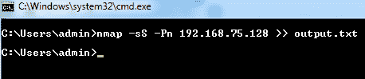

导航到 Nmap 安装文件夹并找到`output.txt`文件：


您可以使用任何文本编辑器打开此文件。我个人推荐记事本+，因为它允许您对文本文件执行复杂的分析，并以隔离的方式显示它们：


Nmap 允许用户使用命令行标志定义输出格式。以下列表说明了 Nmap 允许的不同标志：

*   **交互输出**：终端或命令提示符直接显示的输出类型。这不需要任何特殊的命令提示符参数或标志，因为这是基本和默认输出格式。该结果不会存储或保存在任何位置；只有在命令提示符或终端未关闭时，才能访问此输出。
*   **正常输出**（`-oN`）：此输出允许用户将交互输出保存到用户选择的文件中。此报告选项根据用户选择的详细程度，从交互式输出扫描中省略不必要的详细数据，从而进一步精简输出。这将允许用户通过省略不需要的数据来更好地查看端口扫描结果。如果用户需要扫描时间和警报等性能数据，则选择这种格式并不合适。此外，您可以通过提及绝对路径或使用与其路径相同的位置启动命令提示符来指定文件夹位置。
*   **XML 输出**（`-oX`）：将 Nmap 数据上传到各种工具和网站需要这种类型的输出。一旦这个格式被上传到任何工具，它就会被解析器解析，这样我们就可以理解输出中的各种数据类型，并相应地隔离数据。有许多 XML 解析可以作为开放源代码使用，它们是由各种工具 OEM 定制的。
*   **可归格输出**（`-oG`）：此格式允许用户对生成的输出执行`grep`、`awk`、`cut`、`diff`等简单操作。该格式遵循一种结构，即使用适当的分隔符为每个主机创建单行输出，以便用户可以使用操作系统中的简单现有工具来分离和分析结果。记事本++实用程序就是这样一个示例，它允许基于分隔符的分隔，可用于创建更有意义的报告。
*   **脚本 kiddie**（`-oS`）：此格式打印脚本中的输出。
*   **保存为所有格式**（`-oA`）：此标志允许用户以前面提到的三种格式（`-oN`、`-oX`、`–oG`生成输出。不必执行三次不同的扫描以获得输出格式，只需使用此标志获取所有三种报告格式并将其保存在提供位置的文件中即可。

Nmap 还提供各种其他详细信息作为扫描结果的一部分，其中一些可由可用的详细选项控制。下面是由 verbose 选项生成的几个额外数据段：

*   **扫描完成时间估算**：Nmap 还提供扫描完成时间等性能数据，以分钟到秒为单位，使用户可以了解 Nmap 执行扫描所需的时间。Nmap 更新用户在所用时间和正在执行的任务之间的间隔，以及完成百分比。这允许用户监视较大网络的网络扫描，并偶尔改进脚本的执行时间。
*   **打开的端口**：在未启用详细功能的正常扫描中，所有打开的端口都显示在扫描结束时。相反，如果启用了 verbose，则在检测到每个打开的端口时会立即显示它。
*   **附加警告**：Nmap 还显示扫描过程中出现的任何警告或错误，无论端口扫描是否需要额外时间，或与扫描正常行为的任何差异。这将允许用户检查任何网络限制并相应地采取行动。
*   **操作系统检测信息**：Nmap 中的操作系统检测采用基于 TCP ISN 和 IP ID 预测的签名检测。如果启用了“详细”并选择了“操作系统检测”选项，Nmap 将显示这些操作系统的预测。
*   **主机状态**：Nmap 还打印运行时检测到的主机状态，说明主机是活的还是死的：

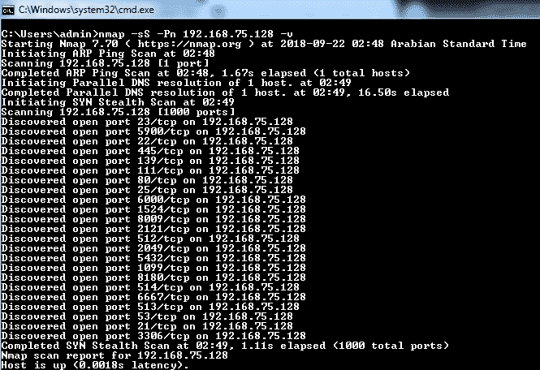

一些选项可与详细选项一起使用，以控制输出中显示的数据，如下所示：

*   **调试输出**：调试模式是 Nmap 提供的一个附加标志选项，用于帮助用户进一步了解数据包级别的端口扫描过程。这可以通过在详细语法中添加`–d`来启用。此外，您还可以通过在详细语法中添加`-d9`来设置要启用的调试级别，范围最多为 9。这是最高级别的调试，提供了大量有关正在执行的端口扫描的技术数据：

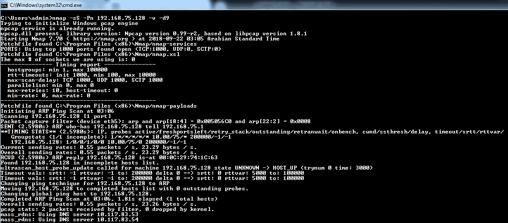

*   **数据包跟踪**：此选项允许用户获取 Nmap 发送的每个数据包的跟踪。这将允许用户获得对扫描的详细了解。这可以通过在详细语法中添加`--packet-trace`进行配置：


# 准备

要完成此活动，您必须在计算机上满足以下先决条件：

1.  您必须安装了 Nmap。
2.  您必须具有对要在其上执行扫描的主机的网络访问权限。

要安装 Nmap，您可以按照[第 2 章](02.html)*了解网络扫描工具*中提供的说明进行操作。这将允许您下载兼容版本的 Nmap 并安装所有必需的插件。要检查您的机器是否安装了 Nmap，请打开命令提示符并键入`Nmap`。如果安装了 Nmap，您将看到与以下类似的屏幕：

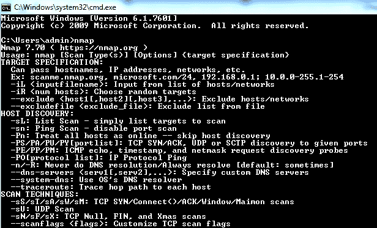

如果看不到前面的屏幕，请将命令提示符控件移动到安装了 Nmap 的文件夹（`C:\Program Files\Nmap`中），重试相同的步骤。如果执行此操作后未看到屏幕，请卸下并重新安装 Nmap。

要在要执行扫描的主机上填充打开的端口，您需要具有对该主机的网络级访问权限。检查您是否有权访问主机的一种简单方法是通过 ICMP 向主机发送 ping 数据包。但这种方法只有在该网络中启用 ICMP 和 ping 时才有效。在禁用 ICMP 的情况下，实时主机检测技术会有所不同。我们将在本书的后续章节中介绍这一点。

为了获得前面的输出，我们需要安装一个虚拟机。为了运行虚拟机，我建议使用 VMware 的 30 天试用版，可以从[下载并安装 https://www.vmware.com/products/workstation-pro/workstation-pro-evaluation.html](https://www.vmware.com/products/workstation-pro/workstation-pro-evaluation.html) 。

对于测试系统，读者可以从[下载 Metasploitable（Rapid 7 提供的易受攻击的虚拟机）https://information.rapid7.com/download-metasploitable-2017.html](https://information.rapid7.com/download-metasploitable-2017.html) 。执行以下步骤以打开 Metasploitable。这提供了各种组件，如操作系统、数据库和易受攻击的应用程序，这将帮助我们测试本章中的配方：

1.  解压缩下载的 Metasploitable 包：


2.  使用已安装的 VMware 工作站或 VMware Player 打开`.vmx`文件：


3.  使用`msfadmin`/`msfadmin`作为用户名和密码登录：


# 怎么做…

执行以下步骤：

1.  在命令提示符下打开 Nmap。
2.  在命令提示符中输入以下语法以获取交互式输出：

```
Nmap -sS -Pn 192.168.103.129
```


3.  在命令提示符中输入以下语法以获得正常输出：

```
Nmap -sS -Pn 192.168.103.129 -oN output
```


您可以导航到`system32`文件夹以找到输出文件，并使用文本编辑工具将其打开：

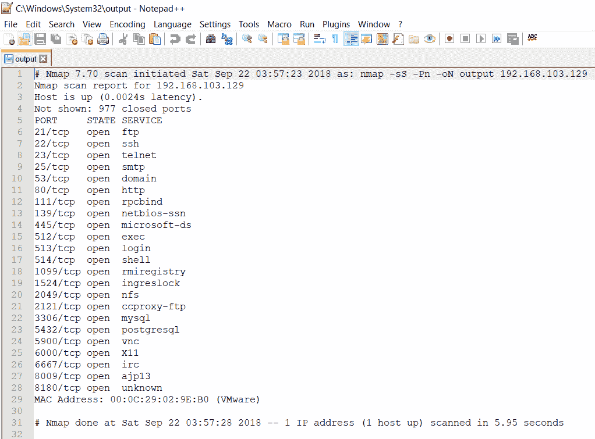

4.  在命令提示符中输入以下语法以获取 XML 输出：

```
Nmap -sS -Pn 192.168.103.129 -oX  output
```

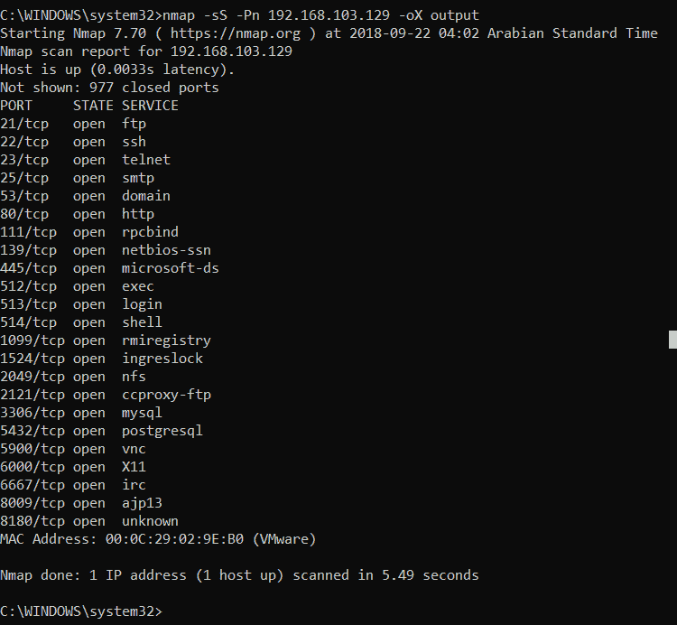

您可以导航到`system32`文件夹以找到输出文件，并使用文本编辑工具将其打开：


5.  在命令提示符中输入以下语法以获取脚本 kiddie 输出：

```
Nmap -sS -Pn 192.168.103.129 -oS  output
```

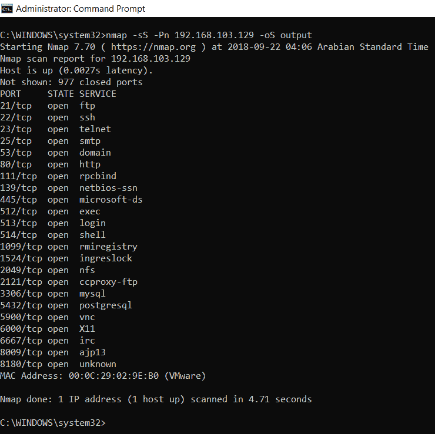

您可以导航到`system32`文件夹以找到输出文件，并使用文本编辑工具将其打开：

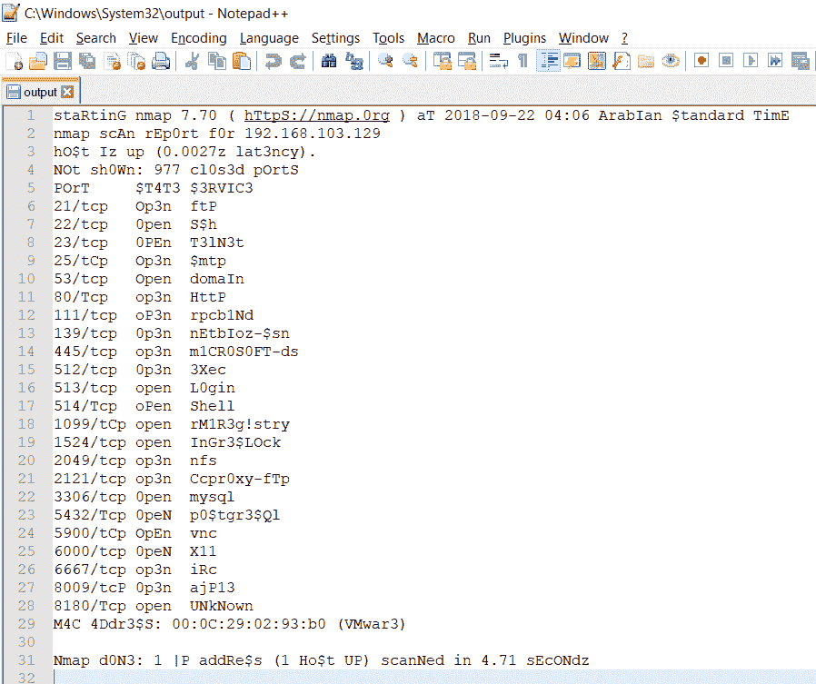

6.  在命令提示符中输入以下语法以获得可分级格式的输出：

```
Nmap -sS -Pn 192.168.103.129 -v -oG output
```

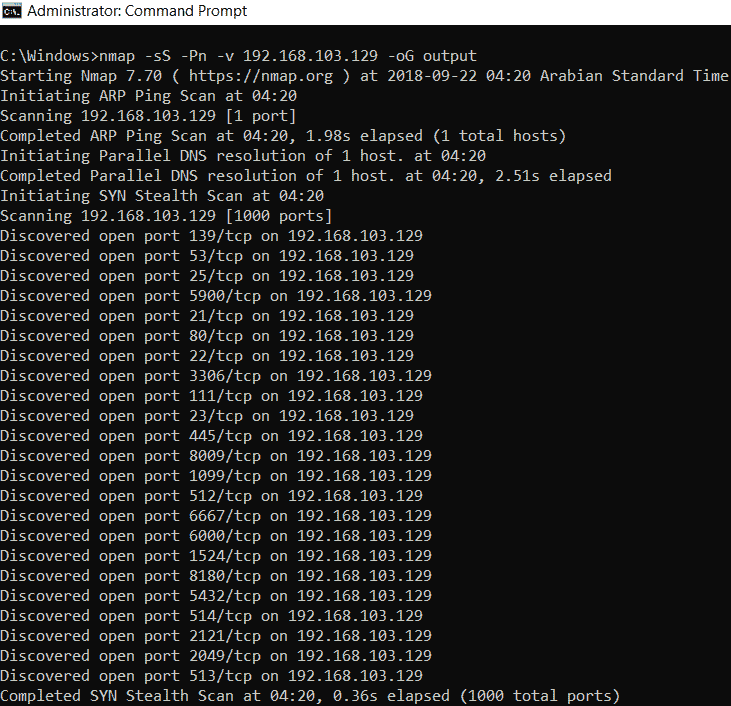

您可以导航到`Windows`文件夹以找到输出文件，并使用文本编辑工具将其打开：

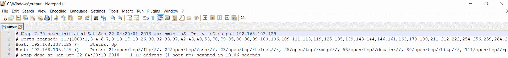

7.  在命令提示符中输入以下语法，以获取启用详细信息的所有格式的输出：

```
Nmap -sS -Pn 192.168.103.129 -v-oA  output
```

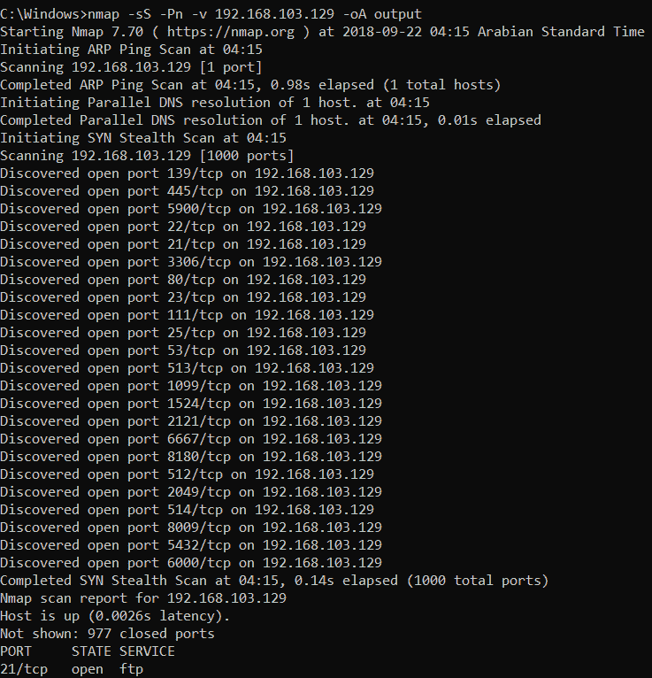

您可以导航到`Windows`文件夹以找到输出文件，并使用文本编辑工具将其打开：

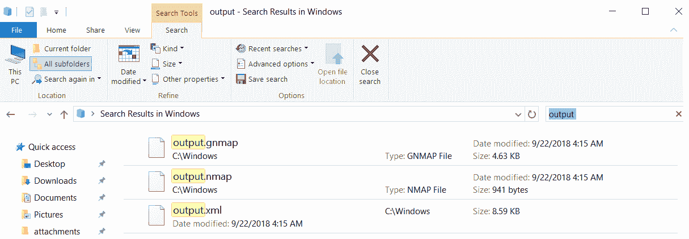

# 它是如何工作的。。。

这些不同的格式有助于用户将报告用于多种操作，并以不同的方式分析报告。端口扫描结果代表了侦察的关键阶段，这允许用户进一步规划漏洞扫描和检测活动。然后将这些报告上载到不同的工具和站点，以进行进一步分析和扫描。还值得一提的是，Nmap 是各种漏洞扫描软件的后台实用程序。生成这些报告后，这些工具将使用这些报告执行进一步的操作。

# 了解 Nessus 输出

Nessus 更像是一个与企业一致的工具。报告更加全面和方便用户。Nessus 提供基于文档和结构的报告。通过在扫描结果页面右上角的导出下拉列表中选择所需格式，可以导出这些报告：


这里，我们将介绍 Nessus 支持的报告格式。

# 内苏斯

此格式允许用户以`.nessus`格式导入结果。这是一种只能使用 Nessus 解析的格式。它允许用户下载扫描结果，然后将其导入 Nessus，以便执行任何类型的分析。

# HTML

Nessus 以 HTML 文件格式提供了一个很好的扫描报告说明，该文件是独立的，可以在任何浏览器中打开以查看结果。此报告还允许在不同部分之间导航，以便用户可以轻松阅读大型报告。还可以自定义这些 HTML 报告以下载以下报告：

*   执行摘要报告：

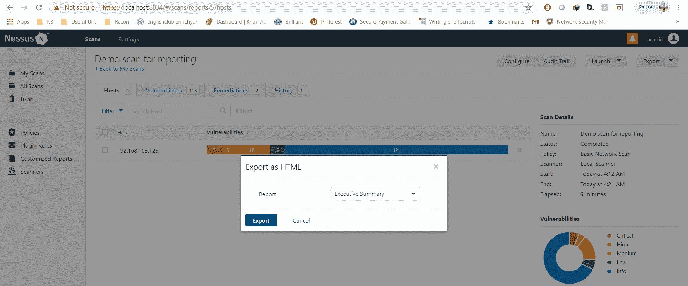

*   按主机分组的带有漏洞和补救措施的自定义报告
*   具有按插件分组的漏洞和补救措施的自定义报告

HTML 报告包含以下部分：

*   **目录**：按主机和建议列出漏洞所需的导航窗格。这些报告在复杂的报告中包含更多详细信息，如合规性审计：


*   **主机漏洞**：本节由主机实际漏洞组成。这遵循每台主机报告所有漏洞，然后转移到下一台主机的格式。这进一步从每个主机的漏洞数量及其风险评级的简单摘要开始。包括**开始时间**和**结束时间**等**扫描信息**以及**主机信息**：


每个漏洞由以下部分组成，其详细信息已在[第 5 章](05.html)、*配置审核*中描述：

*   插件 ID
*   提要
*   描述
*   解决方案
*   风险因素
*   工具书类
*   插件信息和输出：


# CSV

CSV 是一种用于在表中存储数据的简单格式，以后可以将数据导入数据库和应用程序（如 Excel）。这允许用户将报告导出到`.csv`文件中，该文件可以使用 Excel 等工具打开。以下是 CSV 报告示例的屏幕截图：

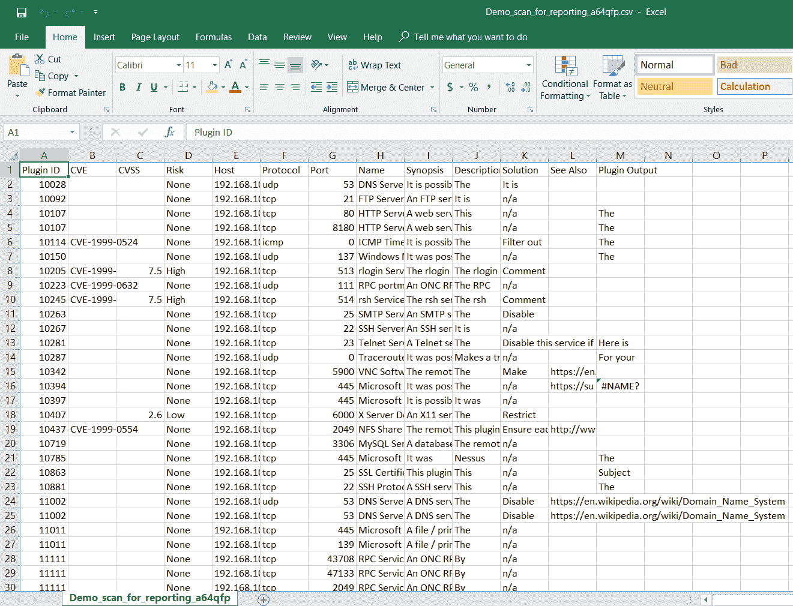

它包含与 HTML 格式类似的部分。

# 内苏斯 DB

这是 Nessus 专有的自定义数据库格式。它是一种加密格式，用于存储扫描的详细信息：


它需要在每次导入 Nessus 时创建并使用密码。

# 准备

要执行此活动，您必须在计算机上满足以下先决条件：

1.  你必须安装 Nessus。
2.  您必须具有对要在其上执行扫描的主机的网络访问权限。

要安装 Nesus，您可以按照[第 2 章](02.html)、*了解网络扫描工具*中提供的说明进行操作。这将允许您下载 Nessus 的兼容版本并安装所有必需的插件。要检查您的机器是否安装了 Nessus，请打开搜索栏并搜索`Nessus Web Client`。找到并单击后，将在默认浏览器窗口中打开：

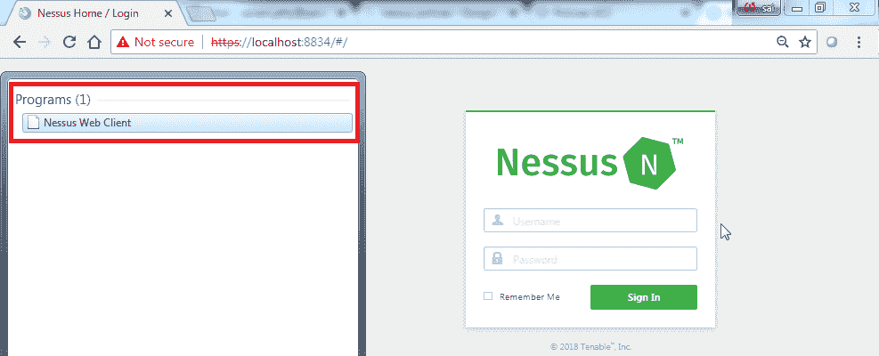

如果您确定 Nessus 已正确安装，您可以直接从浏览器使用`https://localhost:8834`URL 打开 Nessus Web 客户端。如果您无法找到**Nessus Web 客户端**，则应删除并重新安装 Nessus。Nessus 的拆卸和安装说明参见[第 2 章](02.html)、*了解网络扫描工具*。如果您找到了**Nessus Web 客户端**并且无法在浏览器窗口中打开它，则需要检查 Nessus 服务是否正在 Windows 服务实用程序中运行：


您可以根据需要使用服务实用程序进一步启动和停止 Nessus。为了使用命令行界面进一步确认安装，您可以导航到安装目录以查看和访问 Nessus 的命令行实用程序：


始终建议具有管理员级别或根级别的凭据，以便扫描仪能够访问所有系统文件。与未经认证的扫描相比，这将允许扫描仪执行更深入的扫描并填充更好的结果，因为如果没有适当的权限，系统将无法访问所有文件和文件夹。政策合规模块仅在 Nessus 的付费版本中可用，如 Nessus Professional 或 Nessus Manager。为此，您必须从 tenable 购买激活密钥，并在设置页面中进行更新，如以下屏幕截图所示：


单击编辑按钮打开一个窗口并输入新的激活码，您将从 tenable 购买该激活码：


为了测试扫描，我们需要安装一个虚拟机。为了运行虚拟机，我建议使用 VMware 的 30 天试用版，可以从[下载并安装 https://www.vmware.com/products/workstation-pro/workstation-pro-evaluation.html](https://www.vmware.com/products/workstation-pro/workstation-pro-evaluation.html) 。

对于测试系统，读者可以参考前面配方的*准备*部分下载 Metasploitable。

# 怎么做…

执行以下步骤：

1.  打开 Nessus web 客户端。
2.  使用安装期间创建的用户登录 Nessus 客户端。
3.  在虚拟机上执行简单的网络扫描并打开扫描结果：

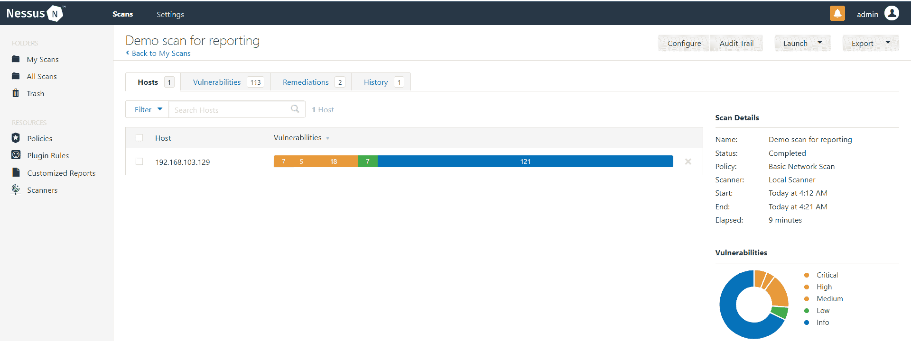

4.  导航至导出功能并选择 Nessus 格式以下载报告的`.nessus`版本：


5.  导航到导出功能并选择 Nessus 格式，通过选择所需选项下载报告的 HTML 版本：


6.  导航到导出功能并选择 Nessus 格式以下载报告的 CSV 版本：

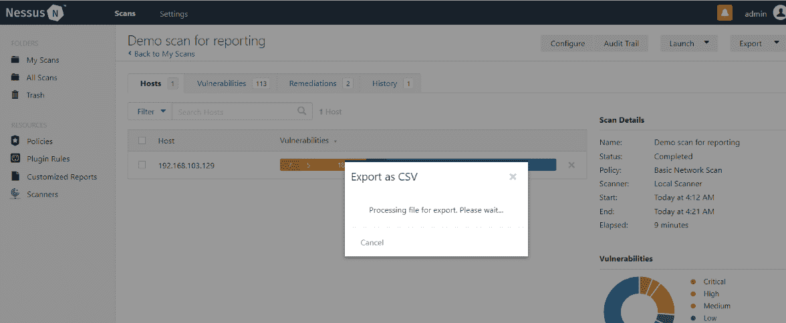

7.  导航到导出功能并选择 Nessus 格式以下载报告的 Nessus DB 版本：

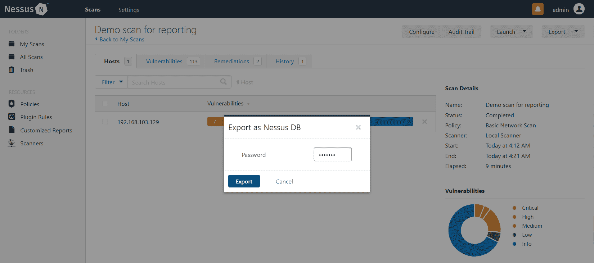

输入所需密码，点击**导出**下载扩展名为`.db`的 Nessus DB 文件。

# 它是如何工作的。。。

Nessus 支持的报告格式允许用户以多种方式呈现报告。如果用户希望以安全的方式存储扫描结果，他们可以使用加密的 DB 格式。如果用户希望直接共享报告，他们可以使用报告的 HTML 格式。为了进一步分析，他们可以使用 CSV 格式将报告结果导入工具或软件。如果用户需要与其他管理员共享扫描结果，他们可以使用`.nessus`格式，管理员可以将文件导入自己的 Nessus 并进行进一步分析。

对于 CSV 报告，如果有多个 CSV 报告，并且用户需要在 Windows 中合并所有报告，则可以从所有 CSV 文件所在的文件夹中打开命令提示符，并使用`copy *.csv <name of the new file>.csv`命令，从而获得合并的 CSV 单个文件。通过排序进一步过滤和删除重复项，可以创建线性报告。

# 如何使用 Nmap 和其他工具确认 Nessus 漏洞

Nessus 报告的大多数漏洞都是基于签名和值的，Nessus 根据插件中的代码做出决定。需要使用手动技术（如 Nmap 脚本或特定于端口的开源工具）确认这些漏洞。这将允许管理团队将他们的努力投入到实际漏洞的缓解中，而不是误报。此外，Nessus 有时会报告已经应用了变通方法的漏洞，因为 Nessus 只检查插件中提到的条件，无法识别任何其他偏差。在本食谱中，我们将查看使用 Nmap 和其他开源工具验证 Nessus 报告的多个漏洞的集合。

为了创建此配方，我们将在 Metasploitable 2 易受攻击的虚拟机上执行演示基本网络扫描（请参阅*准备就绪*部分以下载此步骤）。扫描完成后，浏览结果将显示总共 7 个关键漏洞、5 个高漏洞、18 个中漏洞和 7 个低漏洞。在 Nessus 报告的漏洞中，我们将尝试手动确认以下漏洞：

*   **绑定外壳后门检测**：这是 Nessus 报告的一个关键风险漏洞。此漏洞指出远程主机上的端口允许网络上的任何用户在易受攻击的虚拟机上以 root 权限运行 shell。我们将使用 Windows Telnet 实用程序确认此漏洞：


*   **SSL 版本 2 和 3 协议检测**：这是 Nessus 报告的一个高风险漏洞。此漏洞与使用传统 SSL 协议（如 SSL 版本 2 和版本 3）有关，已知这些协议会导致多个漏洞。我们将使用 Nmap 脚本确认此漏洞：

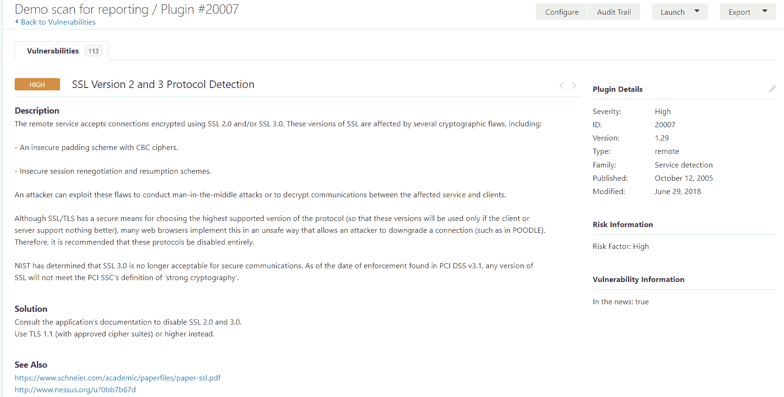

*   **Apache Tomcat 默认文件**：这是 Nessus 报告的中等风险漏洞。此漏洞涉及在安装 Apache 工具时创建的各种默认文件。在没有身份验证的情况下，网络上的任何用户都可以使用这些功能。我们将使用 web 浏览器（本例中为 Chrome）确认此漏洞。

# 准备

为了对此进行设置，您需要遵循并执行前面配方的*准备*部分中提到的所有步骤，*理解 Nmap 输出*和*理解 Nessus 输出*。

# 怎么做…

执行以下步骤：

1.  要确认绑定外壳后门检测，请在 Windows 中打开命令提示符，然后键入以下命令：

```
telnet 192.168.103.129 1524
```

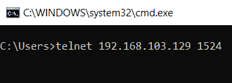

2.  执行后，用户直接登录到远程计算机，而不提供任何身份验证：


3.  为了确认用户的权限，我们将使用标准 Linux 命令`id`来确认漏洞：

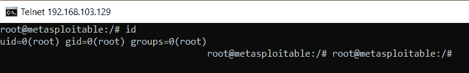

此命令将 UID 和 GID 显示为`0`，表示根用户，因此我们可以确认该漏洞是严重的，因为它允许任何远程用户在不进行任何身份验证的情况下登录到计算机。这意味着可以确认该漏洞。

4.  对于 SSL v2 和 SSL v3，我们可以通过 Nmap 使用 Poodle 确认脚本来识别运行的版本，因为只有 SSL v3 易受 Poodle 攻击。在命令提示符下打开 Nmap。
5.  输入以下命令以确定远程服务器是否容易受到 SSL Poodle 攻击：

```
Nmap -sV –script ssl-poodle -p 25 192.168.103.129
```

*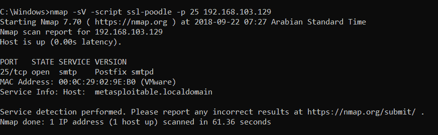*

由于 Nmap 没有显示任何结果，让我们检查一下`ssl-enum-ciphers`脚本：


即使是`enum-ciphers`脚本也没有返回任何结果，因此我们可以得出结论，Nmap 无法使用 SSL 密码与端口协商。因此，我们可以将该漏洞标记为假阳性。如果收到类似的响应，我们也可以通过在端口`25`上使用 Telnet 进行确认。这意味着端口`25`正在非 SSL 明文协议上运行，插件报告了相同的误报：


6.  要确认 Apache 默认文件，请访问 Nessus 在漏洞输出部分提到的 URL：

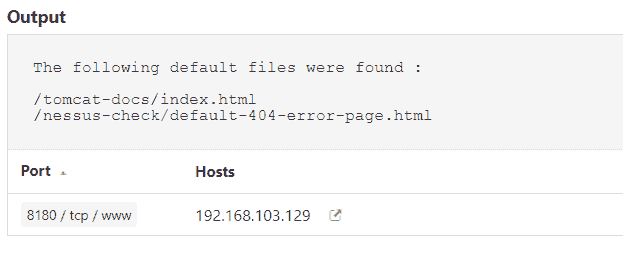

7.  打开浏览器，在地址栏中键入`http://192.168.103.129:8180/tomcat-docs/index.html`：


这将显示默认文档文件夹，确认服务器上是否存在默认文件。这表明可以确认该漏洞。

# 它是如何工作的。。。

可以根据这些漏洞的风险识别这些漏洞，然后对其进行确认，从而允许分析员对他们试图确认的漏洞进行优先排序。识别这些误报需要付出努力，因为您必须实际利用该漏洞并检查其是否可行。为了做到这一点，分析师必须决定他们愿意付出多大的努力来修复漏洞。例如，如果漏洞是运行 SQL 服务的端口`1406`对网络中的所有人开放，则由分析人员决定是检查开放的端口，还是尝试使用默认服务帐户或弱密码登录 SQL 服务。