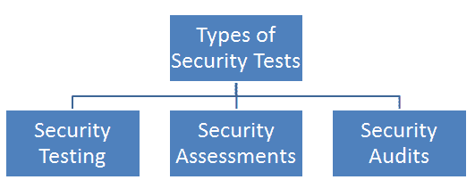

# 漏洞管理治理

今天的技术格局正在以极快的速度变化。几乎每天都有一些新技术被引进，并在短时间内普及。尽管大多数组织确实适应了快速变化的技术，但他们往往没有意识到随着新技术的使用，组织的威胁格局发生了变化。虽然组织的现有技术环境可能已经很脆弱，但新技术的引入可能会在技术环境中增加更多 IT 安全风险。

为了有效缓解所有风险，重要的是在整个组织内实施稳健的*漏洞管理计划*。本章将介绍一些基本的治理概念，这将有助于为实施脆弱性管理程序奠定坚实的基础。本章的学习要点如下：

*   安全基础
*   了解安全评估的必要性
*   列出漏洞管理的业务驱动因素
*   计算 ROI
*   设置上下文
*   制定和推出漏洞管理政策和程序
*   渗透测试标准
*   行业标准

# 安全基础

安全性是一个主观问题，设计安全控制常常具有挑战性。一个特定的资产可能需要更多的保护以保持数据的机密性，而另一个资产可能需要确保最大的完整性。在设计安全控制时，同样重要的是在控制的有效性和最终用户的易用性之间建立平衡。本节将介绍一些基本的安全性基础知识，然后在本书中进一步介绍更复杂的概念。

# 中情局三合会

**保密性**、**完整性**和**可用性**（通常称为**CIA**）是信息安全的三大关键原则。虽然有许多因素有助于确定系统的安全状态，但机密性、完整性和可用性是其中最突出的因素。从信息安全的角度来看，任何给定的资产都可以根据其所承载的机密性、完整性和可用性价值进行分类。本节从概念上强调了 CIA 的重要性，以及针对每个因素的实际例子和常见攻击。

# 保密性

*机密性*一词的字典含义是：保密或被保密或保密的状态。在信息安全的背景下，保密意味着保密或保密，防止任何未经授权的访问，这是信息安全的主要需求之一。以下是我们经常希望保密的一些信息示例：

*   密码
*   密码
*   信用卡号、到期日和 CVV
*   商业计划和蓝图
*   财务信息
*   社会保险号码
*   健康记录

对机密性的常见攻击包括：

*   **数据包嗅探**：这涉及到截取网络数据包，以便未经授权访问网络中流动的信息
*   **密码攻击**：包括密码猜测、暴力破解或字典攻击等
*   **端口扫描和 ping 扫描**：端口扫描和 ping 扫描用于识别给定网络中的活动主机，然后对活动主机执行一些基本指纹识别
*   **垃圾箱驱动**：这涉及到搜索和挖掘目标组织的垃圾箱，试图获取敏感信息
*   **肩部冲浪**：这是一个简单的动作，站在你身后的任何人都可以窥视你输入的密码
*   **社会工程**：社会工程是操纵人类行为以提取敏感信息的行为
*   **网络钓鱼和欺骗**：这包括向受害者发送虚假和欺骗性的电子邮件，伪造身份，并诱骗受害者泄露敏感信息
*   **窃听**：这类似于数据包嗅探，但更多的是与电话对话监控相关
*   **密钥记录**：这涉及到在受害者的系统上安装一个秘密程序，记录并发回受害者输入的所有密钥

# 诚实正直

信息安全背景下的完整性是指信息的质量，这意味着信息一旦生成，就不应被任何未经授权的实体篡改。例如，如果一个人使用网上银行向他的朋友发送*X*金额，而他的朋友在他的账户中准确地收到*X*金额，那么交易的完整性就被认为是完整的。如果交易在这段时间内被篡改，并且朋友收到*X+（n）*或*X-（n）*金额，则认为完整性在交易期间被篡改。

对完整性的常见攻击包括：

*   **腊肠攻击**：当一次攻击被分割或分解为多个小攻击以避免被发现时，称为腊肠攻击
*   **数据欺骗攻击**：这涉及在数据输入系统之前或期间对数据进行未经授权的修改
*   **信任关系攻击**：攻击者利用实体间的信任关系获取未经授权的访问
*   **中间人攻击**：攻击者将自己挂接到通信通道，拦截流量，篡改数据
*   **会话劫持**：利用中间人攻击，攻击者可以劫持实体之间已经建立的合法活动会话

# 可利用性

可用性原则规定，如果经授权的个人提出资源或信息的请求，该资源或信息应在没有任何中断的情况下可用。例如，一个人想使用网上银行工具下载他的银行账户对账单。由于某种原因，银行网站关闭，此人无法访问。在这种情况下，可用性受到影响，因为此人无法在银行网站上进行交易。从信息安全的角度来看，可用性与机密性和完整性同等重要。无论出于何种原因，如果请求的数据在规定时间内不可用，可能会造成严重的有形或无形影响。

对可用性的常见攻击包括：

*   **拒绝服务攻击**：在拒绝服务攻击中，攻击者向目标系统发送大量请求。请求数量如此之大，以至于目标系统没有能力响应它们。这将导致目标系统失败，来自所有其他合法用户的请求将被拒绝。

*   **SYN 洪水攻击**：这是一种拒绝服务攻击，攻击者向目标发送大量 SYN 请求，目的是使其无响应。
*   **分布式拒绝服务攻击**：这与拒绝服务攻击非常相似，区别在于用于攻击的系统数量。在这种类型的攻击中，攻击者使用成百上千的系统来淹没目标系统。
*   **电力攻击**：这类攻击涉及故意修改电力装置，目的是造成停电，从而导致目标系统瘫痪。
*   **服务器机房环境攻击**：服务器机房温度可控。任何有意干扰服务器机房环境的行为都可能导致关键服务器系统停机。
*   **自然灾害和事故**：包括地震、火山爆发、洪水等，或任何无意的人为错误。

# 识别

身份验证通常被认为是与系统交互的第一步。但是，身份验证之前是身份验证。受试者可以通过身份识别过程声称身份，从而启动责任**。**为了启动**认证、授权和责任**（**AAA**的过程，主体必须向系统**提供身份。**输入密码、刷 RFID 访问卡或给人一个手指印，是提供个人身份最常见和最简单的方法。在没有身份的情况下，系统无法将身份验证因素与主体关联起来。在确定受试者身份后，所有针对受试者采取的行动都将予以说明，包括信息系统根据身份而不是个人跟踪活动。计算机无法区分人与人。然而，计算机可以很好地区分用户帐户。它清楚地理解一个用户帐户与所有其他用户帐户不同。然而，仅仅声明一个身份并不意味着访问或授权。主体必须首先证明其身份，才能访问受控资源。这个过程称为识别。

# 认证

验证和测试所声称的身份是正确和有效的称为**认证过程**。为了进行身份验证，受试者必须提供与先前建立的身份完全相同的附加信息。密码是用于身份验证的最常见的机制类型之一

以下是经常用于身份验证的一些因素：

*   **你知道的东西**：*你知道的东西*因素是用于身份验证的最常见因素。例如，密码或简单的**个人识别号**（**PIN**）。然而，这也是最容易妥协的。
*   **您拥有的东西****ve**：您拥有的*东西*因素指的是智能卡或物理安全令牌等物品。
*   **你是什么**：*你是什么*因素指使用你的生物特征进行身份验证。例如，使用指纹或视网膜扫描进行身份验证。

标识和身份验证始终作为一个单一的两步过程一起使用。

提供身份是第一步，提供身份验证因素是第二步。如果两者都没有，主体就无法访问系统。就安全性而言，这两个元素都没有用处。

对身份验证的常见攻击包括：

*   **暴力**：暴力攻击包括尝试特定字符集的所有可能排列和组合，以获得正确的密码
*   **身份验证不足：**单因素身份验证和弱密码策略使应用程序和系统容易受到密码攻击
*   **弱密码恢复****验证**：包括密码恢复机制验证不足，如安全问题、OTP 等

# 批准

一旦主体成功通过身份验证，下一个逻辑步骤就是获得对所分配资源的授权访问

成功授权后，经过身份验证的标识可以请求访问对象，前提是它具有必要的权限和特权。

访问控制矩阵是用于评估和比较主体、对象和预期活动的最常用技术之一。如果主体被授权，则允许特定操作，如果主体未经授权，则拒绝特定操作。

重要的是要注意，被识别和认证的主体不一定被授予访问任何事物的权利和特权。访问权限是根据主体的角色和需要而授予的。标识和身份验证是访问控制的全部或全部方面。

下表显示了访问控制矩阵示例：

|  | **资源** |
| **用户** | **文件 1** | **文件 2** |
| 用户 1 | 阅读 | 写 |
| 用户 2 | - | 阅读 |
| 用户 3 | 写 | 写 |

从前面的访问控制矩阵示例中，我们可以得出以下结论：

*   用户 1 无法修改文件 1
*   用户 2 只能读取文件 2，但不能读取文件 1
*   用户 3 可以读取/写入文件 1 和文件 2

常见的授权攻击包括：

*   **授权爬行**：授权爬行是一个术语，用于描述用户有意或无意地获得了超出其实际需要的权限
*   **横向权限提升**：当用户能够绕过授权控制，并且能够获得层次结构中同级用户的权限时，会发生横向权限提升
*   **垂直权限提升**：当用户能够绕过授权控制，并且能够获得层次结构中更高级别用户的权限时，会发生垂直权限提升

# 审计

审计或监控是一个过程，通过该过程，可以跟踪和/或记录受试者的行为，以使受试者在系统上认证后对其行为负责。审核还可以帮助监视和检测系统上未经授权或异常的活动。审计包括捕获和保存主体及其对象的活动和/或事件，以及记录维护操作环境和安全机制的核心系统功能的活动和/或事件。

需要在审核日志中捕获的最小事件如下所示：

*   用户 ID
*   用户名
*   时间戳
*   事件类型（如调试、访问、安全）
*   活动详情
*   源标识符（如 IP 地址）

通过将系统事件捕获到日志中创建的审核跟踪可用于评估系统的运行状况和性能。如果发生系统故障，可以使用事件日志追溯根本原因。日志文件还可以提供用于重新创建事件历史记录、回溯入侵或系统故障的审核跟踪。大多数操作系统、应用程序和服务都具有某种本机或默认的审核功能，至少可以提供最低限度的事件。

对审核的常见攻击包括：

*   **日志篡改**：包括未经授权修改审计日志
*   **未经授权访问日志**：攻击者可以未经授权访问日志，目的是提取敏感信息
*   **通过审计日志拒绝服务**：攻击者可以发送大量垃圾请求，目的只是为了填充日志和随后的磁盘空间，从而导致拒绝服务攻击

# 会计

任何组织只有在保持良好的问责制的情况下才能成功实施其安全政策。保持问责制有助于让受试者对其所有行为负责。基于追踪和证明主体身份的能力，任何给定的系统都可以说是有效的问责系统。

各种机制，如审计、身份验证、授权和标识，有助于将人与他们执行的活动联系起来。

使用密码作为唯一的身份验证形式会产生很大的怀疑和妥协空间。有许多容易泄露密码的方法，这就是为什么它们被认为是最不安全的身份验证形式。当多个身份验证因素（如密码、智能卡和指纹扫描）相互结合使用时，身份盗窃或泄露的可能性大大降低。

# 不可否认

不可否认性是一种保证，即活动或事件的主体以后不能否认该事件的发生。不可否认性可防止主体声称未发送消息、未执行操作或未成为事件原因。

有助于实现不可抵赖性的各种控制措施如下：

*   数字证书
*   会话标识符
*   事务日志

例如，一个人可以向他的同事发送一封威胁性电子邮件，然后干脆否认他发送了这封电子邮件。这是一个否认的案例。然而，如果电子邮件被数字签名，此人就没有机会否认自己的行为。

# 脆弱性

简单地说，脆弱性只不过是系统中的一个弱点或防护措施/对策中的一个弱点。如果成功利用漏洞，可能会导致目标资产的损失或损坏。以下是一些常见的漏洞示例：

*   系统上设置的弱密码
*   在系统上运行的未打补丁的应用程序
*   缺少输入验证导致 XSS
*   缺少数据库验证导致 SQL 注入
*   防病毒签名未更新

漏洞可能存在于硬件和软件级别。感染恶意软件的 BIOS 是硬件漏洞的一个例子，而 SQL 注入是最常见的软件漏洞之一。

# 威胁

任何可能导致意外结果的活动或事件都可以被视为威胁。威胁是指可能有意或无意造成资产损坏、中断或完全损失的任何行为。

威胁的严重程度可以根据其影响来确定。威胁可能是故意的，也可能是意外的（由于人为错误）。它可以由人、组织、硬件、软件或自然诱发。一些常见的威胁事件如下：

*   病毒爆发的可能性
*   电涌或故障
*   火
*   地震
*   泛滥
*   关键金融交易中的打字错误

# 曝光

威胁代理可能会利用该漏洞造成资产损失。易受此类资产损失影响被称为**风险**。

暴露并不总是意味着威胁确实正在发生。这仅仅意味着，如果一个给定的系统易受攻击，并且有威胁可以利用它，那么就有可能发生潜在的暴露。

# 风险

风险是指威胁利用漏洞对资产造成损害的可能性。

可使用以下公式计算风险：

*风险=可能性*影响*

通过这个公式，很明显，可以通过减少威胁因素或减少脆弱性来降低风险。

当意识到风险时，威胁代理或威胁事件利用了漏洞，对一项或多项资产造成损害或泄露。安全的全部目的是通过消除漏洞、阻止威胁代理和威胁事件暴露资产来防止风险的实现。要使任何系统完全无风险是不可能的。然而，通过实施应对措施，可以根据组织的风险偏好将风险降低到可接受的水平。

# 保障措施

*保障措施*或*对策*是任何减轻或减少脆弱性的措施。保障措施是减轻或消除风险的唯一手段。重要的是要记住，保障、安全控制或对策可能并不总是涉及采购新产品；有效利用现有资源也有助于制定保障措施。

以下是一些保障措施的例子：

*   在所有系统上安装防病毒软件
*   安装网络防火墙
*   安装闭路电视及监察楼宇
*   部署保安
*   安装温度控制系统和火灾报警器

# 攻击向量

攻击向量只是攻击者可以获得对目标系统的访问的路径或手段。为了破坏系统，可能存在多个攻击向量。以下是攻击向量的一些示例：

*   攻击者利用应用程序中的 SQL 注入漏洞获得对数据库中敏感数据的访问
*   攻击者通过获得对数据库系统的物理访问来访问敏感数据
*   攻击者利用 SMB 漏洞在目标系统上部署恶意软件
*   攻击者通过对系统凭据**执行暴力攻击获得管理员级访问权限**

 **总结我们所学的术语，我们可以说资产受到威胁，这些威胁利用导致暴露的漏洞，这是一种可以使用安全措施来缓解的风险。

# 了解安全评估的必要性

许多组织在设计和实施各种安全控制方面投入了大量的时间和成本。有些甚至按照*纵深防御的原则部署多层控制。*当然需要实施强有力的安全控制；然而，同样重要的是测试部署的控件是否确实如预期的那样工作。

例如，一个组织可能会选择部署最新最好的防火墙来保护其周边环境。防火墙管理员不知何故误解了规则。所以不管防火墙有多好，如果配置不当，它仍然会允许坏流量进入。在这种情况下，彻底测试和/或审查防火墙规则将有助于识别和消除不需要的规则，并保留所需的规则。

每当开发一个新系统时，它都会严格而有力地进行**质量保证**（**质量保证**测试。这是为了确保新开发的系统按照业务需求和规范正确运行。在平行线路上，安全控制测试对于确保其按规定运行也至关重要。安全测试可以是不同的类型，如下一节所述。

# 安全测试的类型

安全测试可以根据上下文及其服务的目的以多种方式进行分类。下图显示了安全测试类型的高级分类：

# 安全测试

s*安全性测试*的主要目标是确保控件正常运行。这些测试可以是自动扫描、使用工具进行渗透测试以及手动尝试发现安全漏洞的组合。需要注意的是，安全测试不是一次性的活动，应该定期执行。在规划安全控制测试时，应考虑以下因素：

*   可用于安全测试的资源（硬件、软件和熟练人力）
*   受控制装置保护的系统和应用程序的临界等级
*   实施控制的机制发生技术故障的概率
*   控件的错误配置可能会危及安全性
*   技术环境中可能影响控制性能的任何其他变更、升级或修改
*   测试控件所需的难度和时间
*   测试对常规业务运营的影响

只有在确定这些因素后，才能设计和验证综合评估和测试策略。该策略可能包括由手动测试补充的定期自动测试。例如，电子商务平台可能每周进行一次自动漏洞扫描，扫描检测到新漏洞时会立即向管理员发出警报通知。自动扫描在配置和触发后需要管理员的干预，因此很容易进行频繁扫描。

安全团队可以选择由内部或外部顾问以固定费用进行手动渗透测试来补充自动扫描。安全测试可以每季度、每两年或每年进行一次，以优化成本和工作。

不幸的是，许多安全测试程序都是在随意和临时的基础上开始的，只是简单地将新奇的工具指向网络中可用的任何系统。测试计划应经过深思熟虑的设计，包括使用基于风险的方法对系统进行严格的常规测试。

当然，除非仔细审查结果，否则安全测试不能称为完整测试。一个工具可能会产生大量的误报，而这些误报只能通过手动检查来消除。手动审查安全测试报告也有助于确定目标环境中漏洞的严重性。

例如，自动扫描工具可以检测公共托管电子商务应用程序以及简单的帮助和支持 intranet 门户中的跨站点脚本。在这种情况下，尽管两个应用程序中的漏洞相同，但较早的应用程序具有更大的风险，因为它面对互联网，并且比后者拥有更多的用户。

# 脆弱性评估与渗透测试

脆弱性评估和渗透测试经常互换使用。然而，两者在服务的目的上是不同的。为了理解这两个术语之间的差异，让我们考虑一个真实世界的例子。

有一家银行位于城市的郊区，位于一个相当僻静的地区。有一伙强盗打算抢劫这家银行。强盗们开始计划如何执行他们的计划。他们中的一些人打扮成普通客户参观银行，并注意到一些事情：

*   这家银行只有一名手无寸铁的保安
*   这家银行有两个入口和三个出口
*   没有安装闭路电视摄像机
*   更衣室的门似乎很弱

根据这些发现，强盗们只是做了一个脆弱性评估。现在，这些漏洞是否能够在现实中被利用以成功实施抢劫计划，只有在它们实际抢劫银行时才会变得明显。如果他们抢劫银行并成功利用漏洞，他们就可以实现渗透测试。

因此，简而言之，检查系统是否易受攻击是脆弱性评估，而实际利用易受攻击的系统是渗透测试。一个组织可以根据他们的要求选择其中一个或两个。然而，值得注意的是，如果没有首先进行全面的漏洞评估，渗透测试就不可能成功。

# 安全评估

安全评估只不过是对系统、应用程序或其他测试环境的安全性的详细审查。在安全评估期间，经过培训的专业人员进行风险评估，以发现目标环境中可能允许妥协的潜在漏洞，并根据需要提出缓解建议。

与安全测试一样，安全评估通常也包括测试工具的使用，但不限于自动扫描和手动渗透测试。它们还包括对周围威胁环境、当前和未来可能的风险以及目标环境的资产价值的全面审查。

安全评估的主要输出通常是针对组织最高管理层的详细评估报告，并包含非技术语言的评估结果。它通常会给出精确的建议和建议，以临时改善目标环境的安全态势。

# 安全审计

安全审计通常采用安全评估期间遵循的许多类似技术，但需要由独立审计师执行。组织的内部安全人员执行例行安全测试和评估。但是，安全审计不同于此方法。安全评估和测试是组织内部的，旨在发现潜在的安全漏洞。

审计与评估类似，但旨在向相关第三方证明安全控制的有效性。审计确保在测试控制有效性时没有利益冲突。因此，审计倾向于对安全态势提供完全公正的看法。

安全评估报告和审计报告可能看起来相似；然而，它们都是针对不同的受众的。审计报告的受众主要包括高级管理层、董事会、政府当局和任何其他相关利益相关者。

审计主要有两种类型：

*   **内部审核**：组织的内部审核小组进行内部审核。内部审计报告面向组织的内部受众。确保内部审计团队有一条完全独立的报告线，以避免与他们评估的业务流程发生利益冲突。
*   **外部****审计**：外部审计由受信任的外部审计公司进行。外部审计具有更高的外部有效性，因为外部审计师实际上与被评估组织没有任何利益冲突。执行外部审计的公司很多，但大多数人认为所谓的*四大*审计公司信誉最高：
    *   安永
    *   德勤会计师事务所
    *   普华永道会计师事务所
    *   毕马威

大多数投资者、管理机构和监管机构普遍认为这些公司进行的审计是可以接受的。

# 漏洞管理的业务驱动因素

为了证明在实施任何控制方面的投资是合理的，业务驱动因素是绝对必要的。业务驱动程序定义了需要实现特定控件的原因。以下各节介绍了证明漏洞管理计划合理性的一些典型业务驱动因素。

# 法规遵从性

十多年来，几乎所有企业都高度依赖技术的使用。从金融机构到医疗机构，人们对数字系统的使用有很大的依赖性。这反过来又触发了行业监管机构提出组织需要遵守的强制性要求。不遵守监管机构规定的任何要求将招致巨额罚款和禁令。

以下是一些要求组织进行脆弱性评估的监管标准：

*   **萨班斯-奥克斯利法案**（**索克斯法案**）
*   **认证业务标准声明 16****SSAE 16/SOC 1**[https://www.ssae-16.com/soc-1/](https://www.ssae-16.com/soc-1/) ）
*   **服务机构控制**（**SOC**2/3
*   **支付卡行业数据安全标准**（**PCI DSS**
*   **健康保险可携带性和责任法案****HIPAA**
*   **格莱姆-利奇-布莱利合规性**（**GLBA**）
*   **联邦信息系统控制审计手册**（**FISCAM**

# 满足客户需求

今天的客户在技术服务提供商提供的服务方面变得更加挑剔。某个客户可能在世界某个地区运营，并且有特定的法规要求进行脆弱性评估。技术服务提供商可能位于另一个地理区域，但必须执行漏洞评估，以确保所服务的客户符合要求。因此，客户可以明确要求技术服务提供商进行漏洞评估。

# 对一些欺诈/事件的回应

全球各地的组织经常受到来自不同地点的各种攻击。其中一些攻击成功并对组织造成潜在损害。根据内部和/或外部欺诈/攻击的历史经验，组织可能会选择实施完整的漏洞管理计划。

例如，像火一样蔓延的 WannaCry 勒索软件利用了 Windows 系统 SMB 协议中的漏洞。此攻击一定触发了在许多受影响组织中实施漏洞管理程序。

# 获得竞争优势

让我们考虑一个场景，其中有两个技术供应商销售一个类似的电子商务平台。一家供应商有一个非常强大且有文档记录的漏洞管理程序，使其产品具有抵御常见攻击的固有弹性。第二个供应商有一个非常好的产品，但没有漏洞管理程序。明智的客户肯定会选择第一个供应商产品，因为该产品是按照强大的漏洞管理流程开发的。

# 保障/保护关键基础设施

这是之前所有业务驱动因素中最重要的。组织可以主动选择实施漏洞管理计划，而不管它是否必须遵守任何法规或满足任何客户需求。主动式方法在安全性方面比被动式方法更有效。

例如，一个组织可能拥有其客户的支付详细信息和个人信息，并且不希望将这些数据置于未经授权披露的风险中。正式的漏洞管理计划将有助于组织识别所有可能的风险，并实施控制措施以缓解风险。

# 计算 ROI

设计和实施安全控制通常被视为一种成本开销。向管理层证明实施某些安全控制的成本和努力往往具有挑战性。此时，可以考虑估算漏洞管理计划的投资回报。这可能是非常主观的，并且基于定性和定量分析。

虽然投资回报率的计算可能会因环境的复杂性而变得复杂，但让我们从一个简单的公式和示例开始：

*投资回报率（ROI）=（投资收益-投资成本）*100/投资成本*

为了简化理解，让我们考虑组织内有 10 个系统需要在漏洞管理程序的权限下。所有这 10 个系统都包含敏感业务数据，如果它们受到攻击，该组织可能会遭受 75000 美元的损失以及声誉损失。现在，该组织可以利用价值 25000 美元的资源设计、实施和监控漏洞管理计划。因此，投资回报率如下：

*投资回报率（ROI）=（75000-25000）*100/25000=200%*

在这种情况下，实施漏洞管理计划的 ROI 为 200%，这确实是高级管理层批准的一个很好的理由。

前面的示例是一个简化的示例，用于理解 ROI 概念。然而，实际上，在计算脆弱性管理程序的 ROI 时，组织可能需要考虑更多的因素，包括：

*   该计划的范围是什么？
*   设计、实施和监控该计划需要多少资源（人数）？
*   作为本计划的一部分，是否需要采购任何商业工具？
*   在项目的任何阶段，是否需要任何外部资源（合同资源）？
*   将项目完全外包给可信赖的第三方供应商是否可行且具有成本效益？

# 设置上下文

改变从来都不是容易和顺利的。组织内的任何类型的变更通常都需要广泛的计划、范围、预算和一系列批准。在一个以前没有安全经验的组织中实施完整的漏洞管理计划可能非常具有挑战性。许多业务部门都会对该计划的可持续性提出明显的抵制和问题。漏洞管理计划永远不会成功，除非它深深地融入到组织文化中。与任何其他重大变化一样，这可以使用两种不同的方法实现，如以下各节所述。

# 自下而上

自下而上的方法是基层工作人员采取行动实施新举措。就漏洞管理计划而言，自下而上方法中的行动流程类似于以下内容：

1.  系统管理员团队的初级团队成员发现其中一个系统中存在某些漏洞
2.  他向他的主管报告，并使用免费软件工具扫描其他系统是否存在类似的漏洞
3.  他整合所有发现的漏洞，并向其主管报告
4.  然后，主管向上级管理层报告漏洞
5.  高级管理层忙于其他活动，因此未能确定漏洞修复的优先级
6.  系统管理员团队的主管试图利用其有限的资源修复一些漏洞
7.  一组系统仍然很脆弱，因为没有人对修复它们感兴趣

在前面的场景中，我们可以注意到所有的活动都是非计划的和临时的。初级团队成员在没有高层管理人员的支持下，主动进行脆弱性评估。从长远来看，这种方法永远不会成功。

# 自上而下

与自下而上的方法不同，自上而下的方法由基层员工发起活动，自上而下的方法工作得更好，因为它是由最高管理层发起、指导和管理的。对于使用自上而下方法实施漏洞管理计划，操作流程如下所示：

1.  最高管理层决定实施漏洞管理计划
2.  管理层计算 ROI 并检查可行性
3.  然后，管理层为漏洞管理计划准备政策程序指南和标准
4.  管理层为项目的实施和监控分配预算和资源

5.  中层管理人员和基层员工随后遵循政策和程序实施该计划
6.  对计划进行监控，并与最高管理层共享指标

如前一场景所述，自上而下的漏洞管理计划实施方法具有更高的成功概率，因为它是由最高管理层发起和推动的。

# 政策与程序、标准与指南

从治理的角度来看，理解政策、程序、标准和指导方针之间的差异非常重要。请注意下图：

*   **政策**：政策始终是其他文件的顶点。政策是反映最高管理层意图和方向的高层声明。一旦发布，组织内的每个人都必须遵守该政策。策略的示例有 internet 使用策略、电子邮件策略等。

*   **标准**：标准只是可接受的质量水平。标准可作为实施政策的参考文件。标准的一个例子是 ISO27001。
*   **程序**：程序是完成特定任务需要遵循的一系列详细步骤。通常以**标准操作程序**（**SOP**的形式实施或引用。过程的一个示例是用户访问控制过程。
*   **指南：**指南包含额外的建议或非强制性的建议。它们是最佳做法，根据情况的不同，可以遵循也可以不遵循。准则的一个例子是 Windows 安全强化准则。

# 脆弱性评估政策模板

以下是一个漏洞评估策略模板示例，概述了策略级别漏洞评估的各个方面：

**<Company Name>** **Vulnerability Assessment Policy**

|  | 名称 | 标题 |
| 创建人 |  |  |
| 审核人 |  |  |
| 批准人 |  |  |

**概述**

**本节从高层次概述了漏洞管理的含义。**

 **脆弱性评估是确定和量化给定环境中安全漏洞的过程。它是对信息安全态势的评估，指出潜在的弱点，并在需要时提供适当的缓解程序，以消除这些弱点或将其降低到可接受的风险水平。

一般来说，脆弱性评估遵循以下步骤：

1.  创建系统中资产和资源的清单
2.  为资源分配可量化的价值和重要性

3.  识别每个已识别资源的安全漏洞或潜在威胁
4.  为最有价值的资源排定优先级，然后缓解或消除最严重的漏洞

**目的**

**本节旨在说明制定本政策的目的和意图。**

 **本政策的目的是提供进行安全审查的标准化方法。该政策还确定了演习过程中的角色和责任，直至确定的漏洞关闭。

**范围**

本节规定了政策适用的范围；它可以包括内部网、外部网，也可以只是组织基础设施的一部分。

可对**<公司名称>**范围内的任何资产、产品或服务进行漏洞评估。

**政策**

由**指定**授权的**团队**将负责脆弱性评估流程的开发、实施和执行。

**公司名称**网络内的所有网络资产将全面进行定期或连续的漏洞评估扫描。

将采用集中的脆弱性评估系统。使用任何其他工具扫描或验证漏洞必须得到**名称**的书面批准。

**公司名称**内的所有人员和业务单位应配合对其所属系统进行的任何漏洞评估。

**公司名称**内的所有人员和业务单位也应配合**团队**制定和实施补救计划。

**指定**可以指示聘请第三方安全公司对**公司**的关键资产进行漏洞评估。

**脆弱性评估流程**

本节提供了一个指向详细说明漏洞评估过程的外部程序文档的指针。

有关更多信息，请转至脆弱性评估流程。

**例外情况**

很有可能，出于某些正当理由，某些系统需要被排除在本政策的范围之外。本节说明从该策略获取异常时应遵循的流程。

本政策的任何例外情况，如免于脆弱性评估流程，必须通过安全例外流程批准。有关更多详细信息，请参阅安全例外策略。

**强制执行**

本节旨在强调违反本政策的影响。

任何被发现违反本政策的**公司名称**人员可能会受到纪律处分，包括终止雇佣和可能的法律行动。

**相关文件**

本节旨在提供组织内任何其他相关政策、程序或指南的参考。

本政策引用了以下文件：

*   脆弱性评估程序
*   安全例外策略

**修订历史**

| **日期** | **修订号** | **修订详情** | **由**修订 |
| 年月日 | 第 1 版 | 变更说明 | <name></name> |
| 年月日 | 第 2 版 | 变更说明 | <name></name> |

本节包含有关谁创建策略、时间戳和修订的详细信息。

**术语表**

本节包含整个政策中使用的所有关键术语的定义。

# 渗透测试标准

渗透测试不仅仅是一项活动，而是一个完整的过程。有几种标准概述了渗透试验期间应遵循的步骤。本节旨在介绍渗透测试的一般生命周期和一些行业公认的渗透测试标准。

# 渗透测试生命周期

渗透测试不仅仅是使用随机工具扫描目标的漏洞，而是一个涉及多个阶段的面向细节的过程。下图显示了渗透测试生命周期的各个阶段：

1.  **信息收集阶段**：信息收集阶段是渗透测试生命周期的第一个也是最重要的阶段。在我们探索目标系统上的漏洞之前，收集有关目标系统的信息至关重要。你收集的信息越多，成功渗透的可能性就越大。如果不正确了解目标系统，就不可能精确地定位漏洞。信息收集可分为两种类型：
    *   **被动信息采集**：被动信息采集时，不与目标建立直接联系。例如，有关目标的信息可以从公开来源获得，如搜索引擎。因此，不会与目标直接接触。
    *   **主动信息采集**：在主动信息采集中，为了探测信息，与目标建立直接联系。例如，检测网络中活动主机的 ping 扫描实际上会向每个目标主机发送数据包。
2.  **枚举：**一旦目标的基本信息可用，下一步是枚举更多细节信息。例如，在信息收集阶段，我们可能有一个网络中的实时 IP 列表。现在我们需要列举所有这些活动 IP，并可能获得以下信息：
    *   在目标 IP 上运行的操作系统
    *   在每个目标 IP 上运行的服务
    *   发现的服务的确切版本
    *   用户帐户
    *   文件共享，等等
3.  **获取访问**：一旦完成了信息收集和枚举，我们将有一个目标系统/网络的详细蓝图。根据这一蓝图，我们现在可以计划发动各种攻击，以破坏并访问目标系统。
4.  **权限提升：**我们可能会利用目标系统中的特定漏洞进行攻击，并获得对该漏洞的访问权限。但是，访问权限很可能受到权限的限制。我们可能需要具有完全的管理员/根级别访问权限。可以使用各种权限提升技术将访问权限从普通用户提升到管理员/root 用户。

5.  **维护访问**：到目前为止，我们可能已经获得了对目标系统的高权限访问。然而，这种访问可能只会持续一段时间，一段特定的时期。我们不希望再次重复所有的努力，以防我们希望获得对目标系统的相同访问。因此，使用各种技术，我们可以持久地访问受损系统。
6.  **覆盖轨道**：在完成所有渗透并记录之后，我们可能希望清除轨道和痕迹，包括妥协中使用的工具和后门。根据渗透测试协议，该阶段可能需要，也可能不需要。

# 行业标准

当涉及到安全控制的实施时，我们可以使用几个定义良好且经验证的行业标准。这些标准和框架提供了一个基线，可以根据组织的具体需要进行调整。以下部分将讨论一些行业标准。

# 开放式 Web 应用程序安全项目测试指南

**OWASP**是**开放式 Web 应用安全项目**的缩写。它是一个社区项目，经常从意识的角度发布前十大应用程序风险。该项目为整个 SDLC 的各个阶段集成安全奠定了坚实的基础。

OWASP Top 10 项目主要通过评估顶级攻击向量和安全弱点及其与技术和业务影响的关系来评估应用程序安全风险。OWASP 还提供了有关如何识别、验证和修复应用程序中每个漏洞的具体说明。

尽管 OWASP Top 10 项目只关注常见的应用程序漏洞，但它确实专门为开发人员和审核人员提供了额外的指南，以有效地管理 web 应用程序的安全性。这些指南可在以下位置找到：

*   **最新测试指南**：[https://www.owasp.org/index.php/OWASP_Testing_Guide_v4_Table_of_Contents](https://www.owasp.org/index.php/OWASP_Testing_Guide_v4_Table_of_Contents)
*   **开发者指南**：[www.owasp.org/index.php/guide](http://www.owasp.org/index.php/Guide)
*   **安全代码审查指南**：[www.owasp.org/index.php/Category:owasp_code_review_Project](https://www.owasp.org/index.php/Category:OWASP_Code_Review_Project)

OWASP 前 10 名名单定期修订。最新的前十名名单可在以下网址找到：[https://www.owasp.org/index.php/Top_10_2017-Top_10](https://www.owasp.org/index.php/Top_10_2017-Top_10) 。

# 框架的好处

以下是 OWASP 的主要功能和优点：

*   当针对 OWASP 前 10 名测试应用程序时，它可以确保满足最低安全要求，并且应用程序能够抵御最常见的 web 攻击。
*   OWASP 社区开发了许多安全工具和实用程序，用于执行自动和手动应用程序测试。一些最有用的工具是 WebScarab、Wapiti、CSRF Tester、JBroFuzz 和 SQLiX。

*   OWASP 开发了一个测试指南，提供技术或供应商特定的测试指南；例如，Oracle 的测试方法不同于 MySQL。这有助于测试人员/审核员选择最适合的程序来测试目标系统。
*   它有助于在开发的所有阶段设计和实施安全控制，确保最终产品具有固有的安全性和健壮性。
*   OWASP 在业界具有广泛的知名度和接受度。OWASP 前 10 名还可以映射到其他 web 应用程序安全行业标准。

# 渗透测试执行标准

**渗透测试执行标准**（**PTES**）由渗透测试行业最聪明的头脑和权威的专家创建。它包括渗透测试的七个阶段，可用于在任何环境下执行有效的渗透测试。有关该方法的详细信息，请访问：[http://www.pentest-standard.org/index.php/Main_Page.](http://www.pentest-standard.org/index.php/Main_Page.)

本标准详述的渗透测试的七个阶段如下（来源：[www.pentest-standard.org](http://www.pentest-standard.org/index.php/Main_Page)：

1.  参与前互动
2.  情报收集
3.  威胁建模
4.  脆弱性分析
5.  剥削
6.  剥削后
7.  报告

PTES 网站上提供了这些阶段的详细信息，以及详细说明每个阶段所需步骤的特定思维导图。这允许定制 PTES 标准，以匹配正在测试的环境的测试要求。只需单击思维导图中的项目，就可以访问每个步骤的更多详细信息。

 **# 框架的好处

以下是 PTE 的主要特点和优势：

*   它是一个非常全面的渗透测试框架，涵盖渗透测试的技术和操作方面，如范围扩展、报告和保护渗透测试人员的权益
*   它详细说明了如何执行准确测试环境安全态势所需的许多任务
*   它由每天执行这些任务的经验丰富的渗透测试专家为渗透测试人员组合而成
*   它包括最常见的技术以及不太常见的技术
*   它易于理解，并且可以很容易地适应安全测试的需要

# 总结

在本章中，我们熟悉了构建漏洞管理程序的一些绝对安全基础知识和一些基本治理概念。在下一章中，我们将学习如何设置用于执行漏洞评估的环境。

# 练习

*   探索如何计算安全控制的 ROI
*   熟悉 PTES 标准********