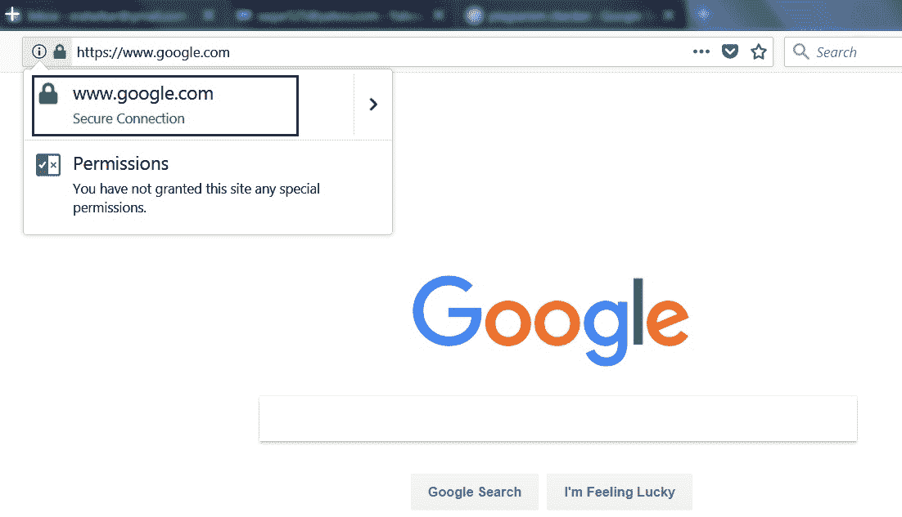
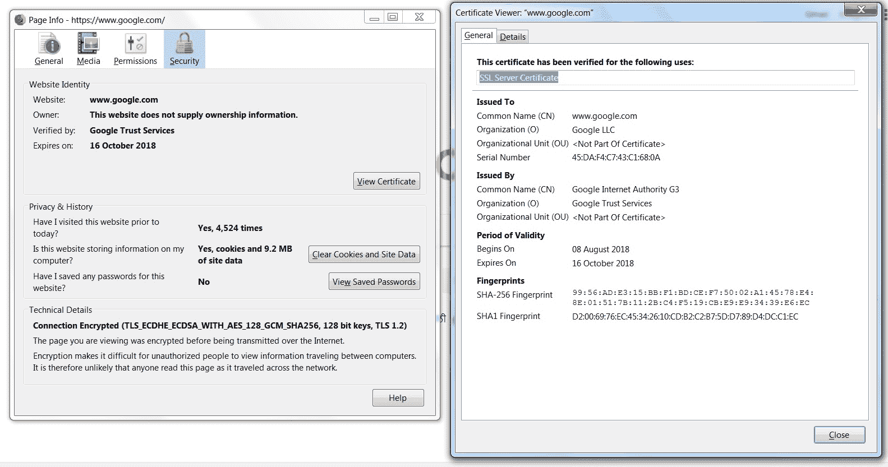
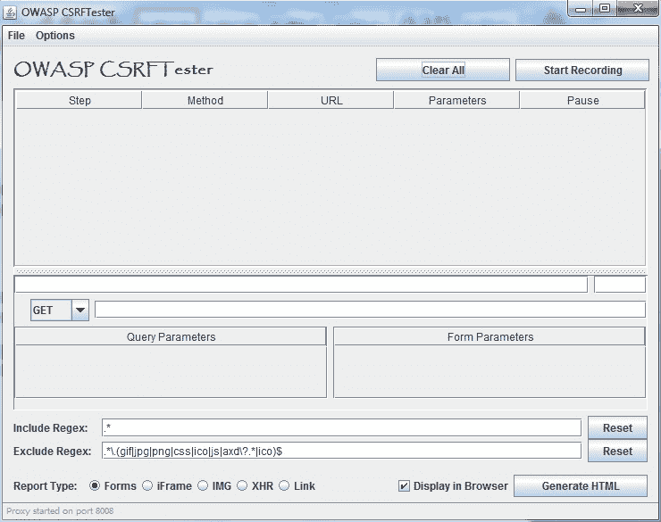
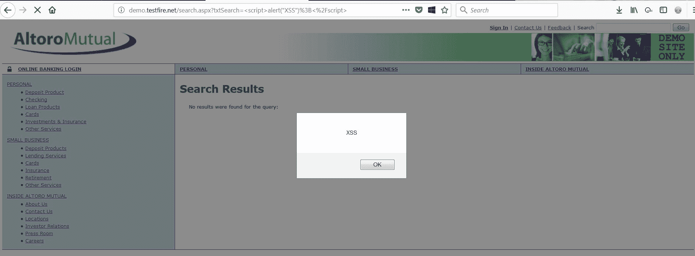
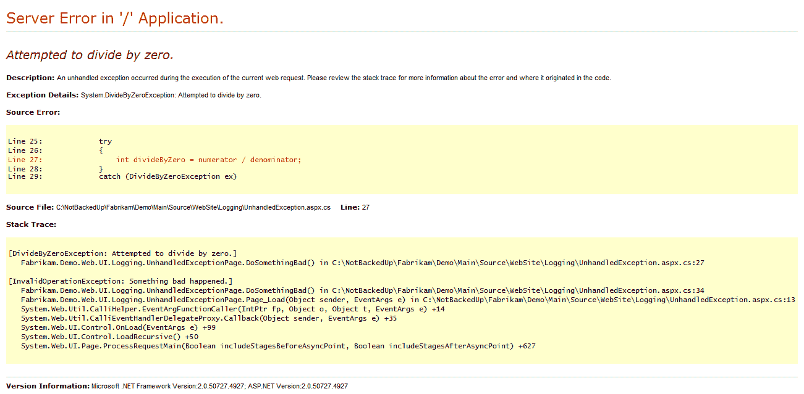
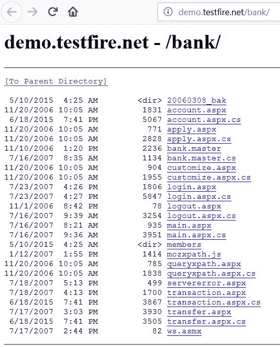
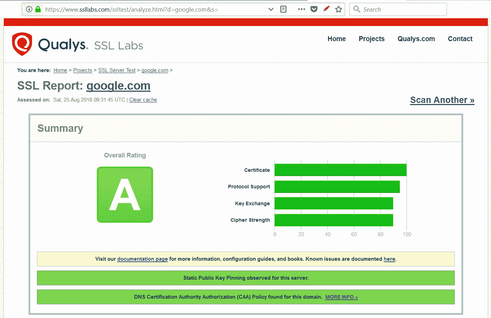
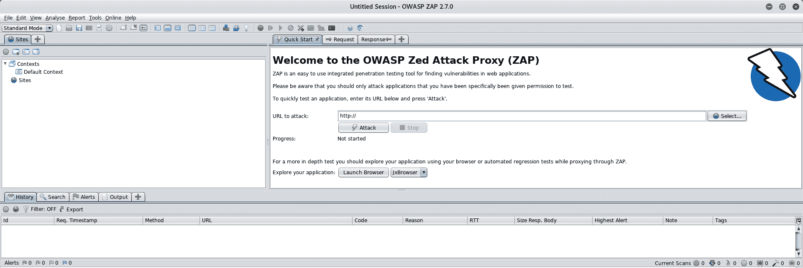
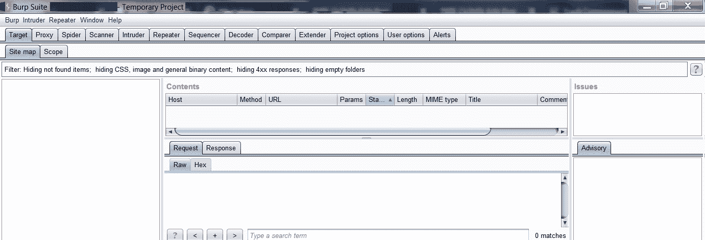

# 评估 Web 应用程序安全性

本章介绍 web 应用程序安全的各个方面。我们将获得从安全角度评估 web 应用程序的技能，并使用自动和手动技术发现潜在缺陷。

本章将介绍以下主题：

*   web 应用程序安全测试的重要性
*   应用程序评测
*   通用 web 应用程序安全测试工具
*   认证
*   批准
*   会话管理
*   输入验证
*   安全配置错误
*   业务逻辑缺陷
*   审计和记录
*   密码学
*   测试工具

# web 应用程序安全测试的重要性

很久以前，组织习惯于在厚客户机上部署和工作。然而，现在，随着我们更多地转向移动性和易访问性，瘦客户端（web 应用程序）的需求量越来越大。同一个 web 应用程序一旦托管，就可以通过多个端点（如 PC、智能手机、平板电脑等）进行访问。但这无疑增加了风险因素。即使 web 应用程序中存在一个漏洞，也会对整个组织造成毁灭性的影响。此外，随着网络和基础设施安全的发展，web 应用程序很容易成为入侵者在组织内部访问的目标。Web 应用程序安全测试不仅仅是运行自动扫描程序来发现漏洞。自动扫描仪不会考虑程序方面，也会报告许多误报。

# 应用程序评测

一个企业组织可能有大量为各种业务目的而设计和构建的应用程序。应用程序可能很小或很复杂，可以使用各种技术构建。现在，当需要设计和实施企业范围的应用程序安全程序时，决定评估的优先级就变得至关重要了。总共可能有 100 份申请；但是，由于资源有限，可能无法在特定时间内测试所有 100 个。这是应用程序分析变得方便的时候。

应用程序评测涉及将应用程序划分为不同的关键性组，如高、中、低。分类后，可以根据应用程序所属的组决定评估优先级。有助于对应用程序进行分类的一些因素如下：

*   应用程序的类型是什么（厚客户端、瘦客户端或移动应用程序）。
*   什么是访问模式（internet/intranet）。
*   谁是应用程序的用户？
*   大约有多少用户使用该应用程序？
*   应用程序是否包含任何业务敏感信息？
*   申请是否包含任何**个人身份信息**（**PII**）？
*   申请是否包含任何**非公开信息****NPI**？

*   是否有与应用程序相关的法规要求？
*   在应用程序不可用的情况下，应用程序用户可以维持多长时间？

以上问题的答案有助于对应用程序进行分类。应用程序分类还可以帮助有效地对漏洞进行评分。

# 通用 web 应用程序安全测试工具

有很多工具可用于执行 web 应用程序安全测试。其中一些是免费软件/开源软件，而另一些是商用软件。下表列出了一些可有效用于执行 web 应用程序安全测试的基本工具。这些工具中的大多数都是默认 Kali Linux 安装的一部分：

| **试验** | **所需工具** |
| 信息收集 | Nikto，web 开发者插件，Wappalyzer |
| 认证 | 扎普，打嗝套房 |
| 批准 | 扎普，打嗝套房 |
| 会话管理 | Burp 套件 web 开发者插件，OWASP CSRFTester，WebScarab |
| 输入验证 | XSSMe、SQLMe、Paros、IBM AppScan、SQLMap、Burp 套件 |
| 错误配置 | 尼克托人 |
| 业务逻辑 | 使用 ZAP 或 Burp 套件进行手动测试 |
| 审计和记录 | 人工评估 |
| 网络服务 | WSDigger，IBM AppScan web 服务扫描仪 |
| 加密 | 散列标识符，弱密码测试器 |

# 认证

认证是将某物（或某人）确定为真实或真实的行为。身份验证取决于一个或多个身份验证因素。测试身份验证模式意味着理解和可视化身份验证工作的整个过程，并使用该信息查找身份验证机制实现中的漏洞。破坏身份验证系统会让攻击者直接进入应用程序，使其进一步暴露于各种攻击中。

接下来的部分将介绍一些重要的身份验证测试。

# 安全通道上的凭据

这确实是一个非常基本的检查。应用程序必须严格通过安全的 HTTPS 协议传输用户凭据和所有敏感数据。如果应用程序使用 HTTP 传输用户凭据和数据，则容易被窃听。我们可以通过查看 URL 栏快速检查网站是否使用 HTTP 或 HTTPS，如以下屏幕截图所示：

此外，我们还可以检查证书详细信息，以确保 HTTPS 实现，如下图所示：

# 身份验证错误消息

通常，应用程序登录页面上的身份验证失败会显示不需要的信息。例如，用户输入了错误的用户名和密码，然后应用程序抛出一个错误，说找不到用户名。这将揭示给定用户是否属于该应用程序。攻击者只需编写一个脚本来检查 1000 个用户的有效性。这种类型的攻击称为用户枚举。因此，建议身份验证失败消息应为通用消息，并且不应显示用户名/密码是否错误。像*这样的通用消息*不一定能证明用户名是否属于应用程序。

# 密码策略

密码策略是与身份验证相关的一个微不足道的安全控制。密码通常容易受到字典攻击、暴力攻击和密码猜测攻击。如果应用程序允许设置弱密码，那么它们很容易受到攻击。强密码策略通常具有以下条件：

*   最小长度为 8
*   必须至少包含 1 个小写字符、1 个大写字符、1 个数字和 1 个特殊字符。
*   密码最低年龄
*   密码最长期限
*   密码历史记录限制
*   帐户锁定

需要注意的是，密码策略必须在客户端和服务器端都强制执行。

# 提交凭据的方法

GET 和 POST 是用于通过 HTTP/HTTPS 协议提交用户数据的两种方法。安全应用程序始终使用 POST 方法传输用户凭据和敏感用户数据。如果使用 GET 方法，则凭据/数据将成为公共可见 URL 的一部分，并且很容易受到攻击。

下图显示了典型的登录请求和响应，并突出显示了 POST 方法的使用：

# OWASP 映射

认证相关漏洞是 2017 年 OWASP 十大漏洞之一。它们包含在 A2:2017 认证中。该类别下列出的一些漏洞如下：

*   该应用程序允许自动攻击，如凭证填充
*   该应用程序允许暴力攻击
*   该应用程序允许用户设置默认密码、弱密码或已知密码
*   应用程序的密码恢复过程很弱

# 批准

一旦用户通过身份验证，下一个任务就是授权用户允许他/她访问数据。根据用户角色和权限，应用程序授予授权。为了测试授权漏洞，我们需要应用程序中存在的每个不同角色的有效凭据。使用一些初步的工具，我们可以尝试绕过授权模式，在使用普通用户的凭据时访问超级用户帐户。

# OWASP 映射

授权相关漏洞是 2017 年 OWASP 十大漏洞之一。他们在 A5:2017 的访问控制范围内。该类别下列出的一些漏洞如下：

*   通过篡改 URL 绕过访问控制检查
*   允许将主键更改为其他用户的记录，并允许查看或编辑其他用户的帐户
*   提升特权

# 会话管理

会话管理是任何基于 web 的应用程序的核心。它定义了应用程序如何维护状态，从而控制用户与站点的交互。会话在用户最初连接到站点时启动，并在用户断开连接时结束。由于 HTTP 是无状态协议，会话需要由应用程序显式处理。会话 ID 或 cookie 等唯一标识符通常用于跟踪用户会话。

# 饼干支票

由于 cookie 是存储用户会话信息的重要对象，因此必须对其进行安全配置。下图显示了具有其属性的示例 cookie：

在上图中，从安全角度来看，最后三个参数很重要。Expires 参数设置为在会话结束时，这意味着 cookie 不是持久性的，并且在用户注销后将被销毁。安全标志设置为否，这是一种风险。站点应该实现 HTTPS，然后启用安全 cookie 标志。HTTPOnly 标志设置为 Yes，以防止从其他站点对 cookie 进行未经授权的访问。

# 跨站点请求伪造

跨站点请求伪造是针对 web 应用程序的常见攻击，通常由于会话管理薄弱而发生。在 CSRF 攻击中，攻击者向受害者发送精心编制的链接。当受害者单击攻击者发送的链接时，会在易受攻击的应用程序中触发一些恶意操作。反 CSRF 或 CAPTCHA 是针对 CSRF 的一些常见防御措施。OWASP 有一个专用工具来测试应用程序是否易受 CSRF 攻击。可在[找到 https://www.owasp.org/index.php/File:CSRFTester-1.0.zip](https://www.owasp.org/index.php/File:CSRFTester-1.0.zip)。

OWASP CSRF 测试仪捕获应用程序请求，然后生成 CSRF 概念验证，如下图所示：

# OWASP 映射

会话管理相关漏洞是 2017 年 OWASP 十大漏洞之一。它们包含在 A2:2017 认证中。该类别下列出的一些漏洞如下：

*   生成会话 ID 的应用程序不是唯一的、随机的、复杂的，并且容易猜测
*   应用程序在 URL 或审核日志文件的一部分中公开会话标识符
*   应用程序易受重播攻击
*   应用程序易受跨站点请求伪造攻击

# 输入验证

输入验证不当是大多数 web 应用程序中最常见和固有的缺陷之一。

此弱点进一步导致 web 应用程序中存在许多关键漏洞，如跨站点脚本编写、SQL 注入、缓冲区溢出等。

大多数时候，当开发应用程序时，它盲目地接受所有数据。然而，从安全角度来看，这是一种有害的做法，因为由于缺乏适当的验证，恶意数据也可能进入。

# OWASP 映射

输入验证相关漏洞是 2017 年 OWASP 十大漏洞之一。它们包含在 A1:2017 注入、A4:2017-XML 外部实体（XXE）、A7:2017-Cross-Site Scripting（XSS）和 A8:2017-Unsecure 反序列化中。该类别下列出的一些漏洞如下：

*   应用程序未验证客户端和服务器端的输入。
*   允许有害黑名单字符的应用程序（<>；“！（））。
*   应用程序易受注入缺陷的影响，如 SQL 注入、命令注入、LDAP（轻量级目录访问协议）注入等。
*   应用程序易受跨站点脚本攻击。下图显示了反映的跨站点脚本攻击：

*   应用程序易受缓冲区溢出的影响。

# 安全配置错误

为了确保应用程序的安全，我们可能会付出很多努力。但是，应用程序不能孤立地工作。运行应用程序需要很多支持组件，如 web 服务器、数据库服务器等。如果应用程序没有安全地配置所有这些支持组件，许多漏洞将为潜在的攻击者打开。因此，应用程序不仅应该安全地开发，还应该安全地部署和配置。

# OWASP 映射

与安全配置错误相关的漏洞是 2017 年 OWASP 十大漏洞之一。它们包含在 A6:2017 安全配置错误中。该类别下列出的一些漏洞如下：

*   未在应用程序堆栈上执行安全强化。
*   启用或安装了不必要或不需要的功能（例如，端口、服务、管理页面、帐户或权限）。下图显示了所有用户都可以访问的默认 Tomcat 页面：

*   应用程序默认帐户使用默认密码处于活动状态。
*   错误处理不当会显示堆栈跟踪和内部应用程序信息，如下图所示：

*   应用程序服务器、应用程序框架（例如 Struts、Spring、ASP.NET）、库、数据库等的配置不安全。
*   应用程序允许目录列表，如下图所示：

Nikto 是扫描安全配置错误问题的优秀工具，如下图所示：

# 业务逻辑缺陷

业务逻辑是应用程序的核心，决定应用程序的预期行为。业务逻辑主要来源于应用程序的目标/目的，主要包含在应用程序的服务器端代码中。如果业务逻辑有一些缺陷或缺点，攻击者可能会严重误用这些缺陷或缺点。自动安全扫描程序不能真正找到与业务逻辑相关的问题，因为它们不能像人类那样理解应用程序的上下文。因此，构建安全的 web 应用程序绝对需要万无一失的业务逻辑和严格的验证

# 测试业务逻辑缺陷

如前所述，无法使用自动化工具全面测试与业务逻辑相关的缺陷。以下是测试业务逻辑的一些准则：

*   与应用程序架构师、应用程序的业务用户和开发人员进行头脑风暴会议，以了解应用程序的全部内容
*   了解应用程序中的所有工作流
*   记下应用程序中可能出错并产生较大影响的关键领域
*   创建样本/原始数据，并尝试以普通用户和攻击者的角度探索应用程序
*   开发用于测试特定业务逻辑的攻击场景和逻辑测试
*   创建一个全面的威胁模型

**业务逻辑缺陷示例**

考虑一个电子商务网站出售电视机顶盒的充值优惠券。它连接到外部支付网关。现在，用户在电子商务网站上选择充值金额，然后电子商务网站将用户转移到支付网关进行支付。如果支付成功，支付网关将向电子商务网站返回成功标志，然后电子商务网站将在系统中实际启动用户请求的充值。现在假设攻击者选择购买价值 X$的充值并进入支付网关，但在返回电子商务网站时，他篡改了 HTTP 请求并将充值设置为 X+10$。然后，在这种情况下，电子商务网站可能会接受该请求，认为用户实际支付了 X+10 美元而不是 X 美元。这是一个简单的业务逻辑缺陷，是由于电子商务网站和支付网关之间的不正确同步造成的。一个简单的校验和机制，用于两者之间的通信，可以防止这种缺陷

# 审计和记录

检查应用程序审核日志的完整性是应用程序安全评估最重要的程序方面之一。审计日志被归类为检测控制，在发生安全事件时很方便。企业应用程序通常性质复杂，并与其他几个系统（如数据库服务器、负载平衡器、缓存服务器等）互连。在发生违约的情况下，审计日志在重建事件场景中起着最重要的作用。细节不充分的审计日志将在更大程度上限制事件调查。因此，必须仔细检查应用程序生成事件日志的能力，以发现任何适用的缺陷。

# OWASP 映射

审计和记录相关漏洞是 2017 年 OWASP 十大漏洞之一。A10:2017 记录和监测不足涵盖了这些问题。该类别下列出的一些漏洞如下：

*   应用程序不会记录诸如登录、失败登录和高价值事务之类的事件
*   应用程序会生成警告和错误，但这些警告和错误并不充分
*   应用程序和 API 日志没有定期监控可疑活动
*   没有为应用程序日志定义备份策略
*   应用程序无法实时或近实时检测、升级或警告活动攻击

# 密码学

正如我们所知，加密有助于保持数据的机密性；它在 web 应用程序安全方面也起着重要作用。在构建安全的 web 应用程序时，必须同时考虑静止数据的*加密*和传输数据的*加密*。

# OWASP 映射

与加密相关的漏洞是 2017 年 OWASP 十大漏洞之一。它们属于 A3:2017 敏感数据披露。该类别下列出的一些漏洞如下：

*   以明文传输数据的应用程序。这涉及 HTTP、SMTP 和 FTP 等协议。
*   使用旧的或弱的加密算法的应用程序。
*   使用默认加密密钥的应用程序。
*   应用程序未强制加密。
*   应用程序在存储中未加密用户敏感信息。
*   使用无效 SSL 证书的应用程序。

Qualys 为测试 SSL 证书提供了一个优秀的在线工具。下图显示了 Qualys SSL 测试的样本结果，可在[访问 https://www.ssllabs.com/ssltest/](https://www.ssllabs.com/ssltest/) ：

网站提供的更多结果：

# 测试工具

在本章前面，我们已经看到了可以用于执行 web 应用程序安全测试的各种工具的列表。在本节中，我们将简要介绍两个这样的工具。

# OWASP ZAP

OWASP ZAP 是一个多功能工具，可以执行一系列与应用程序安全测试相关的任务。它还能够进行自动扫描，在手动测试和模糊化方面非常有效。OWASP ZAP 可从[下载 https://www.owasp.org/index.php/OWASP_Zed_Attack_Proxy_Project](https://www.owasp.org/index.php/OWASP_Zed_Attack_Proxy_Project) 。

下图显示了初始 OWASP ZAP 控制台。左侧窗格显示站点层次结构，右侧窗格显示单个请求和响应，底部窗格显示活动扫描：

我们可以首先抓取应用程序，或者直接输入 URL 进行攻击，如下图所示。我们可以在底部窗格中看到活动扫描，一旦扫描完成，我们只需单击“报告”菜单并选择“生成 HTML 报告”。

# Burp 套件教程

BurpSuite 是一个非常灵活和强大的工具，用于执行 web 应用程序安全测试。它可以免费下载，也有商业版。打嗝套件可从[下载 https://portswigger.net/burp/communitydownload](https://portswigger.net/burp/communitydownload) 。

下图显示了初始 Burp Suite 控制台：

Burpusuite 具有以下各种特性：

*   **代理**：作为拦截器代理，允许编辑所有应用程序请求。
*   **Spider**：它自动在范围内抓取应用程序，并创建应用程序层次结构以供进一步测试。
*   **扫描器**：对目标应用程序进行预定义的安全测试，生成漏洞报告。此功能仅在商业版中可用。
*   **入侵者**：此功能可有效用于模糊应用程序中的各种输入字段。
*   **中继器**：可多次发送特定请求并分析响应。
*   **解码器**：可以对 Base64 等各种格式的内容进行解码。
*   **扩展器**：可用于向 Burp 套件添加额外的扩展。

# 总结

在本章中，我们学习了 web 应用程序安全性的各个方面，将它们映射到 Burp 套件 OWASP Top 10，并简要介绍了可用于执行 web 应用程序安全测试的各种工具。