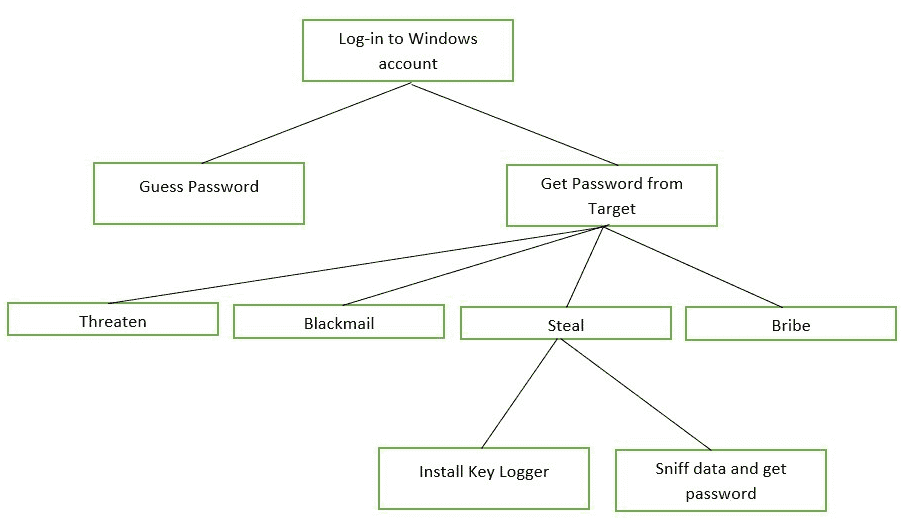
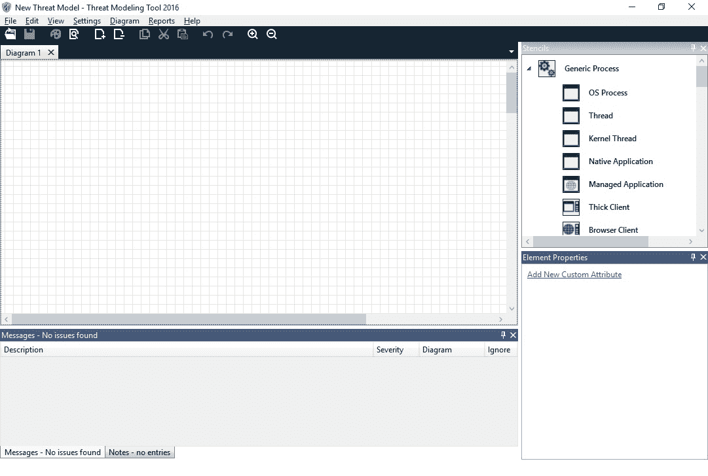
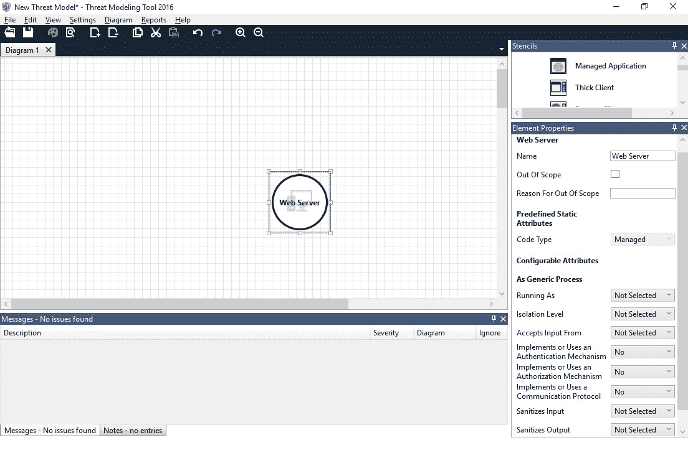
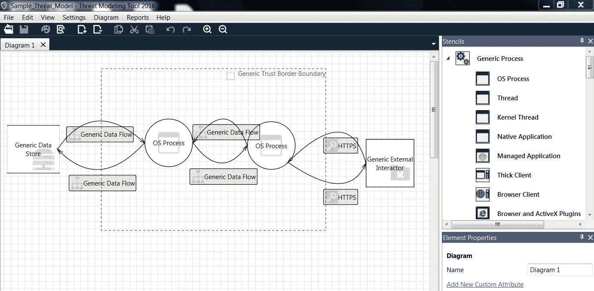
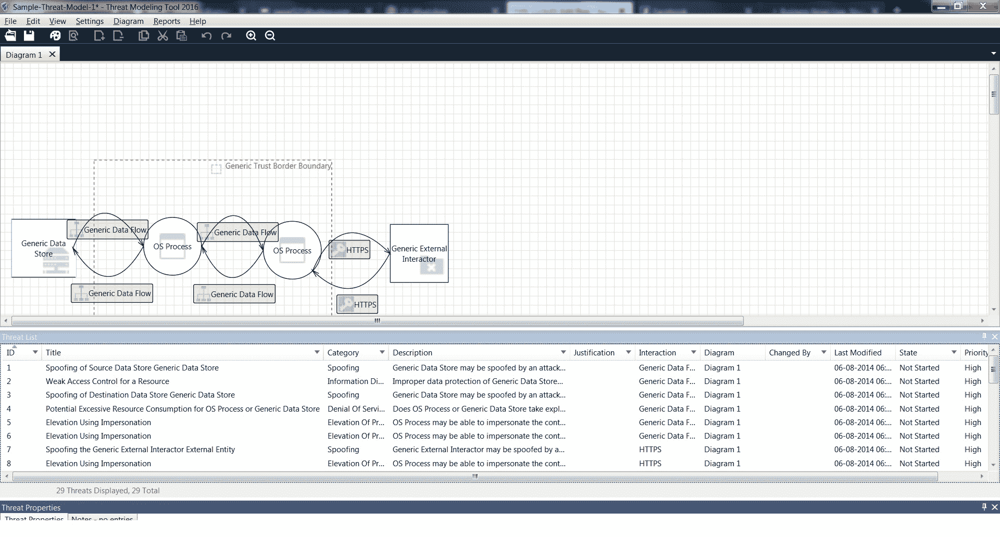
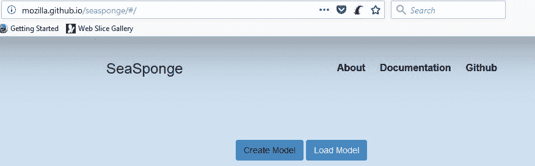
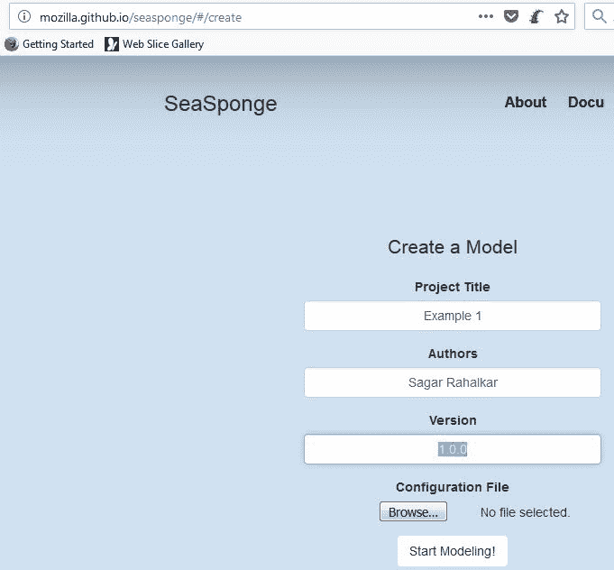

# 威胁建模

本章介绍如何理解和准备威胁模型。您将了解威胁建模的基本概念，并获得使用各种工具进行威胁建模的实用知识。

本章将介绍以下主题：

*   定义威胁建模
*   威胁建模的好处
*   威胁建模术语
*   执行威胁建模的分步程序
*   威胁建模技术——步幅、面食、恐惧
*   Microsoft 威胁建模工具和 Seascape

# 什么是威胁建模？

一开始，术语**威胁建模**听起来可能非常复杂和乏味。然而，一旦理解，这确实是一项简单的任务。在本章中，我们将通过适当的说明来简化威胁建模的概念。

让我们试着分解这两个词，威胁和模型。以下是这两个词的词典含义：

*   **威胁**：可能造成损害或危险的人或物
*   **模型**：以系统或事物为例进行效仿或模仿

现在，再把这两个词组合起来，它们的共同意思是什么？**威胁建模**只不过是识别潜在安全问题的正式方法。

让我们举一个非常简单的例子来理解这一点。

下图描绘了一座堡垒：

要塞是国王居住的地方，需要严格的安全措施来抵御敌人。因此，虽然建筑师会设计堡垒的结构，但他们也需要考虑各种可能威胁堡垒安全的威胁。

一旦架构师确定了可能的威胁，那么他们就可以通过各种可能的方法来减轻威胁。对堡垒的一些威胁可能是：

*   敌人从后方进攻，堡垒守卫不严
*   敌人向堡垒的墙壁发射炮弹
*   由于极端天气造成的堡垒墙壁腐蚀和磨损
*   敌象强行闯入要塞的大门

我们刚刚为一座古老的堡垒准备了一个威胁模型。很简单,；我们试图想尽一切可能的办法，有意或无意地破坏堡垒的安全。同样，在建造总统府或任何重要的行政办公室时，必须准备一个威胁模型。

从前面的示例中，我们可以理解，威胁建模是一个通用概念，可以应用于任何需要安全性的领域。由于本书涉及信息安全，我们将讨论如何为给定的信息系统准备威胁模型。

如果在开发生命周期的设计阶段进行，则威胁建模可能是最有效和有益的。在 SDLC 的后期阶段，修复 bug 的成本显著上升。

威胁建模在软件开发生命周期中非常常用。它使软件开发过程中的参与者能够高效地创建和交付安全软件，并对所有可能的安全缺陷都能理解和解释有更大的信心。

# 威胁建模的好处

对于任何给定的项目，了解可能阻碍总体进度的威胁总是有帮助的。威胁建模做了完全相同的事情。威胁建模的一些好处是：

*   威胁建模产生的软件本质上是安全的，如果威胁建模在设计阶段正确完成，那么最终产品将本质上是安全的，可以抵御最常见的潜在威胁。
*   威胁建模使我们能够以更结构化的方式思考和讨论产品安全性，而不是以特别的方式讨论安全威胁，威胁建模提供了一种更正式和结构化的方式来列举和记录安全威胁。
*   威胁建模允许开发团队在 SDLC 过程的早期有效地识别和定义安全缺陷。
*   威胁建模使我们能够记录和共享应用程序安全知识，技术升级速度很快，威胁形势也在快速变化。正在进行的威胁建模练习将有助于确保在设计缓解控制时考虑和预测最新的威胁
*   威胁建模从安全的角度提高了客户的信心-遵循的威胁建模过程的记录证据肯定会提高客户对所交付系统安全性的信心。
*   正在进行的威胁建模演习将有助于减少总体攻击面积。
*   威胁建模有助于量化安全控制，使其更符合安全预算。

# 威胁建模术语

在深入了解如何对威胁进行建模之前，我们必须熟悉在威胁建模过程中使用的一些常用术语。一些常用术语如下：

*   **资产****资产可以是任何有价值的资源。资产可以是有形的，也可以是无形的。例如，数据中心中的大型机可能是有形资产，而组织的声誉可能是无形资产。**
***   **攻击**：当参与者或威胁代理利用系统中的一个或多个漏洞采取行动时，就会发生攻击。例如，当有人利用跨站点脚本漏洞窃取用户 cookie 和会话 ID 时，可能会发生应用程序会话劫持攻击。*   攻击向量向量 T1：攻击向量是攻击者为了成功地破坏系统而采取的路径。例如，发送给受害者的恶意附件可能是一种可能的攻击向量。*   **攻击面：**攻击面基本上标出了在列举威胁时需要考虑的范围内组件。攻击面可以是逻辑的，也可以是物理的。*   **对策**：简单来说，对策有助于解决或缓解漏洞，从而降低攻击的可能性，从而降低威胁的影响。例如，安装防病毒软件将是解决病毒威胁的一种对策。*   **用例**：**用例是一种正常的功能情况，它是根据业务需求预期和预期的。例如，允许最终用户选择颜色的下拉菜单可能是应用程序的用例之一。*****   **滥用案例**：当用户（参与者）故意滥用功能用例以获得意外结果时，称为滥用案例。例如，攻击者可能会向最大长度为 20 的输入字段发送 1000 个字符。*   **行为人或威胁代理人**：**行为人或威胁代理人可能是使用或滥用案例的合法或不利使用者。例如，使用有效凭据登录应用程序的普通最终用户是参与者，而使用 SQL 注入登录应用程序的攻击者也是参与者（威胁代理）*****   **冲击**：简单来说，冲击是成功攻击后的伤害值。它可以是有形的，也可以是无形的。如果持有财务数据的系统被破坏，可能会影响收入，而如果公司网站被破坏，可能会影响声誉*   **攻击树**：攻击树直观地描绘了成功攻击或破坏目标的各种可用路径。下图显示了用于访问 Windows 系统的攻击树示例：******

 ****

*   **数据流图**：各种类型的图用于可视化系统各个组件之间的交互。虽然威胁建模图有不同的类型，但最常用的类型是**数据流图**（**DFD**）。DFD 用于显示应用程序的主要组件以及这些组件之间的信息流。DFD 还表示信任边界，显示了在应用程序中使用时值得信任的信息与需要额外注意的信息之间的分离。

# 如何对威胁进行建模？

威胁建模过程可能因多种因素而异。但是，一般来说，威胁建模过程可分为以下步骤：

1.  **安全目标识别**：在我们真正开始威胁建模之前，了解进行威胁建模练习背后的目标是绝对重要的。可能存在需要解决的某些合规性或监管要求。一旦了解了驱动因素，就可以更容易地想象过程中可能出现的威胁。

2.  **资产和外部因素/依赖性的识别**：除非我们确切知道我们要保护什么，否则无法列举威胁。识别资产有助于为进一步的建模过程奠定基础。资产需要受到攻击者的保护，并且可能需要优先考虑对策。还需要确定任何可能的外部实体或依赖关系，这些实体或依赖关系可能不是系统的直接组成部分，但仍可能对系统构成威胁。

3.  **信任区识别**：一旦资产和外部依赖项被识别，下一步就是识别所有的入口点和出口点以及信任区。这些信息可以有效地用于开发具有信任边界的数据流图。

4.  **识别潜在威胁和漏洞**：威胁建模技术，如 STERID（将在下一节中讨论），可以简要介绍影响给定系统的常见威胁。一些示例可能是 XSS、CSRF、SQL 注入、不正确的授权、损坏的身份验证和会话管理漏洞。然后需要识别和评估更容易发生风险的系统区域，例如，输入验证不足、异常处理不当、缺少审计日志等。

5.  **威胁模型文档**：威胁建模不是一次性活动；相反，这是一个迭代过程。在每次迭代之后对威胁进行全面的文档记录是非常重要的。文档可以为架构师在设计系统时需要考虑的可能威胁提供很好的参考，并允许他们考虑可能的对策。开发人员还可以在开发阶段参考威胁建模文档，以明确处理某些威胁场景。

# 威胁建模技术

有各种各样的威胁建模技术和方法。步履蹒跚和恐惧是其中的两种。我们将在以下几节中研究 STRIDE 和 Drear 方法。

# 大步走

STRIDE 是 Microsoft 开发的一种易于使用的威胁建模方法。STRIDE 有助于识别威胁，是以下术语的缩写：

*   **S-欺骗**：欺骗类别中的威胁包括制造和利用某人或某物身份混淆的对手。

例如，对手向假装是其他人的用户发送电子邮件。

*   **T-篡改**：篡改威胁涉及对手在存储或传输过程中修改数据。

例如，对手拦截网络数据包，更改支付信息，并将其转发给目标。

*   **R-拒绝**：拒绝包括对手执行某个动作，然后否认已经执行了该动作。

例如，对手向受害者发送威胁性电子邮件，但后来拒绝发送该电子邮件。

*   **I-信息披露**：信息披露威胁涉及对手未经授权获取机密信息。

例如，对手使用暴力攻击获取用户密码。

对手可以访问包含许多用户付款信息的数据库。

*   **D-拒绝服务**：拒绝服务威胁包括拒绝合法用户访问系统或组件。

例如，对手通过发送精心编制的 TCP 数据包导致 web 服务器崩溃，从而拒绝合法最终用户的访问。

*   **E-权限提升**：权限提升威胁涉及用户或组件能够访问未经授权的数据或程序。

例如，甚至没有获得读取权限的对手也可以修改文件。

拥有普通（非特权）帐户的对手能够执行管理员级任务。

上述威胁列表可应用于目标模型的组件。多个威胁可分为威胁类别，如下表所示：

| **恐惧类** | **威胁示例** |
| 欺骗 | 攻击者冒充管理员，向组织中的所有用户发送钓鱼邮件。 |
| 篡改 | 攻击者拦截并修改从应用程序发送到的数据。 |
| 否认 | 攻击者发送了一封威胁性电子邮件，随后又予以否认。 |
| 信息披露 | 攻击者正在访问包含纯文本用户凭据的数据库。 |
| 拒绝服务 | 攻击者从多个来源向单个目标发送大量数据包以使其瘫痪。 |
| 提升特权 | 攻击者利用易受攻击的组件升级权限。 |

# 恐惧

STERID 方法可用于识别威胁，而 DEARD 方法可有效评估威胁。恐惧是以下术语的缩写：

*   **D-潜在损害**：潜在损害因素定义了如果成功利用漏洞可能造成的潜在损害。
*   **R-再现性**：再现性因子定义了再现利用的容易程度或困难程度。某个漏洞可能很容易复制，而另一个漏洞可能由于多个依赖性而难以复制。
*   **E-可利用性**：可利用性因素定义了使利用成功所需的确切条件。这可能包括特定领域的知识，或使用特定工具的技能，等等。
*   **A-受影响用户**：受影响用户因素定义了如果攻击成功，将受到影响的用户数量。
*   **D-可发现性**：可发现性因素定义了发现所考虑威胁的难易程度。环境中的一些威胁可能很容易被注意到，而其他一些威胁可能必须使用其他技术来发现。

因此，跨越和恐惧可以结合使用，以产生一个有效和可操作的威胁模型。

# 威胁建模工具

虽然威胁建模可以用简单的笔和纸轻松完成，但有一些专用工具可以简化整个过程。我们将研究两种可以有效用于威胁建模的工具。

# Microsoft 威胁建模工具

最广泛使用的威胁建模工具是 Microsoft 威胁建模工具。所有人均可免费获取，可从[下载 https://www.microsoft.com/en-in/download/details.aspx?id=49168](https://www.microsoft.com/en-in/download/details.aspx?id=49168) 。

下载并安装后，初始屏幕如下所示：

单击 CreateanModel 开始设计新的威胁模型，如下面的屏幕截图所示。您将看到一个空白画布，以继续设计：

如下面的屏幕截图所示，右侧窗格包含所有必要的元素。您只需将所需的元素拖放到画布中，如以下屏幕截图所示：

添加并连接所有组件后，威胁模型应与以下屏幕截图所示类似：

要枚举给定威胁模型的威胁，请选择查看|分析视图。“分析”窗格提供与给定威胁模型对应的各种威胁的信息，如以下屏幕截图所示：

要生成威胁报告，请选择报告|创建完整报告，然后选择要保存的报告的
文件名和路径，如下图所示：

# 海棉

Seaspine 是另一个建模威胁的项目（这次由 Mozilla 完成）。您可以从[下载离线使用 https://github.com/mozilla/seasponge](https://github.com/mozilla/seasponge) 或者它还有一个在线版本来模拟移动中的威胁。在线版本位于[http://mozilla.github.io/seasponge](http://mozilla.github.io/seasponge) 。

下面的屏幕截图显示 Sea 海绵在线工具的第一个屏幕。我们可以通过单击“创建模型”开始创建新模型：

然后，该工具要求提供一些元数据，如项目标题、作者、版本等，如以下屏幕截图所示：

然后，该工具为我们提供了一个空白画布，左侧窗格为我们提供了添加组件的选项，如以下屏幕截图所示：

我们现在可以根据需要向我们的威胁模型添加不同的元素，如下图所示。

但是，与自动枚举可能威胁的 Microsoft 威胁建模工具不同，Sea 海绵要求用户手动枚举威胁并将其添加到模型中。

# 总结

在本章中，我们学习了威胁建模、威胁建模的好处及其术语。我们还学习了不同的威胁建模技术，如 STRIDE 和 DREAD，以及诸如 Microsoft 威胁建模工具和 Sea 海绵之类的工具。****