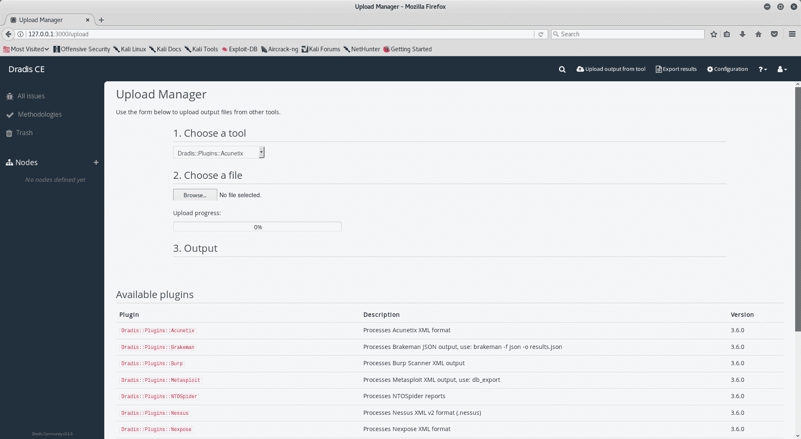
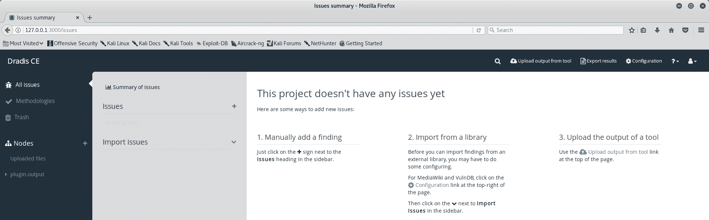
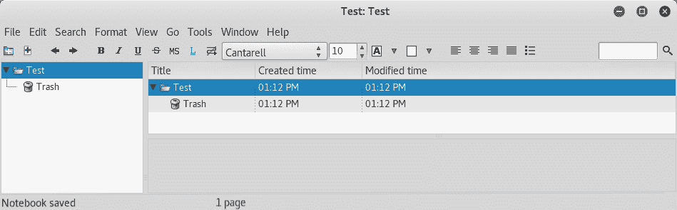
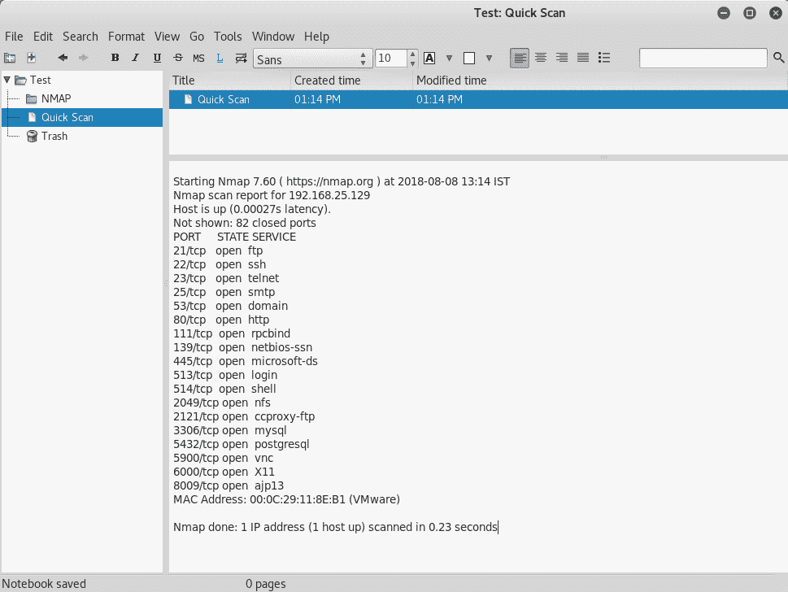
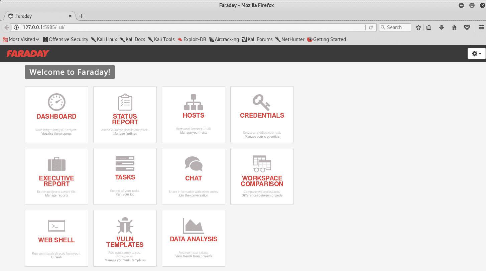

# 二十一、漏洞报告和指标

在本章中，我们将讨论报告漏洞对不同类型受众产生影响的相关性。我们还将探索围绕漏洞管理计划构建的各种指标。

本章将介绍以下主题：

*   报告的重要性
*   报告类型
*   报告工具
*   利用 Faraday v2.6 进行协同漏洞管理
*   韵律学

# 报告的重要性

漏洞评估和渗透测试是一个漫长的过程。他们需要大量的时间、努力和奉献才能完成。然而，除非评估结果以有意义的方式呈现，否则所花费的所有时间和精力都不会有任何用处。

通常，安全性被认为是一种开销。因此，组织中真正有兴趣了解安全评估结果的人数将会非常少。但是，必须以最清晰明了的方式呈现调查结果，使其看起来有趣，并可供组织内更广泛的受众采取行动。

从审计的角度来看，报告也是至关重要的。大多数组织每年都要接受某种形式的内部或外部审计。这些审计需要安全评估报告。因此，值得努力创建和维护评估报告。

# 报告类型

一件尺寸单一的衣服不可能适合所有人。同样，一份报告可能对整个组织的每个人都没有用处和意义。在任何给定的组织中，不同层级的人员可能有不同的兴趣领域。因此，在创建和发布任何报告之前，了解目标受众并对其进行分类非常重要。

# 执行报告

高级管理人员（主要是 CXO 级别的高级管理人员）特别感兴趣的是只获取组织中漏洞的高级摘要。执行报告是专门为此类高级受众编写的，通常包含发现的漏洞摘要。他们更关注关键和高严重性问题及其当前补救状态。执行报告包含大量人口统计数据，以快速描述组织的安全态势。

# 详细技术报告

专门为实际负责修复已识别漏洞的团队准备详细的技术报告。这些报告包含有关所发现漏洞的深入信息，包括以下内容：

*   漏洞描述
*   漏洞类别
*   CVE 详细信息（如有）
*   漏洞严重性
*   受影响的平台/应用组件
*   概念证明（如有）
*   对于 web 应用，完成请求和响应头
*   修复漏洞的建议
*   任何外部参考（如有）

这些技术细节有助于团队准确理解和修复漏洞。

# 报告工具

对于任何给定的漏洞评估或渗透测试，可以使用任何 word 编辑器手动创建报告。但是，随着评估数量的增加，手动创建和管理报告可能会比较困难。当我们执行安全评估时，我们可以同时使用一些专用工具跟踪我们的工作，然后轻松生成报告。以下部分介绍了一些可以帮助我们创建报告的工具，这些工具在默认的 Kali Linux 中是现成的。

# 德拉迪斯

Dradis 是一个优秀的报告框架，是默认 Kali Linux 安装的一部分。可以通过导航到应用|报告工具| dradis 来访问它。

初始屏幕提供配置 Dradis 设置的选项，包括登录凭据，如以下屏幕截图所示：

配置登录凭据后，您可以使用凭据登录，如以下屏幕截图所示：

登录后，最初的 Dradis 仪表板与下面的屏幕截图中所示的仪表板相似。它为导入报告、导出报告、添加问题和方法等提供了各种选项：

要开始使用 Dradis，您可以使用**上传管理器**从支持的工具导入扫描结果。Dradis 目前支持从以下工具导入报告：

*   刹车手
*   打嗝
*   变质岩
*   大蜘蛛
*   内苏斯
*   Nexpose
*   尼克托人
*   Nmap
*   OpenVAS
*   科力斯
*   扎普

以下屏幕截图显示了用于从外部工具导入扫描结果的 Dradis 上载管理器：

虽然 Dradis 提供从外部工具导入扫描结果，但它还提供手动添加问题的选项，如以下屏幕截图所示：

在手动或通过导入扫描结果添加所有问题后，我们现在可以使用 Dradis**导出管理器**生成合并报告，如以下屏幕截图所示：

# 基普诺特

KeepNote 是另一个简单但有用的报告工具，可以在默认的 Kali Linux 安装中使用。它可能不如 Dradis 先进，但它确实有助于将调查结果整合到一份报告中。

可以通过导航到应用|报告工具| keepnote 来访问它。

以下屏幕截图显示了 KeepNote 的初始屏幕：

KeepNote 使用起来确实非常简单，顶部有一个标准工具栏和窗格来管理数据。在左窗格中，您可以创建新文件夹/页面并创建层次结构，如以下屏幕截图所示：

一旦层次结构准备就绪并且所有必需的数据都在工具中，我们就可以将其导出为单个报告，如以下屏幕截图所示：

# 利用 Faraday v2.6 进行协同漏洞管理

法拉第是一个协作漏洞管理工具。法拉第允许多个渗透测试仪同时工作，并在一个地方收集测试数据，而不是单独工作。Faraday 是默认 Kali Linux 安装的一部分，可以通过导航到应用| Reporting Tools | Faraday IDE 来访问。

以下屏幕截图显示了**法拉第 IDE**启动服务后的初始仪表板：

法拉第还有一个命令行控制台，可用于启动扫描，如以下屏幕截图所示：

从法拉第控制台触发扫描后，结果开始反映在 web 仪表板中，如以下屏幕截图所示：

# 韵律学

一个组织可能有一个非常强大的漏洞管理计划。然而，必须有某种方法来衡量项目的进展、成功或失败。这就是指标派上用场的时候。指标是漏洞管理计划绩效的关键指标。组织领导层可以根据指标对战略和预算做出关键决策。指标还有助于展示组织的整体安全态势，并对需要优先解决的问题发出警报。

指标可以基于各种合规标准派生，也可以基于特定的组织需求进行完全定制。前面的部分描述了一些这样的指标及其相关性。可以按照组织策略的频率报告这些指标。当使用各种图表（如条形图、饼图、折线图等）显示时，这些度量可以得到最好的表示。

# 平均检测时间

尽快了解漏洞的存在总是一件好事。**平均检测时间**是一个度量标准，基本上衡量在整个组织中检测漏洞需要多长时间。理想情况下，最好将此度量值设置为最小值。例如，如果今天发布了一个心脏出血漏洞，那么确定整个组织中所有受影响的系统需要多长时间？该指标的数据可以按季度公布和比较，理想情况下，每个季度的值都小于前一个季度。

# 平均解决时间

虽然快速检测漏洞很重要，但快速修复或缓解已识别的漏洞也同样重要。漏洞打开的时间越长，攻击者可利用的漏洞就越多。**平均解决时间**是一个指标，该指标考虑了在识别任何给定漏洞后补救该漏洞所需的平均时间间隔。该指标的数据可以按季度公布和比较，理想情况下，每个季度的值都小于前一个季度。

# 扫描仪覆盖率

即使一个组织有一个强大的漏洞管理程序以及良好的扫描工具，了解是否所有资产都被扫描也是很重要的。**扫描仪覆盖率**指标衡量组织中所有已知资产与实际扫描资产的比率。资产可以是基础设施组件的形式，如操作系统、数据库等，也可以是应用代码块。该指标的数据可以按季度公布和比较，理想情况下，每个季度的值都大于前一个季度。

# 按资产组扫描频率

许多漏洞管理程序都是由一些法规遵从性需求派生和驱动的。虽然一些合规标准可能要求每年扫描资产，但其他标准甚至可能要求每季度扫描一次。此指标显示了各种资产组的扫描频率。

# 打开的关键/高漏洞数

并非每个漏洞都具有相同的严重性级别。漏洞通常分为各种类别，如严重、高、中、低和信息性漏洞。但是，需要优先采取严重程度高的关键措施。此指标提供了组织内所有开放关键和高漏洞的快速概览。这有助于管理层确定漏洞修复的优先级。该指标的数据可以按季度公布和比较，理想情况下，每个季度的值都小于前一个季度。

# 按业务部门、资产组等划分的平均风险

每个组织都由不同的业务部门组成。该指标强调了根据业务单位分类的平均风险。可能有一些业务部门的开放风险最小，而其他业务部门可能存在需要优先关注的多个开放风险。

# 批准的例外情况数量

虽然在使任何系统投入生产之前修复所有漏洞都是好的，但也会出现异常。业务始终是优先事项，信息安全必须始终与业务目标保持一致并提供支持。因此，可能会出现这样一种情况：由于某些紧急的业务优先级，系统在生产环境中运行，但存在安全异常。因此，跟踪这些异常情况并确保它们按照计划得到修复变得极其重要。**已授予的异常数量**指标有助于跟踪尚未修复和授予异常的漏洞数量。从审计的角度来看，跟踪这一指标很重要。该指标的数据可以按季度公布和比较，理想情况下，每个季度的值都小于前一个季度。

# 漏洞重新打开率

**漏洞重新打开率**指标有助于衡量补救过程的有效性。修复漏洞后，该漏洞不应在后续任何扫描中再次出现。如果即使在修复后仍再次发生，则表明修复过程失败。较高的漏洞重新打开率表明修补过程存在缺陷。该指标的数据可以按季度公布和比较，理想情况下，每个季度的值都小于前一个季度。

# 没有开放式高/严重漏洞的系统百分比

我们在本章前面已经看到了不同类型的报告。“执行报告”是指针对组织内对了解关键和高严重性漏洞的状态更感兴趣的高层管理人员编写的报告。

此指标表示已修复或缓解关键和高严重性漏洞的总系统百分比。这可以给组织的整体补救策略带来信心。

# 漏洞老龄化

组织中的典型漏洞管理策略定义了必须修复或缓解已识别漏洞的时间。理想情况下，必须严格遵守策略中规定的修复漏洞的时间段。但是，在漏洞缓解已超过到期日期的情况下，可能会出现例外情况。该指标试图识别跨越缓解到期日的漏洞。这些漏洞可能需要优先注意

# 总结

在本章中，我们了解了有效报告的重要性以及一些有用的报告工具。我们还概述了衡量漏洞管理计划成功与否的各种关键指标。

本章主要结束本课程。我们已经从绝对安全基础开始，建立评估环境，经历漏洞评估的各个阶段，然后涵盖一些重要的程序方面，如漏洞评分、威胁建模、修补、报告和度量。

感谢您参加本课程，并希望本课程能让您深入了解整个漏洞评估过程。