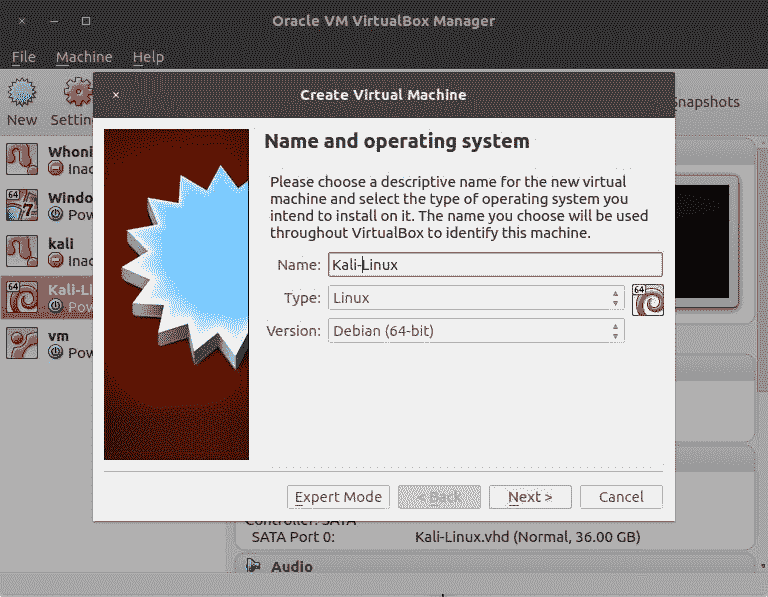
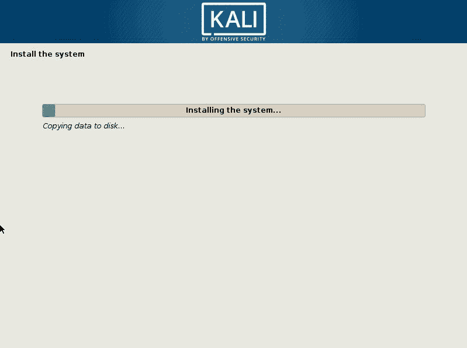
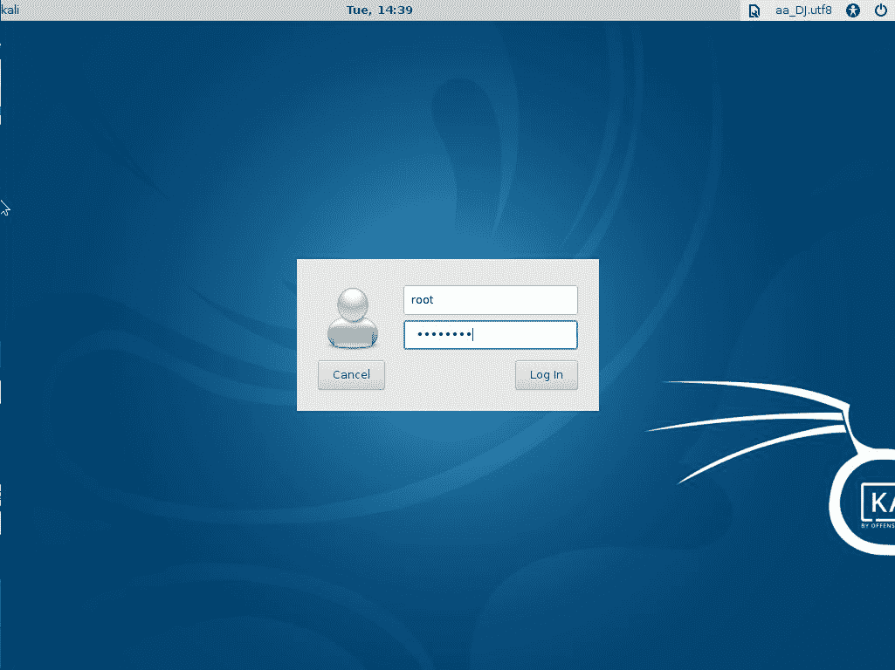
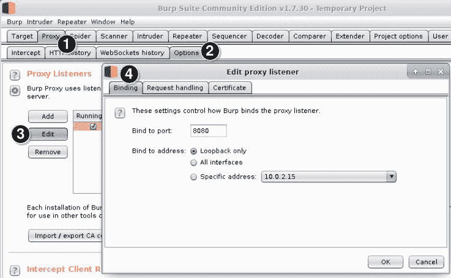
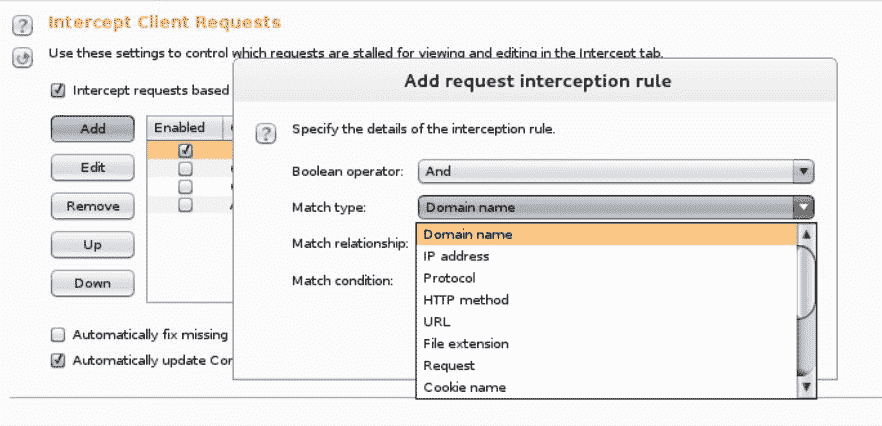
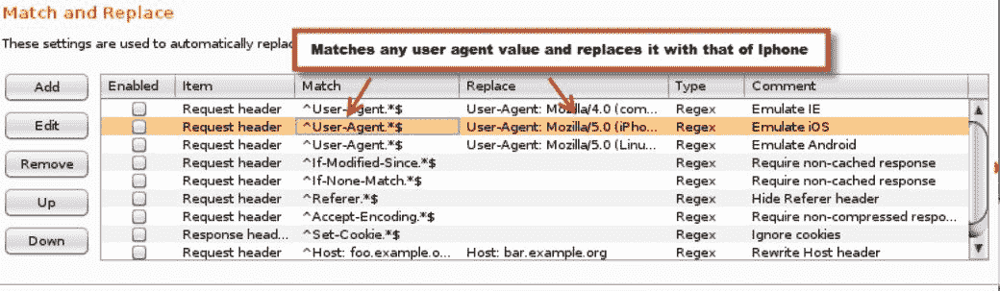
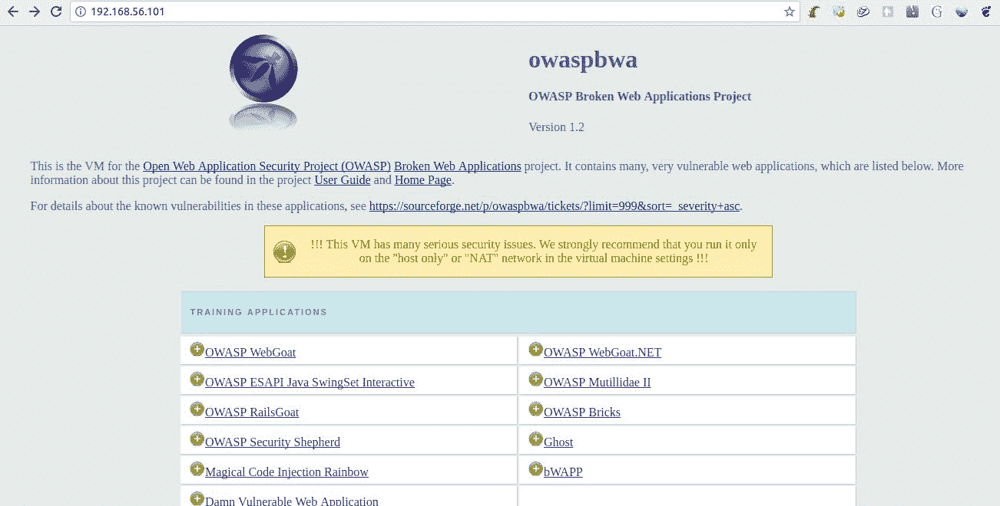

# 使用 Kali Linux 设置实验室

准备是一切的关键；在进行渗透测试项目时，它变得更加重要，因为在该项目中，您可以获得有限的时间进行侦察、扫描和利用。最终，您可以获得访问权限并向客户提供详细的报告。您进行的每个渗透测试的性质不同，可能需要与您之前进行的测试不同的方法。工具在渗透测试中起着重要作用。因此，您需要事先准备好工具箱，并拥有执行测试所需的所有工具的实际操作经验。

在本章中，我们将介绍以下主题：

*   Kali Linux 概述及对上一版本的更改
*   安装 Kali Linux 的不同方法
*   虚拟化与物理硬件上的安装
*   介绍和配置 Kali Linux 中的重要工具
*   易受攻击的 web 应用程序和虚拟机，用于建立测试实验室

# 卡利 Linux

Kali Linux 是基于 Debian 的以安全为中心的 Linux 发行版。这是著名的 Linux 发行版 BackTrack 的更名版本，它附带了大量用于网络、无线和 web 应用程序渗透测试的开源黑客工具库。尽管 Kali Linux 包含了大部分回溯工具，但 Kali Linux 的主要目标是使其可移植到基于 ARM 体系结构的设备上，如平板电脑和 Chromebook，这使得这些工具易于使用。

使用开源黑客工具有一个主要缺点，当安装在 Linux 上时，它们包含大量依赖项，并且需要按照预定义的顺序安装。此外，一些工具的作者没有发布准确的文档，这使我们的生活变得困难。

Kali Linux 简化了这个过程；它包含许多与所有依赖项一起预安装的工具，并且处于随时可用状态，因此您可以更加关注实际攻击，而不是简单地安装工具。Kali Linux 中安装的工具的更新会频繁发布，这有助于您保持工具的最新状态。一个预装了所有主要黑客工具以测试现实世界网络和应用程序的非商业性工具包是每一个道德黑客的梦想，Kali Linux 的作者尽一切努力让我们的生活变得轻松，这让我们花更多的时间寻找实际缺陷，而不是构建工具包。

# Kali-Linux 的最新改进

在 Black Hat USA 2015 上，Kali 2.0 发布了新的 4.0 内核。它基于 Debian Jessie，代号为 Kali Sana。Kali 的上一个主要版本是 1.0 版，定期更新到 1.1 版。Kali 2.0 中的一些变化是为了更好地访问和添加更新、更稳定的工具而对界面进行的修饰性更改。

以下列出了 Kali 2.0 中的一些主要改进：

*   **持续滚动更新**：2016 年 1 月，Kali Linux 的更新周期得到改善，转向滚动发布，2017 年 4 月进行了重大升级。滚动发布发行版是一个不断更新的发行版，以便在用户可用时向其提供最新的更新和软件包。现在，用户不必等待主要版本来修复 bug。在 Kali 2.0 中，在 Debian 测试发行版发布包时，会定期从中提取包。这有助于保持 Kali 核心操作系统的更新。
*   **频繁的工具更新**：维护 Kali Linux 发行版的组织“攻击性安全”设计了一种不同的方法来检查更新的工具。他们现在使用一个新的上游版本来检查系统，当发布新版本的工具时，系统会定期发送更新。使用这种方法，开发人员一发布 Kali Linux 中的工具，就会立即对其进行更新。
*   **改进的桌面环境**：Kali Linux 现在支持完整的 GNOME 3 会话。GNOME3 是使用最广泛的桌面环境之一，也是开发人员的最爱。运行完整 GNOME3 会话所需的最小 RAM 为 768 MB。尽管考虑到当今计算机的硬件标准，这不是一个问题；如果您有一台较旧的机器，您可以下载较轻版本的 Kali Linux，它使用 Xfce 桌面环境和一组较小的有用工具。Kali Linux 还本机支持其他桌面环境，如 KDE、MATE、E17、i3wm 和 LXDE。Kali 2.0 提供了新的壁纸、可定制的侧边栏、改进的菜单布局以及更多的视觉调整。
*   **对各种硬件平台的支持**：Kali Linux 现在可用于谷歌 Chromebooks 和 Raspberry Pi 的所有主要版本。NetHunter 是专为移动设备设计的黑客发行版，它基于 Kali Linux 构建，现已更新为 Kali 2.0。官方的 VMware 和 VirtualBox 映像也已更新。
*   **主要工具更改**：Metasploit 社区和 Pro 软件包已从 Kali 2.0 中删除。如果您需要这些版本，您需要直接从 Rapid7 的网站（[下载 https://www.rapid7.com/](https://www.rapid7.com/) ）。现在，只有开源版本的 Metasploit 框架附带了 Kali Linux。

# 安装 Kali Linux

Kali Linux 的成功还得益于其安装的灵活性。如果你想快速测试一个系统，你可以在几分钟内在 Amazon 云平台上启动并运行 Kali Linux，如果你想使用 rainbow 表破解密码，你也可以将它安装在带有快速处理器的高速 SSD 驱动器上。以 Linux 为基础，操作系统的每个部分都可以定制，这使得 Kali Linux 在任何测试环境中都是一个有用的工具包。您可以从其官方下载页面[获取 Kali Linuxhttps://www.kali.org/downloads/](https://www.kali.org/downloads/) 。

Kali Linux 可以多种方式安装在多个平台上：

*   **USB 模式**：使用诸如 Rufus、Windows 中的 Universal USB Installer 或 Linux 中的`dd`等工具，您可以从 ISO 映像创建可引导 USB 驱动器。
*   **预装虚拟机**：可以从官方 Kali Linux 站点下载 VirtualBox、VMware 和 Hyper-V 映像。只需下载并将其中任何一个导入您的虚拟化软件。
*   **Docker 容器**：近年来，Docker 容器在许多场景中都被证明是有用和方便的，并且在某些行业中得到了超过虚拟化的青睐。Docker 的官方 Kali Linux 映像位于：[https://hub.docker.com/r/kalilinux/kali-linux-docker/](https://hub.docker.com/r/kalilinux/kali-linux-docker/) 。
*   **亚马逊 EC2**上的 Kali Linux 最小映像：Kali Linux 有一个**亚马逊机器映像**（**AMI**）可在 AWS 市场上使用，网址为：[https://aws.amazon.com/marketplace/pp/B01M26MMTT](https://aws.amazon.com/marketplace/pp/B01M26MMTT) 。
*   **Kali NetHunter**：这是一个 Android ROM 覆盖。这意味着 Kali NetHunter 在 Android ROM 上运行（无论是原始版还是定制版）。它目前可用于有限数量的设备，其安装可能不像其他 Kali 版本那样简单。有关 Kali NetHunter 的更多信息，请参阅：[https://github.com/offensive-security/kali-nethunter/wiki](https://github.com/offensive-security/kali-nethunter/wiki) 。
*   **安装在物理计算机上**：这可能是专业渗透测试人员的最佳选择，他们拥有专用于测试的笔记本电脑，并且需要充分使用硬件，如 GPU、处理器和内存。这可以通过下载 ISO 映像并将其记录到 CD、DVD 或 USB 驱动器上，然后使用它启动计算机并启动安装程序来完成。

基于个人偏好，为了节省内存和处理能力，同时拥有一个功能齐全、轻量级的桌面环境，在本书中，我们将使用一个由安装了 Xfce4 Kali Linux ISO 的 VirtualBox 虚拟机组成的设置。

# 虚拟化 Kali Linux 与在物理硬件上安装它

虚拟化软件的流行使它成为在虚拟化平台上安装测试机的一个有吸引力的选择。虚拟化软件以低成本提供了一组丰富的功能，并消除了双重启动机器的麻烦。大多数虚拟化软件包提供的另一个有用功能是克隆虚拟机，您可以使用它创建同一台机器的多个副本。在真实的渗透测试中，您可能需要克隆和复制您的测试机器，以便安装其他黑客工具并在 Kali Linux 中进行配置更改，保留早期映像的副本以用作虚拟化环境中的基础映像。这是很容易做到的。

一些虚拟化软件有一个*恢复到快照*功能，其中，如果你把测试机弄糟了，你可以回到过去，恢复一个干净的状态，在上面你可以完成你的工作。

修改 RAM 的数量、虚拟磁盘的大小以及在需要时分配给虚拟机的虚拟处理器的数量是虚拟化软件的另一个众所周知的功能。

除了使虚拟化平台成为如此吸引人的选择的特性之外，还有一个主要缺点。如果渗透测试涉及测试网络上使用的密码强度或其他处理器密集型任务，则需要高性能处理器和专用于该任务的 GPU。在虚拟平台上破解密码不是一件明智的事情，因为它会减慢进程，并且由于虚拟化开销，您将无法最大限度地使用处理器。

虚拟化平台的另一个让很多人困惑的特性是网络选项。桥接、仅主机和 NAT 是虚拟化软件提供的三种主要网络选项。桥接网络是执行渗透测试的推荐选项，因为虚拟机将像连接到物理交换机一样工作，并且数据包会原封不动地移出主机。

# 在 VirtualBox 上安装

Oracle VirtualBox 兼容多平台，可从[获取 https://www.virtualbox.org/wiki/Downloads](https://www.virtualbox.org/wiki/Downloads) 。还建议您下载并安装相应的扩展包，因为它提供 USB 2.0 和 3.0 支持、RDP、磁盘加密和一些有趣的功能。

从 Kali 下载页面，选择您的首选版本。如前所述，我们将使用 Xfce4 64 位 ISO（[https://www.kali.org/downloads/](https://www.kali.org/downloads/) ）。您可以根据您的硬件或偏好选择任何其他版本，因为安装的工具或对它们的访问对于不同的版本不会有所不同，除非您选择一个只包含操作系统和一小部分工具的*轻型*版本。

# 创建虚拟机

首先打开 VirtualBox 并创建一个新的虚拟机。为它选择一个名称（我们将使用`Kali-Linux`，并将 Linux 设置为类型，Debian（64 位）设置为版本。如果选择 32 位 ISO，请更改 Debian（32 位）的版本。然后，单击下一步：



在出现的下一个屏幕中，选择为虚拟机保留的内存量。Kali Linux 可以使用低至 1GB 的 RAM 运行；但是，虚拟机的建议设置为 2-4 GB。我们将为我们的机器设置 2GB。请记住，运行其他程序或其他虚拟机需要主机内存：


在下一步中，我们将为虚拟机创建一个硬盘。选择立即创建虚拟硬盘，然后单击创建。在下一个屏幕上，让类型保持为 VDI（VirtualBox 磁盘映像）并动态分配。然后，选择文件名和路径；你可以保持原样。最后，选择磁盘大小。我们将使用 40GB。新安装的 Kali Linux 使用 25 GB。选择磁盘大小，然后单击创建：


# 安装系统

现在虚拟机已经创建，请在 VirtualBox 列表中选择它，然后单击顶部栏中的设置。然后，转到存储器并选择带有 CD 图标的空驱动器。接下来，我们将配置虚拟机以使用刚刚下载为可引导驱动器（或 live CD）的 Kali Linux ISO。单击右侧的 CD 图标，然后选择虚拟光盘文件，并导航到下载 Kali ISO 的文件夹：


接受设置更改。现在所有的设置都完成了，启动虚拟机，您将能够看到 Kali 的 GRUB 加载程序。选择图形安装，按*键进入*：


在接下来的几个屏幕中，您必须选择语言、位置和键盘地图（键盘分布）：


随后，安装程序将尝试网络配置。这里应该没有问题，因为 VirtualBox 默认为所有新虚拟机设置 NAT 网络适配器。然后，将要求您输入主机名和域。如果网络不需要特定值，请保持这些值不变，然后单击“继续”。

接下来，将要求您输入 root 用户的密码。这是系统中具有最高权限的用户，因此即使虚拟机用于练习和测试目的，也要选择强密码。选择您的时区并单击“继续”。

现在，您已经到了需要选择在何处安装系统和硬盘分区的地步。如果没有特定的首选项，请选择第一个选项，即引导分区。选择使用整个磁盘的选项，然后单击“继续”。在下一个屏幕中，或者在完成磁盘分区配置后，选择 finish partitioning（完成分区）并将更改写入磁盘，然后单击 Continue（继续）：


单击下一屏幕中的“继续”将更改写入磁盘，安装将开始。



安装完成后，安装程序将尝试配置更新机制。验证主机是否已连接到 internet，保持代理配置不变，并在询问是否要使用网络镜像时选择“是”：


安装程序将为 APT（Debian 软件包管理器）生成配置文件。下一步是配置 GRUB 引导加载程序。询问时选择是，并将其安装在`/dev/sda`中：


接下来，您将看到安装完成消息。单击“继续”重新启动虚拟机。此时，您可以从存储配置中删除 ISO 文件，因为不再需要它。

一旦虚拟机重新启动，系统将要求您输入用户名和密码。使用`root`用户和安装过程中设置的密码：



# Kali Linux 中的重要工具

一旦启动并运行了 Kali Linux，就可以开始使用这些工具了。因为这本书是关于 web 应用程序黑客的，所以我们将花费大部分时间使用的所有主要工具都可以从应用程序| web 应用程序分析中访问。以下屏幕截图显示了 Web 应用程序分析中的工具：


在 Kali Linux 中，Web 应用程序分析中的工具进一步分为四类，如下所示：

*   CMS 与框架识别
*   Web 应用程序代理
*   网络爬虫和目录暴力
*   Web 漏洞扫描程序

# CMS 与框架识别

**内容管理系统**（**CMS**）在互联网上非常流行，已经使用其中一款*WordPress*部署了数百个网站。插件和主题是 WordPress 网站不可分割的一部分。但是，与这些附加组件相关的安全问题很多。WordPress 网站通常由不关心安全的普通用户管理，他们很少更新 WordPress 软件、插件和主题，这使得这些网站成为一个有吸引力的目标。

# WPScan

**WPScan**是一款非常快速的 WordPress 漏洞扫描器，使用 Ruby 编程语言编写，并预装在 Kali Linux 中。

可以使用 WPScan 提取以下信息：

*   插件列表
*   主题的名称
*   使用暴力强制技术的弱密码和用户名
*   版本详情
*   可能的漏洞

以下小节列出了 Kali Linux 中可用的一些其他 CMS 工具。

# 乔姆斯坎

**JoomScan**可以检测 Joomla CMS 中的已知漏洞，如文件包含、命令执行和注入缺陷。它探测应用程序并提取目标正在运行的确切版本。

# CMSmap

**CMSmap**不包含在 Kali Linux 中，但可以从 GitHub 轻松安装。这是一个针对最常用的 CMSE 的漏洞扫描程序：WordPress、Joomla 和 Drupal。它使用漏洞数据库查找 CMS 启用插件中的漏洞。要下载它，请在 Kali Linux 终端中发出以下命令：

```
git clone https://github.com/Dionach/CMSmap.git  
```

# Web 应用程序代理

HTTP 代理是 web 应用程序黑客工具包中最重要的工具之一，Kali Linux 包括其中一些工具。您可能在一个代理中错过的功能肯定会出现在另一个代理中。这突出了 Kali Linux 及其庞大的工具库的真正优势。

HTTP 代理是一种位于浏览器和网站之间的软件，用于拦截它们之间的所有流量。Web 应用程序黑客的主要目标是深入了解应用程序的内部工作，这最好通过充当中间人并拦截每一个请求和响应来完成。

# 打嗝代理

**Burp Suite**已经成为 web 应用程序测试的事实标准。它的许多特性提供了 web 渗透测试人员所需的几乎所有工具。Pro 版本包括一个可以进行主动和被动扫描的自动扫描仪，并且在入侵者（Burp 的模糊工具）中增加了配置选项。Kali Linux 包括免费版本，它没有扫描功能，也不提供保存项目的可能性；此外，它对模糊工具*入侵者*也有一些限制。它可以从应用程序| Web 应用程序分析| Web 应用程序代理访问。Burp Suite 是一个功能丰富的工具，它包括一个 web spider、入侵者和一个中继器，用于自动化针对 web 应用程序的定制攻击。在后面的章节中，我将更深入地介绍几个 Burp 套件功能。

Burp 代理是一种非透明代理，您需要采取的第一步是将代理绑定到特定的端口和 IP 地址，并将 web 浏览器配置为使用代理。默认情况下，Burp 监听`127.0.0.1`环回地址和`8080`端口号：



确保您选择的端口未被任何其他应用程序使用，以避免任何冲突。记下端口和绑定地址，并将其添加到浏览器的代理设置中。

默认情况下，Burp 代理只截获来自客户端的请求。它不会截获来自服务器的响应。如果需要，请从代理中的“选项”选项卡手动将其打开，再向下的“截取服务器响应”部分。

# 自定义客户端拦截

如果您想缩小截获的 web 流量，还可以设置特定的规则。如下面的屏幕截图所示，您可以匹配特定域、HTTP 方法、cookie 名称等的请求。拦截流量后，您可以编辑值，将其转发到 web 服务器，并分析响应：



# 动态修改请求

在“匹配和替换”部分中，您可以配置规则，以便在请求中查找特定值并动态编辑它，而无需任何手动干预。Burp 代理包括以下几个规则。最值得注意的是用 Internet Explorer、iOS 或 Android 设备的用户代理值替换用户代理值：



# 使用 HTTPS 网站的 Burp 代理

Burp 代理也适用于 HTTPS 网站。为了解密通信并能够对其进行分析，Burp Proxy 截取连接，将自身呈现为 web 服务器，并颁发由其自身的 SSL/TLS**证书颁发机构**（**CA**签署的证书。然后代理将自己作为用户呈现给实际的 HTTPS 网站，并使用 web 服务器提供的证书对请求进行加密。然后，来自 web 服务器的连接在代理处终止，该代理将解密数据并使用自签名 CA 证书对其重新加密，该证书将显示在用户的 web 浏览器上。下图说明了此过程：


web 浏览器将显示警告，因为证书是自签名的，并且不受 web 浏览器信任。您可以安全地向 web 浏览器添加异常，因为您知道 Burp Proxy 正在拦截请求，而不是恶意用户。或者，您可以通过点击代理监听器中的相应按钮将 Burp 的证书导出到文件，方法是转到“代理|选项”，然后将证书导入浏览器并使其成为受信任的证书：


# Zed 攻击代理

**Zed 攻击代理**（**ZAP**是一个功能齐全的开源 web 应用程序测试套件，由致力于 web 应用程序安全的非盈利社区**开放 web 应用程序安全项目**（**OWASP**维护。与 Burp 套件一样，它也有一个能够拦截和修改 HTTP/HTTPS 请求和响应的代理，尽管它可能不像 Burp 那么容易使用。您偶尔会发现一个代理缺少一个小功能，但在另一个代理中可用。例如，ZAP 包括一个强制浏览工具，可用于识别服务器中的目录和文件。

# ProxyStrike

Kali Linux 中还包括一个名为**ProxyStrike**的活动代理。该代理不仅拦截请求和响应，还主动发现漏洞。它有用于查找 SQL 注入和 XSS 缺陷的模块。与前面讨论的其他代理类似，您需要将浏览器配置为使用 ProxyStrike 作为代理。它在后台执行应用程序的自动爬网，结果可以导出为 HTML 和 XML 格式。

# 网络爬虫和目录暴力

有些应用程序具有隐藏的 web 目录，普通用户在与 web 应用程序交互时看不到这些目录。网络爬虫试图探索网页中的所有链接和引用，并找到隐藏的目录。除了一些代理的爬行和爬行特性外，Kali Linux 还包括一些非常有用的工具。

# 肮脏的

DIRB 是一个命令行工具，可以帮助您使用字典文件（例如，可能的文件名列表）发现 web 服务器中隐藏的文件和目录。它可以执行基本身份验证，并使用会话 cookie 和自定义用户代理名称来模拟 web 浏览器。我们将在后面的章节中使用 DIRB。

# 肮脏的

**DirBuster**是一个 Java 应用程序，它对 web 应用程序上的目录和文件名执行暴力攻击。它可以使用包含可能的文件名和目录名的文件，也可以生成所有可能的组合。DirBuster 使用一个列表，该列表是通过浏览互联网和收集开发人员在实际 web 应用程序中使用的目录和文件生成的。由 OWASP 开发的 DirBuster 目前是一个非活动项目，现在作为一个 ZAP 攻击工具而不是一个独立的工具提供。

# Uniscan

**Uniscan gui**是一个综合工具，可以检查现有目录和文件，并对目标执行基本端口扫描、跟踪路由、服务器指纹识别、静态测试、动态测试和压力测试。

# Web 漏洞扫描程序

**漏洞扫描器**是一种工具，当针对目标运行时，能够向目标发送请求或数据包并解释响应，以识别可能的安全漏洞，如错误配置、过时版本、缺少安全补丁以及其他常见问题。Kali Linux 还包括几个漏洞扫描程序，其中一些专门用于 web 应用程序。

# 尼克托人

**Nikto**一直是 web 渗透测试人员的最爱。最近添加的功能很少，但其开发仍在继续。它是一个功能丰富的漏洞扫描程序，可用于测试不同 web 服务器上的漏洞。它声称会检查一些流行 web 服务器上过时的软件版本和配置问题。

Nikto 的一些著名特征如下：

*   它以多种形式生成输出报告，如 HTML、CSV、XML 和文本
*   它包括使用多种技术测试漏洞以减少误报
*   它可以直接登录到 Metasploit
*   它执行 Apache 用户名枚举
*   它通过暴力攻击找到子域
*   它可以在移动到下一个目标之前自定义每个目标的最大执行时间

# w3af

**Web 应用程序攻击和审计框架**（**w3af**是一个 Web 应用程序漏洞扫描器。它可能是 Kali Linux 中包含的最完整的漏洞扫描程序。

# 雪橇鱼

**Skipfish**是一种漏洞扫描器，首先使用递归爬网和预建字典为目标网站创建交互式网站地图。然后对生成的映射中的每个节点进行漏洞测试。扫描速度是它区别于其他 web 漏洞扫描程序的主要特征之一。它以其自适应扫描功能而闻名，可根据上一步收到的响应做出更智能的决策。它在相对较短的时间内提供了对 web 应用程序的全面覆盖。Skipfish 的输出为 HTML 格式。

# 其他工具

以下内容并不完全是以 web 为中心的漏洞扫描器，但它们是 Kali Linux 中包含的有用工具，可以帮助您识别目标应用程序中的弱点。

# OpenVAS

**开放式漏洞评估扫描器**（**OpenVAS**是 Kali Linux 中的网络漏洞扫描器。渗透测试应始终包括对目标系统的漏洞评估，OpenVAS 在识别网络端的漏洞方面做得很好。OpenVAS 是 Nessus 的一个分支，Nessus 是市场上领先的漏洞扫描器之一，但它的提要是完全免费的，并根据 GPL 授权。Kali Linux 的最新版本不包括 OpenVAS，但可以使用 APT 轻松下载和安装，如下所示：

```
$ apt-get install openvas  
```

一旦安装在 Kali Linux 中，OpenVAS 就需要在开始使用它之前进行初始配置。转到应用程序|漏洞分析，然后选择 OpenVAS 初始设置。Kali Linux 需要连接到 internet 才能完成此步骤，因为该工具会下载所有最新的提要和其他文件。设置结束时，将生成一个密码，该密码将在登录 GUI 界面时使用：


您现在可以通过将浏览器指向`https://127.0.0.1:9392`打开图形界面。接受自签名证书错误，然后使用初始配置时生成的`admin`用户名和密码登录。

OpenVAS 现在可以对任何目标运行漏洞扫描。登录后，您可以通过导航到 Administration | Users 并针对用户名选择 edit user（编辑用户）选项（用扳手标记）来更改密码。

GUI 界面分为多个菜单，如下所述：

*   仪表板：一个可定制的仪表板，显示与漏洞管理、扫描的主机、最近发布的漏洞披露和其他有用信息相关的信息。
*   扫描：从这里您可以开始新的网络 VA 扫描。您还可以在此菜单下找到所有报告和调查结果。
*   资产：在这里，您将从扫描中找到所有累积的主机。
*   SecInfo：所有漏洞及其 CVE ID 的详细信息存储在此处。

*   配置：您可以在这里配置各种选项，例如警报、计划和报告格式。还可以使用此菜单自定义主机和开放端口发现的扫描选项。
*   附加：与 OpenVAS GUI 相关的设置，如时间和语言，可以通过此菜单完成。
*   管理：可以通过管理菜单添加和删除用户以及提要同步。

现在让我们看一下 OpenVAS 的扫描结果。我扫描了三台主机，发现其中两台主机存在一些高风险漏洞。您可以进一步单击各个扫描并查看有关已识别漏洞的详细信息：


# 数据库利用

如果不测试后端数据库的安全性，web 渗透测试就不完整。SQL Server 始终是攻击者的目标列表，在渗透测试期间需要特别注意它们，以弥补可能从数据库泄漏信息的漏洞。**SQLNinja**是一个用 Perl 编写的工具，可以用来攻击 Microsoft SQL server 漏洞并获得 shell 访问权限。类似地，**sqlmap**工具用于利用易受 SQL 注入攻击和指纹攻击的 SQL server，检索用户和数据库信息，枚举用户，以及执行更多操作。SQL 注入攻击将在[第 5 章](05.html#5SQFC0-d48f8b63a8cc440fbc92835fec01cc38)、*检测和利用基于注入的缺陷*中进一步讨论。

# Web 应用程序模糊器

**fuzzer**是一种设计用于将随机数据注入 web 应用程序的工具。web 应用程序模糊器可用于测试缓冲区溢出条件、错误处理问题、边界检查和参数格式检查。模糊测试的结果是揭示 web 应用程序漏洞扫描程序无法识别的漏洞。模糊程序采用试错法，在识别缺陷时需要耐心。

Burp Suite 和 WebScarab 有一个内置的 fuzzer。Wfuzz 是 Kali-Linux 中可用的一键式模糊器。我们将在[第 10 章](10.html#9DBHO0-d48f8b63a8cc440fbc92835fec01cc38)、*中使用所有这些测试 web 应用程序，以及 web 应用程序*中的其他常见安全缺陷。

# 使用 Tor 进行渗透测试

有时，web 渗透测试可能包括绕过某些保护、从服务器端进行过滤或阻止，或避免被检测或识别，以便以类似于真实世界恶意黑客的方式进行测试。**洋葱路由器**（**Tor**提供了一个有趣的选项来模拟黑帽黑客用来保护其身份和位置的步骤。尽管试图提高 web 应用程序安全性的道德黑客不应担心隐藏其位置，但使用 Tor 可以为您提供额外的选项，以测试边缘安全系统，如网络防火墙、web 应用程序防火墙和 IPS 设备。

黑帽黑客使用各种方法来保护他们的位置和真实身份；他们不使用永久的 IP 地址，并不断地改变它以欺骗网络犯罪调查人员。如果被黑帽黑客锁定，您将发现来自不同 IP 地址范围的端口扫描请求，实际的攻击将具有边缘安全系统首次登录的源 IP 地址。在获得客户端必要的书面批准后，您可以使用 Tor 通过系统通常看不到连接的未知 IP 地址形式连接到 web 应用程序来模拟攻击者。使用 Tor 使追踪入侵企图到实际攻击者变得更加困难。

Tor 使用互连网络中继的虚拟电路来反弹加密数据包。加密是多层的，将数据发布到公共互联网的最终网络中继无法识别通信的来源，因为整个数据包都是加密的，每个节点只解密其中的一部分。目标计算机将数据包的最终出口点视为通信源，从而保护用户的真实身份和位置。电子前沿基金会下面的图表 https://www.eff.org 解释了这个过程：


Kali Linux 包括预安装的 Tor。有关如何使用 Tor 和安全注意事项的更多信息，请参阅 Tor 项目的网站：[https://www.torproject.org/](https://www.torproject.org/) 。

可能有一些工具和应用程序不支持 socks 代理，但可以配置为使用 HTTP 代理。Privoxy 是一个充当 HTTP 代理的工具，可以链接到 Tor。它也包含在 Kali Linux 中。

# 易受攻击的应用程序和服务器

如果您没有此类资产所有者的明确书面授权，那么在大多数国家，扫描、测试或利用互联网服务器和应用程序中的漏洞是非法的。因此，您需要拥有并控制一个实验室，在那里您可以练习和发展您的测试技能。

在本节中，我们将回顾您在学习 web 应用程序渗透测试时的一些选项。

# OWASP 断开的 Web 应用程序

OWASP 的**断开的 Web 应用程序**（**BWA**项目是脆弱 Web 应用程序的集合，以虚拟机的形式分发，目的是为学生、安全爱好者、，以及渗透测试专业人员，一个学习和开发 web 应用程序测试技能、测试自动化工具、测试**web 应用程序防火墙**（**WAFs**等防御措施的平台：



在撰写本文时，BWA 的最新版本是 1.2，于 2015 年 8 月发布。尽管它已经有几年的历史了，但对于预期渗透测试仪来说，它是一个很好的资源。它包括一些最完整的 web 应用程序，这些应用程序出于测试目的而被设置为易受攻击，并且它涵盖了许多不同的平台；考虑这些例子：

*   **WebGoat**：这是一个基于 Java 的 web 应用程序，以教育为重点。它包含最常见的 web 漏洞的示例和挑战。
*   **WebGoat.NET 和 RailsGoat**：这两个版本分别是 WebGoat 的.NET 和 Ruby on Rails 版本。
*   **该死的易受攻击的 Web 应用程序（DVWA）**：这可能是目前最流行的易受攻击的故意 Web 应用程序。它基于 PHP，包含常见漏洞的培训部分。

OWASP BWA 还包括*现实*易受攻击的 web 应用程序，即模拟真实世界应用程序的易受攻击的有目的 web 应用程序，您可以在其中查找比前面列出的应用程序中更不明显的漏洞。一些例子如下：

*   **WackoPicko**：这是一个应用程序，您可以在其中发布照片并购买其他用户的照片
*   **BodgeIt 商店**：这模拟了一个在线商店，需要在那里发现漏洞并完成一系列挑战
*   **Peruggia**：这模拟了一个社交网络，您可以在其中上传图片、接收评论以及对其他用户的图片进行评论

还有一些具有已知漏洞的真实 web 应用程序版本可以补充此集合，您可以测试和利用这些漏洞；考虑这些例子：

*   WordPress
*   逐浪
*   网络卡伦达
*   日志分析

有关断开的 Web 应用程序项目和下载链接的更多信息，请访问其网站：[https://www.owasp.org/index.php/OWASP_Broken_Web_Applications_Project](https://www.owasp.org/index.php/OWASP_Broken_Web_Applications_Project) 。

警告
安装 OWASP BWA 时，请记住它包含有严重安全问题的应用程序。*请勿*在可接入互联网的物理服务器上安装易受攻击的应用程序。使用虚拟机，并将其网络适配器设置为 NAT、NAT 网络或仅主机。

# 哈克松

**Hackazon**是制造 Metasploit 的公司 Rapid7 的一个项目。它首先是为了证明他们的 web 漏洞扫描器的有效性，然后作为开源发布。这是一个现代的 web 应用程序（也就是说，它使用 AJAX、web 服务和今天的网站和应用程序中的其他功能）。Hackazon 模拟了一个在线商店，但它内置了几个安全问题。您可以在线练习：[http://hackazon.webscantest.com/](http://hackazon.webscantest.com/) 。或者，如果您想设置虚拟服务器并在那里安装和配置它，请转到：[https://github.com/rapid7/hackazon](https://github.com/rapid7/hackazon) 。

# Web 安全 Dojo

Maven Security 的**Web Security Dojo**项目是一个独立的虚拟机，其中包括易受攻击的应用程序、培训材料和测试工具。该项目正在积极开发和更新。撰写本文时的最新版本是 3.0，于 2017 年 5 月发布。可从[获取 https://www.mavensecurity.com/resources/web-security-dojo](https://www.mavensecurity.com/resources/web-security-dojo) 。

# 其他资源

有很多很好的应用程序和虚拟机可以用来学习和实践渗透测试，所以这个列表可以长达很多页。在这里，我将列出一些已经提到的工具之外的其他工具：

*   **零银行**：这是一个易受攻击的银行应用程序：[http://zero.webappsecurity.com/login.html](http://zero.webappsecurity.com/login.html) 。
*   **Acunetix 的 SecurityTweets**：这是一款类似 Twitter 的应用程序，专注于 HTML5 安全性：[http://testhtml5.vulnweb.com/#/popular](http://testhtml5.vulnweb.com/#/popular) 。
*   **OWASP 的易受攻击 web 应用程序目录**：这是一个精心策划的用于安全测试的公开易受攻击 web 应用程序列表：[https://github.com/OWASP/OWASP-VWAD](https://github.com/OWASP/OWASP-VWAD) 。
*   **VulnHub**：易受攻击虚拟机的存储库和**捕获标志**（**CTF**挑战。它包含一些带有 web 应用程序的虚拟机：[https://www.vulnhub.com](https://www.vulnhub.com) 。

# 总结

本章介绍如何安装、配置和使用 Kali Linux。我们首先解释了安装 Kali Linux 的不同方式以及可以使用它的场景。虚拟化 Kali Linux 是一个很有吸引力的选择，我们讨论了这样做的利弊。Kali Linux 启动并运行后，我们概述了将用于测试 web 应用程序的主要黑客工具。Burp Suite 是一个非常有趣且功能丰富的工具，我们将在本书中使用它。然后，我们讨论了 web 漏洞扫描器，它在识别知名 web 服务器中的缺陷和配置问题方面非常有用。我们还讨论了使用 Tor 和 Privoxy 来模拟真实世界中隐藏真实身份和位置的攻击者。最后，我们回顾了一些构建测试实验室和易受攻击的 web 应用程序的备选方案，以测试和开发您的技能。

在下一章中，我们将执行侦察、扫描 web 应用程序，并确定将用作进一步利用的基础的底层技术。