# 身份验证和会话管理缺陷

web 应用程序的主要目的是允许用户访问和处理存储在远程位置的信息。有时，这些信息是公开的，而在其他时候，这些信息可能是特定于用户的，甚至是机密的。此类应用程序要求用户在被允许访问此类信息之前证明其身份。该身份验证过程称为**认证**，要求用户提供身份证明，身份证明可以是以下一种或多种：

*   用户*知道的东西*：比如用户名和密码
*   用户*拥有*的东西：比如智能卡或发送到用户手机的特殊代码
*   用户*是*的东西：语音、面部、指纹或任何其他生物识别机制

第一种选择是 web 应用程序中最常见的。在某些情况下，例如银行或内部公司应用程序，可能会使用一种或多种剩余方法。

HTTP 是一种无状态和无连接的协议。这意味着客户机发送到服务器的每个请求都被服务器视为与该客户机或任何其他客户机之前或将来发送的任何请求无关。因此，在用户登录到 web 应用程序后，服务器将视下一个请求为第一个请求。因此，客户机需要在每次请求时发送其凭据。这增加了对敏感信息的不必要暴露和对通信的不必要的努力。

已经开发了许多技术，使 web 应用程序能够跟踪用户的活动，并根据用户对自己的环境所做的更改来维护应用程序的状态，并将其与其他用户的状态分开，而无需要求他们登录他们所做的每一个操作。这称为**会话管理**。

在本章中，我们将回顾在现代 web 应用程序中通常如何执行身份验证和会话管理，您将了解如何识别和利用这些机制中最常见的安全缺陷。

# web 应用中的认证方案

在进入特定的渗透测试概念之前，让我们回顾一下在现代 web 应用程序中如何进行身份验证。

# 平台身份验证

当使用**平台认证**时，用户使用`Authorization`变量在每个请求的头中发送他们的凭证。即使他们只需提交一次凭证，浏览器或系统也会存储凭证，并在需要时使用凭证。

有几种不同类型的平台身份验证。以下小节将讨论最常见的问题。

# 基本的

通过这种平台身份验证，用户名和密码被发送到`Authorization`头并使用 base64 进行编码。这意味着任何看到请求头的人都能够将凭证解码为明文，因为 base64 编码不是加密格式。

以下屏幕截图显示了如何在 base64 中发送登录信息以及如何对其进行解码：

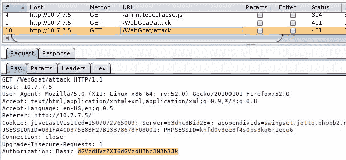

您可以使用 Burp Suite 的解码器将 base64 转换为 ASCII 文本：


# 消化

**摘要认证**明显比基本认证更安全。当客户端想要访问受保护的资源时，服务器会发送一个随机字符串，称为**nonce**作为质询。然后，客户机使用此 nonce 以及用户名和密码来计算 MD5 哈希，并将其发送回服务器进行验证。

# NTLM

**NTLM**是摘要身份验证的一种变体，其中 Windows 凭据和 NTLM 哈希算法用于转换应用程序用户名和密码的挑战。此方案需要多个请求-响应交换，服务器和任何中间代理必须支持持久连接。

# Kerberos

此身份验证方案使用**Kerberos**协议对服务器进行身份验证。与 NTLM 一样，它不要求用户名和密码，但使用 Windows 凭据登录。该协议在 web 服务器之外使用一个**认证服务器**（**作为**），它涉及一系列协商步骤以进行认证。这些步骤如下：

1.  客户端将用户名（ID）发送给 AS。
2.  AS 在数据库中查找 ID，并使用哈希密码加密会话密钥。
3.  AS 将加密的会话密钥和包含用户 ID、会话密钥、会话到期和其他数据的票证（TGT）发送到客户端，并使用服务器的密钥进行加密。如果密码不正确，客户端将无法解密其会话密钥。
4.  客户端解密会话密钥。
5.  当客户端想要访问 web 服务器上受保护的资源时，它需要在一条消息中发送 TGT 和资源 ID，在另一条消息中发送用会话密钥加密的客户端 ID 和时间戳。
6.  如果服务器能够对接收到的信息进行解密，它将使用使用 AS 的密钥和客户机/服务器会话密钥加密的客户机到服务器票据进行响应，并使用客户机的会话密钥进一步加密。
7.  有了来自 AS 的这些信息，客户机现在可以从 web 服务器请求资源。

在下图中，您可以以图形方式查看流程：


# HTTP 协商

**HTTP 协商**方案也称为*Windows 身份验证*，它使用 Windows 凭据并根据 Kerberos 是否可用在 Kerberos 和 NTLM 身份验证之间进行选择。

# 平台身份验证的缺点

尽管 Kerberos 和 NTLM 方案被认为是安全的，甚至可以通过 TLS 使用摘要或基本身份验证，恶意参与者拦截通信和窃取凭据的风险很低，但平台身份验证在安全性方面仍然存在一些固有的缺点。详情如下:

*   凭证发送的频率更高，因此在**中间人**（**MITM**）攻击中，凭证的曝光率和被捕获的风险更高，尤其是对于基本、摘要和 NTLM 方案。
*   平台身份验证没有注销或会话过期选项。由于使用 Windows 身份验证时**单点登录**（**SSO**）已就位，因此，当用户打开应用程序主页面时，会话将立即启动，而无需询问用户名和密码，如果会话过期，会话将自动续订。获得对用户计算机或 Windows 帐户访问权限的攻击者将获得对应用程序的即时访问权限。
*   平台身份验证不适用于公共应用程序，因为与最流行的基于表单的身份验证相比，它们需要更高的技术和管理工作来建立和管理。

# 基于表单的身份验证

这是我们更熟悉的一种身份验证：包含用户名和密码字段以及提交按钮的 HTML 表单：

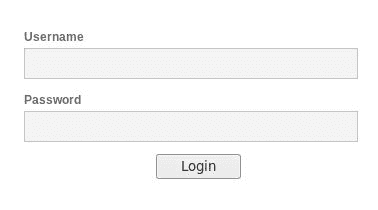

这种身份验证可能因情况而异，因为它的实现完全依赖于应用程序。然而，最常见的方法遵循以下步骤：

1.  用户填写身份验证表单并单击 Submit 按钮。然后，客户端（web 浏览器）将包含用户名和密码的请求以明文形式发送到服务器，除非客户端加密由应用程序完成。
2.  服务器接收信息并检查其数据库中是否存在用户，并比较存储和提交的密码（或密码哈希）。

3.  如果用户存在且密码正确，服务器将以肯定消息响应，该消息可能包括重定向到用户主页和会话标识符（通常作为 cookie），以便用户无需再次发送其凭据。

4.  客户端接收响应，存储会话标识符，并重定向到主页。

从渗透测试的角度来看，这是迄今为止最有趣的身份验证方法，因为没有标准的方法来做这件事（即使有最佳实践），而且由于不正确的实现，它通常是大量漏洞和安全风险的来源。

# 双因素认证

如前所述，为了向应用程序证明您的身份，您必须提供您知道的、您拥有的或您是的信息。这些标识符中的每一个都称为**因子**。**多因素认证**（**MFA**）源于需要为某些应用程序提供额外的安全层，并防止未经授权的访问，例如密码被攻击者猜测或窃取。

**双因素****认证**（**2FA**）在大多数 web 应用中意味着用户必须提供用户名和密码（第一因素）以及特殊代码或**一次性密码**（**OTP**），这是临时的，由用户拥有的设备随机生成，或由服务器通过 SMS 或电子邮件发送给他们。然后，用户将 OTP 提交回应用程序。除密码外，更复杂的应用程序还可以使用智能卡或某种形式的生物识别技术，如指纹。由于这需要用户拥有额外的硬件或专用设备，因此这些类型的应用程序不太常见。

大多数银行应用程序都实现了一种形式的 MFA，最近，公共电子邮件服务和社交媒体开始在其用户中推广和强制使用 2FA。

# 非统组织

**OAuth**是访问委托的开放标准。当 Facebook 或 Google 用户允许第三方应用程序访问其帐户时，他们不会与此类应用程序共享其凭据。相反，服务提供商（Google、Twitter 或 Facebook）共享一个特殊的访问令牌，允许此类应用程序检索有关用户帐户的特定信息，或根据用户授予的权限访问某些功能。

# 会话管理机制

**会话管理**包括在登录时创建或定义会话标识符、设置非活动超时、会话过期和注销时会话失效；此外，它还可以根据用户的权限扩展到授权检查，因为会话 ID 必须链接到用户。

# 基于平台身份验证的会话

当使用平台身份验证时，最常用的方法是使用已包含的标头（包含凭据），或质疑响应作为用户会话的标识符，并通过应用程序的逻辑管理会话过期和注销；尽管如此，如前所述，当平台身份验证到位时，通常会发现没有会话超时、过期或注销。

如果使用 Kerberos，则 AS 发出的令牌已包含会话信息，并用于管理此类会话。

# 会话标识符

会话标识符在表单身份验证中更常见，但在使用平台身份验证时也可能存在。**会话标识符**或**会话 ID**是每次用户在应用程序中启动会话时分配给他们的唯一编号或值。此值必须与用户的 ID 和密码不同。每次用户登录时，它必须不同，并且必须随每个请求一起发送到服务器，以便它能够区分来自不同会话/用户的请求。

在客户端和服务器之间发送会话 ID 的最常见方式是通过 cookie。一旦服务器接收到一组有效的用户名和密码，它就会将该登录信息与会话 ID 关联，并响应客户端，将此类 ID 作为 cookie 的值发送。

在以下屏幕截图中，您将看到一些包括会话 cookie 的服务器响应示例：

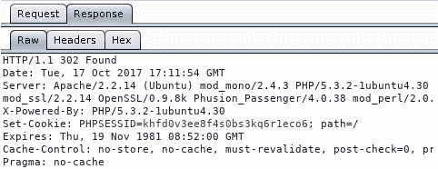

在前面的示例中，PHP 应用程序设置一个名为`PHPSESSID`的会话 cookie。


在前面的示例中，Java 应用程序设置了一个名为`JSESSIONID`的会话 cookie。

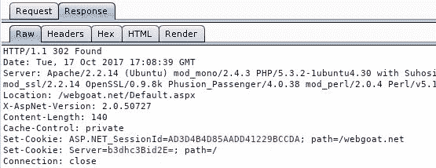

在前面的示例中，ASP.NET 应用程序设置一个名为`ASP.NET_SessionId`的会话 cookie。

# web 应用程序中常见的身份验证缺陷

我们花了一些时间讨论了不同的身份验证机制如何在 web 应用程序中工作。在本节中，您将学习如何识别和利用其中一些最常见的安全故障。

# 缺少身份验证或不正确的授权验证

在上一章中，您了解了如何使用 DIRB 和其他工具查找 web 服务器上任何页面都可能未引用或可能包含特权功能的目录和文件，如`/admin`和`/user/profile`。如果您能够直接浏览到这些目录并使用其中的功能而无需进行身份验证，或者如果您作为标准用户进行了身份验证，则您可以浏览到应用程序的管理区域，或者只需浏览到其他用户的配置文件即可修改其他用户的配置文件，然后，该应用程序在其身份验证和/或授权机制方面存在重大安全问题。

# 用户名枚举

在黑盒和灰盒渗透测试场景中，发现应用程序的有效用户列表可能是第一步，特别是如果这样的应用程序不是商业应用程序，那么您可以在线查找默认用户。

枚举 web 应用程序中的用户是通过分析在登录、注册和密码恢复页面等位置提交用户名时的响应来完成的。下面是一些常见的错误消息，您可以在向此类页面提交表单时找到这些消息，这些页面告诉您可以枚举用户：

*   `"User foo: invalid password"`
*   `"invalid user ID"`
*   `"account disabled"`
*   `"this user is not active"`
*   `"invalid user"`

让我们回顾一个非常简单的示例，该示例介绍如何从提供错误用户名时提供过多信息的 web 应用程序中发现有效用户名。使用 IP 地址为`10.7.7.5`的**断开的 Web 应用程序**（**BWA**虚拟机中的 OWASP WebGoat。

首先运行 Burp Suite 并将浏览器配置为将其用作代理（在 Firefox 中，导航到首选项|高级|网络|连接|设置）：


接下来，使用带有`webgoat`密码的`webgoat`默认用户登录到 WebGoat，然后转到“身份验证缺陷”|忘记密码：


这是密码恢复表单，需要用户名才能继续恢复过程。您可以输入一个不存在的用户名，如`nonexistentuser`，然后提交查看结果：


用户名无效，您将无法继续密码恢复。您可以假设，当用户有效时，您将得到不同的响应。

现在，让我们使用 Burp Suite 的入侵者来尝试找到一个有效的名称。首先，您在 Burp 代理的历史记录中查找请求并将其发送给入侵者（按*Ctrl*+*I*或右键单击并选择发送给入侵者）：

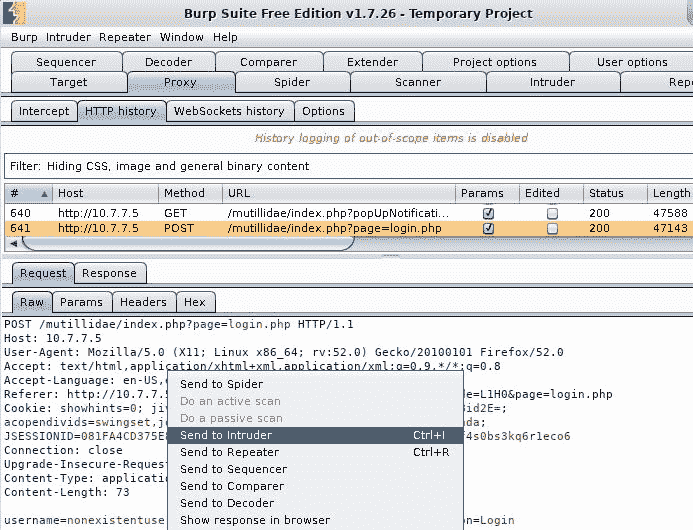

接下来，切换到入侵者选项卡，然后是请求的编号，最后是位置。您可以看到，默认情况下选择了所有客户端可修改的参数。单击“清除”取消选择它们，然后仅选择用户名值并单击“添加”：


入侵者自动向服务器发送多个请求，用用户提供的输入替换选定的值，并记录所有响应，以便您可以分析它们。现在添加要尝试的用户名列表，而不是已经提交的用户名列表。

Burp 入侵者有四种不同的攻击类型，它们描述了如何用有效载荷填充输入：

*   **狙击手** ：这使用单个有效载荷集，并为该有效载荷集中的每个值选择每个输入位置，一次一个。请求的数量将是有效负载集的长度乘以输入位置的数量。
*   **打击油缸** ：使用单个有效载荷集，并为该有效载荷集中的每个值同时选择所有输入位置。请求数将是有效负载集的长度。
*   **干草叉** ：使用多个输入位置，每个位置需要设置有效载荷。它一次为其相应输入中的每个有效负载集提交一个值。发出的请求数将是最短有效负载集的长度。
*   **集束炸弹** ：当使用多个输入时，有效载荷集 1.中的所有元件将与有效载荷集 2.的所有元件配对，依此类推，直到有效载荷集 *n*为止。攻击中发出的请求数是通过乘以所有有效负载集的大小来确定的。

接下来，切换到入侵者内部的“有效载荷”选项卡。保持有效负载设置不变，然后单击加载。。。在有效载荷选项[简单列表]部分；这是为了加载包含要尝试的名称的文件。幸运的是，Kali Linux 在`/usr/share/wordlists`目录中包含了大量字典和单词表。

在本例中，您将使用`/usr/share/wordlists/metasploit/http_default_users.txt`：


现在已经定义了输入位置并准备好有效负载列表的请求，请单击开始攻击：

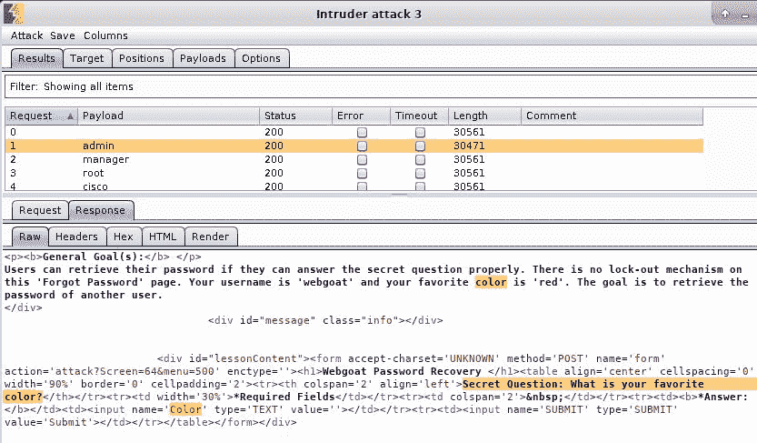

正如您在结果中所看到的，所有尝试的名称都有相同的响应；也就是说，除了一个。你会注意到`admin`有一个不同长度的响应，如果你浏览响应的主体，你会发现它在问密码恢复问题。所以，`admin`是一个有效的用户名。

每当应用程序显示有效和无效用户名的不同响应时，都可以执行用户名枚举。此外，一些应用程序在注册新用户时包含验证，以便名称不会重复。如果此验证在提交表单之前完成，则会有一个 web 服务执行此类验证，您可以将其用于枚举。

# 通过暴力和字典攻击发现密码

一旦在应用程序中识别出有效的用户，下一步自然是尝试查找这些用户的密码。从用户那里获取有效密码的方法有很多，从在不同的服务器上模仿原始站点，使用社会工程诱骗用户提交信息，到利用不安全的密码恢复机制，再到猜测密码（如果密码是常见的话）。

**暴力**是一种尝试所有可能的字符组合来发现有效密码的方法。当应用程序允许使用一到三个甚至四个字符的密码时，这可以很好地工作。如果允许这样的密码，那么至少有一个用户在使用它们。

对于较长的密码，暴力攻击是完全不切实际的，因为在发现一个有效密码之前，您需要向应用程序发送数百万（或数十亿）个请求。此外，执行此类攻击所需的时间比渗透测试计划的标准一周或两周要长得多（非常长）。在这种情况下，我们依赖于人为因素的可预测性，即使出于实际目的，八个或更多字符密码的可能组合几乎是无限的，我们人类倾向于仅使用这些组合中的一小部分作为密码，而最常见的密码是非常常见的。

为了利用这一事实，有些字典包含常用或默认密码，或者已知在以前对流行站点的攻击中泄露的密码。使用这些字典，您可以减少查找有效密码所需的尝试次数，并增加在字典中查找有效密码的机会，许多人已经将其用作密码。

根据对黑客和泄露密码收集的分析，自 2012 年以来，SplashData 发布了世界上使用最多的密码列表。2017 年和 2016 年的结果可在[查看 https://www.teamsid.com/worst-passwords-2017-full-list/](https://www.teamsid.com/worst-passwords-2017-full-list/) 和[https://www.teamsid.com/worst-passwords-2016/](https://www.teamsid.com/worst-passwords-2016/) 。另一个每年发布的列表是 Keeper 密码管理器的列表：[https://blog.keepersecurity.com/2017/01/13/most-common-passwords-of-2016-research-study/](https://blog.keepersecurity.com/2017/01/13/most-common-passwords-of-2016-research-study/) 。

# 用 THC-Hydra 攻击基本身份验证

**THC Hydra**是黑客和渗透测试人员长期喜爱的在线密码破解工具。

在线破解意味着实际尝试登录服务。当安全和监视工具就位时，这可能会产生大量流量并在服务器上发出警报。因此，在尝试对应用程序或服务器进行在线暴力攻击或字典攻击时，应特别小心，并调整参数，以便在不影响服务器、发出警报或锁定用户帐户的情况下获得尽可能快的速度。

进行在线攻击的一个很好的方法是，在进行监控或在一定次数的失败尝试后锁定帐户时，每个用户使用三个或四个密码，或者使用少于锁定阈值的密码。以最明显或最常见的密码（例如，`password`、`admin`或`12345678`）为例，如果没有得到任何结果，则返回到侦察阶段以获得更好的密码集，并在几分钟或几小时后重试。

THC Hydra 能够连接到广泛的服务，如 FTP、SSH、Telnet 和 RDP。我们将使用它对使用基本身份验证的 HTTP 服务器进行字典攻击。

首先，您需要知道实际处理登录凭据的 URL。弹出您的*卡利机器*，打开 Burp Suite，并将浏览器配置为将其用作代理。您将使用易受攻击的虚拟机和 WebGoat 应用程序。当您尝试访问 WebGoat 时，会出现一个询问登录信息的对话框。如果您提交任意随机名称和密码，您将再次看到相同的对话框：

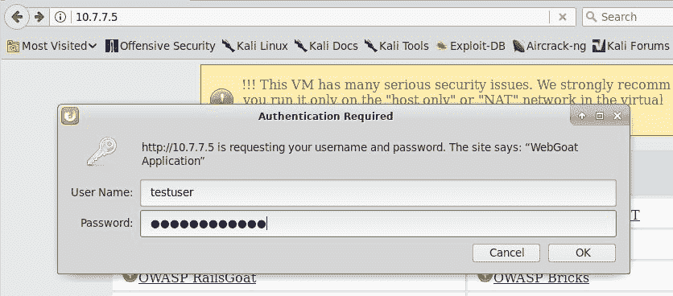

即使尝试未成功，请求也已在 Burp 中注册。下一步，寻找一个有`Authorization: Basic`标题的：

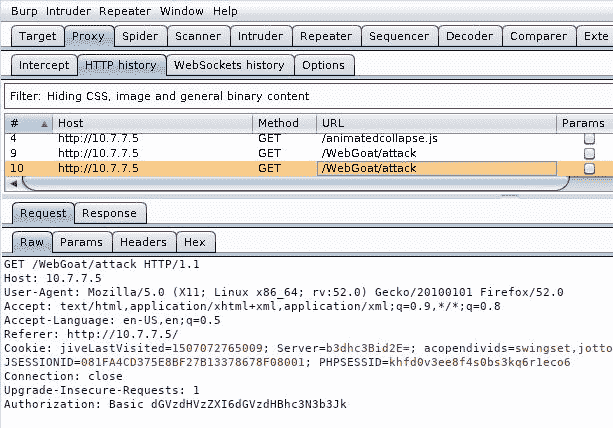

现在您知道处理登录的 URL 是`http://10.7.7.5/WebGoat/attack`。这些信息足以运行 Hydra，但首先需要有一个可能的用户名列表和另一个密码列表。在真实场景中，可能的用户名和密码取决于组织、应用程序以及您对其用户的了解。对于此测试，您可以使用名为 WebGoat 的应用程序的以下可能用户列表，并将其指定为安全测试的目标：

```
admin 
webgoat 
administrator 
user 
test 
testuser 
```

至于密码，您可以尝试一些最常见的密码，并添加应用程序名称的变体：

```
123456 
password 
Password1 
admin 
webgoat 
WebGoat 
qwerty 
123123 
12345678 
owasp 
```

将用户名列表保存为`users.txt`，密码列表保存为`passwords.txt`。首先，不带任何参数运行`hydra`查看帮助和执行信息：

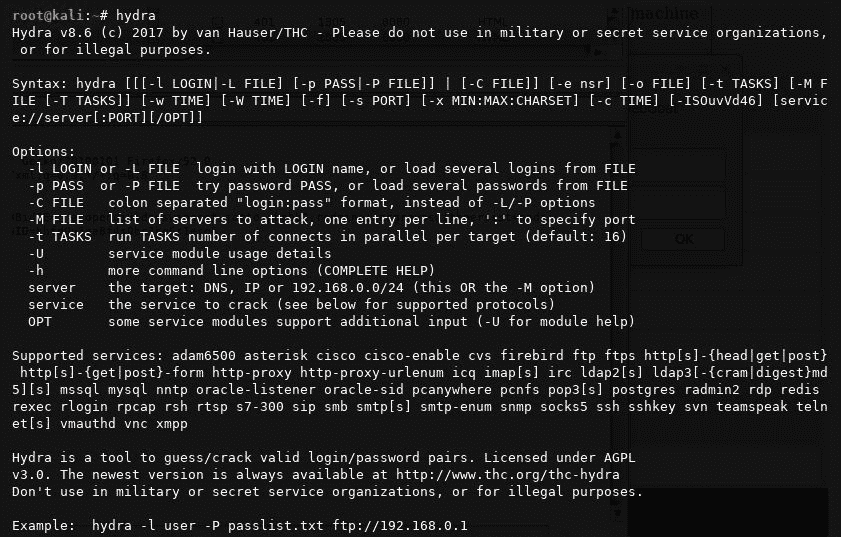

您可以看到，它需要`-L`选项来添加用户列表文件，`-P`来添加密码列表文件，协议、服务器、端口以及此表单中的可选信息：`protocol://server:port/optional`。运行以下命令：

```
hydra -L users.txt -P passwords.txt http-get://10.7.7.5:8080/WebGoat/attack  
```


您会发现服务器接受了`webgoat`用户和`webgoat`密码的组合。

当使用 Hydra 时，一个有用的选项是`-e`和`n`、`s`或`r`修饰符，它们可以处理登录输入，发送空密码（`n`），用户名作为密码（`s`），反转用户名并将其用作密码（`r`），以及`-u`，首先循环用户。这意味着它使用一个密码尝试所有用户，然后转到下一个密码。这可能会防止你被某些防御机制锁定。

# 攻击基于表单的身份验证

由于没有标准实现，而且 web 应用程序在验证和攻击预防方面更加灵活，因此登录表单在使用暴力强制时会带来一些特殊挑战：

*   用户名和密码参数中没有标准名称、位置或格式
*   对登录尝试没有标准的否定或肯定响应
*   客户端和服务器端验证可以防止某些类型的攻击或请求的重复提交
*   认证可以在多个步骤中完成；也就是说，在一页中询问用户名，在下一页中询问密码

幸运的是，对于渗透测试人员来说，大多数应用程序使用 HTML 表单的基本模式，通过`POST`请求发送，包括用户名和密码作为参数，并在成功登录时重定向到用户主页，如果失败，则错误或重定向到登录页面。现在，您将研究用于对此类表单执行字典攻击的两种方法。同样的原则适用于几乎所有基于表单的身份验证，并对响应的解释方式和提交所需的参数进行了一些修改。

# 使用 Burp 套件入侵者

与基本身份验证攻击一样，您首先需要识别执行实际身份验证的请求及其参数，以便攻击正确的请求。

在下面的屏幕截图中，在左侧，您将看到身份验证表单中的 OWASP 砖块（在易受攻击的虚拟系统主菜单中，转到砖块|登录页面|登录#3），在右侧，您可以通过`POST`方法查看请求。您会看到，`username`和`passwd`参数在主体中发送，而没有`Authorization`头：

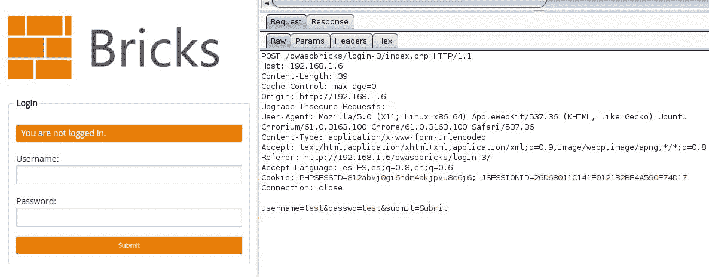

要在此登录页面上执行字典攻击，首先需要分析响应，以确定失败登录与成功登录的区别：


在屏幕截图中，您可能会看到失败的响应包含`"Wrong user name or password."`文本。当然，这不会在成功登录中出现。

接下来，向入侵者发送请求，并选择`username`和`passwd`参数作为输入。然后，选择集束炸弹作为攻击类型：


接下来，转到“有效载荷”选项卡，选择有效载荷集`1`，并加载包含我们之前使用的用户名的文件：


对于有效载荷集`2`，我们还将使用上一练习中使用的密码文件：

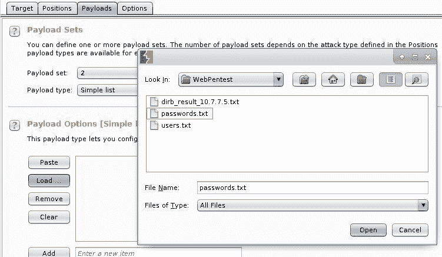

正如您在本屏幕截图中所看到的，`60`向服务器发出请求，因为您有 6 个用户名和 10 个可能的密码：


您可以在此时发起攻击，然后分析响应，并了解某个登录组合是否成功。然而，Burp 入侵者有一些可以让您的生活更轻松的功能，不仅仅是像这样简单的例子，而且在攻击复杂的现实世界应用程序时。转到选项选项卡，然后转到 Grep-Match，让入侵者在响应中查找一些特定的文本，以便您可以轻松识别成功的文本。单击“标记响应与这些表达式匹配的结果项”框，清除当前列表，然后在“输入新项”框中输入以下内容：

```
Wrong user name or password. 
```

按*输入*或点击添加。入侵者将标记包含此消息的所有响应；因此，未标记的可能表示成功登录。如果您知道正确的登录消息，则可以查找该消息并直接标识一组正确的凭据：


启动攻击，并等待结果：


看起来您至少找到了一个有效的用户名及其密码。

# 使用 THC Hydra

Hydra 支持的众多协议中有`http-get-form`、`http-post-form`、`https-get-form`、`https-post-form`，分别是`GET`和`POST`方式发送的 HTTP 和 HTTPS 登录表单。使用上一练习中的相同信息，可以使用以下命令使用 Hydra 运行字典攻击：

```
hydra 10.7.7.5 http-form-post "/owaspbricks/login-3/index.php:username=^USER^&passwd=^PASS^&submit=Submit:Wrong user name or password." -L users.txt -P passwords.txt  
```

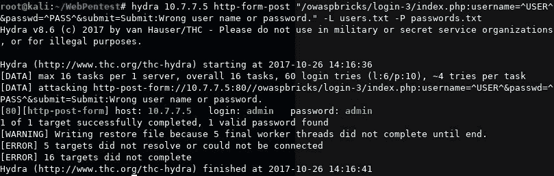

您可能会注意到，本例中的语法与之前使用的 Hydra 略有不同。让我们一起来看看：

1.  首先，您有`hydra`命令和目标主机（`hydra 10.7.7.5`。
2.  然后是要测试的协议或服务（`http-form-post`。
3.  接下来是引号（`""`中的协议特定参数，并用冒号分隔：
    1.  URL（`/owaspbricks/login-3/index.php`）
    2.  请求主体，由`^USER^`表示，Hydra 应将用户名放在哪里，`^PASS^`表示密码应该放在哪里
    3.  登录失败的消息（`Wrong user name or password.`
    4.  最后是由`-L`和`-P`指示的用户名和密码列表

# 密码重置功能

web 应用程序中另一个常见的弱点是密码恢复和重置功能的实现。

由于应用程序需要对用户友好，并且一些用户忘记了密码，因此应用程序需要采用一种方法，允许这些用户重置或恢复密码。为这个问题提出一个安全的解决方案并非易事，许多开发人员可能会留下一些薄弱环节，渗透测试人员或攻击者可以利用这些薄弱环节。

# 恢复而不是重置

当遇到用户忘记密码时该怎么办的问题时，您可以在两个主要选项中进行选择：

*   允许他们恢复旧密码
*   允许他们重置它

应用程序允许用户恢复其旧密码这一事实假定应用程序设计中存在一些安全缺陷：

*   密码以可恢复的方式存储在数据库中，而不是使用单向散列算法，这是存储密码的最佳实践。
*   在服务器端代码中，客户服务代理或系统管理员可以恢复密码。攻击者也可以通过社会工程或技术利用来实现这一点。
*   当通过电子邮件、电话或在网页上显示的方式将密码传回给用户时，密码将面临风险。中间人或旁观者可以通过多种方式获取此类信息。

# 常见密码重置缺陷

应用程序用于允许用户恢复或重置密码的一种非常常见的方法是询问一个或多个问题，其中只有合法用户应该知道答案。这包括出生地、第一所学校、第一只宠物的名字和母亲的婚前姓。当应用程序提出的问题对潜在的攻击者来说不是那么秘密时，问题就开始了。如果用户是知名人士，如名人或政治家，那么当他们的许多生活细节公开时，这个问题就会增加。

第二层保护是不允许直接访问密码重置功能，而是通过密码重置链接发送电子邮件或短信。如果在尝试重置密码时请求此电子邮件或电话号码，则您可能会伪造此信息，用您的号码替换用户的号码，并重置任何用户的密码。

如果电子邮件或电话号码已正确验证，并且不可能欺骗它们，则仍然有可能未正确执行重置链接。有时，这些链接包含一个指示 ID 的参数，例如密码将被重置的用户的号码或名称。在这种情况下，您需要做的就是使用您控制的用户生成链接，并将该参数更改为您要重置其密码的用户之一。

另一个可能的失败是，这种重置链接在第一次合法使用后不会失效。在这种情况下，如果攻击者通过任何方式获得对此类链接的访问权，他们可以再次访问该链接并重置用户密码。

# 2FA 实现中的漏洞

web 应用程序中最常见的 MFA 形式是使用随机生成的数字（四到八位数）作为 OTP，用户可以从特殊设备、移动应用程序（如 Google Authenticator、Authy、1Password 或 LastPass Authenticator）或通过服务器请求发送的 SMS 或电子邮件获得 OTP。

当存在以下条件时，您可以在渗透测试期间检测并利用此过程中的一些实现缺陷：

*   OTP 编号不是完全随机的，可以预测。
*   OTP 未链接到分配给它们的用户。这意味着您可以为一个用户生成 OTP，并与另一个用户一起使用。
*   同一密码或令牌可以多次使用。
*   OTP 提交尝试没有限制。这就增加了暴力攻击的可能性，因为 OTP 通常是短串数字，所以暴力攻击更可能成功。
*   通过电子邮件或 SMS 发送 OTP 时，用户信息未经验证，从而允许攻击者伪造电子邮件地址或电话号码。
*   OTP 的到期时间对于应用程序而言太长。这将扩展攻击者获取有效、未使用令牌的时间窗口。
*   新生成的 OTP 不会使以前的 OTP 无效，因此，例如，如果用户多次请求同一操作的令牌或密码，因为网络在第一次尝试时失败，攻击者可能会使用先前的尝试复制该操作或执行另一次接受同一令牌的操作，即使在合法行动已经执行之后。
*   依赖于从何处访问应用程序的设备。如今，人们的手机上有银行应用程序、个人电子邮件、社交网络、工作电子邮件和许多其他应用程序。因此，在使用电子邮件、短信或移动应用程序作为身份验证的第二个因素时，您应该三思而后行。

# 检测和利用不正确的会话管理

如前所述，会话管理允许应用程序跟踪用户活动并验证授权条件，而无需用户在每次发出请求时提交其凭据。这意味着，如果会话管理未正确完成，用户可能会访问其他用户的信息或执行超出其权限级别的操作，或者外部攻击者可能会访问用户的信息和功能。

# 使用 Burp Sequencer 评估会话 ID 的质量

**Burp Sequencer**是一种统计分析工具，可让您收集大量值，如会话 ID，并对其执行计算，以评估它们是随机生成的，还是只是模糊或编码的。这在处理复杂的会话 cookie 时非常有用，因为它可以让您了解 cookie 是如何生成的，以及是否有某种方法可以攻击或预测它们。

要使用 Burp Sequencer，首先需要找到设置会话 cookie 的响应。它通常是对带有`Set-Cookie`头的成功登录的响应。在以下屏幕截图中，您可以看到为 WebGoat 的会话劫持练习设置会话 cookie（`WEAKID`）的响应（转到 WebGoat |会话管理缺陷|劫持会话）：


乍一看，反应的价值似乎是独一无二的，难以猜测。第一部分看起来像一个 ID，第二部分看起来像一个时间戳，可能是以纳秒为单位的过期时间。应该很难猜到一个会话结束的精确时间是多少纳秒，对吗？你会发现，这不是最好的方法。

在 Burp 代理的历史记录中找到该响应，然后右键单击它。然后您将看到 Send to Sequencer 选项。进入 Sequencer 后，您需要选择响应的哪一部分：

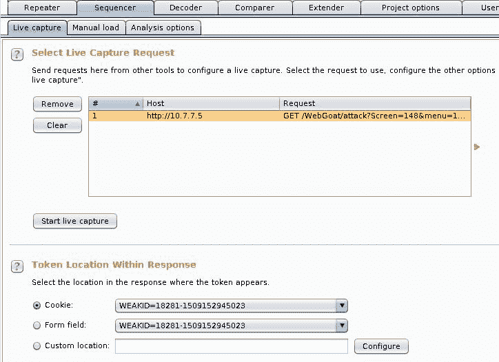

您可以选择分析 cookie、表单字段或响应的自定义部分。在这种情况下，选择`WEAKID`cookie 并单击 Start live capture。它将开始向服务器发出请求，以捕获尽可能多的不同 cookie 值。完成后，单击“立即分析”以执行分析。在结果中，Sequencer 将指示分析的值是否足够随机，是否是会话 ID 的良好选择。如您所见，`WEAKID`较弱且易于预测：


**熵**是对一条信息的随机性水平的度量。结果表明，`WEAKID`具有零随机性，这意味着它是完全可预测的，并且不是会话 ID 的好选择。Sequencer 还提供了关于字符串中每个字节和位的分布和重要性的更详细信息。

在下面的屏幕截图中，您将看到角色分析图表。您可以看到位置`3`、`4`、`15`、`16`和`18`中的字符变化比位置 0 或 5 到 13 中的字符变化要大得多，这些字符似乎根本没有变化。此外，字符 0 到 4 表示计数器或递增的数字，因为最后一个字符的变化大于前一个字符，并且该字符的变化大于前一个字符，依此类推。我们将在下一节中对此进行验证：


# 预测会话 ID

我们已经确定了一个似乎可以预测的会话 ID。现在，让我们尝试找到一个有效的会话。为此，您将接受接收 cookie 的相同请求并将其发送给入侵者。在这种情况下，您只需要重复多次相同的请求。但是，入侵者需要有插入点才能运行，因此在请求中添加一个头（`Test: 1`，并在其值中设置插入位置：

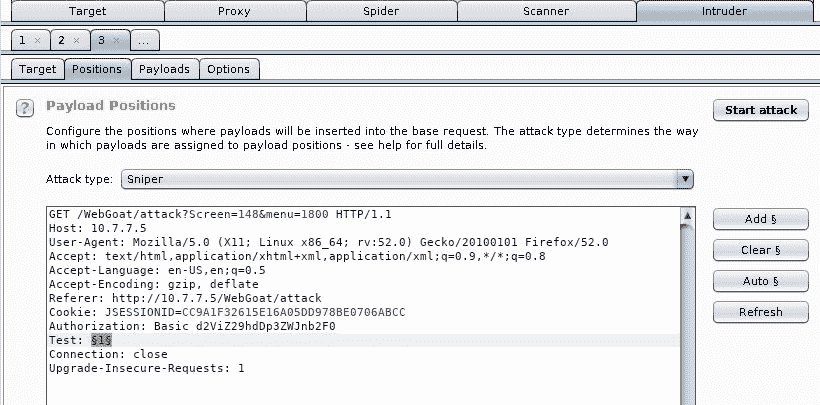

您将在本测试中发送`101`请求，因此将有效负载设置为数字类型，从 0 依次增加到 100：

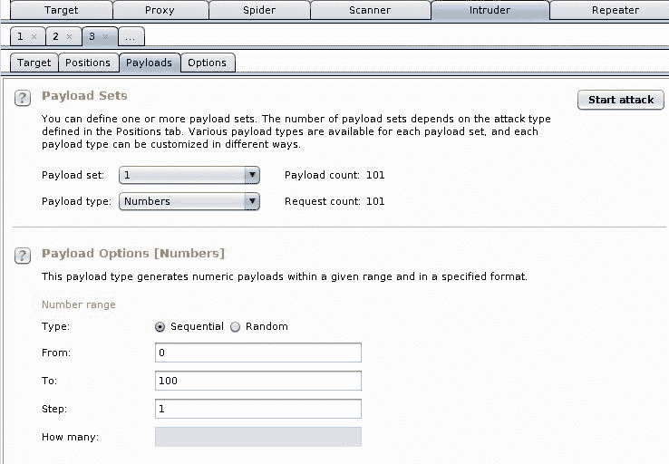

现在转到 Options 选项卡，在 Grep Extract 部分添加一项。确保选中了“基于以下选择更新配置”复选框，并仅选择 cookie 的值：

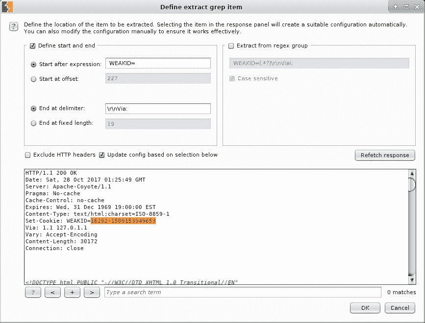

单击确定，然后单击开始攻击。

现在您可以在入侵者的结果表中看到`WEAKID`值，并且您可以验证 cookie 值的第一部分是一个序列号，第二部分也总是在增加。这取决于服务器接收请求的时间。如果您查看以下屏幕截图，可以看到序列中存在一些间隙：

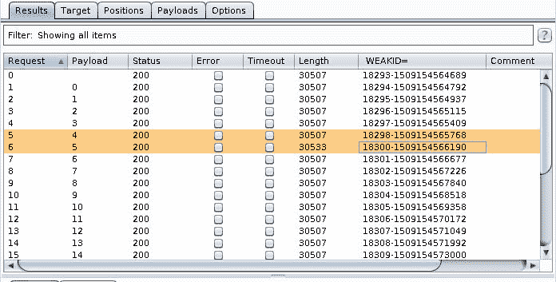

当前活动会话的前半部分为`18299`。我们知道这是因为服务器没有给我们这个值，而且我们知道它会随着每个请求而增加。我们还知道，第二部分是时间戳，它还取决于分配会话 cookie 的时间。因此，我们寻求的值的第二部分必须位于我们已知的两个值之间：`1509154565768`和`1509154566190`。由于这两个数字之间的差异很小（422），我们可以很容易地使用入侵者强制执行该值。

现在，将相同的原始请求再次发送给入侵者。这一次，添加一个 cookie 到它。在`JSESSIONID`的值之后，添加以下内容（记住根据您的结果调整值）：

```
; WEAKID=18299-1509154565768
```

选择最后四个字符，并在其中添加位置标记：

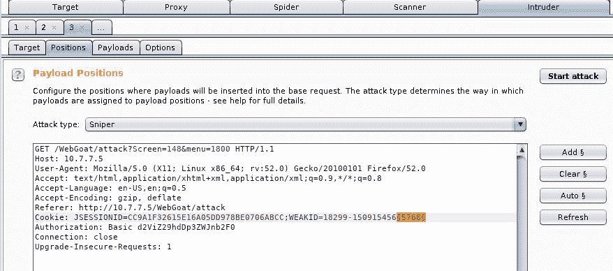

现在，在“有效载荷”选项卡中，攻击将尝试从 5768 到 6190 的数字：


最后，添加一个要匹配的表达式，这样您就可以清楚地知道何时有一个成功的结果。此时，您只知道未经身份验证的用户应该拥有的消息。您可以假定，不会请求经过身份验证的用户（具有有效的会话 cookie）登录：


启动攻击，并等待入侵者发现：


您现在有了一个有效的会话 ID。要使用它，您只需将会话 cookie 的值替换为您刚刚找到的值，然后访问页面劫持其他人的会话即可。我把这个留给你测试。

# 会话固定

有时，用户提供的信息用于生成会话 ID，或者更糟的是，用户提供的信息*变成了*会话 ID。当发生这种情况时，攻击者可以强制用户使用预定义的标识符，然后监视应用程序，以确定该用户何时启动会话。这被称为**会话固定**。

WebGoat 对此漏洞有一个简单但非常说明性的演示（请访问 WebGoat |会话管理缺陷|会话固定）。我们将用它来说明如何执行此攻击。

1.  第一步将您设置为攻击者。您需要制作一封电子邮件，在发送给受害者的链接中包含会话 ID（`SID`值，因此将该参数与任何值一起添加到链接中，例如`&SID=123`：

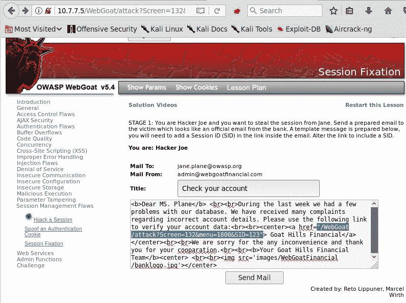

攻击者发现 Goat Hills 金融网站使用 GET 参数定义会话标识符，并向该机构的客户端发送钓鱼电子邮件。

2.  在本练习的这一步中，您充当受害者，接收来自攻击者的电子邮件：


由于该电子邮件来自`admin@webgoatfinancial.com`，因此看起来是合法的，因此您单击该链接，该链接会将您发送到登录页面，并相应地登录。现在有一个使用攻击者发送的参数的有效会话。

3.  下一阶段要求攻击者登录到与受害者相同的站点：


您使用 Burp Proxy 截获请求，并对其进行编辑，以包含受害者用于登录的`SID`参数：

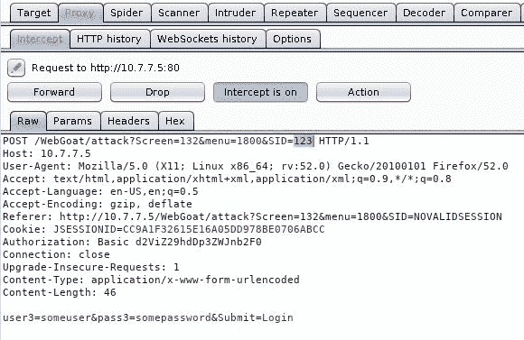

4.  您现在可以访问受害者的个人资料：


在本例中，会话 ID 的管理方式存在两个主要缺陷：

*   首先，会话 ID 是通过用户提供的信息生成的，这使得攻击者更容易识别有效值并将其与现有用户关联。
*   其次，一旦启动经过身份验证的会话（例如，在受害者登录后），标识符就不会改变，这是术语“会话固定”的由来，因为攻击者能够预设会话 ID 将为受害者提供的值，使使用相同的值劫持受害者经过身份验证的会话成为可能。

# 防止身份验证和会话攻击

web 应用程序中的身份验证是一个很难解决的问题，迄今为止还没有找到通用的解决方案。因此，防止应用程序这一领域的漏洞在很大程度上是针对具体情况的，开发人员需要根据他们处理的特定用例和用户配置文件在可用性和安全性之间找到平衡。

我们甚至可以对会话管理这样说，因为当前的方法仍然代表了 HTTP 协议缺陷的解决方法。也许随着 HTML5 和 WebSockets 或类似技术的出现，您将来会有一些更好的选择。

然而，可以为身份验证和会话管理定义一些通用准则，这将有助于开发人员提高攻击者的安全性，我们可以在查找缺陷和向客户端提出建议时将这些准则用作参考。

# 认证指南

以下是身份验证准则列表：

*   用户名或用户标识符对于每个用户都必须是唯一的，并且不区分大小写（`user`与`User`相同）。
*   强制执行强密码策略，以防止将以下内容用作密码：
    *   用户名作为密码
    *   短密码（即少于八个字符）
    *   单格密码，即全小写或全大写
    *   单个字符集，例如所有数字、所有字母，并且不使用特殊字符
    *   编号顺序（1234569876543210）
    *   名人、电视节目、电影或虚构人物（超人、蝙蝠侠、星球大战）
    *   公共字典中的密码，例如前 25 位最常用的密码

*   始终使用安全协议（如 TLS）提交登录信息。
*   不要在错误消息或响应代码中披露有关用户名存在或有效性的信息（例如，当找不到用户时，不要使用 404 代码进行响应）。
*   为了防止暴力攻击，在一定次数的失败尝试后实施临时锁定：五次是一个平衡的数字，因此连续五次登录失败的用户将被锁定一段时间，例如二十或三十分钟。
*   如果实施了密码重置功能，请询问用户名或电子邮件以及安全问题（如果可用）。然后，通过短信向用户注册的电子邮件或手机发送一次性重置链接。此链接必须在用户重置密码后禁用，或者在一段时间后禁用，如果没有重置，可能需要几个小时。
*   在实施 MFA 时，如果使用移动应用程序或 RSA 或 Gemalto 设备（如果需要物理令牌或智能卡），则支持使用第三方和经过广泛测试的框架，如 Google Authenticator 或 Authy。
*   避免实现自定义或自制的加密和随机生成模块，并支持来自知名库和框架的标准算法。
*   请求对敏感任务进行重新身份验证，例如用户权限更改、敏感数据删除或修改全局配置更改。

OWASP 在[上提供了关于在 web 应用程序上实施身份验证的最佳实践的快速指南 https://www.owasp.org/index.php/Authentication_Cheat_Sheet](https://www.owasp.org/index.php/Authentication_Cheat_Sheet) 。

# 会议管理准则

以下是会话管理指南的列表：

*   无论使用何种身份验证机制，始终实施会话管理，并在每个页面和/或请求上验证会话。
*   使用长、随机和唯一的会话标识符。支持主要 web 开发语言（如 ASP.NET、PHP 和 J2EE）中已经实现的机制。
*   为登录和注销时的用户生成新会话 ID。永久性地使使用过的失效。
*   在合理的不活动时间（15 到 20 分钟）后，使会话无效并注销用户。在安全性和可用性之间提供良好的平衡。
*   始终为用户提供明确的注销选项；也就是说，有一个注销按钮/选项。
*   使用会话 cookie 时，请确保设置了所有安全标志：
    *   `Secure`属性用于防止在非加密通信上使用会话 cookie。
    *   `HttpOnly`属性用于防止通过脚本语言访问 cookie 值。这减少了**跨站点脚本**（**XSS**攻击）的影响。
    *   使用非持久会话 cookie，不带`Expires`或`Max-Age`属性。
    *   将`Path`属性限制为服务器的根目录（`/`或承载应用程序的特定目录。
    *   `SameSite`属性目前仅受 Chrome 和 Opera web 浏览器支持。这通过防止外部站点将 cookie 发送到服务器，提供了额外的信息泄漏和**跨站点请求伪造**（**CSRF**）保护。
*   将会话 ID 与用户的角色和权限链接，并使用它验证每个请求的授权。

有关此主题的更深入建议，请参见 OWASP 的*会话管理备忘表*，网址为[https://www.owasp.org/index.php/Session_Management_Cheat_Sheet](https://www.owasp.org/index.php/Session_Management_Cheat_Sheet) 。

# 总结

在本章中，我们回顾了 web 应用程序执行用户身份验证以限制对特权资源或敏感信息的访问的不同方式，并研究了会话是如何维护的，因为 HTTP 没有内置的会话管理功能。在当今的 web 应用程序中，最常用的方法是基于表单的身份验证和在 cookie 中发送的会话 ID。

我们还研究了身份验证和会话管理中最常见的安全故障点，以及攻击者如何使用内置浏览器工具或 Kali Linux 中包含的其他工具（如 Burp Suite、OWASP ZAP 和 THC Hydra）对其进行攻击。

在最后一节中，我们讨论了一些最佳做法，这些做法可能通过要求使用复杂、随机的会话 ID 对应用程序的所有特权组件进行身份验证，并强制实施强密码策略，从而防止或缓解身份验证和会话管理缺陷。这些是针对此类缺陷的一些最重要的预防和缓解技术。

在下一章中，我们将介绍最常见的注入漏洞，如何在渗透测试中检测和利用它们，以及为了修复应用程序和防止通过这些技术进行的攻击成功而需要采取的措施。